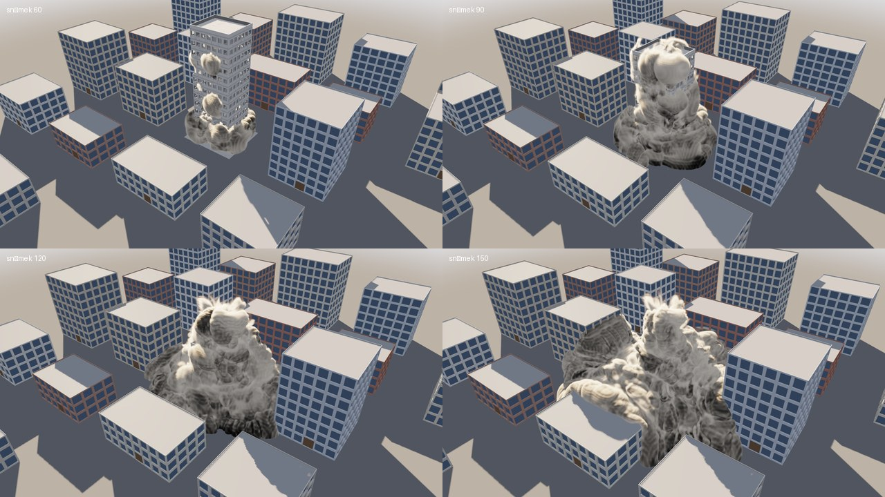

# Roadmapa

> Stav dokumentu: **v3** · Poslední aktualizace: 2026-09-27
>
> Živý dokument. Verze 1 (2026-09-21) plánovala headless knihovnu pro
> geometrii, GUI až ve třetí fázi a simulace po verzi 1.0. Cíl se změnil:
> **prototyp profesionálního softwaru typu Houdini** — celá cesta od
> geometrie přes simulace po obrázek a export. Verze 1 je v historii gitu
> (`git show a8058b2:ROADMAP.md`); její měřená kritéria platí dál a prototyp
> je ověřuje ([§3](#3-co-je-hotové)). Verze 3 rozepsala, co chybí k použití
> ve VFX studiu: krok 3 je napojení do pipeline (USD, farma, EXR), krok 4
> destrukce pro produkci, krok 5 měřítko.
>
> Související: [ARCHITECTURE.md](ARCHITECTURE.md) — datový model, cook engine
> a to, co z toho prototyp ověřuje.

---

## 1. Cíl

Node-based procedurální software pro geometrii a vizuální efekty, po vzoru
Houdini:

| Vrstva | Co to znamená |
|---|---|
| Geometrie | Uzly jako SOP: atributy na bodech, rozích, primitivech i celé geometrii, skupiny, objemy; líné vaření jen toho, co se změnilo |
| Jazyk | Wrangle: vlastní výpočet nad každým prvkem, s proměnnými, podmínkami, cykly a dotazy na geometrii |
| Procedurálnost | Výrazy a odkazy v parametrech, subnety a digital assets, smyčky |
| Simulace | Kouř a oheň, voda (FLIP), déšť a vítr; tuhá tělesa a destrukce; později látky |
| Obraz | Viewport, kamera, render záběru do obrázků a videa |
| Pipeline | Příkazová řádka, cache na disku, export (PLY, OBJ, OpenVDB, USD), Python API |

Inspirace v Houdini je koncepční. Implementace je **clean room**: žádný HDK,
žádný reverse engineering, žádné přebírání dokumentace.

### Co to (zatím) není

- **Produkční nástroj.** Simulace počítají husté mřížky na CPU, renderer je
  náhledový (bez path tracingu), editor stojí na Dear ImGui. Prototyp má
  ukázat, že architektura drží pohromadě, a změřit, kolik co stojí.
- **Kompletní parita s Houdini.** Hodnota není v počtu uzlů, ale v tom, že
  pár dobře navržených uzlů nad správným datovým modelem pokryje většinu úloh.
- **Compositing, zvuk, rigging a animace postav** — jiné kontexty.

---

## 2. Architektonické invarianty

Tato pravidla platí ve všech fázích. Porušení kteréhokoliv z nich je důvod
k zamítnutí PR — ne proto, že jsou posvátná, ale protože se **nedají dodělat zpětně**.
Rozbor každého z nich je v [ARCHITECTURE.md §2](ARCHITECTURE.md#2-invarianty).

1. **Copy-on-write na úrovni jednotlivých atributových polí.**
   Node, který mění `P`, sdílí všechna ostatní pole přes refcount. Nikdy nekopíruje celou geometrii.
2. **Struct-of-arrays.** Atribut je souvislé typované pole. Žádné `struct Point { ... }`.
3. **Jeden geometrický kontejner pro vše.** Polygony, křivky, volumes, packed prims, instance.
   Oddělené typy geometrie = ztráta kompozicionality.
4. **Líná pull evaluace.** Data se počítají až na vyžádání a jen to, co je špinavé.
5. **Determinismus.** Stejná scéna → bit-identický výstup, nezávisle na počtu vláken a platformě.
6. **Headless-first.** Každá funkce musí jít použít bez GUI. GUI je klient knihovny, ne naopak.
7. **Žádná globální mutovatelná data.** Cook musí být volatelný z více vláken a reentrantní.
8. **Verzovaný typ nodu.** Každý node má verzi a migrační cestu od prvního commitu.

---

## 3. Co je hotové

| Oblast | Stav | Dokumentace |
|---|---|---|
| Jádro | COW atributy, cook engine s verzemi a cache, časová závislost, deterministický paralelismus, per-element jazyk (interpret) | [ARCHITECTURE.md](ARCHITECTURE.md) |
| Shader graf | Uzly z textu, čtyři cíle (GLSL, GLSL ES, Vulkan, HLSL), editor s náhledem | [docs/shader-graph.md](docs/shader-graph.md) |
| Simulace | Kouř a oheň, voda (FLIP), déšť a vítr; z uzlů, deterministicky na libovolném počtu vláken | [docs/pyro.md](docs/pyro.md) |
| Destrukce | Voronoi Fracture, tuhá tělesa nad Jolt, slepené kusy jako jedno těleso, nálože, drcení, drť, prach hnaný vytlačeným vzduchem; odstřel věžáku jako video | [docs/destruction.md](docs/destruction.md) |
| Geometrie v editoru | 30 SOP uzlů (i PolyExtrude, Subdivide, Clip, Fuse, Connectivity, Attribute Transfer, Voronoi Fracture, Convert Volume, Liquid Surface), smyčky For-Each, display flag, tabulka atributů; vaření na vlastním vlákně s přerušením; geometrie jako tvar simulací a simulace zpátky jako geometrie | [docs/geometry.md](docs/geometry.md) |
| Procedurálnost | Wrangle jako VEX, výrazy v parametrech (`$F`, `ch()`), digital assets s knihovnou a verzemi, `prototype cook` | [docs/wrangle.md](docs/wrangle.md), [docs/assets.md](docs/assets.md) |
| Animace | Klíče na libovolném parametru, pohyblivé překážky, jejichž pohyb převezme plyn i voda | [docs/animation.md](docs/animation.md) |
| Cache a export | Snímky na disk a zpátky; PLY, OBJ, OpenVDB; celý záběr do USD (geometrie, tělesa v pohybu, drť, povrch vody, déšť, prach, kamera, světla; co se mění, v souboru pro každý snímek) | [docs/cache.md](docs/cache.md), [docs/usd.md](docs/usd.md) |
| Obraz | Kamera záběru, render do PNG, sekvence a videa | [docs/render.md](docs/render.md) |

### Co měření změnilo

- **M1 · COW:** 50 uzlů nad 2 M bodů alokuje 50 polí místo 250
  (`bench/bench_main.cpp`, blok 1). Ověření na 20 M bodech zbývá.
- **M2 · Cook engine:** editace uprostřed 100-uzlového řetězce stojí 48 %
  času studeného cooku, recook beze změny 0.025 ms, testy čisté pod TSan.
- **M5 · Jazyk — kritérium revidováno 2026-09-21.** Původní znění („< 150 ms
  na 10 M bodech na 16 jádrech" a „50× proti interpretu") stálo na odhadu,
  že interpret zvládne řádově 1 Mbod/s. Skutečnost je **38 Mbodů/s**, takže
  absolutní cíl by splnil i interpret a násobek byl nedosažitelný. Nové
  znění: aritmeticky vázaný snippet na 10 M bodech pod 120 ms na 4 jádrech
  a nejméně 8× rychleji než interpret (blok 3 v `bench/bench_main.cpp`).
  Přesně kvůli tomuhle se prototyp staví před plánem, ne po něm.

---

## 4. Další kroky

Každý krok končí demem a kritériem „hotovo, když". Další krok začíná, až je
předchozí hotový, zdokumentovaný a otestovaný (ASan, UBSan, TSan, libc++).

### Krok 1 — Procedurální jádro naplno ✅

- ✅ **Wrangle v2** ([docs/wrangle.md](docs/wrangle.md)): lokální
  proměnné, `if`/`else`, `for`, `while`, vlastní funkce; běh nad body,
  primitivy, rohy i celou geometrií; čtení jiných prvků a hledání sousedů
  (`point()`, `nearpoints()`); tvorba a mazání bodů a primitiv;
  celočíselné atributy; pole jako výsledky dotazů; posuvníky z `ch()`.
- ✅ **Výrazy v parametrech** ([docs/animation.md §6](docs/animation.md#6-výrazy)):
  `$F`, `$T`, matematika a odkazy `ch("../uzel/parametr")`, se sledováním
  závislostí a času; tlačítko fx v editoru, `--set` na příkazové řádce.
- ✅ **Digital assets** ([docs/assets.md](docs/assets.md)): vybrané uzly
  jako jeden uzel (Make Asset) s parametry, které si vybere (promote);
  knihovna `.pgasset` (s programem, `$PROTOTYPE_ASSETS`, uživatelská
  složka), vstup dovnitř a zpět (I/U), každá změna je nová verze, kterou
  sledují všechny instance; síť nese definice svých assetů s sebou;
  vnořování, cykly odmítnuté. Subnet bez knihovny zatím není — asset
  ho zastoupí.
- ✅ **Smyčky a nové uzly** ([docs/geometry.md](docs/geometry.md#smyčky-for-each)):
  For-Each Begin/End po kusech, primitivech, bodech, počtem i se zpětnou
  vazbou (tělo vařené ve vlastním grafu, bitově stejně na 1 i 4 vláknech);
  PolyExtrude s inset, Subdivide (Catmull-Clark), Clip s uzavřením řezu,
  Fuse, Connectivity, Attribute Transfer. Boolean zatím ne — řezy rovinou
  (Clip) pokryjí, co potřebuje Voronoi Fracture v kroku 2.
- ✅ **Vaření na pozadí:** zobrazená geometrie se vaří na vlastním vlákně
  (`pg/sim/Cooker.h`), editor na ni nečeká; nový požadavek přeruší
  rozpracované vaření (`CookContext::interrupt` — wrangle, smyčky
  i assety se vzdají uprostřed) a nic přerušeného se neuloží do cache.

**Hotovo, když:** procedurální budova z několika posuvníků (digital asset)
jde v editoru i z příkazové řádky (`prototype cook`) a stejné hodnoty dají
bitově stejnou geometrii na 1 i 4 vláknech. ✅ Asset **Building**
([docs/assets.md §5](docs/assets.md#5-příklad-budova-z-posuvníků)) má
deset posuvníků; příklad **street** z něj staví ulici;
`prototype cook street - --hash --threads 1` i `--threads 4` vypíší týž
hash a hlídá to test.

### Krok 2 — Destrukce ✅

- ✅ **Voronoi Fracture** ([docs/destruction.md §1](docs/destruction.md#1-voronoi-fracture)):
  buňky bodů (daných, nebo náhodných uvnitř) jako postupné řezy rovinami
  s víčky (Clip), kusy uzavřené a dohromady přesně původní těleso; `piece`
  na primitivech i bodech, řezné plochy ve skupině `inside`; paralelně
  a bitově stejně na 1 i 4 vláknech.
- ✅ **RBD Solver** ([docs/destruction.md §3](docs/destruction.md#3-rbd-solver))
  nad Jolt Physics 5.6 (MIT, `CROSS_PLATFORM_DETERMINISTIC`, jedno vlákno):
  kusy jako konvexní obaly s hustotou; slepené kusy jsou jedno těleso
  (compound), které náraz silnější než `glue` (kPa krát plocha spoje)
  rozlomí, a síla jde dál na další spoje; nálože, drcení na prach, drť;
  klíčované objekty jako kinematické překážky; podlaha.
- ✅ **Úlomky dál:** solver v Outputu se kreslí sám (barvy `Cd`, barva
  řezu); uzel RBD Pieces je vrací jako geometrii s `v`; výstup Collider
  dá kusy jako pohyblivé síťové překážky vodě, plynu a dešti; výstup Dust
  je zdroj prachu, který se rozpíná vzduchem vytlačeným zřícením; stíny
  geometrie a kusů; snímky s polohami kusů a drtí jdou do cache (formát 3).

**Hotovo, když:** budova se zřítí a zvedne prach — celé jako video,
deterministicky. ✅ Příklad **demolition**: odstřel čtrnáctipatrového
věžáku v bloku domů — nálože v přízemí, věž se sesune do svého půdorysu,
patra se drtí a oblak prachu se valí ulicemi; `prototype sim demolition
out.mp4` dá video a snímky jsou bitově stejné při každém běhu (test na
1 a 4 vláknech i mezi dvěma řešiči).

### Krok 3 — Napojení do studia (pipeline)

Studio by prototyp používalo jako Houdini: jako FX nástroj uprostřed
pipeline, který dostane modely a kameru od ostatních oddělení a vydá
simulace, které vyrenderuje oddělení osvětlení (Karma, Arnold, RenderMan,
Cycles) a složí compositing. Bez výměny dat s ostatními programy ho proto
nepoužije nikdo, ať simuluje jakkoli dobře.

- ✅ **USD — zápis** (`.usda`, bez knihovny; [docs/usd.md](docs/usd.md)):
  celá scéna —
  zobrazená geometrie, kusy jako tělesa s pohybem (tvar jednou, pak jen
  poloha a otočení), drť jako body, povrch vody jako uzavřená síť
  s rychlostí a pěnou, déšť, prach jako objemy (VDB vedle),
  kamera s ohniskem podle konvence USD, slunce a obloha; časové vzorky jen
  tam, kde se něco mění. Co je velké a v každém snímku jiné, jde do
  souboru pro každý snímek (value clips), takže záběr libovolné délky se
  nemusí vejít do paměti.
- ✅ **USD — čtení** (bez knihovny; [docs/usd-import.md](docs/usd-import.md)):
  `.usda`, `.usdc` (verze 0.4.0 až 0.10.0) i `.usdz`, scéna složená jako
  v USD — sublayers, reference a payloady s posunem času, varianty, třídy,
  value clips; uzel USD Camera dá Outputu kameru z matchmove snímek po
  snímku, USD Import kulisu a modely jako geometrii v metrech s Y nahoru;
  `prototype usd`, `pg.UsdStage`. Ověřeno proti knihovně USD; ukázka
  [examples/sim/matchmove.pgsim](examples/sim/matchmove.pgsim).
- ✅ **`v` a stabilní `id`** u všech částic (drť, voda, déšť): z nich
  renderery počítají rozmazání pohybem a instancování. Nesou je snímky
  (cache formát 4), uzly Liquid Points, Rain Points a RBD Pieces (`grit`)
  a drť, voda a déšť v USD.
- ✅ **Povrch vody jako síť** (Liquid Surface, jako Particle Fluid Surface
  v Houdini) a objem na polygony (Convert Volume): surface nets, uzavřená
  síť s rychlostí z mřížky řešiče (cache formát 5) a pěnou
  ([docs/geometry.md](docs/geometry.md#povrch-vody-liquid-surface-a-convert-volume)).
- ✅ **Python API** (`import pg`, [docs/python.md](docs/python.md)): stavba
  sítě, parametry, výrazy a klíče, vaření a simulace ze skriptu; atributy,
  topologie, objemy i data snímků jako pole numpy bez kopie; cache, USD,
  render přes `prototype`; `as_code()` napíše síť jako Python. Scéna
  z kroku 2 postavená čistě z Pythonu:
  [examples/python/demolition.py](examples/python/demolition.py).
- ✅ **Farma**: rozsah snímků (`--start`, `--end`) pro render i export
  z cache. Simulace přerušená uprostřed jde dopočítat z checkpointu
  (`--checkpoint K`, `--resume`, v Pythonu `save_state` / `load_state`)
  bitově stejně. V editoru je bake na pozadí s průběhem, zrušením
  a pokračováním a náhled v polovičním rozlišení
  ([docs/cache.md](docs/cache.md#3-bake-na-pozadí-checkpointy-a-náhled)).
- ✅ **EXR**: náhledový render do lineárního EXR s hloubkou, vektory pohybu
  a maskami — pro previs a compositing ([docs/render.md](docs/render.md#4-exr-pro-compositing)).
- ✅ **Plate** ([docs/plate.md](docs/plate.md)): obraz záběru (sekvence PNG,
  JPEG nebo EXR, čtená bez knihoven a ověřená proti libjpeg, Pillow
  a OpenEXR) za CG, když se díváte kamerou záběru; objekty a podlaha jako
  holdout nebo shadow catcher, který na sebe vezme stíny CG a světlo ohně;
  do EXR CG s alfou a průchod `catcher`. Kde CG nic nemění, vyjde plate
  z renderu pixel po pixelu, jak do něj vešel.

**Hotovo, když:** scéna z kroku 2 jde postavit a spočítat čistě
z Pythonu; výsledek se otevře v Blenderu a v usdview jako USD (kusy, drť,
prach, kamera, světlo) a render v Cycles sedí na náš náhled; simulace
přerušená uprostřed jde dopočítat z cache bitově stejně. To poslední je
**splněno**. Bake zabitý na snímku 43 pokračoval od checkpointu na snímku
40 a všech 60 snímků vyšlo bajt po bajtu stejně jako u nepřerušeného běhu.
Bake zrušený v editoru na snímku 50 a obnovený dal 150 stejných snímků.
Testy to ověřují pro plyn, vodu, déšť i odstřel s prachem.

### Krok 4 — Destrukce pro produkci

- **Lámání podle materiálu:** ✅ beton — uzel **Concrete Fracture**
  ([docs/destruction.md §2](docs/destruction.md#2-concrete-fracture)):
  nestejné kusy, nejmenší kolem místa nárazu, odprýsklé rohy jako
  samostatné úlomky, hrubé lomové plochy (vektorový šum, na obou stranách
  trhliny týž, kusy dál přesně lícují) a pod nimi rovný řez v atributu
  `proxy`: RBD Solver simuluje proxy a kreslí detail. K tomu u lepidla
  `spread` a `rings` (jak daleko náraz láme — Houdini *Propagate Rate* a
  *Iterations*), shluky přilepené k základu stojí, kde byly postavené, a
  příklad **concrete_wall**: demoliční koule prorazí betonovou zeď na
  soklu. Zbývá dřevo na třísky podél vláken.
- ✅ **Cihly:** uzel **Brick Wall** ([docs/destruction.md §2](docs/destruction.md#cihly-brick-wall))
  vyzdí zeď z cihel ve vazbě (běhounová, anglická, vlámská, stack), každou
  cihlu s maltou a omítkou jako jeden kus, s rovným ostěním u otvorů;
  malta je lepidlo, takže zeď praská ve spárách, a rozlomené cihly jsou
  dvě poloviny jedné kry. Příklad **brick_wall**: demoliční koule prorazí
  cihlovou zeď domu vedle okna; příklad **concrete_column**: odstřel
  železobetonového sloupu, po kterém zůstane holý armokoš.
- ✅ **Sklo:** uzel **Glass Fracture** ([docs/destruction.md §2](docs/destruction.md#sklo-glass-fracture))
  rozláme tabule paprsky z místa úderu a oblouky kolem něj (pavučina:
  střípky uprostřed, dlouhé střepy dál, rozvětvení); tabule je celá, dokud
  jí nepraskne spoj — pak se objeví celá pavučina. Sklo dělá desetinu
  prachu a skleněnou drť. Renderer ho kreslí průhledné (dvě vrstvy ploch,
  Fresnel obou stěn tabule, odraz oblohy a slunce, zelené hrany střepů),
  do USD jde s materiálem skla a trhlinami viditelnými od prasknutí.
  Příklad **glass_window**: míč vyletí oknem, zpomaleně.
- ✅ **Výztuž:** uzel **Rebar** ([docs/destruction.md §2](docs/destruction.md#výztuž-rebar))
  položí do zdi síť a do trámu armokoš s třmínky, natočené, jak blok
  leží; RBD Solver pruty (i nakreslené, lomené čáry s `width`) projde
  kusy a spojí kusy, které už lepidlo nedrží, plastickými vazbami: prut
  drží, co unese ocel nebo kotvení betonem (`rebar_strength`, `bond`),
  pak povolí a zůstane ohnutý, vytahuje se z krátkých konců a přetrhne se
  protažený o `stretch`. Kreslí se jako ocelové trubky ohnuté mezi kusy
  s pahýly přetržených prutů, do USD jako křivky s tloušťkou. Oba betonové
  příklady mají výztuž: trám se přes kvádr přehne a visí na ní, ze zdi
  visí kusy kolem díry.
- ✅ **Síť vazeb jako geometrie:** uzel **RBD Constraints**
  ([docs/destruction.md §3](docs/destruction.md#síť-vazeb-rbd-constraints))
  udělá z lepidla bod na těleso a čáru na spoj s `strength` (násobek Glue),
  `area` a barvou podle pevnosti. Síť upravená běžnými uzly — zeslabená,
  smazaná, dokreslená mezi kusy, které se nedotýkají — jde do Constraints
  RBD Solveru a je lepidlem. RBD Pieces vrátí síť snímku s `broken` a
  `time` (stav spojů ve snímku a cache). Příklad **constraint_network**:
  zeď praskne po čáře, kterou chce záběr. Zbývají výztuž a klouby
  (*Hard*, *Cone Twist*, měkké vazby) jako primitiva sítě.
- ✅ **Sekundární lámání:** kus se rozpadne až při nárazu — uzel **RBD
  Cluster** ([docs/destruction.md §2](docs/destruction.md#kry-a-sekundární-lámání-rbd-cluster))
  seskupí jemné kusy do ker s pevnějším lepidlem uvnitř (`cluster`,
  `clusterglue`, k-means++ a Lloyd přes těžiště kusů): věc se rozpadne na
  kry a kra se rozbije, až když tvrdě dopadne. Jako v Houdini jsou kusy
  nařezané předem; lámání podle místa nárazu za běhu zbývá. Příklad
  **concrete_drop**: trám se zlomí přes kvádr a poloviny se rozpadnou na
  kry, až dopadnou.
- ✅ **Úlomky jako částice:** drť ([docs/destruction.md §3](docs/destruction.md#drť-jako-částice))
  vylétá z okraje plochy, kde praskl spoj, v její rovině. Vzduch ji brzdí
  (malou víc) a točí se, naráží do kusů, překážek i podlahy, odráží se a
  zůstává ležet na schodech, na římsách i na kusech, a s kusem, na kterém
  leží, jede, dokud se nerozjede, nenakloní nebo nezmizí. Za utrženými
  kusy se táhne prach (`trail`). Natočení každého kousku (`orient`) jde
  do snímků, cache (verze 9), RBD Pieces, Pythonu a USD a Copy to Points
  podle něj natočí kamínky. Příklad **debris_stairs**: podetnutý sloup se
  skácí ze schodů a drť zůstane na stupních. Zbývá USD `PointInstancer`
  s tvary kamínků a drť, která do sebe naráží a hromadí se.
- ✅ **Usměrněná simulace:** Guide RBD Solveru ([docs/destruction.md §3](docs/destruction.md#usměrněná-simulace-guide))
  je animace kusů, tytéž body posunuté a natočené (klíčovaný Transform
  kolem Pivotu, wrangle podle `@Time`). Solver v každém kroku vede každé
  slepené těleso do pózy, která jeho body nejlépe položí na body Guide:
  s `guide_strength` 1 přesně, s menší se opožďuje. Gravitaci vyruší,
  kusy dál narážejí. Pustí je po `guide_until`, když praskne lepidlo
  (`guide_let_go`) nebo když je něco zastaví dál než `guide_reach`.
  Atribut `guide` řekne, jak moc Guide vede který kus. Z Guide se
  v každém snímku bere jen póza každého kusu (pár bajtů na kus). Příklad
  **guided_fall**: odstřelený komín padne podle klíčů přesně do ulice mezi
  dva domy a na silnici se volně rozlomí. Zbývá vedení silou nebo pružnou
  vazbou místo rychlosti a Guide, který kusy deformuje.
- ✅ **Tuhá tělesa na více vláknech**, deterministicky ([docs/destruction.md §3](docs/destruction.md#jak-to-funguje)):
  Jolt na vlastním poolu vláken, nárazy z jeho vláken sebrané a seřazené
  podle podkroku, těles a jejich částí, drť na vláknech, paprsek s pevným
  pořadím stejně blízkých ploch; snímky na 1 i 4 vláknech bit po bitu
  stejné (testy, `prototype sim --threads`, `pgbench_rigid`). Voronoi
  Fracture řeže buňku jen z blízkých částí tělesa blízkými body, bit po
  bitu stejně: věž z 5 628 buněk za 1,0 s místo 13,5 s. Lepidlo hledá
  plochy zametáním místo každé s každou.

**Hotovo, když:** odstřel z kroku 2 má beton, sklo a výztuž, stopy prachu
a sekundární lámání a desetkrát víc kusů za stejný čas na snímek. Beton,
výztuž, sklo, sekundární lámání, stopy prachu a vlákna jsou. Rychlost
splněná není: věž z příkladu (593 kusů) se krokuje za 3,2 ms na snímek na
4 vláknech (5,3 ms na jednom), desetkrát víc kusů (5 628) za 31 ms (78 ms
na jednom). Krok roste s počtem těles, která se hýbou, a skoro celý je
v řešiči kontaktů Joltu; víc jader ho zrychlí, desetinásobek za stejný čas
potřebuje řešič na GPU nebo úspornější kroky pro trosky, které se už
skoro nehýbou (krok 5).

### Krok 5 — Měřítko

- ✅ **Řídká mřížka pro kouř a oheň** ([docs/pyro.md §4](docs/pyro.md#řídká-mřížka-počítá-se-jen-tam-kde-je-plyn)):
  pole v dlaždicích 8 × 8 × 8 buněk, jen tam, kde je plyn, a kolem, kam za
  krok doletí; tlak multigridem jen na nich, mimo ně p = 0; snímky a cache
  (verze 10) jen s dlaždicemi, kde plyn je. Se všemi dlaždicemi počítá
  bitově stejně jako hustá mřížka. Buňky, které zabírají kusy, se hledají
  jen v jejich obalech (dřív 40 % času prachu). Rozlišení až 1024.
- **Řídká voda a GPU**; **upres**: jemná turbulence doplněná do hrubé
  simulace.
- **Packed primitives, instance a out-of-core** — miliony kusů a data
  větší než paměť.
- **Viewport pro velké cache**: zástupné tvary, přehrávání z disku.

**Hotovo, když:** prach odstřelu má 100 milionů voxelů a spočítá se na
jednom stroji přes noc. **Splněno:** prach příkladu `demolition` s
`--resolution 576` má doménu 576 × 312 × 576 = **103,5 milionu voxelů**
(buňka 16 cm) a 180 snímků se spočítá za **19 minut** na 4 jádrech (6,2 s
na snímek i s tuhými tělesy, `pgbench_pyro 576 --frames 180`), v nejvýš
3,4 GB paměti, s renderem 5 GB. Počítá se přitom nejvýš 23 % domény
(24 milionů voxelů, v nejhustším okamžiku); zbytek je stojící vzduch.
Hustá mřížka by jen na pole potřebovala přes 10 GB.

---

## 5. Potom

Seřazeno podle poměru hodnota / náklad:

1. **XPBD solver** — látky, měkká tělesa, granuláty (obdoba Vellum). Jeden
   solver pokryje široké spektrum.
2. **Vazby mezi řešiči** — voda uhasí oheň, úlomky a déšť v kouři, déšť
   přidá vodu do bazénu.
3. **Render pro finální obraz** — path tracing objemů a povrchů
   s vícenásobným rozptylem, materiály a textury, rozmazání pohybem
   a hloubka ostrosti, průchody (AOV) do EXR, barevná správa OCIO/ACES.
   Do té doby renderují studia přes USD vlastními renderery.
4. **JIT pro wrangle** (LLVM ORC nebo Warp) — až bude interpret úzkým
   hrdlem (kritérium M5 výše).
5. **Alembic, čtení VDB, MaterialX.**
6. **Build podle VFX Reference Platform** — Rocky Linux a knihovny ve
   verzích, se kterými počítají pipeline studií.

---

## 6. Rizika

| # | Riziko | Dopad | Mitigace |
|---|---|---|---|
| R1 | ~~Ochranná známka „Houdini"~~ | — | **Vyřešeno 2026-09-27:** projekt se jmenuje Prototype |
| R2 | Rozsah přeroste síly | Nic není dotažené | Každý krok končí demem a kritériem „hotovo, když"; další až po něm |
| R3 | Nedeterminismus objevený pozdě | Cache a render se rozejdou, testy nejdou | Bitová shoda na 1 a 4 vláknech je v testech každého řešiče |
| R4 | Výkon hustých mřížek | Scény zůstanou malé | Malé rozhraní `Grid`, výměna za řídké mřížky (krok 5) |
| R5 | Závislosti (Jolt, Python) | Build na FreeBSD, bez sítě | Každá závislost volitelná, jádro zůstává jen C++20; build ověřovaný i s libc++ |
| R6 | Projekt zůstane „one man show" | Zánik při vyhoření | Dokumentace a příklady ke každému kroku, testy jako specifikace |

---

## 7. Jméno, licence, clean room

- [x] **Jméno: Prototype** (2026-09-27). Pracovní název byl zaměnitelně
      podobný registrované ochranné známce SideFX. Jmenný prostor v kódu
      zůstává neutrální `pg`, formáty souborů se nemění.
- [ ] Licence **Apache 2.0** (patentový grant, standard ASWF). Vyloučit GPL —
      studia musí smět psát proprietární uzly.
- [ ] `CONTRIBUTING.md`, `CODE_OF_CONDUCT.md`, DCO.
- [ ] Písemně zaznamenat clean-room politiku pro přispěvatele.
