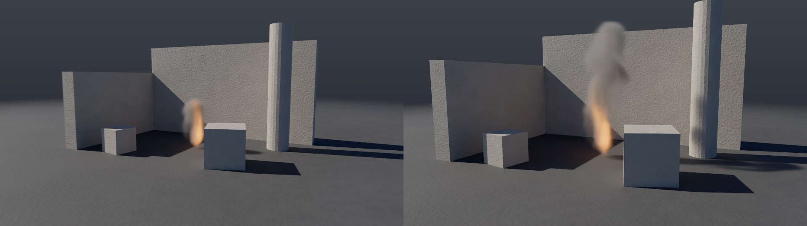

# Alembic

Alembic (`.abc`) is the format studios use to exchange caches: geometry
that moves, frame by frame. Houdini, Maya, Blender,
Nuke, Katana and renderers write and read it. Prototype **writes** it (a whole shot as one
archive) and **reads** it (geometry and camera as network nodes), both without the
Alembic library: it has its own Ogawa container, property layer and AbcGeom schemas.

Files it writes are read by Blender 4.5 (Alembic 1.8.3), and Blender's files
are read by prototype (§6).

## 1. Quick start

```bash
# demolition as a single archive: city, 710 moving pieces, debris, camera; gas as VDB alongside
./build/prototype sim demolition - --frames 120 --export demolition.abc
# a set and camera from Blender (examples/abc/shot.abc), with fire in it
./build/prototype sim alembic_shot out/shot.png --every 24
```

In the editor:
- **File › Export Alembic…** writes the shot from the cached frames — in the background,
  with a progress window; **Stop** leaves a valid archive of the frames written up to that point.
- **Shift+A › Geometry › Alembic Import:** geometry from a file.
- **Shift+A › Render › Alembic Camera:** a camera from a file, for the Camera input
  of the Output node.

From Python:

```python
import pg
sim = pg.Network.example("demolition").simulate()
sim.export_alembic("demolition.abc", frames=120)   # or pg.AbcExport frame by frame
```



## 2. Exporting a shot

`--export shot.abc` (or File › Export Alembic…) writes a single archive:

| Object | What it contains |
|---|---|
| `/<node>` | the displayed geometry under a Xform: polygons as PolyMesh (`N`, `uv`, `Cd`, `v`), open lines as Curves, free points as Points (`id`, `v`, widths from `pscale`, `Cd`) |
| `/pieces` | each RBD Solver body as a Xform over a PolyMesh of its shape around its center. The shape is written once; the Xform moves and rotates it every frame. A body crushed to dust, or a fragment that has not broken off yet, is invisible at that moment. Faces cut by fracturing are the FaceSet `inside`, so that they can have their own material. |
| `/grit` | debris: Points with width by size, numbered, in motion |
| `/grains` | Grain Solver grains: Points in their colors |
| `/rebar` | rebar where the pieces carried it: Curves |
| `/cloth` | cloth where its points are: PolyMesh |
| `/water` | the water surface: a PolyMesh for each frame with normals, velocity and foam |
| `/rain` | drops and droplets: Points |
| `/camera` | a Xform over a Camera: a 24 mm lens of the same height as in prototype (film 2.4 cm high × image aspect ratio) |
| gas | OpenVDB files next to the archive, one per frame (`shot_gas/shot_gas.0001.vdb`), as with the USD export |

Time: frame f is at time f / fps seconds, the way Houdini, Maya
and Blender write frame f. Y is up, the unit is the meter.

Whatever is large and different in every frame (displayed geometry, water, points) is
written as soon as the frame arrives, so a shot of any length does not have to
fit in memory. Whatever is small and must exist from the first frame (body
positions, camera, visibility) is held and written at the end. A sample that is
the same as the previous one is not written again: the shape of a piece that is standing still
and a camera that does not move have a single sample.

A 120-frame demolition with 710 bodies gives a 14 MB archive and 120 VDB files
with gas; Blender loads it in 0.3 s.

## 3. Alembic Import

The archive's geometry at a given frame, in world space, where its transforms put it:

| From Alembic | To geometry |
|---|---|
| **PolyMesh**, **SubD** | polygons (SubD as the control mesh, without smoothing and without crease edges and corners); the vertex order is reversed (Alembic has it clockwise), and back again when the transform mirrors |
| `N` | `N`: depending on scope on vertices (face-varying) or points, transformed |
| `uv` | `uv` (vector, z = 0) |
| `.velocities` | `v`, transformed |
| `.arbGeomParams` | an attribute of the same name; scope `con` on the detail, `uni` on primitives, `vtx`/`var` on points, `fvr` on vertices; `Cs` as `Cd` |
| **FaceSet** | a primitive group named after the FaceSet (`inside`) |
| **Points** | free points: `id`, `v`, `pscale` from width (half) |
| **Curves** | open polylines (cubic ones through their control points), `pscale` from width |
| object path | the primitive string attribute `path` (`/pieces/body_0012`) |

Between two samples the positions are blended if both have the same number of points; otherwise
the earlier sample applies. When the geometry in the file moves, the node is cooked again at every
frame, otherwise only once.

Parameters:
- **File:** `.abc`. A relative path is resolved from the network's folder. A file that
  changes is reloaded.
- **Objects:** which objects to read, together with what is below them. Paths separated
  by spaces (`/pieces /city`). An empty field means the whole archive.
- **Frame Offset:** shifts reading by that many frames. Frame f is read at time
  (f + offset) / fps; an Output with a different fps plays the file at its own rate.
- **Hidden:** also read objects that are not visible at the given frame.
- **Face Sets as Groups**, **Path Attribute:** groups from FaceSets and the
  `path` attribute.

## 4. Alembic Camera

A camera from a file. Connected to the Camera input of the Output node, it is the camera
used for rendering.
- **Position and rotation:** from the camera's world matrix at each frame. The angles are
  chosen closest to the previous frame, so the rotation does not jump from 180° to −180°.
- **Lens:** the left-to-right field of view corresponds to the film's horizontal aperture
  and the focal length (`horizontalAperture`, `focalLength`), as with USD Camera
  ([usd-import.md](usd-import.md)).
- **Object:** the path to the camera; an empty field means the first camera in the archive.
- **Width**, **Height**, **Plate**, **Plate Frame:** as with USD Camera
  ([plate.md](plate.md)).

Film offset (`horizontalFilmOffset`) is not drawn by prototype; the node reports it
as a warning.

## 5. Example

`alembic_shot` is a set from Blender (`examples/abc/shot.abc`, written by the
script `examples/abc/make_shot.py`): the corner of a ruin — two walls, a pillar, two
crates — and a camera that pushes in on it for two seconds, 24 frames per second.
Alembic Import loads the set, Object turns it into an obstacle for the gas, and Alembic
Camera is the shot camera. A fire burns between the crates and its smoke rises along the
back wall.

## 6. Verification

Writing and reading were compared with Blender 4.5.3, which has the Alembic library
1.8.3 (`pip install bpy`). Prototype does not need it.

- **Writing → Blender:**
  - Blender loads the archives of the demolition, shatter_grit, flag, tarp,
    sand_pour and rain_pond examples without errors, with the objects and point and face counts
    that prototype wrote;
  - faces point outwards (vertex order), per-vertex `Cd` matches, points with a varying
    count (debris, grains, drops) as well as rebar curves are read;
  - the demolition pieces stand in Blender where they do in prototype: the centroids of all
    710 pieces at frames 1 and 90 differ by at most 6e-5 m, which is float
    precision for coordinates up to 25 m; prototype's reader gives the body positions from the
    simulation to 1e-4 m (test). Crushed pieces are hidden from the frame in which they
    fell apart;
  - the camera stands, looks and has a lens as in prototype.
- **Blender → reading:** the files in `tests/data/abc` were written by Blender
  (`make_blender_abc.py`): a box, a cube that rotates and moves,
  a moving camera with a 35 mm focal length, a Bézier curve, a wavy grid (points
  move), a grid that grows (faces are added), particles. Faces point outwards;
  motion, camera, focal length and time range match what Blender wrote.
- **Corrupted files:** 300 randomly corrupted archives are rejected without
  crashing.

Tests — `tests/test_alembic.cpp` (11):
- Ogawa groups and data, property samples, time sampling;
- reading files written by the library (Blender), and rejecting corrupted ones;
- geometry written and read back in world space;
- demolition export: pieces move and rotate as in the simulation, a crushed
  piece disappears;
- the Alembic Import and Alembic Camera nodes.

## 7. In the code

| File | What it does |
|---|---|
| `src/pg/io/Ogawa.h` | Ogawa container: groups and data blocks, writing and reading |
| `src/pg/abc/Archive.h` | Archive: objects, properties (scalar, array, compound), samples and their keys (MurmurHash3), time sampling, metadata |
| `src/pg/abc/Geom.h` | AbcGeom schemas: Xform, PolyMesh, SubD, Points, Curves, Camera, FaceSet; writing, and reading into geometry (`importGeometry`), camera (`cameraAt`) |
| `src/pg/sim/AbcExport.h` | A shot into an archive, frame by frame |
| `src/pg/nodes/Abc.cpp` | The Alembic Import node (`abcimport`) |
| `src/pg/sim/Camera.cpp` | `cameraFromAlembic`: a camera from Alembic as the shot camera |
| `src/pg/sim/Network.cpp` | The `alembic_import` and `alembic_camera` nodes |
| `tools/prototype/Commands.cpp` | `--export shot.abc` |
| `examples/abc/make_shot.py` | How the sample shot was made (Blender) |

## 8. Limitations

- **HDF5:** only Ogawa archives are read (Alembic 1.5 and newer, the default everywhere).
  Old HDF5 archives are rejected.
- **NuPatch** (NURBS) is not read; the node lists it as skipped. Lights
  and other schemas are skipped without a report.
- **Materials** are neither written nor read; color is `Cd`.
- **Gas** goes to OpenVDB files next to the archive: Alembic has no volumes.
- **Collisions from geometry:** an Object with a shape from Alembic Import takes the shape from
  frame 1, even when the geometry in the file moves. The camera moves frame by frame.
- **Camera:** film offset is not drawn.
