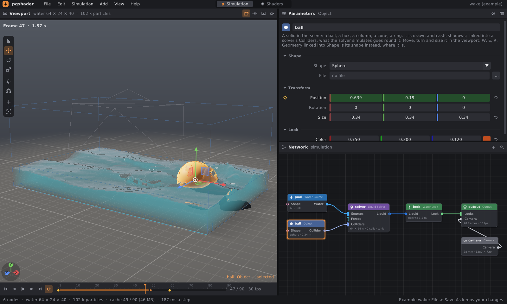
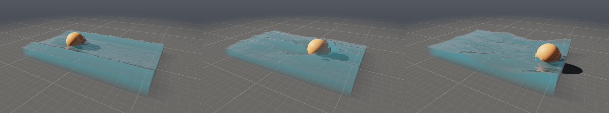

# Animace: klíčové snímky a pohyblivé překážky

Každý číselný parametr každého uzlu sítě (poloha objektu, palivo zdroje,
síla větru, hustota kouře ve vzhledu, ohnisko kamery, velikost krychle
v geometrii…) může mít **klíčové snímky**: hodnotu v daném snímku a způsob,
jak se dostane k dalšímu klíči. Síť se pak překládá snímek po snímku a
simulace berou každý krok svět toho snímku. Objekty, které se hýbou, jsou
**pohyblivé překážky**: plyn i voda převezmou jejich pohyb — koule, která
projíždí bazénem, před sebou zvedá vlnu a za sebou nechává brázdu; lopatka,
která se točí v kouři, ho víří.





## 1. Rychlý start

```bash
./build/prototype --example wake          # koule tlačí vodu: vlna a brázda
./build/prototype --example fire_trail    # pochodeň letí smyčkou, lopatka se točí v kouři
./build/prototype sim wake out/w.png --every 10
```

V editoru:

1. vyber objekt (třeba kouli z Add → Objects),
2. na snímku 1 stiskni **K** nad viewportem — klíč polohy, rotace a velikosti,
3. přesuň přehrávací hlavu (klik do časové osy),
4. posuň objekt gizmem — protože je animovaný, zapíše se klíč tam, kde je
   hlava,
5. simulace se spustí znovu a objekt se hýbe; přehrávání ukáže, co udělal
   s vodou či kouřem.

## 2. Klíče v editoru

- **Kosočtverec** na začátku řádku parametru: prázdný šedý (jen při najetí
  myší) — parametr není animovaný; obrys oranžový — animovaný, v tomto
  snímku klíč nemá; plný oranžový — klíč v tomto snímku. Klik přidá klíč
  (hodnota, kterou parametr v tu chvíli má) nebo ho smaže; pravé tlačítko
  otevře nabídku: interpolace k dalšímu klíči (Smooth, Linear, Step),
  smazat klíč, smazat všechny klíče.
- **Pole animovaného parametru** je podbarvené: jantarově na klíči, zeleně
  mezi klíči. Hodnota je ta v aktuálním snímku; úprava hodnoty animovaného
  parametru zapíše klíč v aktuálním snímku (auto-key). Parametr bez klíčů
  se upravuje jako dřív — v celé simulaci stejně.
- **Časová osa** ukazuje klíče: vybraných uzlů výrazně, ostatních uzlů
  sítě tlumeně.
- **K** (nad viewportem; nebo Edit → Key Selection) zapíše klíče polohy,
  rotace a velikosti vybraných objektů, zdrojů a sil v aktuálním snímku.
- **Gizmo** u animovaného uzlu zapisuje klíče (posun, rotace i velikost).
- Reset parametru (šipka vpravo) smaže i jeho klíče; smazání posledního
  klíče nechá parametr na jeho hodnotě.
- Duplikovaný uzel má stejné klíče. Undo/redo vrací i klíče.

Objekty a vodítka se kreslí ve snímku **přehrávací hlavy** — hned, bez
čekání na simulaci; plyn a voda v posledním spočítaném snímku do ní.

## 3. Interpolace

| | |
|---|---|
| **Smooth** (výchozí) | kubická křivka přes klíče: na prvním a posledním klíči a tam, kde se hodnota obrací, s nulovým sklonem (náběh a doběh); jinde sklon Catmull-Rom, omezený tak, aby křivka mezi klíči nepřestřelila (Fritsch–Carlson) |
| **Linear** | přímka k dalšímu klíči |
| **Step** | drží hodnotu klíče až do dalšího |

Interpolace patří klíči a platí od něj k dalšímu. Před prvním klíčem má
parametr hodnotu prvního, po posledním posledního. Celočíselné parametry
se zaokrouhlují, přepínače a volby skáčou (jako Step).

## 4. Soubor .pgsim

Klíče jsou řádky `key JMÉNO SNÍMEK INTERPOLACE HODNOTA` pod uzlem, po jeho
parametrech; hodnota je zapsaná stejně jako u `param`:

```
node 2 object 1 ball 0 110
  param size 0.34 0.34 0.34
  key center 1 smooth -0.85 0.19 0
  key center 60 smooth 0.85 0.19 0
```

Řádek `param` animovaného parametru zůstává: je to hodnota pro chvíli, kdy
se klíče smažou.

## 5. Co se animuje

- **Simulace**: zdroje (poloha, rotace, velikost, palivo, kouř, teplo,
  rychlost…), síly, objekty, nastavení řešičů, která nejsou mřížka
  (vztlak, chladnutí, víření…), déšť (mrak, intenzita…).
- **Vzhled**: Volume Look, Water Look, světlo a obloha v Output — mění se
  v obraze; když je animovaný jen vzhled (nebo kamera), simuluje se jednou
  a svět žádnou animaci nenese.
- **Kamera**: poloha, rotace, ohnisko — `prototype sim` i render sekvence
  z editoru jdou animovanou kamerou.
- **Geometrie**: parametry geometrických uzlů (krychle, transformace,
  scatter…) — viewport a tabulka atributů je ukazují v aktuálním snímku.

**Nejde animovat** (hodnota ve snímku 1 platí celou dobu, kompilace to
řekne varováním): velikost a rozlišení mřížky Pyro Solveru a Liquid
Solveru, uzavřené stěny nádrže, počet snímků a snímková frekvence v Output.
Tvar z geometrie (vstup Shape) je statický — geometrie se bere ve snímku 1;
pohyblivou překážku udělej z objektu s vlastním tvarem nebo modelem OBJ.

## 6. Jak to funguje

### Síť snímek po snímku

`Network::compile()` přeloží síť ve snímku 1 (s kontrolou chyb). Když je
něco animované, přeloží ji znovu pro každý snímek (tiše: problémy řekl
první snímek) — soubory modelů a geometrie se přitom čtou a vaří jen
jednou. Výsledek:

- `World::animation` — svět v každém snímku (sdílený, porovnávaný podle
  obsahu: editor spustí simulaci znovu právě tehdy, když se klíče nebo
  hodnoty změní);
- `Compiled::poses` — co se kreslí v každém snímku: vzhled, objekty, kamera.

Krok, který vyrábí snímek *n*, vezme svět snímku *n* (`WorldSolver::step`):
řešiče si převezmou zdroje, síly a překážky (`setScene`) a mřížka zůstane.

### Pohyb překážek

Z polohy a rotace objektu v sousedních snímcích se spočítá jeho
**rychlost** a **úhlová rychlost** (osa × radiány za sekundu, z rozdílu
rotací `R₂ R₁ᵀ`). Rychlost bodu tělesa je `v + ω × (p − střed)`.

- **Plyn**: stěny buněk u pevných buněk (blokované stěny) nemají rychlost
  0, ale rychlost tělesa v tom místě. Divergence vedle tělesa ji započítá,
  tlak pak tlačí plyn z cesty; stejně tak pohyb tělesa do strany strhává
  plyn podél sebe. Pevné buňky se přepočítají v každém kroku, kdy se
  těleso hýbe.
- **Voda**: část stěny buňky zakrytá tělesem nese jeho rychlost — do tlaku
  vstupuje tok `o·u + (1 − o)·u_tělesa` (Batty, Bertails, Bridson 2007),
  úplně zakryté stěny mají rychlost tělesa. Částice vytlačené z tělesa
  ztratí jen rychlost *do* tělesa **vůči němu**, takže je těleso nese
  s sebou.
- **Zdroje**, které se hýbou, dávají plynu (a proud vody) i svou rychlost:
  pochodeň nechává stopu.
- **Déšť** dopadá na objekty tam, kde v tom snímku jsou.

### Geometrie

Animovaný parametr geometrického uzlu se v `GeometryGraph` naváže jako
výraz jádra (klíče vyhodnocené ve snímku vaření). Uzel je tím časově
závislý a cache jádra drží jeho geometrii pro každý snímek zvlášť — návrat
na už uvařený snímek nic nepočítá.

## 7. Omezení

- Změna klíče spustí celou simulaci znovu (jako každá změna scény).
- Překážka, která se hýbe rychleji než o buňku za krok, může „proskočit“
  tenkou vrstvou vody či plynu; plyn uvnitř buněk, do kterých těleso vjede,
  zmizí.
- Tvar z geometrie a změna tvaru (koule → krychle) se neanimuje plynule.
- Nejsou křivkové editory (graf křivek) ani klíče na jednotlivých složkách
  vektoru — klíč nese celou hodnotu.
