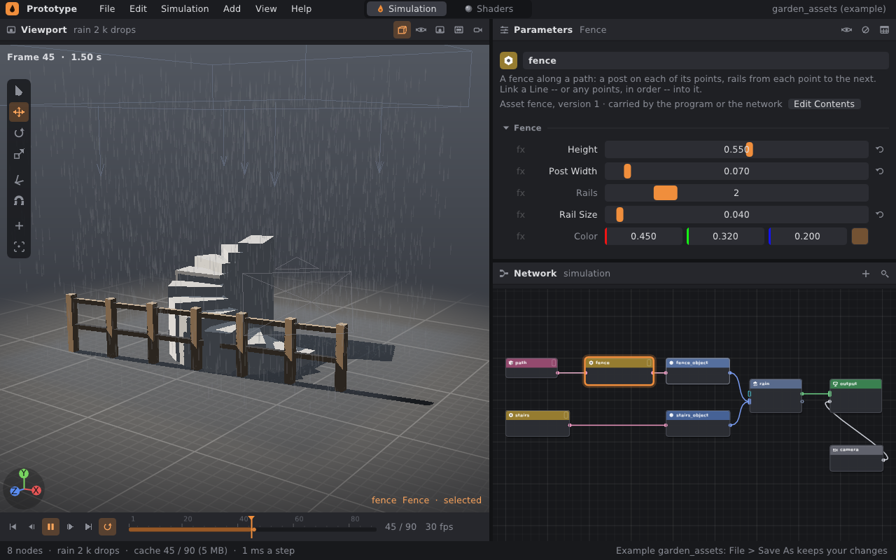
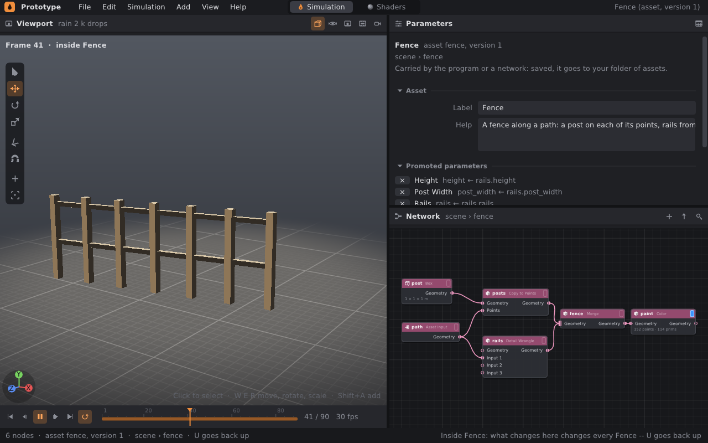
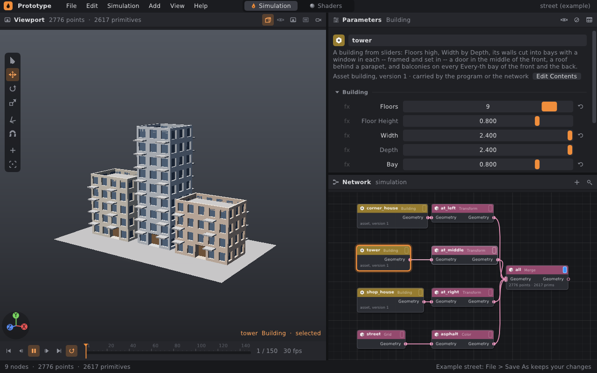

# Digital assets

An asset is a network of geometry nodes packaged into a single node. It has its own name,
its own parameters and a version, and it can be used in any network like any
other node. It corresponds to digital assets (HDAs) in Houdini.

Example: a fence. Inside, a box serves as a post, Copy to Points distributes it
onto the points of a path, and a Detail Wrangle stretches rails between the points. From the outside it is a single
**Fence** node with an input for the path and Height, Post Width, Rails,
Rail Size and Color sliders. When the fence definition changes, every fence in
all scenes changes.



The **garden_assets** example (File › Examples) shows a staircase and a fence
in the rain. Both nodes are assets that ship with the program.

## 1. How an asset is created

1. Select the geometry nodes in the network that should make up the asset.
2. Choose **Edit › Make Asset…**, or right-click a node
   and choose **Make Asset…**.
3. Enter a label (*Label*, e.g. "Blue Lift"). The type name (*Name*,
   `blue_lift`) is derived from it automatically and can be overwritten.
4. Confirm with **Make**.

What happens:

- The selected nodes are moved into the asset definition. A single
  node of the new type takes their place and keeps all the connections.
- Each geometry that led into the selection from outside becomes an
  **Asset Input** node inside (index 0, 1, …). The asset thus gets the corresponding inputs.
- The asset outputs the geometry of the node whose output leads outside. When nothing
  leads outside, it outputs the geometry of the node with the display flag, or else of the only node
  that feeds no other. That node gets the display flag inside.
- The definition is saved to `~/.local/share/prototype/assets/NAME.pgasset`
  (or to `$XDG_DATA_HOME/prototype/assets`) and added to the library. The Tab
  menu immediately offers it in the **Assets** category.

An asset cannot be made from simulation nodes (sources, solvers, Output…). Only
geometry belongs inside. An asset has at most four inputs and outputs the geometry of only
one node. When the selection does not meet these conditions, the dialog says why.

## 2. Inside an asset

You enter an asset by double-clicking its node, with the **I** key over the network,
with the **Edit Contents** item in the node menu, or with the **Edit Contents** button
in the instance's parameters. You go back with the **U** key, the up arrow
in the network header, or File › Back Up.



Inside, the definition's network is edited just like any other. The network header shows
where you are (`scene › fence`), and the status bar reminds you that U leads back.

- **Inputs.** The Asset Input nodes receive whatever is connected to the instance
  you entered from, at the frame on the timeline. So the fence inside stands
  on the same line as in the scene.
- **Values.** Parameters inside have the definition's values, i.e. the default values
  of each new instance. The instance you came from may have its own
  values (the fence in the scene is lower than inside).
- **The scene waits.** The scene's simulation is not recomputed and the viewport shows only
  the asset's geometry. After returning, the scene is whole again, including simulated
  frames, unless the asset takes part in what is being simulated.
- **New version.** When returning up (or Ctrl+S, File › Save Asset) the
  changes are saved as a new version. The version number increases, the `.pgasset` file is
  written, and all instances in all open networks are recomputed according to the
  new definition. When nothing has changed, the version stays the same.
- When no display flag was set or the definition fails otherwise, returning
  does not succeed. The error is in the status bar and you stay inside so that you can
  fix it.

When no node is selected, the parameter panel shows the asset's properties:
**Label**, **Help** (text for the tooltip and the instance's parameters), the list of
promoted parameters with a × button to remove them, and the list of inputs.

Assets can be nested: another asset can be used inside an asset, and you can enter
it too. The header then shows the full path, e.g. `scene › house1 ›
window2`.

## 3. Asset parameters (promote)

A parameter of a node inside becomes an asset parameter like this: right-click
the parameter name and choose **Promote to the Asset**. A promoted
parameter has an orange marker by its row. After returning up, every instance has it
in a section named after the asset, with a slider, fx and keys like any
other parameter:

- the value inside is the default value,
- each instance sets its own value,
- an instance can have keys and even an expression (`$F`, `ch()`) on the parameter, because they
  are evaluated in the instance's network.

A parameter from a wrangle snippet can also be promoted (`ch("height")` → the Height
slider). In the Fence asset, the post box's expressions
(`ch("../rails/height")`) are driven by the wrangle's sliders, so a single promoted
parameter moves both the posts and the rails.

**Unpromote** in the same menu, or the cross in the asset overview, returns the parameter
to the node inside only. Instances lose it with the next version. Values that the
instances in the scene had are discarded on load with a warning.

The **Copy Reference** item in the same menu copies
`ch("../node/parameter")` for another parameter's expression.

## 4. Files

An asset is an ordinary `.pgsim` network, only with extra lines at the beginning:

```
pgsim 1
asset fence 3 "Fence"
help "A fence along a path: a post on each of its points, ..."
promote rails height height "Height"
promote paint color color "Color"
node 1 asset_input 1 path 0 130
node 2 box 1 post 0 0
  expr size.y "ch(\"../rails/height\")"
...
```

- `asset NAME VERSION "LABEL"` — type name, version and label.
- `help "…"` — help text (optional).
- `promote NODE PARAMETER NAME "LABEL"` — a parameter of a node inside becomes
  a parameter of the asset. An empty label means the parameter's own label.

A `.pgasset` file can also be opened directly (File › Open Asset… or
`prototype path/to/fence.pgasset`) and edited without a scene. Ctrl+S then saves
a new version.

**Where the program looks for assets**, in this order (a later one overrides an earlier one
of the same name):

1. assets that ship with the program (`examples/assets`, compiled in):
   **Fence** and **Spiral Stairs**,
2. folders in the `PROTOTYPE_ASSETS` variable (colon-separated),
3. the user folder `$XDG_DATA_HOME/prototype/assets`, otherwise
   `~/.local/share/prototype/assets` — this is where the editor saves.

**A network carries its assets with it.** When a network that uses an asset is saved,
the asset's definition is also written at its end:

```
definition fence
| pgsim 1
| asset fence 3 "Fence"
| ...
end
```

The file thus opens even on another computer where the asset is not in the library.
The newer version wins: a definition from the file replaces the library one only when
the library one is older. So a newer fence from your folder does not get overwritten by older copies
in files, and an older scene gets the new fence.

`prototype sim` and the other commands load the library the same way as the editor.
`--set fence.height=0.8` sets an instance's promoted parameter.

## 5. Example: a building from sliders



The **Building** asset (it ships with the program) builds a building from ten
sliders: Floors, Floor Height, Width, Depth, Bay (bay width), Window
Frame, Window Depth, Balconies, Every and Wall Color. Inside is a network of fourteen
nodes:

| Node | What it does |
|---|---|
| `shell` (Detail Wrangle) | walls as grids of bays — a floor high, a bay wide; each bay has `floor`, `column`, `wall` attributes; roof and base in the `roof` and `base` groups |
| `weld` (Fuse) | welds the points of neighboring bays: the shell is closed |
| `choose` (Primitive Wrangle) | a door in the middle of the front wall on the ground floor, windows elsewhere (groups `door`, `window`) |
| `frames`, `windows` (PolyExtrude) | window: first an inset (frame in the wall plane), then a recess inwards (glass `glass`, reveal `reveal`) |
| `door` (PolyExtrude) | the door recessed deeper |
| `parapet`, `roof` (PolyExtrude) | roof behind a parapet: inset, then down |
| `paint` (Primitive Wrangle) | colors by group; `chv("wall")` is the Wall Color slider |
| `balcony_points` (Detail Wrangle) | a point at the foot of every Every-th window at the front and back, with the normal from the wall |
| `slab`, `balconies`, `slab_paint` | balcony slab copied onto those points (Copy to Points, Align to N); the slab width is the expression `ch("../shell/bay") * 0.8` |
| `building` (Merge) | building and balconies |

The **street** example builds three different houses from the same asset. From the command
line, a building (or the whole street) can be cooked and saved without a window:

```bash
./build/prototype cook street street.obj                          # whole street to OBJ
./build/prototype cook street tower.obj --node tower --set tower.floors=14
./build/prototype cook street - --hash --threads 1                # geometry hash
./build/prototype cook street - --hash --threads 4                # the same hash
```

The geometry hash is the same on 1 and 4 threads, so the same sliders give
bit-identical geometry. This is guarded by the test `asset_building_is_the_same_on_any_number_of_threads`.

## 6. What an asset rejects

| Situation | What happens |
|---|---|
| an asset inside itself, even through another asset (A in B, B in A) | the new version is rejected: "it has itself inside (through B)" |
| no node with the display flag | the new version is rejected |
| a name that a built-in node has (`box`) | rejected |
| a promoted parameter that is not inside | the definition is rejected (in a file the line is discarded with a warning) |
| a value or key of a parameter the instance no longer has | discarded on load with a warning |
| an instance of an asset the library does not know (file without a definition) | the network loads, the node reports an error until the asset appears |

## 7. How it works

- The **library** (`pg/sim/Asset.h`, `AssetLibrary`) holds definitions by
  name. Every change increments the library's revision number. `GeometryGraph`
  watches it, so instances notice a new definition at the next
  synchronisation. The library does not delete replaced definitions, because the editor
  may still be looking at their node type.
- The **instance type** is assembled from the definition: inputs per the Asset Input nodes,
  one output, parameters per `promote` with default values from the definition.
  `findNodeType` looks up built-in types first, then the library.
- **Cooking.** The instance node in the core (`AssetNode`) holds a copy of the definition's network
  and its own `GeometryGraph`. Before each cook it writes the values of the
  promoted parameters at the frame's time into the copy (the instance's keys and expressions are already
  evaluated) and passes the inputs to the Asset Input nodes. Only what changed
  inside is recomputed, as in any other network. Errors from nodes inside are reported by the instance
  as `fence/rails: …`.
- **Time dependency.** An asset is time-dependent when its output node
  depends on time, e.g. a wrangle reads `$F` or a parameter has keys. The answer is
  remembered per library revision, because the asset inside may have changed.
- **Cycles.** When a definition is added, the library checks under its lock whether
  the network contains itself, directly or through other assets. Of the definitions that would
  form a cycle, this check would reject the last one, so there is never a cycle in the library
  and cooking cannot run forever.

## 8. Limitations (for now)

- Only geometry nodes go inside. A simulation cannot be packaged into an asset.
- An asset has at most four inputs and one output.
- Inside, the default values are shown, not the values of the instance you
  entered from.
- An asset cannot be locked (Houdini has lock/unlock). Every change inside is
  a change of the definition for all instances.
- Undo inside reverts only changes made inside. Undo in the scene does not revert versions
  saved when returning.
- Asset parameters have no layout of their own (folders, visibility
  conditions). They are in a single section in the order they were promoted.
