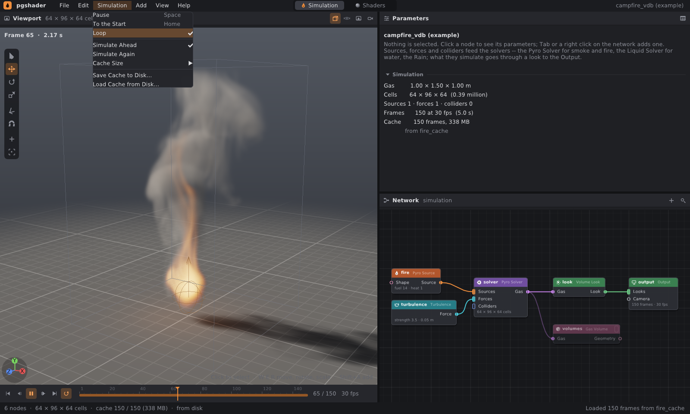
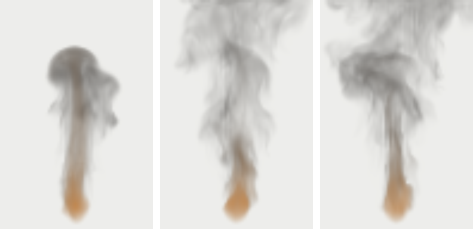
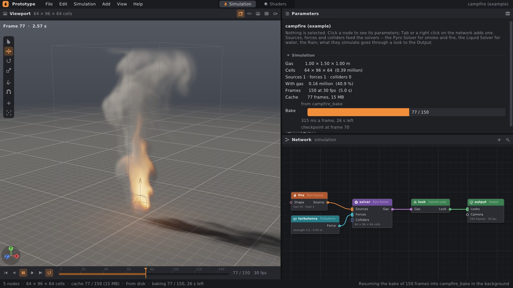
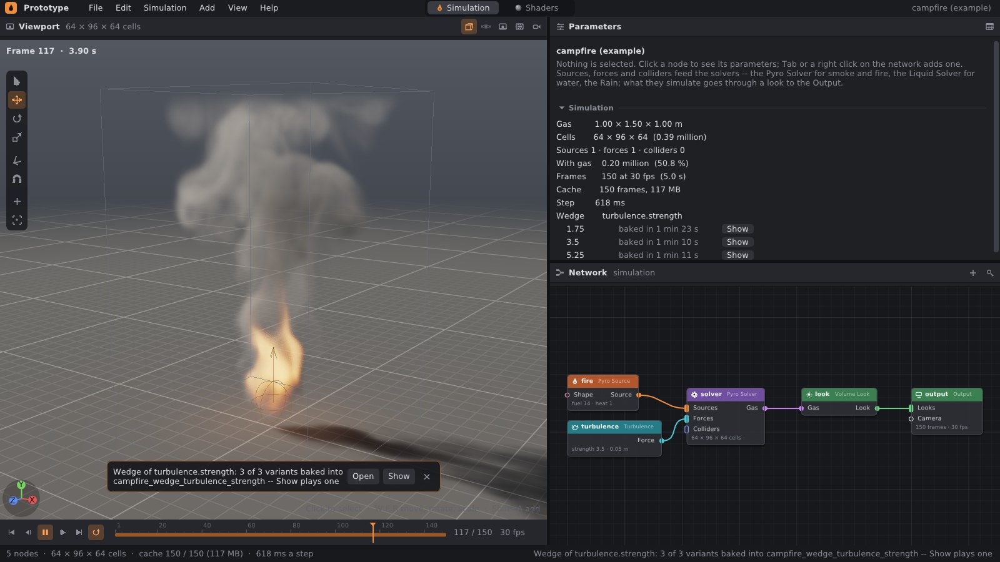
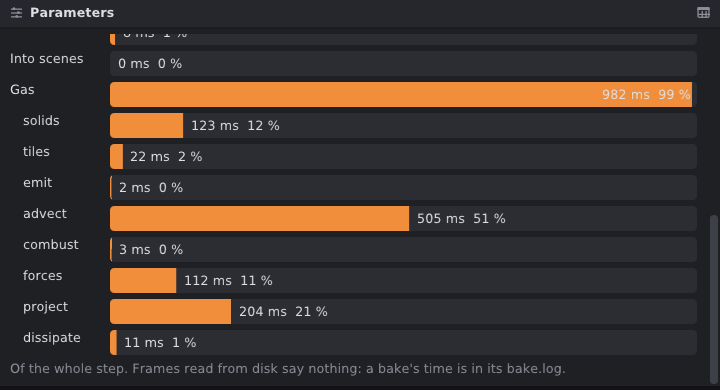

# Cache na disk a export

Simulace se spočítá jednou a její snímky se uloží na disk. Pak se přehrají,
vykreslí jinou kamerou nebo jiným vzhledem a vyexportují bez nového
počítání — v editoru, z příkazové řádky, na jiném stroji. Geometrie
libovolného uzlu (částice vody, kapky deště, plyn jako objemy, polygony) jde
ven v souborech, které čtou ostatní programy: body do **PLY**, objemy do
**OpenVDB**, polygony do **OBJ**, snímek po snímku. Záběr tak jde do Houdini,
do Blenderu a do rendererů.





## 1. Rychlý start

```bash
# simulace jednou, snímky na disk ('-' místo OUT.png: žádný obrázek)
./build/prototype sim campfire_vdb - --cache cache/fire
# render z cache: nic se nepočítá
./build/prototype sim campfire_vdb out/fire.png --from-cache cache/fire --every 10
# plyn jako objemy OpenVDB, soubor na snímek -- z cache, bez simulace
./build/prototype sim campfire_vdb - --from-cache cache/fire --export-node volumes --export 'out/fire.$F4.vdb'
# částice vody jako body PLY s rychlostí, pěnou a barvou
./build/prototype sim liquid_points - --export 'out/water.$F4.ply'
```

V editoru:

1. **Simulation › Save Cache to Disk…** — složka (vybraná, nebo napsaná
   nová); uloží všechny spočítané snímky.
2. **Simulation › Load Cache from Disk…** — snímky ze složky nahradí
   simulaci. Přehled sítě ukáže „from *složka*“, stavový řádek „from disk“.
3. **File › Export Geometry Frames…** — geometrie zobrazeného uzlu, soubor
   na snímek (`$F4` v názvu je číslo snímku). Totéž pro kterýkoli
   geometrický uzel: pravé tlačítko na uzlu › **Export Geometry Frames…**.
   Položka **Export Geometry…** zapíše jen snímek na obrazovce.

Příklad `campfire_vdb` je táborák s uzlem Gas Volume (`volumes`), který
vrací plyn jako tři objemy: `density` (kouř), `temperature` a `flame`.

## 2. Cache na disku

```
cache/fire/
  cache.txt             pgcache 1 / frames 150 / fps 30 / network dc17a5fbb4cdd2c0
  frame.0001.pgframe
  frame.0002.pgframe
  …
```

- Snímek je `sim::Frame` tak, jak ho drží editor: plyn v poloviční
  přesnosti (kouř, teplota, plamen v každé buňce), hladina vody po bajtech,
  částice vody (poloha, rychlost, bělost), kapky a vlnky deště, od verze 2
  polohy, otočení a rychlosti kusů tuhých těles, od verze 3 i drť a kusy,
  které se rozprášily ([destruction.md](destruction.md)), od verze 4
  číslo každé částice — vody, kapky, kapičky, zrnka drti —, stejné ze
  snímku na snímek, a rychlost drti, od verze 5 rychlost vody na mřížce
  řešiče (ve vodě a asi dvě buňky kolem hladiny, dál nuly), ze které má
  povrch vody `v` pro rozmazání pohybem ([geometry.md](geometry.md#povrch-vody-liquid-surface-a-convert-volume)),
  a od verze 6 co se stalo s výztuží — bajt na každý úsek prutu v kusu:
  prut z kusu vyšel, prut je za ním přetržený ([destruction.md](destruction.md#výztuž-rebar)), a od
  verze 7 která drť je skleněná a kterým tělesům praskl spoj — podle toho se
  kreslí trhliny skla ([destruction.md](destruction.md#sklo-glass-fracture)) —, a od verze 8 co se
  stalo s každým spojem lepidla a kdy praskl (bajt a číslo na spoj; [síť
  vazeb](destruction.md#síť-vazeb-rbd-constraints)), a od verze 9 jak je natočené každé zrnko drti
  (kvaternion v poloviční přesnosti, po načtení znovu jednotkový; [drť jako částice](destruction.md#drť-jako-částice)),
  a od verze 10 řídký plyn: jen dlaždice 8 × 8 × 8 buněk, ve kterých nějaký
  je, a jejich čísla na konci snímku ([pyro.md](pyro.md#řídká-mřížka-počítá-se-jen-tam-kde-je-plyn));
  klidová geometrie kusů, pruty i síť vazeb jsou
  v síti uzlů a snímek načtený z disku je dostane od ní. Binárně, little-endian,
  s hlavičkou `PGFRAME` a číslem verze; starší snímky se čtou dál.
- **Nuly se nezapisují**: běh nul je jedno číslo. Kouř táboráku zabírá jen
  část domény, takže 150 snímků mřížky 64 × 96 × 64 má na disku 63 MB,
  v paměti 338 MB.
- `network` je hash textu sítě **bez poloh uzlů na plátně**: posunutý uzel je
  pořád stejná síť, změněný parametr už ne. Cache jiné sítě (nebo jiné verze
  téže) se načte, ale editor i `prototype sim` upozorní.
- Načtené snímky platí, dokud se nezmění, co se simuluje. První taková
  změna (parametr zdroje, bypass uzlu…) je zahodí a simulace začne znovu od
  snímku 1. Změna vzhledu nebo kamery je nezahodí: cache z disku jde
  vykreslit jinak.
- Simulace je deterministická, a proto jsou snímky z cache bitově stejné
  jako spočítané. Render z cache je tentýž soubor PNG jako render po
  simulaci (ověřeno `cmp`) a VDB vyexportované z editoru i z příkazové řádky
  jsou bajt po bajtu stejné.
- Čtení nevěří souboru: snímek, jehož části nesedí s jeho mřížkami (počty
  buněk, částic, vlnek), neprojde. Poškozený soubor tak renderer nepošle
  mimo pole.

## 3. Bake na pozadí, checkpointy a náhled

Velká simulace (prach odstřelu v 576 buňkách: 6 s na snímek, 19 minut na
záběr) se nepočítá v okně editoru. Jako Save to Disk in Background
v Houdini ji spočítá samostatný proces rovnou na disk, editor zůstane volný
a snímky přehrává, jak přibývají.



V editoru, menu **Simulation**:

- **Preview Resolution** — plyn a voda na mřížkách polovičního rozlišení
  (táborák 32 × 48 × 32 místo 64 × 96 × 64, krok 63 ms místo ~400 ms).
  Na ladění zdrojů, sil a načasování. Přehled ukáže „Preview — grids half
  as fine“, stavový řádek „preview“. Bake je vždy v plném rozlišení.
- **Bake to Disk…** — složka (výchozí `<síť>_bake`) a v ní celý záběr
  v plném rozlišení: editor zapíše síť do `network.pgsim` a spustí
  `prototype sim network.pgsim - --cache SLOŽKA --checkpoint 10` jako
  samostatný proces (výstup jde do `bake.log`). V přehledu je průběh,
  čas snímku, odhad do konce, snímek posledního checkpointu a tlačítko
  **Cancel Bake**; stavový řádek ukazuje „baking 77 / 150, 26 s left“.
  Snímky se přehrávají z disku, jak přibývají. Na konci přijde oznámení
  s odkazem na složku. Zavřený editor bake nezastaví.
- **Cancel Bake** — proces skončí. Hotové snímky zůstanou i s posledním
  checkpointem.
- **Resume Bake** — pokračuje přerušený bake (zrušený, spadlý, vypnutý
  stroj) od posledního checkpointu, ne od začátku. Nabídne se, jen když
  checkpoint ve složce patří téže síti.

**Přehrávání z disku.** Load Cache i bake čtou snímky až ve chvíli, kdy
jsou potřeba. V paměti drží nejvýš tolik, kolik dovolí Cache Size; nejdéle
nepoužité snímky uvolní. Cache větší než paměť se tak dá přehrát
a scrubovat. Dřív se načítala celá.

**Checkpoint** (`checkpoint.pgstate`) je celý stav simulace
(`WorldSolver::saveState`), ne snímek v poloviční přesnosti:

- plyn: pole ve floatech, aktivní dlaždice, buňky a stěny překážek;
- voda: částice, jejich čísla, mřížky rychlosti, vzdálenosti a tlaku
  (tlak je první odhad dalšího řešení), počitadla;
- déšť: kapky, kapičky, vlnky na hladině.

Tuhá tělesa v checkpointu nejsou. Jsou vázaná jednosměrně (plyn, voda
a déšť jdou kolem nich, ne naopak) a jejich krok je proti plynu levný.
Při obnovení se proto spočítají znovu od snímku 1 do snímku checkpointu:
kusy, jejich prach a scény, které dávají ostatním. Pak se načte zbytek.
Pokračování je **bitově stejné** jako simulace, která se nezastavila:
ověřeno na řídkém i hustém plynu, zdroji v pohybu, vodě, dešti na vodě
a odstřelu s prachem (testy) i na bake, který editor zrušil a znovu spustil
(150 souborů snímků shodných podle `cmp`).

Checkpoint se přepisuje každých K snímků (`--checkpoint K`, editor bere
10) a po dokončení se smaže, protože je velký. U prachu v 576 buňkách
drží ~24 milionů aktivních buněk × 9 polí, tedy necelý 1 GB.

`cache.txt` se během bake přepisuje po každém snímku a řekne, kam bake
došel:

```
pgcache 1
frames 43
fps 30
network a5878458fd369a86
of 150            # kolik snímků bake dělá; chybí, když je hotový
ms 75.1           # průměrný čas snímku
checkpoint 40     # snímek, jehož stav je v checkpoint.pgstate
```

Starší čtení neznámé řádky přeskočí. Každý soubor (snímek, `cache.txt`,
checkpoint) se zapíše vedle sebe jako `.part` a pak se přejmenuje. Kdo
složku čte během bake, najde každý soubor celý, nebo žádný. Proces zabitý
uprostřed zápisu nechá hotové snímky platné.

Z příkazové řádky:

```bash
# bake s checkpointem každých 10 snímků
./build/prototype sim demolition - --cache bake/demo --checkpoint 10
# ... přerušený: pokračuje od posledního checkpointu
./build/prototype sim demolition - --cache bake/demo --checkpoint 10 --resume
# rychlý náhled: plyn a voda na mřížkách polovičního rozlišení
./build/prototype sim demolition preview.mp4 --preview 0.5
```

```
$ prototype sim campfire - --cache bk2 --frames 60 --checkpoint 10   # zabitý na snímku 43
$ cat bk2/cache.txt
... frames 43 / of 60 / ms 75.1 / checkpoint 40
$ prototype sim campfire - --cache bk2 --frames 60 --checkpoint 10 --resume
resumed at frame 40 from bk2/checkpoint.pgstate (0.0 s)
campfire: simulated, gas 64 x 96 x 64 cells, 60 frames, from frame 41; simulation 160.4 ms/frame
```

V Pythonu totéž pro vlastní farmu:

```python
sim = net.simulate(preview=0.5)          # náhled
state = sim.save_state()                 # bytes: checkpoint
later = net.simulate(preview=0.5)
later.load_state(state)                  # další step() je snímek po checkpointu
```

### Wedge: varianty parametru

Když se ladí vzhled simulace, porovnává se víc verzí najednou. Pravé
tlačítko na názvu číselného parametru › **Wedge…** nabídne rozsah (výchozí
je polovina až jedenapůlnásobek hodnoty) a počet variant (2 až 16). Editor
je pak spočítá jednu po druhé, každou jako bake v plném rozlišení do vlastní
složky. Stejně to dělá Wedge TOP v Houdini.



```
campfire_wedge_turbulence_strength/
  wedge.txt          pgwedge 1 / node turbulence / param strength /
                     variant strength_1 1.75 / variant strength_2 3.5 / ...
  strength_1/        cache jako z Bake to Disk (network.pgsim, bake.log, snímky)
  strength_2/ ...
```

V přehledu je u každé varianty průběh, čas bake a tlačítko **Show**. To
dá hodnotu varianty do parametru a přehraje její snímky z disku. Variantu
lze pustit, i když se ještě peče. **Cancel Wedge** zastaví rozpečenou
variantu i ty, které čekají. Hotové varianty zůstanou.

Z příkazové řádky jde totéž smyčkou přes `--set`:

```bash
for s in 1.75 3.5 5.25; do
  ./build/prototype sim campfire - --cache wedge/strength_$s --set turbulence.strength=$s
done
```

### Profil: kam jde čas kroku

Sekce **Profile** v přehledu simulace (zavřená, klikem se otevře) ukáže
u snímku na obrazovce, kolik milisekund zabraly jednotlivé části kroku:

- trosky (Jolt) a jejich převod do scén ostatních (překážky, prach);
- plyn a jeho fáze: překážky, dlaždice, zdroje, advekce, hoření, síly,
  tlak, útlum;
- voda a déšť.



Příkazová řádka vypíše totéž průměrně za celý běh, i do `bake.log`:

```
demolition: simulated, gas 88 x 48 x 88 cells, 60 frames; simulation 48.3 ms/frame
time: pieces 4% into scenes 0% gas 96% (solids 6%, tiles 1%, emit 2%, advect 50%, combust 0%, forces 11%, project 25%, dissipate 0%)
```

Z profilu je vidět, co zrychlovat nebo zhrubit. U prachu odstřelu to
není tlak, ale advekce (MacCormack pro kouř, teplotu a rychlost). Profil
se drží jen v paměti. Snímek přečtený z disku ho nemá a formát cache se
nemění.

## 4. Export

| přípona | co zapíše | kdo to čte |
|---|---|---|
| `.ply` | body s atributy, uzavřené polygony jako `face`; binárně, little-endian | Houdini, Blender, MeshLab, CloudCompare, ParaView |
| `.vdb` | objemy jako float mřížky OpenVDB (soubor verze 224) | Houdini, Blender, renderery (Arnold, Redshift, V-Ray, Cycles, Karma) |
| `.obj` | body, polygony, čáry | skoro všechno |
| `.usda` | polygony jako Mesh, čáry, body; bez `$F` v `--export` celý záběr — tělesa, drť, prach, kamera, světla ([usd.md](usd.md)) | Houdini (Solaris), Blender, usdview, renderery |

Formát určuje přípona (na velikosti písmen nezáleží). `.vdb` z geometrie
bez objemů se nezapíše — chyba řekne, že objemy dělá uzel Gas Volume.

### PLY

| atribut bodu | vlastnosti PLY |
|---|---|
| `P` | `x y z` |
| `N` | `nx ny nz` |
| `Cd` | `red green blue` — bajty 0–255; u `vec4` i `alpha` |
| `v` | `vx vy vz` |
| číslo | jeho jméno: `float`, celé číslo jako `int` (přesně, ne přes float) |
| vektor | `jméno_x jméno_y jméno_z` (`_w` u `vec4`) |
| řetězec | vynechá se |

Stejný modul PLY i čte (`io::readPly`), ASCII i binární little-endian: stejná
jména dají zase stejné atributy, barvy v bajtech se dělí 255. Hlavičce, která
slibuje víc prvků, než soubor unese, nevěří a místo pro ně ani nealokuje.

### OpenVDB

Zapisovač je vlastní, bez knihovny OpenVDB, jádro tak zůstává bez
závislostí. Soubor má tvar, jaký píše OpenVDB 10:

- hlavička verze 224, UUID z obsahu (stejné objemy = stejné bajty), metadata
  `creator`;
- u každé mřížky jméno, typ `Tree_float_5_4_3`, metadata `class`, `name`,
  `file_bbox_min`, `file_bbox_max`, `file_voxel_count`, `file_mem_bytes`;
- transformace `UniformScaleTranslateMap`: voxel (i, j, k) má střed
  v `origin + (i + ½, j + ½, k + ½) · voxel`, přesně jako buňka simulace;
  objem sedí tam, kde byl kouř;
- strom: kořen, vnitřní uzly 32³ a 16³, listy 8³. Aktivní jsou nenulové
  voxely, zapíšou se jen listy, ve kterých nějaký je, pozadí je 0;
- `class` je `fog volume`, když jsou hodnoty kladné — tak renderery kreslí
  kouř.

Ověřeno čtením v OpenVDB 10.0 (pyopenvdb): počet aktivních voxelů, jejich
součet, bounding box i poloha voxelu 0 sedí s mřížkou simulace do posledního
bitu (táborák, snímek 12: `density` 6906 voxelů se součtem 1091.8103,
`temperature` 7140 / 8241.4198, `flame` 6489 / 549.1078 — v souboru VDB
i ve snímku cache).

Gas Volume dává mřížky `density`, `temperature` a `flame`: tak je
pojmenovávají pyro shadery Houdini a Blenderu.

## 5. Příkazová řádka

```
prototype sim NETWORK.pgsim|EXAMPLE OUT.png|- [--frames N] [--start N] [--every K] ...
             [--cache DIR [--checkpoint K] [--resume]] [--from-cache DIR] [--export PATH] [--export-node NODE]
             [--preview F]
```

| přepínač | co dělá |
|---|---|
| `--cache DIR` | každý snímek do složky `DIR` (vytvoří ji); `cache.txt` po každém snímku říká, kam došel |
| `--checkpoint K` | s `--cache`: každých K snímků celý stav simulace do `DIR/checkpoint.pgstate` |
| `--resume` | s `--cache`: pokračuje od checkpointu ve složce (téže sítě); snímky před ním už na disku jsou |
| `--preview F` | plyn a voda na mřížkách F-krát tak jemných (0.5: poloviční rozlišení, nejméně 16 buněk) |
| `--from-cache DIR` | snímky čte ze složky místo simulace; `--frames N` jich vezme nejvýš N |
| `--start N`, `--end N` | obrázky a export jen od snímku N (do `--end`, což je totéž co `--frames`) — díl záběru pro jeden stroj farmy; cache se čte od N, simulace ale začíná snímkem 1 a do cache jde každý snímek |
| `--export PATH` | geometrii zobrazeného uzlu z každého snímku do souboru; `$F4` je číslo snímku na čtyři cifry, `$F` bez nul. Bez nich se číslo vloží před příponu (`fire.vdb` → `fire.0007.vdb`). Složky se vytvoří. Výjimka: `.usda` bez `$F` je celý záběr jako jedna scéna, to, co se mění, v souborech po snímcích vedle ní ([usd.md](usd.md)). |
| `--export-node NODE` | geometrie uzlu `NODE` místo zobrazeného |
| `--folder DIR` | relativní cesty sítě (meshe, soubory OBJ) čte z `DIR`, ne ze složky jejího souboru — pro síť uloženou jinam, jak to dělá `Network.render` v Pythonu ([python.md](python.md)) |
| `-` místo `OUT.png` | žádný obrázek, jen cache a export — funguje i v buildu bez EGL |

`--every K` se týká jen obrázků: cache i export dostanou každý snímek.

Farma: jeden stroj simuluje do cache, ostatní renderují nebo exportují
každý svůj díl z ní:

```
prototype sim demolition - --cache cache/demo                                   # stroj 1
prototype sim demolition shot.png --from-cache cache/demo --start 1 --end 60 --every 1
prototype sim demolition shot.png --from-cache cache/demo --start 61 --end 120 --every 1
```

```
$ prototype sim campfire_vdb - --cache cache/fire
campfire_vdb: simulated, gas 64 x 96 x 64 cells, 150 frames; simulation 73.7 ms/frame
cached 150 frames in cache/fire
$ prototype sim campfire_vdb fire.png --from-cache cache/fire --every 50
wrote fire_0150.png and 2 before it: campfire_vdb, read from cache/fire, 150 frames (5.0 s); reading 0.7 ms/frame, rendering 495 ms/image
$ prototype sim campfire_vdb - --from-cache cache/fire --export-node volumes --export 'out/fire.$F4.vdb'
campfire_vdb: 150 frames read from cache/fire; reading 1.2 ms/frame
exported 150 frames of geometry, the last out/fire.0150.vdb
```

Cache má 63 MB, 150 souborů VDB 114 MB (bez komprese, viz omezení).

## 6. V kódu

| soubor | co dělá |
|---|---|
| `src/pg/io/Ply.h` | `formatPly`, `writePly`, `parsePly`, `readPly` |
| `src/pg/io/Vdb.h` | `formatVdb`, `writeVdb` |
| `src/pg/io/Export.h` | `writeGeometry` podle přípony, `framePath` (`$F4`, `$F`) |
| `src/pg/sim/Cache.h` | `formatFrame` / `parseFrame`, `writeFrame` / `readFrame`, `writeCacheInfo` / `readCacheInfo` (i průběh bake), `networkHash`, `writeCheckpoint` / `readCheckpoint`, `writeWhole` (zápis přes `.part`) |
| `src/pg/sim/State.h` | `StateWriter` / `StateReader`: stav řešiče jako bajty, čtení hlídá každou délku |
| `src/pg/sim/World.h` | `WorldSolver::saveState` / `loadState` (tělesa se spočítají znovu), `preview` |
| `tools/prototype/SimRunner.h` | `stream`: snímky čtené z disku podle potřeby, nejdéle nepoužité uvolní; `refresh` najde nové od bake; `adopt`: snímky v paměti |
| `tools/prototype/Bake.h` | proces bake (`posix_spawn`), průběh, odhad, zrušení, `canResume` |
| `tools/prototype/Wedge.h` | wedge: fronta bake, jeden na hodnotu parametru, `wedge.txt` |
| `src/pg/sim/Frame.h` | `Frame::Profile`: kam šel čas kroku (části, fáze plynu); `WorldSolver::profile` |
| `tools/prototype/SimWorkspace.cpp` | menu, dialogy, uložení, načtení, export |
| `tools/prototype/Widgets.h` | `FileBrowser::openFolder`: výběr složky (i nové) |

## 7. Testy

`tests/test_export.cpp`, 13 testů:

- PLY tam a zpět se všemi druhy atributů — i celé číslo 2²⁴ + 1, které by
  float nezachoval —, barvami v bajtech a polygony; ASCII s CRLF, `alpha`,
  `short` a seznamy `uint`; odmítnutí big-endian, useknutého souboru,
  hlavičky, která slibuje víc, než soubor má, a polygonu s vrcholem mimo;
- VDB tak, jak ho čte OpenVDB: hlavička, metadata, pozice mřížek až po
  konec souboru; třída, počet voxelů, bounding box, determinismus, přípona
  u dvou mřížek téhož jména;
- číslování sekvence (`$F4`, `$F`, bez vzoru) a zápis podle přípony včetně
  chyb;
- snímky tam a zpět: vymyšlený snímek se všemi částmi a běhy nul všech
  délek, skutečné snímky táboráku, vody s částicemi a deště; odmítnutí
  useknutých, novějších a nesmyslných snímků, převrácený bajt nikdy nespadne;
  snímek verze 3 se čte dál (bez čísel částic) a verze 4 také (bez rychlosti
  vody); čísla, která nejsou jedno na částici, a rychlost vody, která není
  na mřížce řešiče, se odmítnou;
- složka cache s `cache.txt` (fps 30, ne 29.999998) a hash sítě bez poloh
  uzlů.

`tests/test_state.cpp`, 11 testů: pokračování z checkpointu bitově stejné
jako nepřerušená simulace (řídký a hustý plyn, zdroj v pohybu, voda, déšť
na vodě, odstřel s prachem; každý snímek po obnovení porovnaný jako bajty
cache), odmítnutí stavu jiné mřížky, jiných částí světa, useknutého kdekoli
a stavu pro řešič, který už krokoval; náhled mění jen mřížky; `cache.txt`
s průběhem tam a zpět; checkpoint na disku přepsaný celý; profil kroku
(části, fáze plynu v rámci jeho času, v cache se neukládá). Python:
`save_state` / `load_state` a `preview` (`tests/python/test_pg.py`).

## 8. Omezení

- VDB se jen zapisuje, a jen husté float mřížky. Rychlost plynu (`vel`)
  snímek nedrží, takže ve VDB není a renderer z ní motion blur neudělá.
  Hladina vody jako level set také ne — voda jde ven jako částice nebo jako
  povrch (Liquid Surface, v USD `/World/water`).
- Uvnitř VDB není komprese (zip, blosc): soubory jsou větší, než by zapsal
  Houdini.
- Snímek cache drží, co editor ukazuje (poloviční přesnost), ne stav
  řešiče: dál se simuluje jen z checkpointu, a ten je jen jeden, poslední.
  Načtená cache bez checkpointu se nedopočítává.
- Checkpoint je stav tohoto buildu: jiná verze formátu se odmítne, ne
  převede. Tuhá tělesa se při obnovení počítají znovu od začátku. U odstřelu
  (593 kusů, plyn 96 buněk) obnovení na snímku 120 trvá 0,6 s a checkpoint
  má 23 MB; u tisíců kusů a dlouhých záběrů to bude víc.
- Bake běží na tomtéž stroji jako editor (proces, ne fronta farmy)
  a jen na Linuxu (`/proc/self/exe`, `posix_spawn`).
- PLY čte jen prvky `vertex` a `face`, ostatní přeskočí.
- Alembic chybí.
