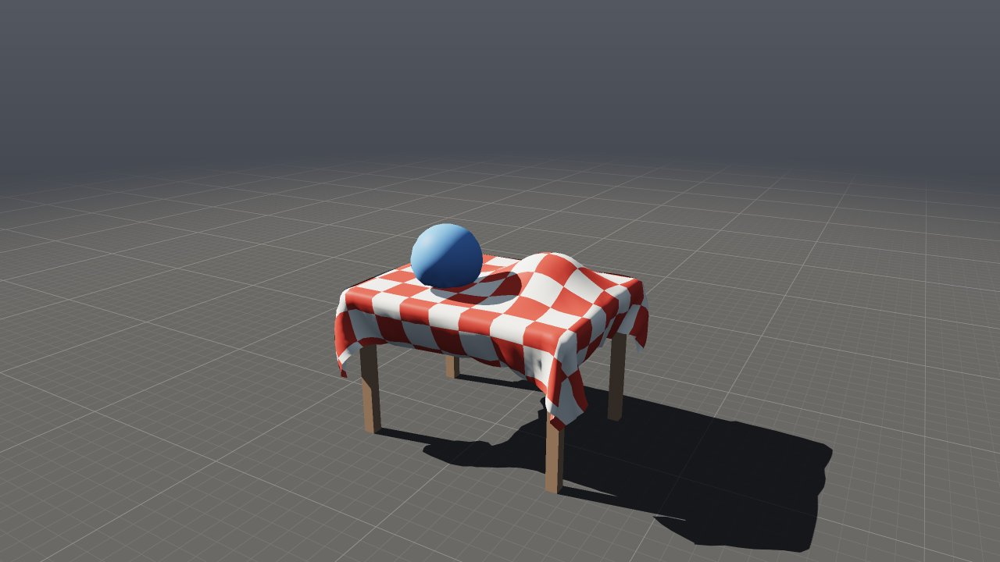
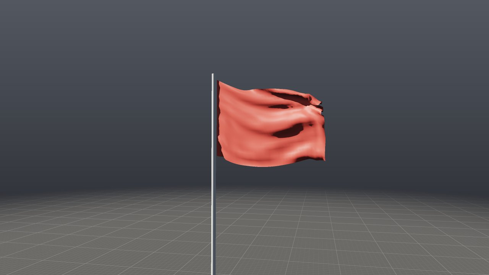
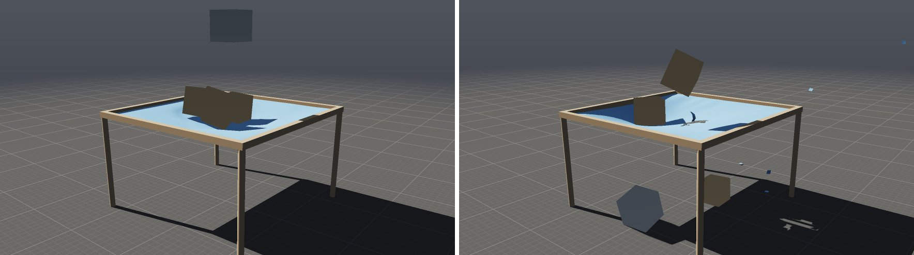

# Látky, lana a měkká tělesa: Cloth Solver (XPBD)

**Cloth Solver** simuluje všechno, co drží pohromadě jen vazbami mezi body:
ubrus, prapor, oponu, lano, gumový míč nebo polštář. Počítá metodou XPBD
(*Extended Position Based Dynamics*), stejně jako Vellum v Houdini. Body
geometrie jsou hmotné body. Hrany, úhlopříčky a ohyby jsou vazby, které
drží délku, tvar a přehyby. Uzavřená síť může navíc držet objem. Přetažená
látka se trhá a kusy RBD Solveru na ni působí obousměrně: látka je brzdí,
nese i odhazuje.



```
./build/prototype --example tablecloth                 # v editoru: Play
./build/prototype sim tablecloth ubrus.mp4 --frames 120
./build/prototype sim flag vlajka.png --every 15 --frames 90
./build/prototype sim tarp plachta.mp4 --frames 90
```

## 1. Příklady

### Ubrus a míč

Příklad **tablecloth** ([examples/sim/tablecloth.pgsim](../examples/sim/tablecloth.pgsim)):

- **Grid** 1,8 × 1,5 m (38 × 45 bodů) posunutý Transformem do výšky 1,15 m.
  Primitive Wrangle `checks` obarví jeho plochy do červenobílých kostek
  (`@P` je v Primitive Wrangle střed plochy).
- **Sphere** o poloměru 17 cm, výš a trochu stranou. Primitive Wrangle
  `blue` ji obarví.
- **Merge** spojí obojí do jedné geometrie pro **Cloth Solver**. Grid je
  otevřený, takže je z něj látka. Koule je uzavřená a Pressure 1 z ní
  udělá míč, který drží svůj objem.
- **Colliders**: deska stolu, čtyři nohy a mísa na stole (objekty Object).

Ubrus padá, vzduch ho brzdí a okraje se vlní. Přehne se přes hrany stolu
a přes mísu. Rohy visí a skládají se do záhybů. Míč dopadne na ubrus,
promáčkne ho, sklouzne a skutálí se na zem. Simulace trvá asi 36 ms na
snímek (2 000 bodů, 20 podkroků).

### Vlajka ve větru

Příklad **flag** ([examples/sim/flag.pgsim](../examples/sim/flag.pgsim)):

- Grid 1,8 × 1,2 m postavený na výšku.
- Point Wrangle nastaví body u žerdi na `i@pin = @P.x < 0.07;`, takže
  jsou přišpendlené.
- **Wind** s nárazy (gusts 0,7) fouká 8 m/s.

Vlajka se rozvine, třepotá se a nárazy větru jí probíhají jako vlny.
Simulace trvá asi 15 ms na snímek.



### Plachta, bedny a betonový blok

Příklad **tarp** ([examples/sim/tarp.pgsim](../examples/sim/tarp.pgsim)):

- **Grid** 2,4 × 2,4 m (41 × 41 bodů) ve výšce 1,4 m. Point Wrangle
  přišpendlí celý okraj k rámu na čtyřech sloupcích
  (`i@pin = abs(@P.x) > 1.17 || abs(@P.z) > 1.17;`). Lem dostane
  atribut `f@tear = 3`, takže vydrží třikrát víc a u rámu se netrhá.
- **Cloth Solver:** plachtovina (Density 0,4, Stretch i Shear 20 000 N/m,
  aby se neroztahovala ani do šikma), **Tear 0,6**, Damping 4, 40 podkroků.
- **RBD Solver:** tři dřevěné bedny (200 kg/m³) nízko nad plachtou a
  betonový blok (2400 kg/m³, 150 kg) vysoko. Jeho výstup **Collider** vede
  do **Colliders** Cloth Solveru.

Bedny dopadnou do plachty, ta se pod nimi prohne, pruží a vrací je
nahoru, až se usadí v prohlubni. Pak dopadne blok, plachtu natáhne víc,
než vydrží, a prorazí ji. Plachta se vymrští, bedny nadskočí a jedna
propadne dírou za blokem. Simulace trvá asi 60–70 ms na snímek.



## 2. Co je čím

Geometrie zapojená do vstupu **Geometry** určuje, co se simuluje:

| Geometrie | Co z ní je | Vazby |
|---|---|---|
| polygony (grid, cokoli z ploch) | látka | hrany drží délku (Stretch), úhlopříčky čtyřúhelníků tvar (smyk), body přes společnou hranu dvou trojúhelníků vzdálenost (Bend) |
| otevřené polyčáry | lano | úseky drží délku, bod a ob-jeden drží vzdálenost (ohyb) |
| uzavřená síť (sphere, box) s Pressure > 0 | balon, polštář, měkké těleso | jako látka a navíc objem = Pressure × objem v klidu |

**Trhání** (Tear > 0): hrana (úsek lana), která se natáhne o víc než Tear
× svou klidovou délku, se přetrhne. Kde přetržené hrany oddělí plochy kolem
bodu, bod se rozdělí na dva a látka se tam otevře. Lano se rozpojí na dvě.
Z balonu, který se roztrhne, je obyčejná látka (splaskne). Bodový atribut
`tear` práh násobí: 3 zesílený lem, 0,5 perforace. Hrana jediné plochy,
tedy okraj látky nebo okraj díry, se netrhá, protože by nic neoddělila.
Natáhne se a táhne za sousední hrany, které se pak přetrhnou.

Body s atributem `pin` = 1 se samy nehýbou. Jdou tam, kde je má
geometrie v aktuálním snímku, takže animovaná geometrie (třeba
klíčovaný Transform) je nese s sebou: vlajku na stožáru nebo záclonu na
posuvné tyči. Mezi snímky jde přišpendlený bod plynule, po podkrocích.
Přišpendlený je bod s `pin` nad 0,5.

`pin` i `tear` jde místo wranglu **namalovat štětcem** ve viewportu:
zobrazit vstup Cloth Solveru, **P**, tah po látce (s Ctrl maže). Vznikne
uzel Attribute Paint, jehož kapky jsou místa, ne čísla bodů — látka může
být pak jemnější a namalované zůstane. Rohy jde také zvednout úchytem
(**2**, vybrat, **W**) — uzel Edit s měkkým poloměrem. Příklad
**shade_sail** tak vznikl; viz [editing.md](editing.md).

Hmotnost bodu je hustota (Density, kg/m², u lana kg/m) krát plocha
kolem něj. Hmotnost lze zadat i přímo bodovým atributem `mass` (kg).
Počáteční rychlost bere řešič z atributu `v`, pokud ho geometrie má.

## 3. Parametry

| Parametr | Výchozí | Význam |
|---|---|---|
| Density | 0,3 kg/m² | 0,1 hedvábí, 0,3 bavlna, 0,8 plátno |
| Stretch | 10 000 N/m | jak drží hrana délku: 10⁴ bavlna, stovky guma |
| Shear | 1 N/m | jak drží čtyřúhelník tvar (tah do šikma): 1 tkanina, která splývá; jako Stretch plachta, fólie, papír |
| Bend | 1 N/m | tuhost v ohybu: 0,1 hedvábí, 1 bavlna, 10 plátno, 1000 karton |
| Pressure | 0 | uzavřené sítě drží tento podíl klidového objemu; 0 = látka |
| Tear | 0 | o kolik delší než v klidu se hrana přetrhne: 0,3 = o 30 %; 0 nikdy |
| Thickness | 0,01 m | jak daleko od podlahy, objektů a sebe sama látka zůstane |
| Friction | 0,4 | 0 klouže, 1 drží |
| Self Collision | zapnuto | látka neprojde sama sebou |
| Floor | zapnuto | podlaha ve výšce 0 |
| Air Drag | 1 | jak silně tlačí vzduch: stojící vzduch při pádu, vítr, proud plynu |
| Damping | 0,5 1/s | jak rychle pohyb sám od sebe utichá |
| Gravity | 9,81 m/s² | |
| Substeps | 20 | podkroků na snímek; víc = tužší a stabilnější |
| Color | cihlová | barva ploch bez vlastního `Cd` |

Tuhosti jsou fyzikální (N/m) a nezávisí na počtu podkroků ani na hustotě
sítě. Víc podkroků látku jen přiblíží tomu, co tuhosti říkají.

**Colliders** berou objekty (Object, i animované) a **kusy RBD Solveru**:
trosky padající na plachtu nebo plachta přehozená přes padající kusy.
Vazba je obousměrná: kus dopadající na látku ji prohne a látka ho zabrzdí,
unese nebo odhodí (viz §4).
**Forces** berou vítr (Wind). Když je ve scéně Pyro Solver, látku unáší
i proud jeho plynu, třeba horký vzduch nad ohněm.

Výstup **Look** se zapojí do Output, takže se látka simuluje a kreslí.
Výstup **Cloth** vede do uzlu **Cloth Geometry**, který vrátí látku zpět
jako geometrii (body s `v` a normálami `N`) pro další uzly, export nebo
USD.

## 4. Jak to funguje

Krok podle Macklin a kol., *Small Steps in Physics Simulation* (2019):
snímek se dělí na podkroky (Substeps) a v každém je právě jeden průchod
přes vazby. Tento postup konverguje lépe než mnoho iterací v jednom
velkém kroku.

1. **Předpověď:** rychlost + gravitace + vzduch → nová poloha, tlumení.
2. **Vazby délky** (stretch, smyk, ohyb) s poddajností α = 1/tuhost,
   v podkroku α̃ = α/h². Úhlopříčky čtyřúhelníků drží tvar s tuhostí
   Shear. Tkanina je do šikma mnohem poddajnější než podél nití, a proto
   splývá; plachta nebo fólie ne.
3. **Objem balonů:** gradient objemu podle bodu je šestina součtu
   vektorových součinů zbylých dvou vrcholů každého jeho trojúhelníku.
4. **Samokolize:** body v hašované mřížce se odtlačí na dvojnásobek
   poloměru (Thickness, nebo 0,3 průměrné hrany, je-li to víc). Sousedé
   spojení vazbou se nekontrolují. Body, které byly blíž už v klidu
   (kolem pólu koule), se drží jen na své klidové vzdálenosti. Jinak by
   se pól koule promáčkl.
5. **Trhání:** hrany natažené přes práh se přetrhnou. Body, jejichž
   plochy přetržení rozdělí na nesouvislé části, se rozdělí. Každá další
   část dostane vlastní kopii bodu na stejném místě a se stejnou rychlostí.
   Vazby, hmotnosti a balony se pak sestaví znovu z nové topologie. Hrany
   jediné plochy se netrhají. Dřív se trhaly, nic neotevřely a vazba se
   při sestavení vrátila. Natažený okraj díry se tak trhal v každém
   podkroku znovu a celá látka se pokaždé sestavovala od začátku. U
   plachty v příkladu tarp to stálo víc než celý zbytek kroku.
6. **Kolize** s podlahou a objekty (vzdálenostní funkce tvarů) a tření:
   posun podél povrchu se ubere úměrně hloubce průniku. Co se hýbe (kusy,
   animované objekty), jde v podkrocích plynule z místa, kde bylo na
   začátku snímku, do místa na jeho konci. Nepřeskočí do látky o celý
   snímek najednou.
7. **Rychlost** = (nová poloha − stará) / h. Bod, který se v podkroku
   něčeho dotkl, se od toho neodrazí rychleji, než se ten povrch pohybuje.
   O kolik ho kolize vysunula ven, to je oprava polohy, ne rychlost.
   Jinak by bod hluboko v rychle letícím kusu vylétl stovkami m/s. Látka
   se od povrchů prakticky neodráží.

**Kusy RBD a látka obousměrně.** Kus je v kroku látky těleso s hmotností
a momentem setrvačnosti svého tělesa v Joltu. V každém podkroku se sečte
hybnost, kterou kus bodům látky předal (m·Δx/h každého odtlačeného bodu),
a o tolik se kus zpomalí a roztočí. V dalších podkrocích jde tak, jak ho
látka zabrzdila. Kde ho látka nechá (posun, rychlost a otáčení proti
dráze v Joltu), to RBD Solver převezme na začátku dalšího kroku.
Proto se bedna na plachtě usadí a nepropadne jí. Bod sevřený mezi kusem
a podlahou nebo pevným objektem, anebo mezi dvěma kusy, kus netlačí: ten
nese podlaha, případně se kusy potkají přímo v Joltu. Jinak by bod
fungoval jako hever. Checkpoint si tyto zásahy pamatuje stejně jako
zásahy vody a plynu.

**Vzduch** tlačí na každý trojúhelník jako na destičku podél jeho normály:
½ ρ C_d A |v·n| (v·n), kde v je rychlost vzduchu vůči ploše. Síla je
omezená tak, aby v jednom podkroku nepřetočila pohyb proti vzduchu.
Stojící vzduch brzdí padající látku: plachta padá plochou nanejvýš
2 m/s. Uzavřená síť dostává vzduch jen zvenku, tedy jen na plochy, do
kterých vzduch skutečně naráží. Míč tak padá jako míč, ne jako chomáč
destiček.

**Determinismus** (invariant I5): vazby jsou hladově obarvené do nejvýše
64 barev tak, aby žádné dvě vazby jedné barvy nesdílely bod. Každá barva
se řeší paralelně, zbytek a balony sériově v pevném pořadí. Výsledek je
bit po bitu stejný na jednom i na čtyřech vláknech.

## 5. Snímky, cache a checkpoint

- Snímek (`Frame::cloth`) nese polohy bodů a rychlosti v půlkách floatu.
  Cache snímků je od verze 11 i s látkou, od verze 12 i roztrženou:
  z kterého bodu geometrie je každý odtržený bod, na kterém bodě je každý
  roh a kde se lana rozpojila. `posedCloth` z toho sestaví geometrii
  s atributy odtržených bodů podle jejich původních bodů. Geometrie v klidu se na disk
  neukládá, protože je v síti. Při čtení z cache ji snímkům vrátí
  `adoptCloth` (CLI `--from-cache`, editor, Python).
- Checkpoint bake obsahuje polohy a rychlosti přesně (float) i topologii
  roztržené látky (stav verze 3), takže pokračování je bit po bitu stejné
  jako simulace bez přerušení.
- Profil kroku (Frame::Profile) má vlastní položku **Cloth**.

## 6. Export

- **USD:** `prototype sim tarp - --export plachta.usda` zapíše látku pod
  `/World/cloth`. Plochy tvoří Mesh, lana BasisCurves; body mají normály
  a rychlosti pro rozmazání pohybem. Každý snímek má síť ve své vrstvě
  (value clips, [usd.md](usd.md)), takže roztržená látka má od snímku
  roztržení nové body i plochy. Pixarova knihovna USD scénu otevře bez
  nálezu validátorů a počty bodů a ploch sedí se snímky simulace.
- **OBJ, PLY po snímcích:** uzel **Cloth Geometry** zapojený za Cloth
  Solver vrátí látku jako geometrii. `--export-node` ji pak zapíše po
  snímcích: `prototype sim tarp - --export out/plachta.$F4.obj
  --export-node <jméno uzlu>`.
- **Python:** `sim.current.cloth()` vrátí látku snímku jako geometrii
  (body, `v`, `N`, plochy) s poli numpy ([python.md](python.md)).

## 7. Ověřování

`tests/test_cloth.cpp`:

- lano se zhoupne dolů a drží délku;
- látka se přehne přes kouli a zůstane na ní ležet;
- přišpendlené rohy stojí a zbytek visí;
- balon drží objem, bez Pressure je z něj látka;
- vítr zvedne vlajku;
- 1 a 4 vlákna a obnova ze stavu dají totéž bit po bitu;
- měkký míč zůstane kulatý i tam, kde se body na pólech tlačí k sobě;
- plachta padá stojícím vzduchem pomaleji než volným pádem;
- příklad tablecloth: síť → simulace → snímek zapsaný a přečtený
  (`adoptCloth`) → checkpoint, který pokračuje bit po bitu;
- záclona se závažím se bez Tear jen natáhne, s Tear se roztrhne a
  závaží spadne; odtržené body mají atributy svých původních bodů;
- čtverec zavěšený za horní rohy s 500 kg na dolních: jeho boky se natáhnou
  přes práh, ale jsou to hrany jediné plochy, takže drží. Vazby se ani
  jednou nesestaví znovu (bez opravy 393krát za 24 snímků);
- lano se závažím se přetrhne na dvě čáry; nafouknutý balon praskne;
- roztržená látka: 1 a 4 vlákna, stav, cache a zpět bit po bitu;
- příklad tarp: bedny zůstanou na plachtě a samy ji neroztrhnou, blok ji
  prorazí a spadne na zem, checkpoint pokračuje bit po bitu;
- export do USD: látka v každé vrstvě snímku, po roztržení s odtrženými
  body, v barvě plachty, bez atributů řešiče (`tests/test_usd.cpp`);
- Python: `frame.cloth()` vrátí spadlou látku s `v` a `N`.

Příklady projdou testem formátu a testem „všechny příklady běží“.

## 8. Omezení

- Kolize se kontrolují jen mezi body. Hrana může projít hranou, když je
  síť hrubá vůči tloušťce. Vellum kontroluje i hrany a trojúhelníky.
- Kus RBD je v kroku látky těleso, ale jeho tvar se v podkrocích jen
  posouvá, neotáčí (otočení za snímek je malé). Setrvačnost se bere jako
  u kvádru jeho rozměrů.
- Mez trhání se měří na protažení, které při jediném průchodu vazbami za
  podkrok zahrnuje i nedokonvergovanou chybu. Při velkém poměru hmotností
  (těžké body na lehké látce) se proto trhá dřív, než by odpovídalo tuhosti.
  Víc podkroků to zmírní.
- Z roztržené látky se může utrhnout drobný cár a odletět.
- Žádné granuláty ani tvarové vazby (*shape matching*). Měkká tělesa jsou
  zatím jen balony.
- Renderer kreslí látku neprůsvitnou, bez prosvítání tenké tkaniny.

## 9. Odkazy

- M. Macklin, M. Müller, N. Chentanez: *XPBD: Position-Based Simulation of
  Compliant Constrained Dynamics*, MIG 2016.
- M. Macklin, K. Storey, M. Lu a kol.: *Small Steps in Physics Simulation*,
  SCA 2019.
- M. Müller a kol.: *Position Based Dynamics*, VRIPHYS 2006.
