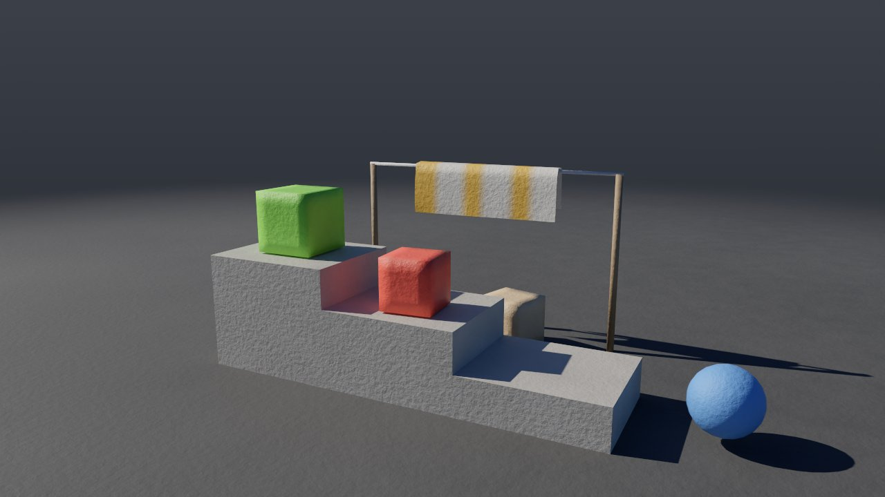

# Cloth, ropes and soft bodies: Cloth Solver (XPBD)

The **Cloth Solver** simulates everything that is held together only by
constraints between points: a tablecloth, a flag, a curtain, a rope, a rubber
ball or a pillow. It uses XPBD (*Extended Position Based Dynamics*), just like
Vellum in Houdini. The geometry's points are mass points. Edges, diagonals and
bends are constraints that hold length, shape and folds. A closed mesh can also
hold its volume, and each piece the shape it had at rest (a soft body). A
dented piece can keep its dent. Overstretched
cloth tears, and RBD Solver pieces interact with it in both directions: the
cloth slows them down, carries them and flings them away. Points, faces and
edges all collide, so the cloth passes neither through itself nor over a thin
rod between its points.


```
./build/prototype --example tablecloth                 # in the editor: Play
./build/prototype sim tablecloth ubrus.mp4 --frames 120
./build/prototype sim flag vlajka.png --every 15 --frames 90
./build/prototype sim tarp plachta.mp4 --frames 90
./build/prototype sim soft_bodies mekka.mp4 --frames 90
```

## 1. Examples

### Tablecloth and ball

The **tablecloth** example ([examples/sim/tablecloth.pgsim](../examples/sim/tablecloth.pgsim)):

- A **Grid** of 1.8 × 1.5 m (38 × 45 points) moved by a Transform to a height
  of 1.15 m. The Primitive Wrangle `checks` colors its faces in red-and-white
  checks (`@P` in a Primitive Wrangle is the center of the face).
- A **Sphere** with a radius of 17 cm, higher up and slightly off to the side.
  The Primitive Wrangle `blue` colors it.
- A **Merge** combines both into a single geometry for the **Cloth Solver**.
  The grid is open, so it becomes cloth. The sphere is closed, and Pressure 1
  turns it into a ball that holds its volume.
- **Colliders**: the table top, four legs and a bowl on the table (Object
  objects).

The tablecloth falls, the air slows it down and its edges ripple. It drapes
over the edges of the table and over the bowl. The corners hang and fold into
pleats. The ball lands on the tablecloth, dents it, slides and rolls to the
floor. The simulation takes about 69 ms per frame (2,000 points, 20 substeps),
35 ms without Faces and Edges.

### Flag in the wind

The **flag** example ([examples/sim/flag.pgsim](../examples/sim/flag.pgsim)):

- A Grid of 1.8 × 1.2 m standing upright.
- A Point Wrangle sets the points by the pole to `i@pin = @P.x < 0.07;`, so
  they are pinned.
- **Wind** with gusts (gusts 0.7) blows at 8 m/s.

The flag unfurls and flutters, and gusts of wind run through it as waves.
The simulation takes about 34 ms per frame, 13 ms without Faces and Edges.


### Tarp, crates and a concrete block

The **tarp** example ([examples/sim/tarp.pgsim](../examples/sim/tarp.pgsim)):

- A **Grid** of 2.4 × 2.4 m (41 × 41 points) at a height of 1.4 m. A Point
  Wrangle pins the entire border to a frame on four posts
  (`i@pin = abs(@P.x) > 1.17 || abs(@P.z) > 1.17;`). The hem gets the
  attribute `f@tear = 3`, so it holds three times as much and does not tear at
  the frame.
- **Cloth Solver:** tarpaulin (Density 0.4, Stretch and Shear both 20,000 N/m,
  so that it stretches neither straight nor on the bias), **Tear 0.8**,
  Damping 4, 40 substeps. The sharp edges of the crates tension the tarp more
  when faces and edges collide too (§4), and with a threshold of 0.6 the crates
  would tear it on their own.
- **RBD Solver:** three wooden crates (200 kg/m³) just above the tarp and a
  concrete block (2400 kg/m³, 150 kg) high up. Its **Collider** output feeds
  into the **Colliders** of the Cloth Solver.

The crates land on the tarp, which sags under them, springs and pushes them
back up until they settle in the hollow. Then the block lands, stretches the
tarp more than it can bear, and breaks through it. The tarp whips up, the
crates bounce, and one falls through the hole after the block. The simulation
takes about 89 ms per frame, 58 ms without Faces
and Edges.


### Soft bodies and a towel

The **soft_bodies** example ([examples/sim/soft_bodies.pgsim](../examples/sim/soft_bodies.pgsim)):

- Three boxes (**Box**, Divisions 4 and 5) and a sphere (**Sphere**) fall onto
  stairs made of three objects. A Point Wrangle gives each a color and the
  attributes `f@shape` and `f@plasticity`: jelly `shape = 0.03`, rubber `1`,
  clay `0.6` with `plasticity = 1`, and the ball `0.5`. The others have
  `plasticity = 0`.
- A **Grid** of 0.9 × 0.6 m (16 × 11 points, 6 cm apart) as a towel with
  `f@shape = 0`, so it is ordinary cloth. It falls onto a rod behind the stairs
  with a diameter of 2 cm, which lies between two rows of its points.
- A single **Cloth Solver** simulates everything: Shape 1500 N/m, Plasticity 1,
  Yield 1 cm, Stretch and Shear both 3000 N/m, 30 substeps.

The jelly lands on the top step, sags and settles. The rubber bounces and the
ball rolls down the stairs to the floor. The clay lands corner-first on the
edge of a step and the corner stays dented. The towel hangs over the rod even
though the rod is thinner than the spacing of its points: its edges and faces
collide too. The simulation takes about 42 ms per frame (614 points,
30 substeps).



## 2. What becomes what

The geometry connected to the **Geometry** input determines what is simulated:

| Geometry | What it becomes | Constraints |
|---|---|---|
| polygons (grid, anything made of faces) | cloth | edges hold length (Stretch), quad diagonals hold shape (shear), points across the shared edge of two triangles hold distance (Bend) |
| open polylines | rope | segments hold length, each point and the one after next hold distance (bend) |
| closed mesh (sphere, box) with Pressure > 0 | balloon, pillow | like cloth, plus volume = Pressure × rest volume |
| anything with Shape > 0 | soft body: jelly, rubber, clay | like cloth, plus each piece holds the shape it had at rest, wherever it is and however it is rotated |

**Tearing** (Tear > 0): an edge (rope segment) that stretches by more than Tear
× its rest length breaks. Where broken edges separate the faces around a
point, the point splits in two and the cloth opens there. A rope separates
into two. A balloon that tears becomes ordinary cloth (it deflates). The point
attribute `tear` multiplies the threshold: 3 a reinforced hem, 0.5 a
perforation. An edge of a single face, i.e. the border of the cloth or the
border of a hole, does not tear, because it would not separate anything.
It stretches and pulls on neighboring edges, which then break.

**Shape** (Shape > 0): each piece, i.e. the points held together by faces
and lines, holds the shape it had at rest. The piece can move and rotate, but
its points return to their places in that shape: a cube stays a cube,
even when it lands on a corner. The point attribute `shape` multiplies the
strength. `0` means ordinary cloth, so a towel and soft bodies can be in one
solver. A piece dented further than **Yield** keeps a fraction **Plasticity**
of the dent: the shape it holds changes, and with it the lengths of its
constraints. The point attribute `plasticity` multiplies the fraction (clay
among rubber).

Points with the attribute `pin` = 1 do not move by themselves. They go where
the geometry has them in the current frame, so animated geometry (for example
a keyframed Transform) carries them along: a flag on a flagpole or a curtain
on a sliding rail. Between frames a pinned point moves smoothly, by substeps.
A point is pinned when its `pin` is above 0.5.

Instead of using a wrangle, `pin` and `tear` can be **painted with a brush**
in the viewport: display the Cloth Solver input, press **P**, and stroke over
the cloth (with Ctrl it erases). This creates an Attribute Paint node whose
dabs are locations, not point numbers — the cloth can then be made finer and
the painting stays. Corners can also be lifted with a handle
(**2**, select, **W**) — an Edit node with a soft radius. The **shade_sail**
example was made that way; see [editing.md](editing.md).

A point's mass is the density (Density, kg/m², for ropes kg/m) times the area
around it. Mass can also be given directly with the point attribute `mass`
(kg). The solver takes the initial velocity from the attribute `v` if the
geometry has it.

## 3. Parameters

| Parameter | Default | Meaning |
|---|---|---|
| Density | 0.3 kg/m² | 0.1 silk, 0.3 cotton, 0.8 canvas |
| Stretch | 10,000 N/m | how well an edge holds its length: 10⁴ cotton, hundreds rubber |
| Shear | 1 N/m | how well a quad holds its shape (pull on the bias): 1 fabric that drapes; same as Stretch for tarp, foil, paper |
| Bend | 1 N/m | bending stiffness: 0.1 silk, 1 cotton, 10 canvas, 1000 cardboard |
| Pressure | 0 | closed meshes hold this fraction of their rest volume; 0 = cloth |
| Tear | 0 | how much longer than at rest an edge gets before it breaks: 0.3 = by 30 %; 0 never |
| Shape | 0 N/m | how strongly each piece holds its rest shape, per point: tens jelly, thousands rubber; 0 none (cloth) |
| Plasticity | 0 | fraction of the dent beyond Yield that remains: 0 springs back, 1 all of it remains |
| Yield | 0.02 m | how far from its shape a point can be dented and still return |
| Thickness | 0.01 m | how far the cloth stays from the floor, objects and itself |
| Friction | 0.4 | 0 slides, 1 grips |
| Self Collision | on | the cloth does not pass through itself |
| Faces and Edges | on | faces and edges collide too, not only points (§4); off is faster |
| Floor | on | floor at height 0 |
| Air Drag | 1 | how strongly the air pushes: still air during a fall, wind, gas flow |
| Damping | 0.5 1/s | how quickly motion dies down by itself |
| Gravity | 9.81 m/s² | |
| Substeps | 20 | substeps per frame; more = stiffer and more stable |
| Color | brick | color of faces without their own `Cd` |

The stiffnesses are physical (N/m) and depend neither on the number of
substeps nor on the mesh density. More substeps only bring the cloth closer to
what the stiffnesses say.

**Colliders** take objects (Object, including animated ones) and **RBD Solver
pieces**: debris falling onto a tarp, or a tarp thrown over falling pieces.
The coupling is two-way: a piece landing on the cloth makes it sag, and the
cloth slows it down, carries it or flings it away (see §4).
**Forces** take wind (Wind). When the scene contains a Pyro Solver, the cloth
is also carried by the flow of its gas, for example hot air above a fire.

The **Look** output connects to Output, so the cloth is simulated and drawn.
The **Cloth** output leads to the **Cloth Geometry** node, which returns the
cloth as geometry (points with `v` and normals `N`) for further nodes, export
or USD.

## 4. How it works

The step follows Macklin et al., *Small Steps in Physics Simulation* (2019):
the frame is divided into substeps (Substeps), and each has exactly one pass
over the constraints. This approach converges better than many iterations in
one large step.

1. **Prediction:** velocity + gravity + air → new position, damping.
2. **Distance constraints** (stretch, shear, bend) with compliance α =
   1/stiffness, in a substep α̃ = α/h². Quad diagonals hold the shape with
   stiffness Shear. Fabric is much more compliant on the bias than along the
   threads, and that is why it drapes; a tarp or foil does not.
3. **Balloon volume:** the gradient of the volume with respect to a point is
   one sixth of the sum of the cross products of the other two vertices of
   each of its triangles.
4. **Shape** (Shape, *shape matching* after Müller et al. 2005): for each
   piece, the center of mass is computed now and in the shape it holds (points
   weighted by mass), together with the rotation that best fits the shape onto
   the piece. The rotation comes from Horn's method (1987): the eigenvector of
   the largest eigenvalue of its 4 × 4 matrix, found by Jacobi rotations. It is
   exact even for a flat piece and needs no estimate from the previous step.
   Each point is then moved towards where the shape wants it, with compliance
   1 / (Shape × `shape` × h²). A deviation larger than Yield shifts the shape
   the piece holds by Plasticity × `plasticity` of the excess. At the end of
   the step, the rest lengths of the constraints are also changed according to
   this shape, so the dent remains.
5. **Point self-collision:** points in a hashed grid are pushed apart to twice
   the radius (Thickness, or 0.3 of the average edge if that is larger).
   Neighbors connected by a constraint are not checked. Points that were
   already closer at rest (around the pole of a sphere) are only held at their
   rest distance. Otherwise the pole of the sphere would dent.
6. **Faces and edges** (Faces and Edges): a point is kept Thickness away from
   triangles that are not its own, and an edge from edges it shares no point
   with. Each pair is pushed apart along the direction between the closest
   locations, with points weighted by how much of the location they make up,
   and with friction. A point that passed through a triangle during a substep
   (faster than Thickness per substep) is recognized by being on the other side
   than it was at the start of the substep, and it returns to its side. The
   same goes for two edges that passed through each other. Pairs that may come
   into contact are found by a tree of faces (BVH) built from the rest
   position, whose nodes know where their faces point (a normal cone). A node
   whose faces point roughly the same way (within 57°) cannot touch itself.
   The same holds for two nodes that share points and together point the same
   way (Volino and Magnenat-Thalmann 1994). A flat or slightly curved cloth is
   thus dealt with at the root, and the search happens only in the folds.
   Whatever constraints already hold together is also skipped: points connected
   by a constraint and, within one piece, elements whose centers were closer
   than two average edges at rest. Ropes are in the tree too (as segments), so
   a rope lies on a rope, even in a knot.
7. **Tearing:** edges stretched beyond the threshold break. Points whose faces
   are split by the break into disconnected parts are split. Each additional
   part gets its own copy of the point at the same location and with the same
   velocity. Constraints, masses and balloons are then rebuilt from the new
   topology. Edges of a single face do not tear. They used to tear, opened
   nothing, and the constraint came back when rebuilt. The stretched border of
   a hole thus tore again in every substep, and the whole cloth was rebuilt
   from scratch each time. For the tarp in the tarp example, this cost more
   than the whole rest of the step.
8. **Collisions** with the floor and objects (shape distance functions) and
   friction: motion along the surface is reduced in proportion to the
   penetration depth. Whatever moves (pieces, animated objects) moves smoothly
   in substeps from where it was at the start of the frame to where it is at
   its end. It does not jump into the cloth by a whole frame at once. With
   Faces and Edges, edges and faces do not get close to objects either: on each
   edge the location closest to the object is found (samples at half the
   object's thinnest dimension, then golden-section search between the nearest
   two), and on each face the location closest to the object's center. A
   location that is inside the object is pushed out, and with it its points
   weighted by how much of the location they make up, with friction and with
   momentum transferred to the RBD piece. A thin rod or the sharp edge of a
   crate thus cannot slip between points.
9. **Velocity** = (new position − old) / h. A point that touched something in a
   substep does not bounce off it faster than that surface is moving.
   How far the collision pushed it out is a position correction, not a
   velocity. Otherwise a point deep inside a fast-flying piece would shoot out
   at hundreds of m/s. The cloth practically does not bounce off surfaces.

**RBD pieces and cloth, two-way.** In the cloth step, a piece is a body with
the mass and moment of inertia of its body in Jolt. In each substep, the
momentum the piece transferred to the cloth points is summed (m·Δx/h of each
point pushed away), and the piece slows down and spins by that amount. In the
following substeps it moves the way the cloth slowed it down. Where the cloth
leaves it (displacement, velocity and rotation relative to its path in Jolt),
the RBD Solver takes over at the start of the next step. That is why a crate
on a tarp settles and does not fall through it. A point squeezed between a
piece and the floor or a static object, or between two pieces, does not push
the piece: the floor carries it, or the pieces meet directly in Jolt.
Otherwise the point would act as a jack. The checkpoint remembers these
interactions just like those of water and gas.

**Air** pushes on each triangle like on a plate along its normal:
½ ρ C_d A |v·n| (v·n), where v is the air velocity relative to the face. The
force is limited so that within one substep it does not reverse the motion
against the air. Still air slows falling cloth: a tarp falling flat reaches at
most 2 m/s. A closed mesh receives air only from the outside, i.e. only on the
faces the air actually strikes. A ball thus falls like a ball, not like a
bunch of plates.

**Determinism** (invariant I5): constraints are greedily colored into at most
64 colors so that no two constraints of the same color share a point. Each
color is solved in parallel, the rest and the balloons serially in a fixed
order. The result is bit-for-bit identical on one and on four threads.

## 5. Frames, cache and checkpoint

- A frame (`Frame::cloth`) carries point positions and velocities as half
  floats. The frame cache includes cloth since version 11, and torn cloth since
  version 12: which geometry point each torn-off point comes from, which point
  each corner is on, and where ropes separated. `posedCloth` builds geometry
  from that, with the attributes of torn-off points taken from their original
  points. The rest geometry is not
  saved to disk, because it is in the network. When reading from the cache,
  `adoptCloth` gives it back to the frames (CLI `--from-cache`, editor, Python).
- The bake checkpoint contains positions and velocities exactly (float), the
  topology of torn cloth, and the shape that soft bodies hold where it has
  yielded (Plasticity; state version 7). Resuming is thus bit-for-bit
  identical to an uninterrupted simulation.
- The step profile (Frame::Profile) has its own **Cloth** entry.

## 6. Export

- **USD:** `prototype sim tarp - --export plachta.usda` writes the cloth under
  `/World/cloth`. Faces form a Mesh, ropes BasisCurves; points have normals
  and velocities for motion blur. Each frame has its mesh in its own layer
  (value clips, [usd.md](usd.md)), so torn cloth has new points and faces from
  the frame of the tear on. Pixar's USD library opens the scene without any
  validator findings, and the point and face counts match the simulation
  frames.
- **OBJ, PLY per frame:** a **Cloth Geometry** node connected after the Cloth
  Solver returns the cloth as geometry. `--export-node` then writes it per
  frame: `prototype sim tarp - --export out/plachta.$F4.obj
  --export-node <node name>`.
- **Python:** `sim.current.cloth()` returns the frame's cloth as geometry
  (points, `v`, `N`, faces) with numpy arrays ([python.md](python.md)).

## 7. Verification

`tests/test_cloth.cpp`:

- a rope swings down and holds its length;
- cloth drapes over a sphere and stays lying on it;
- pinned corners stay put and the rest hangs;
- a balloon holds its volume; without Pressure it becomes cloth;
- wind lifts a flag;
- 1 and 4 threads and restoring from state give the same result bit for bit;
- a soft ball stays round even where the points at the poles are pushed
  together;
- a tarp falls through still air more slowly than in free fall;
- the tablecloth example: network → simulation → frame written and read
  (`adoptCloth`) → checkpoint that resumes bit for bit;
- a curtain with a weight only stretches without Tear; with Tear it tears and
  the weight falls; torn-off points have the attributes of their original
  points;
- a square hung by its top corners with 500 kg on the bottom ones: its sides
  stretch beyond the threshold, but they are edges of a single face, so they
  hold. The constraints are not rebuilt even once (393 times in 24 frames
  without the fix);
- a rope with a weight breaks into two curves; an inflated balloon bursts;
- torn cloth: 1 and 4 threads, state, cache and back, bit for bit;
- the tarp example: the crates stay on the tarp and do not tear it on their
  own, the block breaks through it and falls to the floor, the checkpoint
  resumes bit for bit;
- USD export: cloth in every frame layer, after the tear with torn-off
  points, in the tarp's color, without solver attributes (`tests/test_usd.cpp`);
- Python: `frame.cloth()` returns the fallen cloth with `v` and `N`;
- a rope dropped across a second rope between its points: with edges it lies
  on it, without them it falls through to the floor;
- cloth with 20 cm squares on a rod with a diameter of 2 cm between two rows of
  points: with faces and edges it hangs on the rod and none of it is inside the
  rod; without them it falls through;
- a short rope dropped at 30 m/s onto a square held at its corners, far
  from them: 5 cm per substep, five times more than Thickness. It returns to
  its side and stays on top; without faces it passes through;
- a cube dropped rotated onto its corner: with Shape it lands, tips over and
  lies intact (no pair of points differs in distance from rest by more than
  6 %); without Shape the closed mesh is a sack that slumps;
- a cube compressed by a plate that moves in and back out again: the elastic
  one returns to its height, with Plasticity it stays compressed;
- two soft cubes (one plastic) and cloth on a rod: 1 and 4 threads and
  restoring from state give the same result bit for bit.

The examples pass the format test and the "all examples run" test.

**The soft_bodies example** after 3 s (measured through Python): the jelly,
the rubber and the ball return to their shape (no pair of points differs in
distance from rest by more than 0.8 %, 0.1 % and 0.0 % respectively), and the
clay has a dented corner (up to 19 %).

## 8. Limitations

- Faces and edges detect a pass-through only for pairs that the tree finds
  nearby, i.e. motion of up to roughly Thickness and an edge length per
  substep. It is not continuous collision detection (CCD) with time of impact.
  Within the same piece, elements that were closer than two edges at rest, and
  faces that point the same way (within 57°), do not collide. A sharp fold at
  a smaller distance is therefore guarded only by point self-collision.
- Faces and edges cost time: with them, the tablecloth and soft_bodies examples
  take twice as long, flag 2.6 times, tarp 1.5 times (§1). Turning off Faces
  and Edges returns the solver to points only.
- In the cloth step an RBD piece is a body, but within substeps its shape only
  translates, it does not rotate (the rotation per frame is small). Its inertia
  is taken as that of a box with its dimensions.
- The tearing limit is measured on the elongation, which, with a single pass
  over the constraints per substep, also includes the unconverged error. With
  a large mass ratio (heavy points on light cloth), it therefore tears earlier
  than the stiffness would imply. More substeps mitigate this.
- A small shred can tear off torn cloth and fly away.
- Each piece holds its shape as a whole, not by smaller regions (clusters).
  A large soft piece therefore does not bend in one place as freely as a
  jelly made of many clusters would.
- Granular materials are computed by a separate Grain Solver ([grains.md](grains.md)).
- The renderer draws cloth as opaque, without light showing through thin
  fabric.

## 9. References

- M. Macklin, M. Müller, N. Chentanez: *XPBD: Position-Based Simulation of
  Compliant Constrained Dynamics*, MIG 2016.
- M. Macklin, K. Storey, M. Lu et al.: *Small Steps in Physics Simulation*,
  SCA 2019.
- M. Müller et al.: *Position Based Dynamics*, VRIPHYS 2006.
- M. Müller, B. Heidelberger, M. Teschner, M. Gross: *Meshless Deformations
  Based on Shape Matching*, SIGGRAPH 2005.
- B. K. P. Horn: *Closed-form solution of absolute orientation using unit
  quaternions*, JOSA A 1987.
- P. Volino, N. Magnenat-Thalmann: *Efficient self-collision detection on
  smoothly discretized surface animations using geometrical shape
  regularity*, Eurographics 1994.
- C. Ericson: *Real-Time Collision Detection*, 2005 (closest points of a
  triangle and of segments).
