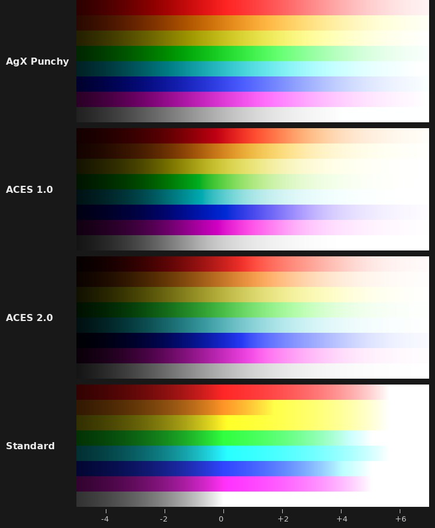
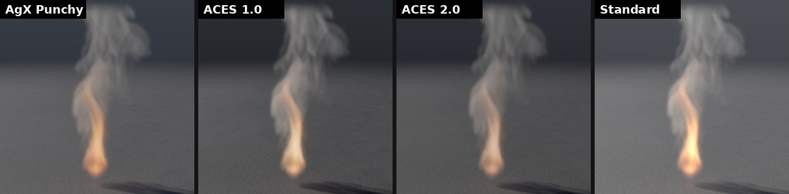

# Barvy: AgX, ACES a konfigurace OpenColorIO

Renderery počítají světlo, ne obraz: lineární hodnoty v primárních barvách
Rec. 709 (sRGB), kde 1 je bílá a slunce i plamen jdou daleko nad ni. Na
obrazovku je převádí **pohled** (View) uzlu Output. Kromě AgX z Blenderu
umí prototype oba výstupní převody **ACES** tak, jak je ukazuje OpenColorIO
v konfiguracích ACES, a EXR zapisuje i čte v barevných prostorech ACES.
Pohled může dát i **konfigurace OpenColorIO** (`config.ocio`) studia,
ACES nebo Blenderu (§3). Vše bez knihovny OpenColorIO, ověřeno proti ní
hodnotu po hodnotě (§5).





## 1. Rychlý start

```bash
./build/prototype sim campfire out/fire.png --renderer cycles --set output.render_view=aces2
./build/prototype sim campfire out/fire.exr --renderer cycles --set output.render_exr_space=acescg
```

V editoru: uzel **Output**, sekce **Render**, **View** a **EXR Color Space**.

## 2. Pohledy

| View | Co dělá |
|---|---|
| `agx_punchy` (výchozí) | AgX jako v Blenderu s lookem Punchy: víc kontrastu a barev |
| `agx` | AgX jako v Blenderu: jasné barvy přecházejí do bílé jako na filmu |
| `aces` (ACES Fit) | křivka viewportu (Narkowiczova aproximace ACES), každý kanál zvlášť |
| `aces1` (ACES 1.0) | „ACES 1.0 - SDR Video“ z konfigurací OpenColorIO pro ACES 1.3 |
| `aces2` (ACES 2.0) | „ACES 2.0 - SDR 100 nits (Rec.709)“ z konfigurací pro ACES 2.0 a 2.1 |
| `standard` | světlo, jak je, v sRGB; co je nad bílou, se ořízne |
| `ocio` (OpenColorIO) | pohled z konfigurace OpenColorIO podle parametrů OCIO (§3) |

Všechny jdou na obrazovku sRGB a platí pro oba renderery: path tracer
i Cycles, záložku Render, obrázky, sekvence i videa. Expozice (Output ›
Image › Exposure) se použije před pohledem.

- **ACES 1.0** je Reference Rendering Transform a výstup pro video, jak je
  má CTL Akademie: v RRT záře ve stínech sytých barev, modifikátor
  červené (jasně červená nezrůžoví), filmová křivka v AP1. Pak výstup:
  křivka pro kino (48 nitů) roztažená na 100 nitů, gama pro šero
  obývacího pokoje a o něco méně sytosti. Jasné syté barvy se stáčejí
  (oranžový plamen do žluté), to je známá vlastnost ACES 1.
- **ACES 2.0** tónuje světlost modelu vnímání barev (Hellwig 2022, jak ho
  ACES ladí), stlačí s ní sytost a barvy mimo Rec. 709 přivede dovnitř po
  přímkách k ohnisku. Odstín drží: plamen zůstane oranžový, jen jasnější
  a bělejší.

**Plate** (záznam kamery pod CG) se do světla vrací týmž pohledem
pozpátku ([plate.md](plate.md)). U ACES jsou zpětné převody ty, které má
OpenColorIO. ACES 1.0 navíc dopočítá světlo Newtonovou metodou: zpětný
modifikátor červené je jen přibližný, a sytá červená by se jinak vrátila
o dva stupně z 255 jinak (i v OpenColorIO).

## 3. Konfigurace OpenColorIO

Pohled **OpenColorIO** ukáže světlo pohledem z libovolné konfigurace
`config.ocio`: studiové, některé z konfigurací ACES
([OpenColorIO-Config-ACES](https://github.com/AcademySoftwareFoundation/OpenColorIO-Config-ACES))
nebo z Blenderu (`datafiles/colormanagement/config.ocio`, pohledy AgX,
Filmic, Khronos PBR Neutral). Knihovnu OpenColorIO to nepotřebuje:
prototype konfiguraci přečte sám (je v YAML), najde v ní displej, pohled,
looky a barevné prostory a převody spočítá tak, jak je počítá OpenColorIO
na procesoru.

```bash
./build/prototype sim campfire out/fire.png --renderer cycles \
    --set output.render_view=ocio \
    --set output.render_ocio_config=/cesta/ke/config.ocio \
    --set "output.render_ocio_view=ACES 2.0 - SDR 100 nits (Rec.709)"
```

V editoru: uzel **Output**, sekce **Render**, View **OpenColorIO**
a parametry OCIO pod ním:

| Parametr | Co říká |
|---|---|
| `render_ocio_config` (OCIO Config) | soubor konfigurace; relativní cesta se čte od složky sítě |
| `render_ocio_display` (OCIO Display) | displej, třeba `sRGB - Display`; prázdný = první z konfigurace (výchozí) |
| `render_ocio_view` (OCIO View) | pohled displeje, třeba `AgX`; prázdný = první pohled displeje |
| `render_ocio_looks` (OCIO Looks) | looky místo vlastních looků pohledu, jak je dává Blender a viewing pipeline OpenColorIO: `A, B`, `-B` pozpátku |
| `render_ocio_space` (OCIO Light Space) | ve kterém barevném prostoru konfigurace je světlo renderu; prázdný = lineární Rec. 709 konfigurace (`Linear Rec.709 (sRGB)`, `lin_rec709`…), jinak přes ACES2065-1 (role `aces_interchange`), jinak role `scene_linear` |

Názvy displejů, pohledů a prostorů nezáleží na velikosti písmen, prostor
lze zadat i aliasem nebo rolí. Co v konfiguraci není nebo se přečíst
nedá, Output ohlásí varováním (třeba `OpenColorIO: no view Nope of sRGB -
Display (…)`) a render ukáže pohled AgX Punchy. Konfigurace se čte jednou
pro každý soubor, jak právě je: změna souboru se projeví při dalším
cooku. Tabulky LUT hledá podle `search_path` od složky konfigurace,
proměnné v cestách (`${LUT_DIR}`) bere z jejího oddílu `environment`.

**Co přečte.** Konfigurace verze 1 i 2. Barevné prostory scény
i displejů, role, aliasy, `isdata`. Displeje a pohledy, také sdílené
(`shared_views`, `<USE_DISPLAY_NAME>`), `active_displays`, `active_views`
a `inactive_colorspaces`. View transformy ze scény na displej i z displeje
na displej, výchozí view transform jako most mezi nimi. Looky s process
space. Transformace:

- matice, exponenty (všechny styly), exponent s lineární částí (sRGB),
  logaritmy včetně `LogAffineTransform` a `LogCameraTransform` (ARRI,
  Sony, RED, Panasonic, DJI, Blackmagic…), CDL (ASC i bez ořezu), Range,
  Allocation (`uniform`, `lg2`);
- tabulky v souborech `.spi1d`, `.spi3d`, `.spimtx` a `.cube` (1D i 3D,
  Iridas i Resolve) s lineární nebo tetraedrickou interpolací;
- `ColorSpaceTransform`, `LookTransform`, `DisplayViewTransform`,
  `GroupTransform`;
- vestavěné transformace konfigurací ACES: výstupy pro SDR obrazovky
  (ACES 1.0 a 1.1 pro video i kino, s omezením gamutu i se simulovanou
  bílou D60 a D65; ACES 2.0 při 100 nitech včetně variant D60), displeje
  sRGB, Rec. 1886, Gamma 2.2 a 2.6, Display P3, P3-DCI, P3-D60, P3-D65
  a Rec. 2020 (i „MIRROR NEGS“), ACEScc, ACEScct, ACEScg, matice AP0 a AP1
  do XYZ a referenční kompresi gamutu ACES 1.3.

**Zpátky** (plate, [plate.md](plate.md)) jde každý krok tím, co pro ten
směr konfigurace má: `to_scene_reference` prostoru (Blender tak má AgX:
jinou tabulkou tam a jinou zpátky), `inverse_transform` looku, jinak
inverzí kroku. 1D tabulky se obracejí jako v OpenColorIO (obraty se
zarovnají, ploché konce vynechají). 3D tabulky jako výchozí procesory
OpenColorIO: přesná inverze (čtyřstěn buňky, který barvu obsahuje)
spočítaná v 48 × 48 × 48 bodech a mezi nimi lineárně. Plate se nakonec
dopočítá Newtonovou metodou proti pohledu, takže se ukáže zase sám sebou:
u ACES a u AgX a Filmic z Blenderu do 0,1 stupně z 255.

## 4. EXR v prostorech ACES

**EXR Color Space** (Output › Render) říká, v jakém prostoru je světlo
v EXR, ať je z Cycles, z path traceru nebo z viewportu:

| `render_exr_space` | Prostor | Kdy |
|---|---|---|
| `rec709` (výchozí) | lineární Rec. 709 (sRGB), D65 | jak renderery počítají, Nuke a Blender ve výchozím nastavení |
| `acescg` | ACEScg: primárky AP1, bílá ACES (asi D60) | kompozice v pipeline ACES |
| `aces2065_1` | ACES2065-1: primárky AP0, obsáhnou každou barvu | předávání materiálu v ACES |

Převádí se Bradfordovou adaptací bílé, stejnými maticemi jako
v OpenColorIO. Do jiného prostoru jde světlo (`R`, `G`, `B`) a barva
povrchů (`albedo.*`). Hloubka, normály, vektory pohybu a masky zůstávají,
jak jsou, a `catcher.*` je dál násobitel plate po kanálech. Soubor má
vždy atribut **chromaticities** (primárky a bílá), takže ho Nuke, Resolve
nebo OpenImageIO poznají.

**Čtení.** EXR s chromaticities jiného prostoru než Rec. 709 (třeba
ACEScg z jiného programu) prototype převede do Rec. 709: plate ve viewportu
i v obou rendererech, obraz načtený z Pythonu (`pg.read_picture`)
a oblohu z obrázku v Cycles (tu načítá Cycles sám, převod je v jejím
shaderu). Soubor bez atributu je Rec. 709, jak to má OpenEXR.

## 5. Ověření

Referenci dalo **OpenColorIO 2.6** (`pip install opencolorio`) s vlastními
vestavěnými konfiguracemi `cg-config-v2.2.0_aces-v1.3_ocio-v2.4` (ACES 1.0)
a `cg-config-v5.0.0_aces-v2.1_ocio-v2.6` (ACES 2.0), převod z „Linear
Rec.709 (sRGB)“ na „sRGB - Display“. Skript `tests/data/aces/make_aces.py`
zapsal `aces.txt`: šedé od hlubokého stínu po tisícinásobek bílé, primárky
a barvy mezi nimi, pleť, obloha, listí, oheň, každé v 20 jasech, a 400
náhodných barev. Navíc 1531 barev obrazu zpátky a převody do ACEScg
a ACES2065-1.

| | odchylka od OpenColorIO |
|---|---|
| ACES 1.0, světlo → obraz (780 hodnot) | nejvýš 2,1 · 10⁻⁵ na škále 0–1 (setina stupně z 255) |
| ACES 2.0, světlo → obraz (780 hodnot) | nejvýš 8,8 · 10⁻⁶ |
| ACES 2.0, obraz → světlo | nejvýš 5 · 10⁻⁴ poměrně |
| ACEScg, ACES2065-1 | nejvýš 2 · 10⁻⁶ poměrně |
| obraz → světlo → obraz, oba ACES | nejvýš 1,8 · 10⁻⁴ (OpenColorIO u ACES 1.0: 8,6 · 10⁻³) |

Jeden pixel stojí asi 0,4 µs (ACES 1.0) a 0,5 µs (ACES 2.0). Snímek
1280 × 720 je na čtyřech jádrech hotový za 0,13 s. Tabulky ACES 2.0
(hranice gamutu po stupních odstínu) se spočítají při prvním použití
za 7 ms.

Testy — `tests/test_aces.cpp` (5):
- oba pohledy a převody prostorů proti hodnotám OpenColorIO;
- obraz zpátky na světlo, které ho ukáže, do čtvrt stupně z 255;
- pohledy Outputu jsou tytéž převody, expozice se použije předem;
- EXR v ACEScg má chromaticities AP1 a přečte se zpátky v Rec. 709.

Obloha z obrázku v ACEScg osvětlí podlahu v Cycles stejně jako táž obloha
v Rec. 709, do 2 % v každém kanálu
(`render_cycles_lights_the_scene_with_a_sky_picture`).

Test `render_unshown_gives_back_the_light_a_picture_shows` vrací všech
256 šedí a 4000 barev fotografie na svůj stupeň v každém ze šesti pohledů.

**Konfigurace OpenColorIO.** Skript `tests/data/ocio/make_ocio.py` zapíše
dvě testovací konfigurace (`config.ocio` verze 2 ve tvaru konfigurací ACES
a Blenderu, `config_v1.ocio` verze 1) s tabulkami ve všech čtyřech
formátech a hodnoty, které z nich dává OpenColorIO 2.6: pohledy tam
i zpět s looky přes jeho viewing pipeline a převody mezi všemi prostory.

| | hodnot | odchylka od OpenColorIO |
|---|---|---|
| pohledy, světlo → obraz | 322 | nejvýš 8,8 · 10⁻⁶ |
| pohledy, obraz → světlo | 161 | nejvýš 5,9 · 10⁻⁶ |
| barevné prostory tam i zpět | 532 | nejvýš 4,6 · 10⁻⁷ |
| zpátky přes 3D tabulku (proti výchozímu procesoru) | 14 | nejvýš 4,8 · 10⁻⁷ |

Proti pěti vestavěným konfiguracím ACES z OpenColorIO 2.6 (CG i Studio,
ACES 1.3 i 2.1) a konfiguraci Blenderu 4.5 (mimo repozitář): 5300 hodnot
pohledů, převodů zpět a prostorů. Všechny pohledy pro SDR obrazovky a
všechny prostory, které umí, sedí do 10⁻⁴. Liší se jen zpětný převod 3D
tabulky Khronos PBR Neutral od přesné inverze OpenColorIO (až 2,7 %). Tam
se ale přesná inverze OpenColorIO liší i od jeho vlastního výchozího
procesoru. HDR displeje a výstupy a vestavěné převody kamer Canon, Apple
a ADX se ohlásí jménem.

Pohled AgX z Blenderu se načte za 0,11 s (přečtení tabulek), Khronos PBR
Neutral za 0,53 s (inverze 3D tabulky). Snímek 1920 × 1080 jde AgX na
čtyřech jádrech za 0,07 s, pixel plate zpátky stojí 2 až 3,5 µs.

Testy — `tests/test_ocio.cpp` (10): YAML, jak ho konfigurace píšou; co
konfigurace jmenuje; pohledy, převody zpět a prostory proti OpenColorIO;
pohled pro render (výchozí displej a pohled, plate tam a zpátky do půl
stupně z 255); světlo přes ACES2065-1, když konfigurace nemá lineární Rec.
709; co neumí, řekne jménem; renderery a uzel Output s konfigurací.

## 6. V kódu

| Soubor | Co dělá |
|---|---|
| `src/pg/render/Aces.h` | ACES 1.0 a 2.0 tam i zpět, vestavěné výstupy ACES z OpenColorIO, kódování sRGB |
| `src/pg/render/Ocio.h` | konfigurace OpenColorIO: prostory, displeje, pohledy, looky, transformace, tabulky |
| `src/pg/io/Yaml.h` | YAML, jak ho konfigurace OpenColorIO píšou |
| `src/pg/core/ColorSpace.h` | ACEScg, ACES2065-1, chromaticities, Bradford |
| `src/pg/render/PathTracer.cpp` | `shown`, `unshown`: pohled pro oba renderery |
| `src/pg/render/Save.cpp`, `src/pg/gl/Volume.cpp` | EXR v prostoru z Outputu |
| `src/pg/io/Exr.cpp`, `ExrRead.cpp`, `Picture.cpp` | atribut chromaticities, převod při čtení |

## 7. Omezení

- **Konfigurace OpenColorIO** se zadává na Outputu, proměnná prostředí
  `OCIO` se nečte, stejně jako jiné proměnné prostředí (cesty berou jen
  hodnoty z oddílu `environment` konfigurace). Nejsou transformace
  Grading (GradingPrimary, GradingTone, GradingRGBCurve), ExposureContrast
  ani NamedTransform. Nejsou soubory `.clf`, `.ctf`, `.3dl`, `.csp`
  a vestavěné převody kamer Canon, Apple a ADX. Pravidla souborů
  a pohledů (`file_rules`, `viewing_rules`) se nepoužívají. Looky Blenderu
  s grading transformacemi (AgX - Punchy…) proto ohlásí chybu, samotné
  pohledy fungují.
- **Obrazovka** je SDR. Pohledy ACES 1.0 a 2.0 jdou na sRGB. Přes
  konfiguraci OpenColorIO i na Rec. 1886, Display P3 a další SDR displeje.
  HDR (PQ, HLG) není.
- **Pracovní prostor** je lineární Rec. 709. Renderery nepočítají v ACEScg,
  barvy a textury se do něj nepřevádějí.
- **Viewport** ukazuje křivku ACES Fit, ne pohled zvolený na Outputu.
  Pohled Outputu je vidět v záložce Render a v obrázcích.
- **Looky** (LMT, třeba Reference Gamut Compression z ACES 1.3) a LUT
  (`.cube`) jdou jen přes konfiguraci OpenColorIO.
