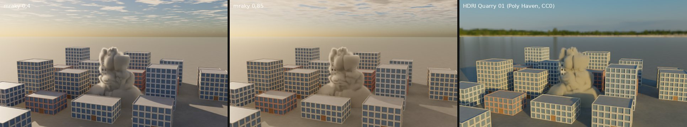

# Cycles: render z Blenderu

Záložka **Render** v editoru a příkazová řádka renderují přes **Cycles**,
renderer Blenderu (Apache 2.0). Cycles je ve stejném programu jako
knihovna, ne jako Blender: scéna snímku se převede do scény Cycles a ten ji
spočítá na všech jádrech procesoru. Šum vezme Intel Open Image Denoise jako
v Blenderu. Vlastní path tracer ([pathtracer.md](pathtracer.md)) zůstává
jako druhá volba a jako záloha v buildu bez Cycles.

Cycles navíc svítí fyzikální oblohou jako v Blenderu, převádí světlo na
obraz přes AgX a hladkým povrchům přidává detail ([§3](#3-obloha-barvy-a-povrchy)):


## 1. Rychlý start

V editoru:

1. Nad viewportem klikni na záložku **Render**. Renderuje Cycles (vlevo
   v liště záložky je volba **Cycles** / **Path tracer**).
2. První obraz přijde hned, z menších a větších pixelů, a s každým
   vzorkem se zaostří. Šum se bere průběžně.
3. Při přehrávání simulace ukáže záložka snímek po snímku, jak rychle se
   stihnou spočítat. Nově otevřená scéna se nejdřív ukáže, teprve potom
   se začne další snímek.
4. Nastavení (vzorky, odrazy, odšumění, clona, ostrost, clamp, rozmazání
   pohybem, velikost slunce, obloha, převod barev, detail povrchů) je
   v uzlu **Output** v sekci **Render**, stejné pro oba renderery.
5. Celý záběr do videa: ikona filmu v liště záložky (**Video…** nebo
   **Frames (PNG)…**), nebo **File › Render Video with Cycles…**. Každý
   snímek se vyrenderuje do konce s počtem vzorků z Outputu, ve velikosti
   záložky (25 / 50 / 100 %) a kamerou záběru. Okno s průběhem ukazuje
   poslední hotový snímek, vzorky snímku, který se právě renderuje, čas na
   snímek a kolik zbývá. Viz [render.md](render.md#render-videa-přes-cycles).


Z příkazové řádky:

```bash
./build/prototype sim street ulice.png --renderer cycles                 # poslední snímek, nastavení z Output
./build/prototype sim meadow louka.png --renderer cycles --samples 256 --size 1920x1080
./build/prototype sim campfire ohen.exr --renderer cycles                # EXR: R G B A, Z, albedo.*, N.*
./build/prototype sim campfire ohen.mp4 --renderer cycles --samples 32   # každý snímek do videa
```

Z Pythonu:

```python
net.render("ulice.png", renderer="cycles", samples=128)
```

Shrnutí na konci řekne, čím se renderovalo: `rendering 8720 ms/image
through Cycles 4.5.0, 64 samples a pixel, denoised by Open Image Denoise`.

## 2. Co se do Cycles převede

| ve scéně | v Cycles |
|---|---|
| polygony zobrazené geometrie | síť trojúhelníků s normálami a barvou `Cd` (atribut `Col`) |
| instance (tráva, stromy z Copy to Points) | jedna síť na variantu a objekty, které ji rozmístí: louka se 122 577 trsy trávy, 84 stromy a 65 keři je 22 sítí |
| koule, kvádry, válce, kužely, toroidy | rozdělené na trojúhelníky tak jemně, aby to nebylo vidět; holdout a shadow catcher jako v Blenderu |
| `roughness`, `metallic`, `Cd` | Principled BSDF s odleskem jako v Blenderu (Specular IOR Level 0,5) |
| `translucency` (stébla, listí) | k Principled BSDF přimíchaný Translucent BSDF |
| sklo (`glass` 1) | Glass BSDF s indexem 1,5 a nádechem barvy |
| povrch vody | Glass BSDF s indexem 1,33, uvnitř pohlcuje světlo podle Clarity a nabírá barvu Water Looku |
| drť kusů (volné body s `pscale`) | hranaté úlomky kamene a střepy skla jako objekty jedné z 18 sítí, natočené podle `orient`, každý v odstínu své barvy ([pathtracer.md §4](pathtracer.md#drť-déšť-a-mokrý-povrch)) |
| kapky deště | vřetena tak dlouhá, kolik kapka proletí za Streak snímku: Glass BSDF s indexem 1,33 smíchaný s Transparent BSDF podle Opacity, zezadu jen průhledná; objekt nevrhá stín |
| mokro pod deštěm | povrchy obrácené nahoru tmavší o polovinu s vrstvou (Coat) vody: Coat Weight podle Wet Floor, drsnost 0,03, index 1,33 |
| kouř, oheň, prach | objem: mřížky útlumu a záře v kvádru kolem plynu, Principled Volume |
| podlaha | čtverec s barvou podlahy, ke kraji mizí jako ve viewportu; pod fyzikální oblohou se Sky Behind zem až k obzoru ([§3](#3-obloha-barvy-a-povrchy)) |
| slunce | Sky `look`: vzdálené světlo (Sun) s úhlem Sun Size a stejnou silou jako náš; Sky `physical`: slunce oblohy Nishita |
| obloha | Sky `physical`: obloha Nishita; Sky `look`: s **Sky Behind** obloha Looku jako obrázek všude kolem; bez Sky Behind vždy pozadí studia pro kameru |
| kamera | záběr z kamery nebo pohled viewportu, objektiv, clona a ostrost z Output |
| pohyb (rychlost `v` bodů, kamera v pohybu) | rozmazání po dráze, dokud je otevřená závěrka ([níže](#rozmazání-pohybem)) |
| plate kamery záběru | průhledný film, i přes sklo; holdouty a catchery (objekty i podlaha) jako holdouty a shadow catchery Cyclesu; slunce a obloha jako skutečná světla; průchod Shadow Catcher jako násobitel plate ([plate.md](plate.md#ve-finálním-renderu-cycles-a-path-tracer)) |

Scéna je v Cycles otočená, protože Cycles má osu Z nahoru a my Y.
Expozice zůstává stejná jako v path traceru i ve viewportu.

**Sklo a voda propouštějí slunce do stínů.** Cycles by světlo za sklem
a pod vodou našel jen po lomených cestách (kaustikách), a místnost za oknem
nebo dno bazénu by zůstaly tmavé. Stínové paprsky proto sklem a vodou
projdou, jen trochu ztlumené, stejně jako v našem path traceru.

### Rozmazání pohybem


Kamera nezachytí okamžik, ale čas, kdy je otevřená závěrka. Co se
mezitím pohne, se rozmaže po své dráze. Cycles to umí stejně jako
v Blenderu: každý paprsek dostane svůj okamžik mezi otevřením a zavřením
závěrky a scénu vidí tak, jak v tu chvíli byla.

Jak dlouho je závěrka otevřená, říká **Motion Blur** v uzlu **Output**
v sekci **Render**: kolik snímku, kolem snímku. Výchozí je 0,5 snímku,
jako u filmové kamery se závěrkou 180° (Shutter 0,5 v Blenderu). Při 24
snímcích za sekundu je to 1/48 s. Hodnota 0 dává ostrý okamžik.

| co se hýbe | odkud to Cycles ví | jak se to rozmaže |
|---|---|---|
| kusy RBD, pruty výztuže, látka, povrch vody, zobrazená geometrie | rychlost `v` bodů (m/s) | síť má tři kroky: rohy trojúhelníků na začátku, uprostřed a na konci závěrky, posunuté o `v` × čas |
| drť (volné body s `pscale`) | rychlost `v` bodu | úlomek je objekt se třemi polohami, letí jako bod |
| instance (Copy to Points) | rychlost `v` bodu instance | jako drť |
| kamera záběru | kamera o snímek dřív a o snímek později | na začátku závěrky je o čtvrt cesty ke kameře předchozího snímku, na konci o čtvrt cesty k té dalšímu (při 0,5), otáčí se kratší cestou; mění-li se ohnisko, mění se i úhel záběru |

Normály zůstávají ve všech krocích jako uprostřed. Cycles by si je
spočítal z ploch a hladká voda by byla během závěrky hranatá. Kusy se
během tak krátké doby otočí jen nepatrně, proto stačí posun po přímce.

Rozmazání se zapne jen tehdy, když se něco hýbe. Scéna bez pohybu se
renderuje stejně rychle jako dřív a obraz je bit po bitu stejný jako
s nulovou závěrkou. Se závěrkou trvá render asi o 10 % déle (snímek 66
zřícení domu, 1280 × 720, 32 vzorků: 124 s proti 112 s).

Z příkazové řádky:

```bash
./build/prototype sim house_collapse dum.png --renderer cycles --frames 66 --start 66 \
    --set output.render_motion_blur=0.5      # výchozí: půl snímku
./build/prototype sim house_collapse dum.png --renderer cycles --frames 66 --start 66 \
    --set output.render_motion_blur=0        # ostrý okamžik
```

Nerozmazává se zatím plyn (kouř, prach, oheň: snímky nemají rychlost
plynu), objekty scény (koule, kvádry, …) a kapky deště. Kapky to
nepotřebují, protože jsou už vykreslené jako čárky tak dlouhé, kolik
kapka proletí za Streak snímku. Path tracer renderuje okamžik snímku.

## 3. Obloha, barvy a povrchy

Tři volby v sekci **Render** uzlu Output dělají z Cycles víc než náš path
tracer:

| volba | co dělá |
|---|---|
| **Sky** `physical` (výchozí) | obloha a slunce jako Sky Texture v Blenderu (model Nishita): modrá obloha, opar u obzoru, mraky podle **Clouds**. Slunce je tam, kde ho má Look, s jeho barvou (Light Color) a silou. Obloha k němu přidá modré světlo, které ve stínech chybělo. Se **Sky Behind** kamera vidí oblohu a zem až k obzoru, vzdálená zem mizí v oparu. Bez Sky Behind zůstane tmavé pozadí studia. |
| **Sky** `image` | obloha z obrázku všude kolem (HDRI, **Sky Image**): osvětlí scénu a se Sky Behind je vidět za ní |
| **Sky** `look` | slunce a obloha Looku jako ve viewportu a v path traceru |
| **Sky Image** | obrázek oblohy, equirectangular (2 : 1): `.hdr` nebo `.exr` se světlem, jaké je (třeba HDRI z [Poly Haven](https://polyhaven.com/hdris), CC0), i `.png` a `.jpg`. Relativní cesta se čte ze složky sítě. |
| **Sky Rotation**, **Sky Strength** | obrázek otočený kolem svislé osy (slunce z obrázku tam, kde ho záběr chce), jeho světlo krát síla |
| **Sky Sun** | k obrázku i slunce Looku: ostré stíny pod oblohou bez vlastního slunce |
| **Clouds** 0–1 (0) | kolik oblohy pokrývají mraky: 0 jasno, 0,3 pár mraků, 0,6 polojasno, 1 zataženo (slunce skoro schované, stíny měkké) |
| **Cloud Size**, **Cloud Wind**, **Cloud Direction** | jak velké jsou mraky (km, 1,5), jak rychle je nese vítr (m/s, 5) a kam (stupně od osy +x): snímek po snímku se posouvají |
| **View** `agx_punchy` (výchozí), `agx`, `aces` | jak se světlo převede na obraz: AgX jako v Blenderu, jasné barvy přecházejí do bílé jako na filmu. `agx_punchy` přidá look Punchy z Blenderu (víc kontrastu a barev, střední tóny tmavší), `aces` je křivka viewportu. Platí pro Cycles i path tracer. |
| **Surface Detail** 0–1 (1) | povrchy, které jsou ve scéně hladké, dostanou barvu a drsnost proměnlivou ve skvrnách metr až dva velkých a velkých jako dlaň, a drobné nerovnosti. Zem k tomu skvrny několika metrů. 0: hladké jako ve viewportu. |
| **Textures**, **Texture Folder** | fotografie materiálů (beton a jeho lom, omítka, cihlová zeď, malta, kov, asfalt, dřevo, střechy a tašky, dlažba, kůra, půda, trávník, písek) a textury z uzlů Material; vypnuté: jen vzory a barvy. Viz [materials.md](materials.md) |

Plochy, které říkají, z čeho jsou (`s@material`), kreslí Cycles jako ten
materiál: fotografií z knihovny programu, nebo vzorem (lom betonu
s kamínky, okna s místnostmi, rezavá ocel), vždy kolem jejich barvy `Cd`.
Generátory si materiál nastaví samy (Brick Wall, Concrete Fracture, Wood Fracture, Tree,
Grass…) a ostatním plochám ho dá uzel **Material**. Podrobnosti jsou
v [materials.md](materials.md).

Síla oblohy je nastavená tak, že slunce dává stejné světlo jako slunce
Looku. Test `render_cycles_lights_a_day_under_a_physical_sky` to ověřuje:
podlaha pod sluncem ve výšce 45° má jas matné podlahy pod sluncem Looku
a obloha přidá asi 10 %. Při nízkém slunci je podíl modrého světla oblohy
větší.



Mraky jsou vrstva dva kilometry nad zemí. Kde jsou a kde ne, určuje
Perlinův šum velký jako Cloud Size. Slunce je víc rozsvítí na tenkých
okrajích a kolem sebe, husté a zatažené jsou šedší. U obzoru mizí
v oparu. Slunce Looku je samostatné světlo, takže mrak, který přejde
přes slunce, scénu nezhasne. Zatažená obloha slunce tlumí sama: při
Clouds 1 zbude 15 % jeho světla.

Z příkazové řádky jdou volby nastavit přes `--set`:

```bash
./build/prototype sim demolition odstrel.png --renderer cycles --set output.render_clouds=0.5
./build/prototype sim demolition odstrel.png --renderer cycles \
    --set output.render_sky=image --set output.render_sky_image=obloha.hdr --set output.render_sky_rotation=90
```

Obloha je v Cycles i světlo, které se vzorkuje podle jasu (jako
v Blenderu): jasné části oblohy z obrázku i mraky najde každý paprsek,
nejen ten, který na ně náhodou narazí.

Path tracer svítí vždy oblohou Looku a detail povrchů nepřidává.
Převod barev (View) má stejný. Viewport kreslí oblohu Looku, mraky
a obrázek oblohy jsou jen v renderu.

## 4. Kouř, oheň a prach


Plyn ze simulace se do Cycles převede jako dvě mřížky (`Gas::dense`). Jedna
říká, kolik světla buňka zastaví na metr, druhá, kolik ho vydá plamen.
Obě se počítají stejně jako v path traceru: z kouře, teploty, plamene
a páry každé buňky podle Volume Looku, se stejným zeslabením u otevřených
stěn a nahoře. S párou přibude třetí mřížka, barva rozptylu každé buňky
(`pg_albedo`): průměr barvy kouře a páry vážený tím, kolik světla které
zastaví ([quench.md](quench.md#pára)). Cycles čte mřížky mezi středy buněk lineárně, stejně jako
viewport a path tracer.

V Cycles je to kvádr kolem dlaždic, ve kterých plyn je, s materiálem
**Principled Volume**:

- **Density** je útlum z mřížky.
- **Color** je podíl světla, který si kouř při rozptylu nechá. Spočítá se
  ze Smoke Color stejně jako v path traceru; s párou je to mřížka
  `pg_albedo`.
- **Anisotropy** je 0,31, průměr našich dvou laloků (0,7 × 0,55 dopředu
  a 0,3 × 0,25 dozadu).
- **Emission** je záře plamene z mřížky: černé těleso od 1000 K do 3000 K.

Cycles kvádrem prochází po krocích velkých jako buňka. Mřížky mají
nejvýš 32 milionů buněk. Větší plyn (prach odstřelu) se čte po
blocích 2 × 2 × 2 nebo větších. Bez NanoVDB (`-DPG_NANOVDB=OFF`)
plyn nevykreslí ani Cycles, ani path tracer.

## 5. Rozdíly proti path traceru

Rozdíly níže platí se stejným nastavením (Sky `look`, Surface Detail 0),
se kterým testy Cycles s path tracerem porovnávají.

- **Hrubé povrchy jsou v Cycles asi o 15 % světlejší.** Principled BSDF
  počítá i světlo, které se mezi mikroploškami odrazí víckrát. Náš odlesk
  GGX ho ztrácí. Matná podlaha pod sluncem je v obou stejná, test
  `render_cycles_lights_a_floor_as_the_sun_and_the_sky_do` to ověřuje
  na 2,5 %.
- **Kouř je v Cycles asi o 20 % světlejší** a plamen o 15 %. Cycles má
  místo našich dvou laloků jeden.
- **Průchody do EXR:** normála v Cycles míří vždy ke kameře, naše zůstává
  na straně, kam trojúhelník míří. Hloubka v Cycles je z prvního vzorku
  pixelu, naše je průměr.
- **Plyn je v Cycles pomalejší** ([§7](#7-výkon)): Cycles jím prochází
  po krocích, náš path tracer delta trackingem s maximy dlaždic.
- **Mokro:** Cycles dává mokrému povrchu vrstvu vody (Coat), náš path
  tracer mu jen sníží drsnost. Oba ho ztmaví o polovinu.
- **Déšť pod fyzikální oblohou je slabší**, protože kapky lámou skutečnou
  oblohu. Se Sky `look` mají čárky stejný kontrast jako v path traceru.
- **Rozmazání pohybem** má jen Cycles ([§2](#rozmazání-pohybem)). Path
  tracer renderuje okamžik snímku.

## 6. Build

Cycles se stáhne z GitHubu (`blender/cycles`, značka **v4.5.0**, mělký
klon asi 24 MB) a postaví jednou se zbytkem programu. K tomu potřebuje
**OpenImageIO** a **TBB** (vývojové soubory; OpenEXR přijde
s OpenImageIO):

```bash
sudo apt install libopenimageio-dev libpugixml-dev libtbb-dev   # Debian, Ubuntu
pkg install openimageio pugixml onetbb                          # FreeBSD
```

Cycles se postaví jen pro procesor: bez GPU (CUDA, OptiX, HIP, Metal,
oneAPI), bez OSL, OpenVDB, NanoVDB, OpenSubdiv, Alembic, USD
a OpenColorIO. Paprsky
v něm hledá stejný Embree jako v path traceru, pokud je v systému.
Odšumuje stejná Open Image Denoise jako náš path tracer. Na čtyřech
jádrech trvá první build Cycles asi 2 minuty (celý program od nuly
i s Open Image Denoise asi 11 minut), další buildy ho jen přilinkují.

Kdy se Cycles nepostaví a renderuje path tracer:

- bez OpenImageIO nebo TBB (CMake to napíše);
- když OpenImageIO v systému používá jinou standardní knihovnu C++ než
  build (clang s libc++ proti OpenImageIO s libstdc++ z Ubuntu);
- s `-DPG_SANITIZE_THREAD=ON` (jeho TBB není přeložené s thread
  sanitizerem) a ve Visual Studiu;
- s `-DPG_CYCLES=OFF`.

`prototype sim … --renderer cycles` v takovém buildu skončí chybou
a záložka Render nabídne jen path tracer.

## 7. Výkon

Čtyři jádra (Xeon s AVX-512), Release, stejné nastavení pro oba
renderery:

| scéna | rozlišení | vzorků | path tracer | Cycles |
|---|---|---|---|---|
| ulice | 720 × 540 | 128 | 8,5 s | 17,7 s |
| louka zblízka (obrázek nahoře) | 1280 × 720 | 128 | 301 s | 473 s |
| táborák (plyn 64 × 96 × 64) | 400 × 600 | 64 | 6,8 s | 48,7 s |
| kouř | 400 × 600 | 64 | 4,5 s | 18,3 s |

Cycles je na stejný počet vzorků pomalejší. Na plochách asi dvakrát: je
obecnější a počítá víc, třeba odlesk s vícenásobným rozptylem mezi
mikroploškami. Plynem prochází po krocích velkých jako buňka a v každém
kroku čte mřížky. Náš path tracer prázdná místa přeskakuje (delta tracking
s maximy dlaždic), proto je Cycles na kouři a ohni čtyřikrát až sedmkrát
pomalejší. Pro rychlý náhled je tu path tracer, finální obraz dá Cycles
stejně jako v Blenderu.

V záložce Render je první obraz z větších pixelů hotový za zlomek
sekundy. Při přehrávání ukazuje záložka snímky v nižším rozlišení, plné
dostane snímek, na kterém se zastaví.

## 8. Jak to funguje

- `src/pg/render/Cycles.h`, `Cycles.cpp`: `CyclesRender` drží session
  Cycles. Pro příkazovou řádku má každý snímek vlastní session až do
  konce. Pro záložku Render jedna session běží dál. Sítě, které nová scéna
  má taky, se znovu nestaví. Obrazy během renderu dostává záložka přes
  display driver Cycles (`DisplayDriver`, poloviční floaty RGBA). Na konci
  dostane přes output driver (`OutputDriver`) obraz, albedo, normály
  a hloubku pro EXR. Fyzikální obloha je uzel Sky Texture (Nishita) se
  světlem pozadí (`LIGHT_BACKGROUND`), detail povrchů jsou uzly Noise
  Texture a Bump v shaderu každého materiálu.
- Rozmazání pohybem (`Cycles.cpp`): síť s rychlostmi (`Mesh::velocity`)
  dostane `set_motion_steps(3)` a atributy
  `ATTR_STD_MOTION_VERTEX_POSITION` (rohy na začátku a na konci závěrky)
  a `ATTR_STD_MOTION_VERTEX_NORMAL`. Úlomek drti je objekt s `set_motion`
  (tři polohy), kamera má `set_motion` se třemi maticemi a
  `MOTION_POSITION_CENTER`. Integrátor má `set_motion_blur`, jen když se
  něco hýbe. Síť, která se hýbe, se po změně Motion Blur postaví znovu,
  ostatní zůstanou.
- Plate (`Cycles.cpp`, `Plate.h`): nad plate je film průhledný
  (`Background::transparent`, `transparent_glass`). Objekty a podlaha mají
  `set_use_holdout` nebo `set_is_shadow_catcher` a slunce i obloha mají
  `set_is_shadow_catcher`, protože jsou to skutečná světla. Průchod
  `PASS_SHADOW_CATCHER` se jmenuje „catcher“. Při čtení „combined“ dá
  Cycles CG bez catcherů i s alfou a z toho `overPlate` složí obraz.
- `src/pg/render/PathTracer.cpp`: `shown()` převádí lineární světlo na obraz
  (AgX, AgX Punchy, ACES) pro oba renderery.
- `src/pg/render/Gas.h`: `Gas::dense` dává mřížky plynu pro renderer, který
  čte husté mřížky.
- `tools/prototype/RenderView.cpp`: vlákno záložky Render s oběma renderery.
  Novější scéna (další snímek při přehrávání) se vezme, až ta stávající
  ukáže obraz, nebo po 3 sekundách.
- `tools/prototype/FrameRender.cpp`: snímek záběru do konce pro Render
  Video a Render Frames s Cycles nebo path tracerem, na vlastním vlákně.
  Každý snímek má vlastní session Cycles, stejně jako příkazová řádka.
  Stop ji zruší (`Session::cancel`), takže render skončí hned, ne až po
  snímku.
- `CMakeLists.txt`: Cycles se konfiguruje jako samostatný projekt
  v `build/cycles-build` a jeho knihovny se postaví jako cíl `cycles_build`.
  Přepínače, cesty a knihovny se přečtou z jeho vlastního buildu.

Testy (`tests/test_render.cpp`, `tests/test_gas.cpp`):

- `render_cycles_lights_a_floor_as_the_sun_and_the_sky_do`: podlaha pod
  sluncem i pod oblohou má jas matné podlahy (na 2,5 %).
- `render_cycles_shows_what_the_path_tracer_does`: stejné tvary na stejných
  místech jako v path traceru, jas do 25 %.
- `render_cycles_is_the_same_twice_and_its_passes_are_ours`: dva rendery
  jsou stejné a průchody sedí s path tracerem.
- `render_cycles_renders_the_gas_as_the_path_tracer_does`: stín kouře,
  světlo plamene a jas do 30 % jako v path traceru.
- `gas_dense_grids_are_the_gas_at_the_cells_middles`: mřížky odpovídají
  plynu ve středech buněk, velký plyn jde po blocích.
- `render_cycles_lights_a_day_under_a_physical_sky`: slunce fyzikální oblohy
  svítí jako slunce Looku a má jeho barvu, obloha je modrá.
- `render_cycles_surface_detail_makes_a_flat_surface_uneven`: detail mění
  jas povrchu z místa na místo, v průměru ho nechá stejný.
- `render_cycles_lights_the_scene_with_a_sky_picture`: obloha z obrázku
  osvětlí podlahu jako stejnoměrná obloha té barvy, Sky Strength ji
  zjasní, Sky Rotation otočí.
- `render_cycles_clouds_cover_the_sky_and_drift_on_the_wind`: mraky oblohu
  zbělí a vítr je posune.
- `render_agx_shows_middle_grey_as_blender_does_and_bright_colours_going_white`:
  střední šedá je v AgX v polovině, jasná červená přechází do bílé, Punchy
  má víc kontrastu a barev.
- `render_cycles_draws_the_grit_and_the_wet` (`tests/test_particles.cpp`):
  úlomek je vidět a podlaha pod ním je ve stínu, mokrá podlaha je tmavší
  než suchá.
- `render_scene_carries_how_fast_what_moves_goes`: každý roh trojúhelníku
  i každý úlomek drti nese rychlost svého bodu. Kamera mezi dvěma snímky
  je v půli cesty a otáčí se kratší cestou.
- `render_cycles_draws_the_cg_over_a_plate`: nad plate je plate tam, kde
  CG nic nemění, pixel po pixelu, CG kvádr ho zakryje, holdout odkryje,
  stín na catcheru ho ztmaví a sklem prosvítá
  ([plate.md](plate.md#ve-finálním-renderu-cycles-a-path-tracer)).
- `render_cycles_blurs_what_moves_while_the_shutter_is_open`: čtverec
  letící 24 m/s, úlomek drti a kamera, která jede kolem stojícího
  čtverce, jsou rozmazané. Stopa je o víc než 8 pixelů širší, nejvyšší
  jas je o víc než pětinu nižší a světla je stejně (do 15 %). S nulovou
  závěrkou je obraz bit po bitu stejný jako bez pohybu.

## 9. Co zatím chybí

- GPU (CUDA, OptiX, HIP, Metal): Cycles je postavený jen pro procesor.
- Rozmazání plynu a objektů scény ([§2](#rozmazání-pohybem)).
- OSL shadery, UV a normálové mapy (textury se kladou ze tří stran,
  reliéf je z výšky, [materials.md](materials.md)).
- Mraky jako objem (stíny mraků na zemi, mraky, do kterých se dá vletět)
  a obloha z obrázku ve viewportu.
- Plyn přímo jako NanoVDB v Cycles (bez husté mřížky): Cycles ho umí jen
  s OpenVDB.
