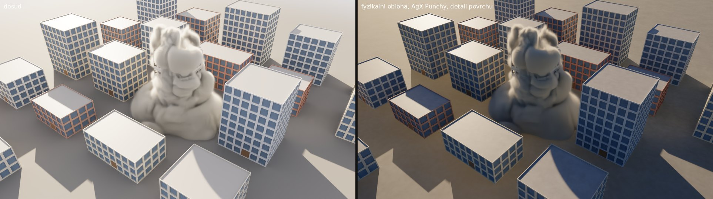
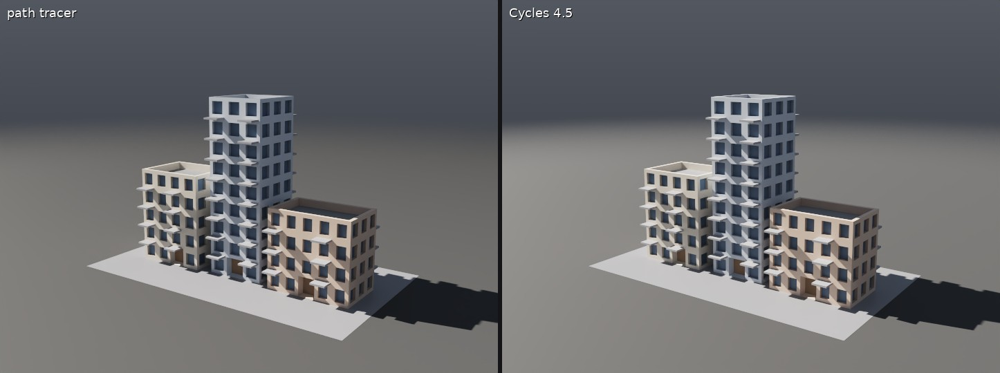
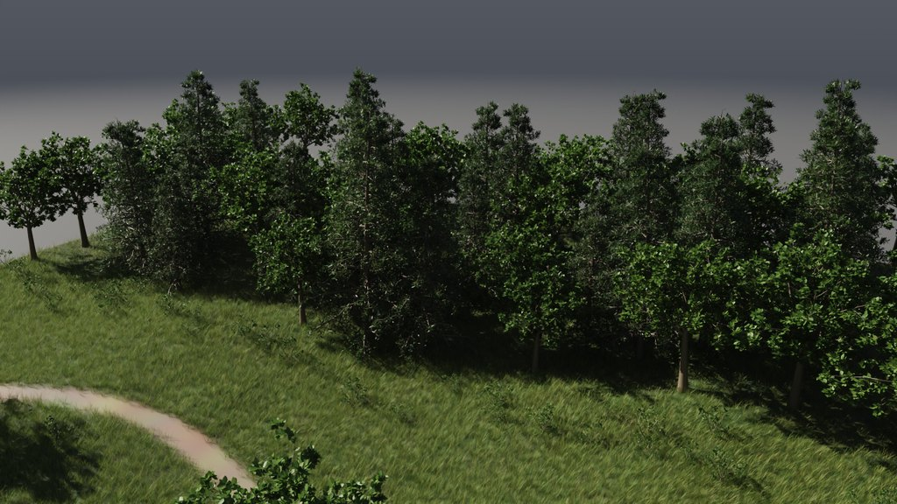
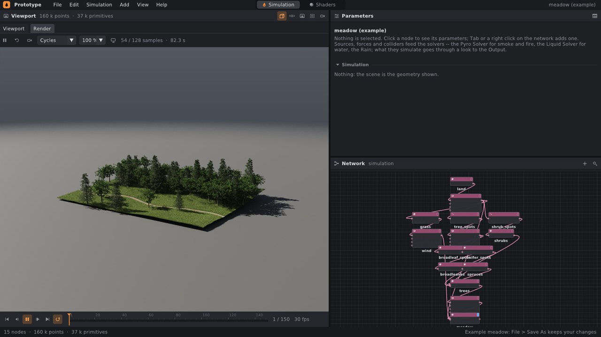
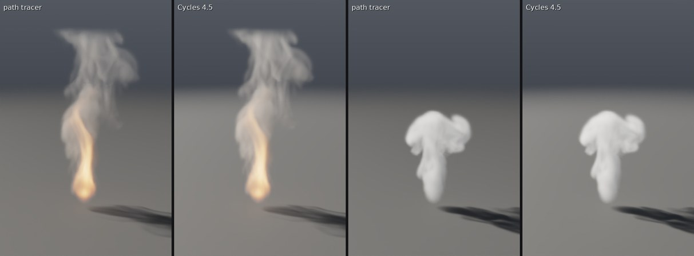

# Cycles: render z Blenderu

Záložka **Render** v editoru a příkazová řádka renderují přes **Cycles**,
renderer Blenderu (Apache 2.0). Cycles je ve stejném programu jako
knihovna, ne jako Blender: scéna snímku se převede do scény Cycles a ten ji
spočítá na všech jádrech procesoru. Šum vezme Intel Open Image Denoise jako
v Blenderu. Vlastní path tracer ([pathtracer.md](pathtracer.md)) zůstává
jako druhá volba a jako záloha v buildu bez Cycles.

Cycles navíc svítí fyzikální oblohou jako v Blenderu, převádí světlo na
obraz přes AgX a hladkým povrchům přidává detail ([§3](#3-obloha-barvy-a-povrchy)):







## 1. Rychlý start

V editoru:

1. Nad viewportem klikni na záložku **Render**. Renderuje Cycles (vlevo
   v liště záložky je volba **Cycles** / **Path tracer**).
2. První obraz přijde hned, z menších a větších pixelů, a s každým
   vzorkem se zaostří. Šum se bere průběžně.
3. Při přehrávání simulace ukáže záložka snímek po snímku, jak rychle se
   stihnou spočítat. Nově otevřená scéna se nejdřív ukáže, teprve potom
   se začne další snímek.
4. Nastavení (vzorky, odrazy, odšumění, clona, ostrost, clamp, velikost
   slunce, obloha, převod barev, detail povrchů) je v uzlu **Output**
   v sekci **Render**, stejné pro oba renderery.



Z příkazové řádky:

```bash
./build/prototype sim street ulice.png --renderer cycles                 # poslední snímek, nastavení z Output
./build/prototype sim meadow louka.png --renderer cycles --samples 256 --size 1920x1080
./build/prototype sim campfire ohen.exr --renderer cycles                # EXR: R G B A, Z, albedo.*, N.*
./build/prototype sim campfire ohen.mp4 --renderer cycles --samples 32   # každý snímek do videa
```

Z Pythonu:

```python
net.render("ulice.png", renderer="cycles", samples=128)
```

Shrnutí na konci řekne, čím se renderovalo: `rendering 8720 ms/image
through Cycles 4.5.0, 64 samples a pixel, denoised by Open Image Denoise`.

## 2. Co se do Cycles převede

| ve scéně | v Cycles |
|---|---|
| polygony zobrazené geometrie | síť trojúhelníků s normálami a barvou `Cd` (atribut `Col`) |
| instance (tráva, stromy z Copy to Points) | jedna síť na variantu a objekty, které ji rozmístí: louka se 122 577 trsy trávy, 84 stromy a 65 keři je 22 sítí |
| koule, kvádry, válce, kužely, toroidy | rozdělené na trojúhelníky tak jemně, aby to nebylo vidět; holdout a shadow catcher jako v Blenderu |
| `roughness`, `metallic`, `Cd` | Principled BSDF s odleskem jako v Blenderu (Specular IOR Level 0,5) |
| `translucency` (stébla, listí) | k Principled BSDF přimíchaný Translucent BSDF |
| sklo (`glass` 1) | Glass BSDF s indexem 1,5 a nádechem barvy |
| povrch vody | Glass BSDF s indexem 1,33, uvnitř pohlcuje světlo podle Clarity a nabírá barvu Water Looku |
| kouř, oheň, prach | objem: mřížky útlumu a záře v kvádru kolem plynu, Principled Volume |
| podlaha | čtverec s barvou podlahy, ke kraji mizí jako ve viewportu; pod fyzikální oblohou se Sky Behind zem až k obzoru ([§3](#3-obloha-barvy-a-povrchy)) |
| slunce | Sky `look`: vzdálené světlo (Sun) s úhlem Sun Size a stejnou silou jako náš; Sky `physical`: slunce oblohy Nishita |
| obloha | Sky `physical`: obloha Nishita; Sky `look`: s **Sky Behind** obloha Looku jako obrázek všude kolem; bez Sky Behind vždy pozadí studia pro kameru |
| kamera | záběr z kamery nebo pohled viewportu, objektiv, clona a ostrost z Output |

Scéna je v Cycles otočená, protože Cycles má osu Z nahoru a my Y.
Expozice zůstává stejná jako v path traceru i ve viewportu.

**Sklo a voda propouštějí slunce do stínů.** Cycles by světlo za sklem
a pod vodou našel jen po lomených cestách (kaustikách), a místnost za oknem
nebo dno bazénu by zůstaly tmavé. Stínové paprsky proto sklem a vodou
projdou, jen trochu ztlumené, stejně jako v našem path traceru.

## 3. Obloha, barvy a povrchy

Tři volby v sekci **Render** uzlu Output dělají z Cycles víc než náš path
tracer:

| volba | co dělá |
|---|---|
| **Sky** `physical` (výchozí) | obloha a slunce jako Sky Texture v Blenderu (model Nishita): modrá obloha, opar u obzoru. Slunce je tam, kde ho má Look, s jeho barvou (Light Color) a silou. Obloha k němu přidá modré světlo, které ve stínech chybělo. Se **Sky Behind** kamera vidí oblohu a zem až k obzoru, vzdálená zem mizí v oparu. Bez Sky Behind zůstane tmavé pozadí studia. |
| **Sky** `look` | slunce a obloha Looku jako ve viewportu a v path traceru |
| **View** `agx_punchy` (výchozí), `agx`, `aces` | jak se světlo převede na obraz: AgX jako v Blenderu, jasné barvy přecházejí do bílé jako na filmu. `agx_punchy` přidá look Punchy z Blenderu (víc kontrastu a barev, střední tóny tmavší), `aces` je křivka viewportu. Platí pro Cycles i path tracer. |
| **Surface Detail** 0–1 (1) | povrchy, které jsou ve scéně hladké, dostanou barvu a drsnost proměnlivou ve skvrnách metr až dva velkých a velkých jako dlaň, a drobné nerovnosti. Zem k tomu skvrny několika metrů. 0: hladké jako ve viewportu. |

Síla oblohy je nastavená tak, že slunce dává stejné světlo jako slunce
Looku. Test `render_cycles_lights_a_day_under_a_physical_sky` to ověřuje:
podlaha pod sluncem ve výšce 45° má jas matné podlahy pod sluncem Looku
a obloha přidá asi 10 %. Při nízkém slunci je podíl modrého světla oblohy
větší.

Obloha je v Cycles i světlo, které se vzorkuje podle jasu (jako
v Blenderu): slunce na obloze najde každý paprsek, nejen ten, který
na něj náhodou narazí.

Path tracer svítí vždy oblohou Looku a detail povrchů nepřidává.
Převod barev (View) má stejný.

## 4. Kouř, oheň a prach



Plyn ze simulace se do Cycles převede jako dvě mřížky (`Gas::dense`). Jedna
říká, kolik světla buňka zastaví na metr, druhá, kolik ho vydá plamen.
Obě se počítají stejně jako v path traceru: z kouře, teploty a plamene
každé buňky podle Volume Looku, se stejným zeslabením u otevřených stěn
a nahoře. Cycles čte mřížky mezi středy buněk lineárně, stejně jako
viewport a path tracer.

V Cycles je to kvádr kolem dlaždic, ve kterých plyn je, s materiálem
**Principled Volume**:

- **Density** je útlum z mřížky.
- **Color** je podíl světla, který si kouř při rozptylu nechá. Spočítá se
  ze Smoke Color stejně jako v path traceru.
- **Anisotropy** je 0,31, průměr našich dvou laloků (0,7 × 0,55 dopředu
  a 0,3 × 0,25 dozadu).
- **Emission** je záře plamene z mřížky: černé těleso od 1000 K do 3000 K.

Cycles kvádrem prochází po krocích velkých jako buňka. Mřížky mají
nejvýš 32 milionů buněk. Větší plyn (prach odstřelu) se čte po
blocích 2 × 2 × 2 nebo větších. Bez NanoVDB (`-DPG_NANOVDB=OFF`)
plyn nevykreslí ani Cycles, ani path tracer.

## 5. Rozdíly proti path traceru

Rozdíly níže platí se stejným nastavením (Sky `look`, Surface Detail 0),
se kterým testy Cycles s path tracerem porovnávají.

- **Hrubé povrchy jsou v Cycles asi o 15 % světlejší.** Principled BSDF
  počítá i světlo, které se mezi mikroploškami odrazí víckrát. Náš odlesk
  GGX ho ztrácí. Matná podlaha pod sluncem je v obou stejná, test
  `render_cycles_lights_a_floor_as_the_sun_and_the_sky_do` to ověřuje
  na 2,5 %.
- **Kouř je v Cycles asi o 20 % světlejší** a plamen o 15 %. Cycles má
  místo našich dvou laloků jeden.
- **Průchody do EXR:** normála v Cycles míří vždy ke kameře, naše zůstává
  na straně, kam trojúhelník míří. Hloubka v Cycles je z prvního vzorku
  pixelu, naše je průměr.
- **Plyn je v Cycles pomalejší** ([§7](#7-výkon)): Cycles jím prochází
  po krocích, náš path tracer delta trackingem s maximy dlaždic.

## 6. Build

Cycles se stáhne z GitHubu (`blender/cycles`, značka **v4.5.0**, mělký
klon asi 24 MB) a postaví jednou se zbytkem programu. K tomu potřebuje
**OpenImageIO** a **TBB** (vývojové soubory; OpenEXR přijde
s OpenImageIO):

```bash
sudo apt install libopenimageio-dev libpugixml-dev libtbb-dev   # Debian, Ubuntu
pkg install openimageio pugixml onetbb                          # FreeBSD
```

Cycles se postaví jen pro procesor: bez GPU (CUDA, OptiX, HIP, Metal,
oneAPI), bez OSL, OpenVDB, NanoVDB, OpenSubdiv, Alembic, USD
a OpenColorIO. Paprsky
v něm hledá stejný Embree jako v path traceru, pokud je v systému.
Odšumuje stejná Open Image Denoise jako náš path tracer. Na čtyřech
jádrech trvá první build Cycles asi 2 minuty (celý program od nuly
i s Open Image Denoise asi 11 minut), další buildy ho jen přilinkují.

Kdy se Cycles nepostaví a renderuje path tracer:

- bez OpenImageIO nebo TBB (CMake to napíše);
- když OpenImageIO v systému používá jinou standardní knihovnu C++ než
  build (clang s libc++ proti OpenImageIO s libstdc++ z Ubuntu);
- s `-DPG_SANITIZE_THREAD=ON` (jeho TBB není přeložené s thread
  sanitizerem) a ve Visual Studiu;
- s `-DPG_CYCLES=OFF`.

`prototype sim … --renderer cycles` v takovém buildu skončí chybou
a záložka Render nabídne jen path tracer.

## 7. Výkon

Čtyři jádra (Xeon s AVX-512), Release, stejné nastavení pro oba
renderery:

| scéna | rozlišení | vzorků | path tracer | Cycles |
|---|---|---|---|---|
| ulice | 720 × 540 | 128 | 8,5 s | 17,7 s |
| louka zblízka (obrázek nahoře) | 1280 × 720 | 128 | 301 s | 473 s |
| táborák (plyn 64 × 96 × 64) | 400 × 600 | 64 | 6,8 s | 48,7 s |
| kouř | 400 × 600 | 64 | 4,5 s | 18,3 s |

Cycles je na stejný počet vzorků pomalejší. Na plochách asi dvakrát: je
obecnější a počítá víc, třeba odlesk s vícenásobným rozptylem mezi
mikroploškami. Plynem prochází po krocích velkých jako buňka a v každém
kroku čte mřížky. Náš path tracer prázdná místa přeskakuje (delta tracking
s maximy dlaždic), proto je Cycles na kouři a ohni čtyřikrát až sedmkrát
pomalejší. Pro rychlý náhled je tu path tracer, finální obraz dá Cycles
stejně jako v Blenderu.

V záložce Render je první obraz z větších pixelů hotový za zlomek
sekundy. Při přehrávání ukazuje záložka snímky v nižším rozlišení, plné
dostane snímek, na kterém se zastaví.

## 8. Jak to funguje

- `src/pg/render/Cycles.h`, `Cycles.cpp`: `CyclesRender` drží session
  Cycles. Pro příkazovou řádku má každý snímek vlastní session až do
  konce. Pro záložku Render jedna session běží dál. Sítě, které nová scéna
  má taky, se znovu nestaví. Obrazy během renderu dostává záložka přes
  display driver Cycles (`DisplayDriver`, poloviční floaty RGBA). Na konci
  dostane přes output driver (`OutputDriver`) obraz, albedo, normály
  a hloubku pro EXR. Fyzikální obloha je uzel Sky Texture (Nishita) se
  světlem pozadí (`LIGHT_BACKGROUND`), detail povrchů jsou uzly Noise
  Texture a Bump v shaderu každého materiálu.
- `src/pg/render/PathTracer.cpp`: `shown()` převádí lineární světlo na obraz
  (AgX, AgX Punchy, ACES) pro oba renderery.
- `src/pg/render/Gas.h`: `Gas::dense` dává mřížky plynu pro renderer, který
  čte husté mřížky.
- `tools/prototype/RenderView.cpp`: vlákno záložky Render s oběma renderery.
  Novější scéna (další snímek při přehrávání) se vezme, až ta stávající
  ukáže obraz, nebo po 3 sekundách.
- `CMakeLists.txt`: Cycles se konfiguruje jako samostatný projekt
  v `build/cycles-build` a jeho knihovny se postaví jako cíl `cycles_build`.
  Přepínače, cesty a knihovny se přečtou z jeho vlastního buildu.

Testy (`tests/test_render.cpp`, `tests/test_gas.cpp`):

- `render_cycles_lights_a_floor_as_the_sun_and_the_sky_do`: podlaha pod
  sluncem i pod oblohou má jas matné podlahy (na 2,5 %).
- `render_cycles_shows_what_the_path_tracer_does`: stejné tvary na stejných
  místech jako v path traceru, jas do 25 %.
- `render_cycles_is_the_same_twice_and_its_passes_are_ours`: dva rendery
  jsou stejné a průchody sedí s path tracerem.
- `render_cycles_renders_the_gas_as_the_path_tracer_does`: stín kouře,
  světlo plamene a jas do 30 % jako v path traceru.
- `gas_dense_grids_are_the_gas_at_the_cells_middles`: mřížky odpovídají
  plynu ve středech buněk, velký plyn jde po blocích.
- `render_cycles_lights_a_day_under_a_physical_sky`: slunce fyzikální oblohy
  svítí jako slunce Looku a má jeho barvu, obloha je modrá.
- `render_cycles_surface_detail_makes_a_flat_surface_uneven`: detail mění
  jas povrchu z místa na místo, v průměru ho nechá stejný.
- `render_agx_shows_middle_grey_as_blender_does_and_bright_colours_going_white`:
  střední šedá je v AgX v polovině, jasná červená přechází do bílé, Punchy
  má víc kontrastu a barev.

## 9. Co zatím chybí

- GPU (CUDA, OptiX, HIP, Metal): Cycles je postavený jen pro procesor.
- Rozmazání pohybem, OSL shadery, textury a UV, materiály podle toho, co
  povrch je (beton, cihly, sklo oken, asfalt).
- Plate (obraz na pozadí kamery). Holdout a shadow catcher na objektech
  scény ano.
- Déšť a drť jako body. Kreslí je jen viewport.
- Plyn přímo jako NanoVDB v Cycles (bez husté mřížky): Cycles ho umí jen
  s OpenVDB.
