# Destrukce: Voronoi, Concrete a Glass Fracture, cihlové zdi, tuhá tělesa, lepidlo a síť vazeb, výztuž, sklo, drť a prach, usměrněná simulace

Jak se v Prototype něco rozbije: uzavřené těleso se rozřeže na kusy
(**Voronoi Fracture**, nebo **Concrete Fracture**, která ho rozláme jako
beton: nestejné kusy, hrubé lomy, odprýsklé rohy), kusy dostanou hmotu a
slepí se k sobě (**RBD
Solver** nad knihovnou [Jolt Physics](https://github.com/jrouwe/JoltPhysics)).
Ocelová výztuž (**Rebar**) je drží i tam, kde lepidlo prasklo: pruty se
ohýbají, vytahují se z malých kusů a trhají se. Sklo (**Glass Fracture**)
praská tak, jak sklo praská: paprsky z místa úderu a kruhy kolem něj; do
nárazu zůstane tabule celá a renderer ji kreslí průhlednou, s odrazy
oblohy a slunce. Cihlovou zeď (**Brick Wall**) vyzdí cihlu po cihle ve
vazbě, s maltou a omítkou, a zeď se pak rozpadá ve spárách. Lepidlo je
i geometrie (**RBD Constraints**, síť vazeb jako v Houdini): bod na kus,
čára na spoj. Zeslabené, smazané nebo nově nakreslené čáry určí, kde se
věc zlomí.
Nálože přetrhnou lepidlo v daný čas, nárazy ho lámou dál, padající patra
drtí stěny na prach, úlomky sypou drť a vzduch, který zřícení vytlačí, žene
oblak prachu do ulic (**Pyro Solver**). Drť jsou částice: vylétá z lomů,
naráží do kusů a zůstává na nich ležet, a za utrženými kusy se táhne
prach. Pád jde i režírovat: animace kusů (třeba klíčovaný Transform)
zapojená do **Guide** RBD Solveru je vede tam, kam je chce záběr, a kusy
přitom dál narážejí a lámou se. Všechno je deterministické: stejná síť dá stejné snímky na jednom
i na čtyřech vláknech a při každém dalším spuštění.

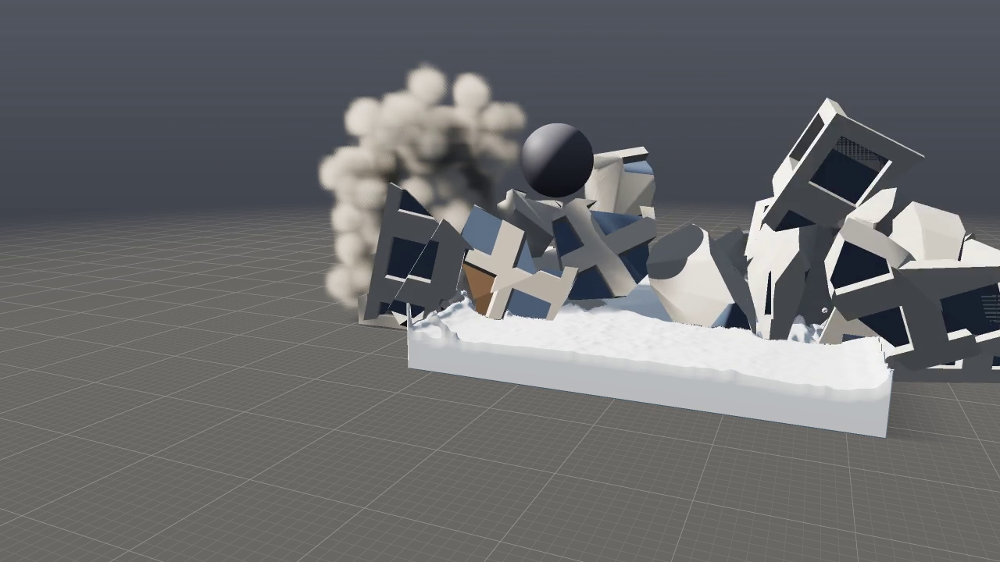

```
./build/prototype --example demolition            # v editoru: Play
./build/prototype sim demolition odstrel.mp4      # 180 snímků (6 s) jako video
./build/prototype sim demolition odstrel.png --frames 120
```

Příklad **demolition** ([examples/sim/demolition.pgsim](../examples/sim/demolition.pgsim))
je odstřel čtrnáctipatrového věžáku v bloku domů za zlatého světla,
podle skutečných odstřelů:

- **Věž** postaví wrangle `tower` z kvádrů: stropní desky, stěny kolem
  oken, sloupy, atika a střecha, každý kvádr s barvou `Cd` a atributy
  `floor` a `kind`. Wrangle `seeds` dá body pro Voronoi Fracture — hustší
  v nabitých patrech, aby se tam věž drobila jemněji.
- **Nálože** nastaví wrangle `charges` jako atributy kusů: deska přízemí
  je základ (`active 0`), sloupy a stěny dvou nejnižších pater v první
  sekundě zmizí v prachu (`release 1`, `vanish 1`) a zbytek dostane
  šťouchnutí dovnitř (`kick`). Kusy od třetího patra nahoru mají `crush`:
  pod padajícími patry se rozdrtí na prach.
- **RBD Solver**: beton 2400 kg/m³, lepidlo 150 kPa, prach z přetržených
  spojů, z nárazů a z drcení, drť, `air 3`. Věž se v půdorysu sesune
  asi 13 m/s a necelé čtyři sekundy po odpálení z ní zbude hromada vysoká
  asi šest metrů.
- **Město**: devatenáct domů z assetu Building (jiné výšky a barvy) na
  chodnících s obrubníky. Osm nejbližších je v plynu překážkami (Object
  box), takže prach teče ulicemi a přes nižší střechy; další řada domů
  za nimi dělá z bloku město až k okraji záběru.
- **Prach**: Pyro Solver nad celým blokem (90 × 48 × 90 m, 176 buněk,
  řídce: počítají se jen dlaždice s prachem; `--resolution 576` dá
  103,5 milionu voxelů a buňku 16 cm za 19 minut, [pyro.md §8](pyro.md#8-výkon-a-determinismus)),
  kusy jsou v něm pohyblivé překážky, prach je těžší než vzduch (`weight`)
  a Turbulence ho rozvíří; Volume Look ho barví do okrova se silným
  vlastním stínem.
- **Obraz**: nízké teplé slunce s dlouhými stíny domů i kusů, šedá
  zem bez mřížky, kamera nad blokem pomalu najíždí.

```
[tower] ─┬─────────────────▶ [Voronoi Fracture] ─▶ [charges] ─Pieces─▶ [RBD Solver] ─Look───────────▶ [Output]
         └─▶ [seeds] ─Points─┘                                          │ Dust ─────▶ Sources ─┐         ▲   ▲
                                                                        │ Collider ─▶ Colliders ─┤         │   │
[Building]×19 ─▶ [Transform]×19 ─┐        [Object]×8 (domy) ─▶ Colliders ─┤                      │   │
[Box]×20 (obrubníky) ─▶ [Color] ──┴▶ [Merge city] (zobrazená) [Turbulence] ─▶ Forces ─▶ [Pyro Solver] ─▶ [Volume Look]
```

### Druhý příklad: trosky u země

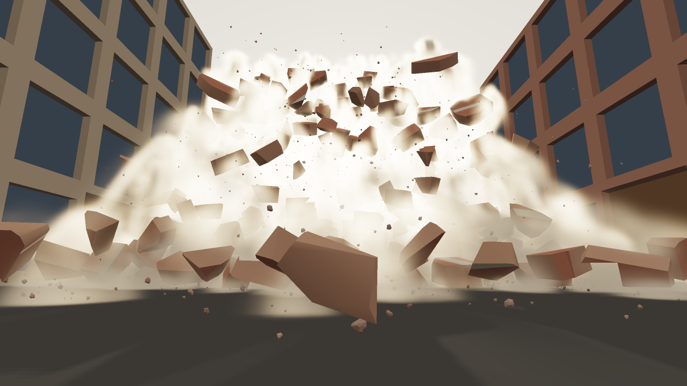

```
./build/prototype sim wall_collapse zed.mp4       # 120 snímků (4 s)
```

Příklad **wall_collapse** ([examples/sim/wall_collapse.pgsim](../examples/sim/wall_collapse.pgsim))
je destrukce zblízka, jak ji točí kamera těsně nad asfaltem:

- **Průčelí** cihlového domu postaví wrangle `facade`: pás kamene u každého
  stropu, pilíře mezi okny, zeď pod okny a nad nimi, atika. Voronoi
  Fracture ho rozřeže na kusy velké jako pár cihel.
- **Nálože** jdou od země nahoru, řada po řadě: pata zdi vyletí do ulice
  a co stálo nad ní, letí za ní — tím méně daleko, čím výš bylo — takže
  se zeď přeloží a spadne vlnou kusů, které se kutálejí ke kameře. Část
  nejnižších kvádrů se rozpráší.
- **Prach** z lomů a nárazů žene vytlačený vzduch ulicí mezi domy; nízké
  slunce za zdí ho prosvítí. Output má zapnutou oblohu za scénou
  (`sky_behind`): opar nejsvětlejší u obzoru a záři kolem slunce.
- **Kamera** je pár centimetrů nad asfaltem a pomalu jede bokem, se
  širokým objektivem.

---

## 1. Voronoi Fracture

Uzel **Voronoi Fracture** (Geometry) vezme uzavřenou síť polygonů a rozřeže
ji na buňky bodů: každá buňka je ta část tělesa, která je k svému bodu blíž
než ke kterémukoli jinému. Body přijdou buď z druhého vstupu **Points**
(scatter, body z wrangle, cokoli), nebo si je uzel vyrobí sám: **Count**
bodů náhodně uvnitř tělesa, pro stejný **Seed** vždy stejných.

| Parametr | Význam |
|---|---|
| `count` | Kolik kusů, když nepřijdou body: tolik náhodných bodů uvnitř tělesa |
| `seed` | Jiné číslo, jiné body |
| `attribute` | Jméno atributu s číslem kusu (výchozí `piece`), na primitivech i bodech |
| `insidegroup` | Skupina primitiv řezných ploch (výchozí `inside`) |

Jak to počítá ([`src/pg/nodes/Fracture.cpp`](../src/pg/nodes/Fracture.cpp)):
buňka bodu *s* je průnik polorovin „blíž k *s* než k *t*“ pro všechny
ostatní body *t*. Uzel proto těleso postupně ořezává rovinou v polovině
mezi *s* a *t* (uzel [Clip](geometry.md) s uzavřením řezu), od nejbližšího
*t* k nejvzdálenějšímu, a rovinu, která už nic neuřízne, přeskočí — po
několika prvních řezech je kus malý a zbytek rovin ho mine. Každý řez
uzavře víčkem, takže kus je uzavřený jako bylo těleso, a kusy dohromady
jsou přesně původní těleso (test to ověřuje na objemu: součet objemů kusů
se rovná objemu tělesa na 1e-4). Víčka nesou atributy primitiva, ze
kterého vznikla, a jsou ve skupině `inside` — vzhled ji obarví jinak než
povrch. Buňky se počítají paralelně a skládají v pořadí bodů, takže výsledek
je stejný na libovolném počtu vláken.

Buňka se přitom neořezává z celého tělesa, ale jen z toho, čeho se může
týkat ([`VoronoiCells`](../src/pg/nodes/Fracture.cpp)):

- **Jen blízké části tělesa.** Uzel nejdřív spočítá buňku v kvádru kolem
  tělesa. Je to jen pár stěn, takže to nic nestojí. Pak vezme jen ty
  uzavřené části tělesa (primitiva, která sdílejí body), které zasahují
  do jejího kvádru: u věže z tisíců kvádrů pár stropních desek a stěn.
- **Jen blízké body.** Body bere z mřížky po slupkách, od nejbližších.
  Když je další bod dál než dvojnásobek toho, kam kus sahá, jeho rovina už
  nic neuřízne, a nic neuříznou ani body za ním.

Roviny, které se kusu týkají, jsou tytéž a ve stejném pořadí jako dřív,
takže výsledek je bit po bitu stejný jako při řezání celého tělesa všemi
body (test to ověřuje buňku po buňce). Věž příkladu demolition (593 buněk)
se rozřeže za 0,14 s místo 1,1 s, věž z 5 628 buněk za 1,0 s místo 13,5 s
(čtyři vlákna).

Body uvnitř tělesa pozná uzel paritou průsečíků paprsku s polygony
(Möller–Trumbore po vějířích), s paprskem mírně mimo osy, aby neběžel podél
hran. Tělesa s dutinami a z více uzavřených částí (věž z kvádrů, budova
s balkony) jdou také — víčka mají díry, kde je řez protne vícekrát (viz
Clip).

---

## 2. Concrete Fracture

Voronoi Fracture řeže rovinami: kusy jsou čisté konvexní mnohostěny se
stejně velkými buňkami a rovnými lomy — na zblízka to vypadá jako
rozřezané, ne rozbité. Beton se láme jinak: velké kry vedle drobků,
nejmenší kusy tam, kam přišla rána, olámané hrany a rohy a lomové plochy
hrubé, zrnité. Uzel **Concrete Fracture** (Geometry) to dělá ve čtyřech
krocích ([`src/pg/nodes/Concrete.cpp`](../src/pg/nodes/Concrete.cpp)):

1. **Body.** `count` bodů uvnitř tělesa (nebo body ze vstupu **Points**),
   rozmístěných nerovnoměrně: hustota bodů je exp(4 · `uneven` · šum)
   krát (1 + 15 · `focus` · Gauss kolem `impact` o poloměru `reach`) —
   velké kry i drť, nejjemněji kolem místa nárazu. Body se losují
   zamítáním podle hustoty, pro stejný `seed` vždy stejně.
2. **Buňky.** Voronoiova buňka každého bodu, stejně jako Voronoi
   Fracture (paralelně, složené v pořadí bodů).
3. **Hrubé lomy.** Řezné plochy se rozdělí na trojúhelníky nejvýš
   `detail` dlouhé a každý jejich bod se posune o `rough` · b(p), kde b
   je hladký vektorový 3D šum (tři oktávy Perlinova šumu, každá složka
   stlačená `tanh` do ±1) s hrbolky `roughscale` od sebe. Posun závisí
   jen na místě, ne na normále (ta má na druhé straně trhliny opačné
   znaménko): na obou stranách je týž šum v týchž bodech a triangulace
   je kanonická (vějíř z lexikograficky nejmenšího bodu, dělení hran
   v polovině se stejnou volbou úhlopříčky na obou stranách), takže kusy
   do sebe dál přesně zapadají — spoj sedí na 3·10⁻⁶ m. K vnějšímu
   povrchu hrubost plynule slábne (smoothstep na vzdálenosti 2 · `rough`),
   takže nic z tělesa nevyčnívá a vnější plochy zůstanou, jak byly.
4. **Odprýsknutí.** Podíl `chips` rohů buněk (bodů, kde se potkají
   aspoň tři stěny) se ořízne nakloněnou rovinou hlubokou nejvýš
   `chipsize`: plochý úlomek, samostatný kus přilepený svou plochou
   (atribut primitiva `chip` = 1). Řez jde hrubým kusem, takže úlomek
   má hrubé lomy jako kus, ze kterého odprýskl. Řez, který by vzal
   kusu střed nebo úlomek větší než trojnásobek `chipsize`, se zahodí.
   Víčko řezu se na úlomku i na kusu rozdělí na tytéž trojúhelníky
   (Clip dělí víčka stejně z obou stran roviny), takže v proxy — kde
   víčko není rovinné — lícují a lepí se celou plochou.

| Parametr | Význam |
|---|---|
| `count`, `seed` | Kolik kusů před odprýsknutím, když nepřijdou body; jiné číslo, jiné kusy |
| `uneven` | Jak nestejné jsou kusy: 0 všechny zhruba stejné, 1 velké kry vedle drobků |
| `impact`, `focus`, `reach` | Kam přišla rána, kolik víc kusů kolem ní (0 žádné) a jak daleko (m) |
| `chips`, `chipsize` | Podíl olámaných rohů a nejvyšší hloubka úlomku (m) |
| `rough`, `roughscale`, `detail` | Jak daleko jdou lomy dovnitř a ven (m, 0 rovné řezy), jak daleko od sebe jsou hrbolky a jak dlouhé jsou nejvýš trojúhelníky lomů |
| `attribute`, `insidegroup` | Atribut s číslem kusu (`piece`) a skupina řezných ploch (`inside`) |

**Proxy pro simulaci.** Hrubý kus má tisíce trojúhelníků a není konvexní.
Každý bod si proto v bodovém atributu `proxy` nese, kde byl před
zdrsněním — rovný řez pod hrubým. RBD Solver kusy s `proxy` simuluje tak,
jak je má proxy: konvexní obaly z rovných řezů, hmota z nich, spoje tam,
kde se rovné řezy dotýkají plochou (sousední stěny v jedné rovině se
nejdřív sloučí, aby spoj našel i plochu rozdělenou na trojúhelníky), a
kreslí je hrubé. Stejně to dělá produkce: simulační proxy a renderová
geometrie na ni navázaná. Transform posune i `proxy`, RBD Pieces ho
zahodí (kusy v pohybu už jsou jen hrubé). Při kreslení se body řezných
ploch oddělí od vnějších ploch, aby vyhlazování normál (hrana nad 60°)
nerozmazalo mělké trhliny do fasády.

### Třetí příklad: betonová zeď a demoliční koule

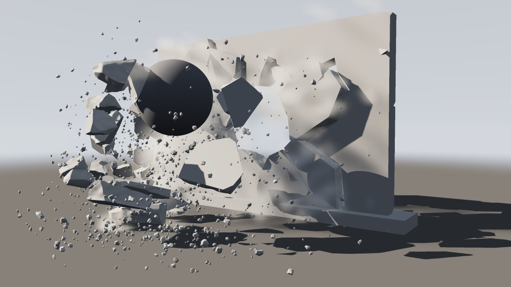

```
./build/prototype sim concrete_wall zed.mp4       # 90 snímků (3 s)
```

Příklad **concrete_wall** ([examples/sim/concrete_wall.pgsim](../examples/sim/concrete_wall.pgsim)):
zeď 5 × 3 × 0,3 m na betonovém soklu, rozbitá Concrete Fracture na 90 kusů
(nejmenší kolem místa, kam udeří koule) a 61 úlomků z rohů — 151 kusů,
380 tisíc trojúhelníků, uvařených za necelou sekundu. Sokl je kus sám pro
sebe s `active 0` a spodní kusy zdi jsou k němu přilepené.
Klíčovaná koule proletí zdí zezadu ke kameře; RBD Solver má `rings 2`,
takže náraz uvolní jen kusy kolem koule a dva prstence za nimi: koule
prorazí díru, kusy a úlomky vyletí a kutálejí se ke kameře a zbytek zdi
stojí. Zdí prochází ocelová síť (uzel Rebar: pruty 12 mm po 20 cm oběma
směry, vrstva u každé líce — 84 prutů): kusy kolem díry na nich zůstanou
viset, pruty mezi nimi prosvítají v trhlinách, a kry, které koule vezme
s sebou, pruty přetrhnou a odletí s jejich pahýly. Prach z lomů a nárazů
nese Pyro Solver.

```
[wall] ─┬─▶ [Concrete Fracture] ─▶ [moving] ─┐
        │   [plinth] ─▶ [foundation] ────────┴▶ [Merge] ─Pieces──┐
        └─▶ [Rebar] ─Rebar───────────────────────────────────────┼▶ [RBD Solver] ─Look──────────────▶ [Output] ◀─ [Camera]
[ball] ─Collider─▶ Colliders ────────────────────────────────────┘   │ Dust ─▶ [Pyro Solver] ─▶ [Volume Look] ─┘
```

### Kry a sekundární lámání: RBD Cluster

Skutečný beton se nerozsype na drobky najednou: odlomí se velké kry a ty se
rozpadnou, až když samy tvrdě dopadnou. Uzel **RBD Cluster** (Geometry) to
připraví tak, jak to dělá Houdini: jemné kusy z fracture seskupí do `count`
ker a lepidlo uvnitř kry je `strength`-krát pevnější než mezi krami
([`src/pg/nodes/Cluster.cpp`](../src/pg/nodes/Cluster.cpp)):

- **Střed kusu** je těžiště jeho objemu (z `proxy`, má-li ho; divergence
  přes vějíře stěn), u otevřené plochy průměr bodů.
- **Středy ker**: první náhodně, každý další daleko od vybraných
  (k-means++), pak osmkrát posunuté do těžiště kusů, které k nim mají
  nejblíž, vážené objemem (Lloyd) — kry zhruba stejně velké a spíš kulaté
  než protáhlé. Pro stejný `seed` vždy stejné.
- **Kusy** dostanou číslo kry, ke které mají nejblíž: atribut `cluster`
  (primitiva i body, 1 a výš v pořadí kusů, 0 žádná) a `clusterglue`
  (`strength`).

RBD Solver spoji dvou kusů téže kry (`cluster` nad 0 a stejný) vynásobí
pevnost menší z jejich `clusterglue`. Náraz tak nejdřív láme spoje mezi
krami — věc se rozpadne na kry — a kru rozbije až úder, který přemůže i
její pevnější lepidlo: dopad z výšky, náraz jiné kry. Kry se tedy lámou
znovu až za letu a při dopadu, přestože kusy jsou nařezané předem.

| Parametr | Význam |
|---|---|
| `count` | Kolik ker (nejvýš tolik, kolik je kusů) |
| `seed` | Jiné číslo, jiné kry |
| `strength` | Kolikrát pevnější je lepidlo uvnitř kry než mezi krami; 1 žádné kry |
| `attribute` | Atribut s číslem kusu (`piece`) |

### Výztuž: Rebar

Beton skoro vždycky obsahuje ocel. Pruty drží kusy pohromadě i tam, kde
beton praskl: prasklý trám se nerozlomí vedví, ale přehne a visí na nich;
kusy kolem díry ve zdi zůstanou viset na síti. Uzel **Rebar** (Geometry)
položí pruty do bloku tak, jak se kladou před betonáží
([`src/pg/nodes/Rebar.cpp`](../src/pg/nodes/Rebar.cpp)):

- **Blok** je kvádr kolem vstupu natočený tak, jak leží: kolmo na jeho
  největší rovnou stranu (stěny, které se dívají jedním směrem, mají
  dohromady nejvíc plochy) a v její rovině obdélník, který body obepne
  nejtěsněji (rotující třmeny kolem jejich konvexního obalu) — nebo podle
  os světa, když je takový kvádr stejně malý. Počítá se z `proxy`, má-li
  ho vstup, takže vstupem může být blok i jeho kusy po Concrete Fracture,
  otočené, jak chtějí.
- **Síť** (`layout mesh`, pro zeď a desku — nejtenčí strana pod polovinou
  další): pruty oběma směry po `spacing`, vrstva u každé líce (`layers 2`)
  nebo jedna uprostřed; pruty jednoho směru leží na prutech druhého, krytí
  `cover` od líce i za konci prutů.
- **Armokoš** (`layout cage`, pro trám a sloup): podélné pruty po obvodu
  průřezu — v každém rohu jeden, nejvýš `spacing` od sebe — a kolem nich
  třmínky po `spacing` podél prvku.
- **Výstup**: otevřené lomené čáry (třmínek končí, kde začal) s bodovým
  atributem `width`, průměrem prutu.

| Parametr | Význam |
|---|---|
| `layout` | Auto (síť pro zeď a desku, jinak koš), Mesh, Cage |
| `spacing` | Největší vzdálenost prutů — a třmínků podél koše (m) |
| `cover` | Krytí betonem nad pruty a za jejich konci (m) |
| `diameter` | Průměr prutu (m): 8 až 32 mm |
| `layers` | Síť: 2 vrstvy u lící, 1 uprostřed |
| `stirrup` | Průměr třmínků (m); 0 žádné |

Výstup Rebar patří do vstupu **Rebar** RBD Solveru. Výztuží může být
jakákoli lomená čára s atributem `width` (bez něj 12 mm) — nakreslená,
z wrangle, z jiného souboru —, stejně jako v Houdini *RBD Constraints From
Curves*. Jak solver pruty simuluje, popisuje [§3](#jak-to-funguje).

### Čtvrtý příklad: trám přes kvádr

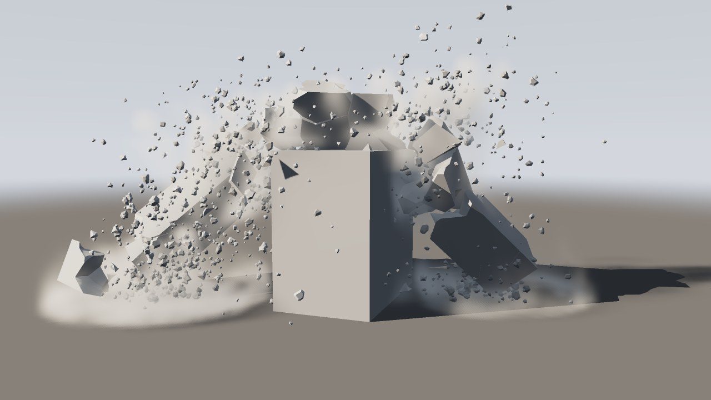

```
./build/prototype sim concrete_drop tram.mp4      # 60 snímků (2 s)
```

Příklad **concrete_drop** ([examples/sim/concrete_drop.pgsim](../examples/sim/concrete_drop.pgsim)):
betonový trám 3 × 0,4 × 0,4 m padá z jeřábu nad záběrem (`v` ve wrangle
`falling`, šest metrů za sekundu) napříč na betonový kvádr. Concrete
Fracture ho rozláme na 150 kusů velkých jako dlaň, RBD Cluster je seskupí
do čtrnácti ker s lepidlem uvnitř třicetkrát pevnějším (`glue 1000`,
`spread 0,3`) a Rebar do něj položí armokoš: osm podélných prutů 12 mm a
šestnáct třmínků 8 mm. Trám o kvádr praskne a tam se i rozdrtí, ale
výztuž ho udrží pohromadě: přehne se přes kvádr a obě poloviny visí dolů
na prutech — kde se ohyb rozevřel nejvíc, se pruty přetrhly a trčí z lomu
jejich pahýly, jinde se ohnuly. Bez výztuže (odpojte Rebar) se trám zlomí
vedví, poloviny spadnou po stranách a na zemi se rozpadnou na kry. Prach
z lomů a dopadů nese Pyro Solver.

```
[beam] ─▶ [Concrete Fracture] ─▶ [RBD Cluster] ─▶ [Transform] ─┬─▶ [falling] ─Pieces─┐
                                                               └─▶ [Rebar] ─Rebar────┼▶ [RBD Solver] ─Look──▶ [Output]
[block] ─Collider─▶ Colliders ───────────────────────────────────────────────────────┘   │ Dust ─▶ [Pyro Solver] ─▶ [Volume Look]
```

### Sklo: Glass Fracture

Sklo se neláme jako beton. Z místa úderu se rozběhnou rovné trhliny
(**radiální**) a mezi nimi se otevřou oblouky kolem něj (**soustředné**):
pavučina, uprostřed tenké střípky, dál od středu delší a širší střepy.
Uzel **Glass Fracture** (Geometry) tabuli rozláme přesně takhle
([`src/pg/nodes/Glass.cpp`](../src/pg/nodes/Glass.cpp)):

- **Tabule** je vstup — plochý uzavřený objekt jakéhokoli obrysu — ležící
  tak, jak leží: jeho kvádr (stejný jako u Rebar, `fitBox`) má nejtenčí
  směr napříč tabulí a pavučina leží v rovině druhých dvou, kolem `impact`
  promítnutého do střední roviny tabule.
- **Paprsky**: `radials` trhlin z místa úderu v rovnoměrných úhlech, každá
  pootočená nejvýš o `jitter` odstupu k další.
- **Kruhy**: mezi dvěma paprsky vede tětiva, první `first` od středu,
  každá další `growth`-krát dál — v každé výseči zvlášť, takže kruhy na
  paprscích nenavazují (jako ve skutečném skle, kde soustředná trhlina
  končí na radiální). Výseč, jejíž tětiva je `split`-krát delší, než je
  kruh hluboký, se rozvětví: z bodu na tětivě vede další paprsek ven.
  Za `rings` kruhy (nebo za okrajem tabule) vedou střepy až k okraji.
- **Střepy**: každá buňka pavučiny (konvexní) vyřízne z tabule kus
  rovinami svých stran kolmými na tabuli a zavře ho; nové plochy jsou ve
  skupině `insidegroup`. Primitiva nesou `piece`, `glass` — 1 plochy
  tabule, 2 plochy trhlin — a `Cd`, barvu skla (`tint`). Podle `glass`
  pozná RBD Solver, renderer i export, že jde o sklo.

| Parametr | Význam |
|---|---|
| `impact` | Kde do tabule udeří (promítne se do její roviny) |
| `radials` | Počet radiálních trhlin (3–256) |
| `first` | Poloměr prvního kruhu (m) |
| `growth` | Kolikrát dál je každý další kruh |
| `rings` | Počet kruhů; za posledním vedou střepy k okraji |
| `jitter` | Nepravidelnost úhlů a poloměrů (0–1) |
| `split` | Výseč širší než `split` × hloubka kruhu se rozvětví; 0 nikdy |
| `seed` | Jiné číslo, jiná pavučina |
| `tint` | Barva skla (`Cd`): zelenkavá jako okenní sklo |
| `attribute`, `insidegroup` | Atribut kusu a skupina ploch trhlin |

Tabule 1,2 × 1,5 m s výchozími hodnotami dá kolem 250 střepů za desetiny
sekundy; stejná síť dá stejné střepy na jednom i čtyřech vláknech.

### Pátý příklad: míč oknem

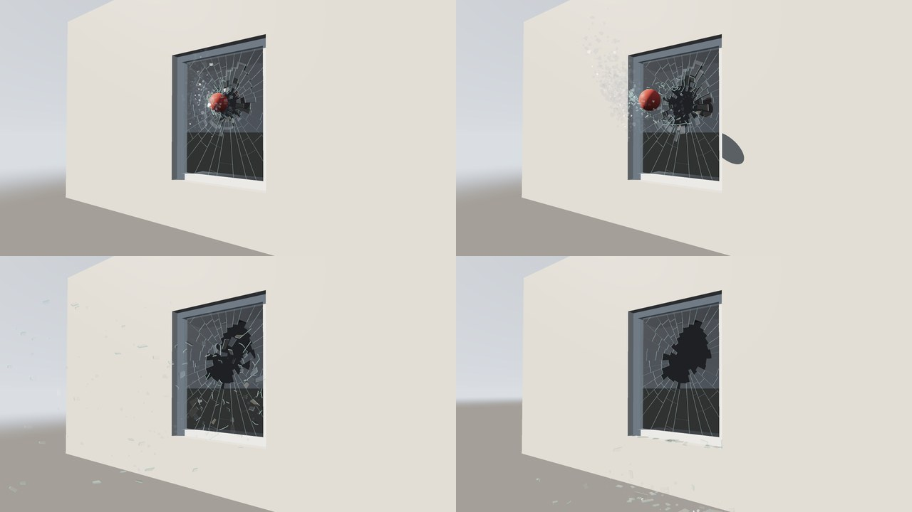

```
./build/prototype sim glass_window okno.mp4       # 150 snímků, 120 za sekundu
./build/prototype sim glass_window okno.png --every 1 && ffmpeg -r 30 -i okno_%04d.png zpomalene.mp4
```

Příklad **glass_window** ([examples/sim/glass_window.pgsim](../examples/sim/glass_window.pgsim)):
míč vyletí z tmavé místnosti oknem ven, zpomaleně — simulace běží 120
snímků za sekundu a přehrání obrázků třicet za sekundu je čtyřikrát
zpomalí. Tabule 1,2 × 1,5 m o tloušťce 8 mm sedí v bílém rámu (kus
s `active 0`, ke kterému jsou krajní střepy přilepené) ve zdi z objektů.
Glass Fracture ji rozláme kolem místa, kam míč udeří. Míč je klíčovaný a
nezastavitelný a `rings 6` pustí náraz šest prstenců střepů daleko:
prorazí díru, drobné střípky a skleněná drť letí s ním ven a jiskří na
slunci, delší střepy kolem díry vypadnou a zůstanou ležet pod oknem.
Dokud míč nedorazí, je tabule celá — žádná prasklina, jen odraz oblohy a
míč za sklem; v okamžiku úderu se objeví celá pavučina. Sklo nedělá prach,
jen drť, a Pyro Solver tu proto není.

```
[pane] ─▶ [Glass Fracture] ─▶ [moving] ─┐
[frame_*]×4 ─▶ [Merge] ─▶ [frame] ──────┴▶ [pieces] ─Pieces─▶ [RBD Solver] ─Look─▶ [Output] ◀─ [camera]
[wall_*]×4, [room_*]×4, [ball] ─Collider─▶ Colliders ─────────────┘
```

### Cihly: Brick Wall

Cihlová zeď se neláme jako beton. Praská ve spárách, protože malta je
slabší než cihla: vypadávají celé cihly a kusy zdiva, díra je stupňovitá
podle vrstev a cihla se rozlomí, jen když ji náraz přemůže. Uzel **Brick
Wall** (Geometry) zeď vyzdí tak, jak ji zdí zedník: vrstvu po vrstvě ve
vazbě, každou cihlu na maltovém loži se spárou na konci. Každá cihla
i s maltou kolem je jeden kus
([`src/pg/nodes/Bricks.cpp`](../src/pg/nodes/Bricks.cpp)):

- **Zeď** je vstup — uzavřené těleso jakéhokoli obrysu, i z několika
  kvádrů, které se dotýkají — a stojí tak, jak stojí vstup. Osy se berou
  z kvádru kolem vstupu (`fitBox`): výška je osa nejbližší svislé,
  tloušťka tenčí ze zbylých dvou a délka ta třetí. Líc je strana ke
  `front`. Vrstev je tolik, kolik se jich vejde na výšku (`height` +
  `joint`); ložné spáry se o chlup ztenčí nebo ztloustnou, aby výšku
  vyplnily přesně. Napříč se položí tolik řad běhounů (`width` + `joint`),
  kolik se vejde do tloušťky bez omítky.
- **Vazba** (`bond`) určuje, kde se cihly sousedních vrstev překrývají:
  - *Stretcher* (běhounová): každá vrstva je o půl cihly dál než ta pod ní.
  - *English* (anglická): vrstva vazáků přes celou tloušťku, pak vrstva
    běhounů posunutá o čtvrt cihly.
  - *Flemish* (vlámská, gotická): vazák a běhoun se střídají v každé
    vrstvě a každý vazák leží nad středem běhounu.
  - *Stack*: spára nad spárou.
  - *Auto*: běhounová pro zeď z jedné řady cihel, jinak anglická.
- **Otvory**: každá vrstva se klade podél úseků, kde přímka středem zdi
  vede uvnitř vstupu. U otvoru se cihly zkrátí a ostění je rovné. Kousek
  kratší než polovina šířky cihly se přidá k cihle vedle.
- **Cihly**: každá je uzavřený kvádr i s maltou — ložnou spárou pod
  sebou, styčnou spárou na konci a podélnou spárou za sebou, je-li za ní
  další řada. K tomu omítka (`plaster`) na líci zdi před ní. Takový kvádr
  je jeden kus:
  - `piece` nese jeho číslo;
  - `Cd` je barva cihly (každá o odstín jiná, `variation`), malty nebo
    omítky, podle toho, co na dané ploše je.

  Kusy dohromady dají přesně objem vstupu.
- **Rozlomené cihly** (`broken`): tento podíl cihel, které jsou aspoň
  o polovinu delší než široké, se rozřízne napříč na dvě poloviny. Obě
  poloviny tvoří jednu kru (`cluster`, `clusterglue` = `strength`).
  Lepidlo je proto drží `strength`-krát pevněji než malta. Tvrdý náraz
  je rozlomí a plochy lomu mají barvu cihly uvnitř (světlejší a teplejší).

Lepidlem (`glue`) RBD Solveru je malta. Každá cihla naráží jedním
konvexním obalem, tedy svým kvádrem. Náhodná čísla bere každá cihla ze
svého místa ve zdi (vrstva, úsek, pořadí v něm, řada), takže změna jedné
cihly — třeba zkrácené u otvoru — nezmění ostatní.

| Parametr | Význam |
|---|---|
| `bond` | Vazba: Auto, Stretcher, English, Flemish, Stack |
| `length`, `width`, `height` | Rozměry cihly (m): 250 × 120 × 65 mm |
| `joint` | Tloušťka spáry (m): 10 mm |
| `front` | Směr, kterým se dívá líc zdi |
| `plaster` | Tloušťka omítky (m); 0 znamená bez omítky |
| `plastersides` | Omítka na obou stranách, jen na líci (`front`), jen na rubu (`back`) |
| `color`, `variation` | Barva cihel a jak moc se cihla od cihly liší (0–1) |
| `mortar`, `plastercolor` | Barva malty a omítky |
| `broken` | Podíl cihel rozříznutých na dvě poloviny (0–1) |
| `strength` | Kolikrát pevněji drží poloviny než malta |
| `seed` | Jiné číslo, jiné odstíny a jiné rozlomené cihly |
| `attribute` | Atribut s číslem kusu (`piece`) |

Zeď 5,2 × 3 m s oknem (příklad níže) dá 1689 kusů: 1496 cihel, z toho
193 rozlomených na poloviny. Je to 77 tisíc trojúhelníků za setiny
sekundy. Stejná síť dá stejnou zeď při každém vaření a na libovolném
počtu vláken.

### Šestý příklad: demoliční koule a cihlová zeď

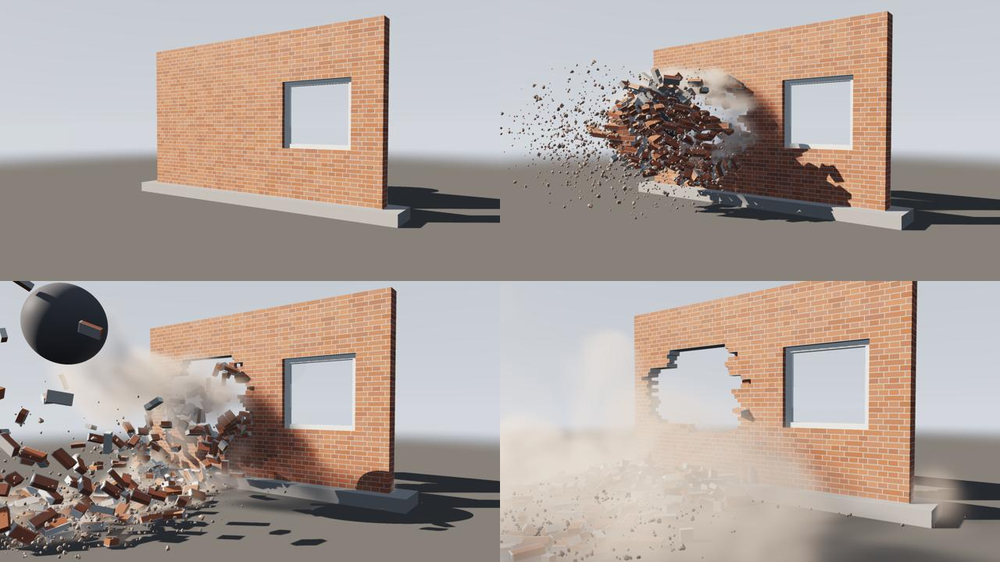

```
./build/prototype sim brick_wall zed.mp4          # 90 snímků (3 s)
```

Příklad **brick_wall** ([examples/sim/brick_wall.pgsim](../examples/sim/brick_wall.pgsim))
je obvodová zeď domu: 5,2 × 3 m, tloušťka jedné cihly (dvě řady běhounů)
v anglické vazbě, uvnitř omítnutá. Stojí na betonovém soklu, který se
nehýbe (`active 0`). Ve zdi je okno 1,3 × 1,2 m s bílým rámem a
tabulí skla (Glass Fracture, 238 střepů). Vstupem jsou čtyři kvádry kolem
okna a Brick Wall z nich vyzdí zeď s rovným ostěním.

Klíčovaná koule o průměru 1,1 m se zhoupne zezadu skrz zeď ke kameře.
Lepidlo je jen malta (`glue 150`, tedy 150 kPa), takže zeď praská ve
spárách. Výsledek:

- díra je stupňovitá po vrstvách;
- celé cihly letí a kutálejí se, některé se rozlomí vedví (poloviny drží
  `strength 8`) a na okraji díry visí kusy zdiva, které malta ještě drží;
- `rings 4` pustí náraz jen na čtyři prstence cihel kolem koule, takže
  okno vedle díry zůstane celé, i se sklem;
- prach z malty a cihel nese Pyro Solver.

```
[wall_*]×4 ─▶ [Merge] ─▶ [Brick Wall] ─▶ [moving] ─┐
[pane] ─▶ [Glass Fracture] ─▶ [glass_pieces] ─────┤
[frame_*]×4 ─▶ [Merge] ─▶ [frame] ────────────────┤
[plinth] ─▶ [foundation] ─────────────────────────┴▶ [pieces] ─Pieces─▶ [RBD Solver] ─Look──────────────▶ [Output] ◀─ [camera]
[ball] ─Collider─▶ Colliders ─────────────────────────────────────────────┘  │ Dust ─▶ [Pyro Solver] ─▶ [Volume Look] ─┘
```

### Sedmý příklad: odstřel železobetonového sloupu

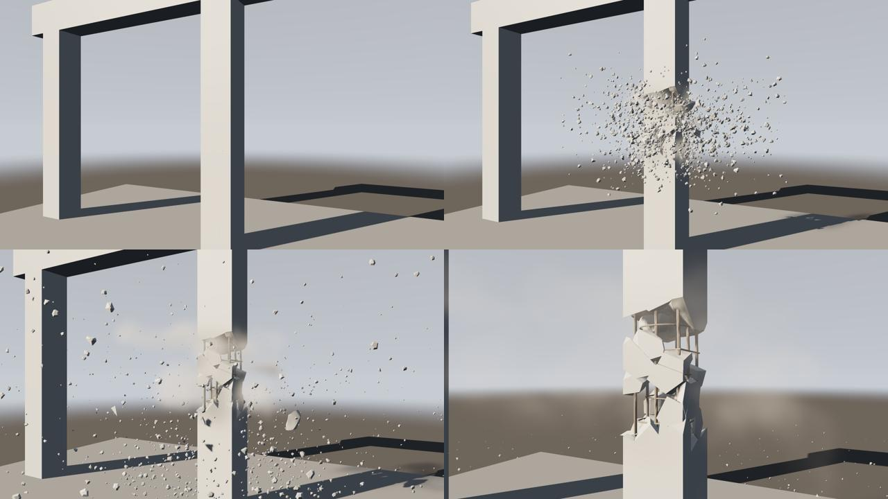

```
./build/prototype sim concrete_column sloup.mp4   # 90 snímků (3 s)
```

Příklad **concrete_column** ([examples/sim/concrete_column.pgsim](../examples/sim/concrete_column.pgsim))
je železobetonový sloup 0,4 × 0,4 × 3 m v betonovém rámu. Stojí na
stropní desce a nese trám; deska i trám jsou kusy, které se nehýbou.

- **Kusy**: Concrete Fracture rozláme sloup na 170 kusů, nejmenších kolem
  nálože, a 131 úlomků z rohů.
- **Výztuž**: Rebar do sloupu položí armokoš, osm prutů 20 mm po obvodu
  a 21 třmínků 10 mm po 15 cm.
- **Nálož**: v 0,6 s ji odpálí wrangle `charge`. Beton do 35 cm od ní
  se uvolní (`release`): 85 % ho zmizí v prachu (`vanish`) a zbytek
  odletí do stran (`kick`).
- **Co zbude**: pruty drží, co už nedrží lepidlo (`glue 1000`,
  `rings 2`). Horní část sloupu visí z trámu a stojí na koši, na prutech
  visí kusy betonu a kde byla nálož, je koš holý. Po betonu zbude jen
  ocel — tak vypadá skutečný sloup po odstřelu. Prach nese Pyro Solver.

```
[column] ─┬─▶ [Concrete Fracture] ─▶ [charge] ─┐
          │   [floor] ─▶ [floor_piece] ────────┤
          │   [beam] ─▶ [beam_piece] ──────────┴▶ [pieces] ─Pieces─┐
          └─▶ [Rebar] ─Rebar───────────────────────────────────────┼▶ [RBD Solver] ─Look──────────────▶ [Output] ◀─ [camera]
[column_left], [column_right] ─Collider─▶ Colliders ───────────────┘   │ Dust ─▶ [Pyro Solver] ─▶ [Volume Look] ─┘
```

Pro srovnání je v příkladu **concrete_wall** železobetonová zeď: síť
prutů místo koše a koule místo nálože.

---

## 3. RBD Solver

Uzel **RBD Solver** (Simulation) dělá z kusů tuhá tělesa. Vstup **Pieces**
je geometrie s atributem `piece` (Voronoi Fracture; bez atributu je kusem
každá souvislá část), **Colliders** jsou objekty, do kterých kusy narážejí —
stojící i klíčované, **Rebar** jsou ocelové pruty v kusech (uzel Rebar,
nebo jakékoli lomené čáry s `width`) a **Constraints** je síť vazeb
(RBD Constraints, upravená): její čáry jsou spoje místo těch, které
solver najde tam, kde se kusy dotýkají ([níže](#síť-vazeb-rbd-constraints)).
**Guide** jsou kusy tak, jak se mají pohybovat: tytéž body ve stejném
pořadí, posunuté a natočené (klíčovaný Transform, wrangle s `@Time`);
solver k nim kusy vede ([níže](#usměrněná-simulace-guide)).
Výstupy:

| Výstup | Typ | Kam |
|---|---|---|
| **Look** | Look | Do Outputu: solver se simuluje a kusy se kreslí tam, kam dopadly |
| **Rigid** | Rigid | Do uzlu **RBD Pieces**: kusy zpátky jako geometrie |
| **Collider** | Collider | Do Colliders Liquid Solveru, Pyro Solveru nebo Rain: voda, plyn a déšť jdou kolem kusů, kde právě jsou |
| **Dust** | Source | Do Sources Pyro Solveru: prach z přetržených spojů, z nárazů a z drcení |

Parametry:

| Sekce | Parametr | Význam |
|---|---|---|
| Pieces | `attribute` | Co říká, ke kterému kusu primitivum patří |
| Physics | `density` | kg/m³: 2400 beton, 700 dřevo, 7800 ocel; hmota kusu je hustota krát objem jeho obalu |
| | `friction`, `bounce` | Tření a odraz při dopadu (0 žuchnutí, 1 gumový míč) |
| | `gravity` | m/s², dolů |
| | `floor` | Podlaha v nule; bez ní kusy padají pořád |
| Glue | `glue` | Pevnost lepidla v kPa (kilonewtonech na metr čtvereční plochy spoje); 0 znamená bez lepidla |
| | `spread` | Kolik nárazu jde přes spoj dál na kusy za ním: 0,5 polovina (výchozí) — tvrdý náraz láme lepidlo daleko kolem; 0 nic, uvolní se jen kusy, do kterých narazilo. V Houdini *Propagate Rate* |
| | `rings` | Kolik prstenců kusů kolem zasažených může náraz uvolnit, ať je jakkoli silný: 1 sousedy, 2 i sousedy sousedů; 0 (výchozí) tak daleko, kam ho `spread` donese. V Houdini *Propagate Iterations* |
| Rebar | `rebar_strength` | MPa, kdy ocel prutů teče: 500 dnešní pruty. Prut 12 mm unese v tahu asi 57 kN, ohnutý zůstane ohnutý |
| | `bond` | MPa, jak pevně beton svírá prut po jeho povrchu: kus, kterým prut prochází 20 cm, ho drží asi 38 kN. Kusy na jedné straně trhliny prut kotví dohromady; kde drží míň než ocel — u konce prutu nebo přetrženého — prut se z nich vytahuje a beton z něj opadá, jinde teče ocel. 0: pruty nedrží nic |
| | `stretch` | O kolik se prut protáhne, než se přetrhne, jako díl toho, co z něj teče: 0,1 desetina — holého prutu mezi dvěma kusy a dvacetinásobku průměru |
| Guide | `guide_strength` | Jak silně Guide kusy vede: 1 v každém kroku přesně tam, kde je má; méně je měkčí tah, který se za ním opožďuje; 0 vůbec. Kusy přitom dál narážejí. Klíčovaná k nule předá kusy simulaci postupně |
| | `guide_until` | Sekundy, po kterých Guide už nevede nic a kusy jdou svou cestou; 0 (výchozí) pořád |
| | `guide_reach` | Metry, o které se těleso smí vzdálit od místa, kde ho Guide má (zastavila ho zem nebo to, do čeho narazilo), než půjde svou cestou; 0 (výchozí) jakkoli daleko |
| | `guide_let_go` | Kus, kterému praskne spoj, jde svou cestou: co Guide shodí, se tam, kde dopadne, volně rozpadne (výchozí zapnuto) |
| Time | `substeps` | Kroky řešiče na snímek: víc pro rychlé kusy a vysoké stavby |
| | `rest` | **Freeze at Rest** (výchozí zapnuto): těleso, které se půl sekundy nikam nepohnulo a leží na podlaze nebo na tom, co se nehýbe, zmrzne. Je statické a nic nestojí, dokud do něj něco nenarazí rychleji než 1 m/s, nepostrčí ho voda nebo plyn, neodpálí se v něm nálož nebo k němu nedojede klíčovaný objekt. S ním se probudí, co na něm leží. Hromady trosek se pak krokují mnohem rychleji ([níže](#jak-to-funguje)). Vypnuto: každé těleso se krokuje až do konce (v Houdini *Allow Deactivation* vypnuté) |
| Dust | `dust` | Kolik prachu dá přetržený spoj |
| | `impact_dust` | … tvrdý náraz a rozdrcený kus |
| | `dust_size` | Jak velký je obláček (m) |
| | `debris` | Kolik drti lomy a nárazy sypou; drť jsou částice, které narážejí do kusů a zůstávají na nich ležet ([níže](#drť-jako-částice)); 0 žádná |
| | `trail` | Prach za utrženými kusy: první sekundu a půl za kusem, který letí rychleji než 2,5 m/s, zůstává stopa prachu — tím víc, čím je větší a rychlejší; 0 (výchozí) žádná |
| | `air` | Kolik vzduchu kusy vytlačí, když se drtí a narážejí: rozpíná obláčky a žene prach po zemi; 1 kolik by vytlačily, 0 nic |
| Look | `color`, `inside_color`, `inside_group` | Barva kusů bez vlastního `Cd`, barva řezných ploch a jejich skupina |
| | `rebar_color` | Barva prutů: zrezivělá ocel |

Atributy kusů (na primitivech, jinak na bodech; tělo bere atributy svého
prvního primitiva) řeknou, čím se kus liší:

| Atribut | Typ | Význam |
|---|---|---|
| `density` | f | kg/m³ místo hustoty solveru |
| `v`, `w` | v | Rychlost a otáčení (rad/s), se kterými začíná |
| `active` | i | 0: nehýbe se — základ; je slepený a stojí v cestě |
| `glue` | f | Spoje kusu jsou tolikrát pevnější (platí slabší ze dvou); 0: žádné |
| `release` | f | Sekundy, větší než 0: tehdy se jeho spoje přetrhnou — odpálí se nálož |
| `kick` | v | … a přičte se mu tahle rychlost |
| `vanish` | i | 1: při odpálení zmizí, rozmetaný na prach a drť, jako nálož rozdrtí sloup |
| `crush` | f | Náraz víc než tolikrát silnější, než kolik drží jeho lepidlo, ho rozdrtí na prach: stěny, na které dopadne patro. 0: nikdy |
| `cluster` | i | Kra, do které kus patří (RBD Cluster); 0: žádná |
| `clusterglue` | f | Spoje mezi kusy téže kry jsou tolikrát pevnější (platí menší ze dvou) |
| `guide` | f | Jak moc ho Guide vede, 0 až 1 (bez atributu 1); 0: vůbec |

Jako v Houdini doplní Merge atribut, který jedné geometrii chybí, nulou:
`active` a `glue` je proto potřeba nastavit všem kusům, ne jen některým.

### Síť vazeb: RBD Constraints

Lepidlo mezi kusy jde vidět a upravit jako obyčejná geometrie. Houdini
tomu říká *constraint network*. Uzel **RBD Constraints** (Geometry) ji
udělá z kusů přesně tak, jak by lepidlo našel solver
([`rigidGlue`, `rigidNetwork` v `Rigid.cpp`](../src/pg/sim/Rigid.cpp)):

- **Bod** za každé těleso, uprostřed jeho kvádru (podle `proxy`, má-li
  ho). Nese `piece`, číslo kusu (hodnotu atributu kusů, bez něj pořadí
  kusu). Kus z několika těles, jejichž části se nedotýkají, má bod za
  každé a navíc `part` (0, 1, … v pořadí těles).
- **Čára** za každý spoj, tedy za každé dvě tělesa, která se dotýkají
  plochou. Vede od bodu jednoho tělesa k bodu druhého a nese:
  - `strength` — pevnost jako násobek `glue` solveru: 1 drží jako Glue,
    0,1 desetinou, 0 nic. Spočítá se z atributů kusů: slabší `glue` ze
    dvou, uvnitř kry krát menší `clusterglue`;
  - `area` — plocha spoje v m²;
  - `Cd` — zelená drží jako Glue, žlutá slaběji (šestnáctina a méně
    úplně žlutě), modrá pevněji, šedá nedrží nic.

Spoj unese Glue × `area` × `strength` newtonů. Síť jde upravovat běžnými
uzly a pak se zapojí do **Constraints** RBD Solveru — její čáry jsou pak
spoji:

```
f@strength *= 0.1;                        // Primitive Wrangle: všude desetina
if (@P.y > 2) f@strength = 0;             // nad dvěma metry nic (@P je střed čáry)
if (@P.x > 0) removeprim(0, @primnum, 0); // vpravo žádné spoje
int a = addpoint(0, {0, 2, 0});           // Detail Wrangle: spoj, kde se nic nedotýká
int b = addpoint(0, {0, 1.6, 0});
setpointattrib(0, "piece", a, 1);
setpointattrib(0, "piece", b, 2);
addprim(0, "polyline", a, b);
```

Solver bere každé primitivum sítě jako spoj od tělesa jeho prvního bodu
k tělesu posledního. Těleso určí `piece` bodu (a `part`), a kde body
`piece` nemají, nejbližší střed tělesa. Chybí-li `strength`, je 1.
Chybí-li `area` (nebo je 0, jak ji doplní Merge), vezme se plocha, kterou
se tělesa dotýkají, a kde se nedotýkají, 0,01 m² (čtverec o straně dlaň).
Čára, jejíž konce nejsou dva kusy z Pieces, se vynechá a kompilace to
ohlásí. Dvě čáry mezi týmiž kusy jsou dva spoje, které musí prasknout oba.
Kusy spojené čarou se lepí v jedno těleso, i když se nedotýkají.

**RBD Pieces** s `output` *Constraints* vrátí síť daného snímku, tak jak
ji solver vzal:

- body se pohybují s tělesy a mají rychlost `v`;
- každý spoj, který držel, má `broken` 1, pokud praskl, a `time`,
  sekundu, kdy se to stalo (−1 u spojů, které drží);
- `at` je místo, kde se plochy dotýkaly, posunuté s prvním tělesem;
- přetržené spoje jsou červené;
- spoje, které nikdy nedržely (Glue 0, oba kusy stojí, `strength` 0),
  ve výstupu nejsou.

Síť se tak dá použít na ladění — kudy trhlina vedla — i jako zdroj
efektů v místech a časech, kdy spoje praskaly. Co se stalo s kterým
spojem, nesou snímky i cache (verze 8). V Pythonu to vrátí
`frame.rigid.network()`, `joint_state` (0 drží, 1 praskl, 2 nikdy
nedržel) a `joint_time`.

| Parametr | Význam |
|---|---|
| `attribute` | Co říká, ke kterému kusu primitivum patří — jako u RBD Solveru |

### Osmý příklad: trhlina, kudy ji chce záběr

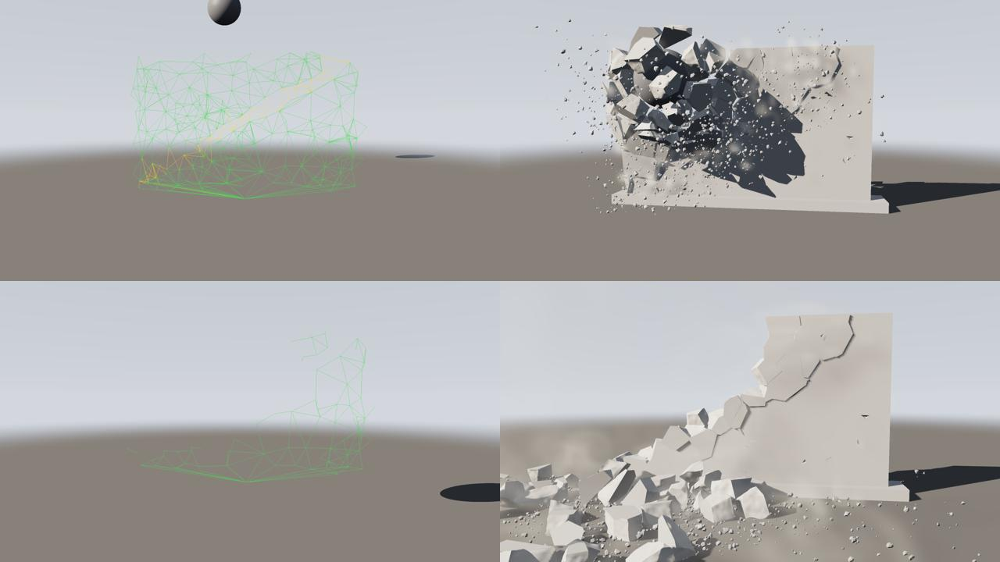

```
./build/prototype sim constraint_network trhlina.mp4   # 90 snímků (3 s)
```

Příklad **constraint_network** ([examples/sim/constraint_network.pgsim](../examples/sim/constraint_network.pgsim))
je betonová zeď 5 × 3 × 0,3 m na soklu, rozbitá Concrete Fracture na 140
kusů a 75 úlomků z rohů. RBD Constraints z nich udělá síť vazeb (216 bodů,
795 čar). Wrangle `crack` vezme 75 spojům přes čáru z levého dolního do
pravého horního rohu 98 % pevnosti (`weaken 0,02`) a obarví je žlutě;
spoj leží přes čáru, když jsou jeho konce na opačných stranách. Síť jde
do Constraints RBD Solveru (`glue 1000`, `spread 0,35`).

Klíčovaná koule narazí zezadu do levého horního rohu. Roh nad čárou
vylomí, zeď praskne přesně po čáře až do protějšího rohu a díl nad
trhlinou tam zůstane ležet na prasklině. Zbytek, slepený stejně pevně
jako dřív, stojí. Bez sítě (odpojte Constraints) rozbije koule zeď kolem
místa, kam dopadla, a trhlina vede jinudy. Uzel `joints` (RBD Pieces,
*Constraints*) vrací síť každého snímku: když ho zobrazíte, uvidíte
praskat spoje.

```
[wall] ─▶ [Concrete Fracture] ─▶ [moving] ─┐
[plinth] ─▶ [foundation] ──────────────────┴▶ [pieces] ─┬─────────────────Pieces─┐
                                  [RBD Constraints] ◀───┘                        │
                                          └─▶ [crack] ─Constraints───────────────┤
[ball] ─Collider─▶ Colliders ────────────────────────────────────────────────────┴▶ [RBD Solver] ─Look─▶ [Output] ◀─ [camera]
                                                                                     │ Rigid ─▶ [joints]
                                                                                     │ Dust ─▶ [Pyro Solver] ─▶ [Volume Look]
```

### Drť jako částice

Drť jsou drobné kamínky (u skla střípky), které RBD Solver simuluje jako
částice vedle kusů. V Houdini je to *debris*: Debris Source a POP Solver
nad kusy z RBD. Každý kousek má polohu, rychlost, velikost, číslo a
natočení ([`moveGrit`, `throwFromFace` v `Rigid.cpp`](../src/pg/sim/Rigid.cpp)):

- **Odkud.** Z lomu: když praskne spoj, vylétnou kousky z okraje plochy,
  po které se kusy držely. Letí v její rovině a trochu napříč, rychlostí,
  jakou se kusy rozcházejí. Kolik jich je, dává plocha spoje (2 až 10
  na `debris`). Další přidají nárazy (tím víc, čím tvrdší), drcení a
  nálož, která kus rozmetá.
- **Let.** Kousek padá, vzduch ho brzdí a točí se. Malé brzdí víc než
  velké: odpor je jako u kamínku 2400 kg/m³, zpomalení 1,5·10⁻⁴ *v*²/*r*,
  u skla trojnásobné.
- **Nárazy.** Dokud je kousek uvnitř kusů, ze kterých vylétl, prochází
  tím, co se hýbe; do toho, co stojí (kusy s `active 0`, podlaha), naráží
  hned, takže nepropadne schody ani základem. Z lomu u stojícího kusu
  vylétne na straně, která se hýbe. Venku naráží do kusů, překážek i
  podlahy (každý krok paprsek v Joltu). Odrazí se čtvrtinou rychlosti
  kolmo k ploše a zachová si polovinu rychlosti podél ní, převezme pohyb
  toho, do čeho narazil, a roztočí se. Kde dopadne pomaleji než 0,35 m/s
  na plochu, která míří nahoru, zůstane ležet: na schodu, na římse, na
  kusu.
- **Jízda.** Leží-li kousek na něčem, co se hýbe (kus, klíčovaná
  překážka), jede s tím a otáčí se s tím. Když se to rozjede rychleji než
  1 m/s, nakloní o víc než 60° nebo zmizí, kousek se pustí a letí dál sám.
- **Stopy prachu** (`trail`). Kus, který se utrhl před méně než sekundou
  a půl a letí rychleji než 2,5 m/s, za sebou nechává prach. Čím je větší
  a rychlejší, tím víc, a čím déle letí, tím méně. V jednom kroku nejvýš
  32 kusů, ty nejsilnější.

Drť nesou snímky, cache (natočení od verze 9), **RBD Pieces** se zapnutým
`grit` (body s `pscale`, `v`, `id` a `orient`), Python (`grit`,
`grit_velocities`, `grit_ids`, `grit_orient`) a USD (`primvars:orient`).
`orient` je jednotkový kvaternion x, y, z, w jako v Houdini: **Copy to
Points** natočí kamínek zkopírovaný na body drti přesně tak, jak se drť
točí (`orient` má přednost před normálou). Drti je nejvýš 40 000 kousků a
simulaci zpomalí málo (v příkladu demolition asi o 1 %).

### Devátý příklad: sloup ze schodů

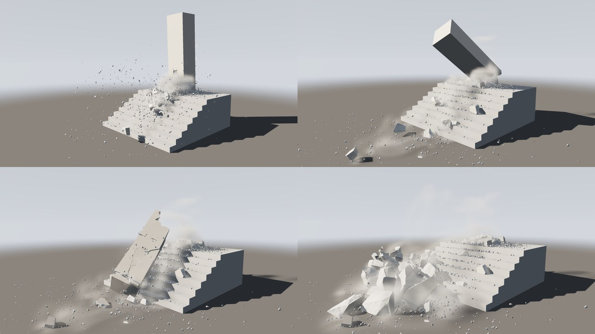

```
./build/prototype sim debris_stairs schody.mp4   # 110 snímků (3,7 s)
```

Příklad **debris_stairs** ([examples/sim/debris_stairs.pgsim](../examples/sim/debris_stairs.pgsim))
je betonový sloup 0,9 × 3,6 × 0,9 m na podestě schodiště:

- **Schody** postaví Detail Wrangle `stairs`: sedm stupňů po 18 cm
  výšky a 30 cm hloubky (Steps, Rise, Run a Width pod snippetem), každý
  jako kvádr od země. Wrangle `stone` z nich udělá kusy, které se nehýbou
  a nejsou ke sloupu přilepené (`glue 0`).
- **Sloup** rozbije Concrete Fracture na 110 kusů. Wrangle `charge` mu
  nastaví `glue` 1 (Merge by ho jinak doplnil nulou podle schodů) a
  nálož u paty na straně schodů. Za 0,4 s přetrhne spoje, 60 % kusů
  rozmetá a zbytek odhodí po schodech. Sloup, který teď stojí jen na
  zadní části paty, se překlopí dolů po schodech, dopadne na ně a rozlomí
  se.
- **Drť** z nálože a z lomů skáče po schodech a zůstává ležet na stupních.
  Za odhozenými kusy se táhne prach (`trail 1,5`), Pyro Solver nad
  schodištěm z něj dělá oblak.

Na výstup Rigid se dá připojit RBD Pieces se zapnutým `grit`: drť pak
vyjde jako body s `orient` a Copy to Points na ně zkopíruje kamínky.

```
[stairs] ─▶ [stone] ──────────────────────────┐
[column] ─▶ [Concrete Fracture] ─▶ [charge] ──┴▶ [pieces] ─Pieces─▶ [RBD Solver] ─Look─▶ [Output] ◀─ [camera]
                                                                     │ Dust, Collider ─▶ [Pyro Solver] ◀─Forces─ [Turbulence]
                                                                                          └─▶ [Volume Look] ─Look─▶ [Output]
```

### Usměrněná simulace: Guide

Záběr často chce, aby věc padla přesně tak, jak ji nakreslil: komín mezi
dva domy, zeď na auto, věž na stranu, kde je volno. Čistá simulace to
trefí jen náhodou. **Guide** RBD Solveru je animace kusů a solver kusy
vede za ní. V Houdini je to řízená (*guided*) simulace RBD: animovaná
geometrie je cíl a tělesa ho sledují, dokud je fyzika nepustí
([`steer`, `letGo`, `rigidGuide` v `Rigid.cpp`](../src/pg/sim/Rigid.cpp)).

- **Co je Guide.** Kusy z Pieces, jen posunuté a natočené: tytéž body ve
  stejném pořadí. Nejčastěji je to klíčovaný Transform za kusy (jeho
  **Pivot** otáčí kolem daného bodu, třeba kolem hrany zářezu), wrangle,
  který body posouvá podle `@Time`, nebo cokoli jiného, co počet a pořadí
  bodů zachová. Když má Guide jiný počet bodů, kompilace to ohlásí a kusy
  nevede nic. Mění-li se Guide v čase, cookuje se v každém snímku. Solver
  si z něj ale nechá jen pózu každého kusu (pár bajtů na kus a snímek),
  ne celou geometrii.
- **Jak vede.** Slepené kusy jsou jedno těleso. V každém kroku solver
  najde, kde ho Guide chce mít na konci kroku: pózu tuhého tělesa, která
  jeho body nejlépe položí na body Guide. Rychlost a otáčení tělesa pak
  nastaví tak, aby tam krokem došlo. S `guide_strength` 1 tam dojde celé,
  s menší jen o díl cesty, takže se za Guide opožďuje jako na pružině.
  Gravitaci solver vyruší v takové míře, v jaké kusy vede. Narážet kusy
  nepřestanou: když je Guide pošle do domu, o dům se zastaví.
- **Kdy pustí.** Kus jde svou cestou, když uplyne `guide_until`, když mu
  praskne spoj (se zapnutým `guide_let_go`: co se ulomí, padá samo, a věc
  se při dopadu volně rozpadne) nebo když se těleso od Guide vzdálí víc
  než o `guide_reach`, protože ho zastavila zem nebo to, do čeho narazilo.
  Puštěný kus už Guide znovu nechytí.
- **Co vede.** Jen to, co se hýbe. Kusy s `active 0` stojí, a stojí i
  těleso k nim přilepené. Stavbu na základu je proto potřeba od základu
  uvolnit: náloží (`release`), nebo základem s `glue 0`. Atribut `guide`
  (0 až 1) řekne, jak moc Guide vede který kus. Když ho má jen část kusů
  spojených Mergem, ostatní dostanou 0 a Guide je nepovede.
- `guide_strength` jde klíčovat. Stažená k nule předá kusy simulaci
  postupně.

### Desátý příklad: komín do ulice

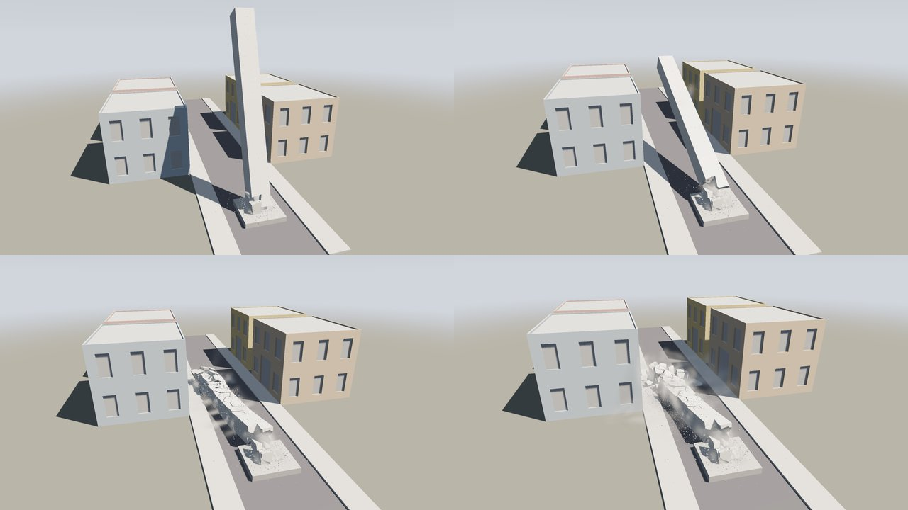

```
./build/prototype sim guided_fall komin.mp4   # 130 snímků (4,3 s)
```

Příklad **guided_fall** ([examples/sim/guided_fall.pgsim](../examples/sim/guided_fall.pgsim))
je odstřel betonového komínu 1,4 × 14 × 1,4 m do ulice mezi dvoupatrovými
domy:

- **Komín** rozbije Concrete Fracture na 170 kusů s hrubými lomy
  po 8 cm (`detail 0,08`). Komín je vidět z dvaceti metrů, jemnější detail
  by jen zdržoval (3 cm: přes dva miliony trojúhelníků). Wrangle `charge`
  nastaví všem kusům `active` a `glue` 1 a v 0,4 s odpálí nálož u paty.
  Spoje dolních kusů se přetrhnou a na straně, kam má komín padnout,
  nálož vylomí zářez: 80 % kusů tam rozmetá na prach a drť, zbytek odhodí.
- **Sokl** pod komínem je kus, který stojí a není ke komínu přilepený
  (`glue 0`). Komín na něm jen stojí a drží ho Guide.
- **Guide** je Transform `fall` za kusy. Otáčí je kolem hrany zářezu
  (Pivot 0; 0,4; 0,7) s klíči po čtyřech snímcích od 12. do 88. snímku,
  tak jak padá tyč dlouhá 14,4 m. Na konci je otočí o 8° napříč ulicí.
  Komín ho sleduje dolů a do ulice mezi domy dopadne tam, kam ukazují
  klíče.
- **Dopad.** Na silnici praskají spoje a každý kus, kterému praskl spoj,
  jde svou cestou (Let Go When Broken). Pustí se i to, co zem zastaví dál
  než 1,5 m od Guide (`guide_reach`). Komín se rozlomí na kry a kusy a
  sype drť a prach.
- **Domy** jsou čtyři assety **Building** (dvě patra, okna, dveře do
  ulice), natočené a posunuté Transformem. Uvnitř každého je Object,
  kvádr, do kterého narážejí kusy i prach. Silnice a obrubníky jsou také
  Objecty. Pyro Solver (18 × 10 × 40 m) z prachu dělá oblak.

Klíče jde změnit: komín pak padne později, pomaleji nebo víc natočený,
tak, jak klíče řeknou. Bez Guide (odpojte ho) zůstane komín po odpálení
nálože stát na zbytku paty a jen se pomalu naklání: za 4,3 s záběru se
jeho vršek posune asi o 3 m. Kdy a kam padne, by pak rozhodla až
simulace.

```
[chimney] ─▶ [Concrete Fracture] ─▶ [charge] ──┐
[plinth] ─▶ [foundation] ──────────────────────┴▶ [pieces] ─┬──────────Pieces─┐
                                                            └▶ [fall] ──Guide─┤
[in_left] … [in_right_far], [road], [kerb_left], [kerb_right] ─Colliders──────┴▶ [RBD Solver] ─Look─▶ [Output] ◀─ [camera]
                                                                                 │ Dust, Collider ─▶ [Pyro Solver] ◀─Forces─ [Turbulence]
                                                                                                    └─▶ [Volume Look] ─Look─▶ [Output]
[left] ─▶ [at_left] ──────────┐
[right] ─▶ [at_right] ────────┤
[left_far] ─▶ [at_left_far] ──┼▶ [street]   (zobrazená: domy)
[right_far] ─▶ [at_right_far] ┘
```

### Jak to funguje

[`src/pg/sim/Rigid.h`](../src/pg/sim/Rigid.h) obaluje Jolt Physics 5.6
(MIT). Jolt je sestaven s `CROSS_PLATFORM_DETERMINISTIC` a bez AVX, takže
stejný krok dá stejné bity na každém stroji a při každém spuštění. To je
pro cache snímků, pro testy a pro střih videa důležitější než rychlost.
Solver přitom běží na tolika vláknech, kolik jich má program
(`--threads`), a výsledek je na jednom i na čtyřech vláknech bit po bitu
stejný:

- **Jolt na vláknech.** Jolt dostane vlastní pool vláken
  (`JobSystemThreadPool`), při jednom vláknu běží jeho úlohy jedna po
  druhé. Jolt sám je deterministický, pokud se jeho API volá ve stejném
  pořadí.
- **Nárazy v pevném pořadí.** Dotyky hlásí Jolt ze svých vláken, v pořadí,
  které se mění. Solver je sbírá pod zámkem, každý s číslem podkroku, ve
  kterém přišel (počítá ho posluchač kroků, který Jolt volá před
  kolizemi podkroku). Po kroku je seřadí podle podkroku, těles a jejich
  částí. Na pořadí záleží: náraz láme spoje postupně a jiné pořadí by
  zlomilo jiné spoje.
- **Drť na vláknech.** Každý kousek letí sám a z těles jen čte, takže se
  kousky rozdělí mezi vlákna. Paprsek bere nejbližší plochu, a když jsou
  dvě stejně blízko, tu s nižším číslem tělesa a části. Pořadí, ve kterém
  je broad phase vydá, se totiž s vlákny může měnit.

Věž z příkladu (593 kusů v 710 tělech, přes dva tisíce spojů) se během
pádu (180 snímků) krokuje za 4,1 ms na snímek na jednom vláknu a za
3,2 ms na čtyřech. Věž rozřezaná na 5 628 kusů za 60–70 ms na jednom
a 30 ms na čtyřech (`./build/pgbench_rigid`, bez prachu). Skoro všechen
čas je v řešiči kontaktů Joltu a roste s počtem těles, která se právě
hýbou.

**Tělesa v klidu zmrznou** (`rest`, Freeze at Rest). Jolt sám uspí jen
celý ostrov těles, který je v klidu. V hromadě trosek se ale vždycky
něco chvěje, takže by Jolt krokoval všechno až do konce. Solver proto
hlídá každé těleso sám. Těleso, které se půl sekundy nepohnulo o víc než
2 cm (ani nejvzdálenějším rohem) a leží do 2 cm na tom, co se nehýbe,
přepne na statické (`SetMotionType(Static)`). V Joltu pak nic nestojí.
Pod ním může být podlaha, stojící kus, jiné zmrzlé těleso nebo klíčovaný
objekt, který stojí. Kusy, které drží lepidlo ke stojícím, a kusy vedené
Guide nezmrznou. Zmrzlé těleso probudí:

- **náraz rychlejší než 1 m/s**, v posluchači kontaktů. Narážející musí
  mít dost hybnosti: hmotnost × rychlost aspoň desetinu součtu hmotností
  obou těles (přilepené by těleso rozjelo aspoň na 0,1 m/s). Drť a malé
  úlomky proto hromadu neprobudí;
- **to, co k němu letí.** Statické a dynamické těleso Jolt srazí, až když
  se dotknou, a to už je pozdě: zmrzlé těleso by pak v tom podkroku stálo
  jako zeď. Proto se v každém podkroku každému tělesu rychlejšímu než
  1 m/s udělá kvádr, kterým za podkrok projde. Je to jeho obal posunutý
  o rychlost × krok a zvětšený o to, co za krok opíše otáčením, plus
  2 cm. Broad phase Joltu (`CollideAABox`) najde zmrzlá tělesa v cestě
  a ta se probudí, když na ně letící má dost hybnosti (jako výš). Ptá se
  z menší strany: kvádry letících proti zmrzlým, nebo obaly zmrzlých
  proti letícím;
- **voda nebo plyn**, které ho tlačí silou přes 5 % jeho váhy, látka,
  která ho nese, nálož, která v něm vybuchne, a klíčovaný objekt, který
  k němu dojede.

S tělesem se probudí i to, co na něm leží, a to, co leží na tom. Zmrzne
a probudí se ve stejném pořadí na jakémkoli počtu vláken, takže snímky
zůstanou bitově stejné. Během pádu se tím věž nezrychlí: skoro všechno je
v pohybu a hlídání stojí asi 2 % kroku. Usazená velká věž se ale krokuje
za 2,1 ms na snímek místo 56 ms. Za 360 snímků je to v průměru 38 ms
místo 61 ms (na jednom vláknu). Bez zmrazení zůstane ve snímku 360 vzhůru
1 648 těles, se zmrazením je od snímku 300 zmrzlé všechno.

- **Kusy a jejich části.** Kus je jedno tělo — nebo víc, když je
  z částí, které se nedotýkají. Každá část (uzavřený kus povrchu) naráží
  jako svůj konvexní obal (`ConvexHullShape`), takže kus z víc částí
  (roh stěny a stropu, shluk buněk) drží svůj tvar. Části, které se
  dotýkají jakoukoli plochou, jsou jedno tělo. Hmota a setrvačnost jsou
  z objemu obalů a hustoty.
- **Spoje.** Dvě těla se lepí tam, kde se dotýkají plochou: stěny, které
  leží v jedné rovině proti sobě a překrývají se (průnik mnohoúhelníků
  Sutherland–Hodgman, plocha triangulací). Spoj je tak pevný, jak velká
  je společná plocha: `glue` × plocha, krát atribut `glue` slabšího kusu.
  Plošky menší než (10⁻⁴ × úhlopříčka)² se nelepí. Plochy dvou částí se
  porovnávají jen tam, kde se jejich obaly překrývají, zametáním podél
  nejdelší strany překryvu. Hrubý lom, jehož trojúhelníky se nespojí
  v jeden mnohoúhelník (potkávají se v T-spojích), je tisíce plošek na
  část; porovnat každou s každou u komínu z dvou milionů trojúhelníků
  trvalo dvě minuty, takhle to trvá sekundy.
- **Slepené kusy jsou jedno těleso.** Kusy spojené neporušenými spoji
  tvoří shluk (cluster) a ten je v Joltu jedno těleso složené z obalů
  všech svých kusů (`StaticCompoundShape`) — tuhé jako jeden kus, takže
  postavená stavba stojí, neprohýbá se a nekmitá. Kusy s `active 0` jsou
  statická tělesa a shluk k nim přilepený drží pevný spoj
  (`FixedConstraint`). Tak to dělá i Houdini (Bullet) s lepidlem: slepené
  kusy simuluje jako jedno těleso a rozdělí je až při nárazu.
- **Přilepené k základu stojí, kde byly postavené.** Klíčovaná překážka
  má nekonečnou hmotu a základ také, takže spoj mezi nimi v kroku řešiče
  trochu povolí. Shluk přilepený ke kusu s `active 0` se proto po každém
  kroku vrátí tam, kde byl postavený, a nehýbe se; kontakt se základem,
  ke kterému je přilepený, není náraz (jsou jedno, jako kusy jednoho
  tělesa) a jeho „změna pohybu“ se nepočítá do nárazů ostatních věcí,
  které se ho v tom kroku dotknou — jinak by koule, která do zdi strká,
  přetrhla spoje i tam, kde do zdi jen ťukne padající úlomek.
- **Nárazy.** Z každého kontaktu (nového i trvajícího) solver pozná,
  jak silně to bouchlo: co bylo třeba ke změně pohybu tělesa (hybnost
  po kroku proti hybnosti před ním, bez gravitace, rozdělená mezi místa
  nárazu), a aspoň co je třeba k zastavení obou věcí proti sobě — jako
  síla za krok řešiče. Síla přetrhne spoje zasaženého kusu, které drží
  méně, a její díl `spread` (polovina) jde dál na kusy za nimi (i přes
  spoje, které právě praskly), kde zase přetrhne, co drží méně než ona,
  a tak dál do ztracena — nebo nejvýš `rings` prstenců kusů od místa
  nárazu. Kus s `crush`, do kterého narazí víc než `crush`-krát tolik,
  kolik drží jeho lepidlo, se rozdrtí: zmizí v obláčku prachu a drti.
- **Nezastavitelná překážka.** Klíčovaný objekt má nekonečnou hmotu, takže
  „zastavit obě věci proti sobě“ znamená zastavit celý slepený shluk: koule
  do stojící zdi (10,8 t) rychlostí 6 m/s udeří silou kolem 9 MN, stokrát
  víc, než drží spoj, a s polovinou nárazu na každý další prstenec by
  praskla celá zeď najednou. `rings` 1–2 udrží škodu kolem koule: prorazí
  díru a zbytek zdi stojí. Houdini s animovaným statickým objektem a
  lepidlem řeší totéž (Propagate Iterations, pevnější lepidlo dál od
  nárazu).
- **Rozpad.** Když ve shluku prasknou spoje, rozpadne se na skupiny, které
  drží pohromadě, a každá jde dál jako samostatné těleso. Skupina, která
  se odlomila, si ponechá 98,5 % rychlosti, kterou měla před nárazem —
  drtila to, co se ulomilo, nestála na tom; skupina, do které převážně
  narazilo, se zastaví. Proto se věž v příkladu hroutí patro po patru
  rychlostí asi 13 m/s a nezůstane stát na první hromadě.
- **Nálože.** V čase `release` se přetrhnou všechny spoje kusu. Kus
  s `vanish` zmizí ve výbuchu prachu a drti, ostatní dostanou `kick`.
- **Drť.** Lomy, nárazy a drcení sypou drobné kamínky, které jsou
  částicemi ([výše](#drť-jako-částice)). Z lomu vylétají z okraje plochy
  spoje (spoj si k tomu nese normálu napříč plochou). Letí brzděné
  vzduchem a točí se, narážejí do kusů, překážek i podlahy a zůstanou
  ležet, případně jedou s tím, na čem leží. Je jich nejvýš 40 000,
  velikost roste s `dust_size`, počet s `debris`.
- **Stopy prachu.** Kusy, které se utrhly (první prasklý spoj si pamatují)
  a letí rychle, nechávají za sebou obláčky prachu (`trail`).
- **Prach a vytlačený vzduch.** Každý lom, náraz a rozdrcený kus vyfoukne
  obláček, který osm snímků slábne a letí polovinou rychlosti kusu;
  blízké obláčky téhož kroku se sloučí. Tvrdý náraz a drcení navíc
  vytlačí vzduch — tolik, kolik kus o své úhlopříčce *d* zastavený
  rychlostí *v* vytlačí: `air` × 0,35 × *d*² × *v* m³/s. Obláček se tím
  rozpíná (m³/s na svůj objem, nejvýš 20 za sekundu) a Pyro Solver tu
  expanzi započte do tlaku: prach se od hromady valí po zemi do stran,
  jako při skutečném odstřelu, kde padající patra vytlačí vzduch z celé
  budovy.
- **Překážky.** Objekty ze vstupu Colliders jsou kinematická tělesa (koule,
  kvádr, válec; kužel a síť jako konvexní obal): jdou přesně tam, kam je
  animace klíčuje, a odstrčí, co jim stojí v cestě. Podlaha je statický
  kvádr pod nulou. Rychlost kusů je omezená (40 m/s, 30 rad/s), aby je
  nekonečně těžká překážka nevystřelila.
- **Výztuž.** Pruty projde solver kusy (`rigidRebar`): každý úsek lomené
  čáry ořízne rovinami stěn každé konvexní části (jak je má `proxy`), a
  z průsečíků složí *stanice* — úseky prutu uvnitř jednoho tělesa, v pořadí
  podél prutu (úsek kratší než půl průměru, jen škrtnutý roh, se nepočítá).
  Dvě po sobě jdoucí stanice, které prut drží, spojuje *vazba*; kusy
  jednoho shluku jsou jedno těleso a vazba mezi nimi spí. Když lepidlo
  praskne a kusy jsou v různých tělesech, dostane vazba spoj Joltu
  (`SixDOFConstraint`) se všemi šesti směry volnými a třením v každém:
  v posuvu tolik, kolik prut drží v tahu, v natočení plastický moment
  prutu (*f*<sub>y</sub> *d*³/6). Prut tak drží, co unese, za tím povolí a
  zůstane, jak povolil — plasticky, bez pružení zpátky. Co prut drží, je
  menší z oceli (*f*<sub>y</sub> π *d*²/4) a z **kotvení** na každé straně
  trhliny: soudržnost `bond` × π *d* × délka prutu ve všech kusech, které
  ho tam drží, až k přetržení nebo konci prutu. Kde se konce vazby
  rozejdou dál, než je prutu mezi nimi (s plastickou zónou 20 *d* kolem
  trhliny: odsunutí stranou prut ohne do S a stojí ho méně délky než tah
  podél), prut povolí tam, kde drží nejmíň: kotví-li ho obě strany víc,
  než drží ocel, ocel se protahuje; jinak se prut podél sebe vytahuje ze
  strany, která ho kotví míň — z kusu u trhliny, a až z něj vyjde celý, ze
  dalšího (beton z něj opadá v obláčku prachu) —, a stranou se ohýbá.
  Protažený nebo ohnutý o `stretch` z toho, co teče, se přetrhne — u líce
  strany, která ho drží míň: ta odletí s pahýlem, druhá si nechá zbytek.
  Vazby se po každém rozpadu shluku a po každém vytažení či přetržení
  poskládají znovu (spoje mezi stejnými tělesy zůstanou) a hned se
  přepočítají, dokud všechny nedrží. Rozdrcený nebo rozmetaný kus pruty
  pustí; prut pak vede holý přes místo, kde byl.
- **Sklo.** Kus, jehož primitiva mají `glass` 1 nebo víc, je skleněný.
  Fyzika je stejná jako u ostatních kusů (hustotu, lepidlo a tření dá
  solver), liší se to, co z něj vypadne: lom a náraz skla vyfoukne
  desetinu prachu (drcení pětinu) a sype menší drť, která je skleněná
  (`debrisGlass`). Snímek navíc nese, kterým tělesům praskl některý spoj
  (`unglued`). **Tabule je celá, dokud se nerozbije**: skleněné kusy, které
  se v klidu dotýkají, tvoří tabuli, a dokud žádnému z nich nepraskl spoj,
  žádný se od ostatních nepohnul a žádný nezmizel, nemá tabule trhliny —
  plochy `glass 2` se nekreslí a neexportují (`wholePanes`, `posedPieces`).
  Sklo je průhledné, takže jinak by byla pavučina vidět už před úderem;
  jakmile tabule praskne, objeví se celá najednou, i ve střepech, které
  zůstaly v rámu. Samotný střep (bez skleněného souseda) tabulí není a
  jeho řezné plochy jsou jeho hrany.
- **Guide.** Z geometrie Guide si solver v každém snímku vezme pózu
  každého kusu (`rigidGuide`): otočení a posun, které body kusu v klidu
  nejlépe položí na jeho body v Guide. Otočení je rotační část kovarianční
  matice posunutých bodů proti klidovým, hledaná iterací podle Müllera,
  Bendera, Chentaneze a Macklina (2016). Co je v každém snímku stejné (ke
  kterému kusu bod patří, středy kusů v klidu), se spočítá jednou za
  kompilaci (`RigidGuideRest`). Těleso z víc kusů dostane pózu, která
  nejlépe sedí na body všech jeho kusů. Stačí k tomu počet bodů, střed a
  rozptyl každého kusu, body se znovu neprocházejí. Před krokem solver
  nastaví rychlost a otáčení tělesa tak, aby krokem došlo do cíle, a
  přidá sílu proti gravitaci (`steer`). Ani tu rychlost, ani tu sílu
  nepočítá do nárazů, jinak by vedení samo lámalo spoje. Po kroku pustí,
  co pustit má (`letGo`).
- **Kroky.** Svět (`WorldSolver`) krokuje tuhá tělesa jako první; voda,
  plyn a déšť pak dostanou kusy tam, kde právě jsou, a plyn obláčky
  prachu jako zdroje.

---

## 4. Úlomky dál: kreslení, geometrie, voda, plyn, prach

**Kreslení.** Solver zapojený do Outputu se kreslí sám: každý snímek se
kusy posunou a otočí tam, kam dopadly (`drawnPieces`), s barvou `Cd`, kterou
si nesou, řezné plochy ze skupiny `inside_group` v barvě `inside_color`,
kusy bez barvy v `color`; rozdrcené a rozmetané kusy zmizí. Drť se kreslí
jako hranaté úlomky kamene své velikosti v barvě řezu, o odstín tmavší:
každý úlomek vyřízne pět až sedm lomů kolem vršku mimo střed, každý lom je
plocha, která se od oka odklání, a úlomek má svůj tvar i trochu jiný
odstín (šedší, světlejší, tmavší). Tvar se odvodí z velikosti zrnka, která
se za letu nemění, takže úlomek zůstane týž; v letu se otáčí, ležící je
v klidu. Body zobrazené geometrie zůstávají kulaté tečky. V prachu drť
zakryje prach mezi okem a zrnkem a zastíní prach mezi ním a sluncem, takže
drť v oblaku proti světlu tmavne. Geometrie i kusy vrhají stíny na sebe,
na zem i do kouře (stínová mapa slunce, 2048², měkké okraje) a Output má
barvu země, vypínač mřížky a oblohu za scénou (`sky_behind`).

**Sklo** se kreslí průhledné (`Volume.cpp`). Trojúhelníky s `glass`
nejdou do vyrovnávací paměti neprůhledných ploch, ale do dvou vlastních
vrstev: nejbližší plocha skla přivrácená k oku a za ní — odloupnutá od
první (*depth peeling*) — další. Odvrácené plochy jsou tam, kde paprsek
ze skla vychází, takže každý střep dá jednu vrstvu. Hlavní průchod pak
na paprsku až k neprůhledné ploše složí vrstvu po vrstvě: tenká tabule
odráží z obou svých stěn (Fresnel se Schlickovou aproximací, *F*₀ = 0,04,
odraz dvou stěn 2*F*/(1 + *F*)) oblohu tak, jak je vidět za scénou, zemi
pod horizontem, objekty scény a lesk slunce; co propustí, zabarví podle
cesty sklem — šikmo víc než kolmo. Plochou trhliny se paprsek dívá podél
tabule, přes mnohem víc skla: tmavší a zelenější, s jasem, který tabule
k lomu přivede. Prošlé světlo zabarví i kouř a povrch za sklem. Skleněná
drť jsou ploché třísky o třech až pěti stranách, průhledné, s odrazem
oblohy a zábleskem slunce, které se v letu naklápějí — jiskří. Sklo
nevrhá stín; hloubka a masky průchodů jsou plochy za ním.

**Pruty** se kreslí jako šestiboké trubky své tloušťky v barvě
`rebar_color` (`rebarBars`, `drawnPieces`): úsek prutu v kusu se s kusem
posune a otočí, holý prut mezi dvěma kusy vede Hermitovou křivkou, která
vychází z každého kusu směrem, kterým z něj prut vede — ohnutý tam, kde se
kusy vůči sobě natočily —, přetržený prut končí pahýlem osminásobku
průměru (nejméně 5 cm) a holý konec za posledním kusem, který ho drží,
pokračuje rovně.

**Do jiného rendereru.** `prototype sim demolition - --export
demolition.usda` zapíše celý záběr jako scénu USD: každé těleso jednou
jako tvar a pak jen jeho poloha a otočení v každém snímku, rozmetaná tělesa
zneviditelněná, drť jako body s natočením (`primvars:orient`), prach jako
soubory VDB vedle, kamera, slunce a obloha. Blender, Houdini nebo Karma ho vyrenderují s vlastním
světlem, rozmazáním pohybem a materiály; plochy řezu jsou `GeomSubset`
`inside`, aby dostaly jiný materiál ([usd.md](usd.md)). Skleněné plochy
jsou `GeomSubset` `glass` s materiálem `/World/Looks/glass` (čirý,
hladký, IOR 1,5), trhliny skla samostatná síť `cracks`, neviditelná do
snímku, kdy tabule praskla, a drť nese `primvars:glass`. Pruty jsou
`/World/rebar`: lineární `BasisCurves` s tloušťkou (`widths` po vrcholech)
a rychlostmi, v souboru každého snímku. V Pythonu vrátí
`frame.rigid.rebar()` pruty snímku jako geometrii (`width`, `v`) a
`rebar_state`, `rebar_stations`, co se s kterým úsekem stalo;
`grit_glass` řekne, která drť je skleněná, `grit_orient`, jak je který
kousek natočený, a `unglued`, kterým tělesům praskl spoj.

**RBD Pieces** (Geometry) vrátí kusy daného snímku jako geometrii: body
posunuté a otočené, normály otočené a rychlost každého bodu v `v` — pro
další uzly, pro export snímek po snímku (`prototype sim --export`), pro
scatter jisker z hran. Se zapnutým `grit` přidá i drť jako body: `pscale`
je polovina velikosti zrnka, `v` jeho rychlost, `id` jeho číslo — každé
zrnko dostane při vyhození své a drží ho, dokud je ve scéně, takže renderer
podle něj zrnko sleduje a rozmaže pohybem — a `orient` jeho natočení
(Copy to Points podle něj natočí, co na zrnko zkopíruje). Se zapnutým
`rebar` přidá pruty tak, jak je kusy vzaly: lomenou čáru za každý úsek prutu v jednom
kusu (u přetržení se čára rozdělí) s `width`, průměrem prutu, a `v`.
S `output` *Constraints* vrátí místo kusů síť vazeb snímku
([§3](#síť-vazeb-rbd-constraints)). Bez snímku (před simulací) je prázdný.

**Voda, plyn a déšť.** Výstup Collider dá každý kus jako překážku typu
síť (`MeshShape` z jeho trojúhelníků), posunutou a otočenou tam, kde kus
je, s jeho rychlostí a otáčením: voda se před kusem hrne a za ním táhne
brázdu, kouř kusy obtéká a padající kusy ho strhávají s sebou, déšť od
nich odstřikuje.

**Obousměrně: voda a plyn tlačí kusy.** Parametry RBD Solveru v sekci
*Fluids*:

- **Buoyancy** (1): voda nadnáší kusy váhou vody, kterou vytlačí
  (Archimédův zákon). Co je lehčí než voda (Density pod 1000, dřevo),
  plave, těžší klesá pomaleji než vzduchem.
- **Water Drag** (1): voda kusy i drť unáší a brzdí.
- **Air Drag** (1): proud Pyro Solveru unáší drť a kusy, třeba vítr
  z oblaku prachu nebo tlaková vlna.

Nula vazbu vypne. Zbytek je obrácený směr: přes výstup Collider jdou
voda a plyn kolem kusů, jak se pohybují.

Jak to počítá (`RigidSolver::feel`, `Rigid.cpp`):

- **Vzorkovací body.** Každý konvexní obal kusu dostane při stavbě mřížku
  4 × 4 × 4 bodů. Zůstanou ty uvnitř obalu a každý nese svůj díl objemu.
- **Výška hladiny.** Každý snímek se změří nad každým sloupcem mřížky
  vody (`LiquidSolver::waterLevel`): odspodu vodou a kusy v ní až po první
  vzduch, takže cákance nad hladinou se nepočítají. Kde na vodě leží kus,
  vezme se hladina kolem něj. Částice pod plovoucím kusem totiž končí na
  jeho spodku, ne na hladině.
- **Vztlak.** Bod pod hladinou dostane vztlak svého objemu. V pásmu
  velikosti bodu kolem hladiny se ponořená část mění plynule, takže kus
  nepřeskakuje. Vztlak působí v bodě, a proto dává i moment: nakloněná
  deska se narovná a bedna se na vlnách kolébá.
- **Odpor.** Proud vody se měří po stranách kusu, těsně vedle něj pod
  hladinou. Rychlost vody uvnitř kusu je rychlost kusu samotného (je
  pro vodu překážkou), proto se měří vedle. Odpor každého bodu má
  kvadratickou část (voda, kterou kus odtlačí) a lineární, 3/s (vlny,
  které kus dělá). Houpání tak po několika sekundách ustane.
- **Stabilita.** Odpor za krok nikdy nezastaví kus víc, než by ho
  zastavil proti proudu. To drží výpočet stabilní i u lehkého dřeva.
- **Drť.** Kousek drti nese rychlost toho, v čem je, a táhne ho k ní.
  Ve vodě ho voda nadnáší (kámen 2 400 kg/m³ tam váží o 42 % méně) a brzdí
  zhruba 830krát víc než vzduch. Kámen o 3 cm tak klesá asi 0,8 m/s
  jako štěrk. Ve vzduchu ho unáší plyn. Kamínky o centimetru ale vítr
  6 m/s skoro nepohne: fyzika, ne chyba. Nese je až tlaková vlna.

Síly se spočítají **před krokem** ze stavu vody a plynu na konci
předchozího snímku a projdou krokem jako vstup (`RigidFlow`). Dvě věci
z toho plynou:

- Náraz, podle kterého praská lepidlo, se od síly vody a plynu očistí,
  takže vlna kus sama nerozlepí.
- Checkpoint si vstupy všech kroků uloží. Při obnovení se trosky
  přepočítají s nimi, bez vody a plynu, a pokračování je bitově stejné
  ([cache.md](cache.md#3-bake-na-pozadí-checkpointy-a-náhled)).

Nula ve všech třech parametrech dá bitově tytéž kusy jako svět bez vody.

### Jedenáctý příklad: povodeň na dvoře

`flood_crates`: hráz se protrhne na konci dvora 8 × 4 m a voda se přes
něj přežene.

- **Bedny** (dřevo, 350 kg/m³, tedy duté) se zvednou, stoh se převrhne.
  Bedny se kolébají na vlnách a proud je unáší ke zdi a zpátky.
- **Betonové bloky** (2 400 kg/m³) zůstanou stát a voda se o ně láme.

Voda má mřížku 96 × 24 × 48, 115 tisíc částic, 108 ms na snímek.
Příkaz `prototype sim flood_crates out.mp4` záběr vyrenderuje kamerou.

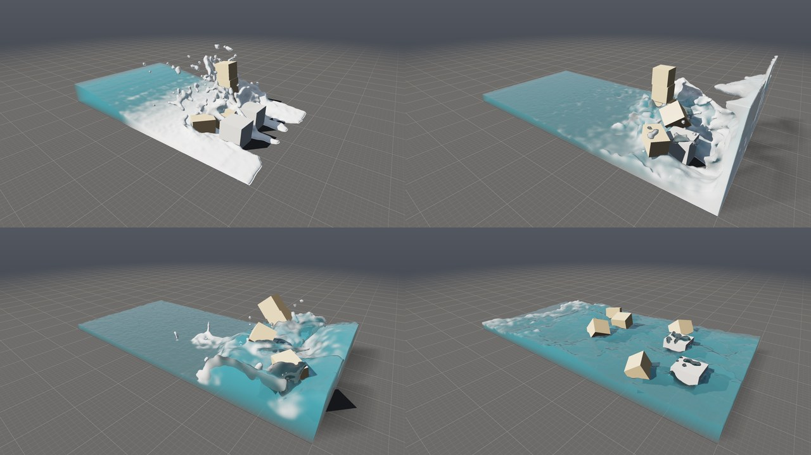

**Prach.** Výstup Dust do Sources Pyro Solveru: každý obláček je koule
velikosti obláčku, která dává kouř `4 × síla`, jen trochu tepla (prach
se valí víc, než stoupá), rychlost obláčku a jeho expanzi; kouř vychází
v chuchvalcích (šum jako u plamenů), ze kterých se oblak nadouvá. Pyro
Solver bez jiných zdrojů se nehlásí, že nic neuvidí — prach je zdroj.

**Expanze zdroje.** Stejnou věc umí i obyčejný zdroj: parametr
**Expansion** (1/s) uzlu Pyro Source říká, jak rychle se plyn ve zdroji
rozpíná — tlačí ho do všech stran, jako výbuch nebo vzduch vytlačený
zřícením. Pyro Solver ji sečte s expanzí hořícího paliva, započte do
tlaku a plyn, který se rozpíná, ředí.

### Dvanáctý příklad: zřícení rodinného domu

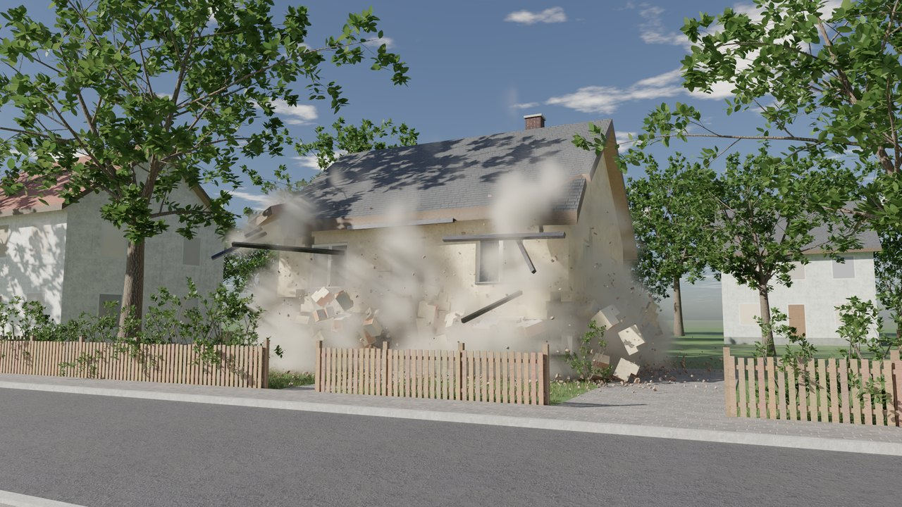

```
./build/prototype sim house_collapse dum.png --renderer cycles --frames 72   # snímek 72 v Cycles
./build/prototype sim house_collapse - --cache dum                            # 210 snímků (7 s) do cache
./build/prototype sim house_collapse dum.png --from-cache dum --start 66 --frames 66 \
    --renderer cycles --samples 64 --size 1920x1080                           # snímek 66 z cache
```

Příklad **house_collapse** ([examples/sim/house_collapse.pgsim](../examples/sim/house_collapse.pgsim))
je zřícení dvoupatrového rodinného domu se sedlovou střechou tak, jak by
ho vyfotil soused z protějšího chodníku. Dům je postavený jako skutečný:

- **Nejdřív otvory.** Wrangle `openings` dá bod doprostřed každého okna
  a dveří: kam se dívá (`N`), šířku, výšku, zeď (`wall`) a druh
  (`kind`). Míry domu (10 × 8 m, zdi 30 cm, sokl 45 cm, patra 2,75 m,
  stropy 25 cm, sklon střechy 40°) uloží jako atributy detailu a ostatní
  uzly je čtou odtud. Parapety a nadpraží leží na ložných spárách: okno
  sahá od třetí do deváté vrstvy tvárnic.
- **Zdi.** Wrangle `walls` složí každou zeď z kvádrů kolem otvorů (pruhy
  mezi hranami otvorů) a For-Each je po jedné předá uzlu Brick Wall.
  Obvodové zdi jsou z keramických tvárnic 250 × 270 × 240 mm na maltu,
  příčka uprostřed z příčkovek 500 × 115 × 240 mm. Omítka je zvenku
  béžová, uvnitř bílá. Wrangle `finish` kusy očísluje a omítne i ostění,
  které Brick Wall nechá holé: plochy podél zdi, před kterými už zeď
  není. Dohromady 2 878 tvárnic.
- **Kusy zdiva.** Nálož přetrhne všechny spoje svého kusu, takže zeď
  z jednotlivých tvárnic by se rozsypala jako stavebnice. RBD Cluster
  `masonry` proto spojí vždy dvě až čtyři sousední tvárnice i s maltou
  do jednoho kusu zdiva (900 kusů) a druhý RBD Cluster je seskupí do 170
  ker s pětkrát pevnějším lepidlem. Zeď se pak láme ve spárách na kusy
  zdiva a kry, jako opravdová.
- **Stropy, štíty, střecha.** Dva stropy rozláme Concrete Fracture
  (94 kusů s odprýsklými rohy), jejich hrany jsou omítnuté jako fasáda
  a podhledy bílé. Štíty (30 kusů) a komín (7) rozřeže Voronoi Fracture.
  Střecha jsou dva hranoly se sklonem 40° a přesahy. Voronoi ji rozřeže
  na pruhy podél krokví (body po 1 m podél hřebene a po 2,2 m po spádu,
  66 kusů). Nahoře je taška (`roof_tiles`, položená po ploše), zespodu
  a v lomech dřevo, hustota 420 kg/m³.
- **Okna a dveře.** Wrangle `windows` usadí do otvorů bílé rámy se
  středním sloupkem a plechové parapety, wrangle `panes` do nich skla.
  For-Each je rozbije po jednom: tabuli posune do počátku, natočí a
  trochu posune (aby se žádné dvě nerozbily stejně), Glass Fracture ji
  rozbije a wrangle `uncanon` vrátí střepy na místo. Z 26 tabulí je
  1 033 střepů. K tomu okapy a svody (`gutters`), dřevěné dveře a sokl
  se dvěma schody, který se nehýbe.
- **Plot do ulice** je také z kusů: sloupky stojí (`post`), latě
  a plaňky jsou k nim přilepené. Co z domu vyletí, plot zastaví, nebo
  z něj vyláme plaňky.
- **Nálože** (`charges`) jsou jen ve zdech přízemí. Odpálí se v 1 s,
  zleva doprava s rozestupem 0,3 s (`lag`). Pata zdí (0,6 m) se z 85 %
  rozletí na prach, výš 35 % kusů, zbytek se uvolní a vystrčí ven
  (`kick`). Co na přízemí stálo, spadne nakloněné doleva a rozláme se
  tam, kde dopadne. Zdi patra se rozdrtí jen tvrdou ranou (`crush 4`),
  stropy drží dvakrát pevněji, střecha třetinou a sklo, rámy a plot
  slaběji.
- **RBD Solver:** 2 421 kusů, 900 kg/m³ (dutá keramika), tření 0,9,
  odraz 0,05, lepidlo 120 kPa, 4 podkroky, prach z lomů i nárazů, drť
  a stopy prachu za kusy.
- **Prach:** Pyro Solver 40 × 20 × 40 m se 192 buňkami (21 cm), řídce.
  Turbulence ho rozvíří a Wind (vánek 1,6 m/s pryč od kamery) ho odnáší:
  po dopadu se oblak plazí zahradou a pomalu odkrývá sutiny. Volume Look
  ho barví šedohnědě.
- **Ulice kolem:** trávník (materiál `lawn`) s trávou z uzlu Grass
  (4 870 trsů), cesta a příjezd z dlažby, chodníky, asfaltová silnice
  mezi obrubníky, dřevěný plot po stranách, stromy a keře z uzlu Tree
  (instance), pouliční lampy a šest sousedních domů (wrangle
  `neighbours`: omítka, okna s pokoji, střechy, komíny).
- **Světlo a kamera:** slunce 30° nad obzorem zleva zepředu, fyzikální
  obloha s mraky (`render_clouds 0,3`), AgX. Kamera stojí na protějším
  chodníku ve výšce očí, objektiv 30 mm. Cycles rozmaže letící kusy
  a drť po jejich dráze, dokud je otevřená závěrka (Motion Blur, výchozí
  půl snímku, [cycles.md](cycles.md#rozmazání-pohybem)). Obrázky v této
  části jsou ještě ostré, renderované bez něj.

Simulace trvá 356 ms na snímek (80 % času prach), 210 snímků za 75 s.
Snímek 1920 × 1080 v Cycles s 64 vzorky a odšuměním trvá na čtyřech
jádrech 7 až 18 minut podle toho, kolik prachu je v záběru; náhled
640 × 360 s 16 vzorky asi minutu.

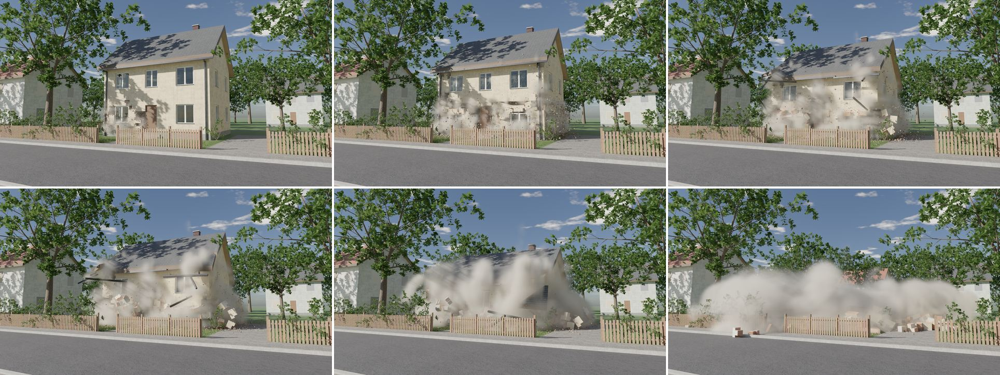

Kamera je jen parametr, takže jiný záběr téhož okamžiku nepotřebuje novou
simulaci. Stačí cache a `--set`, třeba z příjezdové cesty objektivem
24 mm:

```
./build/prototype sim house_collapse z_prijezdu.png --from-cache dum --start 69 --frames 69 \
    --set 'camera.center={7.6, 1.5, 12.5}' --set 'camera.rotation={9.7, 31.3, 0}' \
    --set camera.focal=24 --renderer cycles --samples 64 --size 1920x1080
```

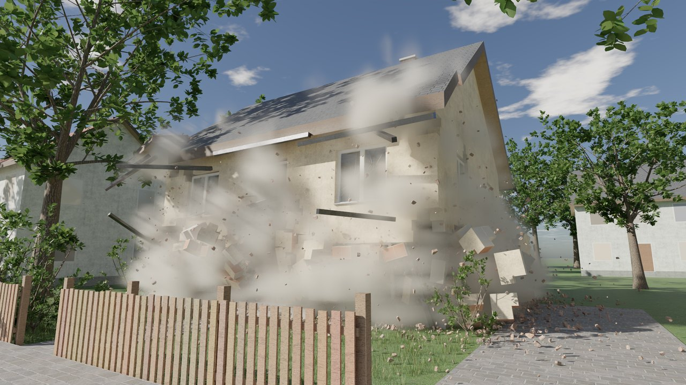

```
[openings] ─┬▶ [walls] ─▶ [outer], [inner] ─▶ For-Each: [Brick Wall] ─▶ [finish]
            │                 ─▶ [masonry] ─▶ [wall_pieces] ─▶ [wall_chunks] ────────────┐
            ├▶ [slabs] ─▶ [Concrete Fracture] ─▶ [slab_finish] ─────────────────────────┤
            ├▶ [gables], [roof] + [roof_seeds], [chimney] ─▶ [Voronoi Fracture] ─▶ … ───┤
            ├▶ [windows] ─▶ [frames];  [gutters] ─▶ [gutter_pieces] ────────────────────┤
            ├▶ [panes] ─▶ For-Each: [canon] ─▶ [Glass Fracture] ─▶ [uncanon] ─▶ … ──────┤
            └▶ [plinth] ─▶ [plinth_finish];  [front_fence] ─▶ [fence_pieces] ───────────┴▶ [house] ─▶ [charges]
[charges] ─▶ [RBD Solver] ─Look─────────────────────────────────▶ [Output] ◀─ [camera]
               │ Dust, Collider ─▶ [Pyro Solver] ◀─Forces─ [Turbulence], [Wind]
                                   └─▶ [Volume Look] ─Look─▶ [Output]
[ground], [fence], [neighbours], [lamps], [trees], [shrubs], [grass] ─▶ [street]   (zobrazená: ulice)
```

---

## 5. Snímky a cache

Snímek (`sim::Frame`) nese k plynu, vodě a dešti i `RigidFrame`: polohy,
rychlosti a otáčení kusů, seznam kusů, které zmizely, drť (poloha,
velikost, rychlost, číslo a natočení), počet spojů a kolik jich prasklo.
Soubor `.pgframe` je od toho
verze 3 ([cache.md](cache.md)); starší snímky se čtou dál. Klidová
geometrie kusů v souborech není — je v síti, která ji uvaří při překladu
— a snímek načtený z disku ji dostane od světa, ve kterém se přehrává
(`adoptPieces`), pokud sedí počet kusů; rozložení kusů do těl se přitom
spočítá jednou pro celou sekvenci. Od verze 6 nese snímek i stav prutů:
bajt na každou stanici (prut z kusu vyšel, prut je za ní přetržený).
Průběh prutů kusy se při čtení spočítá znovu z prutů a kusů světa — jednou
pro celou sekvenci — a použije se, jen když má tolik stanic, kolik snímek
říká. Verze 7 přidala, která drť je skleněná, a tělesa, kterým praskl
spoj; snímky verze 6 se čtou bez nich (žádné sklo, nic nepraskle). Verze 8
přidala stav spojů ([§3](#síť-vazeb-rbd-constraints)) a verze 9 natočení
drti; snímky verze 8 se čtou s drtí bez natočení.

---

## 6. Ověřování

`tests/test_rigid.cpp` (18 testů), `tests/test_topology.cpp` (fracture)
a testy expanze v `tests/test_pyro.cpp`:

- kusy krychle jsou uzavřené a jejich objemy dají objem krychle; stejný hash
  na 1 i 4 vláknech; budova z assetu se rozřeže beze zbytku a stěny si
  nesou barvy;
- každá buňka ořezaná jen z blízkých částí a jen blízkými body je bit po
  bitu táž jako řez celého tělesa všemi body: osm kvádrů vedle sebe
  i s mezerami, 61 bodů v nich i mezi nimi, dva na jednom místě; totéž
  pro jediný kvádr;
- kusy padají a dosednou na podlahu, v klidu, a každý kus si drží tvar;
- trám položený přes kvádr v klidu zmrzne, s vypnutým `rest` ne. Kostka,
  která mu na konec spadne z 10 m, ho přesto překlopí, jako by nikdy
  nezmrzl: druhý konec vyletí stejně vysoko a trám se rozjede stejně
  rychle, obojí na čtvrtinu. Bez buzení toho, k čemu něco letí, by zmrzlý
  trám stál jako zeď a kostka by se od něj odrazila. Snímky jsou na 1 i 4
  vláknech stejné;
- slepená stavba stojí, jak je postavená, a pod závažím shozeným shora se
  lepidlo zlomí; klíčovaný objekt povalí slepenou zeď;
- těla jsou části, které se dotýkají, a spoje jsou tam, kde se potkají
  plochy (plocha a normála spoje dvou kvádrů);
- nálože přetrhnou lepidlo v čas `release`, `kick` kusy postrčí,
  `active 0` stojí; nárazy vyfouknou prach a sypou drť, která dopadne
  na zem; těžší kus podle atributu `density` přetáhne lehčí;
- tvrdý náraz vytlačí vzduch: obláček se rozpíná (nejvýš 20/s), s `air 0`
  ne; zdroj s expanzí tlačí plyn do stran a po zemi a studený kouř bez ní
  zůstane, kde byl;
- stejné snímky na 1 a 4 vláknech i mezi dvěma běhy; slepený blok, na
  který spadnou volné kusy, se láme a sype drť na 1 i 4 vláknech stejně:
  stejné pózy, stejné prasklé spoje, stejná drť a její natočení (Jolt na
  čtyřech vláknech, nárazy seřazené, drť na vláknech);
- posun, otočení a `v` na bodech; barvy kreslení (vlastní `Cd`, barva
  řezu, barva kusů, drť jako body); kusy bez atributu podle souvislosti;
- RBD Solver v síti: překlad do světa a vzhledu (`glue` v kPa, `air`),
  aktivní uzly, RBD Pieces ze snímku, snímek přes cache a `adoptPieces`,
  soubor tam a zpět; kusy do vody, plynu a deště a prach jako zdroj;
  chyby (bez kusů, druhý solver, kusy ze simulace).

`tests/test_concrete.cpp` (10 testů), `test_concrete_breaks_rough_over_a_plain_proxy`
a `test_rbd_cluster_groups_pieces_into_chunks` v `tests/python/test_pg.py`:

- kusy betonu jsou uzavřené a jejich objemy dají objem tělesa — s hrubými
  lomy i v proxy (na 2·10⁻⁴ m³ z 1,8); nic nevyčnívá z tělesa, vnější
  plochy se nepohnou a lomy se posunou nejvýš o `rough` v každé ose;
- bez odprýsknutí je každý trojúhelník každé trhliny trojúhelníkem
  sousedního kusu, bod po bodu (sloučené na 10⁻⁵ m), obrácený;
- úlomky jsou celé kusy s `chip 1`, každý s plochou, kterou odprýskl, a
  nejvýš trojnásobkem `chipsize` přes úhlopříčku; bez nich je kusů `count`;
- kolem `impact` je kusů aspoň třikrát víc než na druhém konci zdi;
  stejný hash na 1 i 4 vláknech, jiný `seed` jiné kusy;
- Transform posune i `proxy`; `rigidPositions` vezme proxy, a kde proxy
  chybí (merge s kvádrem), body;
- zeď z hrubých kusů se slepí tolik plochy, kolik mají trhliny v proxy
  (na 2 %), stojí a nic nepraskne; RBD Pieces zahodí `proxy` a kreslení
  oddělí body řezných ploch od vnějších;
- klíčovaná koule do zdi na základu: s `spread 0,5` spadne celá zeď,
  s `rings 1` nebo nízkým `spread` praskne míň a konce zdi stojí přesně,
  kde stály; hodnoty mimo rozsah se srovnají;
- Concrete Fracture a `spread`, `rings` v síti: překlad, soubor tam a zpět;
- RBD Cluster: každý kus v jedné kře, kry 1 až `count` a všechny použité,
  body s krou svého kusu, na dlouhém trámu je každá kra souvislý úsek;
  stejně při každém vaření, jiný `seed` jiné kry, bez atributu `piece` beze
  změny;
- trám ze dvou ker shozený koncem napřed: s lepidlem uvnitř ker
  tisíckrát pevnějším se zlomí mezi nimi a každá kra dopadne celá (všechna
  její tělesa v jedné poloze); se stejně pevným se rozpadnou i kry.

`tests/test_rebar.cpp` (8 testů) a `test_rebar_holds_a_beam_together`
v `tests/python/test_pg.py`:

- Rebar: ve zdi 5 × 3 × 0,3 m síť 2 × (16 + 26) prutů s krytím na každé
  straně a dvěma hloubkami u každé líce, jedna vrstva uprostřed;
  v rozbitém a otočeném trámu 8 podélných prutů a 16 uzavřených třmínků
  v osách trámu, s krytím; prázdný vstup nic;
- průběh prutu kusy desky: stanice po sobě bez mezer a v různých tělesech,
  dohromady celá délka prutu v desce, střed každé uvnitř svého kusu; prut
  nad deskou žádné; pokaždé stejně;
- konzola bez lepidla: bez prutů kusy spadnou, s nimi drží a stojí;
- slabé pruty se pod kusy ohnou, kusy na nich visí a zůstanou, jak se
  ohnuly (plasticky); stejné snímky při každém běhu;
- kus zavěšený na prutu: ocel 500 MPa ho unese, 5 MPa se protáhne a
  přetrhne (dva úseky prutu, každý ve svém kusu), bez vytažení;
- prut 3 cm v těžkém kusu se z něj vytáhne (stanice volná, nic
  přetržené), lehčí kus drží; s `bond 0` pruty nedrží nic;
- stav prutů přes cache a `adoptPieces` (stejná geometrie prutů), jiné
  pruty světa žádné; kreslení: šest stěn na úsek, barva oceli, tloušťka;
- Rebar a RBD Solver v síti: překlad (`rebar_strength` a `bond` v MPa,
  `stretch`, barva), RBD Pieces s pruty jako lomenými čarami, bez prutů
  žádné, pruty bez čar hlášené, hodnoty mimo rozsah srovnané, soubor tam
  a zpět.

`tests/test_glass.cpp` (8 testů), `usd_export_glass_is_glass_and_its_cracks_come_when_it_breaks`
v `tests/test_usd.cpp` a `test_glass_breaks_as_glass` v `tests/python/test_pg.py`:

- střepy tabule 1,2 × 1,5 m jsou uzavřené, otočené ven a dají její objem
  i obě její plochy (na 10⁻⁶ m³ a 10⁻⁴ m²); `glass 2` mají právě plochy
  ze skupiny trhlin, `Cd` je barva skla;
- u místa úderu jsou střepy víc než dvacetkrát menší než půl metru od
  něj; víc paprsků dá víc střepů, míň kruhů míň;
- v nakloněné a otočené tabuli jsou všechny trhliny kolmé na tabuli a
  nejmenší střepy u místa úderu;
- stejný hash na 1 i 4 vláknech a při každém vaření, jiný `seed` jiná
  pavučina;
- kreslení: sklo zvlášť od ostatních trojúhelníků, plochá normála podle
  pořadí rohů, barva skla, druh 1 a 2; skleněná tříska jako tečka se
  záporným poloměrem;
- tabule posunutá a otočená celá je celá (žádná trhlina); střep o
  milimetr vedle, zmizelý kus nebo prasklý spoj ukáže všechny; bez póz
  (klid) zůstanou všechny plochy; samotný střep nemá tabuli;
- tabule shozená na zem: v pádu celá, po dopadu praskne, drť je skleněná
  a prachu je desetina toho, co z kamene; kreslení se skleněnou drtí;
- příklad v síti: rám není sklo; USD: materiál skla, podmnožiny `glass`
  s vazbou na něj, bez `inside`, síť `cracks` neviditelná do snímku, kdy
  tabule praskla, `primvars:glass` u drti.

`tests/test_bricks.cpp` (7 testů) a `test_brick_wall_is_laid_in_its_bond_and_stands_on_its_mortar`
v `tests/python/test_pg.py`:

- cihly všech vazeb jsou uzavřené, otočené ven a dají objem zdi (na
  10⁻⁶ m³); každá plocha má barvu malty nebo odstín cihly; zeď z jedné
  řady je v běhounové vazbě s cihlami přes celou tloušťku; prázdný vstup
  nedá nic;
- vazby:
  - běhounová: 16 vrstev, každá styčná spára o půl cihly od spár
    vrstvy pod ní;
  - stack: spára nad spárou;
  - anglická: 8 vrstev vazáků (13 cm) a 8 vrstev běhounů (26 cm),
    vazáky přes celou tloušťku, běhouny ve dvou řadách;
  - vlámská: vazák a běhoun se v každé vrstvě střídají;
- zeď kolem okna: kusy jsou uzavřené, dají objem zdi bez otvoru a
  v otvoru nic není;
- omítka na obou lících: všechny plochy líců mají barvu omítky a bez
  rozlomených cihel chybí `cluster`; s `broken 1` je každá dost dlouhá
  cihla ve dvou polovinách jedné kry s `clusterglue` = `strength` a
  plochy lomu mají barvu cihly uvnitř;
- zeď otočená o 37° má stejně kusů, stejný objem a vodorovné vrstvy;
  stejný hash na 1 i 4 vláknech, jiný `seed` jiná zeď;
- zeď na soklu stojí, jak je vyzděná: nic nepraskne a nic se nepohne.
  Koule skrz ni ji rozbije ve spárách; s pevností polovin 1 se cihly
  rozlomí víc než čtyřikrát častěji než s pevností 1000;
- příklady v síti: **brick_wall** (sklo, kry, přes 1500 kusů, sokl a rám)
  a **concrete_column** (8 prutů a 21 třmínků);
- Python: zeď ve vlámské vazbě s omítkou na rubu má barvu omítky na rubu
  a žádnou na líci, poloviny cihel jdou po dvou s `clusterglue` a zeď
  v RBD Solveru stojí.

`tests/test_constraints.cpp` (7 testů), `frames_of_version_7_still_read_without_what_became_of_the_joints`
v `tests/test_export.cpp` a `test_the_glue_as_a_network` v `tests/python/test_pg.py`:

- síť dvanácti kusů má bod za těleso ve středu jeho kvádru s číslem
  kusu a čáru za každý dotyk. Pevnost je slabší `glue` ze dvou, uvnitř
  kry desetkrát víc, plocha je plocha dotyku a barvy odpovídají
  pevnosti. Uzel dá totéž co `rigidNetwork` a pokaždé stejně. Kus ze
  dvou těles má dva body, `part` 0 a 1;
- síť zapojená beze změny lepí přesně jako kusy samy: stejné pózy,
  spoje, prasklé spoje i časy. Kolik spojů prasklo, tolik jich má stav
  *prasklý* a čas uvnitř simulace;
- trám přes hranu stolu stojí. Se smazanými čarami přes hranu přepadne
  převislá část vcelku (všechna její tělesa v jedné póze) a zbytek zůstane
  na stole, aniž by cokoli prasklo. Se `strength` 0 místo smazání dopadne
  totéž a ty spoje nikdy nedržely;
- závaží pět centimetrů pod hákem bez sítě spadne. S nakreslenou čarou
  visí, a to jak podle `piece`, tak podle nejbližšího středu, jako spoj
  0,01 m² v polovině mezi nimi. S pevností 0 spadne a čára k neexistujícímu
  kusu se vynechá;
- síť snímku má body tam, kam se posunuly středy těles, s jejich
  rychlostí a čarou za každý spoj, který držel. Prasklé mají `broken` 1,
  čas a červenou barvu, ostatní čas −1. Snímek bez lepidla nemá nic;
- stav spojů projde cache a `adoptPieces` a síť je stejná. Síť jiného
  světa s méně čarami se nepřevezme;
- v síti uzlů: zeslabená síť se přeloží do scény, RBD Pieces vrátí síť
  snímku a čáry ke kusům mimo Pieces se ohlásí. Příklad má přes 300 čar,
  z nich desítky zeslabených (ne víc než pětina);
- snímek verze 7 se přečte bez stavu spojů a nesedí-li čas na každý
  spoj, snímek se odmítne;
- Python: trám přes stůl s nezeslabenou sítí stojí, bez spojů přes hranu
  přepadne. Snímek řekne, které spoje nikdy nedržely, a síť snímku je
  stejná z RBD Pieces i z `frame.rigid.network()`.

`tests/test_debris.cpp` (8 testů), `sops_copies_turn_by_orient`
v `tests/test_sops.cpp`, `frames_of_version_8_still_read_without_how_the_grit_is_turned`
v `tests/test_export.cpp`, natočení drti v `tests/test_usd.cpp` a
`test_grit_is_particles_that_lie_where_they_land` v `tests/python/test_pg.py`:

- drť kvádru rozmetaného nad deskou, která se nehýbe, leží na desce
  (81 ze 104 kousků) a za jejím okrajem na zemi, žádný kousek v desce ani
  pod zemí. Za pět sekund jsou všechny v klidu a pak se už nepohnou ani
  neotočí;
- drť, která začne v kvádrech stojících na zvednuté desce (z lomu mezi
  nimi a z odhozeného kvádru), jimi projde, ale do desky narazí: nic
  v desce ani pod ní. Kdyby prošla i deskou, test by selhal;
- drť na desce, kterou pomalu posune klíčovaný kvádr, jede s ní přesně
  podle její pózy (na milimetr). Když se deska rozmetá, drť spadne na zem;
- drť ve vzduchu zpomaluje podél země snímek po snímku, malé kousky
  víc než velké, a natočení (jednotkový kvaternion) se v letu mění. Bez
  gravitace letí každý kousek dál stejným směrem, jen pomaleji;
- natočení projde cache (poloviční přesnost) na tisícinu přesně a po
  načtení má zase jednotkovou délku;
- nálož v dolním ze dvou slepených kvádrů přetrhne spoj a vylétne deset
  kousků (plocha 1 m²) z okraje plochy spoje, v její rovině a ven z ní;
  s `debris 0` žádný;
- kvádr odhozený nahoru náloží nechává s `trail 1` za sebou prach pod
  sebou a v ose letu, s `trail 0` žádný (když obláček nálože vyprchá), a
  letí stejně; hodnoty mimo rozsah se srovnají;
- spoj dvou kvádrů má normálu z prvního do druhého, stejnou i přes síť
  vazeb; čára sítě mezi kusy, které se nedotýkají, má normálu od středu
  ke středu;
- Copy to Points natočí kopii podle `orient` (i nenormovaného) místo
  podle normály; RBD Pieces dá drti `orient` ze snímku; USD zapíše
  `primvars:orient` hodnotami snímku; snímek verze 8 se přečte bez
  natočení;
- Python: drť leží na desce a na zemi, ne v desce, `grit_orient` má
  jednotkové kvaterniony a RBD Pieces je nese jako `orient`.

`tests/test_guide.cpp` (6 testů), `sops_transform_turns_and_sizes_about_its_pivot`
v `tests/test_sops.cpp`, `what_one_frame_needs_is_evicted_before_what_every_frame_needs`
v `tests/test_cache.cpp` a `test_the_guide_leads_the_pieces_where_it_has_them`
v `tests/python/test_pg.py`:

- kvádr na podlaze, jehož Guide je o dva metry vedle, o metr výš a
  otočený o čtvrt otáčky, je s plnou silou do několika kroků tam, kde ho
  Guide má (na 2 cm). Drží se tam proti gravitaci (na 1 cm, rychlostí pod
  5 cm/s) a zůstane tam. Bez Guide zůstane na podlaze. Geometrie s jinými
  body není Guide. Póza, kterou si solver z Guide nechá, položí body kusu
  na body Guide na desetinu milimetru;
- Guide, který obíhá kruh o průměru metr a přitom se otáčí: s plnou silou
  ho kvádr drží na centimetr, s pětinovou silou zůstává víc než dvakrát
  dál, ale pořád za ním (méně než půl metru);
- s `guide_until` 0,5 s drží Guide kvádr dva metry nad zemí a pak kvádr
  spadne. Guide, který kvádr vede pod podlahu: podlaha ho zastaví, a
  s dosahem (`guide_reach`) půl metru ho Guide pustí. Když pak Guide
  vystoupá, kvádr už za ním nejde; bez dosahu ano;
- dva slepené kvádry drží Guide metr nad zemí a nálož v třetině sekundy
  přetrhne spoj. S `guide_let_go` oba spadnou, bez něj zůstanou tam, kde
  je Guide má;
- kvádr s atributem `guide` 1 Guide zvedne (na centimetr), s `guide` 0
  zůstane na podlaze a kus s `active 0` se nepohne. Hodnoty parametrů
  mimo rozsah se srovnají;
- v síti uzlů: Transform kusů klíčovaný o dva metry nahoru přes dvacet
  snímků se přeloží do scény i se silou, dobou, dosahem a pouštěním.
  Guide se vezme v každém snímku (šest kusů o dva metry výš, neotočených)
  a kusy vystoupají s ním. Guide s jiným počtem bodů se ohlásí a nevede
  nic. Guide posouvaný wranglem podle `@Time` se bere v každém snímku,
  i když není klíčované nic;
- Transform otočí a zvětší kolem svého Pivotu;
- cook cache vyhodí dřív to, co potřebuje jen jeden snímek, než to, co
  potřebují všechny (časově nezávislý výsledek nad animovaným uzlem).
  Když ji přeplní jen časově nezávislé výsledky, vyhodí nejdéle nepoužitý;
- Python: kvádr, kterého Guide (klíčovaný Transform) zvedne o dva metry a
  otočí o čtvrt otáčky, je tam na 2 cm a otočený stejně; s `guide_until`
  třetina sekundy vyletí dál vzhůru, jak ho Guide vedl, a spadne zpátky
  na podlahu.

`tests/test_coupling.cpp` (7 testů), voda a plyn tlačí kusy:

- deska 80 × 20 × 40 cm na klidné hladině se ponoří na centimetr přesně
  tak hluboko, kolik váží: do půlky při 500 kg/m³, do čtvrtiny při 250;
  a zůstane v klidu;
- beton ve vodě klesá, ale pomaleji než vzduchem;
- deska puštěná nakloněná o 30° se narovná;
- kus těžký jako voda nabere v proudu 2 m/s rychlost proudu, bez Water
  Drag proud míjí;
- tlaková vlna 20 m/s unáší drť, s Air Drag 0 letí drť bitově jako ve
  stojícím vzduchu, ve vodě drť klesá rychlostí štěrku (do 1,5 m/s);
- celá smyčka v nádrži FLIP: dřevěná bedna plave ponořená do půlky, betonová
  leží na dně;
- checkpoint světa, kde voda tlačí kusy, pokračuje bitově stejně a do
  světa bez té vazby se nenačte; se všemi třemi parametry na 0 padají kusy
  bitově stejně jako bez vody.

Sanitizery (ASan/UBSan) a libc++ běží na celé sadě jako u ostatních
kroků ([pyro.md §9](pyro.md#9-ověřování)).

---

## 7. Omezení a co dělá produkce

- **Konvexní obaly.** Každá část kusu naráží svým konvexním obalem:
  prohnutá část (rám okna) naráží větším tvarem, než vypadá. Houdini dělá
  totéž ve výchozím nastavení (Bullet, convex hull) a pro duté kusy nabízí
  konkávní rozklad.
- **Slepené je tuhé.** Shluk slepených kusů se neprohýbá; zlomí se, nebo
  drží. Ohýbá se až výztuž mezi kusy, které lepidlo už nedrží.
- **Výztuž je vazba, ne těleso.** Pruty nemají hmotu a do ničeho
  nenarážejí: koule prolétne holým prutem a holý konec prutu za posledním
  kusem, který ho drží, trčí rovně, kam se kus natočí. Plasticita je tření
  ve vazbě (drží, nebo povolí a zůstane), ne ohyb ocelového nosníku po
  délce; prut se neláme únavou ani ve smyku. Houdini to řeší stejně
  (soft constraints s plasticitou), pro detail pruty jako Vellum.
- **Rebar klade pruty do kvádru.** Síť a koš jsou pro zeď, desku, trám a
  sloup; jiné tvary potřebují pruty nakreslené (lomené čáry s `width`).
- **Síla nárazu je odhad.** Kolik nárazu jde přes spoje dál (`spread`) a
  kolik rychlosti si odlomená skupina ponechá, jsou pravidla, ne řešení
  napětí v konstrukci — věž padá jako skutečná, ale ne každý spoj praskne
  tam, kde by praskl beton. `rings` počítá kusy, ne metry: přes velké kry
  dosáhne náraz dál než přes drobky kolem místa rány.
- **Lomy betonu.** Hrubé jsou jen řezné plochy uvnitř tělesa; kde trhlina
  vyjde na vnější plochu, je její čára rovná (hrubost k povrchu slábne,
  aby nic nevyčnívalo). Kde řez odprýsknutí protne hrubou plochu
  sousedního kusu, zůstane na ní bod navíc (T-spoj): při kreslení z něj
  občas problikne pixel. Úlomky jsou jen z rohů, ne z hran; kamenivo
  v lomu a trhliny, které se neotevřou, tu nejsou.
- **Voda a kusy: hladina, ne tlak.** Vztlak se počítá z výšky hladiny
  nad každým sloupcem, ne z tlaku, který vodu obtéká kolem kusu. Pod
  převisem nebo v zatopené místnosti nad hladinou tedy neplatí. Kus nemá
  přidanou hmotu (vodu, kterou musí rozhýbat). Vazba přes tlak by byla
  přesnější, ale u lehkých těles se v krocích řešiče rozkmitá; Houdini ji
  proto dává jako *feedback* s mírou. Tenký film vody, který zůstane na
  horní ploše kusu, nesteče (známá slabina FLIP) a kreslí se jako pěna.
- **Drcení na prach.** Rozdrcený kus zmizí najednou; drobení na menší
  kusy za běhu (Houdini RBD Material Fracture s omezeními) tu není —
  kusy jsou hotové předem.
- **Detail prachu** je daný mřížkou plynu: v příkladu je buňka půl
  metru, takže oblak má tvar a stíny, ale ne jemné „květákové“ chuchvalce
  produkčních simulací. S `--resolution 576` (buňka 16 cm, 103,5 milionu
  voxelů, 19 minut na 4 jádrech díky řídké mřížce) je jich v oblaku
  mnohem víc; jemnější doplnění na hrubou simulaci (upres) zatím chybí.
- **Jednosměrné vazby.** Kusy tlačí vodu a plyn, ale voda je nenadnáší a
  kouř je nebrzdí; kinematické překážky mají nekonečnou hmotu.
- **Sklo bez lomu světla.** Tenká tabule posune obraz za sebou jen
  nepatrně, a renderer ho proto neposouvá; silné sklo, čočky a kaustiky
  nejsou. Vrstvy jsou dvě — za třetím střepem v zákrytu je vidět rovnou
  to, co je za ním — a drť za sklem se kreslí přes něj, nezabarvená.
  Sklo nevrhá stín.
- **Trhliny skla jsou rovné.** Paprsky a oblouky jsou roviny kolmé na
  tabuli; lasturový lom, jemné třísky z hran a tvrzené sklo, které se
  rozsype na kostičky (to udělá Voronoi Fracture s mnoha body), tu nejsou.
  Celá pavučina se objeví najednou, ne tak, jak se trhlina šíří
  (1500 m/s — za zlomek snímku).
- **Cihly jsou kvádry.** Cihla se láme jen napříč vedví, na poloviny
  připravené předem (`broken`). Rozdrcená cihla, odštípnuté hrany a
  malta, která by se drolila zvlášť, tu nejsou: spára je součástí kusu
  cihly. Vazby jsou čtyři pravidelné. Nároží a zazubení dvou zdí se
  nepropojí (každá zeď je jedna Brick Wall) a překlad nad oknem je třeba
  postavit zvlášť.
- **Síť vazeb je jen lepidlo.** Čára je spoj, který drží, dokud ho
  náraz nepřetrhne. Klouby, pružiny a měkké vazby (v Houdini *Hard*,
  *Cone Twist*, *Soft*) tu nejsou a výztuž zůstává zvlášť (Rebar).
  Náraz jde sítí dál i přes spoje, které praskly (`spread`); oslabená
  čára tedy určí, kde se zlomí, ne kam až náraz dosáhne.
- **Drť je bod, ne těleso.** Kousek naráží jako bod (paprsek), kusy
  nestrká a do jiné drti nenaráží, takže se nehromadí do kopečků. Dokud
  je uvnitř kusů, ze kterých vylétl, nenaráží do ničeho, co se hýbe.
  Lom je pro drť kruh o ploše spoje, takže u protáhlé plochy může drť
  vylétnout i těsně vedle ní. Okno kreslí drť jako obrázky úlomků, které
  se v letu otáčejí po svém: natočení ze simulace jde do RBD Pieces, Copy
  to Points a USD, ne do okna. USD nese drť jako body
  (`Points` s `primvars:orient`), ne jako `PointInstancer` s kamínky.
- **Guide vede tělesa, ne body.** Z Guide se bere jen tuhá póza každého
  kusu. Kus, který se v Guide deformuje (ohýbá, natahuje), sleduje, jak
  nejlépe umí, tvar ale nezmění. Guide musí mít tytéž body ve stejném
  pořadí, jako mají kusy. Vede tak, že v každém kroku nastaví rychlost,
  ne pružnou vazbou ani silou. S plnou silou tedy těleso nemá vlastní
  setrvačnost a jde přesně podle klíčů, a když do něčeho narazí, tlačí se
  dál k cíli, dokud ho nepustí `guide_reach`. Puštěný kus už Guide znovu
  nechytí. Těleso přilepené ke kusu s `active 0` stojí, i když ho Guide
  vede.
- **Jeden RBD Solver** v síti; kusy dvou solverů do sebe nenarážejí.

---

## 8. Odkazy

- J. Rouwe: [Jolt Physics](https://jrouwe.github.io/JoltPhysics/) —
  architektura, determinismus, vazby.
- Z. P. Bažant, M. Verdure: *Mechanics of Progressive Collapse* (Journal
  of Engineering Mechanics, 2007) — proč se hroucení šíří patro po patru a
  jak rychle.
- SideFX: [RBD Bullet Solver](https://www.sidefx.com/docs/houdini/nodes/dop/rbdbulletsolver.html),
  [Voronoi Fracture](https://www.sidefx.com/docs/houdini/nodes/sop/voronoifracture.html),
  [RBD Constraints](https://www.sidefx.com/docs/houdini/nodes/sop/rbdconstraintsfromrules.html)
  — jak destrukce vypadá v produkci: kusy, vazby s pevností, prach a
  drobky; [RBD Constraints From Curves](https://www.sidefx.com/docs/houdini/nodes/sop/rbdconstraintsfromcurves.html)
  a měkké vazby s plasticitou — výztuž v Houdini.
- fib: *Model Code for Concrete Structures 2010*, kap. 6.1 — soudržnost
  prutu s betonem a jeho kotvení; odtud velikost `bond`.
- M. Müller, J. Bender, N. Chentanez, M. Macklin: *A Robust Method to
  Extract the Rotational Part of Deformations* (Motion in Games, 2016) —
  otočení, které nejlépe položí klidové body na posunuté; odtud póza
  každého kusu z Guide.
- R. C. Bradt: *The Fractography and Crack Patterns of Broken Glass*
  (Journal of Failure Analysis and Prevention, 2011) — radiální a
  soustředné trhliny kolem místa úderu.
- C. Schlick: *An Inexpensive BRDF Model for Physically-based Rendering*
  (Computer Graphics Forum, 1994) — aproximace Fresnelova odrazu;
  C. Everitt: *Interactive Order-Independent Transparency* (NVIDIA, 2001)
  — vrstvy průhledných ploch odloupnuté jedna od druhé.
