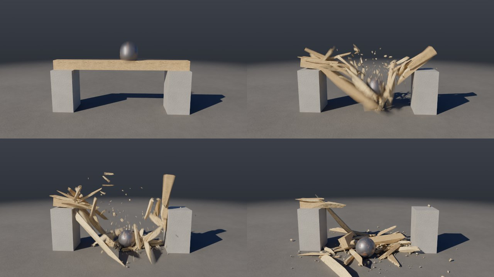
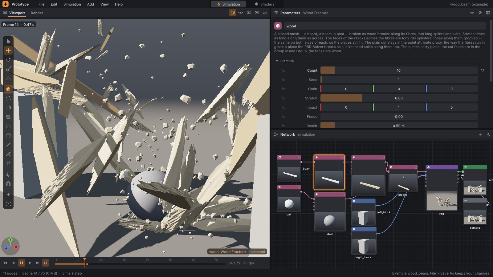
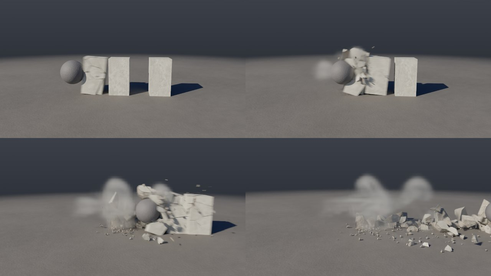
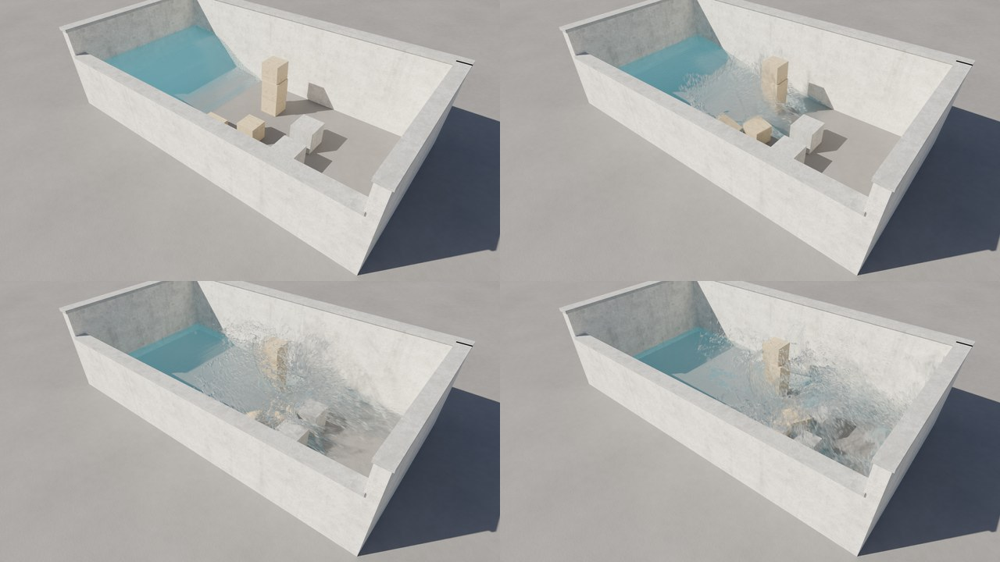

# Destruction: Voronoi, Concrete, Wood and Glass Fracture, brick walls, rigid bodies, glue and the constraint network, breaking during the simulation, rebar, glass, debris and dust, guided simulation

How something breaks in Prototype: a closed body is cut into pieces
(**Voronoi Fracture**, or **Concrete Fracture**, which breaks it like
concrete: uneven pieces, rough fractures, chipped corners, or **Wood Fracture**,
which splits it like wood into long splinters along the grain), the pieces get
mass and are glued together (**RBD
Solver** on top of the [Jolt Physics](https://github.com/jrouwe/JoltPhysics) library).
A piece can also break during the simulation: when something hits it harder than
its cross-section can bear, it cracks where the blow landed, and whatever hit it
flies on.
Steel reinforcement (**Rebar**) holds the pieces even where the glue has cracked: the bars
bend, pull out of small pieces and snap. Glass (**Glass Fracture**)
cracks the way glass cracks: rays from the point of impact and rings around it; until
the impact the pane stays whole and the renderer draws it transparent, with reflections
of the sky and the sun. A brick wall (**Brick Wall**) is laid brick by brick in a
bond, with mortar and plaster, and the wall then falls apart along the joints. The glue is
geometry too (**RBD Constraints**, a constraint network as in Houdini): a point per piece,
a line per bond. Weakened, deleted or newly drawn lines decide where the
thing breaks.
Charges tear the glue at a given time, impacts keep breaking it, falling floors
crush walls to dust, fragments shed debris, and the air pushed out by the collapse drives
a cloud of dust into the streets (**Pyro Solver**). Debris is particles: it flies out of fractures,
hits the pieces and comes to rest on them, and pieces that break off trail
dust behind them. The fall can also be directed: an animation of the pieces (say a keyframed Transform)
wired into the **Guide** input of the RBD Solver leads them where the shot wants them, and the pieces
keep colliding and breaking along the way. Everything is deterministic: the same network gives the same frames on one
thread and on four, and on every subsequent run.


```
./build/prototype --example demolition            # in the editor: Play
./build/prototype sim demolition odstrel.mp4      # 180 frames (6 s) as a video
./build/prototype sim demolition odstrel.png --frames 120
```

The **demolition** example ([examples/sim/demolition.pgsim](../examples/sim/demolition.pgsim))
is the demolition of a fourteen-storey tower block in a city block in golden light,
modeled on real demolitions:

- **The tower** is built by the wrangle `tower` from boxes: floor slabs, walls around
  the windows, columns, parapet and roof, each box with a `Cd` color and the attributes
  `floor` and `kind`. The wrangle `seeds` provides points for Voronoi Fracture — denser
  on the charged floors, so the tower crumbles more finely there.
- **The charges** are set by the wrangle `charges` as piece attributes: the ground-floor slab
  is the foundation (`active 0`), the columns and walls of the two lowest floors vanish in dust
  within the first second (`release 1`, `vanish 1`) and the rest gets
  an inward nudge (`kick`). Pieces from the third floor up have `crush`:
  under the falling floors they are crushed to dust.
- **RBD Solver**: concrete 2400 kg/m³, glue 150 kPa, dust from torn
  bonds, from impacts and from crushing, debris, `air 3`. The tower collapses within its footprint
  at about 13 m/s, and less than four seconds after detonation what remains is a pile about
  six meters high.
- **The city**: nineteen houses from the Building asset (different heights and colors) on
  pavements with curbs. The eight nearest are obstacles in the gas (Object
  box), so the dust flows through the streets and over the lower roofs; another row of houses
  behind them turns the block into a city all the way to the edge of the shot.
- **Dust**: a Pyro Solver over the whole block (90 × 48 × 90 m, 176 cells,
  sparse: only tiles containing dust are computed; `--resolution 576` gives
  103.5 million voxels and a 16 cm cell in 19 minutes, [pyro.md §8](pyro.md#8-performance-and-determinism)),
  the pieces are moving obstacles in it, the dust is heavier than air (`weight`)
  and Turbulence stirs it up; Volume Look colors it ochre with strong
  self-shadowing.
- **Image**: a low warm sun with long shadows from the houses and the pieces, gray
  ground without a grid, the camera above the block slowly pushes in.

```
[tower] ─┬─────────────────▶ [Voronoi Fracture] ─▶ [charges] ─Pieces─▶ [RBD Solver] ─Look───────────▶ [Output]
         └─▶ [seeds] ─Points─┘                                          │ Dust ─────▶ Sources ─┐         ▲   ▲
                                                                        │ Collider ─▶ Colliders ─┤         │   │
[Building]×19 ─▶ [Transform]×19 ─┐      [Object]×8 (houses) ─▶ Colliders ─┤                      │   │
[Box]×20 (kerbs) ─▶ [Color] ──────┴▶ [Merge city] (displayed) [Turbulence] ─▶ Forces ─▶ [Pyro Solver] ─▶ [Volume Look]
```

### Second example: debris at ground level


```
./build/prototype sim wall_collapse zed.mp4       # 120 frames (4 s)
```

The **wall_collapse** example ([examples/sim/wall_collapse.pgsim](../examples/sim/wall_collapse.pgsim))
is destruction up close, the way a camera just above the asphalt would film it:

- **The facade** of a brick house is built by the wrangle `facade`: a band of stone at each
  floor, piers between the windows, wall below and above the windows, a parapet. Voronoi
  Fracture cuts it into pieces the size of a few bricks.
- **The charges** go from the ground up, row by row: the foot of the wall flies out into the street
  and whatever stood above it follows — the less far, the higher it was — so
  the wall folds over and falls as a wave of pieces that roll towards the camera. Some of
  the lowest blocks are pulverised.
- **Dust** from fractures and impacts is driven down the street between the houses by the displaced air; the low
  sun behind the wall shines through it. The Output has the sky behind the scene turned on
  (`sky_behind`): haze brightest at the horizon and a glow around the sun.
- **The camera** is a few centimeters above the asphalt and slowly tracks sideways, with
  a wide lens.

---

## 1. Voronoi Fracture

The **Voronoi Fracture** node (Geometry) takes a closed polygon mesh and cuts
it into point cells: each cell is the part of the body that is closer to its point
than to any other. The points come either from the second input **Points**
(scatter, points from a wrangle, anything), or the node makes them itself: **Count**
points randomly inside the body, always the same ones for the same **Seed**.

| Parameter | Meaning |
|---|---|
| `count` | How many pieces when no points are connected: that many random points inside the body |
| `seed` | A different number, different points |
| `attribute` | Name of the attribute with the piece number (default `piece`), on primitives and points |
| `insidegroup` | Group of the cut-face primitives (default `inside`) |

How it computes it ([`src/pg/nodes/Fracture.cpp`](../src/pg/nodes/Fracture.cpp)):
the cell of point *s* is the intersection of the half-spaces "closer to *s* than to *t*" for all
other points *t*. The node therefore clips the body step by step with the plane halfway
between *s* and *t* (the [Clip](geometry.md) node with the cut closed), from the nearest
*t* to the farthest, and skips any plane that no longer cuts anything off — after
the first few cuts the piece is small and the remaining planes miss it. It closes each cut
with a cap, so the piece is closed just as the body was, and the pieces together
are exactly the original body (a test checks this on volume: the sum of the piece volumes
equals the body volume to 1e-4). The caps carry the attributes of the primitive
they came from and are in the `inside` group — the look colors it differently from
the surface. Cells are computed in parallel and assembled in point order, so the result
is the same on any number of threads.

A cell is not clipped from the whole body, though, only from what it can
affect ([`VoronoiCells`](../src/pg/nodes/Fracture.cpp)):

- **Only nearby parts of the body.** The node first computes the cell in a box around
  the body. That is only a few faces, so it costs nothing. Then it takes only those
  closed parts of the body (primitives that share points) that reach
  into the cell's box: for a tower made of thousands of boxes, a few floor slabs and walls.
- **Only nearby points.** It takes points from a grid shell by shell, nearest first.
  When the next point is farther than twice the reach of the piece, its plane
  cuts nothing off, and neither do the points beyond it.

The planes that affect a piece are the same and in the same order as before,
so the result is bit for bit the same as cutting the whole body with all the
points (a test checks this cell by cell). The tower in the demolition example (593 cells)
is cut in 0.14 s instead of 1.1 s, a tower of 5,628 cells in 1.0 s instead of 13.5 s
(four threads).

The node recognises points inside the body by the parity of ray intersections with the polygons
(Möller–Trumbore over fans), with the ray slightly off the axes so it does not run along
edges. Bodies with cavities and bodies made of several closed parts (a tower of boxes, a building
with balconies) work too — the caps have holes where the cut crosses them more than once (see
Clip).

---

## 2. Concrete Fracture

Voronoi Fracture cuts with planes: the pieces are clean convex polyhedra with
equally sized cells and straight fractures — up close it looks
cut, not broken. Concrete breaks differently: large chunks next to crumbs,
the smallest pieces where the blow landed, broken edges and corners, and fracture surfaces
rough and grainy. The **Concrete Fracture** node (Geometry) does this in four
steps ([`src/pg/nodes/Concrete.cpp`](../src/pg/nodes/Concrete.cpp)):

1. **Points.** `count` points inside the body (or points from the **Points** input),
   distributed unevenly: the point density is exp(4 · `uneven` · noise)
   times (1 + 15 · `focus` · Gaussian around `impact` with radius `reach`) —
   large chunks and rubble, finest around the point of impact. Points are drawn
   by rejection against the density, always the same way for the same `seed`.
2. **Cells.** The Voronoi cell of each point, just as in Voronoi
   Fracture (in parallel, assembled in point order).
3. **Rough fractures.** The cut faces are split into triangles at most
   `detail` long, and each of their points is displaced by `rough` · b(p), where b
   is a smooth 3D vector noise (three octaves of Perlin noise, each component
   squashed by `tanh` into ±1) with bumps `roughscale` apart. The displacement depends
   only on position, not on the normal (which has the opposite sign on the other side of the crack):
   both sides get the same noise at the same points and the triangulation
   is canonical (a fan from the lexicographically smallest point, edges split
   in half with the same choice of diagonal on both sides), so the pieces
   still fit together exactly — the joint matches to 3·10⁻⁶ m. Towards the outer
   surface the roughness fades out smoothly (smoothstep over a distance of 2 · `rough`),
   so nothing sticks out of the body and the outer faces stay as they were.
4. **Chipping.** A fraction `chips` of the cell corners (points where at least
   three faces meet) is cut off by a tilted plane at most
   `chipsize` deep: a flat chip, a separate piece glued on by its face
   (primitive attribute `chip` = 1). The cut goes through the rough piece, so the chip
   has rough fractures like the piece it chipped off. A cut that would take
   the center of the piece or a chip larger than three times `chipsize` is discarded.
   The cut's cap is split into the same triangles on the chip and on the piece
   (Clip splits caps the same way on both sides of the plane), so in the proxy — where
   the cap is not planar — they match and are glued over the whole face.

| Parameter | Meaning |
|---|---|
| `count`, `seed` | How many pieces before chipping when no points are connected; a different number, different pieces |
| `uneven` | How uneven the pieces are: 0 all roughly the same, 1 large chunks next to crumbs |
| `impact`, `focus`, `reach` | Where the blow landed, how many more pieces around it (0 none) and how far (m) |
| `chips`, `chipsize` | Fraction of broken-off corners and the maximum chip depth (m) |
| `rough`, `roughscale`, `detail` | How far the fractures go in and out (m, 0 straight cuts), how far apart the bumps are and the maximum length of the fracture triangles |
| `attribute`, `insidegroup` | Attribute with the piece number (`piece`) and the group of cut faces (`inside`) |

**Proxy for the simulation.** A rough piece has thousands of triangles and is not convex.
Each point therefore carries, in the point attribute `proxy`, where it was before
roughening — the straight cut beneath the rough one. RBD Solver simulates pieces with `proxy`
as their proxy has them: convex hulls from the straight cuts, mass from those, bonds where
the straight cuts touch face to face (adjacent faces in one plane are
merged first, so a bond is found even for a face split into triangles), and
draws them rough. Production does the same: a simulation proxy and render
geometry bound to it. Transform moves `proxy` too, RBD Pieces
discards it (pieces in motion are only rough). When drawing, the points of the cut
faces are separated from the outer faces, so normal smoothing (edges above 60°)
does not smear shallow cracks into the facade.

### Third example: a concrete wall and a wrecking ball


```
./build/prototype sim concrete_wall zed.mp4       # 90 frames (3 s)
```

The **concrete_wall** example ([examples/sim/concrete_wall.pgsim](../examples/sim/concrete_wall.pgsim)):
a 5 × 3 × 0.3 m wall on a concrete plinth, broken by Concrete Fracture into 90 pieces
(smallest around the point where the ball strikes) and 61 corner chips — 151 pieces,
380 thousand triangles, cooked in under a second. The plinth is a piece of its
own with `active 0`, and the bottom pieces of the wall are glued to it.
A keyframed ball flies through the wall from behind towards the camera; RBD Solver has `rings 2`,
so the impact releases only the pieces around the ball and two rings behind them: the ball
punches a hole, pieces and chips fly out and roll towards the camera, and the rest of the wall
stands. A steel mesh runs through the wall (the Rebar node: 12 mm bars at 20 cm in both
directions, a layer at each face — 84 bars): pieces around the hole stay
hanging on them, the bars between them show through the cracks, and the chunks the ball takes
with it snap the bars and fly off with their stubs. The dust from fractures and impacts
is carried by a Pyro Solver.

```
[wall] ─┬─▶ [Concrete Fracture] ─▶ [moving] ─┐
        │   [plinth] ─▶ [foundation] ────────┴▶ [Merge] ─Pieces──┐
        └─▶ [Rebar] ─Rebar───────────────────────────────────────┼▶ [RBD Solver] ─Look──────────────▶ [Output] ◀─ [Camera]
[ball] ─Collider─▶ Colliders ────────────────────────────────────┘   │ Dust ─▶ [Pyro Solver] ─▶ [Volume Look] ─┘
```

### Chunks and secondary fracturing: RBD Cluster

Real concrete does not crumble into small bits all at once: large chunks break off and
only fall apart when they themselves land hard. The **RBD Cluster** node (Geometry)
prepares this the way Houdini does: it groups the fine pieces from the fracture into `count`
chunks, and the glue inside a chunk is `strength` times stronger than between chunks
([`src/pg/nodes/Cluster.cpp`](../src/pg/nodes/Cluster.cpp)):

- **The center of a piece** is the centroid of its volume (from `proxy` if it has one; divergence
  over the face fans), for an open surface the average of its points.
- **Chunk centers**: the first at random, each next one far from those already chosen
  (k-means++), then moved eight times to the centroid of the pieces nearest
  to them, weighted by volume (Lloyd) — chunks of roughly equal size and more round
  than elongated. Always the same for the same `seed`.
- **Pieces** get the number of the chunk they are nearest to: the attribute `cluster`
  (on primitives and points, 1 and up in piece order, 0 for none) and `clusterglue`
  (`strength`).

For a bond between two pieces of the same chunk (`cluster` above 0 and equal), RBD Solver multiplies
the strength by the smaller of their `clusterglue` values. An impact therefore first breaks the bonds between
chunks — the thing falls apart into chunks — and a chunk is only broken by a blow that overcomes
its stronger glue as well: a fall from a height, a hit from another chunk. So chunks break
again in flight and on landing, even though the pieces were cut in advance.

| Parameter | Meaning |
|---|---|
| `count` | How many chunks (at most as many as there are pieces) |
| `seed` | A different number, different chunks |
| `strength` | How many times stronger the glue inside a chunk is than between chunks; 1 means no chunks |
| `attribute` | Attribute with the piece number (`piece`) |

### Reinforcement: Rebar

Concrete almost always contains steel. The bars hold the pieces together even where
the concrete has cracked: a cracked beam does not snap in two, it bends and hangs on them;
pieces around a hole in a wall stay hanging on the mesh. The **Rebar** node (Geometry)
lays bars into a block the way they are laid before the concrete is poured
([`src/pg/nodes/Rebar.cpp`](../src/pg/nodes/Rebar.cpp)):

- **The block** is a box around the input, oriented the way the input lies: perpendicular to its
  largest flat side (the faces that look in one direction have
  the most area together) and, in that side's plane, the rectangle that encloses the points
  most tightly (rotating calipers around their convex hull) — or along
  the world axes when such a box is just as small. It is computed from `proxy` if
  the input has it, so the input can be the block or its pieces after Concrete Fracture,
  rotated any way they like.
- **Mesh** (`layout mesh`, for a wall or slab — the thinnest side less than half
  the next one): bars in both directions at `spacing`, a layer at each face (`layers 2`)
  or one in the middle; the bars in one direction lie on the bars in the other, with
  `cover` from the face and beyond the bar ends.
- **Cage** (`layout cage`, for a beam or column): longitudinal bars around the perimeter
  of the cross-section — one in each corner, at most `spacing` apart — and around them
  stirrups at `spacing` along the member.
- **Output**: open polylines (a stirrup ends where it began) with the point
  attribute `width`, the bar diameter.

| Parameter | Meaning |
|---|---|
| `layout` | Auto (mesh for a wall or slab, otherwise a cage), Mesh, Cage |
| `spacing` | Maximum bar spacing — and stirrup spacing along a cage (m) |
| `cover` | Concrete cover over the bars and beyond their ends (m) |
| `diameter` | Bar diameter (m): 8 to 32 mm |
| `layers` | Mesh: 2 layers at the faces, 1 in the middle |
| `stirrup` | Stirrup diameter (m); 0 for none |

The output of Rebar goes into the **Rebar** input of RBD Solver. Reinforcement can be
any polyline with a `width` attribute (12 mm without it) — drawn,
from a wrangle, from another file —, just as with Houdini's *RBD Constraints From
Curves*. How the solver simulates the bars is described in [§3](#how-it-works).

### Fourth example: a beam over a block


```
./build/prototype sim concrete_drop tram.mp4      # 60 frames (2 s)
```

The **concrete_drop** example ([examples/sim/concrete_drop.pgsim](../examples/sim/concrete_drop.pgsim)):
a 3 × 0.4 × 0.4 m concrete beam falls from a crane above the shot (`v` in the wrangle
`falling`, six meters per second) crosswise onto a concrete block. Concrete
Fracture breaks it into 150 palm-sized pieces, RBD Cluster groups them
into fourteen chunks with glue thirty times stronger inside them (`glue 1000`,
`spread 0.3`), and Rebar lays a cage into it: eight longitudinal 12 mm bars and
sixteen 8 mm stirrups. The beam cracks on the block and is crushed there too, but
the reinforcement holds it together: it bends over the block and both halves hang down
on the bars — where the bend opened the most, the bars snapped and their stubs stick out
of the fracture; elsewhere they bent. Without reinforcement (disconnect Rebar) the beam snaps
in two, the halves fall to the sides and break into chunks on the ground. The dust
from fractures and impacts is carried by a Pyro Solver.

```
[beam] ─▶ [Concrete Fracture] ─▶ [RBD Cluster] ─▶ [Transform] ─┬─▶ [falling] ─Pieces─┐
                                                               └─▶ [Rebar] ─Rebar────┼▶ [RBD Solver] ─Look──▶ [Output]
[block] ─Collider─▶ Colliders ───────────────────────────────────────────────────────┘   │ Dust ─▶ [Pyro Solver] ─▶ [Volume Look]
```

### Glass: Glass Fracture

Glass does not break like concrete. Straight cracks run out from the point of impact
(**radial**) and arcs open between them around it (**concentric**):
a web, thin slivers in the middle, longer and wider shards farther from the center.
The **Glass Fracture** node (Geometry) breaks a pane exactly like this
([`src/pg/nodes/Glass.cpp`](../src/pg/nodes/Glass.cpp)):

- **The pane** is the input — a flat closed object of any outline — lying
  the way it lies: its box (the same as for Rebar, `fitBox`) has its thinnest
  direction across the pane, and the web lies in the plane of the other two, around `impact`
  projected onto the mid-plane of the pane.
- **Rays**: `radials` cracks from the point of impact at even angles, each
  rotated by at most `jitter` of the gap to the next one.
- **Rings**: a chord runs between two rays, the first `first` from the center,
  each next one `growth` times farther — in each sector separately, so the rings do not
  line up across the rays (as in real glass, where a concentric crack
  ends at a radial one). A sector whose chord is `split` times longer than the
  ring is deep branches: another ray runs outwards from a point on the chord.
  Beyond `rings` rings (or beyond the edge of the pane) the shards run all the way to the edge.
- **Shards**: each (convex) cell of the web cuts a piece out of the pane with
  the planes of its sides perpendicular to the pane, and closes it; the new faces are in
  the `insidegroup` group. Primitives carry `piece`, `glass` — 1 for the pane
  faces, 2 for the crack faces — and `Cd`, the glass color (`tint`). From `glass`
  the RBD Solver, the renderer and the export recognize that it is glass.

| Parameter | Meaning |
|---|---|
| `impact` | Where the pane is struck (projected onto its plane) |
| `radials` | Number of radial cracks (3–256) |
| `first` | Radius of the first ring (m) |
| `growth` | How many times farther each next ring is |
| `rings` | Number of rings; beyond the last one the shards run to the edge |
| `jitter` | Irregularity of the angles and radii (0–1) |
| `split` | A sector wider than `split` × ring depth branches; 0 never |
| `seed` | A different number, a different web |
| `tint` | Glass color (`Cd`): greenish like window glass |
| `attribute`, `insidegroup` | Piece attribute and the group of crack faces |

A 1.2 × 1.5 m pane with the default values gives about 250 shards in tenths
of a second; the same network gives the same shards on one thread and on four.

### Fifth example: a ball through a window


```
./build/prototype sim glass_window okno.mp4       # 150 frames, 120 per second
./build/prototype sim glass_window okno.png --every 1 && ffmpeg -r 30 -i okno_%04d.png zpomalene.mp4
```

The **glass_window** example ([examples/sim/glass_window.pgsim](../examples/sim/glass_window.pgsim)):
a ball flies out of a dark room through a window, in slow motion — the simulation runs at 120
frames per second, and playing the images back at thirty per second slows it down four
times. A 1.2 × 1.5 m pane, 8 mm thick, sits in a white frame (a piece
with `active 0` that the edge shards are glued to) in a wall made of objects.
Glass Fracture breaks it around the point where the ball strikes. The ball is keyframed and
unstoppable, and `rings 6` lets the impact reach six rings of shards:
it punches a hole, small slivers and glass debris fly out with it and sparkle in the
sun, and longer shards around the hole fall out and stay lying below the window.
Until the ball arrives, the pane is whole — no crack, just a reflection of the sky and
the ball behind the glass; at the moment of impact the whole web appears. Glass makes no dust,
only debris, so there is no Pyro Solver here.

```
[pane] ─▶ [Glass Fracture] ─▶ [moving] ─┐
[frame_*]×4 ─▶ [Merge] ─▶ [frame] ──────┴▶ [pieces] ─Pieces─▶ [RBD Solver] ─Look─▶ [Output] ◀─ [camera]
[wall_*]×4, [room_*]×4, [ball] ─Collider─▶ Colliders ─────────────┘
```

### Bricks: Brick Wall

A brick wall does not break like concrete. It cracks along the joints, because mortar is
weaker than brick: whole bricks and pieces of masonry fall out, the hole is stepped
along the courses, and a brick only breaks when an impact overcomes it. The **Brick
Wall** node (Geometry) lays a wall the way a bricklayer does: course by course in
a bond, each brick on a mortar bed with a joint at its end. Each brick
together with the mortar around it is one piece
([`src/pg/nodes/Bricks.cpp`](../src/pg/nodes/Bricks.cpp)):

- **The wall** is the input — a closed body of any outline, even made of several
  boxes that touch — and it stands the way the input stands. The axes are taken
  from the box around the input (`fitBox`): the height is the axis closest to vertical,
  the thickness the thinner of the remaining two, and the length the third. The face is the side towards
  `front`. There are as many courses as fit into the height (`height` +
  `joint`); the bed joints get a hair thinner or thicker so they fill the height
  exactly. Across, as many rows of stretchers (`width` + `joint`) are laid
  as fit into the thickness without the plaster.
- **The bond** (`bond`) determines where the bricks of adjacent courses overlap:
  - *Stretcher*: each course is offset half a brick from the one below.
  - *English*: a course of headers through the full thickness, then a course of
    stretchers offset by a quarter brick.
  - *Flemish* (also called Gothic): header and stretcher alternate in each
    course, and each header lies over the middle of a stretcher.
  - *Stack*: joint over joint.
  - *Auto*: stretcher for a wall one brick row thick, otherwise English.
- **Openings**: each course is laid along the segments where a line through the middle of the wall
  runs inside the input. At an opening the bricks are shortened and the reveal is straight. A bit
  shorter than half a brick width is added to the neighboring brick.
- **Bricks**: each one is a closed box including its mortar — the bed joint beneath
  it, the head joint at its end and the longitudinal joint behind it if there is
  another row behind it. Plus the plaster (`plaster`) on the wall face in front of it. Such a box
  is one piece:
  - `piece` carries its number;
  - `Cd` is the color of the brick (each a shade different, `variation`), the mortar or
    the plaster, depending on what is on the given face.

  Together the pieces give exactly the volume of the input.
- **Broken bricks** (`broken`): this fraction of the bricks that are at least
  half again as long as they are wide is cut across into two halves. Both
  halves form one chunk (`cluster`, `clusterglue` = `strength`).
  The glue therefore holds them `strength` times more firmly than the mortar. A hard impact
  breaks them, and the fracture faces have the color of the brick interior (lighter and warmer).

The glue (`glue`) of RBD Solver is the mortar. Each brick collides with one
convex hull, i.e. its box. Each brick takes its random numbers from
its place in the wall (course, segment, order within it, row), so changing one
brick — say one shortened at an opening — does not change the others.

| Parameter | Meaning |
|---|---|
| `bond` | Bond: Auto, Stretcher, English, Flemish, Stack |
| `length`, `width`, `height` | Brick dimensions (m): 250 × 120 × 65 mm |
| `joint` | Joint thickness (m): 10 mm |
| `front` | Direction the wall face looks |
| `plaster` | Plaster thickness (m); 0 means no plaster |
| `plastersides` | Plaster on both sides, only on the face (`front`), only on the back (`back`) |
| `color`, `variation` | Brick color and how much one brick differs from another (0–1) |
| `mortar`, `plastercolor` | Mortar and plaster color |
| `broken` | Fraction of bricks cut into two halves (0–1) |
| `strength` | How many times more firmly the halves hold than the mortar |
| `seed` | A different number, different shades and different broken bricks |
| `attribute` | Attribute with the piece number (`piece`) |

A 5.2 × 3 m wall with a window (example below) gives 1689 pieces: 1496 bricks, of which
193 are broken into halves. That is 77 thousand triangles in hundredths of a
second. The same network gives the same wall on every cook and on any
number of threads.

### Sixth example: a wrecking ball and a brick wall


```
./build/prototype sim brick_wall zed.mp4          # 90 frames (3 s)
```

The **brick_wall** example ([examples/sim/brick_wall.pgsim](../examples/sim/brick_wall.pgsim))
is the outer wall of a house: 5.2 × 3 m, one brick thick (two rows of stretchers)
in English bond, plastered on the inside. It stands on a concrete plinth that
does not move (`active 0`). In the wall is a 1.3 × 1.2 m window with a white frame and
a glass pane (Glass Fracture, 238 shards). The input is four boxes around
the window, and Brick Wall lays a wall with a straight reveal from them.

A keyframed ball 1.1 m in diameter swings from behind through the wall towards the camera.
The glue is only the mortar (`glue 150`, i.e. 150 kPa), so the wall cracks along the
joints. The result:

- the hole is stepped along the courses;
- whole bricks fly and roll, some break in two (the halves are held by
  `strength 8`), and pieces of masonry still held by the mortar hang at the edge of the hole;
- `rings 4` lets the impact reach only four rings of bricks around the ball, so
  the window next to the hole stays whole, glass included;
- the dust from the mortar and bricks is carried by a Pyro Solver.

```
[wall_*]×4 ─▶ [Merge] ─▶ [Brick Wall] ─▶ [moving] ─┐
[pane] ─▶ [Glass Fracture] ─▶ [glass_pieces] ─────┤
[frame_*]×4 ─▶ [Merge] ─▶ [frame] ────────────────┤
[plinth] ─▶ [foundation] ─────────────────────────┴▶ [pieces] ─Pieces─▶ [RBD Solver] ─Look──────────────▶ [Output] ◀─ [camera]
[ball] ─Collider─▶ Colliders ─────────────────────────────────────────────┘  │ Dust ─▶ [Pyro Solver] ─▶ [Volume Look] ─┘
```

### Seventh example: blasting a reinforced concrete column


```
./build/prototype sim concrete_column sloup.mp4   # 90 frames (3 s)
```

The **concrete_column** example ([examples/sim/concrete_column.pgsim](../examples/sim/concrete_column.pgsim))
is a 0.4 × 0.4 × 3 m reinforced concrete column in a concrete frame. It stands on
a floor slab and carries a beam; the slab and the beam are pieces that do not move.

- **Pieces**: Concrete Fracture breaks the column into 170 pieces, smallest around
  the charge, and 131 corner chips.
- **Reinforcement**: Rebar lays a cage into the column, eight 20 mm bars around the perimeter
  and 21 stirrups of 10 mm at 15 cm.
- **The charge**: the wrangle `charge` detonates it at 0.6 s. Concrete within 35 cm of it
  is released (`release`): 85 % of it vanishes in dust (`vanish`) and the rest
  flies off to the sides (`kick`).
- **What remains**: the bars hold what the glue no longer holds (`glue 1000`,
  `rings 2`). The upper part of the column hangs from the beam and stands on the cage, pieces of
  concrete hang on the bars, and where the charge was, the cage is bare. Of the concrete only the
  steel remains — that is what a real column looks like after blasting. The dust is carried by a Pyro Solver.

```
[column] ─┬─▶ [Concrete Fracture] ─▶ [charge] ─┐
          │   [floor] ─▶ [floor_piece] ────────┤
          │   [beam] ─▶ [beam_piece] ──────────┴▶ [pieces] ─Pieces─┐
          └─▶ [Rebar] ─Rebar───────────────────────────────────────┼▶ [RBD Solver] ─Look──────────────▶ [Output] ◀─ [camera]
[column_left], [column_right] ─Collider─▶ Colliders ───────────────┘   │ Dust ─▶ [Pyro Solver] ─▶ [Volume Look] ─┘
```

For comparison, the **concrete_wall** example has a reinforced concrete wall: a mesh
of bars instead of a cage and a ball instead of a charge.

### Wood: Wood Fracture

Wood does not break like concrete. The fibers hold together far more firmly along their length than
across it, so a beam cracks into long splinters and laths, and the ends of the breaks are
frayed. The **Wood Fracture** node (Geometry,
[`src/pg/nodes/Wood.cpp`](../src/pg/nodes/Wood.cpp)) does this in three
steps:

1. **Grain.** The grain direction is `grain`. When it is zero, the longest
   side of the box around the body (`fitBox`) is used: a beam, a plank and a column have
   the grain along their length.
2. **Cells along the grain.** `count` points inside the body (or points from the
   **Points** input), denser around `impact` according to `focus` and `reach`.
   The Voronoi cells are computed in a space compressed along the grain
   `stretch` times (default 6, `grainCells`). A cell is thus that many times longer
   along the grain than across it: the beam falls apart into long splinters, not into
   cubes. The compression is linear, so the cells stay convex and give
   good convex hulls.
3. **Frayed fractures** (`roughenCuts`,
   [`src/pg/nodes/Rough.cpp`](../src/pg/nodes/Rough.cpp), shared
   with Concrete Fracture). The cut faces are split into triangles,
   eight times longer along the grain than across it. A face across the grain is torn
   into splinters: each point is displaced along the grain by `splinter` · tanh(2.5 · n),
   where n is a noise that varies only across the grain, with a grain size of
   `splintersize`. These are bundles of fibers torn off at different lengths. A face
   along the grain gets only grooves `rough` deep, `roughscale` apart
   across the grain and eight times farther apart along it. The two blend smoothly
   depending on how much the face points along the grain. The displacement depends only on
   position, so both sides of a crack still fit together. Towards the outer
   surface it fades out, so nothing sticks out of the body.

As with Concrete Fracture, the straight cut is kept in the point attribute `proxy`:
the solver simulates the pieces as convex hulls of the straight cells and draws them
frayed. The pieces carry `piece`, and the points carry the grain direction `grain`; the piece
splits along it even when RBD Solver breaks it during the simulation
([§3](#breaking-during-the-simulation)). The cut faces are in the `inside` group, and faces
that have no other material get `material` "wood" (Cycles puts
wood on them).

| Parameter | Meaning |
|---|---|
| `count`, `seed` | How many pieces when no points are connected; a different number, different pieces |
| `grain` | Which way the grain runs; zero: the longest side of the body |
| `stretch` | How many times longer the pieces are along the grain than across it: 1 like Voronoi Fracture |
| `impact`, `focus`, `reach` | Where the blow landed, how many more pieces around it (0 none) and how far (m across the grain, `stretch` times farther along it) |
| `splinter`, `splintersize` | How far the splinters stick out of a face across the grain (m, 0 straight) and how wide one splinter is |
| `rough`, `roughscale`, `detail` | Depth and spacing of the grooves along the grain and the longest fracture triangle |
| `attribute`, `insidegroup` | Attribute with the piece number (`piece`) and the group of cut faces (`inside`) |

A 3 × 0.2 × 0.25 m beam split into 14 pieces has 79 thousand triangles
and cooks in 0.07 s. The pieces are about a meter long and 10 to 20 cm
wide.

### Thirteenth example: a ball through a beam



```
./build/prototype sim wood_beam tram.mp4          # 75 frames (2.5 s)
./build/prototype sim wood_beam tram.png --frames 16 --renderer cycles
```

The **wood_beam** example ([examples/sim/wood_beam.pgsim](../examples/sim/wood_beam.pgsim))
is a 3.2 × 0.22 × 0.24 m wooden beam laid across two blocks, and onto it
falls a steel ball with a 22 cm radius (338 kg):

- **The beam** is split by Wood Fracture into 10 long splinters with splintered
  ends (`splinter 0.06`). RBD Solver glues them with 250 kPa glue,
  and the wrangle `moving` gives them the density of wood (600 kg/m³) and `fracture 1`.
- **The ball** lands at 9.5 m/s. It tears all 24 bonds, and the three
  splinters it hits break along the grain (`fracture 300`,
  `fracture_pieces 6`, doubled for such a hard blow). That makes 36 fragments
  with frayed ends. The ball passes through them at 8.9 m/s.
- **The beam** snaps, the ends fly off the blocks like levers, and the splinters
  pile up under the ball. The fragments do not break any further (`fracture_depth 1`).

```
[beam] ─▶ [Wood Fracture] ─▶ [moving] ─┐
[ball] ─▶ [steel] ─────────────────────┴▶ [pieces] ─Pieces─▶ [RBD Solver] ─Look─▶ [Output] ◀─ [camera]
[left_block], [right_block] ─Collider─▶ Colliders ──────────┘
```

In the editor, at frame 14 the beam is shattered around the ball; the Wood
Fracture parameters show the grain (`grain` 0: along the beam) and `stretch`:



---

## 3. RBD Solver

The **RBD Solver** node (Simulation) turns pieces into rigid bodies. The **Pieces** input
is geometry with a `piece` attribute (Voronoi Fracture; without the attribute each
connected part is a piece), **Colliders** are objects the pieces collide with —
static and keyframed, **Rebar** are steel bars in the pieces (the Rebar node,
or any polylines with `width`) and **Constraints** is a constraint network
(RBD Constraints, edited): its lines are the bonds, instead of the ones the
solver finds where pieces touch ([below](#constraint-network-rbd-constraints)).
**Guide** is the pieces as they should move: the same points in the same
order, moved and rotated (a keyframed Transform, a wrangle with `@Time`);
the solver leads the pieces to them ([below](#guided-simulation-guide)).
Outputs:

| Output | Type | Where to |
|---|---|---|
| **Look** | Look | Into the Output: the solver is simulated and the pieces are drawn where they landed |
| **Rigid** | Rigid | Into the **RBD Pieces** node: the pieces back as geometry |
| **Collider** | Collider | Into Colliders of a Liquid Solver, Pyro Solver or Rain: water, gas and rain go around the pieces where they currently are |
| **Dust** | Source | Into Sources of a Pyro Solver: dust from torn bonds, from impacts and from crushing |

Parameters:

| Section | Parameter | Meaning |
|---|---|---|
| Pieces | `attribute` | What says which piece a primitive belongs to |
| Physics | `density` | kg/m³: 2400 concrete, 700 wood, 7800 steel; a piece's mass is density times the volume of its hull |
| | `friction`, `bounce` | Friction and bounce on impact (0 a thud, 1 a rubber ball) |
| | `gravity` | m/s², downwards |
| | `floor` | Floor at zero; without it the pieces keep falling |
| Glue | `glue` | Glue strength in kPa (kilonewtons per square meter of bond area); 0 means no glue |
| | `spread` | How much of an impact passes through a bond to the pieces beyond it: 0.5 half (default) — a hard impact breaks the glue far around; 0 nothing, only the pieces that were hit are released. In Houdini *Propagate Rate* |
| | `rings` | How many rings of pieces around those hit an impact can release, however strong it is: 1 the neighbors, 2 the neighbors' neighbors too; 0 (default) as far as `spread` carries it. In Houdini *Propagate Iterations* |
| Breaking | `fracture` | kPa: how strong an impact one square meter of a piece's cross-section can bear before the piece itself breaks — where the blow landed, into fragments, smallest around it; wood (Wood Fracture pieces with `grain`) into long splinters along the grain ([below](#breaking-during-the-simulation)). 0 (default): pieces do not break, only the glue cracks. A 0.8 m long concrete block dropped from 3 m breaks at 200 |
| | `fracture_pieces` | How many fragments a piece breaks into; for a blow four times stronger than the piece can bear, up to double |
| | `fracture_depth` | How many times it can break: 1 only the pieces as they came, 2 (default) their fragments too |
| | `fracture_min_size` | m: a smaller piece (diagonal of its bounding box) does not break |
| | `fracture_rough` | m: how far the fractures of new cracks go in and out; 0 straight cuts. Wood has splinters five times longer instead of bumps |
| Rebar | `rebar_strength` | MPa, when the bar steel yields: 500 for modern bars. A 12 mm bar carries about 57 kN in tension; once bent it stays bent |
| | `bond` | MPa, how firmly the concrete grips the bar along its surface: a piece the bar passes through for 20 cm holds it with about 38 kN. The pieces on one side of a crack anchor the bar together; where they hold less than the steel — near the end of the bar or a snapped one — the bar pulls out of them and the concrete falls off it, elsewhere the steel yields. 0: the bars hold nothing |
| | `stretch` | How much a bar stretches before it snaps, as a fraction of what yields: 0.1 a tenth — of the bare bar between two pieces and of twenty times the diameter |
| Guide | `guide_strength` | How strongly the Guide leads the pieces: 1 exactly where it wants them at every step; less is a softer pull that lags behind it; 0 not at all. The pieces keep colliding meanwhile. Keyframed down to zero, it hands the pieces over to the simulation gradually |
| | `guide_until` | Seconds after which the Guide no longer leads anything and the pieces go their own way; 0 (default) always |
| | `guide_reach` | Meters a body may drift from where the Guide wants it (the ground or whatever it hit stopped it) before it goes its own way; 0 (default) any distance |
| | `guide_let_go` | A piece whose bond cracks goes its own way: whatever the Guide knocks down falls apart freely where it lands (on by default) |
| Time | `substeps` | Solver steps per frame: more for fast pieces and tall structures |
| | `rest` | **Freeze at Rest** (on by default): a body that has not moved anywhere for half a second and lies on the floor or on something that does not move freezes. It is static and costs nothing until something hits it faster than 1 m/s, water or gas pushes it, a charge detonates in it or a keyframed object reaches it. Whatever lies on it wakes up with it. Piles of rubble then step much faster ([below](#how-it-works)). Off: every body is stepped until the end (in Houdini *Allow Deactivation* off) |
| Dust | `dust` | How much dust a torn bond gives |
| | `impact_dust` | … a hard impact and a crushed piece |
| | `dust_size` | How big a puff is (m) |
| | `debris` | How much debris fractures and impacts shed; debris is particles that hit the pieces and stay lying on them ([below](#debris-as-particles)); 0 none |
| | `trail` | Dust behind pieces that break off: for the first second and a half, a piece flying faster than 2.5 m/s leaves a trail of dust — the more, the bigger and faster it is; 0 (default) none |
| | `air` | How much air the pieces push out when they are crushed and collide: it expands the puffs and drives dust along the ground; 1 as much as they would push out, 0 none |
| Look | `color`, `inside_color`, `inside_group` | Color of pieces without their own `Cd`, color of the cut faces and their group |
| | `rebar_color` | Bar color: rusty steel |

Piece attributes (on primitives, otherwise on points; a body takes the attributes of its
first primitive) say how a piece differs:

| Attribute | Type | Meaning |
|---|---|---|
| `density` | f | kg/m³ instead of the solver density |
| `v`, `w` | v | Velocity and spin (rad/s) it starts with |
| `active` | i | 0: does not move — a foundation; it is glued and stands in the way |
| `glue` | f | The piece's bonds are this many times stronger (the weaker of the two applies); 0: none |
| `release` | f | Seconds, greater than 0: at that time its bonds tear — a charge detonates |
| `kick` | v | … and this velocity is added to it |
| `vanish` | i | 1: on detonation it vanishes, blown into dust and debris, the way a charge pulverises a column |
| `crush` | f | An impact more than this many times stronger than what its glue holds crushes it to dust: walls a floor lands on. 0: never |
| `cluster` | i | The chunk the piece belongs to (RBD Cluster); 0: none |
| `clusterglue` | f | Bonds between pieces of the same chunk are this many times stronger (the smaller of the two applies) |
| `guide` | f | How much the Guide leads it, 0 to 1 (1 without the attribute); 0: not at all |
| `fracture` | f | The piece bears a blow this many times stronger before it breaks (the solver's `fracture`; 1 without the attribute); 0: never breaks |
| `grain` | v | On points: which way the wood grain runs (Wood Fracture). A piece with it breaks into splinters along it |

As in Houdini, Merge fills an attribute that one geometry lacks with zero:
`active`, `glue`, `fracture`, `density` and `Cd` therefore need to be set
on all pieces, not just some of them.

### Breaking during the simulation

Pieces from Voronoi, Concrete or Wood Fracture are cut in advance: the thing only
falls apart where the cuts already are. With `fracture` above zero, a piece also breaks
during the simulation, and it does so where the blow landed. A whole concrete block splits
at the point where a ball hits it, a wooden splinter along the grain. Houdini has
RBD Material Fracture with constraints for this, or Bullet with dynamic fracturing.

**When.** After each Jolt step, each piece has the hardest impact that hit it
during the step, and the place where it landed. The impact force is the impulse per substep:
the greater of what Jolt's contact reports and how much the impact changed
the body's momentum (divided among the places where something hit it). It is
the same force that breaks the glue. A piece bears it up to `fracture` (kPa) ·
`f@fracture` · V^(2/3), where V^(2/3) is the area of its cross-section. Only
pieces that are moving break, that are not glass, have no rebar running through them, are not smaller
than `fracture_min_size` and have not already broken `fracture_depth` times.

**How.** The piece is cut into `fracture_pieces` fragments. For a blow *h* times
stronger than it can bear, there are `fracture_pieces` · √*h* of them, at most twice
as many. Half of the cell points lie around the point of impact (within a quarter of the piece
size), the rest anywhere in the piece, so the fragments are smallest around the impact. A piece
of wood (with `grain` on its points) is cut as in Wood Fracture: in a space
compressed six times along the grain, with the points around the impact stretched along it.
The fractures are rough as with Concrete Fracture (`fracture_rough`; faces
from concrete are `broken_concrete`), frayed into splinters for wood. The cut
faces go into the `inside_group` group, so the solver draws them in the fracture
color. Bits smaller than a ten-thousandth of the piece (and always those under 0.2 cm³) are
discarded; debris replaces them. The piece then becomes `vanished`, and the fragments are new bodies after the existing
ones. Each fragment flies the way the piece was moving at its location (velocity
and spin). For a blow more than once as strong as the piece can bear, they also
scatter away from the point of impact, at most 1 m/s (from three times). The piece's bonds
cracked; dust rises from the point of impact and debris flies out.

**Whatever hit it goes on.** In the step, Jolt stops whatever hit the piece
against the whole piece, as if it had held. But the piece bore only *1/h* of that blow.
The body that hit the broken piece therefore gets back its
velocity from before the step, reduced only by the fraction *1/h* of what the step took from it.
A ball thus passes through a beam (in the test a steel block passes through a beam at
4.5 m/s, 2.1 m/s without this) and drives fast into the pile of fragments below it.

**Determinism and the cache.** A break is an event: the body, the point of impact in its
rest position, the seed, the number of fragments and the time (`RigidShatter`). The seed is
a hash of the body number, the break count and the frame. The fragments are a pure function of the pieces
in the input and the list of breaks (`shatterPiece`, `rigidBroken`), the same on
any number of threads. A frame therefore carries only the list of breaks (in the cache since
format 16, [cache.md](cache.md)). Whoever reads the frame (playback from the cache,
RBD Pieces, USD) makes the fragments from it again, bit for bit identical, and for a
sequence only once: each next frame continues from the breaks of the
previous one. In USD the fragments are extra bodies, invisible until the break frame
([usd.md](usd.md)). Space in Jolt is reserved for fragments at the start,
at most 2,048 fragments per simulation. Python returns the breaks as
`frame.rigid.shatters`.

### Fourteenth example: a ball through blocks



```
./build/prototype sim shatter_blocks kvadry.mp4   # 75 frames (2.5 s)
```

The **shatter_blocks** example ([examples/sim/shatter_blocks.pgsim](../examples/sim/shatter_blocks.pgsim)):
three 0.5 × 0.9 × 0.5 m concrete blocks stand in a row, whole, uncut.
A keyframed ball 60 cm in diameter goes through them at 4.7 m/s
(`fracture 450`, `fracture_pieces 12`). The first block breaks at 0.47 s
into 17 fragments, smallest where the ball struck, and the ball, traveling
on, breaks its large fragments again (`fracture_min_size 0.15`). The fragments
hit the second block, that one hits the third, and at 0.73 s both break. By
2.5 s there are ten breaks and 140 fragments with rough fractures, with dust in a Pyro
Solver and debris.

```
[block_a], [block_b], [block_c] ─▶ [blocks] ─▶ [concrete] ─Pieces─▶ [RBD Solver] ─Look──────────────────▶ [Output] ◀─ [camera]
[ball] ─Collider─▶ Colliders ────────────────────────────────────┘  │ Dust ─▶ [Pyro Solver] ─▶ [dust_look] ─┘
                                                     [swirl] ─Forces─┘
```

### Constraint network: RBD Constraints

The glue between pieces can be seen and edited as ordinary geometry. Houdini
calls this a *constraint network*. The **RBD Constraints** node (Geometry)
makes it from the pieces exactly the way the solver would find the glue
([`rigidGlue`, `rigidNetwork` in `Rigid.cpp`](../src/pg/sim/Rigid.cpp)):

- **A point** for each body, at the center of its box (from `proxy` if it has
  one). It carries `piece`, the piece number (the value of the piece attribute, or without it the
  piece's index). A piece made of several bodies whose parts do not touch has a point for
  each, plus `part` (0, 1, … in body order).
- **A line** for each bond, i.e. for each two bodies that touch
  face to face. It runs from the point of one body to the point of the other and carries:
  - `strength` — strength as a multiple of the solver's `glue`: 1 holds like Glue,
    0.1 at a tenth, 0 not at all. It is computed from the piece attributes: the weaker `glue` of the
    two, inside a chunk times the smaller `clusterglue`;
  - `area` — the bond area in m²;
  - `Cd` — green holds like Glue, yellow weaker (a sixteenth and less
    fully yellow), blue stronger, gray holds nothing.

A bond bears Glue × `area` × `strength` newtons. The network can be edited with ordinary
nodes and then wired into the **Constraints** input of RBD Solver — its lines then become
the bonds:

```
f@strength *= 0.1;                        // Primitive Wrangle: a tenth everywhere
if (@P.y > 2) f@strength = 0;             // nothing above two metres (@P is the line's centre)
if (@P.x > 0) removeprim(0, @primnum, 0); // no bonds on the right
int a = addpoint(0, {0, 2, 0});           // Detail Wrangle: a bond where nothing touches
int b = addpoint(0, {0, 1.6, 0});
setpointattrib(0, "piece", a, 1);
setpointattrib(0, "piece", b, 2);
addprim(0, "polyline", a, b);
```

The solver takes each primitive of the network as a bond from the body of its first point
to the body of its last. The body is determined by the point's `piece` (and `part`), and where the points
have no `piece`, by the nearest body center. If `strength` is missing, it is 1.
If `area` is missing (or is 0, as Merge fills it in), the area over which
the bodies touch is used, and where they do not touch, 0.01 m² (a square a palm wide).
A line whose ends are not two pieces from Pieces is skipped and the compilation
reports it. Two lines between the same pieces are two bonds that must both crack.
Pieces connected by a line are glued into one body even if they do not touch.

**RBD Pieces** with `output` *Constraints* returns the network for the given frame, as
the solver took it:

- the points move with the bodies and have a velocity `v`;
- each bond that held has `broken` 1 if it cracked, and `time`,
  the second when that happened (−1 for bonds that hold);
- `at` is the place where the faces touched, moved with the first body;
- torn bonds are red;
- bonds that never held (Glue 0, both pieces static, `strength` 0)
  are not in the output.

The network can thus be used for debugging — where the crack ran — and as a source of
effects at the places and times where bonds cracked. What happened to which
bond is carried by the frames and the cache (version 8). In Python it is returned by
`frame.rigid.network()`, `joint_state` (0 holds, 1 cracked, 2 never
held) and `joint_time`.

| Parameter | Meaning |
|---|---|
| `attribute` | What says which piece a primitive belongs to — as with RBD Solver |

### Eighth example: a crack where the shot wants it


```
./build/prototype sim constraint_network trhlina.mp4   # 90 frames (3 s)
```

The **constraint_network** example ([examples/sim/constraint_network.pgsim](../examples/sim/constraint_network.pgsim))
is a 5 × 3 × 0.3 m concrete wall on a plinth, broken by Concrete Fracture into 140
pieces and 75 corner chips. RBD Constraints makes a constraint network from them (216 points,
795 lines). The wrangle `crack` takes 98 % of the strength away from the 75 bonds across a line from the bottom-left to the
top-right corner (`weaken 0.02`) and colors them yellow;
a bond lies across the line when its ends are on opposite sides. The network goes
into Constraints of RBD Solver (`glue 1000`, `spread 0.35`).

A keyframed ball hits the top-left corner from behind. It breaks out the corner above the line,
the wall cracks exactly along the line all the way to the opposite corner, and the part above
the crack stays lying there on the fracture. The rest, glued as firmly
as before, stands. Without the network (disconnect Constraints) the ball breaks the wall around
the point where it hit, and the crack runs elsewhere. The `joints` node (RBD Pieces,
*Constraints*) returns the network for each frame: when you display it, you see
the bonds crack.

```
[wall] ─▶ [Concrete Fracture] ─▶ [moving] ─┐
[plinth] ─▶ [foundation] ──────────────────┴▶ [pieces] ─┬─────────────────Pieces─┐
                                  [RBD Constraints] ◀───┘                        │
                                          └─▶ [crack] ─Constraints───────────────┤
[ball] ─Collider─▶ Colliders ────────────────────────────────────────────────────┴▶ [RBD Solver] ─Look─▶ [Output] ◀─ [camera]
                                                                                     │ Rigid ─▶ [joints]
                                                                                     │ Dust ─▶ [Pyro Solver] ─▶ [Volume Look]
```

### Debris as particles

Debris is small stones (slivers for glass) that RBD Solver simulates as
particles alongside the pieces. In Houdini this is *debris*: Debris Source and a POP Solver
over the RBD pieces. Each bit has a position, velocity, size, id and
orientation ([`moveGrit`, `throwFromFace` in `Rigid.cpp`](../src/pg/sim/Rigid.cpp)):

- **Where from.** From a fracture: when a bond cracks, bits fly out from the edge of the face
  by which the pieces held together. They fly in its plane and slightly across it, at the speed
  at which the pieces separate. How many there are is given by the bond area (2 to 10
  per `debris`). More are added by impacts (the harder, the more), crushing and
  a charge that blows a piece apart.
- **Flight.** A bit falls, the air slows it down and it spins. Small ones slow down more than
  large ones: the drag is that of a 2400 kg/m³ stone, a deceleration of 1.5·10⁻⁴ *v*²/*r*,
  three times that for glass.
- **Collisions.** While a bit is inside the pieces it flew out of, it passes through
  whatever moves; it collides with whatever stands still (pieces with `active 0`, the floor)
  immediately, so it does not fall through stairs or a foundation. From a fracture at a static piece
  it flies out on the side that moves. Outside, it collides with pieces, obstacles and
  the floor (a ray in Jolt each step). It bounces with a quarter of its velocity
  perpendicular to the surface and keeps half its velocity along it, takes on the motion
  of what it hit, and starts spinning. Where it lands slower than 0.35 m/s
  on a surface facing upwards, it stays lying there: on a step, on a ledge, on
  a piece.
- **Riding.** If a bit lies on something that moves (a piece, a keyframed
  obstacle), it moves with it and rotates with it. When that speeds up faster than
  1 m/s, tilts by more than 60° or vanishes, the bit lets go and flies on by itself.
- **Dust trails** (`trail`). A piece that broke off less than a second and a
  half ago and flies faster than 2.5 m/s leaves dust behind it. The bigger
  and faster it is, the more, and the longer it flies, the less. At most
  32 pieces per step, the strongest ones.

Debris is carried by the frames, the cache (orientation since version 9), **RBD Pieces** with
`grit` turned on (points with `pscale`, `v`, `id` and `orient`), Python (`grit`,
`grit_velocities`, `grit_ids`, `grit_orient`) and USD (a PointInstancer
with stones of the same shapes the renderers draw, oriented like the debris).
`orient` is a unit quaternion x, y, z, w as in Houdini: **Copy to
Points** orients a stone copied onto the debris points exactly the way the debris
spins (`orient` takes precedence over the normal). There are at most 40,000 bits of debris, and they
slow the simulation down only a little (about 1 % in the demolition example).

**Debris as grains.** The Rigid output wired into the **Grit** input of a Grain Solver
hands each bit of stone over to the grains as soon as it is out of the piece it
flew out of. From that step on it is a grain: it collides with the other grains and with the pieces, pushes
the pieces, and where more of it falls in one place, it piles up — on the rubble and around
it. Glass shards stay debris
of the RBD Solver. The **shatter_grit** example is `shatter_blocks` done this way
with a Grain Solver ([grains.md](grains.md#concrete-grit-as-grains)).

### Ninth example: a column down the stairs


```
./build/prototype sim debris_stairs schody.mp4   # 110 frames (3.7 s)
```

The **debris_stairs** example ([examples/sim/debris_stairs.pgsim](../examples/sim/debris_stairs.pgsim))
is a 0.9 × 3.6 × 0.9 m concrete column on a stair landing:

- **The stairs** are built by the Detail Wrangle `stairs`: seven steps, each 18 cm
  high and 30 cm deep (Steps, Rise, Run and Width below the snippet), each
  as a box from the ground. The wrangle `stone` turns them into pieces that do not move
  and are not glued to the column (`glue 0`).
- **The column** is broken by Concrete Fracture into 110 pieces. The wrangle `charge`
  sets its `glue` to 1 (Merge would otherwise fill it with zero because of the stairs) and
  a charge at the foot on the stair side. At 0.4 s it tears the bonds, blows 60 % of the pieces
  apart and throws the rest down the stairs. The column, now standing only on the
  back part of its foot, topples down the stairs, lands on them and breaks
  apart.
- **Debris** from the charge and from the fractures bounces down the stairs and stays lying on the steps.
  Dust trails behind the thrown pieces (`trail 1.5`), and a Pyro Solver over
  the staircase turns it into a cloud.

RBD Pieces with `grit` turned on can be connected to the Rigid output: the debris then
comes out as points with `orient`, and Copy to Points copies stones onto them.

```
[stairs] ─▶ [stone] ──────────────────────────┐
[column] ─▶ [Concrete Fracture] ─▶ [charge] ──┴▶ [pieces] ─Pieces─▶ [RBD Solver] ─Look─▶ [Output] ◀─ [camera]
                                                                     │ Dust, Collider ─▶ [Pyro Solver] ◀─Forces─ [Turbulence]
                                                                                          └─▶ [Volume Look] ─Look─▶ [Output]
```

### Guided simulation: Guide

A shot often wants a thing to fall exactly the way it was drawn: a chimney between
two houses, a wall onto a car, a tower to the side where there is room. A pure simulation
hits that only by chance. The **Guide** input of RBD Solver is an animation of the pieces, and the solver
leads the pieces after it. In Houdini this is a guided RBD simulation: the animated
geometry is the target and the bodies follow it until physics lets them go
([`steer`, `letGo`, `rigidGuide` in `Rigid.cpp`](../src/pg/sim/Rigid.cpp)).

- **What the Guide is.** The pieces from Pieces, only moved and rotated: the same points in the
  same order. Most often it is a keyframed Transform after the pieces (its
  **Pivot** rotates around a given point, say around the edge of the notch), a wrangle
  that moves the points by `@Time`, or anything else that keeps the number and order
  of points. When the Guide has a different number of points, the compilation reports it and
  nothing leads the pieces. If the Guide changes over time, it is cooked on every frame. The solver
  keeps only the pose of each piece from it, though (a few bytes per piece and frame),
  not the whole geometry.
- **How it leads.** Glued pieces are one body. At each step the solver
  finds where the Guide wants it at the end of the step: the rigid-body pose that
  best places its points on the Guide's points. It then sets the body's velocity and spin
  so that the step gets it there. With `guide_strength` 1 it gets all the way there,
  with less only part of the way, so it lags behind the Guide as if on a spring.
  The solver cancels gravity to the extent that it leads the pieces. The pieces do not stop
  colliding: when the Guide sends them into a house, they stop against the house.
- **When it lets go.** A piece goes its own way when `guide_until` has passed, when its
  bond cracks (with `guide_let_go` on: whatever breaks off falls by itself, and the thing
  falls apart freely on landing) or when the body drifts from the Guide by more
  than `guide_reach` because the ground or whatever it hit stopped it.
  The Guide never catches a released piece again.
- **What it leads.** Only what moves. Pieces with `active 0` stand still, and so does
  a body glued to them. A structure on a foundation therefore has to be released from the foundation:
  with a charge (`release`), or with a foundation with `glue 0`. The `guide` attribute
  (0 to 1) says how much the Guide leads which piece. When only some of the pieces
  combined by a Merge have it, the others get 0 and the Guide does not lead them.
- `guide_strength` can be keyframed. Pulled down to zero, it hands the pieces over to the simulation
  gradually.

### Tenth example: a chimney into the street


```
./build/prototype sim guided_fall komin.mp4   # 130 frames (4.3 s)
```

The **guided_fall** example ([examples/sim/guided_fall.pgsim](../examples/sim/guided_fall.pgsim))
is the demolition of a 1.4 × 14 × 1.4 m concrete chimney into a street between two-storey
houses:

- **The chimney** is broken by Concrete Fracture into 170 pieces with rough fractures
  at 8 cm (`detail 0.08`). The chimney is seen from twenty meters away; finer detail
  would only slow things down (3 cm: over two million triangles). The wrangle `charge`
  sets `active` and `glue` 1 on all pieces and detonates a charge at the foot at 0.4 s.
  The bonds of the lower pieces tear, and on the side where the chimney is to fall,
  the charge breaks out a notch: 80 % of the pieces there are blown into dust and debris, the rest thrown away.
- **The plinth** under the chimney is a piece that stands still and is not glued to the chimney
  (`glue 0`). The chimney only stands on it and the Guide holds it.
- **The Guide** is the Transform `fall` after the pieces. It rotates them around the edge of the notch
  (Pivot 0; 0.4; 0.7) with keys every four frames from frame 12 to frame 88,
  the way a 14.4 m pole falls. At the end it turns them 8° across the street.
  The chimney follows it down and lands in the street between the houses where the
  keys point.
- **Impact.** On the road the bonds crack, and each piece whose bond cracked
  goes its own way (Let Go When Broken). Whatever the ground stops farther
  than 1.5 m from the Guide (`guide_reach`) is released too. The chimney breaks into chunks and pieces and
  sheds debris and dust.
- **The houses** are four **Building** assets (two storeys, windows, doors onto the
  street), rotated and moved by a Transform. Inside each one is an Object,
  a box that the pieces and the dust collide with. The road and the curbs are also
  Objects. A Pyro Solver (18 × 10 × 40 m) turns the dust into a cloud.

The keys can be changed: the chimney then falls later, more slowly or rotated more,
just as the keys say. Without the Guide (disconnect it), after the charge detonates the chimney
stays standing on what is left of its foot and only slowly leans: over the 4.3 s of the shot
its top moves about 3 m. When and where it falls would then be decided only by the
simulation.

```
[chimney] ─▶ [Concrete Fracture] ─▶ [charge] ──┐
[plinth] ─▶ [foundation] ──────────────────────┴▶ [pieces] ─┬──────────Pieces─┐
                                                            └▶ [fall] ──Guide─┤
[in_left] … [in_right_far], [road], [kerb_left], [kerb_right] ─Colliders──────┴▶ [RBD Solver] ─Look─▶ [Output] ◀─ [camera]
                                                                                 │ Dust, Collider ─▶ [Pyro Solver] ◀─Forces─ [Turbulence]
                                                                                                    └─▶ [Volume Look] ─Look─▶ [Output]
[left] ─▶ [at_left] ──────────┐
[right] ─▶ [at_right] ────────┤
[left_far] ─▶ [at_left_far] ──┼▶ [street]   (displayed: houses)
[right_far] ─▶ [at_right_far] ┘
```

### How it works

[`src/pg/sim/Rigid.h`](../src/pg/sim/Rigid.h) wraps Jolt Physics 5.6
(MIT). Jolt is built with `CROSS_PLATFORM_DETERMINISTIC` and without AVX, so
the same step gives the same bits on every machine and on every run. For the
frame cache, for tests and for video editing that matters more than speed.
The solver still runs on as many threads as the program has
(`--threads`), and the result is bit for bit the same on one thread and on
four:

- **Jolt on threads.** Jolt gets its own thread pool
  (`JobSystemThreadPool`); with one thread its jobs run one after
  another. Jolt itself is deterministic as long as its API is called in the same
  order.
- **Impacts in a fixed order.** Jolt reports contacts from its threads, in an order
  that varies. The solver collects them under a lock, each with the number of the substep in
  which it arrived (counted by a step listener that Jolt calls before
  the substep's collisions). After the step it sorts them by substep, bodies and their
  parts. Order matters: an impact breaks bonds one after another, and a different order would
  break different bonds.
- **Debris on threads.** Each bit flies on its own and only reads from the bodies, so
  the bits are split between threads. A ray takes the nearest face, and when there are
  two equally near, the one with the lower body and part number. The order in which
  the broad phase returns them can change with the threads.

The tower in the example (593 pieces in 710 bodies, over two thousand bonds) is stepped
during the collapse (180 frames) in 3.2 ms per frame on one thread and in
2.1 ms on four. The tower cut into 5,628 pieces takes 44 ms on one
and 19.5 ms on four (`./build/pgbench_rigid`, without dust). Almost all
the time is in Jolt: two thirds in collision tests between pairs of convex hulls (GJK
and EPA), a fifth in the contact solver. It grows with the number of bodies currently
moving.

**Cheaper contacts.** In a pile every piece is close to many others, and Jolt
tests every pair that is close enough at each step. The solver therefore
sets three things differently from Jolt's defaults:

- **speculative contacts** are looked for only 5 mm ahead instead of 2 cm. Fewer
  pairs that do not touch go through the expensive test. Whatever arrives faster
  than 5 mm per step penetrates before the contact pushes it out. Before, that applied
  to whatever flew faster than 2 cm per step;
- **penetration**: it is pushed back out to within 5 mm. Jolt's default is 2 cm, which is
  game scale: a box that landed fast lay 2 cm deep in the floor,
  a brick would sink in by a third of its height. This slows the large tower down by about 5 %;
- **contacts of a pair** that has moved relative to itself by less than 5 mm and rotated by
  less than 5° since the last step are kept and not looked for again.
  Jolt's default is 1 mm and 2°. A settling pile consists almost entirely of such
  pairs.

The large tower then falls 30 % faster: in frames 61–180 at 57 ms per
frame instead of 82 ms on one thread. The pile looks the same. The spread,
the number of fallen pieces and the debris stay within the bounds that a 0.1 % change in friction
gives. The average height of the pieces is a centimeter lower (0.81 m versus
0.82–0.86 m). All thirteen examples with bodies look plausible in the last frame,
and all tests pass. In examples where most of the time goes on
dust, water or debris, the speedup is 0–6 %. Tried and not used:

- larger hull rounding (10 % of the piece, −10 %): crates roll, and together
  with shorter speculative contacts they landed on the tarpaulin in a way that
  tore it;
- contacts kept up to 1 cm and 10° save 4 % more, but the pile
  settles noticeably differently (five times more frozen bodies);
- fewer solver iterations (6 instead of 10) and a plane instead of a box for the floor save
  under 2 %.

**Bodies at rest freeze** (`rest`, Freeze at Rest). Jolt by itself only puts to sleep
a whole island of bodies that is at rest. In a pile of rubble, though, something is always
trembling, so Jolt would step everything until the end. The solver therefore
watches each body itself. A body that has not moved by more than
2 cm (not even with its farthest corner) for half a second and lies within 2 cm of something that does not move
is switched to static (`SetMotionType(Static)`). In Jolt it then costs nothing.
Beneath it can be the floor, a static piece, another frozen body or a keyframed
object that is standing still. Pieces held by glue to static ones, and pieces led by
the Guide, do not freeze. A frozen body is woken by:

- **an impact faster than 1 m/s**, in the contact listener. The incoming body must
  have enough momentum: mass × velocity at least a tenth of the sum of the masses
  of both bodies (glued on, it would set the body moving at at least 0.1 m/s). Debris and small
  fragments therefore do not wake the pile;
- **whatever is flying towards it.** Jolt collides a static and a dynamic body only once
  they touch, and by then it is too late: the frozen body would stand in that substep
  like a wall. So at every substep, every body faster than
  1 m/s gets a box that it passes through during the substep. It is its hull moved
  by velocity × step and enlarged by what it sweeps by rotating during the step, plus
  2 cm. Jolt's broad phase (`CollideAABox`) finds the frozen bodies in the way,
  and they wake up when the flying body has enough momentum for them (as above). It queries
  from the smaller side: the boxes of the flying bodies against the frozen ones, or the hulls of the frozen ones
  against the flying ones;
- **water or gas** pushing it with a force over 5 % of its weight, cloth
  carrying it, a charge exploding in it, and a keyframed object that
  reaches it.

Along with a body, whatever lies on it wakes up too, and whatever lies on that. Freezing
and waking happen in the same order on any number of threads, so the frames
stay bitwise identical. During the collapse this does not speed the tower up: almost everything is
in motion and the watching costs about 2 % of a step. The settled large tower, however, is stepped
in 1.9 ms per frame instead of 27 ms. Over 360 frames that is 27 ms on average
instead of 41 ms (on one thread). With freezing, at frame 300
1,810 of 1,818 bodies are frozen. Without it, 1,718 are awake and Jolt itself puts them to sleep only
around frame 360.

- **Pieces and their parts.** A piece is one body — or more, when it is made
  of parts that do not touch. Each part (a closed patch of surface) collides
  as its convex hull (`ConvexHullShape`), so a piece made of several parts
  (a corner of a wall and ceiling, a cluster of cells) keeps its shape. Parts that
  touch by any face are one body. Mass and inertia come
  from the volume of the hulls and the density.
- **Bonds.** Two bodies are glued where they touch face to face: faces that
  lie in one plane facing each other and overlap (polygon intersection
  by Sutherland–Hodgman, area by triangulation). A bond is as strong as the
  shared area is large: `glue` × area, times the `glue` attribute of the weaker piece.
  Patches smaller than (10⁻⁴ × diagonal)² are not glued. The faces of two parts are
  compared only where their hulls overlap, by sweeping along
  the longest side of the overlap. A rough fracture whose triangles do not merge
  into one polygon (they meet in T-junctions) is thousands of patches per
  part; comparing each with each for a chimney of two million triangles
  took two minutes, this way it takes seconds.
- **Glued pieces are one body.** Pieces connected by intact bonds
  form a cluster, and in Jolt that is one body composed of the hulls of
  all its pieces (`StaticCompoundShape`) — rigid like a single piece, so a
  built structure stands, does not sag and does not oscillate. Pieces with `active 0` are
  static bodies, and a cluster glued to them is held by a fixed joint
  (`FixedConstraint`). Houdini (Bullet) does the same with glue: it simulates glued
  pieces as one body and splits them only on impact.
- **What is glued to the foundation stands where it was built.** A keyframed obstacle
  has infinite mass and so does the foundation, so the joint between them gives a little
  in a solver step. A cluster glued to a piece with `active 0` is therefore returned
  after every step to where it was built, and does not move; contact with the foundation
  it is glued to is not an impact (they are one, like the pieces of one
  body), and its "change of motion" does not count towards the impacts of other things
  that touch it in that step — otherwise a ball pushing into the wall would
  tear bonds even where a falling fragment merely taps the wall.
- **Impacts.** From each contact (new or persisting) the solver works out
  how hard it hit: what was needed to change the body's motion (momentum
  after the step versus momentum before it, without gravity, divided among the points
  of impact), and at least what is needed to stop both things against each other — as
  a force per solver step. The force tears those bonds of the piece that was hit that hold
  less, and its fraction `spread` (half) passes on to the pieces beyond them (even through
  bonds that just cracked), where again it tears whatever holds less than it does,
  and so on until it fades out — or at most `rings` rings of pieces from the point of
  impact. A piece with `crush` that is hit by more than `crush` times
  what its glue holds is crushed: it vanishes in a puff of dust and debris.
- **An unstoppable obstacle.** A keyframed object has infinite mass, so
  "stop both things against each other" means stopping the whole glued cluster: a ball
  hitting a standing wall (10.8 t) at 6 m/s strikes with a force of about 9 MN, a hundred times
  more than a bond holds, and with half the impact passed to each next ring
  the whole wall would crack at once. `rings` 1–2 keeps the damage around the ball: it punches
  a hole and the rest of the wall stands. Houdini solves the same thing with an animated static object and
  glue (Propagate Iterations, stronger glue farther from the
  impact).
- **Breaking apart.** When bonds crack within a cluster, it breaks into groups that
  hold together, and each continues as a separate body. A group that
  broke off keeps 98.5 % of the velocity it had before the impact —
  it was crushing what broke off, not standing on it; the group that was mainly
  hit stops. That is why the tower in the example collapses floor by floor
  at about 13 m/s and does not stay standing on the first pile.
- **Charges.** At time `release` all of a piece's bonds tear. A piece
  with `vanish` vanishes in a burst of dust and debris, the others get `kick`.
- **Debris.** Fractures, impacts and crushing shed small stones, which are
  particles ([above](#debris-as-particles)). From a fracture they fly out from the edge of the bond's
  face (the bond carries a normal across the face for this). They fly slowed by
  the air and spin, collide with pieces, obstacles and the floor, and stay
  lying there, or ride along with whatever they lie on. There are at most 40,000 of them,
  their size grows with `dust_size`, their number with `debris`.
- **Dust trails.** Pieces that broke off (they remember their first cracked bond)
  and fly fast leave puffs of dust behind them (`trail`).
- **Dust and displaced air.** Each fracture, impact and crushed piece blows out
  a puff that fades over eight frames and flies at half the speed of the piece;
  nearby puffs from the same step are merged. A hard impact and crushing also
  push out air — as much as a piece with diagonal *d* stopped
  at speed *v* displaces: `air` × 0.35 × *d*² × *v* m³/s. This makes the puff
  expand (m³/s per its volume, at most 20 per second), and Pyro Solver counts that
  expansion into the pressure: the dust rolls away from the pile along the ground to the sides,
  as in a real demolition, where the falling floors push the air out of the whole
  building.
- **Obstacles.** Objects from the Colliders input are kinematic bodies (sphere,
  box, cylinder; cone and mesh as a convex hull): they go exactly where the
  animation keys them and push away whatever stands in their way. The floor is a static
  box below zero. Piece velocity is clamped (40 m/s, 30 rad/s) so that
  an infinitely heavy obstacle does not shoot them away.
- **Reinforcement.** The solver runs the bars through the pieces (`rigidRebar`): it clips each polyline
  segment with the face planes of each convex part (as `proxy` has them), and
  from the intersections it assembles *stations* — segments of the bar inside one body, in order
  along the bar (a segment shorter than half the diameter, a merely grazed corner, does not count).
  Two consecutive stations that the bar holds are connected by a *link*; pieces of
  one cluster are one body and the link between them sleeps. When the glue
  cracks and the pieces are in different bodies, the link gets a Jolt joint
  (`SixDOFConstraint`) with all six directions free and friction in each:
  in translation as much as the bar holds in tension, in rotation the plastic moment
  of the bar (*f*<sub>y</sub> *d*³/6). The bar thus holds what it can bear, beyond that it gives way and
  stays as it gave way — plastically, without springing back. What the bar holds is
  the smaller of the steel (*f*<sub>y</sub> π *d*²/4) and the **anchorage** on each side of
  the crack: bond `bond` × π *d* × the bar length in all the pieces that
  hold it there, up to a break or the end of the bar. Where the ends of a link
  move apart farther than there is bar between them (with a plastic zone of 20 *d* around
  the crack: pushing sideways bends the bar into an S and costs it less length than pulling
  along it), the bar gives way where it holds least: if both sides anchor it more
  than the steel holds, the steel stretches; otherwise the bar pulls out lengthwise from the
  side that anchors it less — from the piece at the crack, and once it has come all the way out of that, from the
  next one (the concrete falls off it in a puff of dust) —, and it bends sideways.
  Stretched or bent by `stretch` of what yields, it snaps — at the face
  of the side that holds it less: that side flies off with the stub, the other keeps the rest.
  After each breakup of a cluster and after each pull-out or snap, the links are
  reassembled (joints between the same bodies remain) and immediately
  recomputed until they all hold. A crushed or blown-apart piece releases the bars;
  the bar then runs bare across the place where it was.
- **Glass.** A piece whose primitives have `glass` 1 or more is glass.
  The physics is the same as for other pieces (density, glue and friction come from
  the solver); what differs is what comes out of it: a glass fracture or impact blows out
  a tenth of the dust (crushing a fifth) and sheds smaller debris that is glass
  (`debrisGlass`). The frame also carries which bodies have had a bond crack
  (`unglued`). **A pane is whole until it breaks**: glass pieces that
  touch at rest form a pane, and as long as none of them has had a bond crack,
  none has moved relative to the others and none has vanished, the pane has no cracks —
  the `glass 2` faces are not drawn or exported (`wholePanes`, `posedPieces`).
  Glass is transparent, so otherwise the web would be visible before the impact;
  as soon as the pane cracks, it appears all at once, even in the shards that
  remained in the frame. A lone shard (without a glass neighbor) is not a pane, and
  its cut faces are its edges.
- **Guide.** From the Guide geometry the solver takes, at every frame, the pose of
  each piece (`rigidGuide`): the rotation and translation that best place the piece's rest points
  onto its points in the Guide. The rotation is the rotational part of the covariance
  matrix of the moved points against the rest points, found iteratively following Müller,
  Bender, Chentanez and Macklin (2016). What is the same in every frame (which
  piece a point belongs to, the piece centers at rest) is computed once per
  compilation (`RigidGuideRest`). A body made of several pieces gets the pose that
  best fits the points of all its pieces. For that the number of points, the center and
  the spread of each piece suffice; the points are not traversed again. Before the step the solver
  sets the body's velocity and spin so that the step brings it to the target, and
  adds a force against gravity (`steer`). It counts neither that velocity nor that force
  towards impacts, otherwise the guiding itself would break bonds. After the step it releases
  whatever it should release (`letGo`).
- **Steps.** The world (`WorldSolver`) steps the rigid bodies first; water,
  gas and rain then get the pieces where they currently are, and the gas gets the dust puffs
  as sources.

---

## 4. Fragments onward: drawing, geometry, water, gas, dust

**Drawing.** A solver wired into the Output draws itself: every frame the
pieces are moved and rotated to where they landed (`drawnPieces`), with the `Cd` color they
carry, the cut faces from the `inside_group` group in the `inside_color` color,
pieces without a color in `color`; crushed and blown-apart pieces vanish. Debris is drawn
as angular stone fragments of its size in the cut color, a shade darker:
each fragment is cut by five to seven fractures around an off-center apex, each fracture is
a face turning away from the eye, and each fragment has its own shape and a slightly different
shade (greyer, lighter, darker). The shape is derived from the size of the grain, which
does not change in flight, so the fragment stays the same; it rotates in flight and is
at rest when lying. Points of displayed geometry remain round dots. In dust, debris
covers the dust between the eye and the grain and shadows the dust between it and the sun, so
debris in a cloud darkens against the light. Geometry and pieces cast shadows on themselves,
on the ground and into smoke (sun shadow map, 2048², soft edges), and the Output has
a ground color, a grid toggle and a sky behind the scene (`sky_behind`).

**Glass** is drawn transparent (`Volume.cpp`). Triangles with `glass`
do not go into the opaque-surface buffer but into two layers of their
own: the nearest glass face facing the eye and, behind it — peeled off the
first (*depth peeling*) — the next one. Back faces are where the ray
leaves the glass, so each shard gives one layer. Facing is determined by
the winding of the face's corners; the normal by which the glass is shaded is the `N` normal
of the corner or point if the geometry has one (a smooth sphere, a bottle), otherwise the face
normal. The main pass then
composites layer by layer along the ray up to the opaque surface: a thin pane
reflects from both of its faces (Fresnel with the Schlick approximation, *F*₀ = 0.04,
two-face reflection 2*F*/(1 + *F*)) the sky as seen behind the scene, the ground
below the horizon, the scene objects and the sun's glint; what it transmits it tints according to
the path through the glass — more when oblique than when perpendicular. Through a crack face the ray looks along
the pane, through much more glass: darker and greener, with the brightness that the pane
brings to the fracture. The transmitted light also tints the smoke and the surface behind the glass. Glass
debris is flat slivers with three to five sides, transparent, with a reflection of the
sky and a glint of the sun, that tilt in flight — they sparkle. Glass
casts no shadow; the depth and the pass masks are those of the surfaces behind it.

**Bars** are drawn as hexagonal tubes of their thickness in the
`rebar_color` color (`rebarBars`, `drawnPieces`): a bar segment inside a piece is moved and rotated
with the piece, a bare bar between two pieces follows a Hermite curve that
leaves each piece in the direction in which the bar leaves it — bent where the
pieces have rotated relative to each other —, a snapped bar ends in a stub eight times the
diameter (at least 5 cm), and a bare end beyond the last piece that holds it
continues straight.

**Into another renderer.** `prototype sim demolition - --export
demolition.usda` writes the whole shot as a USD scene: each body once
as a shape and then only its position and rotation at each frame, blown-apart bodies
made invisible, debris as a PointInstancer with stones oriented like the debris, dust as
VDB files alongside, camera, sun and sky. Blender, Houdini or Karma render it with their own
lighting, motion blur and materials; the cut faces are a `GeomSubset`
`inside`, so they get a different material ([usd.md](usd.md)). Glass faces
are a `GeomSubset` `glass` with the material `/World/Looks/glass` (clear,
smooth, IOR 1.5), glass cracks are a separate mesh `cracks`, invisible until the
frame in which the pane cracked, and glass debris uses shard prototypes
with the glass material. The bars are
`/World/rebar`: linear `BasisCurves` with thickness (`widths` per vertex)
and velocities, in each frame's file. In Python
`frame.rigid.rebar()` returns the frame's bars as geometry (`width`, `v`), and
`rebar_state`, `rebar_stations` what happened to which segment;
`grit_glass` says which debris is glass, `grit_orient` how each
bit is oriented, and `unglued` which bodies have had a bond crack.

**RBD Pieces** (Geometry) returns the pieces of a given frame as geometry: points
moved and rotated, normals rotated and each point's velocity in `v` — for
further nodes, for frame-by-frame export (`prototype sim --export`), for
scattering sparks from edges. With `grit` on it also adds the debris as points: `pscale`
is half the grain size, `v` its velocity, `id` its number — each
grain gets its own when it is thrown out and keeps it while it is in the scene, so the renderer
can track the grain by it and motion-blur it — and `orient` its orientation
(Copy to Points uses it to orient whatever it copies onto the grain). With
`rebar` on it adds the bars as the pieces took them: a polyline for each bar segment in one
piece (at a snap the line is split) with `width`, the bar diameter, and `v`.
With `output` *Constraints* it returns the frame's constraint network instead of the pieces
([§3](#constraint-network-rbd-constraints)). Without a frame (before the simulation) it is empty.

**Water, gas and rain.** The Collider output provides each piece as an obstacle of type
mesh (`MeshShape` from its triangles), moved and rotated to where the piece
is, with its velocity and spin: water surges in front of a piece and leaves a
wake behind it, smoke flows around the pieces and falling pieces drag it along, rain splashes
off them.

**Two-way: water and gas push the pieces.** RBD Solver parameters in the
*Fluids* section:

- **Buoyancy** (1): water lifts the pieces by the weight of the water they displace
  (Archimedes' principle). Whatever is lighter than water (Density below 1000, wood)
  floats; heavier things sink more slowly than through air.
- **Water Drag** (1): water carries and slows down both pieces and debris.
- **Air Drag** (1): the Pyro Solver flow carries debris and pieces, say the wind
  from a dust cloud or a pressure wave.

Zero turns the coupling off. The rest is the opposite direction: through the Collider output,
water and gas go around the pieces as they move.

How it computes it (`RigidSolver::feel`, `Rigid.cpp`):

- **Sample points.** Each convex hull of a piece gets a grid of
  4 × 4 × 4 points when it is built. Those inside the hull remain, and each carries its share of the volume.
- **Water level.** Every frame it is measured above each column of the water
  grid (`LiquidSolver::waterLevel`): from the bottom up through the water and the pieces in it up to the first
  air, so splashes above the surface do not count. Where a piece lies on the water,
  the level around it is used. The particles under a floating piece end at
  its underside, not at the surface.
- **Buoyancy.** A point below the surface gets the buoyancy of its volume. In a band
  the size of a point around the surface the submerged part changes smoothly, so the piece
  does not jump. Buoyancy acts at the point and therefore also gives a torque: a tilted
  board rights itself and a crate rocks on the waves.
- **Drag.** The water flow is measured at the sides of the piece, just next to it below
  the surface. The water velocity inside the piece is the velocity of the piece itself (it is
  an obstacle for the water), so it is measured alongside. The drag of each point has
  a quadratic part (the water the piece pushes away) and a linear one, 3/s (the waves
  the piece makes). The rocking thus dies down after a few seconds.
- **Stability.** Drag per step never stops a piece more than it would
  stop it against the flow. This keeps the computation stable even for light wood.
- **Debris.** A bit of debris carries the velocity of what it is in, and is pulled towards it.
  In water the water lifts it (a 2,400 kg/m³ stone weighs 42 % less there) and slows it
  roughly 830 times more than air. A 3 cm stone thus sinks at about 0.8 m/s,
  like gravel. In air the gas carries it. Centimeter stones, though, are barely moved by a
  6 m/s wind: physics, not a bug. Only a pressure wave carries them.

The forces are computed **before the step** from the state of the water and gas at the end
of the previous frame, and pass through the step as an input (`RigidFlow`). Two things
follow from this:

- The impact by which the glue cracks is cleaned of the force of the water and gas,
  so a wave by itself does not unglue a piece.
- The checkpoint stores the inputs of all steps. On restore, the rubble is
  recomputed with them, without the water and gas, and the continuation is bitwise identical
  ([cache.md](cache.md#3-background-bake-checkpoints-and-preview)).

Zero in all three parameters gives bitwise the same pieces as a world without water.

### Eleventh example: a flood in a courtyard

`flood_crates`: a dam bursts at the end of an 8 × 4 m courtyard and the water sweeps
across it.

- **Crates** (wood, 350 kg/m³, i.e. hollow) are lifted, the stack topples.
  The crates rock on the waves and the current carries them to the wall and back.
- **Concrete blocks** (2,400 kg/m³) stay standing and the water breaks against them.

The water has a 96 × 24 × 48 grid, 115 thousand particles, 108 ms per frame.
The command `prototype sim flood_crates out.mp4` renders the shot through the camera.


**The large version** `flood_crates_hd`: the same courtyard at final resolution. The water
has a 512 × 128 × 256 grid (16.7 million cells of 1.6 cm) and 17.6 million
particles, and it is sparse: only the tiles around the water are computed and kept
([pyro.md](pyro.md#a-large-run)). The courtyard has plastered walls where
the water tank has walls; the front one is lower than the dam so the camera can see over it.
Below is paving, the crates are wooden and the blocks concrete, with materials for Cycles.
The editor opens the example in preview with quarter-resolution grids (128 × 32 × 64,
275 thousand particles, about 0.3 s per frame). The whole shot is computed by Simulation →
Bake to Disk in a separate process. On four cores a frame takes 30 s
while the water stands in the tank, and up to 2.5 minutes when the wave spreads across the whole
courtyard; the process meanwhile holds 2.2 to 5.7 GB. A render in Cycles (64 samples,
1280 × 720) takes 2 to 4 minutes per frame:
`prototype sim flood_crates_hd out.mp4 --renderer cycles`. The images are from the
44 frames that the large run computed.



**Dust.** The Dust output goes into Sources of a Pyro Solver: each puff is a sphere
the size of the puff, giving smoke `4 × strength`, only a little heat (dust
rolls more than it rises), the puff's velocity and its expansion; the smoke comes out
in clumps (noise as with flames), from which the cloud billows. A Pyro
Solver with no other sources does not report that it will see nothing — the dust is a source.

**Source expansion.** An ordinary source can do the same thing: the
**Expansion** parameter (1/s) of the Pyro Source node says how fast the gas in the source
expands — it pushes it in all directions, like an explosion or air pushed out by
a collapse. Pyro Solver adds it to the expansion of burning fuel, counts it into
the pressure, and thins the expanding gas.

### Twelfth example: the collapse of a family house


```
./build/prototype sim house_collapse dum.png --renderer cycles --frames 72   # frame 72 in Cycles
./build/prototype sim house_collapse - --cache dum                            # 210 frames (7 s) into the cache
./build/prototype sim house_collapse dum.png --from-cache dum --start 66 --frames 66 \
    --renderer cycles --samples 64 --size 1920x1080                           # frame 66 from the cache
```

The **house_collapse** example ([examples/sim/house_collapse.pgsim](../examples/sim/house_collapse.pgsim))
is the collapse of a two-storey family house with a gable roof, as a neighbor
would photograph it from the pavement opposite. The house is built like a real one:

- **Openings first.** The wrangle `openings` puts a point in the middle of each window
  and door: where it faces (`N`), width, height, wall (`wall`) and type
  (`kind`). It stores the house dimensions (10 × 8 m, walls 30 cm, plinth 45 cm, storeys 2.75 m,
  ceilings 25 cm, roof pitch 40°) as detail attributes, and the other
  nodes read them from there. Sills and lintels lie on bed joints: a window
  reaches from the third to the ninth course of blocks.
- **Walls.** The wrangle `walls` assembles each wall from boxes around the openings (strips
  between the edges of the openings), and a For-Each passes them one at a time to the Brick Wall node.
  The outer walls are of 250 × 270 × 240 mm ceramic blocks laid in mortar,
  the partition in the middle of 500 × 115 × 240 mm partition blocks. The plaster is
  beige outside and white inside. The wrangle `finish` numbers the pieces and also plasters the reveals,
  which Brick Wall leaves bare: faces along the wall in front of which there is no
  more wall. 2,878 blocks in total.
- **Pieces of masonry.** A charge tears all the bonds of its piece, so a wall
  made of individual blocks would scatter like a building set. RBD Cluster
  `masonry` therefore joins two to four adjacent blocks each, mortar included,
  into one piece of masonry (900 pieces), and a second RBD Cluster groups them into 170
  chunks with five times stronger glue. The wall then breaks along the joints into pieces
  of masonry and chunks, like a real one.
- **Ceilings, gables, roof.** The two ceilings are broken by Concrete Fracture
  (94 pieces with chipped corners); their edges are plastered like the facade
  and their soffits white. The gables (30 pieces) and the chimney (7) are cut by Voronoi Fracture.
  The roof is two prisms with a 40° pitch and overhangs. Voronoi cuts it
  into strips along the rafters (points every 1 m along the ridge and every 2.2 m down the slope,
  66 pieces). On top are tiles (`roof_tiles`, laid along the face), underneath
  and in the fractures wood, density 420 kg/m³.
- **Windows and doors.** The wrangle `windows` sets white frames with
  a central mullion and sheet-metal sills into the openings, and the wrangle `panes` sets glass into them.
  A For-Each breaks them one at a time: it moves the pane to the origin, rotates it and
  shifts it a little (so that no two break the same way), Glass Fracture
  breaks it, and the wrangle `uncanon` returns the shards to their place. The 26 panes give
  1,033 shards. Add to that gutters and downpipes (`gutters`), wooden doors and a plinth
  with two steps that does not move.
- **The fence to the street** is made of pieces too: the posts stand (`post`), the rails
  and pickets are glued to them. Whatever flies out of the house is stopped by the fence, or
  breaks pickets out of it.
- **The charges** (`charges`) are only in the ground-floor walls. They detonate at 1 s,
  from left to right, 0.3 s apart (`lag`). The foot of the walls (0.6 m) is 85 %
  blown into dust, higher up 35 % of the pieces, the rest is released and pushed out
  (`kick`). Whatever stood on the ground floor falls tilted to the left and breaks
  where it lands. The upper-floor walls are crushed only by a hard blow (`crush 4`),
  the ceilings hold twice as firmly, the roof by a third, and the glass, frames and fence
  more weakly.
- **RBD Solver:** 2,421 pieces, 900 kg/m³ (hollow ceramics), friction 0.9,
  bounce 0.05, glue 120 kPa, 4 substeps, dust from fractures and impacts, debris
  and dust trails behind pieces.
- **Dust:** a 40 × 20 × 40 m Pyro Solver with 192 cells (21 cm), sparse.
  Turbulence stirs it up and Wind (a 1.6 m/s breeze away from the camera) carries it off:
  after the impact the cloud creeps across the garden and slowly uncovers the rubble. Volume Look
  colors it gray-brown.
- **The street around:** a lawn (material `lawn`) with grass from the Grass node
  (4,870 tufts), a path and driveway of paving, pavements, an asphalt road
  between curbs, a wooden fence along the sides, trees and shrubs from the Tree node
  (instances), street lamps and six neighboring houses (wrangle
  `neighbours`: plaster, windows with rooms, roofs, chimneys).
- **Light and camera:** the sun 30° above the horizon from the front left, a physical
  sky with clouds (`render_clouds 0.3`), AgX. The camera stands on the opposite
  pavement at eye height, 30 mm lens. Cycles blurs flying pieces
  and debris along their paths while the shutter is open (Motion Blur, default
  half a frame, [cycles.md](cycles.md#motion-blur)). The images in this
  section are still sharp, rendered without it.

The simulation takes 356 ms per frame (80 % of the time dust), 210 frames in 75 s.
A 1920 × 1080 frame in Cycles with 64 samples and denoising takes 7 to 18 minutes on four
cores, depending on how much dust is in the shot; a
640 × 360 preview with 16 samples about a minute.


The camera is just a parameter, so another shot of the same moment does not need a new
simulation. The cache and `--set` are enough, say from the driveway with a
24 mm lens:

```
./build/prototype sim house_collapse z_prijezdu.png --from-cache dum --start 69 --frames 69 \
    --set 'camera.center={7.6, 1.5, 12.5}' --set 'camera.rotation={9.7, 31.3, 0}' \
    --set camera.focal=24 --renderer cycles --samples 64 --size 1920x1080
```


```
[openings] ─┬▶ [walls] ─▶ [outer], [inner] ─▶ For-Each: [Brick Wall] ─▶ [finish]
            │                 ─▶ [masonry] ─▶ [wall_pieces] ─▶ [wall_chunks] ────────────┐
            ├▶ [slabs] ─▶ [Concrete Fracture] ─▶ [slab_finish] ─────────────────────────┤
            ├▶ [gables], [roof] + [roof_seeds], [chimney] ─▶ [Voronoi Fracture] ─▶ … ───┤
            ├▶ [windows] ─▶ [frames];  [gutters] ─▶ [gutter_pieces] ────────────────────┤
            ├▶ [panes] ─▶ For-Each: [canon] ─▶ [Glass Fracture] ─▶ [uncanon] ─▶ … ──────┤
            └▶ [plinth] ─▶ [plinth_finish];  [front_fence] ─▶ [fence_pieces] ───────────┴▶ [house] ─▶ [charges]
[charges] ─▶ [RBD Solver] ─Look─────────────────────────────────▶ [Output] ◀─ [camera]
               │ Dust, Collider ─▶ [Pyro Solver] ◀─Forces─ [Turbulence], [Wind]
                                   └─▶ [Volume Look] ─Look─▶ [Output]
[ground], [fence], [neighbours], [lamps], [trees], [shrubs], [grass] ─▶ [street]   (displayed: street)
```

---

## 5. Frames and the cache

A frame (`sim::Frame`) carries, besides the gas, water and rain, a `RigidFrame` too: the positions,
velocities and spins of the pieces, the list of pieces that have vanished, the debris (position,
size, velocity, id and orientation), the number of bonds and how many of them have cracked.
The `.pgframe` file has carried this since
version 3 ([cache.md](cache.md)); older frames are still read. The rest
geometry of the pieces is not in the files — it is in the network, which cooks it at compile time
— and a frame loaded from disk gets it from the world in which it is played back
(`adoptPieces`) if the piece count matches; the split of pieces into bodies is
computed once for the whole sequence. Since version 6 a frame also carries the state of the bars:
a byte per station (the bar has come out of the piece, the bar is snapped beyond it).
The course of the bars through the pieces is recomputed on reading from the world's bars and pieces — once
for the whole sequence — and is used only when it has as many stations as the frame
says. Version 7 added which debris is glass and the bodies that have had a bond
crack; version 6 frames are read without them (no glass, nothing cracked). Version 8
added the state of the bonds ([§3](#constraint-network-rbd-constraints)) and version 9 the debris
orientation; version 8 frames are read with debris without orientation. Version 16 added breaks
of pieces during the simulation ([§3](#breaking-during-the-simulation)): on reading, the fragments are made again
from the world's pieces (`adoptPieces` → `rigidBroken`), only once for a sequence,
each frame from the breaks of the previous one. Version 15 frames are read without breaks.

---

## 6. Verification

`tests/test_rigid.cpp` (18 tests), `tests/test_topology.cpp` (fracture)
and the expansion tests in `tests/test_pyro.cpp`:

- the pieces of a cube are closed and their volumes add up to the cube's volume; the same hash
  on 1 and 4 threads; a building from an asset is cut with nothing left over and the faces
  carry their colors;
- every cell clipped only from nearby parts and only by nearby points is bit for
  bit the same as the cut of the whole body by all points: eight boxes side by side
  with gaps, 61 points inside them and between them, two at one spot; the same
  for a single box;
- the pieces fall and settle on the floor, at rest, and each piece keeps its shape;
- a beam laid across a block freezes at rest, but not with `rest` off. A cube
  dropped onto its end from 10 m still flips it over as if it had never
  frozen: the other end flies up just as high and the beam starts moving just as
  fast, both to within a quarter. Without waking whatever something is flying towards, the frozen
  beam would stand like a wall and the cube would bounce off it. The frames are the same on 1 and 4
  threads;
- a glued structure stands as it was built, and under a weight dropped from above the
  glue breaks; a keyframed object knocks down a glued wall;
- bodies are parts that touch, and bonds are where faces
  meet (area and normal of the bond between two boxes);
- charges tear the glue at time `release`, `kick` nudges the pieces,
  `active 0` stands still; impacts blow out dust and shed debris that lands
  on the ground; a heavier piece by the `density` attribute outweighs a lighter one;
- a hard impact pushes out air: the puff expands (at most 20/s), with `air 0`
  it does not; a source with expansion pushes the gas sideways and along the ground, and cold smoke without it
  stays where it was;
- the same frames on 1 and 4 threads and between two runs; a glued block onto
  which loose pieces fall breaks and sheds debris the same way on 1 and 4 threads:
  the same poses, the same cracked bonds, the same debris and its orientation (Jolt on
  four threads, impacts sorted, debris on threads);
- translation, rotation and `v` on points; drawing colors (own `Cd`, cut
  color, piece color, debris as points); pieces without the attribute by connectivity;
- RBD Solver in the network: translation into the world and the look (`glue` in kPa, `air`),
  active nodes, RBD Pieces from a frame, a frame through the cache and `adoptPieces`,
  file round trip; pieces into water, gas and rain, and dust as a source;
  errors (no pieces, a second solver, pieces from a simulation).

`tests/test_concrete.cpp` (10 tests), `test_concrete_breaks_rough_over_a_plain_proxy`
and `test_rbd_cluster_groups_pieces_into_chunks` in `tests/python/test_pg.py`:

- the concrete pieces are closed and their volumes add up to the body's volume — with rough
  fractures and in the proxy too (to 2·10⁻⁴ m³ out of 1.8); nothing sticks out of the body, the outer
  faces do not move and the fractures move by at most `rough` on each axis;
- without chipping, each triangle of each crack is a triangle of the
  neighboring piece, point by point (merged to 10⁻⁵ m), reversed;
- chips are whole pieces with `chip 1`, each with the face it chipped off from, and
  at most three times `chipsize` across the diagonal; without them there are `count` pieces;
- around `impact` there are at least three times as many pieces as at the other end of the wall;
  the same hash on 1 and 4 threads, a different `seed` different pieces;
- Transform moves `proxy` too; `rigidPositions` takes the proxy, and where the proxy
  is missing (merged with a box), the points;
- a wall of rough pieces is glued over as much area as the cracks have in the proxy
  (to 2 %), it stands and nothing cracks; RBD Pieces discards `proxy` and drawing
  separates the points of the cut faces from the outer ones;
- a keyframed ball into a wall on a foundation: with `spread 0.5` the whole wall falls,
  with `rings 1` or a low `spread` less cracks and the ends of the wall stand exactly
  where they stood; out-of-range values are clamped;
- Concrete Fracture and `spread`, `rings` in the network: translation, file round trip;
- RBD Cluster: each piece in one chunk, chunks 1 to `count` and all of them used,
  points with the chunk of their piece, on a long beam each chunk is a contiguous segment;
  the same on every cook, a different `seed` different chunks, without the `piece` attribute no
  change;
- a beam of two chunks dropped end first: with the glue inside the chunks
  a thousand times stronger it breaks between them and each chunk lands whole (all
  its bodies in one pose); with equally strong glue the chunks fall apart too.

`tests/test_rebar.cpp` (8 tests) and `test_rebar_holds_a_beam_together`
in `tests/python/test_pg.py`:

- Rebar: in a 5 × 3 × 0.3 m wall a mesh of 2 × (16 + 26) bars with cover on each
  side and two depths at each face, one layer in the middle;
  in a broken and rotated beam 8 longitudinal bars and 16 closed stirrups
  along the beam's axes, with cover; an empty input gives nothing;
- the course of a bar through the pieces of a slab: stations one after another without gaps and in different bodies,
  together the whole length of the bar in the slab, the center of each inside its piece; a bar
  above the slab has none; the same every time;
- a cantilever without glue: without bars the pieces fall, with them it holds and stands;
- weak bars bend under the pieces, the pieces hang on them and stay as they
  bent (plastically); the same frames on every run;
- a piece hung on a bar: 500 MPa steel carries it, 5 MPa stretches and
  snaps (two bar segments, each in its own piece), without pull-out;
- a 3 cm bar in a heavy piece pulls out of it (station free, nothing
  snapped), a lighter piece holds; with `bond 0` the bars hold nothing;
- the bar state through the cache and `adoptPieces` (the same bar geometry), different
  world bars none; drawing: six faces per segment, steel color, thickness;
- Rebar and RBD Solver in the network: translation (`rebar_strength` and `bond` in MPa,
  `stretch`, color), RBD Pieces with bars as polylines, without bars
  none, bars without lines reported, out-of-range values clamped, file
  round trip.

`tests/test_glass.cpp` (8 tests), `usd_export_glass_is_glass_and_its_cracks_come_when_it_breaks`
in `tests/test_usd.cpp` and `test_glass_breaks_as_glass` in `tests/python/test_pg.py`:

- the shards of a 1.2 × 1.5 m pane are closed, facing outwards, and add up to its volume
  and both of its faces (to 10⁻⁶ m³ and 10⁻⁴ m²); `glass 2` is on exactly the faces
  from the crack group, `Cd` is the glass color;
- at the point of impact the shards are more than twenty times smaller than half a meter away from
  it; more rays give more shards, fewer rings fewer;
- in a tilted and rotated pane all cracks are perpendicular to the pane and
  the smallest shards are at the point of impact;
- the same hash on 1 and 4 threads and on every cook, a different `seed` a different
  web;
- drawing: glass separate from the other triangles, a flat normal by
  corner winding, glass color, kinds 1 and 2; a glass sliver as a dot with
  a negative radius; glass with point or corner `N` normals is shaded
  by them (viewport and renderers), facing still by the corners;
- a pane moved and rotated as a whole is whole (no crack); a shard a
  millimeter off, a vanished piece or a cracked bond shows all of them; without poses
  (at rest) all faces remain; a lone shard has no pane;
- a pane dropped on the ground: whole in the fall, cracks on landing, the debris is glass
  and there is a tenth of the dust that stone gives; drawing with glass debris;
- the example in the network: the window frame is not glass; USD: glass material, `glass` subsets
  bound to it, no `inside`, the `cracks` mesh invisible until the frame in which
  the pane cracked, glass debris as shard prototypes bound to the glass.

`tests/test_bricks.cpp` (7 tests) and `test_brick_wall_is_laid_in_its_bond_and_stands_on_its_mortar`
in `tests/python/test_pg.py`:

- bricks of all bonds are closed, facing outwards, and add up to the wall's volume (to
  10⁻⁶ m³); each face has the mortar color or a brick shade; a wall one
  row thick is in stretcher bond with bricks through the full thickness; an empty input
  gives nothing;
- bonds:
  - stretcher: 16 courses, each head joint half a brick from the joints
    of the course below;
  - stack: joint over joint;
  - English: 8 courses of headers (13 cm) and 8 courses of stretchers (26 cm),
    headers through the full thickness, stretchers in two rows;
  - Flemish: header and stretcher alternate in each course;
- a wall around a window: the pieces are closed, add up to the volume of the wall without the opening, and
  there is nothing in the opening;
- plaster on both faces: all face surfaces have the plaster color, and without
  broken bricks `cluster` is missing; with `broken 1` each long enough
  brick is in two halves of one chunk with `clusterglue` = `strength`, and
  the fracture faces have the brick interior color;
- a wall rotated by 37° has the same number of pieces, the same volume and horizontal courses;
  the same hash on 1 and 4 threads, a different `seed` a different wall;
- a wall on a plinth stands as it was laid: nothing cracks and nothing moves.
  A ball through it breaks it along the joints; with the halves' strength at 1 the bricks
  break more than four times as often as with strength 1000;
- examples in the network: **brick_wall** (glass, chunks, over 1500 pieces, plinth and frame)
  and **concrete_column** (8 bars and 21 stirrups);
- Python: a wall in Flemish bond with plaster on the back has the plaster color on the back
  and none on the face, the brick halves come in pairs with `clusterglue`, and the wall
  stands in RBD Solver.

`tests/test_constraints.cpp` (7 tests), `frames_of_version_7_still_read_without_what_became_of_the_joints`
in `tests/test_export.cpp` and `test_the_glue_as_a_network` in `tests/python/test_pg.py`:

- the network of twelve pieces has a point per body at the center of its box with the piece
  number and a line for each contact. The strength is the weaker `glue` of the two, inside
  a chunk ten times more, the area is the contact area and the colors match
  the strength. The node gives the same as `rigidNetwork`, and the same every time. A piece of
  two bodies has two points, `part` 0 and 1;
- the network wired in unchanged glues exactly like the pieces themselves: the same poses,
  bonds, cracked bonds and times. As many bonds as cracked have the state
  *cracked* and a time within the simulation;
- a beam over the edge of a table stands. With the lines across the edge deleted, the
  overhanging part tips over as a whole (all its bodies in one pose) and the rest stays
  on the table without anything cracking. With `strength` 0 instead of deletion the result is
  the same, and those bonds never held;
- a weight five centimeters below a hook falls without a network. With a drawn line it
  hangs, both by `piece` and by the nearest center, as a bond of
  0.01 m² halfway between them. With strength 0 it falls, and a line to a non-existent
  piece is skipped;
- the frame's network has points where the body centers moved to, with their
  velocity, and a line for each bond that held. Cracked ones have `broken` 1,
  a time and a red color, the others time −1. A frame without glue has nothing;
- the bond state passes through the cache and `adoptPieces` and the network is the same. A network of a different
  world with fewer lines is not adopted;
- in the node network: a weakened network is translated into the scene, RBD Pieces returns the frame's
  network and lines to pieces outside Pieces are reported. The example has over 300 lines,
  dozens of them weakened (no more than a fifth);
- a version 7 frame is read without the bond state, and if the time does not match for every
  bond, the frame is rejected;
- Python: a beam over a table with an unweakened network stands; without the bonds across the edge
  it tips over. The frame says which bonds never held, and the frame's network is
  the same from RBD Pieces and from `frame.rigid.network()`.

`tests/test_debris.cpp` (8 tests), `sops_copies_turn_by_orient`
in `tests/test_sops.cpp`, `frames_of_version_8_still_read_without_how_the_grit_is_turned`
in `tests/test_export.cpp`, debris orientation in `tests/test_usd.cpp` and
`test_grit_is_particles_that_lie_where_they_land` in `tests/python/test_pg.py`:

- the debris of a box blown apart above a slab that does not move lies on the slab
  (81 of 104 bits) and beyond its edge on the ground, no bit inside the slab or
  below the ground. After five seconds all are at rest and after that they neither move nor
  rotate;
- debris that starts inside boxes standing on a raised slab (from a fracture between
  them and from a thrown box) passes through them but hits the slab: nothing
  inside the slab or below it. If it also passed through the slab, the test would fail;
- debris on a slab slowly moved by a keyframed box rides with it exactly
  by its pose (to a millimeter). When the slab is blown apart, the debris falls to the ground;
- debris in the air slows down along the ground frame by frame, small bits
  more than large ones, and the orientation (a unit quaternion) changes in flight. Without
  gravity each bit keeps flying in the same direction, only more slowly;
- the orientation passes through the cache (half precision) accurate to a thousandth and after
  loading has unit length again;
- a charge in the lower of two glued boxes tears the bond and ten
  bits fly out (area 1 m²) from the edge of the bond face, in its plane and out of it;
  with `debris 0` none;
- a box thrown upwards by a charge leaves, with `trail 1`, dust below
  it and along its flight axis, with `trail 0` none (once the charge's puff has faded), and
  flies the same; out-of-range values are clamped;
- the bond between two boxes has a normal from the first to the second, the same also through the constraint
  network; a network line between pieces that do not touch has a normal from center
  to center;
- Copy to Points orients the copy by `orient` (even a non-normalized one) instead of
  by the normal; RBD Pieces gives debris `orient` from the frame; USD writes
  the stone orientations (`orientations` of the PointInstancer) with the frame's values;
  a version 8 frame is read without orientation;
- Python: the debris lies on the slab and on the ground, not inside the slab, `grit_orient` has
  unit quaternions and RBD Pieces carries them as `orient`.

`tests/test_guide.cpp` (6 tests), `sops_transform_turns_and_sizes_about_its_pivot`
in `tests/test_sops.cpp`, `what_one_frame_needs_is_evicted_before_what_every_frame_needs`
in `tests/test_cache.cpp` and `test_the_guide_leads_the_pieces_where_it_has_them`
in `tests/python/test_pg.py`:

- a box on the floor whose Guide is two meters to the side, a meter higher and
  rotated a quarter turn is, with full strength, within a few steps where the
  Guide has it (to 2 cm). It holds there against gravity (to 1 cm, at a velocity under
  5 cm/s) and stays there. Without the Guide it stays on the floor. Geometry with different
  points is not a Guide. The pose the solver keeps from the Guide places the piece's points
  on the Guide's points to a tenth of a millimeter;
- a Guide that orbits a circle one meter in diameter while rotating: with full strength
  the box holds it to a centimeter, with a fifth of the strength it stays more than twice
  as far away, but still behind it (less than half a meter);
- with `guide_until` 0.5 s the Guide holds the box two meters above the ground and then the box
  falls. A Guide that leads the box below the floor: the floor stops it, and
  with a reach (`guide_reach`) of half a meter the Guide lets it go. When the Guide then
  rises, the box no longer follows it; without the reach it does;
- the Guide holds two glued boxes a meter above the ground and a charge at a third of a second
  tears the bond. With `guide_let_go` both fall, without it they stay where
  the Guide has them;
- a box with the `guide` attribute 1 is lifted by the Guide (to a centimeter), with `guide` 0
  it stays on the floor, and a piece with `active 0` does not move. Out-of-range parameter values
  are clamped;
- in the node network: a Transform of the pieces keyframed two meters up over twenty
  frames is translated into the scene along with the strength, duration, reach and let-go.
  The Guide is taken on every frame (six pieces two meters higher, not rotated)
  and the pieces rise with it. A Guide with a different number of points is reported and leads
  nothing. A Guide moved by a wrangle by `@Time` is taken on every frame,
  even when nothing is keyframed;
- Transform rotates and scales about its Pivot;
- the cook cache evicts what only one frame needs before what
  all of them need (a time-independent result above an animated node).
  When it is overfilled only by time-independent results, it evicts the least recently used;
- Python: a box that the Guide (a keyframed Transform) lifts by two meters and
  rotates a quarter turn is there to 2 cm and rotated the same; with `guide_until`
  a third of a second it flies on upwards as the Guide led it, and falls back
  onto the floor.

`tests/test_coupling.cpp` (7 tests), water and gas push the pieces:

- an 80 × 20 × 40 cm board on a calm surface sinks, accurate to a centimeter,
  as deep as its weight dictates: to half at 500 kg/m³, to a quarter at 250;
  and stays at rest;
- concrete sinks in water, but more slowly than through air;
- a board released tilted by 30° rights itself;
- a piece as heavy as water picks up the current's speed in a 2 m/s current; without Water
  Drag the current passes it by;
- a 20 m/s pressure wave carries debris, with Air Drag 0 the debris flies bitwise as in
  still air, in water the debris sinks at the speed of gravel (up to 1.5 m/s);
- the whole loop in a FLIP tank: a wooden crate floats half submerged, a concrete one
  lies on the bottom;
- a checkpoint of a world where water pushes pieces continues bitwise identically and does not
  load into a world without that coupling; with all three parameters at 0 the pieces fall
  bitwise the same as without water.

`tests/test_shatter.cpp` (8 tests), `frames_of_version_15_still_read_without_what_broke`
and `frames_keep_the_pieces_that_broke` in `tests/test_export.cpp`
and `test_a_block_breaks_where_it_lands_and_wood_along_its_fibres`
in `tests/python/test_pg.py`, breaking during the simulation and wood:

- a block dropped from 3 m breaks where it landed (the break point in its
  rest position within 10 cm of the bottom face); the fragments together have its
  volume to 2 %, lie on the floor, nowhere below it, and the fractures are in the
  `inside` group;
- a block dropped from 5 cm does not break, and with `fracture 0` it never breaks:
  the frames are then bit for bit the same, whatever the other breaking parameters
  are;
- `fracture_depth 1` gives one break, 2 also breaks of fragments; with `fracture_min_size`
  larger than the block none;
- a steel block dropped onto a beam on two supports passes through the beam: when the
  beam breaks, it falls after it faster than 3 m/s and ends up below it; when it
  does not break, it lies on it;
- fragments made again from the list of breaks (`rigidBroken`) are bit for bit
  the same as from the simulation (geometry hash, split into bodies);
- a simulation on 1 and 4 threads gives the same poses and breaks; a frame written to
  disk and read back has the same breaks and the fragments from them are bit for bit
  the same;
- Wood Fracture: a 3 m beam in 12 pieces has more than half of its pieces at least
  two and a half times longer along the grain than across it, `grain` on points, `wood`
  on faces; splinters stick out 1 to 6 cm from the straight cut;
- a wood splinter broken by the solver splits along the grain: at least
  half of the fragments are one and a half times longer along the grain than across it;
- format 15 is read without breaks, breaks pass through a file round trip and a truncated
  file is rejected; Python returns breaks as `rigid.shatters`.

Sanitizers (ASan/UBSan) and libc++ run on the whole suite as for the other
steps ([pyro.md §9](pyro.md#9-verification)).

---

## 7. Limitations and what production does

- **Convex hulls.** Each part of a piece collides with its convex hull:
  a concave part (a window frame) collides with a larger shape than it appears. Houdini does
  the same by default (Bullet, convex hull) and offers concave decomposition
  for hollow pieces.
- **Glued means rigid.** A cluster of glued pieces does not bend; it breaks or
  holds. Only the reinforcement between pieces that the glue no longer holds bends.
- **Reinforcement is a constraint, not a body.** The bars have no mass and do not collide
  with anything: a ball flies through a bare bar, and the bare end of a bar beyond the last
  piece that holds it sticks out straight wherever the piece turns. Plasticity is friction
  in the constraint (it holds, or gives way and stays), not bending of a steel member along
  its length; a bar does not break from fatigue or in shear. Houdini solves it the same way
  (soft constraints with plasticity), and for detail uses bars as Vellum.
- **Rebar lays bars into a box.** The mesh and cage are for a wall, slab, beam and
  column; other shapes need the bars drawn (polylines with `width`).
- **The impact force is an estimate.** How much of an impact passes through the bonds (`spread`) and
  how much velocity a broken-off group keeps are rules, not a solution of
  the stresses in the structure — the tower falls like a real one, but not every bond cracks
  where concrete would crack. `rings` counts pieces, not meters: across large chunks
  an impact reaches farther than across the crumbs around the point of impact.
- **Concrete fractures.** Only the cut faces inside the body are rough; where a crack
  reaches the outer surface, its line is straight (roughness fades towards the surface
  so nothing sticks out). Where a chipping cut crosses the rough face of
  a neighboring piece, an extra point remains on it (a T-junction): when drawing, a pixel
  occasionally flickers through there. Chips come only from corners, not from edges; aggregate
  in the fracture and cracks that do not open are not here.
- **Water and pieces: water level, not pressure.** Buoyancy is computed from the height of the surface
  above each column, not from the pressure of the water flowing around the piece. So it does not hold
  under an overhang or in a flooded room above the water level. A piece has no
  added mass (the water it has to set moving). Pressure coupling would be
  more accurate, but for light bodies it oscillates across solver steps; Houdini
  therefore offers it as *feedback* with a scale. A thin film of water that stays on
  the top face of a piece does not drain off (a known FLIP weakness) and is drawn as foam.
- **Crushing to dust.** A crushed piece (`crush`) vanishes all at once in dust;
  it breaks into smaller pieces during the simulation only with `fracture` ([§3](#breaking-during-the-simulation)).
- **Breaking during the simulation happens between steps.** Jolt treats a piece as whole within a step, and
  it breaks only after it. Whatever hit it gets its velocity back
  by a rule (the 1/*h* fraction), not from solving where the crack runs through the piece.
  The fragments are Voronoi cells of the whole piece: the piece falls apart entirely,
  the crack does not propagate and does not stop halfway, as happens with a crack
  in concrete. Glass, pieces with reinforcement and pieces that do not move do not
  break during the simulation. At most 2,048 fragments per simulation.
- **Wood does not bend.** Splinters are rigid. Green wood that bends
  and stays hanging on its fibers is not here. The grain is straight, without growth rings
  or knots, and splinters stick out only from faces across the grain.
- **Dust detail** is set by the gas grid: in the example the cell is half a
  meter, so the cloud has shape and shadows, but not the fine "cauliflower" billows
  of production simulations. With `--resolution 576` (a 16 cm cell, 103.5 million
  voxels, 19 minutes on 4 cores thanks to the sparse grid) there are
  many more of them in the cloud; finer detail added on top of a coarse simulation (upres) is still missing.
- **One-way couplings.** Pieces push water and gas, but water does not lift them and
  smoke does not slow them; kinematic obstacles have infinite mass.
- **Glass without refraction.** A thin pane shifts the image behind it only
  slightly, so the renderer does not shift it; thick glass, lenses and caustics
  are not here. There are two layers — behind a third overlapping shard you see directly
  what is behind it — and debris behind glass is drawn over it, untinted.
  Glass casts no shadow.
- **Glass cracks are straight.** Rays and arcs are planes perpendicular to the
  pane; conchoidal fracture, fine chips from the edges and tempered glass that
  crumbles into small cubes (Voronoi Fracture with many points does that) are not here.
  The whole web appears at once, not the way a crack propagates
  (1500 m/s — within a fraction of a frame).
- **Bricks are boxes.** A brick breaks only across, in two, into halves
  prepared in advance (`broken`). A crushed brick, chipped edges and
  mortar that would crumble separately are not here: the joint is part of the brick's
  piece. There are four regular bonds. Corners and toothing of two walls are not
  interlocked (each wall is one Brick Wall), and a lintel over a window has to be
  built separately.
- **The constraint network is only glue.** A line is a bond that holds until
  an impact tears it. Hinges, springs and soft constraints (in Houdini *Hard*,
  *Cone Twist*, *Soft*) are not here, and reinforcement stays separate (Rebar).
  An impact travels through the network even across bonds that cracked (`spread`); a weakened
  line therefore determines where it breaks, not how far the impact reaches.
- **Debris is a point, not a body.** A bit collides as a point (a ray), does not push
  pieces and does not collide with other debris, so it does not pile up into mounds — it
  can do that only once it is a grain of a Grain Solver (the Grit input), and then it is a sphere
  half the size of the bit. While it is inside the pieces it flew out of,
  it collides with nothing that moves. For debris, a fracture is a circle with the area of the bond,
  so with an elongated face the debris can also fly out just beside it. The window
  draws debris as images of fragments that rotate on their own in flight:
  the orientation from the simulation goes into RBD Pieces, Copy to Points and USD, not into
  the window.
- **The Guide leads bodies, not points.** Only the rigid pose of each
  piece is taken from the Guide. A piece that deforms in the Guide (bends, stretches) follows it as
  best it can, but does not change shape. The Guide must have the same points in the same
  order as the pieces have. It leads by setting the velocity at each step,
  not by a spring constraint or a force. With full strength the body therefore has no
  inertia of its own and follows the keys exactly, and when it hits something, it keeps pushing
  towards the target until `guide_reach` releases it. The Guide never catches a released piece
  again. A body glued to a piece with `active 0` stands still even if the Guide
  leads it.
- **One RBD Solver** in a network; the pieces of two solvers do not collide with each other.

---

## 8. References

- J. Rouwe: [Jolt Physics](https://jrouwe.github.io/JoltPhysics/) —
  architecture, determinism, constraints.
- Z. P. Bažant, M. Verdure: *Mechanics of Progressive Collapse* (Journal
  of Engineering Mechanics, 2007) — why collapse propagates floor by floor and
  how fast.
- SideFX: [RBD Bullet Solver](https://www.sidefx.com/docs/houdini/nodes/dop/rbdbulletsolver.html),
  [Voronoi Fracture](https://www.sidefx.com/docs/houdini/nodes/sop/voronoifracture.html),
  [RBD Constraints](https://www.sidefx.com/docs/houdini/nodes/sop/rbdconstraintsfromrules.html)
  — what destruction looks like in production: pieces, constraints with strength, dust and
  crumbs; [RBD Constraints From Curves](https://www.sidefx.com/docs/houdini/nodes/sop/rbdconstraintsfromcurves.html)
  and soft constraints with plasticity — reinforcement in Houdini.
- fib: *Model Code for Concrete Structures 2010*, ch. 6.1 — bond of a
  bar to concrete and its anchorage; the magnitude of `bond` comes from here.
- M. Müller, J. Bender, N. Chentanez, M. Macklin: *A Robust Method to
  Extract the Rotational Part of Deformations* (Motion in Games, 2016) —
  the rotation that best places the rest points on the moved ones; the pose
  of each piece from the Guide comes from here.
- R. C. Bradt: *The Fractography and Crack Patterns of Broken Glass*
  (Journal of Failure Analysis and Prevention, 2011) — radial and
  concentric cracks around the point of impact.
- C. Schlick: *An Inexpensive BRDF Model for Physically-based Rendering*
  (Computer Graphics Forum, 1994) — an approximation of Fresnel reflection;
  C. Everitt: *Interactive Order-Independent Transparency* (NVIDIA, 2001)
  — layers of transparent surfaces peeled off one another.
