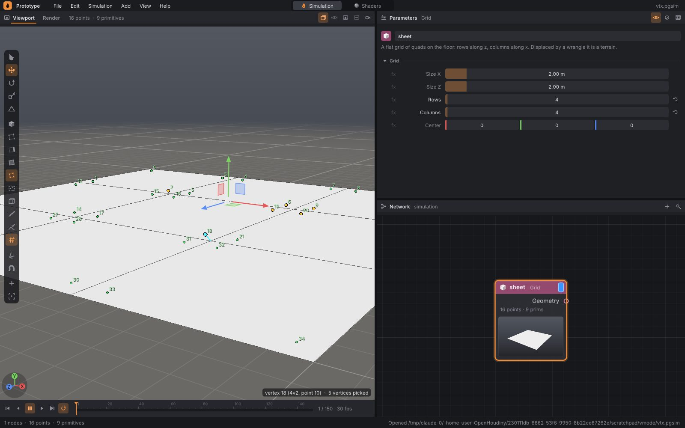

# Editing geometry in the viewport: points, edges, faces, brush and sculpt

The displayed geometry (the node with the display flag, [geometry.md](geometry.md))
can be edited directly in the viewport, as in Houdini: select points, edges
or faces with the mouse — by clicking, with a rectangle, a lasso or a brush, visible ones only,
or also those behind the surface —, move them, rotate and scale them with a handle, make
a group of them, delete them, paint an attribute with a brush — say `pin` or
`tear` for cloth ([cloth.md](cloth.md)) — and shape the geometry with a brush like
clay: push out, push in, smooth, grab and drag, flatten (§6c).

None of this is hidden magic. Every edit is **an ordinary network node**
that the editor inserts after the displayed node: **Edit**, **Group**, **Blast**,
**Attribute Paint**, **Sculpt**. Its parameters hold what the
mouse did — the selected elements as a pattern (`339 363-364 387-390`), brush strokes as a
list of dabs.
The network stays procedural: undo works as for any other change, the node can be
turned off (bypass), moved, edited in its parameters, saved with the network, and whatever
is upstream of it can still be changed.


## 1. Quick start

```bash
./build/prototype --example shade_sail    # shade sail: corners raised by Edit, pins painted with the brush
```

1. Display a node with geometry (the flag on the right end of the node, or **R**
   over it in the network) — say Grid.
2. Mouse over the viewport, **2**: points. A click selects a point, dragging with the left button
   draws a rectangle.
3. **W** and drag a handle arrow: the points move, and an **Edit** node
   appears after the displayed node. In its parameters set **Soft Radius**
   and the points around will move with them — the grid becomes a hill.
4. **Ctrl+G** makes a group from the selection (a **Group** node), **Delete**
   deletes it (a **Blast** node).
5. **P** and dragging over the geometry paints the `pin` attribute (an **Attribute
   Paint** node); with **Ctrl** it erases. **P** again ends painting.
6. **U** and dragging over the geometry pushes it outward (a **Sculpt** node);
   with **Ctrl** inward, with **Shift** it smooths. **U** again ends sculpting.

## 2. What gets selected

| Key | Toolbar button | What a click selects |
|---|---|---|
| **1** | cube | scene objects — nodes (as before) |
| **2** | quad with dots at the corners | points of the displayed geometry |
| **3** | quad with a highlighted side | edges |
| **4** | filled quad | primitives: polygons and curves |
| **5** | quad with dots slightly inside the corners | vertices: corners of primitives (§2b) |
| **P** | brush | nothing — paints |
| **U** | small hill under a brush | nothing — shapes (sculpt) |

In modes 2–5 the viewport shows a wireframe of the geometry, in point mode
also all points, in vertex mode all corners. The element under the mouse is lit
**turquoise**, selected ones are **yellow**. The bottom right shows what is under
the mouse (`point 446`, `edge 6-7`, `primitive 17`, `vertex 18 (4v2, point
10)`) and how many are selected.

Switching modes **converts** the selection: from points to primitives (those whose
points were all selected), from primitives to points (their corners), from primitives
to edges (their sides), from points to edges (edges between selected points),
from points to vertices (the corners on them), from primitives to vertices (their corners),
from vertices to points (their points) and to primitives (those whose corners
were all selected).

Only what is **visible** gets selected: a point, edge or face hidden by
the geometry's own surface is not taken by a click or a rectangle, and markers behind the surface
are not shown — until you turn on **H** (§2a). The selection holds the point
and primitive numbers of the displayed geometry; it survives undo and inserting another
node, as long as the geometry has the same number of points and primitives.

## 2a. Rectangle, lasso, brush; hidden too

Dragging with the left button selects in one of three ways. **S** cycles them
(rectangle → lasso → brush), as does the button under the four modes in the toolbar
(it shows the active one) and right-click › *Pick With*:

| Method | What it selects |
|---|---|
| **rectangle** | points that lie inside it; edges with both ends inside it; primitives whose center lies inside it |
| **lasso** | the same, except that instead of a rectangle it is whatever the line dragged with the mouse encircles (closed from the end back to the start). A loop the line makes around itself is outside again (the even–odd rule: a point is inside if a ray from it going outward crosses the line an odd number of times) |
| **brush** | a ring that selects whatever it touches as you drag it: points under it, edges it touches, primitives whose center it passes over, faces under its center (even those larger than the ring) and curves it touches |

With **Shift** the selection adds, with **Ctrl** it subtracts, otherwise it replaces — for the brush,
what was held at the press decides: the press itself is one dab, then
the brush takes whatever it passes over. The ring is orange, blue when subtracting;
its size is changed with **[** **]** and **Shift**+wheel. **Esc** during a drag restores
the selection as it was before it. A click without dragging with the rectangle and lasso selects the element
under the mouse as before.


**H** (the button with a transparent cube, right-click › *Pick Hidden Too*)
selects **hidden ones too**: click, rectangle, lasso and brush also take points and edges behind
the surface and the back side, and markers hidden by the surface — wireframe, points,
selection — are shown faintly, like an X-ray. The bottom right then reads
*Hidden too*. A click on a face still selects the first one under the mouse (whatever is behind
it is taken by the rectangle, lasso or brush).


## 2b. Vertices (5)

A **vertex** is a corner of a primitive, as in Houdini: a point where four
quads meet has four vertices, one in each quad. Vertices carry
their own attributes (a corner's `uv`, a hard edge in normals) and the order of a polygon's corners.
The viewport draws each vertex as a green dot one fifth of the way from the point to the
center of its polygon, so the corners around one point can be selected separately;
a line's corner lies on the point. Under the mouse, a line from the point to the corner is shown as well.



With vertices selected:

- **Ctrl+G** makes a vertex group (Group with class *Vertices*).
- **W**, **E**, **R** move, rotate and scale their points (Edit with class
  *Vertices*); soft selection and symmetry work as for points.
- **Delete** removes the corners from their polygons (Blast with class *Vertices*):
  a quad without one corner is a triangle. A polygon left with
  fewer than three corners (a line with fewer than two) disappears entirely. A point used
  only by the removed corners disappears with them.
- **N** shows vertex numbers.

In a pattern, vertices are numbered consecutively across primitives, the way the
geometry stores them (`0-3 9`), or Houdini-style by primitive and corner: `5v2` is
corner 2 of primitive 5 (§7).

## 3. Mouse and keys

| Input | What it does |
|---|---|
| click | selects the element under the mouse (and nothing else); a click into empty space clears the selection |
| **Shift**+click, **Ctrl**+click | adds, subtracts |
| left drag | rectangle, lasso or brush (§2a); with Shift adds, with Ctrl subtracts |
| **S** | rectangle → lasso → brush |
| **H** | select hidden elements too (and show them faintly) |
| **Alt** or **Space** + left drag | orbits the view — in these modes the left button selects |
| middle drag, right drag, wheel | pan, zoom (as always) |
| **Ctrl+A**, **Ctrl+I**, **Esc** | selects all, inverts the selection, clears the selection |
| **F** | frames the selection |
| **W**, **E**, **R** | translate, rotate, scale the selection with a handle; **Q** hides the handle |
| **O** | soft selection on / off (§4a) |
| **M** | symmetry: mirror edits and brushes across x, y, z, off (§4b) |
| **[** , **]**, wheel during a drag | smaller / larger soft selection radius |
| **Ctrl+G** | group from the selection (Group) |
| **Delete**, **X** | deletes the selection (Blast) |
| **Ctrl+X** | dissolves the selected edges or faces (Dissolve, §5) |
| **P** | paint brush on / off (§6) |
| **U** | sculpt on / off (§6c) |
| **Tab** | node on the selection: PolyExtrude, wrangle, Edit… (§6a) |
| **N** | point numbers (primitive numbers in primitive mode), visible ones only |
| **[** , **]**, **Shift**+wheel | smaller / larger brush (paint or sculpt; the selection brush when soft selection is off) |
| **Ctrl** while painting | paints with the Erase Value (erases) |
| **Ctrl**, **Shift** while sculpting | Ctrl: Push pushes inward; Shift: smooths, with any tool |
| **Ctrl+D** while sculpting | dyntopo on / off: the mesh is refined under the brush (§6c) |
| **Esc** while dragging | undoes what the drag did (handle, selection brush, Grab) |

The same items are in the viewport's right-click menu and in the Help menu.
Space starts and stops playback only when you release it, and only if you
did not orbit the view with it.

## 4. Translate, rotate, scale: the Edit node

The first handle drag on a selection inserts an **Edit** node after the displayed node —
it receives the displayed node's input, its output goes where the displayed node's output
went, and it takes over the display flag — and sets on it:

| Parameter | What it holds |
|---|---|
| Elements | the selected elements as a pattern (§7) |
| Class | Points, or Primitives (then the points of the selected primitives move) |
| Translate, Rotate, Scale | what the handle did; rotation in degrees about x, then y, then z |
| Pivot | the center of the selection at the first drag: rotation and scaling happen around it |
| Soft Radius | how far around the selection points move with it: fully right next to it, not at all at a distance of Soft Radius (§4a) |
| Distance | how that distance is measured: straight through space, or along the surface (§4a) |
| Falloff | how the share of motion fades: Smooth, Linear, Sharp, Sphere, Constant (§4a) |
| Symmetry | Off, X, Y, Z: also moves the mirror images of the selected points (§4b) |

Further drags with **the same selection** set the same Edit: rotation
and scale compose exactly (rotation about the handle center, scale along
the Edit's axes — the handle then has its axes; otherwise the shape would shear). A different selection
gets a new Edit after the first one. Clicking the handle without moving it creates no
node; **Esc** during a drag restores the values, and if the drag has only just created the Edit,
it restores the network as it was. **Ctrl** during a drag snaps in steps
(5 cm, 15°, ×0.1), as for objects.

Edges are moved through their points: the Edit gets an edge pattern (`p3-4`)
and class Points.

When an Edit is displayed and nothing is selected, **2** (**4** for a primitive Edit)
selects what that Edit moves — the handle then continues in it, just as when in Houdini
you select an Edit node and return to its tool.

## 4a. Soft selection (O)

**O** turns on soft selection: a handle drag also takes the points around the selection along,
the less the farther away they are — a point becomes a hill, not a spike. How much of the motion each
point gets is visible even before the drag: the faces around the selection are
tinted orange (full motion) through red to nothing (no motion),
points along the way have the color of their share, and around the handle is a circle with the
soft selection radius and a label (`soft 0.51 m`). The default radius is 15%
of the geometry size; it is changed with **[** **]** and the **mouse wheel during a drag**
(the hill changes live), as well as by the Edit's **Soft Radius** parameter.


The soft selection settings are parameters of the Edit: a new Edit gets them
from the viewport, and for a displayed Edit of the same selection the viewport shows and changes
the Edit's own. Right-click › *Soft Selection*, *Soft Distance*, *Soft
Falloff*; the button with a small hill in the toolbar below the tools.

**Distance** — how far away a point is:

| Option | Distance |
|---|---|
| Space | straight through space to the nearest selected point |
| Along the Surface | along the surface, across edges: a sheet lying above another, a neighboring piece that does not touch, or the other side of a bent strip stay where they are |


**Falloff** — the shape of the falloff; `x` is the distance divided by the radius:

| Option | Share of motion | Shape |
|---|---|---|
| Smooth | `(1 − x²)²` | hill, flat at the top and at the base (default) |
| Linear | `1 − x` | cone |
| Sharp | `(1 − x)²` | spike |
| Sphere | `√(1 − x²)` | dome, steep at the edge |
| Constant | `1` | full motion all the way to the radius |

## 4b. Symmetry (M)

**M** cycles symmetry: off → X → Y → Z → off (also right-click ›
*Symmetry*). The mirror plane passes through the origin perpendicular to the chosen axis; the viewport
shows it as a purple rectangle across the geometry, and the bottom right reads `Mirror X`.

- **Handle (Edit).** A new Edit gets the **Symmetry** parameter. With it, the
  mirror images of the selected points move too. The side of the plane the
  pivot is on moves as the Edit says, the other side as its mirror image.
  A point on the plane gets the average of both, so it stays on it: motion across
  the plane cancels out, motion along it remains. Soft selection takes the selected
  points together with their images, and the tinting shows this. The selection itself is not mirrored;
  what you selected stays selected.
- **Sculpt.** The brush writes each dab together with its mirror image,
  and the image is **attached** to it (in the text, a `+` before the tool letter:
  `p … ; +p …`). Attached dabs are applied together: each point moves
  by the sum of both, both computed from the shape before them. A symmetric surface thus
  stays symmetric, even where the dabs overlap near the plane. Where a dab
  and its image overlap, each one is weaker: strength times the distance between the centers
  divided by twice the radius, at least half, like *feathering*
  in Blender. A dab right on the plane then acts as a single dab without
  symmetry. Grab drags the image mirrored.
- **Attribute Paint.** The brush also paints the dab's mirror image, weakened
  the same way where they overlap.

A point's mirror image is the geometry point nearest to the place it reflects to, within
10⁻⁴ of the geometry size. A symmetric mesh thus finds all pairs,
an asymmetric one only those that are symmetric. Brush symmetry applies to
new strokes: turning it off does not change what has already been painted or shaped.

## 5. Group, deletion and Dissolve

**Ctrl+G** inserts a **Group** node with the name `group1` (the first one the
geometry does not yet have), and the class and pattern of the selection. Rename it
in the parameters. A group of edges is a group of their points — the core geometry
has no edge groups.

**Delete** inserts a **Blast** node:

| Selected | What disappears |
|---|---|
| points | the points, and the primitives that lose a point |
| primitives | the primitives, and the points used only by them |
| edges | the primitives they are a side of (like *Delete Edges* in Blender) |

Blast can also do the reverse (Keep): keep only the selection.

**Ctrl+X** inserts a **Dissolve** node: the selected edges disappear and the two polygons
they were a side of merge into one, like *Dissolve Edges* in Blender
or Dissolve in Houdini. Faces connected by the selected edges become one
polygon bounded by a single outline; sides shared by two of them disappear
even if unselected. In primitive mode the selected faces merge. Where this would not
produce a single outline (a ring of faces around a hole, an outline that touches
itself, faces with opposite orientation), the polygons stay as they were. An edge on the boundary
(a side of a single face) is not dissolved. The new polygon gets the attributes of the face
with the lowest number, and each corner the attributes of the corner it was (e.g. `uv`).
A point that ends up collinear on a side after merging and that no other polygon
uses disappears (*Remove Inline Points*, deviation up to *Inline Angle*, 1°), as does
a point used only by the dissolved sides. Merged polygons come after the others in the
output.

## 6. Brush: Attribute Paint

**P** over the viewport paints into the displayed **Attribute Paint** node;
if the displayed node is not an Attribute Paint, a new one is inserted after it
and selected, so its parameters are right at hand:

| Parameter | What it does |
|---|---|
| Attribute | what is painted — `pin`, `tear`, `mass`… (`@pin` in a wrangle) |
| Value | what the brush applies |
| Erase Value | what it applies with **Ctrl** |
| Radius | brush size (**[** **]**, **Shift**+wheel) |
| Strength | how much of the value a dab applies at its center |
| Default | where points start when they do not have the attribute yet |
| Strokes | the painted dabs: how many there are, and **Clear** |

A stroke lays **dabs** a quarter of the radius apart. Each dab is a sphere: a point
inside it moves toward the dab's value by `Strength × (1 − d²/r²)²`, most at the center,
not at all at the edge; dabs are applied in the order in which they were
painted. A stroke may start off the geometry — it paints where the brush lies on the
surface, and when it slides off and comes back, it does not start painting across a hole.

Dabs are **locations, not point numbers**: refine the grid before the Attribute
Paint and the paint stays where it was. An integer attribute stays an integer
(rounded).

While painting, the geometry is colored by the painted attribute: blue
0, through turquoise and yellow to red 1 (values larger than 1 are
scaled down by the largest). The brush ring lies on the surface under the mouse.
**P** again (or Q, W, E, R, 1–5) ends painting; a node that P
inserted and into which nothing was painted disappears again.

For cloth ([cloth.md](cloth.md)): a point with `pin` above 0.5 is pinned,
`tear` multiplies the tearing threshold (0.5 tears twice as early — perforation), `mass`
is the point's mass in kg. Example **shade_sail**: a sail stretched between four
posts, two corners raised by an Edit with a soft radius, corners pinned with
four `pin` dabs; the wind inflates it.


## 6a. Any node on the selection: Tab

**Tab** over the viewport opens a menu of geometry nodes with search (like
Tab in the network). The chosen node is inserted after the displayed one and — if it has a
Group parameter — gets the selected elements in it as a pattern; where it has a class (Points /
Primitives), it gets ours. Nodes that work on their own class convert
the selection: **PolyExtrude** and **Primitive Wrangle** take faces (from points, the
faces whose points are all selected), **Point Wrangle** takes points (from faces,
their corners). Edges stay edges (`p3-4`). Nodes without Group are
lower in the menu and are only inserted after the displayed one. The menu is also in the right-click menu
(*Node on Picked*, *Extrude Picked*).


A displayed **PolyExtrude** has its own handle in the viewport: an arrow
from the extruded faces (the Front Group) along their normal. Dragging
changes **Distance** (Ctrl snaps, Esc restores). Extruding changes the
topology, so the face selection disappears and the node's handle remains.

**N** shows point numbers, or primitive numbers in primitive mode (at the center
of the face). Only those that are visible, at most 3000 on screen — with more it
shows a prompt to zoom in.

## 6b. Geometry node handles

In object mode (**1**) a selected geometry node has a handle too — click
it in the network, **W**, **E**, **R** and drag; the values are written into its
parameters (at the current frame, with keys as for objects):

| Node | Translate | Rotate | Scale |
|---|---|---|---|
| Box | Center | — | Size |
| Sphere | Center | — | Radius |
| Tube | Center | — | Radius, Height |
| Tree | Center | — | Radius (of the trunk), Height |
| Grass | Center | — | Height (of the blades) |
| Grid, Point Cloud | Center | — | — |
| Line | Origin | Direction | — |
| **Clip** | Origin (a point on the plane) | Direction (the plane normal) | — |
| **Transform** | Translate | Rotate | Scale |
| **Edit** | Translate | Rotate | Scale |

Transform and Edit have their handle **at the pivot** (Pivot + Translate): the point
the geometry rotates and scales around — for a Transform, say, the base of a tower that
is to fall. Rotating with the handle thus rotates around it, and scaling goes along the node's
axes. The handle does not change the Pivot itself; set it in the parameters. A copy
of a geometry node (**Ctrl+D**) stays where the original was — only a copy
of an object or source is offset, so that it does not lie inside the original.

## 6c. Sculpt: shaping with a brush (U)

**U** over the viewport shapes the displayed geometry with a brush, like clay —
similar to sculpting in Blender or ZBrush, except that the result is again
an ordinary **Sculpt** node after the displayed node (when the displayed node is not a
Sculpt; otherwise it sculpts into it). Dragging over the geometry pushes it outward under the ring,
and with **Ctrl** pushes it inward; with **Shift** it smooths, whichever
tool is selected. The tool is chosen in the node's parameters or
via right-click › *Sculpt Tool*:

| Tool | What a dab does to a point at distance *d* from its center (radius *r*, falloff *f* = Falloff(*d*/*r*)) |
|---|---|
| **Push / Pull** | moves it along the surface normal under the dab's center by `Strength × 0.2 × r × f`; with Ctrl inward |
| **Smooth** | moves it toward the average of its neighbors across edges by the fraction `Strength × f` |
| **Grab** | takes it along: by how far the mouse has moved since the start of the stroke, times `f` |
| **Flatten** | moves it toward the plane through the dab's center perpendicular to the normal by the fraction `Strength × f` |


| Parameter | What it does |
|---|---|
| Tool | Push / Pull, Smooth, Grab, Flatten |
| Radius | brush size (**[** **]**, **Shift**+wheel); a new node gets one twelfth of the geometry size |
| Strength | Push: at 1 pushes the dab's center out by a fifth of the radius (0 to 4); Smooth and Flatten: what fraction of the way a point travels (0 to 1) |
| Falloff | the shape of the falloff toward the edge of the ring, as with soft selection (§4a): Smooth, Linear, Sharp, Sphere, Constant |
| Strokes | dabs: how many there are, and **Clear** |

A stroke lays dabs a quarter of the radius apart, and each one works with the surface as
the dabs before it left it — a stroke over its own hill raises it further, and the normal is
taken from the surface under the dab's center. Dabs are **locations, not point numbers**:
refine the mesh before the Sculpt and the shape stays, only finer. The ring has
a color and a label according to the tool (`Push 0.47 m`, `Pull`, `Smooth`…).

**Grab** is a single dab for the whole stroke: the place where the stroke started, and the mouse movement
in the plane perpendicular to the view. The hill follows the mouse, a line shows where from; **Esc**
during the stroke undoes the Grab.


Smoothing preserves **boundaries**. A point on an open boundary of a surface (a side of a single
face) moves only along the boundary, toward the average of its two boundary neighbors;
a boundary corner — where the boundary turns by more than 30° —, a point where boundaries meet,
and the ends of lines stay where they are. What counts as a corner is decided from the shape as it
came into the Sculpt, so a stroke does not smooth it away. The border of a grid thus
does not fray and corners do not get rounded.

Where the geometry has `N` normals, Sculpt recomputes them from the faces. While sculpting,
the viewport does not draw the wireframe, so that the shape is visible. **U** again (or Q, W, E, R,
1–5) ends sculpting; a node that U inserted and into which nothing
was sculpted disappears again.

### Dyntopo: the mesh is refined under the brush (Ctrl+D)

With **Dyntopo** the brush creates points by itself, like dynamic topology
in Blender. It is turned on in the *Dyntopo* section of the Sculpt parameters, with **Ctrl+D**
while sculpting, or via right-click › *Sculpt Tool* › *Dyntopo*. Polygons are
immediately cut into triangles (fans, the way the viewport draws them), even when
there are no dabs yet. Before each dab, the triangles within its reach
are adjusted in two ways:

- **Collapsing** contracts an edge shorter than 0.4 of the detail into a point at its middle,
  shortest first.
- **Subdivision** halves an edge longer than the *detail*, longest first, and then
  again, until no longer edge remains under the dab. Along with a long edge,
  significantly longer edges next to it are halved too. The farther from the dab, the longer
  they may be (×1.6 per step), so triangles grow smoothly away from the brush
  and no long thin ones appear.

Then the dab moves points as without dyntopo. Grab does not change the mesh (as
in Blender) and takes it as it is.


| Parameter | What it does |
|---|---|
| Dyntopo | turns on dynamic topology (**Ctrl+D**) |
| Refine | Subdivide only subdivides; Collapse only collapses; Subdivide Collapse (default) does both, so the triangles under the brush stay even |
| Detailing | Brush: the detail is a fraction of the dab radius, so a small brush makes fine triangles and a large one coarse ones; Constant: a length in meters, whatever the brush |
| Detail | with Brush: the longest edge under a dab as a fraction of its radius (default 0.25) |
| Detail Size | with Constant: the longest edge under a dab in meters (default 5 cm) |

The length of the edges the brush makes is shown by the ring (`Push 0.2 m, edges
0.05 m`) and in the status bar.

An edge is collapsed only if the mesh stays a surface without holes or folds:

- the edge's ends have no common neighbors other than the two opposite corners (*link
  condition*), so two layers do not merge;
- no triangle flips upside down;
- the last triangle of a fragment, or a closed tetrahedron, does not disappear.

The boundary stays where it was. Of a boundary point and an interior point, the
boundary point remains in its place. Two boundary points merge only along the boundary, and a boundary
corner (where the boundary turns by more than 30°) stays in place. Points of open
lines move but do not disappear.

**Attributes** go with the points. A new point at the middle of an edge gets the average of the numbers of both
ends (`Cd`, `N`, corner `uv`s…); integers and strings it gets from the end
with the lower number. A point an edge collapsed into has the average of both. A new point
belongs to a point group when both ends belonged to it. A triangle has
the attributes and groups of the polygon it came from, and `N` normals are
computed from the triangles at the end. Points the geometry had stay at the beginning
(minus the collapsed ones), new ones follow them; each polygon is replaced in its place by
the triangles created from it.

The mesh and the shape are bit-identical every time: edges are taken by length,
and equally long ones by point numbers. With symmetry (§4b), the mesh under a dab
and under its image is refined separately, so the shape is symmetric but the
triangles not exactly. Dabs are still locations: a change upstream of the Sculpt or to a
dyntopo parameter recomputes all dabs again, on the new mesh.

## 7. Element patterns

The parameters of Group, Edit, Blast, PolyExtrude and the wrangles take elements as a **pattern**, like the group
fields of Houdini nodes. The viewport writes them this way, and they can be written by hand too:

| Pattern | What it selects |
|---|---|
| `0-9 12 20-30` | numbers and ranges (a range can also be reversed: `9-0`) |
| `*` | everything |
| `pin_group` | a group by name; a group of another class is converted (points of primitives, primitives with all their points in the group, vertices on the group's points or primitives, points of vertices, primitives with all their vertices in the group) |
| `p3-4` | the edge between points 3 and 4; for points both points, for primitives those it is a side of, for vertices their corners at both ends of the edge |
| `5v2`, `5v0-2` | corner 2 of primitive 5, the first three corners of primitive 5; for points their points, for primitives primitive 5 |
| `p0-1-2-3` | a path of three edges |
| `^…` | subtracts: `* ^0-9` is everything except the first ten |

Entries are separated by spaces or commas and apply in order. Whatever names
nothing (a number past the last one, a group that does not exist, an edge the
geometry does not have) selects nothing. The viewport writes the shortest pattern: number ranges
and edges joined into paths (`p0-1-2-3-4 p9-10`).

## 8. How it works

- **Patterns** — `src/pg/core/Selection.h`: `selectElements` (pattern → mask
  of points, primitives or vertices), `patternOf`, `edgesOf`, `selectEdges`,
  `edgePatternOf`; conversions `verticesOfPoints`, `verticesOfPrimitives`,
  `pointsOfVertices`, `primitivesOfVertices`.
- **Vertices** — the vertex marker is `ElementPicker::vertexMark` (the point
  offset by `kVertexInset` = 0.2 toward the polygon center). The marker lies on the
  face, so it is visible when the ray toward it first meets its own polygon,
  or nothing. A vertex Blast is `Geometry::deleteVertices`: each primitive
  continues through the corners it has left, and corner and primitive attributes
  as well as groups are carried over.
- **What is under the mouse** — `src/pg/core/Pick.h`, `ElementPicker`: polygons
  split into triangles (fan), a bounding volume tree (BVH, median split,
  leaves of four). A ray finds the nearest face; equally distant faces
  are decided by triangle order, so the result does not depend on how the
  tree was split. An element is visible when the ray from the eye to it does not meet
  a face closer than 0.1% of the distance in front of it. Rectangle, lasso and brush stroke
  are all a `ScreenRegion` (a part of the screen) and are evaluated on multiple threads,
  element by element. The lasso is a polygon with the even–odd rule; its
  sides are sorted into horizontal bands, so a point queries only the sides
  of its own band (a lasso of hundreds of points over hundreds of thousands of geometry points is
  fast). The brush stroke for one frame is a capsule: the segment from the previous mouse
  position to the current one, with the ring's radius; an edge touches it when the segments
  come within the radius of each other, and visibility is queried at the point of contact. Faces under
  the brush center are found by rays every half radius along the stroke. The tree is built
  only for new points or topology: painting changes the geometry but
  shares the points (copy-on-write), and the tree stays. When points only move
  (sculpt, handle drag) and the topology stays, the tree keeps its shape and
  recomputes only the bounds (refit) — on a million points 40 ms instead of 1.2 s; what
  a query finds does not depend on the tree's shape. When the bounds grow beyond four times
  the area they had, the tree is rebuilt. A new tree is built on its
  own thread (a million faces in roughly a second) and the window keeps running meanwhile.
  Until then nothing is highlighted under the mouse, and the wireframe with corner markers appears
  once the tree is done. For the tree of small geometry the editor waits 8 ms, so nothing
  flickers. Click and rectangle wait for the tree, so that the selection is not lost.
  A sculpt brush whose faces dyntopo changes with every dab meanwhile
  runs on the tree of slightly older geometry, so it does not slide off the surface.
  The overgrown tree serves until the new one is ready. The wireframe takes edges from the
  tree, so they are not computed twice (on a million faces this used to cost
  0.24 s extra in the window).
- **Markers** — the renderer overlay (`gl::Overlay`): wireframe, points, selection,
  the highlight under the mouse (its own layer, so that mouse movement does not rebuild
  the rest) and paint colors, drawn with a depth test against the scene, slightly
  closer to the eye than the surface. A dot is pulled forward by as much as it covers of the surface around
  it — more when the surface is seen at a grazing angle — so that the surface
  does not clip it. Wide lines are two triangles (the OpenGL core profile has no lines wider
  than a pixel). With **H** the markers are drawn twice: first
  with an inverted depth test (only what the surface hides) and opacity
  0.3, then normally. Shot renders have no markers.
- **Soft selection** — `src/pg/core/Soft.h`, `softWeights`: the share of motion
  of each point, the same for the Edit node and for the tinting in the viewport. Straight
  distance finds the nearest selected point using a point tree. Along the surface, a
  front propagates from all selected points at once across edges (Dijkstra, equally
  distant points in order of their numbers — the result is the same every time); a point
  remembers the selected point its path came from, and the distance is a
  straight line to it as long as the path keeps leading away from it — so on a flat sheet the
  falloff is round, not a diamond of edge steps — and the length of the edges where the
  surface bends back toward it. The viewport tints according to the geometry that the
  displayed Edit receives as input (the cooker returns it together with the displayed one),
  so the preview matches what the Edit computes, even during a drag.
- **Sculpt** — `src/pg/core/Sculpt.h`: `SculptDab`, `parseSculpt`,
  `sculpt`, `Sculptor`. Points within a dab's reach are found by a grid of cells about the size
  of a typical dab radius, in which a point is moved when it
  moves into another cell; with only a few dabs it is faster to query
  all points directly (on multiple threads). The points of one dab move together,
  each according to where the points were before the dab — order does not matter, and a large
  dab is computed on multiple threads. Smoothing knows the neighbors from `Adjacency`
  and the boundaries (sides of a single face) from the geometry as it came into the node.
  **Incrementally**: the node remembers the input, the dabs, the geometry after all
  dabs and before the last one. A stroke that adds a dab or two computes only
  those; a Grab that changes only the last dab computes only that one. Undoing a whole stroke
  recomputes the dabs from the beginning. The result is bit-identical to computing all
  dabs from the beginning (tests verify this). On a grid of a million points: 2,000 dabs from
  scratch 0.17 s, a mouse move during a stroke 12 ms (with `N` normals 33 ms), Grab
  3 ms. In the editor, every move then also adds a refit of the selection tree
  and new geometry in the viewport: the viewport draws polygons indexed and, when
  points move, sends only vertex positions and normals to the GPU — on 90,000 points
  6 ms, on a million 62 ms (with `N` normals 7 ms); see
  [geometry.md](geometry.md#3-display-flag-and-viewport).
- **Dyntopo** — `src/pg/core/Dyntopo.h`: `SculptMesh` holds the triangles
  and, for each point, a sorted list of the triangles around it; the lists live
  in one shared array, so the mesh is copied in blocks. Point
  and corner attributes are numbers, or a reference to the geometry element they come from
  (integers, strings). Edges wait in a queue ordered by length. Triangles
  within a dab's reach are found by a multi-level grid of boxes: each triangle is
  in a single cell of the finest level it fits into, so a large
  triangle does not occupy thousands of cells. Points are found by a moving grid; with only a few
  dabs it queries all of them directly (on multiple threads). Removed points
  and triangles keep their numbers until conversion to geometry. Sculptor
  keeps the mesh after the dabs and continues in it; it copies the mesh before the last dab
  only under Grab, because a copy of the mesh is not shared like
  geometry (an undone dab that is not a Grab is therefore computed from the beginning).
  A sphere of 360,000 triangles: a dab during a stroke 7 ms (at most 13 ms),
  400 dabs from scratch 0.12 s; at 60,000 triangles 1.4 ms per dab.
- **Symmetry** — `src/pg/core/Mirror.h`: `mirrorPoints` finds the image
  of each point using a point tree (the nearest to the reflected location within tolerance),
  `withMirror` adds the images to the selection. Edit splits points by the side of the
  plane relative to the pivot; the image is computed as `R T R x` (`R` reflection, `T`
  the edit). Sculpt applies a group of attached dabs together: displacements from
  all dabs of the group, from the shape before them, sorted by point number
  and summed in dab order, so the result is the same every time. Sculptor
  continues group by group: a Grab with an image changes the last group (two
  dabs) and computes only that.
- **Composing edits** — `sim::EditTransform` (`src/pg/sim/Shape.h`):
  Edit does `x → R S (x − p) + p + t`; a handle drag around a center `c`
  composed after it is again an Edit: the rotation is prepended to `R`, the scale multiplies
  `S`, and `t` takes `p + t` to where the drag takes it. Tests verify that this
  holds point by point and that the Edit in the node computes the same.
- **Nodes** — `src/pg/nodes/Edit.cpp`: `groupcreate`, `edit`,
  `attribpaint`, `sculpt`; Blast in `Modifiers.cpp`; Dissolve
  in `Topology.cpp` on top of `src/pg/core/Dissolve.h`: edges merge faces
  (union-find), the group is walked along its outer sides from the corner with the lowest
  number; a point from which two outer sides lead, or sides left
  over after the walk, mean multiple outlines, and the group stays. Attribute Paint
  applies dab by dab only to the points within its reach (point tree), so
  thousands of dabs on a fine mesh are fast.
- **Editor** — `tools/prototype/SimElements.cpp`; node handles
  (`sim::Handles` in `src/pg/sim/Network.h`, with a `pivot` field for the handle
  at the pivot) in `SimViewport.cpp`.

Geometry lying on the floor (the grid at y = 0) no longer z-fights with the floor:
the geometry's face wins when it is as far away as the floor.

## 9. Limitations

- What is edited is the **displayed geometry**, not the simulation result: pins are painted
  on the Cloth Solver's input, not on the computed cloth.
- Selection, Edit, Group and Blast hold point and primitive **numbers**. A change upstream of
  them that renumbers the points (a different number of grid rows) shifts what
  they refer to. Painting is not affected — dabs are locations.
- Occlusion takes into account only the displayed geometry's own surface, not
  objects or pieces in front of it.
- Vertices cannot be painted with a brush or dissolved (Dissolve takes edges
  and faces). Tab on vertices gives a node that does not know vertices (PolyExtrude,
  wrangle) their points or primitives. The symmetry plane always passes through the origin,
  and only the edit is mirrored, not the selection. Soft selection is available only with handles (translate,
  rotate, scale).
  Nodes without a position in space (Subdivide, Fuse…) have no handle, and neither does Group by
  Box (two corners).
- Without dyntopo, Sculpt only moves points and does not add them. Fine detail then
  needs a fine mesh (Subdivide before the Sculpt), or Dyntopo (§6c).
- Dyntopo makes only triangles, does not flip edges (*edge flip*) and does not
  relax points. For collapsed edges, corner attributes (`uv`) are only approximated,
  so UV seams may blur. A single dab halves at most 250,000 edges.
- A change to anything upstream of the Sculpt, to its Falloff or to the dyntopo parameters
  recomputes all dabs from the beginning.
- The wireframe and the points are drawn however many there are: the overlay sends the
  points once and the edges as pairs of indices into them (`gl::Overlay::Marks`), about a
  sixth of what a line per edge took. Corner markers, paint dots and soft-selection dots
  stop at 400,000; past that only the selection. The first selection in a mesh of millions of triangles builds the bounding volume tree
  (on the order of a second).
