# Úpravy geometrie ve viewportu: body, hrany, plochy, štětec a sculpt

Zobrazenou geometrii (uzel s display flagem, [geometry.md](geometry.md))
jde upravovat přímo ve viewportu, jako v Houdini: myší vybrat body, hrany
nebo plochy — kliknutím, obdélníkem, lasem nebo štětcem, jen viditelné,
nebo i ty za povrchem —, posunout je, otočit a zvětšit úchytem, udělat
z nich skupinu, smazat je, štětcem namalovat atribut — třeba `pin` nebo
`tear` látce ([cloth.md](cloth.md)) — a štětcem geometrii tvarovat jako
hlínu: vytlačit, zatlačit, uhladit, chytit a táhnout, zarovnat (§6c).

Nic z toho není skryté kouzlo. Každá úprava je **obyčejný uzel sítě**,
který editor vloží za zobrazený uzel: **Edit**, **Group**, **Blast**,
**Attribute Paint**, **Sculpt**. V jeho parametrech je to, co udělala
myš — vybrané prvky jako vzor (`339 363-364 387-390`), tahy štětce jako
seznam kapek.
Síť zůstává procedurální: undo funguje jako u každé jiné změny, uzel jde
vypnout (bypass), přesunout, upravit v parametrech, uložit se sítí, a co
je před ním, jde dál měnit.

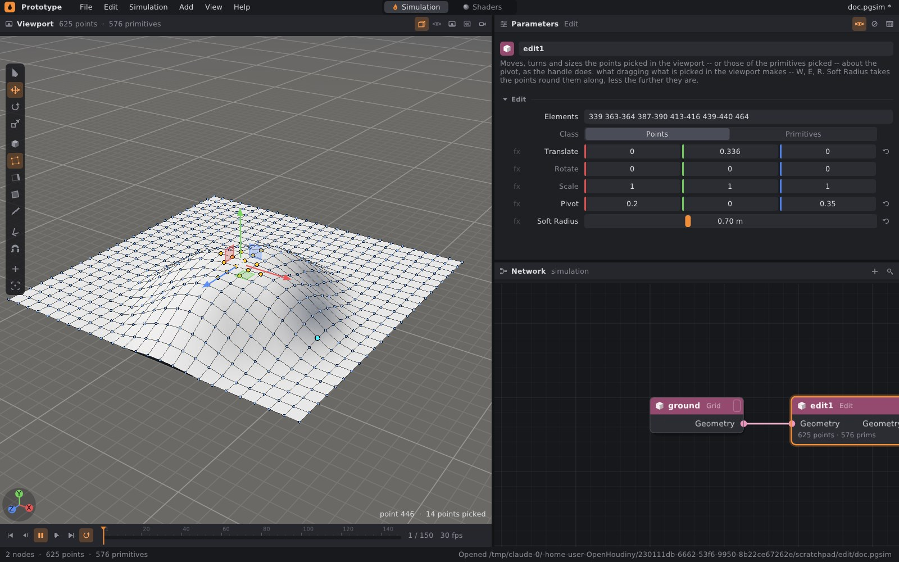

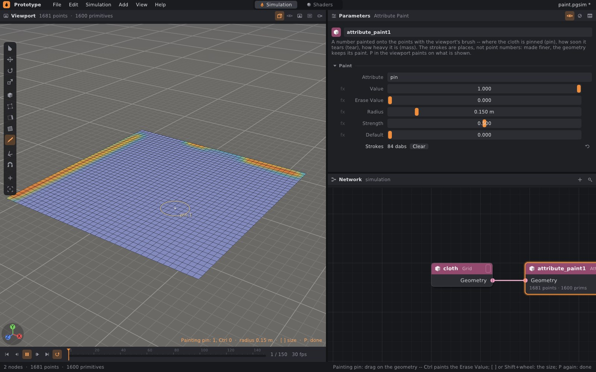

## 1. Rychlý start

```bash
./build/prototype --example shade_sail    # plachta: rohy zvednuté Editem, piny namalované štětcem
```

1. Zobrazte uzel s geometrií (praporek na pravém konci uzlu, nebo **R**
   nad ním v síti) — třeba Grid.
2. Myš nad viewport, **2**: body. Klik vybere bod, tažení levým tlačítkem
   obdélník.
3. **W** a tažení šipkou úchytu: body se posunou a za zobrazeným uzlem
   přibude uzel **Edit**. V jeho parametrech nastavte **Soft Radius**
   a body kolem půjdou s nimi — z mřížky je kopec.
4. **Ctrl+G** udělá z vybraného skupinu (uzel **Group**), **Delete** ho
   smaže (uzel **Blast**).
5. **P** a tažení po geometrii maluje atribut `pin` (uzel **Attribute
   Paint**); s **Ctrl** maže. **P** znovu malování ukončí.
6. **U** a tažení po geometrii ji vytlačuje ven (uzel **Sculpt**);
   s **Ctrl** dovnitř, se **Shift** uhlazuje. **U** znovu sculpt ukončí.

## 2. Co se vybírá

| Klávesa | Tlačítko v liště | Co klik vybírá |
|---|---|---|
| **1** | krychle | objekty scény — uzly (jako dosud) |
| **2** | čtyřúhelník s tečkami v rozích | body zobrazené geometrie |
| **3** | čtyřúhelník se zvýrazněnou stranou | hrany |
| **4** | vyplněný čtyřúhelník | primitivy: polygony a křivky |
| **P** | štětec | nic — maluje |
| **U** | kopeček pod štětcem | nic — tvaruje (sculpt) |

V režimech 2–4 viewport ukáže drátěný model geometrie, v režimu bodů
i všechny body. Prvek pod myší svítí **tyrkysově**, vybrané jsou
**žluté**. Vpravo dole je napsáno, co je pod myší (`point 446`,
`edge 6-7`, `primitive 17`) a kolik je vybráno.

Přepnutí režimu výběr **převede**: z bodů na primitivy (ty, jejichž
všechny body byly vybrané), z primitiv na body (jejich rohy), z primitiv
na hrany (jejich strany), z bodů na hrany (hrany mezi vybranými body).

Vybírá se jen to, co je **vidět**: bod, hranu či plochu, kterou zakrývá
vlastní povrch geometrie, klik ani obdélník nevezme a značky za povrchem
nejsou vidět — dokud nezapnete **H** (§2a). Výběr drží čísla bodů
a primitiv zobrazené geometrie; zůstane i po undo a po vložení dalšího
uzlu, dokud má geometrie stejně bodů a primitiv.

## 2a. Obdélník, laso, štětec; i skryté

Tažení levým tlačítkem vybírá jedním ze tří způsobů. **S** je střídá
(obdélník → laso → štětec), stejně tlačítko pod čtyřmi režimy v liště
(ukazuje ten, který platí) a pravý klik › *Pick With*:

| Způsob | Co vybere |
|---|---|
| **obdélník** | body, které v něm leží; hrany, jejichž oba konce v něm leží; primitivy, jejichž střed v něm leží |
| **laso** | totéž, jen místo obdélníku to, co obkrouží čára tažená myší (uzavřená z konce zpátky na začátek). Smyčka, kterou čára udělá kolem sebe, je zase venku (pravidlo sudý–lichý: uvnitř je, co paprsek ven protne lichým počtem čar) |
| **štětec** | kroužek, který vybírá, čeho se dotkne, jak jím táhnete: body pod ním, hrany, kterých se dotkne, primitivy, přes jejichž střed přejede, plochy pod jeho středem (i ty větší než kroužek) a křivky, kterých se dotkne |

Se **Shift** výběr přidává, s **Ctrl** ubírá, jinak ho nahradí — u štětce
rozhoduje, co bylo drženo při stisku: stisk sám je jedna kapka, pak
štětec bere, přes co jde. Kroužek je oranžový, při ubírání modrý;
velikost mění **[** **]** a **Shift**+kolečko. **Esc** během tahu vrátí
výběr, jaký byl před ním. Klik bez tažení u obdélníku a lasa vybere prvek
pod myší jako dosud.

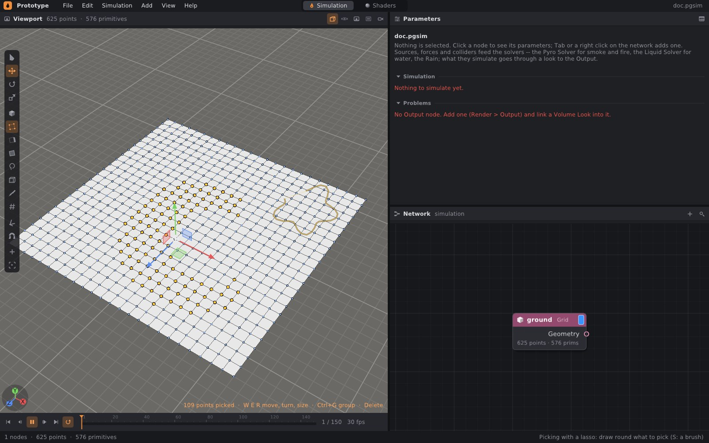

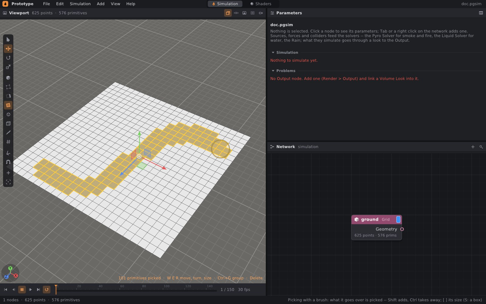

**H** (tlačítko s průhlednou krychlí, pravý klik › *Pick Hidden Too*)
vybírá **i skryté**: klik, obdélník, laso i štětec berou i body a hrany za
povrchem a zadní stranu, a značky, které povrch zakrývá — drát, body,
výběr — jsou vidět slabě, jako rentgen. Vpravo dole je pak napsáno
*Hidden too*. Klik na plochu vybere tu první pod myší i tak (co je za
ní, vezme obdélník, laso nebo štětec).

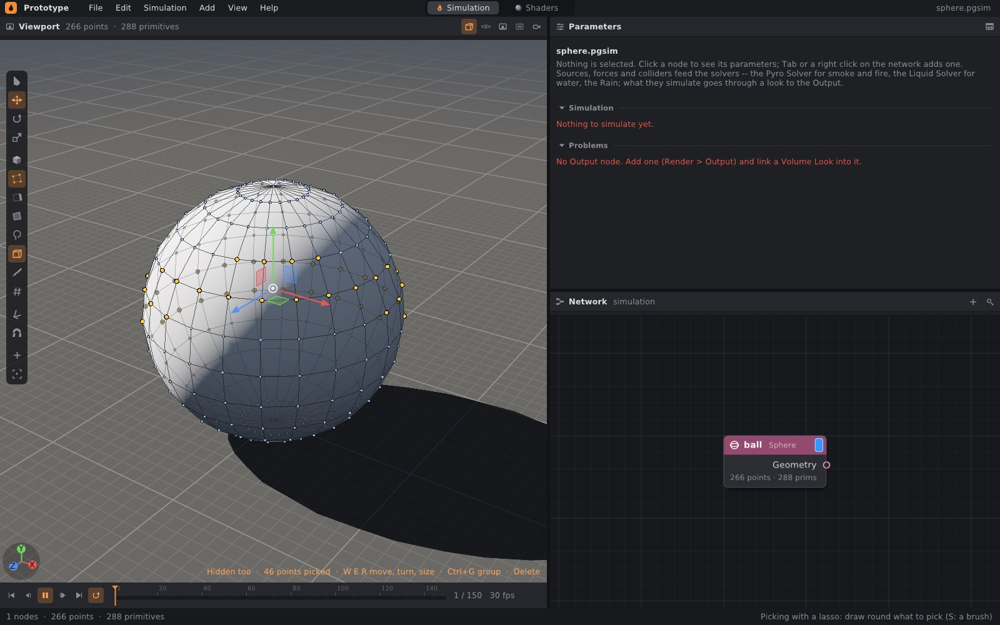

## 3. Myš a klávesy

| Vstup | Co udělá |
|---|---|
| klik | vybere prvek pod myší (a nic jiného); klik do prázdna výběr zruší |
| **Shift**+klik, **Ctrl**+klik | přidá, ubere |
| tažení levým | obdélník, laso nebo štětec (§2a); se Shift přidá, s Ctrl ubere |
| **S** | obdélník → laso → štětec |
| **H** | vybírat i skryté (a ukázat je slabě) |
| **Alt** nebo **mezerník** + tažení levým | otáčí pohledem — levé tlačítko v těchto režimech vybírá |
| prostřední tažení, pravé tažení, kolečko | posun pohledu, přiblížení (jako vždy) |
| **Ctrl+A**, **Ctrl+I**, **Esc** | vybere vše, obrátí výběr, zruší výběr |
| **F** | zarámuje vybrané |
| **W**, **E**, **R** | posun, otočení, měřítko vybraného úchytem; **Q** úchyt skryje |
| **O** | měkký výběr zapnout / vypnout (§4a) |
| **[** , **]**, kolečko během tahu | menší / větší poloměr měkkého výběru |
| **Ctrl+G** | skupina z vybraného (Group) |
| **Delete**, **X** | smaže vybrané (Blast) |
| **P** | malovací štětec zapnout / vypnout (§6) |
| **U** | sculpt zapnout / vypnout (§6c) |
| **Tab** | uzel na vybrané: PolyExtrude, wrangle, Edit… (§6a) |
| **N** | čísla bodů (v režimu primitiv čísla primitiv), jen viditelných |
| **[** , **]**, **Shift**+kolečko | menší / větší štětec (malovací či sculpt; výběrový, když není zapnutý měkký výběr) |
| **Ctrl** při malování | maluje hodnotou Erase Value (maže) |
| **Ctrl**, **Shift** při sculptu | Ctrl: Push zatlačuje dovnitř; Shift: uhlazuje, s kterýmkoli nástrojem |
| **Esc** při tažení | vrátí, co tažení udělalo (úchyt, štětec výběru, Grab) |

Stejné položky jsou v pravém kliku do viewportu a v nabídce Help.
Mezerník přehrává a zastavuje, až když ho pustíte, a jen pokud jste
s ním netočili pohledem.

## 4. Posun, otočení, měřítko: uzel Edit

První tah úchytem na vybraném vloží za zobrazený uzel uzel **Edit** —
dostane vstup zobrazeného uzlu, jeho výstup vede tam, kam vedl výstup
zobrazeného, a převezme display flag — a nastaví mu:

| Parametr | Co v něm je |
|---|---|
| Elements | vybrané prvky jako vzor (§7) |
| Class | Points, nebo Primitives (pak se hýbou body vybraných primitiv) |
| Translate, Rotate, Scale | co udělal úchyt; rotace ve stupních kolem x, pak y, pak z |
| Pivot | střed vybraného při prvním tahu: kolem něj se otáčí a zvětšuje |
| Soft Radius | jak daleko kolem vybraného body jdou s ním: úplně u něj, vůbec ve vzdálenosti Soft Radius (§4a) |
| Distance | jak se ta vzdálenost měří: přímo prostorem, nebo po povrchu (§4a) |
| Falloff | jak podíl pohybu slábne: Smooth, Linear, Sharp, Sphere, Constant (§4a) |

Další tahy se **stejným výběrem** nastavují tentýž Edit: otočení
a měřítko se skládají přesně (otočení kolem středu úchytu, měřítko podél
os Editu — úchyt pak má jeho osy; jinak by se tvar zkosil). Jiný výběr
dostane nový Edit za tím prvním. Klik na úchyt bez pohnutí žádný uzel
neudělá; **Esc** během tahu vrátí hodnoty, a pokud tah Edit teprve
vytvořil, vrátí síť, jak byla. **Ctrl** během tahu přichytává po krocích
(5 cm, 15°, ×0,1), jako u objektů.

Hrany se posouvají svými body: Edit dostane vzor hran (`p3-4`)
a třídu Points.

Když je zobrazený Edit a nic není vybráno, **2** (u Editu primitiv **4**)
vybere, co ten Edit hýbe — úchyt pak pokračuje v něm, jako když v Houdini
vyberete uzel Edit a vrátíte se do jeho nástroje.

## 4a. Měkký výběr (O)

**O** zapne měkký výběr: tah úchytu vezme s sebou i body kolem vybraného,
tím méně, čím dál jsou — z bodu je kopec, ne jehla. Kolik z pohybu který
bod dostane, je vidět ještě před tahem: plochy kolem vybraného jsou
tónované do oranžova (plný pohyb) přes červenou do ztracena (žádný),
body na cestě mají barvu svého podílu a kolem úchytu je kruh o poloměru
měkkého výběru s popiskem (`soft 0.51 m`). Výchozí poloměr je 15 %
velikosti geometrie; mění ho **[** **]** a **kolečko myši během tahu**
(kopec se mění živě), stejně jako parametr **Soft Radius** Editu.

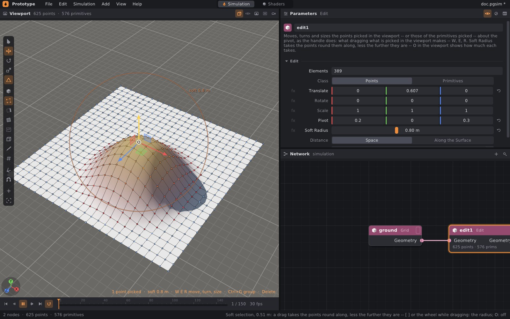

Nastavení měkkého výběru jsou parametry Editu: nový Edit je dostane
z viewportu a u zobrazeného Editu téhož výběru viewport ukazuje a mění
jeho vlastní. Pravý klik › *Soft Selection*, *Soft Distance*, *Soft
Falloff*; tlačítko s kopečkem v liště pod nástroji.

**Distance** — jak daleko bod je:

| Volba | Vzdálenost |
|---|---|
| Space | přímo prostorem k nejbližšímu vybranému bodu |
| Along the Surface | po povrchu, přes hrany: list ležící nad jiným, vedlejší kus, který se nedotýká, nebo druhá strana ohnutého pásu zůstanou, kde jsou |

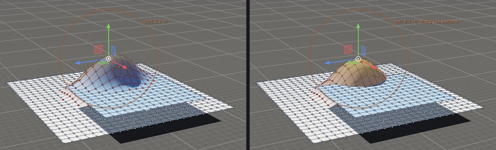

**Falloff** — tvar útlumu, `x` je vzdálenost dělená poloměrem:

| Volba | Podíl pohybu | Tvar |
|---|---|---|
| Smooth | `(1 − x²)²` | kopec, plochý nahoře i u paty (výchozí) |
| Linear | `1 − x` | kužel |
| Sharp | `(1 − x)²` | špička |
| Sphere | `√(1 − x²)` | kupole, strmá u okraje |
| Constant | `1` | celý pohyb až do poloměru |

## 5. Skupina a mazání

**Ctrl+G** vloží uzel **Group** se jménem `group1` (první, které
geometrie ještě nemá), třídou a vzorem vybraného. Jméno přepište
v parametrech. Skupina hran je skupinou jejich bodů — geometrie jádra
skupiny hran nemá.

**Delete** vloží uzel **Blast**:

| Vybráno | Co zmizí |
|---|---|
| body | body a primitivy, které o bod přijdou |
| primitivy | primitivy a body, které používaly jen ony |
| hrany | primitivy, jejichž jsou stranou (jako *Delete Edges* v Blenderu) |

Blast umí i obráceně (Keep): nechat jen vybrané.

## 6. Štětec: Attribute Paint

**P** nad viewportem maluje do zobrazeného uzlu **Attribute Paint**;
pokud zobrazený uzel žádný Attribute Paint není, vloží se za něj nový
a vybere se, takže jeho parametry jsou hned po ruce:

| Parametr | Co dělá |
|---|---|
| Attribute | co se maluje — `pin`, `tear`, `mass`… (`@pin` ve wranglu) |
| Value | co štětec nanáší |
| Erase Value | co nanáší s **Ctrl** |
| Radius | velikost štětce (**[** **]**, **Shift**+kolečko) |
| Strength | kolik z hodnoty kapka nanese uprostřed |
| Default | kde body začínají, když atribut ještě nemají |
| Strokes | namalované kapky: kolik jich je, a **Clear** |

Tah klade **kapky** po čtvrtině poloměru. Každá kapka je koule: bod
uvnitř se posune k hodnotě kapky o `Strength × (1 − d²/r²)²`, uprostřed
nejvíc, na okraji vůbec; kapky se nanášejí v pořadí, v jakém byly
namalované. Tah smí začít mimo geometrii — maluje, kde štětec leží na
povrchu, a když z něj sjede a vrátí se, nezačne malovat přes díru.

Kapky jsou **místa, ne čísla bodů**: zjemněte mřížku před Attribute
Paint a barva zůstane, kde byla. Celočíselný atribut zůstane celočíselný
(zaokrouhlený).

Během malování je geometrie obarvená podle malovaného atributu: modrá
0, přes tyrkysovou a žlutou do červené 1 (větší hodnoty než 1 se
zmenšují podle největší). Kroužek štětce leží na povrchu pod myší.
**P** znovu (nebo Q, W, E, R, 1–4) malování ukončí; uzel, který P
vložilo a do kterého se nic nenamalovalo, zase zmizí.

Pro látku ([cloth.md](cloth.md)): bod s `pin` nad 0,5 je přišpendlený,
`tear` násobí mez trhání (0,5 se trhá dvakrát dřív — perforace), `mass`
je hmotnost bodu v kg. Příklad **shade_sail**: plachta napnutá mezi čtyři
sloupy, dva rohy zvednuté Editem s měkkým poloměrem, rohy přišpendlené
čtyřmi kapkami `pin`; vítr ji nafukuje.

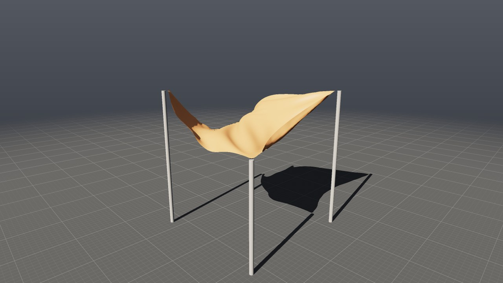

## 6a. Jakýkoli uzel na vybraném: Tab

**Tab** nad viewportem otevře nabídku geometrických uzlů s hledáním (jako
Tab v síti). Vybraný uzel se vloží za zobrazený a — pokud má parametr
Group — dostane do něj vybrané prvky jako vzor; kde má třídu (Points /
Primitives), dostane naši. Uzly, které pracují na své třídě, si výběr
převedou: **PolyExtrude** a **Primitive Wrangle** berou plochy (z bodů
plochy, jejichž všechny body jsou vybrané), **Point Wrangle** body (z ploch
jejich rohy). Hrany zůstávají hranami (`p3-4`). Uzly bez Group jsou
v nabídce níž a vloží se jen za zobrazený. Nabídka je i v pravém kliku
(*Node on Picked*, *Extrude Picked*).

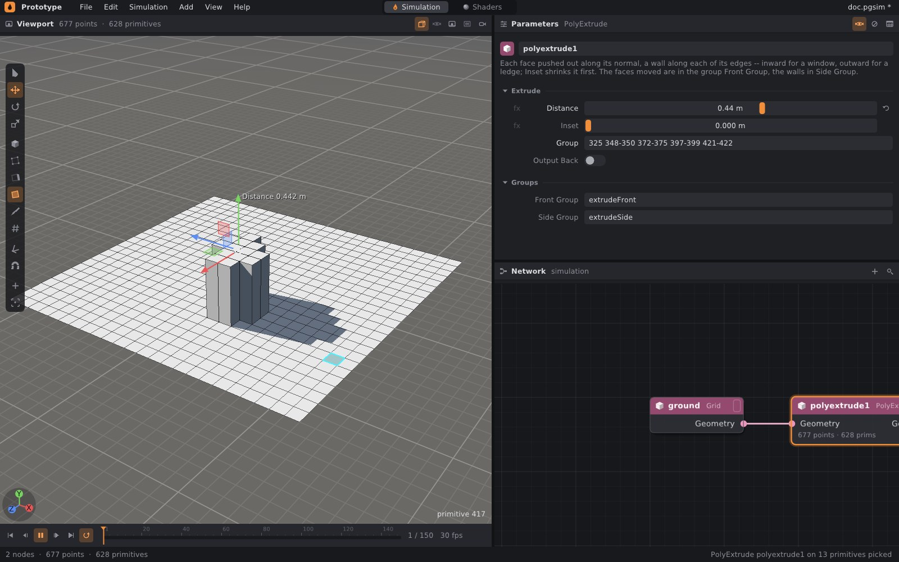

**PolyExtrude** zobrazený ve viewportu má vlastní úchyt: šipka
z vytažených ploch (skupina Front Group) podél jejich normály. Tažení
mění **Distance** (Ctrl přichytává, Esc vrací). Vytažením se mění
topologie, takže výběr ploch zmizí a zůstane úchyt uzlu.

**N** vypíše čísla bodů, v režimu primitiv čísla primitiv (u středu
plochy). Jen ta, která jsou vidět, nejvýš 3000 na obrazovce — při víc
ukáže výzvu přiblížit se.

## 6b. Úchyty geometrických uzlů

V režimu objektů (**1**) má úchyt i vybraný geometrický uzel — klikněte
na něj v síti, **W**, **E**, **R** a táhněte; hodnoty se píšou do jeho
parametrů (na aktuálním snímku, s klíči jako u objektů):

| Uzel | Posun | Otočení | Měřítko |
|---|---|---|---|
| Box | Center | — | Size |
| Sphere | Center | — | Radius |
| Tube | Center | — | Radius, Height |
| Grid, Point Cloud | Center | — | — |
| Line | Origin | Direction | — |
| **Clip** | Origin (bod roviny) | Direction (normála roviny) | — |
| **Transform** | Translate | Rotate | Scale |
| **Edit** | Translate | Rotate | Scale |

Transform a Edit mají úchyt **v pivotu** (Pivot + Translate): tam, kolem
čeho se geometrie otáčí a zvětšuje — u Transformu třeba pata věže, která
má padnout. Otočení úchytem tak otáčí kolem něj a měřítko jde podél os
uzlu. Pivot samotný úchyt nemění; nastavte ho v parametrech. Kopie
geometrického uzlu (**Ctrl+D**) zůstane, kde byl originál — posune se jen
kopie objektu nebo zdroje, aby neležela v originálu.

## 6c. Sculpt: tvarování štětcem (U)

**U** nad viewportem tvaruje zobrazenou geometrii štětcem, jako hlínu —
podobně jako sculpt v Blenderu nebo ZBrushi, jen výsledkem je zase
obyčejný uzel **Sculpt** za zobrazeným uzlem (když zobrazený uzel žádný
Sculpt není; jinak tvaruje do něj). Tah po geometrii ji pod kroužkem
vytlačuje ven a s **Ctrl** zatlačuje dovnitř; se **Shift** uhlazuje, ať
je vybraný kterýkoli nástroj. Nástroj se vybírá v parametrech uzlu nebo
v pravém kliku › *Sculpt Tool*:

| Nástroj | Co kapka udělá s bodem ve vzdálenosti *d* od svého středu (poloměr *r*, útlum *f* = Falloff(*d*/*r*)) |
|---|---|
| **Push / Pull** | posune ho podél normály povrchu pod středem kapky o `Strength × 0,2 × r × f`; s Ctrl dovnitř |
| **Smooth** | posune ho k průměru jeho sousedů po hranách o podíl `Strength × f` |
| **Grab** | vezme ho s sebou: o to, kam se myš od začátku tahu posunula, krát `f` |
| **Flatten** | srovná ho k rovině středem kapky kolmé na normálu o podíl `Strength × f` |

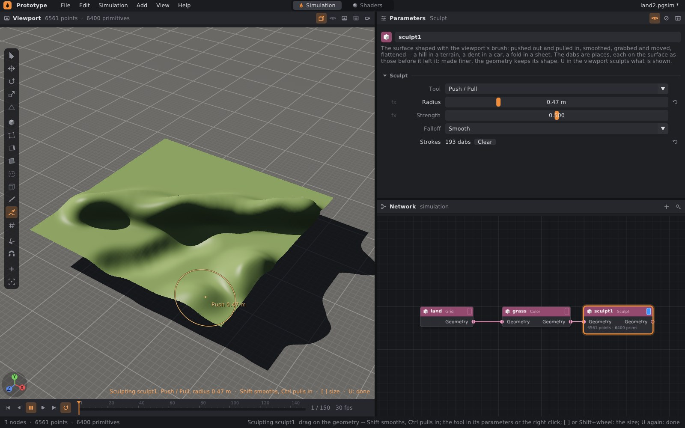

| Parametr | Co dělá |
|---|---|
| Tool | Push / Pull, Smooth, Grab, Flatten |
| Radius | velikost štětce (**[** **]**, **Shift**+kolečko); nový uzel dostane dvanáctinu velikosti geometrie |
| Strength | Push: při 1 vytlačí střed kapky o pětinu poloměru (0 až 4); Smooth a Flatten: jaký podíl cesty bod ujde (0 až 1) |
| Falloff | tvar útlumu k okraji kroužku, jako u měkkého výběru (§4a): Smooth, Linear, Sharp, Sphere, Constant |
| Strokes | kapky: kolik jich je, a **Clear** |

Tah klade kapky po čtvrtině poloměru a každá pracuje s povrchem, jak ho
nechaly kapky před ní — tah přes vlastní kopec ho zvedá dál, normála se
bere z povrchu pod středem kapky. Kapky jsou **místa, ne čísla bodů**:
zjemněte síť před Sculptem a tvar zůstane, jen jemnější. Kroužek má
barvu a popisek podle nástroje (`Push 0.47 m`, `Pull`, `Smooth`…).

**Grab** je na celý tah jedna kapka: místo, kde tah začal, a posun myši
v rovině kolmé k pohledu. Kopec jde za myší, čára ukazuje odkud; **Esc**
během tahu Grab vrátí.

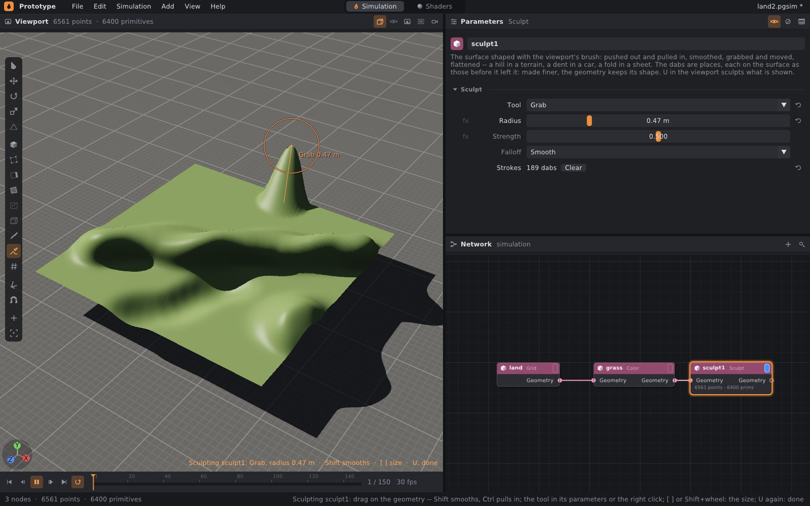

Uhlazování drží **okraje**. Bod na otevřeném okraji plochy (strana jediné
plochy) se hýbe jen podél okraje, k průměru svých dvou sousedů na okraji;
roh okraje — kde okraj uhne o víc než 30° —, bod, kde se okraje potkávají,
a konce čar zůstanou, kde jsou. Co je roh, se rozhoduje podle tvaru, jak
do Sculptu přišel, takže ho tah neuhladí pryč. Okraj mřížky se tak
neroztřepí a rohy se nezakulatí.

Kde geometrie má normály `N`, Sculpt je dopočítá z ploch. Během sculptu
viewport nekreslí drát, aby byl tvar vidět. **U** znovu (nebo Q, W, E, R,
1–4) sculpt ukončí; uzel, který U vložilo a do kterého se nic
nevytvarovalo, zase zmizí.

## 7. Vzory prvků

Parametry Group, Edit, Blast, PolyExtrude a wranglů berou prvky jako **vzor**, jako skupinová
pole uzlů v Houdini. Viewport je tak píše a dají se psát i ručně:

| Vzor | Co vybere |
|---|---|
| `0-9 12 20-30` | čísla a rozsahy (rozsah i obráceně: `9-0`) |
| `*` | vše |
| `pin_group` | skupinu podle jména; skupina druhé třídy se převede (body primitiv, primitivy se všemi body ve skupině) |
| `p3-4` | hranu mezi body 3 a 4; pro body oba body, pro primitivy ta, jejichž je stranou |
| `p0-1-2-3` | cestu tří hran |
| `^…` | ubere: `* ^0-9` je vše kromě prvních deseti |

Položky se oddělují mezerami nebo čárkami a platí popořadě. Co nic
nepojmenuje (číslo za posledním, skupina, která není, hrana, kterou
geometrie nemá), nevybere nic. Viewport píše nejkratší vzor: rozsahy čísel
a hrany spojené do cest (`p0-1-2-3-4 p9-10`).

## 8. Jak to funguje

- **Vzory** — `src/pg/core/Selection.h`: `selectElements` (vzor → maska
  bodů nebo primitiv), `patternOf`, `edgesOf`, `selectEdges`,
  `edgePatternOf`.
- **Co je pod myší** — `src/pg/core/Pick.h`, `ElementPicker`: polygony
  rozložené na trojúhelníky (vějíř), strom obálek (BVH, dělení mediánem,
  listy po čtyřech). Paprsek najde nejbližší plochu; stejně daleké plochy
  rozhoduje pořadí trojúhelníků, takže výsledek nezávisí na tom, jak se
  strom rozdělil. Prvek je vidět, když paprsek od oka k němu nepotká
  plochu blíž než 0,1 % vzdálenosti před ním. Obdélník, laso i tah štětce
  jsou `ScreenRegion` (část obrazovky) a vyhodnocují se na více vláknech,
  prvek po prvku. Laso je mnohoúhelník s pravidlem sudý–lichý; jeho
  strany jsou roztříděné do vodorovných pásů, takže bod se ptá jen stran
  svého pásu (laso o stovkách bodů nad statisíci bodů geometrie je
  rychlé). Tah štětce za jeden snímek je kapsle: úsečka od minulé polohy
  myši k nynější s poloměrem kroužku; hrana se jí dotkne, když se úsečky
  přiblíží na poloměr, a viditelnost se ptá v místě dotyku. Plochy pod
  středem štětce najdou paprsky po půl poloměru podél tahu. Strom se staví
  jen pro nové body nebo topologii: malováním se geometrie mění, ale
  sdílí body (copy-on-write), a strom zůstává. Když se body jen posunou
  (sculpt, tah úchytem) a topologie zůstane, strom si nechá tvar a znovu
  spočítá jen obálky (refit) — na milionu bodů 40 ms místo 1,2 s; co najde
  dotaz, na tvaru stromu nezávisí. Když obálky narostou nad čtyřnásobek
  plochy, kterou měly, postaví se strom znovu.
- **Značky** — overlay rendereru (`gl::Overlay`): drát, body, výběr,
  zvýraznění pod myší (vlastní vrstva, aby pohyb myši nepřestavoval
  zbytek) a barvy malování, kreslené s testem hloubky proti scéně, kousek
  blíž k oku než povrch. Tečka se přitáhne o tolik, kolik z povrchu kolem
  sebe pokrývá — víc, když je povrch vidět šikmo — takže ji povrch
  neusekne. Široké čáry jsou dva trojúhelníky (core profil OpenGL širší
  čáry než pixel nemá). S **H** se značky kreslí dvakrát: nejdřív
  s obráceným testem hloubky (jen to, co povrch zakrývá) a průhlednosti
  0,3, pak normálně. Rendery záběru značky nemají.
- **Měkký výběr** — `src/pg/core/Soft.h`, `softWeights`: podíl pohybu
  každého bodu, stejný pro uzel Edit i pro tónování ve viewportu. Přímá
  vzdálenost hledá nejbližší vybraný bod stromem bodů. Po povrchu jde
  fronta od všech vybraných bodů naráz přes hrany (Dijkstra, stejně
  vzdálené body popořadě podle čísel — výsledek je pokaždé stejný); bod si
  pamatuje vybraný bod, od kterého k němu cesta vedla, a vzdálenost je
  přímá čára k němu, dokud cesta vede od něj dál — na rovném listu je tak
  útlum kulatý, ne kosočtverec kroků po hranách — a délka hran tam, kde se
  povrch ohne zpátky k němu. Viewport tónuje podle geometrie, kterou
  zobrazený Edit dostává na vstupu (kooker ji vrací spolu se zobrazenou),
  takže náhled odpovídá tomu, co Edit spočítá, i během tahu.
- **Sculpt** — `src/pg/core/Sculpt.h`: `SculptDab`, `parseSculpt`,
  `sculpt`, `Sculptor`. Body v dosahu kapky najde mřížka buněk velkých
  jako typický poloměr kapek, ve které se bod přestěhuje, když se
  posune do jiné buňky; při pár kapkách je rychlejší zeptat se rovnou
  všech bodů (na více vláknech). Body jedné kapky se posunou najednou,
  každý podle toho, kde byly body před kapkou — na pořadí nezáleží a velká
  kapka se počítá na více vláknech. Uhlazování zná sousedy z `Adjacency`
  a okraje (strany jediné plochy) z geometrie, jak do uzlu přišla.
  **Přírůstkově**: uzel si pamatuje vstup, kapky, geometrii po všech
  kapkách a před poslední. Tah, který přidá kapku nebo dvě, spočítá jen
  je; Grab, který mění jen poslední kapku, jen ji. Undo celého tahu
  spočítá kapky znovu od začátku. Výsledek je do bitu týž jako ze všech
  kapek od začátku (testy to ověřují). Na mřížce o milionu bodů: 2 000 kapek od
  začátku 0,17 s, pohyb myši v tahu 12 ms (s normálami `N` 33 ms), Grab
  3 ms. V editoru pak při každém pohybu přibude refit stromu pro výběr
  a nová geometrie ve viewportu: ten kreslí polygony indexovaně a při
  posunu bodů na GPU pošle jen polohy a normály vrcholů — na 90 000 bodech
  6 ms, na milionu 62 ms (s normálami `N` 7 ms); viz
  [geometry.md](geometry.md#3-display-flag-a-viewport).
- **Skládání úprav** — `sim::EditTransform` (`src/pg/sim/Shape.h`):
  Edit dělá `x → R S (x − p) + p + t`; tah úchytu kolem středu `c`
  složený za něj je znovu Edit: otočení předřazené `R`, měřítko násobí
  `S`, `t` vezme `p + t` tam, kam ho vezme tah. Testy ověřují, že to
  platí bod po bodu a že Edit v uzlu počítá totéž.
- **Uzly** — `src/pg/nodes/Edit.cpp`: `groupcreate`, `edit`,
  `attribpaint`, `sculpt`; Blast v `Modifiers.cpp`. Attribute Paint
  nanáší kapku po kapce jen na body v jejím dosahu (strom bodů), takže
  tisíce kapek na jemné síti jsou rychlé.
- **Editor** — `tools/prototype/SimElements.cpp`; úchyty uzlů
  (`sim::Handles` v `src/pg/sim/Network.h`, s polem `pivot` pro úchyt
  v pivotu) v `SimViewport.cpp`.

Geometrie ležící na podlaze (mřížka v y = 0) se s podlahou už nebije:
plocha geometrie vyhrává, když je stejně daleko jako podlaha.

## 9. Omezení

- Upravuje se **zobrazená geometrie**, ne výsledek simulace: piny se malují
  na vstup Cloth Solveru, ne na spočítanou látku.
- Výběr, Edit, Group a Blast drží **čísla** bodů a primitiv. Změna před
  nimi, která body přečísluje (jiný počet řad mřížky), posune, co
  pojmenovávají. Malování to nepostihne — kapky jsou místa.
- Zakrývání bere v úvahu jen vlastní povrch zobrazené geometrie, ne
  objekty ani kusy před ní.
- Zatím chybí režim vrcholů (rohů), *Dissolve* hran a symetrie (ani
  sculpt ji nemá). Měkký výběr má jen úchyty (posun, otočení, měřítko).
  Úchyt nemají uzly bez polohy v prostoru (Subdivide, Fuse…) ani Group by
  Box (dva rohy).
- Sculpt body posouvá, nepřidává je: jemný detail chce jemnou síť
  (Subdivide před Sculptem); síť, která se sama zjemňuje pod štětcem
  (dyntopo, jako v Blenderu), není. Změna čehokoli před Sculptem nebo
  jeho Falloff spočítá všechny kapky znovu od začátku.
- Drát a všechny body se kreslí do 400 000 hran či bodů; ve větší geometrii
  jen výběr. První výběr v síti milionů trojúhelníků postaví strom obálek
  (řádově sekunda).
