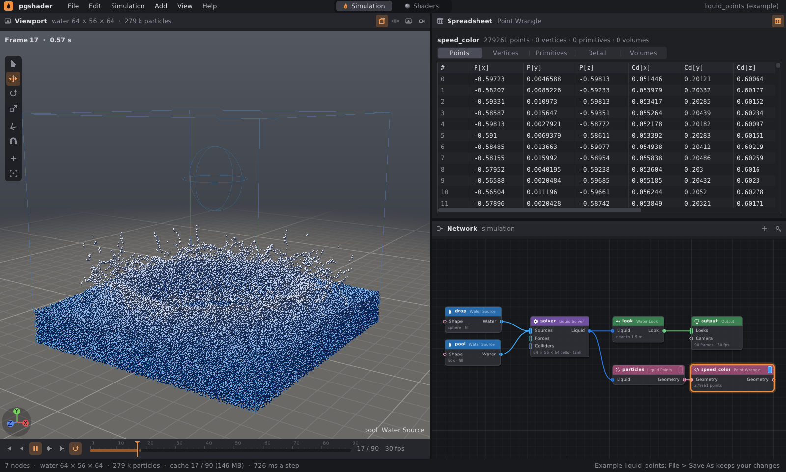
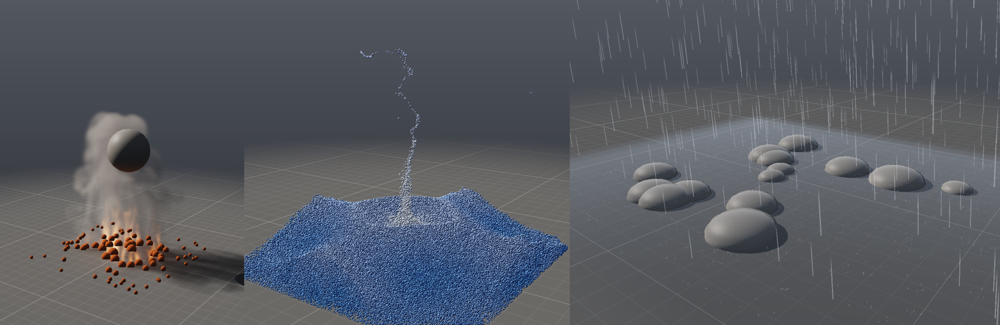
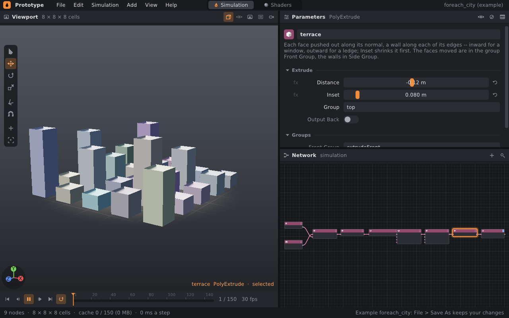

# Geometrie v síti: uzly jako SOP v Houdini

Síť simulace (editor `prototype`, soubory `.pgsim`) má kategorii
**Geometry**: uzly, které geometrii vyrábějí a upravují — krychle, koule,
mřížka, rozházené body, transformace, kopie na body, wrangle… Počítá je
geometrické jádro (`src/pg/core`, viz [ARCHITECTURE.md](../ARCHITECTURE.md)),
stejné, na kterém stojí `pgdemo`. Geometrie se:

- **ukazuje ve viewportu** — uzel s *display flagem* (modrý praporek na
  pravém konci uzlu) — a v **tabulce atributů** (Geometry Spreadsheet);
- **stává tvarem simulací** — vstup *Shape* objektu (překážky), zdroje
  kouře a zdroje vody;
- **vrací ze simulací** — částice vody, kapky deště a mřížky plynu jako body
  a objemy, které jdou dál upravovat dalšími uzly;
- **exportuje** — do PLY, OBJ a OpenVDB, snímek po snímku
  ([cache.md](cache.md)).





## 1. Rychlý start

```bash
./build/prototype --example liquid_points      # částice vody jako body, wrangle je barví
./build/prototype --example scatter_fire       # oheň z bodů rozházených po mřížce
./build/prototype --example rock_garden        # kameny z kopií koule, déšť na nich
./build/prototype --example foreach_city       # městský blok: smyčka For-Each přes 25 věží
./build/prototype sim rock_garden rocks.png    # bez okna: poslední snímek do PNG
./build/prototype sim liquid_points out/p.png --every 5 --set look.surface=on
```

`prototype sim` kreslí i zobrazenou geometrii. Síť, která nic nesimuluje
(jen geometrie, bez uzlu Output), vykreslí zobrazenou geometrii s pohledem
nastaveným na ni.

## 2. Uzly

| Uzel | Co dělá |
|---|---|
| **Box**, **Sphere**, **Tube** | Uzavřené tělo z polygonů, stěny otočené ven (normála podle Newella); krychle s dělením stěn, koule z pásů, válec s víky |
| **Grid** | Mřížka čtyřúhelníků v rovině xz, stěny nahoru (+y) |
| **Line** | Otevřená lomená čára bodů |
| **Point Cloud** | Volné body v krychli, stejné pro stejné seed |
| **File** | Body, polygony a čáry ze souboru OBJ; relativní cesta od složky sítě; soubor, který se změní, se načte znovu |
| **Transform** | Posun, rotace, měřítko po osách a celkové; rotace a měřítko kolem bodu **Pivot** (třeba hrany, přes kterou se věc převrací) |
| **Merge** | Spojí geometrie ve vstupu, který bere libovolně spojů — v pořadí spojů |
| **Switch** | Pustí dál jeden ze vstupů podle indexu |
| **Attribute Create** | Atribut jedné hodnoty (číslo nebo vektor) na bodech, rozích, primitivech nebo celé geometrii |
| **Color** | Barva `Cd` bodů nebo primitiv |
| **Group Box** | Skupina bodů uvnitř krabice |
| **Group** | Skupina bodů nebo primitiv podle vzoru — čísla a rozsahy `0-9 12`, hrany `p3-4`, jiné skupiny, `*`, `^` ubírá; **Ctrl+G** ve viewportu ji udělá z vybraného ([editing.md](editing.md)) |
| **Blast** | Smaže body vzoru (skupina, čísla, hrany) i s primitivy, které ztratí bod — nebo primitivy i s body, které používaly jen ony; nebo naopak nechá jen je (Keep). **Delete** ve viewportu ho udělá z vybraného |
| **Edit** | Posune, otočí a zvětší body vzoru — nebo body jeho primitiv — kolem Pivot; Soft Radius vezme s sebou i body kolem, tím méně, čím dál jsou — vzdálenost přímo, nebo po povrchu (Distance), tvar útlumu Falloff. Co udělá úchyt (W E R) na vybraném ve viewportu, s měkkým výběrem (O) |
| **Attribute Paint** | Číslo namalované na body štětcem ve viewportu (**P**): kapky jako místa (x y z poloměr hodnota síla), v pořadí; `pin`, `tear`, `mass` pro látku |
| **Sculpt** | Tvar ze štětce ve viewportu (**U**): vytlačit a zatlačit (Push / Pull), uhladit (Smooth, okraje drží čáru), chytit a táhnout (Grab), zarovnat do roviny (Flatten); kapky jako místa, každá na povrchu, jak ho nechaly kapky před ní; tah se počítá přírůstkově, jen z nových kapek |
| **Point / Primitive / Detail Wrangle** | Kód nad každým bodem, primitivem, nebo jednou nad celou geometrií: posouvá, barví, vyrábí atributy, čte sousedy a další vstupy, staví a maže geometrii ([wrangle.md](wrangle.md)) |
| **Normal** | Normály bodů `N`, průměr stěn kolem bodu vážený plochou |
| **Scatter** | Body rozházené po polygonech úměrně ploše, deterministicky podle seed; barvy a další atributy se interpolují z rohů, `N` ze stěny |
| **Copy to Points** | Kopie geometrie na každý bod druhého vstupu: velikost `pscale` × Scale, natočená podle `orient` bodu (kvaternion x, y, z, w — třeba drti z RBD Pieces), jinak +y do `N` (Align), s atributy bodu (kromě P, N, pscale, orient) |
| **Null** | Nic nemění: jméno, na které se dá ukázat, konec řetězce |
| **Connectivity** | Očísluje souvislé kusy (primitivy, které sdílejí body, jsou jeden kus): celočíselný atribut `class` na primitivech nebo bodech, kusy od 0 v pořadí prvních primitiv |
| **Fuse** | Body blíž než Distance spojí v jeden (uprostřed nich), primitivy je následují; co se zhroutí (trojúhelník ze dvou bodů), zmizí |
| **PolyExtrude** | Každou stěnu (nebo stěny skupiny či vzoru `0-9 12` — Tab ve viewportu ho vyplní vybranými plochami; šipka ve viewportu mění Distance) vytáhne podél normály, s bočními stěnami podél hran: dovnitř okno, ven římsa; Inset ji předtím zmenší o pevnou vzdálenost od hran; Output Back nechá i původní stěnu (uzavřené těleso); skupiny `extrudeFront` a `extrudeSide` |
| **Subdivide** | Catmull-Clark: každá stěna na čtyřúhelníky, body posunuté do hladkého tvaru; volné hrany drží svou čáru a rohy mřížky zůstávají; atributy bodů jdou s nimi, rohů lineárně |
| **Clip** | Nechá to, co je na jedné straně roviny: stěny rozřízne podél ní a s Cap uzavřené těleso zase uzavře stěnou v rovině (skupina `cut`); nekonvexní řez rozloží na trojúhelníky — z obou stran roviny na tytéž, takže víčka dvou polovin lícují |
| **Attribute Transfer** | Atributy bodů z druhého vstupu (Source) na body blízko nich: do Distance vážený průměr bodů, dál slábnoucí přes Blend Width; celá čísla a řetězce od nejbližšího |
| **For-Each Begin / End** | Smyčka: uzly mezi nimi běží pro každý kus, primitivum nebo bod — nebo Count krát, nebo Feedback (každý běh na výsledku předchozího); viz níže |
| **Convert Volume** | Povrch objemu jako polygony: tam, kde hodnoty překročí Iso, uzavřená síť čtyřúhelníků otočených ven, s normálami `N`; uzavřená i tam, kde objem končí. Uvnitř jsou hodnoty nad Iso (hustota, kouř) nebo pod ním (vzdálenost, záporná uvnitř). Viz níže |
| **Liquid Points** | Částice vody z Liquid Solveru: `P`, rychlost `v`, pěna `foam`, číslo `id` (stejné ze snímku na snímek) |
| **Liquid Surface** | Voda z Liquid Solveru jako povrch, ze kterého ji renderer renderuje: uzavřená síť kolem ní s normálami `N`, rychlostí `v` a pěnou `foam`; s Ripples i vlnky od deště. Viz níže |
| **Rain Points** | Kapky deště a kapičky odstřiků: `P`, `v`, `droplet` (1 u kapičky), `id` (kapičky od 2³⁰) |
| **Gas Volume** | Plyn z Pyro Solveru jako tři objemy: `density` (kouř), `temperature`, `flame` |
| **Voronoi Fracture** | Uzavřené těleso rozřezané na kusy — buňky bodů z druhého vstupu, nebo Count náhodných uvnitř — každý uzavřený, s číslem `piece` a řeznými plochami ve skupině `inside`; viz [destruction.md](destruction.md) |
| **RBD Pieces** | Kusy z RBD Solveru tam, kam ve snímku dopadly: body posunuté a otočené, rychlost `v`; s `grit` i drť jako body (`pscale`, `v`, `id`) |

Geometrické uzly se dají **obejít** (bypass, B): obejitý uzel pustí dál,
co do něj vstupuje. Síť odmítne spoj, který by udělal smyčku.

### Wrangle

Snippet wranglu je **kód** — víceřádkové pole s neproporcionálním písmem;
použije se, když se klikne jinam. Chyba v kódu je u uzlu vidět (červený
odznak, text v parametrech i v tabulce), varování žlutě.

```c
@Cd = vec3(0.05, 0.2, 0.6) + vec3(0.9, 0.75, 0.4) * clamp(length(@v) / 2.5, 0, 1);
@pscale = 0.6 + 0.9 * abs(noise(@P * 2.5));
```

Jazyk má proměnné, podmínky, cykly, vlastní funkce, pole a řetězce; čte
libovolné prvky a další vstupy (`point(1, "P", @ptnum)`, `nearpoints()`),
staví a maže geometrii (`addpoint()`, `removeprim()`) a `ch("jméno")` z něj
udělá posuvník uzlu. Celý popis je v [wrangle.md](wrangle.md).

### Smyčky For-Each



Uzly mezi **For-Each Begin** a **For-Each End** běží jednou pro každý kus
toho, co do Begin vstupuje. End výsledky spojí, jako Merge, v pořadí kusů:

```
[Grid] ─┐
[Box] ──┴→ [Copy to Points] → [Connectivity] → [For-Each Begin] → [height] → [top] → [terrace] → [For-Each End]
                                                     └──────── jednou pro každou krabici ────────┘
```

**Method** v Begin určuje, co každý běh dostane:

| Method | Každý běh dostane |
|---|---|
| **Pieces** | primitivy (nebo body) jedné hodnoty atributu **Piece Attribute** — výchozí `class`, který dá Connectivity; kusy v pořadí hodnot |
| **Primitives** | jedno primitivum |
| **Points** | jeden bod |
| **Count** | celý vstup, Count krát |
| **Feedback** | Count krát, pokaždé výsledek předchozího běhu; End vydá poslední |

Každý kus nese atributy detailu `iteration` (od 0), `numiterations`
a `value` (hodnota atributu kusu, nebo číslo prvku). Wrangle v těle smyčky
je čte funkcí `detail()`:

```c
int i = detail(0, "iteration");
float h = 0.5 + 2.5 * pow(rand(i * 7.31 + 0.5), 3);   // každá věž jiná, pořád stejně
@P.y *= h;
```

- **Begin samotný** vydá první kus. Uzly těla tak při editaci ukazují jeden
  kus a smyčka běží jen v End, jako „single pass“ v Houdini.
- End najde svůj Begin sám (nejbližší proti proudu), nebo podle jména
  v parametru **Begin**. Když chybí, End napíše proč.
- **Tělo** smyčky jsou všechny uzly proti proudu od End až po Begin. End si
  je zkopíruje do vlastní sítě (místo Begin do ní vstupuje kus) a vaří je
  ve vlastním grafu, kus po kusu. Změna uzlu v těle nebo vstupu smyčku
  přepočítá, beze změny se nevaří nic.
- Výsledek je stejný na 1 i 4 vláknech. Kusy běží po sobě; uvnitř každého
  kusu pracují uzly paralelně jako jinde.
- Smyčky jde vnořovat: tělo může obsahovat další dvojici Begin/End.
- Výrazy v parametrech uzlů těla nevidí číslo běhu. Pro hodnoty, které se
  liší kus od kusu, slouží wrangle a `detail()`.

## 3. Display flag a viewport

Každý geometrický uzel má na pravém konci praporek. Klik na něj (nebo **R**
nad sítí) z uzlu udělá **zobrazený**: jeho geometrie je ve viewportu,
v renderech a v `prototype sim`. Klik na praporek zobrazeného uzlu zobrazení
vypne. Zobrazený je vždy nanejvýš jeden uzel; nově přidaný geometrický uzel
dostane praporek, když není zobrazené nic — nebo když navazuje na ten
zobrazený (přidaný tažením spoje z jeho výstupu), jako další krok řetězce.
Praporek se ukládá do souboru.

Jak se geometrie kreslí:

- **polygony** — trojúhelníky (vějíř přes každý uzavřený polygon), osvětlené
  sluncem a oblohou jako objekty scény, se stínem kouře a objektů; barva
  z `Cd` rohu, jinak bodu, primitiva, celé geometrie, jinak světle šedá;
  normály z `N` bodů, jinak z plošek kolem rohu, které se od něj ohýbají
  méně než o 60° (koule vypadá kulatě, krychle má hrany);
- **otevřené čáry** — úsečky v barvě `Cd`;
- **body, které nepoužívá žádný polygon** — kulaté tečky stínované jako
  kuličky; s `pscale` mají poloměr `pscale`, jinak pár pixelů;
- **objemy** — rámeček kolem a tečka v každém neprázdném voxelu, od modré
  přes purpurovou k žluté podle hodnoty; u velkých objemů jen každý druhý,
  třetí… voxel (tečky jsou pak větší), z objemů nejvýš 400 tisíc teček.

Klávesa **F** bez výběru zarámuje i zobrazenou geometrii; když síť nic
nesimuluje, kamera ji zarámuje sama.

Zobrazenou geometrii jde upravovat přímo ve viewportu — vybrat myší body
(**2**), hrany (**3**) nebo plochy (**4**), posunout je úchytem, udělat
z nich skupinu, smazat je, namalovat atribut štětcem (**P**), tvarovat ji
štětcem (**U**). Každá úprava je uzel za zobrazeným (Edit, Group, Blast,
Attribute Paint, Sculpt): viz [editing.md](editing.md).

Water Look má přepínač **Surface**: vypnutý hladinu nekreslí — voda se
simuluje dál a je vidět jen to, co z ní ukazuje síť (částice přes Liquid
Points).

## 4. Tabulka atributů

Tlačítko s tabulkou v záhlaví panelu parametrů přepne na **Geometry
Spreadsheet** — geometrii vybraného geometrického uzlu, jinak zobrazeného.
Nahoře počty (body, rohy, primitiva, objemy); pod nimi třídy:

- **Points** — `P` první, pak atributy podle jména, vektory po složkách
  (`P[x]`, `P[y]`, `P[z]`), a skupiny bodů jako sloupce 0/1;
- **Vertices** — bod každého rohu a atributy rohů;
- **Primitives** — uzavřené/otevřené, body primitiva, atributy;
- **Detail** — atributy celé geometrie;
- **Volumes** — jméno, rozlišení, velikost voxelu, počátek, minimum,
  maximum a průměr hodnot.

Řádky se kreslí jen viditelné (virtualizace), takže tabulka zvládne i
stovky tisíc bodů: částice vody se dají procházet za běhu simulace.

## 5. Geometrie jako tvar simulací

Objekt (Object), zdroj kouře (Pyro Source) a zdroj vody (Water Source) mají
vstup **Shape**. Když je v něm geometrie, je jejich tvarem místo vlastního:

- geometrie se vezme **ve snímku 1** (stejně jako tvary ze souborů: tvar
  během simulace nemění — pohyb přijde s animací);
- z uzavřených polygonů se udělá trojúhelníková síť a z ní pole
  vzdáleností (SDF, 64 buněk na nejdelší straně) — stejné jako u modelu
  z OBJ, takže objekt vrhá stín, kreslí se a srážejí se s ním plyn, voda
  i déšť;
- geometrie **bez polygonů** (jen body) dá kuličku kolem každého bodu:
  dvacetistěn o poloměru `pscale`, jinak 5 cm; nejvýš 20 000 bodů;
- vnitřek se určuje paprsky podél os a parita průsečíků se počítá **pro
  každou slupku zvlášť** (trojúhelníky spojené rohy na stejném místě);
  bod je uvnitř, je-li uvnitř kterékoli slupky. Překrývající se tvary —
  kuličky kolem bodů, kopie, sloučená tělesa — tak vyplní i svůj průnik.
  Slupka vnořená do jiné (dutina) se tím vyplní;
- stejná geometrie (podle obsahu, `hash`) dává stejnou síť — upéct se
  jednou, dokud ji někdo drží;
- prázdná geometrie → varování a místo ní vlastní tvar uzlu; geometrie ze
  simulace (Liquid Points…) tvarem být nemůže — simulace v té chvíli ještě
  neproběhla — a řekne to varování.

Parametry vlastního tvaru (tvar, poloha, rotace, velikost) pak platí jen
jako náhrada; gizmo ve viewportu takový uzel nehýbe — hýbe se uzly
geometrie (třeba Transform, nebo střed krychle). Souhrn uzlu ukáže „shape of
*jméno*“.

## 6. Simulace zpátky jako geometrie

**Liquid Points**, **Liquid Surface**, **Rain Points**, **Gas Volume** a **RBD Pieces** mají
vstup ze simulace (Liquid, Rain, Gas, Rigid) a na výstupu geometrii snímku,
který je právě vidět: v editoru z cache snímků, v `prototype sim` ze snímku právě
spočítaného. Za nimi jdou libovolné geometrické uzly — wrangle, color,
blast… — a výsledek se zobrazí nebo prohlíží v tabulce.

- Snímky simulace drží částice vody jen tehdy, když je nějaký Liquid
  Points napojený na simulovaný Liquid Solver (jinak by se jejich pozice
  a rychlosti ukládaly zbytečně: 19 bajtů na částici a snímek).
- Uzel napojený na řešič, který nevede do Output (a tedy se nesimuluje),
  dostane varování a je prázdný.
- Ze snímku, který ještě není spočítaný, je geometrie prázdná.

### Povrch vody (Liquid Surface) a Convert Volume

Houdini dělá z FLIP simulace povrch uzlem Particle Fluid Surface; tady je
to **Liquid Surface**. Snímek vody nese vzdálenost k hladině na mřížce
dvakrát jemnější než řešič (z ní kreslí vodu i viewport) a z ní vznikne
síť algoritmem *surface nets* (Gibson 1998):

- v každé krychli osmi buněk, kterou povrch protíná, je jeden bod — průměr
  míst, kde povrch protíná její hrany;
- přes každou hranu mezi buňkami, kterou povrch protíná, vede čtyřúhelník
  přes body čtyř krychlí kolem ní, otočený ven.

Vyjde uzavřená síť čtyřúhelníků s hladkými normálami (z ploch kolem bodu).
Je uzavřená i u podlahy a stěn nádrže: renderer potřebuje uzavřené těleso
vody, aby jím lámal světlo. Ostré hrany a rohy se zaoblí asi o čtvrt buňky.

- **`v`** je rychlost vody v místě bodu, z rychlosti, kterou snímek nese na
  mřížce řešiče (formát cache 5): podle ní renderer rozmaže pohyb. Snímek
  z cache starší než formát 5 ji nemá a síť je bez `v`.
- **`foam`** je pěna z téže jemné mřížky, 0 až 1.
- **Ripples:** vlnky, které dělá déšť, zvednou horní plochu (celou tam, kde
  hledí nahoru, stěny vůbec) a nakloní její normály.
  Vlnky užší než buňka jemné mřížky se ztratí.

Síť drží tolik vody, kolik je v poli vzdáleností pod nulou (test: do 5 %),
tedy trochu víc než samotná voda, protože koule kolem částic sahají kousek
za ni. V `rain_pond` s rozlišením 64 má povrch asi 35 tisíc bodů; snímek
i se sítí vody jde do USD za 0,06 s.

**Convert Volume** dělá totéž s libovolným objemem geometrie, třeba s kouřem
z Gas Volume (`density` nad 0,1). Oba uzly dávají stejné body na libovolném
počtu vláken.

## 7. Jak to funguje

Síť editoru a graf jádra jsou dvě různé věci: síť (`sim::Network`) je
model pro editor a soubory, jádro (`pg::Graph` + `CookEngine`) počítá.
Most mezi nimi je **`sim::GeometryGraph`** (`src/pg/sim/GeometryGraph.h`):

```
[Box] -> [Transform] -> [Scatter] ...      síť (Network.h)
  n3 ------> n4 -------> n7                 graf jádra, uzly "n<id>"
```

- `sync(net)` graf přizpůsobí síti: uzly, které zmizely nebo změnily typ,
  smaže (`Graph::remove`), nové vyrobí (`NodeType::core` říká typ jádra),
  nastaví parametry a propojí vstupy. **Parametr se nastaví jen tehdy,
  když se změnil** — nezměněný nic neznehodnotí, takže tah posuvníkem na
  konci řetězce padesáti uzlů přepočítá jeden uzel. Beze změny sítě je
  `sync` levný (porovná revizi), jen znovu zkontroluje velikost a čas změny
  souborů, které čtou File uzly.
- Obejitý uzel se ve spojích vynechá: co ho krmí, krmí to, co krmil on.
- Přepojování jde ve dvou krocích (nejdřív odpojit, pak zapojit), aby otočení
  A → B na B → A nevypadalo cestou jako smyčka.
- `cook(id, frame)` vyhodnotí uzel líně (pull): přepočítá se jen to, co je
  zastaralé. Cache jádra je klíčovaná (uzel, verze, snímek). **Verze jsou
  globální čítač**, takže uzel smazaný a vyrobený znovu na stejné adrese
  nemůže trefit starou položku cache.
- Uzly, které čtou simulaci (`FrameNode`), dostanou před vařením snímek
  pro dané číslo snímku. Co z kterého snímku udělaly, zůstává v cache
  jádra, dokud je snímek tentýž — přehrávání tam a zpátky se nepočítá
  znovu. Snímek simulovaný znovu (jiný objekt se stejným číslem) uzel
  znehodnotí.
- Chyby vaření (`Node::cookError()`) — soubor, který nejde přečíst, chyba
  ve wrangle — se ukazují u uzlů.

Editor drží jeden `GeometryGraph` po celou dobu: `compile()` z něj bere
tvary (a nevaří znovu, co je hotové) a viewport z něj každý snímek bere
zobrazenou geometrii. Pro GPU ji `sim::displayOf()` (`src/pg/sim/Display.h`)
převede na ploché pole trojúhelníků, teček a čar — na CPU a testovaně.
Polygony zobrazeného uzlu (ne sklo) jdou jinak: `sim::DisplayMesher` z nich
udělá **indexovanou síť** — rohy, které sdílejí bod, normálu a barvu, jsou
jeden vrchol, trojúhelníky jsou indexy vrcholů. Hladký povrch má zhruba
tolik vrcholů jako bodů, šestinu rohů; krychle 24 (tři na roh, kvůli
hranám). Když má nová geometrie stejnou topologii, barvy a sklo a posunuly
se jen body — tah sculptu, úchyt, animovaná vlna —, spočítají se znovu
jen polohy a normály vrcholů (paralelně) a na GPU jde jen tohle
(`glBufferSubData`). Kdyby ostrý přehyb rozdělil rohy, které byly jeden
vrchol, síť se udělá znovu celá. Obraz je týž, pixel po pixelu, jako
z trojúhelníků displayOf (porovnáno na devatenácti renderech: sculpt, město,
sklo, zeď s kusy, plachta, déšť, vlna po snímcích).

| Geometrie | displayOf (dřív) | síť poprvé | posun bodů | s normálami `N` |
|---|---|---|---|---|
| 90 000 bodů | 40 ms, 19 MB | 20 ms, 5 MB | 6 ms, na GPU 2 MB | 0,7 ms |
| milion bodů | 0,4–2 s, 215 MB | 0,25 s, 59 MB | 62 ms, na GPU 24 MB | 7 ms |
Trojúhelníky jdou do stejného G-bufferu jako modely z OBJ: normála, index
tělesa a vzdálenost na pixel; zobrazená geometrie má místo indexu barvu
zakódovanou jako záporné číslo (8 bitů na kanál), takže ji hlavní shader
nasvítí stejně jako objekty. Tečky jsou `GL_POINTS` s velikostí podle
`pscale`, stínované jako kulička, a čáry jdou stejným programem jako
vodítka.

## 8. Soubor .pgsim

Text parametru (Text, Code i cesta k souboru) se zapisuje v uvozovkách;
nové řádky, tabulátory, uvozovky a zpětná lomítka escapované (`\n`, `\t`,
`\"`, `\\`), takže `#` v kódu není komentář. Zobrazený uzel má řádek
`display`:

```
node 7 point_wrangle 1 speed_color 720 170
  param snippet "@Cd = vec3(0.05, 0.2, 0.6) + vec3(0.9, 0.75, 0.4) * clamp(length(@v) / 2.5, 0, 1)"
  display
link 6.geometry -> 7.geometry
```

## 9. Omezení

- Tvar z geometrie je statický (snímek 1); pohyblivé tvary přinese animace.
- Vnořené slupky (dutina uvnitř tělesa) se vyplní; otevřená plocha (grid)
  nemá vnitřek — jako překážka je tenká.
- Kulička kolem bodu je dvacetistěn a pole vzdáleností má 64 buněk na
  nejdelší stranu: malé body ve velkém mračnu jsou hrubé.
- Zobrazená geometrie nevrhá stín, neodráží se ve vodě a nedá se kliknutím
  vybrat ve viewportu.
- Objemy se kreslí jako tečky, ne jako kouř.
- Zobrazená geometrie se vaří na vlastním vlákně (`pg/sim/Cooker.h`)
  a okno na ni nečeká: dokud nová není hotová, viewport ukazuje
  předchozí a po chvíli napíše „cooking…“. Když se změní parametr během
  vaření, rozpracované vaření se přeruší (wrangle, smyčky, assety se
  vzdají uprostřed) a začne se znovu s novou hodnotou; nic z přerušeného
  vaření se neuloží do cache. Na vlákně okna se pořád vaří tvary pro
  simulaci (Shape objektů a zdrojů) a export.
