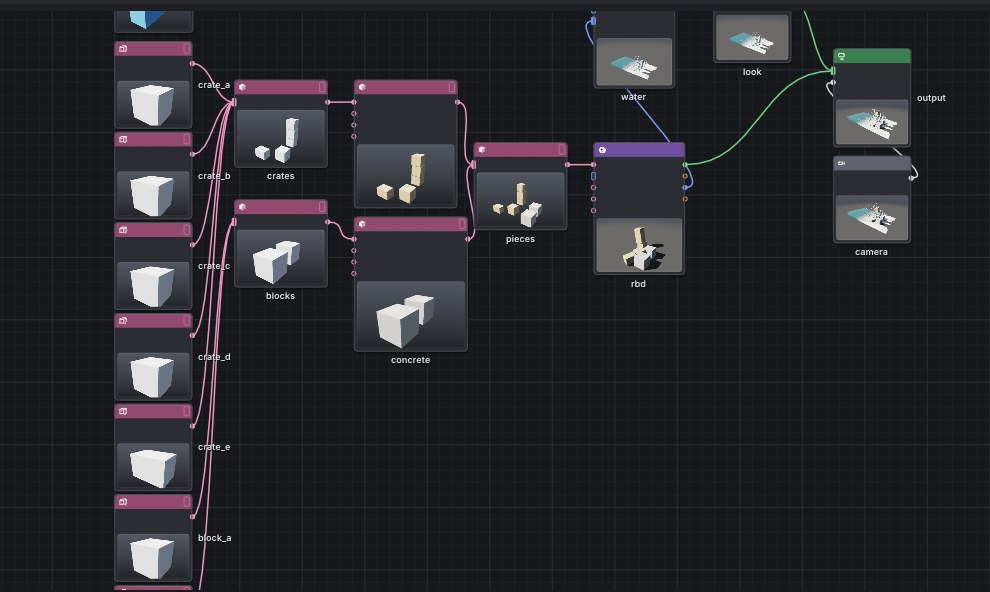

# Geometry in the network: nodes like SOPs in Houdini

The simulation network (the `prototype` editor, `.pgsim` files) has a
**Geometry** category: nodes that create and modify geometry — box, sphere,
grid, scattered points, transform, copy to points, wrangle… They are
computed by the geometry core (`src/pg/core`, see [ARCHITECTURE.md](../ARCHITECTURE.md)),
the same one that `pgdemo` is built on. Geometry is:

- **shown in the viewport** — the node with the *display flag* (the blue flag
  at the right end of the node) — and in the **attribute spreadsheet**
  (Geometry Spreadsheet);
- **used as the shape of simulations** — the *Shape* input of an object
  (colliders), smoke sources and water sources;
- **returned from simulations** — water particles, raindrops and gas grids as
  points and volumes, which can be further modified by other nodes;
- **exported** — to PLY, OBJ and OpenVDB, frame by frame
  ([cache.md](cache.md));
- **read** — from OBJ, USD, Alembic and OpenVDB ([usd-import.md](usd-import.md),
  [alembic.md](alembic.md), [vdb.md](vdb.md)).


## 1. Quick start

```bash
./build/prototype --example liquid_points      # water particles as points, colored by a wrangle
./build/prototype --example scatter_fire       # fire from points scattered over a grid
./build/prototype --example rock_garden        # rocks from sphere copies, rain on them
./build/prototype --example foreach_city       # city block: a For-Each loop over 25 towers
./build/prototype --example tree_shapes        # seven tree species from the Tree node (trees.md)
./build/prototype --example uv_props           # UV Project: a crate, a pillar and a sphere with photos applied by UV
./build/prototype --example forest             # a forest on a hill in the wind
./build/prototype --example meadow             # a meadow by a forest: grass, shrubs and trees as instances (vegetation.md)
./build/prototype sim rock_garden rocks.png    # without a window: the last frame to PNG
./build/prototype sim liquid_points out/p.png --every 5 --set look.surface=on
```

`prototype sim` also draws the displayed geometry. A network that simulates
nothing (geometry only, without an Output node) renders the displayed
geometry with the view framed on it.

## 2. Nodes

| Node | What it does |
|---|---|
| **Box**, **Sphere**, **Tube** | A closed body made of polygons, faces pointing outwards (Newell normal); a box with subdivided faces, a sphere made of bands, a cylinder with caps |
| **Grid** | A grid of quads in the xz plane, faces pointing up (+y) |
| **Line** | An open polyline of points |
| **Point Cloud** | Loose points in a cube, the same for the same seed |
| **Tree** | A tree grown the way a plant grows: a trunk (optionally split into leaders), up to three branch levels placed around the parent by the golden angle, bent by gravity and towards the light, leaves on twigs; seven crown shapes (spruce, oak, birch, poplar, acacia, willow, linden); one tree on each input point (a forest, each tree different according to `id`); a mesh (bark, leaves, `flex` for wind), a skeleton (axes and leaf points with `orient`), or instances: Variants trees and a point for each tree in the forest. See [trees.md](trees.md) |
| **Plant Wind** | Wind in plants: bends each plant from its base according to `flex` (by rotation, nothing stretches), gusts travel across the landscape downwind, each plant sways in its own way, leaves flutter; adds `v` for motion blur. Points with instances get the plant pre-bent into the nearest of several shapes and make up the rest by rotation. See [trees.md](trees.md#5-wind) |
| **Plant Trample** | Trampling: plants around footprints (points with `pscale` and `time`) bend away from the footprint and straighten up again over Recovery. See [vegetation.md](vegetation.md) |
| **Ecosystem** | A plant community over years: three species grow, shade each other, wither on unsuitable soil, die and seed; the output is points of living plants with `species`, groups and `pscale`. See [vegetation.md](vegetation.md#7b-ecosystem) |
| **Grass** | Grass: clumps of blades from a single root; blades taper, lean and bend, dark at the root and light towards the tip, some dry; over a surface, Density clumps per m² as instances (Variants clumps once, a point for each clump with `orient`, `pscale`, `tint`), according to a density attribute and slope; without an input, a single clump. See [vegetation.md](vegetation.md) |
| **File** | Points, polygons and lines from an OBJ file, with `vt` texture coordinates as vertex `uv`; relative path from the network's folder; a file that changes is reloaded |
| **Transform** | Translate, rotate, per-axis and uniform scale; rotation and scale around the **Pivot** point (for example the edge over which something tips over) |
| **Merge** | Merges the geometries in its input, which accepts any number of connections — in connection order |
| **Switch** | Passes on one of its inputs by index |
| **Attribute Create** | A single-value attribute (number or vector) on points, vertices, primitives or the whole geometry |
| **Color** | Color `Cd` of points or primitives |
| **Material** | What the primitives of a group are made of (concrete, plaster, brick wall, window, steel, wood, paving, roof tiles, lawn…): the `material` attribute, by which Cycles and the path tracer draw photographs or patterns; with Texture, a custom texture (Poly Haven, ambientCG) applied from three sides or by UV (Projection), with a normal map (Normal Strength). See [materials.md](materials.md) |
| **UV Project** | `uv` texture coordinates on the vertices of the group's primitives: planar along an axis, the six sides of a box (Box), once around a cylinder or a sphere; the renderers use them to apply photos and bend light with a normal map ([materials.md](materials.md#by-uv-and-normal-map)) |
| **Group Box** | A group of points inside a box |
| **Group** | A group of points or primitives by pattern — numbers and ranges `0-9 12`, edges `p3-4`, other groups, `*`, `^` removes; **Ctrl+G** in the viewport creates it from the selection ([editing.md](editing.md)) |
| **Blast** | Deletes the points of a pattern (group, numbers, edges) together with the primitives that lose a point — or primitives together with the points that only they used; or, conversely, keeps only those (Keep). **Delete** in the viewport creates it from the selection |
| **Edit** | Moves, rotates and scales the points of a pattern — or the points of its primitives — around Pivot; Soft Radius also takes the surrounding points along, the less the farther away they are — distance measured directly or along the surface (Distance), falloff shape Falloff. What a handle (W E R) does to the selection in the viewport, with soft selection (O) |
| **Attribute Paint** | A number painted onto points with a brush in the viewport (**P**): dabs as locations (x y z radius value strength), in order; `pin`, `tear`, `mass` for cloth |
| **Sculpt** | Shape from a brush in the viewport (**U**): push out and push in (Push / Pull), smooth (Smooth, borders keep their line), grab and drag (Grab), flatten to a plane (Flatten); dabs as locations, each on the surface as the dabs before it left it; a stroke is computed incrementally, only from new dabs |
| **Point / Primitive / Detail Wrangle** | Code over every point, every primitive, or once over the whole geometry: moves, colors, creates attributes, reads neighbors and other inputs, builds and deletes geometry ([wrangle.md](wrangle.md)) |
| **Normal** | Point normals `N`, the area-weighted average of the faces around a point |
| **Scatter** | Points scattered over polygons in proportion to area — a count (Count), or per m² (Density) —, deterministically by seed; colors and other attributes are interpolated from the vertices, `N` from the face; rules: a 0–1 attribute giving what fraction of points stays where, none on faces steeper than Max Slope, none closer than Min Distance to another ([vegetation.md](vegetation.md)) |
| **Copy to Points** | A copy of the geometry on every point of the second input: size `pscale` × Scale, oriented by the point's `orient` (quaternion x, y, z, w — for example debris from RBD Pieces), otherwise +y to `N` (Align), with the point's attributes (except P, N, pscale, orient; `tint` multiplies colors); Piece Attribute splits the geometry into pieces and each point gets its own; **Instance**: points, each representing a copy, geometry once ([vegetation.md](vegetation.md)) |
| **Unpack** | Turns instances (points that represent prototypes — Grass, Tree with Output Instances, Copy to Points with Instance) into copies: geometry that any node can modify |
| **Null** | Changes nothing: a name to point at, the end of a chain |
| **Connectivity** | Numbers the connected pieces (primitives that share points are one piece): an integer `class` attribute on primitives or points, pieces from 0 in the order of their first primitives |
| **Fuse** | Merges points closer than Distance into one (in the middle of them); primitives follow them; whatever collapses (a triangle from two points) disappears |
| **Dissolve** | Removes the selected edges (`p3-4 p5-9`) and merges the two polygons they were a side of into one; with the Primitives class, merges the selected faces (removes the sides shared by two of them). Where this would not yield a single boundary (a ring around a hole, a boundary that touches itself, oppositely oriented faces), the polygons stay. Points left in a straight line on a side and used by no other polygon disappear (Remove Inline Points, deviation up to Inline Angle); so do points that had only removed sides. In the viewport, **Ctrl+X** ([editing.md](editing.md#5-group-deletion-and-dissolve)) |
| **PolyExtrude** | Extrudes each face (or the faces of a group or pattern `0-9 12` — Tab in the viewport fills it with the selected faces; an arrow in the viewport changes Distance) along the normal, with side faces along the edges: inwards a window, outwards a cornice; Inset first shrinks it by a fixed distance from the edges; Output Back also keeps the original face (closed body); groups `extrudeFront` and `extrudeSide` |
| **Subdivide** | Catmull-Clark, as computed by OpenSubdiv (Blender, USD): every face into quads, points moved into a smooth shape; boundary edges keep their line and grid corners stay. Sharp edges according to the vertex attribute `creaseweight` (sharpness of the edge from the vertex to the next one; 1 lasts one step, 10 forever, in between the edge is rounded only slightly), sharp points according to the point attribute `cornerweight`; with each step the sharpness drops by 1 and the result carries it on. Point attributes go with the points, vertex attributes linearly |
| **Clip** | Keeps what is on one side of a plane: cuts faces along it and, with Cap, closes a closed body again with a face in the plane (group `cut`); a non-convex cut is triangulated — into the same triangles from both sides of the plane, so the caps of the two halves match |
| **Attribute Transfer** | Point attributes from the second input (Source) onto points near them: within Distance a weighted average of points, beyond that fading over Blend Width; integers and strings from the nearest |
| **For-Each Begin / End** | A loop: the nodes between them run for each piece, primitive or point — or Count times, or Feedback (each run on the result of the previous one); see below |
| **Convert Volume** | The surface of a volume as polygons: where the values cross Iso, a closed mesh of outward-facing quads with normals `N`; closed even where the volume ends. Inside, the values are above Iso (density, smoke) or below it (distance, negative inside). See below |
| **Liquid Points** | Water particles from the Liquid Solver: `P`, velocity `v`, foam `foam`, number `id` (the same from frame to frame) |
| **Liquid Surface** | Water from the Liquid Solver as the surface from which the renderer renders it: a closed mesh around it with normals `N`, velocity `v` and foam `foam`; with Ripples, also ripples from rain. See below |
| **Rain Points** | Raindrops and splash droplets: `P`, `v`, `droplet` (1 for a droplet), `id` (droplets from 2³⁰) |
| **Gas Volume** | Gas from the Pyro Solver (or from VDB Gas) as volumes: `density` (smoke), `temperature`, `flame`, vapor `steam` if present, and velocity `vel.x`, `vel.y`, `vel.z` on blocks of 2 × 2 × 2 cells |
| **USD Import** | The geometry of a USD scene (`.usda`, `.usdc`, `.usdz`) at a given frame, composed as in USD, in meters with Y up; subdivision surfaces smoothed as in OpenSubdiv ([usd-import.md](usd-import.md)) |
| **Alembic Import** | The geometry of an Alembic file (`.abc`) at a given frame, where its transforms put it: polygons, points, curves, attributes, FaceSets as groups ([alembic.md](alembic.md)) |
| **VDB Import** | The grids of an OpenVDB file as volumes, a numbered sequence with one file per frame; with Surface, polygons of their surface — a level set around zero, density around Iso ([vdb.md](vdb.md)) |
| **Voronoi Fracture** | A closed body cut into pieces — cells of the points from the second input, or Count random ones inside — each closed, with a `piece` number and the cut faces in the `inside` group; see [destruction.md](destruction.md) |
| **RBD Pieces** | Pieces from the RBD Solver where they ended up at the frame: points moved and rotated, velocity `v`; with `grit`, also debris as points (`pscale`, `v`, `id`) |

Geometry nodes can be **bypassed** (bypass, B): a bypassed node passes on
whatever goes into it. The network rejects a connection that would create a
cycle.

### Wrangle

A wrangle's snippet is **code** — a multi-line field with a monospaced font;
it is applied when you click elsewhere. An error in the code is shown on the
node (a red badge, text in the parameters and in the spreadsheet), warnings
in yellow.

```c
@Cd = vec3(0.05, 0.2, 0.6) + vec3(0.9, 0.75, 0.4) * clamp(length(@v) / 2.5, 0, 1);
@pscale = 0.6 + 0.9 * abs(noise(@P * 2.5));
```

The language has variables, conditions, loops, user functions, arrays and
strings; it reads arbitrary elements and other inputs (`point(1, "P", @ptnum)`,
`nearpoints()`), builds and deletes geometry (`addpoint()`, `removeprim()`),
and `ch("name")` turns a value into a node slider. The full description is in
[wrangle.md](wrangle.md).

### For-Each loops


The nodes between **For-Each Begin** and **For-Each End** run once for each
piece of whatever goes into Begin. End merges the results, like Merge, in
piece order:

```
[Grid] ─┐
[Box] ──┴→ [Copy to Points] → [Connectivity] → [For-Each Begin] → [height] → [top] → [terrace] → [For-Each End]
                                                     └─────────── once for each box ─────────────┘
```

**Method** in Begin determines what each run receives:

| Method | Each run receives |
|---|---|
| **Pieces** | the primitives (or points) with one value of the **Piece Attribute** attribute — by default `class`, which Connectivity provides; pieces in order of value |
| **Primitives** | one primitive |
| **Points** | one point |
| **Count** | the whole input, Count times |
| **Feedback** | Count times, each time the result of the previous run; End outputs the last one |

Each piece carries the detail attributes `iteration` (from 0),
`numiterations` and `value` (the piece's attribute value, or the element
number). A wrangle in the loop body reads them with the `detail()` function:

```c
int i = detail(0, "iteration");
float h = 0.5 + 2.5 * pow(rand(i * 7.31 + 0.5), 3);   // each tower different, always the same
@P.y *= h;
```

- **Begin on its own** outputs the first piece. The body nodes thus show one
  piece while editing, and the loop runs only in End, like "single pass" in
  Houdini.
- End finds its Begin on its own (the nearest one upstream), or by name in
  the **Begin** parameter. If it is missing, End says why.
- The loop **body** is all nodes upstream of End up to Begin. End copies
  them into its own network (in place of Begin, the piece goes in) and cooks
  them in its own graph, piece by piece. A change of a body node or of the
  input recomputes the loop; without a change nothing is cooked.
- The result is the same on 1 and 4 threads. Pieces run one after another;
  within each piece the nodes work in parallel as elsewhere.
- Loops can be nested: the body can contain another Begin/End pair.
- Expressions in the parameters of body nodes do not see the iteration
  number. For values that differ from piece to piece, use a wrangle and
  `detail()`.

## 3. Display flag and viewport

Every geometry node has a flag at its right end. Clicking it (or **R** over
the network) makes the node **displayed**: its geometry is in the viewport,
in renders and in `prototype sim`. Clicking the flag of the displayed node
turns the display off. At most one node is displayed at any time; a newly
added geometry node gets the flag when nothing is displayed — or when it
follows on from the displayed one (added by dragging a wire from its
output), as the next step in the chain. The flag is saved to the file.

How geometry is drawn:

- **polygons** — triangles (a fan across each closed polygon), lit by the
  sun and the sky like scene objects, with shadows from smoke and objects;
  color from the vertex `Cd`, otherwise the point's, the primitive's, the
  whole geometry's, otherwise light gray; normals from the vertex `N` (a
  sharp edge as Blender or Houdini wrote it), otherwise from the point `N`,
  otherwise from the facets around the vertex that bend away from it by
  less than 60° (a sphere looks round, a box has edges). Cycles and the path
  tracer use them in the same way;
- **open lines** — line segments in the `Cd` color;
- **points not used by any polygon** — round dots shaded like small spheres;
  with `pscale` their radius is `pscale`, otherwise a few pixels;
- **volumes** — a frame around them and a dot in each non-empty voxel, from
  blue through purple to yellow by value; for large volumes only every
  second, third… voxel (the dots are then larger), at most 400 thousand
  dots from volumes.

The **F** key with no selection also frames the displayed geometry; when the
network simulates nothing, the camera frames it on its own.

The displayed geometry can be edited directly in the viewport — select points
(**2**), edges (**3**) or faces (**4**) with the mouse, move them with a
handle, make a group of them, delete them, paint an attribute with a brush
(**P**), shape it with a brush (**U**). Each edit is a node after the
displayed one (Edit, Group, Blast, Attribute Paint, Sculpt): see
[editing.md](editing.md).

Water Look has a **Surface** toggle: switched off, it does not draw the water
surface — the water is still simulated and only what the network shows of
it is visible (particles via Liquid Points).

## 3a. Node thumbnails

Every node in the network has an image of what it does below its pins
(16 : 10) — like the node thumbnails in Substance Designer or the previews in
Blender:

| node | image |
|---|---|
| geometry (Box, Wrangle, Merge, Fracture…, asset) | its geometry at the on-screen frame, lit, in a dark studio, framed, from a three-quarter view above |
| Object | its shape in its color |
| Pyro Source, Water Source | the source shape: fire in orange, smoke in gray, water in blue |
| Pyro Solver, Volume Look | the gas at the on-screen frame, framed on where the gas is, in the scene lighting |
| Liquid Solver, Water Look | the water at the frame |
| RBD Solver, Cloth Solver | pieces, cloth |
| Rain | drops |
| Camera | the scene through its view (USD Camera, only when Output looks through it) |
| Output | the shot: the scene through the output camera; without a camera, as the viewport frames it |

Forces have no image. **View → Node Thumbnails** turns thumbnails off and on
for the whole network, **Thumbnail** in the node menu (right button) for the
selected nodes.

An image is redrawn only when what it shows changes: after an edit of the
node or of what leads into it, immediately; for a frame that changes during
playback, at most four times per second — and if drawing takes long, less
often, so that it does not take more than a twentieth of the time. Only
images of nodes on screen are drawn, at most three per window frame, those
that do not have one yet first. Their geometry is cooked by the cooker in a
separate request, only once what the viewport shows has been cooked: a
change to the network always cooks the displayed node first. Gas and water
go into thumbnails on a coarser grid (at most 2 million cells), so a large
scene (`flood_crates_hd`) does not keep a second full copy in the graphics
card.

A network laid out without thumbnails — all the examples — would overlap
with them. A node below a node with an image is therefore drawn lower by as
much as the image above it grew; the positions in the network stay the
same and the file does not change. A node dragged with the mouse or laid out
(**L**) stays where it is drawn.



## 4. Attribute spreadsheet

The spreadsheet button in the header of the parameter panel switches to the
**Geometry Spreadsheet** — the geometry of the selected geometry node,
otherwise of the displayed one. At the top are the counts (points, vertices,
primitives, volumes); below them the classes:

- **Points** — `P` first, then attributes by name, vectors by component
  (`P[x]`, `P[y]`, `P[z]`), and point groups as 0/1 columns;
- **Vertices** — the point of each vertex and the vertex attributes;
- **Primitives** — closed/open, the primitive's points, attributes;
- **Detail** — attributes of the whole geometry;
- **Volumes** — name, resolution, voxel size, origin, minimum, maximum and
  average of the values.

Only visible rows are drawn (virtualization), so the spreadsheet handles even
hundreds of thousands of points: water particles can be browsed while the
simulation is running.

## 5. Geometry as the shape of simulations

An object (Object), a smoke source (Pyro Source) and a water source (Water
Source) have a **Shape** input. When it holds geometry, that geometry is
their shape instead of their own:

- the geometry is taken **at frame 1** (just like shapes from files: the
  shape does not change during the simulation — motion will come with
  animation);
- closed polygons are turned into a triangle mesh and that into a distance
  field (SDF, 64 cells along the longest side) — the same as for a model from
  OBJ, so the object casts shadows, is drawn, and gas, water and rain collide
  with it;
- geometry **without polygons** (points only) gives a small sphere around each
  point: an icosahedron of radius `pscale`, otherwise 5 cm; at most 20,000
  points;
- the inside is determined by rays along the axes, and the parity of the
  intersections is counted **for each shell separately** (triangles joined
  by vertices at the same position); a point is inside if it is inside any
  shell. Overlapping shapes — spheres around points, copies, merged bodies —
  thus also fill their intersection. A shell nested inside another (a
  cavity) is filled as a result;
- the same geometry (by content, `hash`) gives the same mesh — baked once,
  as long as someone holds it;
- empty geometry → a warning and the node's own shape in its place; geometry
  from a simulation (Liquid Points…) cannot be a shape — the simulation has
  not run yet at that point — and a warning says so.

The parameters of the node's own shape (shape, position, rotation, size)
then only apply as a fallback; the gizmo in the viewport does not move such a
node — you move the geometry nodes instead (for example Transform, or the
center of a box). The node summary shows "shape of *name*".

## 6. Simulations back as geometry

**Liquid Points**, **Liquid Surface**, **Rain Points**, **Gas Volume** and **RBD Pieces** have
an input from a simulation (Liquid, Rain, Gas, Rigid) and output the geometry
of the frame currently visible: in the editor from the frame cache, in
`prototype sim` from the frame just computed. Any geometry nodes can follow
them — wrangle, color, blast… — and the result is displayed or inspected in
the spreadsheet.

- Simulation frames hold water particles only when some Liquid Points is
  connected to a simulated Liquid Solver (otherwise their positions and
  velocities would be stored needlessly: 19 bytes per particle per frame).
- A node connected to a solver that does not lead into Output (and is thus
  not simulated) gets a warning and is empty.
- For a frame that has not been computed yet, the geometry is empty.

### Water surface (Liquid Surface) and Convert Volume

Houdini makes a surface from a FLIP simulation with the Particle Fluid
Surface node; here it is **Liquid Surface**. A water frame carries the
distance to the water surface on a grid twice as fine as the solver's (the
viewport also draws water from it), and the mesh is created from it with
the *surface nets* algorithm (Gibson 1998):

- in every cube of eight cells that the surface crosses there is one point —
  the average of the locations where the surface crosses its edges;
- across every edge between cells that the surface crosses runs a quad
  through the points of the four cubes around it, facing outwards.

The result is a closed mesh of quads with smooth normals (from the faces
around a point). It is closed even at the floor and the walls of the tank:
the renderer needs a closed body of water to refract light through it.
Sharp edges and corners are rounded by about a quarter of a cell. A frame
from the sparse solver carries only the 8 × 8 × 8 cell tiles near the water,
and the mesh is built only around them (`TiledVolume` in
[`Nodes.h`](../src/pg/nodes/Nodes.h)); the result is the same as over all
cells.

- **`v`** is the water velocity at the point, from the velocity that the frame
  carries on the solver grid (cache format 5): the renderer uses it for
  motion blur. A frame from a cache older than format 5 does not have it, and
  the mesh has no `v`.
- **`foam`** is foam from the same fine grid, 0 to 1.
- **Ripples:** the ripples that rain makes raise the top surface (fully where
  it faces up, not at all on walls) and tilt its normals.
  Ripples narrower than a cell of the fine grid are lost.

The mesh holds as much water as there is below zero in the distance field
(test: within 5%), i.e. a little more than the water itself, because the
spheres around the particles reach slightly beyond it. In `rain_pond` at
resolution 64 the surface has about 35 thousand points; a frame including
the water mesh goes to USD in 0.06 s.

**Convert Volume** does the same with any geometry volume, for example with
smoke from Gas Volume (`density` above 0.1). Both nodes give the same points
on any number of threads.

## 7. How it works

The editor network and the core graph are two different things: the network
(`sim::Network`) is the model for the editor and files, the core
(`pg::Graph` + `CookEngine`) computes. The bridge between them is
**`sim::GeometryGraph`** (`src/pg/sim/GeometryGraph.h`):

```
[Box] -> [Transform] -> [Scatter] ...      network (Network.h)
  n3 ------> n4 -------> n7                 core graph, nodes "n<id>"
```

- `sync(net)` adapts the graph to the network: it deletes nodes that have
  disappeared or changed type (`Graph::remove`), creates new ones
  (`NodeType::core` gives the core type), sets parameters and connects
  inputs. **A parameter is set only when it has changed** — an unchanged one
  invalidates nothing, so dragging a slider at the end of a chain of fifty
  nodes recomputes one node. Without a change to the network, `sync` is cheap
  (it compares the revision); it only rechecks the size and modification time
  of the files read by File nodes.
- A bypassed node is skipped in the connections: whatever feeds it feeds what
  it fed.
- Rewiring happens in two steps (first disconnect, then connect), so that
  reversing A → B to B → A does not look like a cycle along the way.
- `cook(id, frame)` evaluates a node lazily (pull): only what is out of date
  is recomputed. The core cache is keyed by (node, version, frame).
  **Versions are a global counter**, so a node deleted and recreated at the
  same address cannot hit a stale cache entry.
- Nodes that read a simulation (`FrameNode`) receive the frame for the given
  frame number before cooking. What they made from which frame stays in the
  core cache as long as the frame is the same — scrubbing back and forth is
  not recomputed. A frame simulated again (a different object with the same
  number) invalidates the node.
- Cook errors (`Node::cookError()`) — a file that cannot be read, an error in
  a wrangle — are shown on the nodes.

The editor keeps one `GeometryGraph` for its whole lifetime: `compile()`
takes shapes from it (and does not re-cook what is done) and the viewport
takes the displayed geometry from it every frame. For the GPU,
`sim::displayOf()` (`src/pg/sim/Display.h`) converts it into a flat array of
triangles, dots and lines — on the CPU and tested. The polygons of the
displayed node (not glass) take a different route: `sim::DisplayMesher`
turns them into an **indexed mesh** — vertices that share a point, normal and
color become one GPU vertex, and triangles are vertex indices. A smooth
surface has roughly as many GPU vertices as points, a sixth of the vertices;
a box has 24 (three per corner, because of the edges). When the new geometry
has the same topology, colors and glass and only the points have moved — a
sculpt stroke, a handle, an animated wave —, only the vertex positions and
normals are recomputed (in parallel) and only those go to the GPU
(`glBufferSubData`). If a sharp crease or new vertex normals were to split
vertices that used to be one GPU vertex, the mesh is rebuilt from scratch.
Vertices with their own normal (vertex `N`) become separate GPU vertices
wherever the normals differ: a sharp edge. The image is identical, pixel for
pixel, to the one from displayOf triangles (compared on nineteen renders:
sculpt, city, glass, wall with pieces, sheet, rain, wave over frames).

| Geometry | displayOf (before) | mesh, first time | points moved | with normals `N` |
|---|---|---|---|---|
| 90,000 points | 40 ms, 19 MB | 20 ms, 5 MB | 6 ms, 2 MB to the GPU | 0.7 ms |
| a million points | 0.4–2 s, 215 MB | 0.25 s, 59 MB | 62 ms, 24 MB to the GPU | 7 ms |

The triangles go into the same G-buffer as models from OBJ: normal, body
index and distance per pixel; instead of an index, the displayed geometry
has its color encoded as a negative number (8 bits per channel), so the main
shader lights it the same way as objects. Dots are `GL_POINTS` sized by
`pscale`, shaded like a small sphere, and lines go through the same program
as the guides.

## 8. The .pgsim file

Parameter text (Text, Code and file paths) is written in double quotes;
newlines, tabs, quotes and backslashes are escaped (`\n`, `\t`,
`\"`, `\\`), so `#` in code is not a comment. The displayed node has a
`display` line:

```
node 7 point_wrangle 1 speed_color 720 170
  param snippet "@Cd = vec3(0.05, 0.2, 0.6) + vec3(0.9, 0.75, 0.4) * clamp(length(@v) / 2.5, 0, 1)"
  display
link 6.geometry -> 7.geometry
```

## 9. Limitations

- A shape from geometry is static (frame 1); moving shapes will come with
  animation.
- Nested shells (a cavity inside a body) are filled; an open surface (grid)
  has no inside — as a collider it is thin.
- The sphere around a point is an icosahedron, and the distance field has 64
  cells along the longest side: small points in a large cloud are coarse.
- Displayed geometry casts no shadow, is not reflected in water and cannot be
  selected by clicking in the viewport.
- Volumes are drawn as dots, not as smoke.
- Displayed geometry is cooked on its own thread (`pg/sim/Cooker.h`) and the
  window does not wait for it: until the new one is ready, the viewport shows
  the previous one and after a while displays "cooking…". When a parameter
  changes during a cook, the cook in progress is interrupted (wrangles,
  loops and assets give up midway) and starts again with the new value;
  nothing from the interrupted cook is stored in the cache. On the same
  thread the displayed geometry is also prepared for drawing
  (`pg/sim/Prepared.h`): polygons as an indexed mesh, the rest (points,
  lines, glass, volumes), instances and every prototype at all levels of
  detail, images on surfaces read and downsized. The window then only uploads
  it to the GPU, so a forest whose preparation took over a second appears
  without a hitch. Thumbnails of the whole scene (Output, cameras) are drawn
  by a separate renderer from the same preparation as the viewport, and are
  not redone between the thumbnails of other nodes. The nodes' own geometry
  for their thumbnails is prepared by yet another thread: a thumbnail is
  drawn once its geometry is ready.
- The viewport is drawn on a thread of its own
  (`tools/prototype/ViewThread.h`), in an OpenGL context that shares the
  window's. The window's thread only says what changed (geometry, frame,
  look, selection -- run on the view's thread in the order they came) and
  asks for a picture from the current orbit; the view's thread draws it into
  one of three textures and the window shows the latest one finished. The
  window waits for the picture asked for at most 12 ms: a scene that draws
  fast shows up in the same frame, one that takes 100 ms no longer holds the
  node editor, the sliders and the orbit itself to 10 frames a second -- the
  viewport follows a frame or a few behind. Screenshots and scripts wait for
  each picture, so they save exactly the one asked for. `PG_VIEW_THREAD=0`
  draws on the window's thread as before (as does a build or a machine
  where the second context cannot be made). The thumbnails in the network
  are still drawn on the window's thread: those of a whole forest can take
  a moment on a slow GPU.
- The network is also compiled for simulation on its own thread
  (`pg/sim/Compiler.h`) with its own graph, so the shapes for the simulation
  (Shape of objects and sources, pieces for RBD, cloth) are cooked outside
  the window and only where something has changed. The window waits for the
  compilation at most 12 ms in the frame in which the network changed: a fast
  compilation thus shows up immediately, a slow one (an edit above a
  fracture takes over a second) shows up when it is done, and until then the
  previous one applies. A newer change interrupts a compilation in progress,
  but only once it has run longer than 0.25 s: short compilations finish and
  objects in the viewport follow the gizmo, long ones give way to the latest
  value. Render, bake, wedge, Save Cache and exports wait for a finished
  compilation. Only a single frame for Export Geometry is cooked on the
  window thread.
