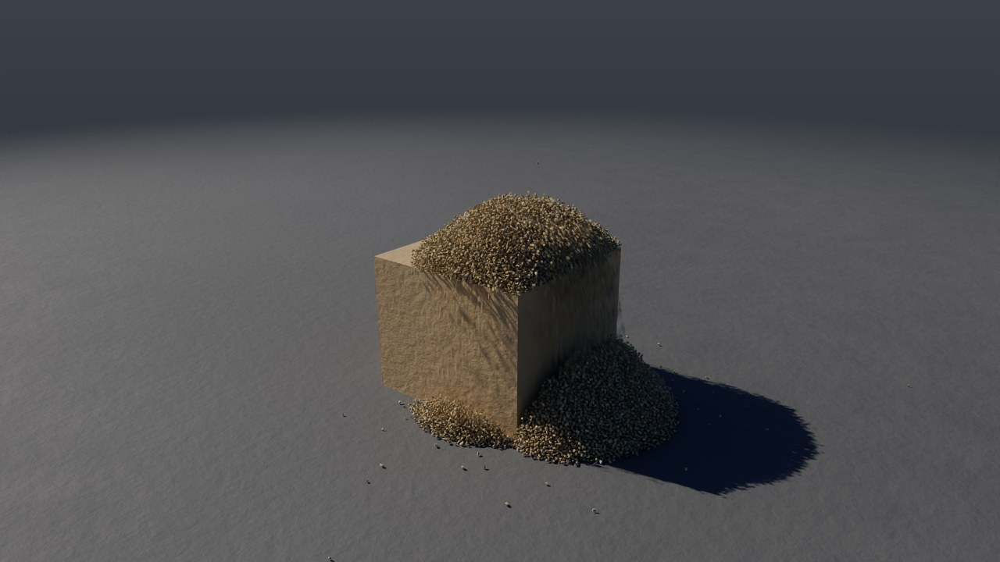
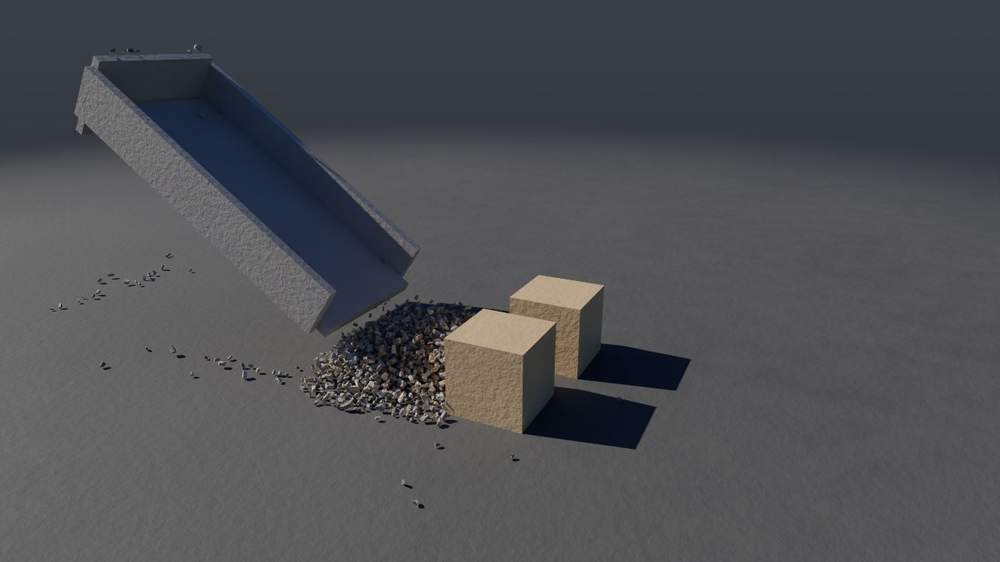
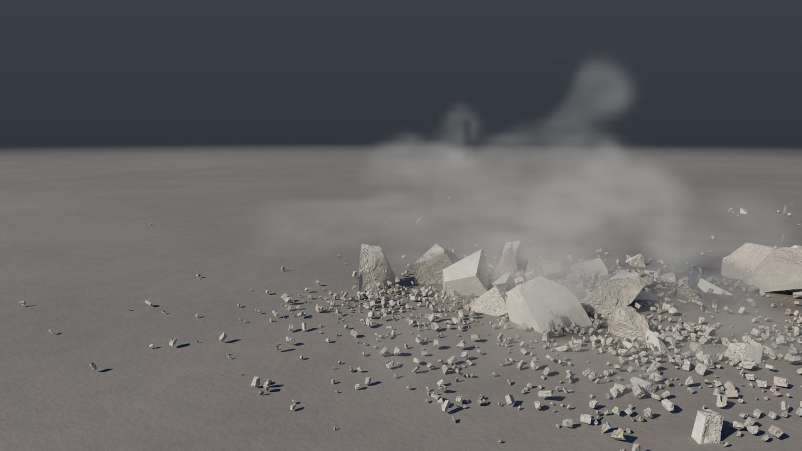
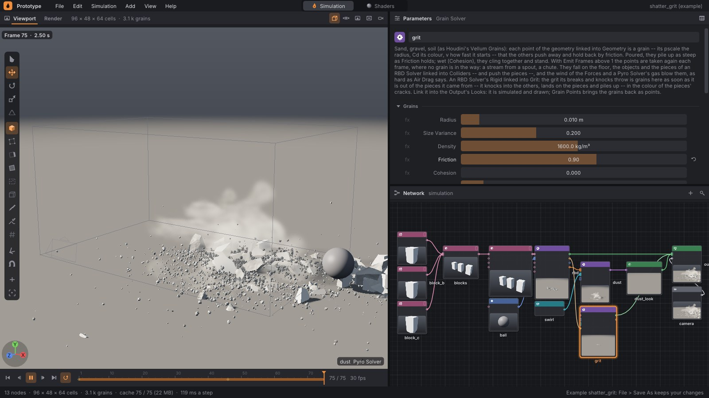
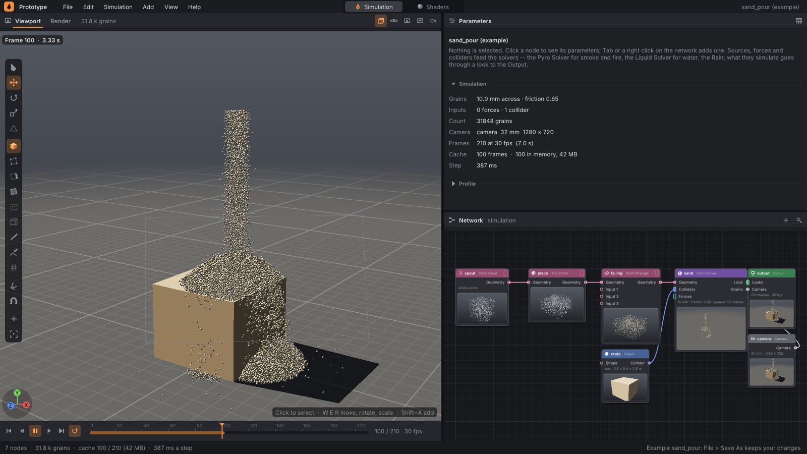

# Písek, štěrk a zemina: Grain Solver

**Grain Solver** simuluje sypké materiály: písek, štěrk, hlínu, sníh. Každé
zrno je kulička vlastní velikosti. Zrna se navzájem odtlačují, drží se
třením a mokrá se k sobě lepí. Počítá se jako Vellum Grains a POP Grains
v Houdini: metodou PBD (*Position Based Dynamics*) s mnoha malými podkroky
za snímek a několika průchody přes kontakty v každém. Nasypaná zrna tvoří
hromadu tak strmou, jak dovolí tření. Mokrý písek stojí jako stěna. Zrna
padají na podlahu, na objekty a na kusy RBD Solveru a ty kusy zpětně
tlačí. Drť, kterou RBD Solveru vyhazují lomy, může být rovnou zrny: padá
na trosky, sesouvá se z nich a leží kolem nich, kde jí padlo víc, na sobě.



```
./build/prototype --example sand_pour                 # v editoru: Play
./build/prototype sim sand_pour pisek.mp4 --frames 210
./build/prototype sim gravel_slide strk.png --every 30 --frames 90
```

## 1. Příklady

### Písek sypaný na bednu

Příklad **sand_pour** ([examples/sim/sand_pour.pgsim](../examples/sim/sand_pour.pgsim)):

- **Point Cloud** 4 000 náhodných bodů, Transformem stlačený do krabičky
  9 × 5 × 9 cm ve výšce 1,3 m nad hranou bedny. To je hubice.
- **Point Wrangle** `falling` dá každému bodu rychlost proudu v místě, kde
  je: čím níž v hubici, tím déle už padá (`v = 1,5 + 9,81·t`). Proud je
  tak souvislý, ne po dávkách za snímek. Každé zrno dostane vlastní
  odstín písku (`Cd`).
- **Grain Solver** `sand`: zrna o poloměru 5 mm, Friction 0,65, **Emit
  Frames 150**. Body hubice se berou znovu každý snímek, ale jen tam, kde
  nepřekáží žádné zrno, a zředí se i mezi sebou. Proto stačí náhodný
  Point Cloud a nikde nevznikne zrno v zrnu.
- **Colliders**: bedna 50 × 40 × 50 cm.

Proud dopadá na hranu víka. Na víku roste hromádka, přepadá přes stěnu
a na zemi vedle bedny vzniká kužel. Po 120 snímcích je ve scéně 37 900
zrn a simulace trvá v průměru 120 ms na snímek (4 jádra).

### Štěrk ze skluzu do krabic

Příklad **gravel_slide** ([examples/sim/gravel_slide.pgsim](../examples/sim/gravel_slide.pgsim)):

- **Point Cloud** 16 000 bodů v kvádru nad horním koncem skluzu. Point
  Wrangle `stones` dá kamenům velikost od 2,5 do 6 cm (`@pscale`) a šedou
  až hnědou barvu. Z bodů, které se překrývají, zůstane jen jeden kámen,
  takže z 16 000 bodů je 1 836 kamenů.
- **Grain Solver** `gravel`: Friction 0,45, hustota 1 500 kg/m³.
- **Colliders**: skluz skloněný o 35° s bočnicemi a zadní stěnou a **RBD
  Solver** se dvěma prázdnými kartonovými krabicemi (2 kg).

Štěrk sjede po skluzu, rozteče se po zemi do vějíře a narazí do krabic.
Ty se posunou: RBD Solver je mezi kolidery Grain Solveru, takže vazba je
obousměrná. Krabice zastaví štěrk a štěrk tlačí krabice. Simulace trvá
asi 16 ms na snímek.



### Drť z betonu jako zrna

Příklad **shatter_grit** ([examples/sim/shatter_grit.pgsim](../examples/sim/shatter_grit.pgsim))
je **shatter_blocks** z [destruction.md](destruction.md) — tři betonové
kvádry v řadě a demoliční koule, která jimi projede a každý rozbije tam,
kam udeří — s jedním uzlem navíc:

- **Grain Solver** `grit` (Friction 0,9) má ve vstupu **Grit** výstup
  Rigid RBD Solveru. Zrna nemají žádné body v Geometry: všechna jsou drť.
- RBD Solver hází víc drti (`debris 6`).

Každý kousek drti, který vyletí z kusu, ze kterého vznikl, je od toho
kroku zrnem: narazí do ostatních, dopadne na úlomky a sjede z nich
a leží kolem trosek v barvě lomu. Rána ho rozhází daleko, takže většina
zrn leží na zemi jednotlivě; kde ho padlo víc na jedno místo, leží na
sobě. Po 75 snímcích je ve scéně asi 3 100 zrn, 2 770 jich leží v klidu
a 150 z nich na úlomcích nebo na jiných zrnech.

```
./build/prototype sim shatter_grit drt.png --frames 75 --renderer cycles
```





## 2. Co je čím

| uzel | co dělá |
|---|---|
| **Grain Solver** (Simulation) | Zrna z bodů geometrie v **Geometry**. Velikost je `pscale` (poloměr, jinak parametr Radius), barva `Cd`, počáteční rychlost `v`. **Colliders**: objekty a RBD Solver (jeho kusy zrna tlačí). **Forces**: vítr. **Grit**: výstup Rigid RBD Solveru — jeho drť jsou zrna (stačí i bez bodů v Geometry). Výstup **Look** patří do Looks uzlu Output, výstup **Grains** do Grain Points. |
| **Grain Points** (Geometry) | Zrna snímku jako body: `P`, rychlost `v`, `pscale` (poloměr), `id` (stejné po celou dobu), `Cd` a `orient` (každé zrno natočené po svém). Na body lze kopírovat kameny (Copy to Points), exportovat je do PLY nebo dál zpracovat. |



Look Grain Solveru kreslí zrna jako úlomky kamene. Je to stejný shader
jako u drti z destrukce, takže každé zrno má vlastní tvar a odstín.
Kreslí je viewport, path tracer i Cycles.

## 3. Parametry

| parametr | výchozí | co dělá |
|---|---|---|
| Radius | 0,01 m | poloměr zrna tam, kde bod nemá `pscale` |
| Size Variance | 0,2 | každé zrno náhodně o tolik větší nebo menší (0,2: 80 až 120 %); zrna jedné velikosti se skládají jako pomeranče v bedně |
| Density | 1 600 kg/m³ | hmotnost; mezi zrny určuje, kdo komu ustoupí, proti kusům RBD jak silně je tlačí |
| Friction | 0,6 | tření mezi zrny i o podlahu a objekty; 0 se rozteče, 0,6 suchý písek, 1 štěrk |
| Cohesion | 0 | jak silně se k sobě táhnou zrna kousek od sebe a jak drží: 0 suchý písek, 0,5 vlhký, 1 mokrý, který stojí jako stěna |
| Rest Speed | 0,01 m/s | zrno, které se něčeho dotýká a jede pomaleji, zůstane stát: hromada se usadí a neplíží se |
| Emit Frames | 1 | kolik prvních snímků se z bodů dělají zrna; víc znamená proud |
| Max Grains | 1 000 000 | víc zrn nevznikne |
| Floor | zapnuto | podlaha ve výšce 0 |
| Air Drag | 0 | jak rychle zrno přebírá rychlost vzduchu (vítr, proudění plynu Pyro Solveru): 1 písek, 5 prach |
| Damping, Gravity | 0, 9,81 | útlum pohybu a gravitace |
| Substeps, Iterations | 10, 4 | podkroky za snímek a průchody kontakty v každém; víc znamená menší vzájemné zabořování |
| Color | písková | barva zrn bez vlastního `Cd` |

Úhel hromady podle tření (2 200 až 2 900 zrn nasypaných na jedno místo,
po 200 snímcích, test `grains_pile_as_steep_as_their_friction_holds`):
Friction 0,15 dá asi 15°, Friction 0,8 asi 38°. Suchý písek má v přírodě
30 až 35°.

## 4. Jak to funguje

Za snímek proběhne Substeps podkroků. V každém:

1. **Předpověď.** Rychlost dostane gravitaci a odpor vzduchu, poloha se
   posune o rychlost × krok.
2. **Sousedé.** Mřížka buněk velkých jako největší zrno (hashovaná,
   seřazená počítáním) a v ní seznamy sousedů pro každé zrno. Seznam se
   staví s rezervou poloviny poloměru a znovu jen tehdy, když se některé
   zrno pohnulo o víc než polovinu rezervy. To je Verletův seznam, takže
   klidná hromada nic nepřepočítává. Jednou za snímek se zrna v paměti
   seřadí podle buněk, aby sousedé leželi blízko sebe.
3. **Kontakty** (Iterations průchodů). Dvě zrna blíž než součet poloměrů
   se odtlačí, každé o podíl daný hmotnostmi. Horní zrno přitom ustoupí
   víc, jako by spodní bylo těžší (škálování hmotnosti s výškou podle
   Macklina a kol. 2014, §5.4). Hromada tak nese svou váhu dolů v několika
   průchodech a zrna se do sebe nezaboří. **Tření**: co kontakt za podkrok
   ujel do strany, se úplně zastaví, je-li to méně než Friction × to, jak
   silně jsou zrna k sobě přitlačená za všechny průchody (statické tření).
   Jinak se zastaví jen o tolik (kinetické, tři čtvrtiny). **Koheze**:
   zrna do vzdálenosti půl poloměru od dotyku se přitáhnou a drží třením
   i bez přitlačení. Každé zrno počítá z poloh všech zrn před průchodem
   (Jacobi). Opravy z dotyků se průměrují mezi sebou, tahy koheze mezi
   všemi kontakty. Výsledek proto nezávisí na počtu vláken.
4. **Kolize** s podlahou a objekty (vzdálenostní pole tvarů) včetně tření
   proti pohybu povrchu. U kusu RBD se zaznamená, o kolik ho zrno
   posunulo.
5. **Rychlost** z rozdílu poloh. Zrno vytlačené z hlubokého průniku
   neodletí: jeho rychlost nesmí přesáhnout o víc než 0,5 m/s tu, se
   kterou přiletělo, nebo rychlost nejrychlejšího povrchu, kterého se
   dotklo (kus, který ho nese nebo do něj vrazil). Omezená je rychlost
   sama, ne jen její změna, takže se nenasčítá ani přes několik podkroků
   po sobě. Zrno v kontaktu, které se skoro nehýbe (Rest Speed), zůstane
   na místě.

**Kusy RBD** jsou v kroku zrn tělesa své hmotnosti. Co jim zrna předala
(posun, rychlost, rotace), dostane RBD Solver na začátku dalšího kroku,
stejně jako od látky. Zrno sevřené mezi kusem a zemí kus nenese, to dělá
podlaha RBD Solveru. Zrno vedle kusu na zemi ho ale tlačí.

**Emise**: na prvních Emit Frames snímcích se z každého bodu stane zrno,
pokud mu nepřekáží žádné jiné zrno, staré ani právě vzniklé (vzdálenost
pod 0,9 součtu poloměrů). Od druhého snímku se poloha bodu náhodně posune
o desetinu poloměru, aby proud nebyl ze sloupců.

**Drť jako zrna** (vstup Grit). RBD Solver drť vyhazuje z lomů a nárazů
jako dřív, ale kousek kamene, který je venku z kusu, ze kterého vznikl
(`RigidScene::gritIntoGrains`), si nenechá: po kroku RBD ho World předá
zrnům (`RigidSolver::thrown`, `GrainSolver::add`) s polohou, rychlostí
a poloměrem půl velikosti kousku. Zrno dostane další číslo zrn a barvu
lomu kusů (Inside Color RBD Solveru × 0,9, jak drť kreslí RBD Solver).
Střepy skla zůstávají drtí RBD Solveru: jsou to ploché střípky, ne zrna.
Propojení zároveň udělá z kusů RBD Solveru kolidery zrn (jako by byl RBD
Solver i v Colliders), takže zrna padají na kusy a tlačí je.

Drť se rodí uprostřed hromady trosek a často v jiném zrnu nebo v kusu.
Nová zrna proto před prvním podkrokem projdou kontakty bez rychlosti
(*pre-stabilizace*, Macklin a kol. 2014, §4.4): rozestoupí se, ale
neodletí. A zrno, které kus tlačí do podlahy, se zpod něj vymáčkne
do strany (od středu kusu, když tlačí přímo dolů) nejvýš rychlostí
0,5 m/s, jakou se zrna rozestupují — nikdy ne pod podlahu.

## 5. Snímky, cache, checkpoint a export

- **Snímek** (`Frame::grains`, cache verze 15): polohy (float), rychlosti
  a poloměry (poloviční přesnost), čísla zrn a barvy (bajty). Starší cache
  se čtou dál, jen bez zrn.
- **Checkpoint**: polohy, rychlosti, poloměry, hmotnosti, čísla, barvy
  a reakce na kusy. Obnovený bake pokračuje bit po bitu (test
  `state_resumes_the_grains_and_the_pieces_they_push_to_the_bit`), a to
  i uprostřed sypání.
- **Grain Points** vrátí zrna jako body. Export do PLY a OBJ funguje jako
  u ostatních bodů ([cache.md](cache.md)).
- **USD**: `/World/grains` jako PointInstancer v každé vrstvě snímku:
  dvanáct prototypů úlomků kamene (tytéž tvary, jaké kreslí renderery),
  `positions`, `orientations`, `scales`, `velocities`, `ids`,
  `protoIndices` a `primvars:displayColor` ([usd.md](usd.md)). Zrna, která
  byla drtí, jsou tam jen jednou: RBD Solver je už nenese.
- **Python**: `frame.grains()` vrátí body s `v`, `pscale`, `id`, `Cd`
  a `orient` ([python.md](python.md)).
- **Profil kroku**: čas zrn je v přehledu editoru (řádek Grains) i v řádku
  `time:` příkazu `prototype sim`.

## 6. V kódu

| soubor | co dělá |
|---|---|
| `src/pg/sim/Grains.h` | `GrainSettings`, `GrainScene`, `GrainFrame`, `GrainSolver` (krok, emise, sousedé, kontakty, kolize, reakce, stav), `grainPoints` |
| `src/pg/sim/World.h` | `World::grains`, krok zrn po látce, reakce na kusy RBD (`RigidScene::intoGrains`), drť RBD do zrn (`RigidScene::gritIntoGrains`) |
| `src/pg/sim/Rigid.h` | `RigidBit`, `RigidSolver::thrown`: drť, kterou krok předal zrnům |
| `src/pg/sim/Network.cpp` | uzly `grain_solver` (vstup Grit) a `grain_points`, kompilace (`compileGrains`) |
| `src/pg/sim/Frame.cpp` | `drawnBodies`: zrna jako volné body s `pscale`, kreslená jako úlomky |
| `src/pg/sim/Cache.cpp` | snímek verze 15 |
| `src/pg/sim/UsdExport.cpp` | `/World/grains` (PointInstancer) |
| `src/pg/core/Chips.h` | tvary úlomků kamene a střepů skla, jejich odstín a natočení: pro renderery i USD |

## 7. Ověřování

`tests/test_grains.cpp`, 8 testů:

- blok 768 zrn spadne na podlahu, nic není pod ní, po 120 snímcích stojí
  (pod 5 cm/s), zrna se do sebe zaboří v průměru méně než o 4 % součtu
  poloměrů a nikde víc než o 30 %; velikosti jsou v mezích Size Variance;
- nasypaná hromada je strmější s větším třením (0,15 dá 15°, 0,8 dá 38°)
  a usadí se;
- sloupec 400 zrn vysoký 33 cm se suchý sesype (zbude 9 cm), mokrý
  (Cohesion 1) stojí (27 cm);
- zrna zůstanou mimo objekt, na kterém leží, a tlačí kus, který povolí;
- vítr zrna odfoukne;
- sypání: zrna přibývají, nevznikají v sobě, každé má vlastní číslo, Max
  Grains platí;
- zrna jako body: `pscale`, `Cd`, jednotkové `orient`, `id`; bez barvy
  barva looku; snímek, který nesedí, nedá nic;
- 1 a 4 vlákna a obnova ze stavu dají totéž bit po bitu; useknutý stav se
  odmítne.

`tests/test_grit_grains.cpp`, 3 testy:

- betonový kvádr spadne ze 4 m a rozbije se: drť jsou zrna (víc než 40),
  RBD Solver jí drží nejvýš desetinu toho, v barvě lomu, žádné zrno pod
  podlahou, čtyři pětiny v klidu, některá leží na kusech nebo na sobě;
  v žádném snímku není žádné zrno rychlejší než 9,4 m/s (kvádr dopadne
  rychlostí 8,9 m/s; když se rychlost zrn vytlačovaných z trosek sčítala
  přes podkroky, létala až 15 m/s); bez propojení drť zůstane RBD Solveru
  a zrna žádná nejsou;
- 1 a 4 vlákna a obnova ze stavu uprostřed dají táž zrna i tytéž kusy;
- síť: Rigid RBD Solveru do Grit zapne předávání drti i kolize s kusy,
  barva lomu × 0,9, a bez bodů v Geometry žádné varování.

K tomu: síť (uzel, kolidery, RBD Solver mezi nimi, Grain Points, chybějící
body, uložení a načtení, `tests/test_sim_network.cpp`), cache verze 15
a čtení verze 14 (`tests/test_export.cpp`), checkpoint štěrku s krabicemi
a sypaného písku (`tests/test_state.cpp`), USD (`tests/test_usd.cpp`)
a Python `frame.grains()` (`tests/python/test_pg.py`). Všechny tři
příklady projdou testem formátu a testem „všechny příklady běží“.

## 8. Omezení

- Zrna jsou koule bez otáčení. Neválí se, takže hromady drží i bez odporu
  proti valení. Tvar (štěrk vs. písek) dává jen tření, ne geometrie.
  `orient` je náhodné natočení pro kreslení, ne simulované.
- Jacobiho průměrování konverguje pomalu. Vysoké hromady (stovky vrstev)
  se do sebe trochu zaboří a v místě dopadu proudu se zrna mohou dočasně
  překrýt o třetinu i víc. Pomůže víc podkroků.
- Koheze je jednoduchá: tah k dotyku a tření navíc. Nemá skutečnou
  pevnost v tahu, kterou by šlo zadat v pascalech, ani vysychání.
- Zrna nejsou ve vodě (žádný vztlak, nasáknutí ani odplavení) a nepůsobí
  na plyn. Plyn a vítr je jen unášejí.
- Kusy RBD se v kroku zrn jen posouvají, neotáčejí, a setrvačnost se bere
  jako u kvádru jejich rozměrů (stejně jako u látky).
- Kolize s objekty počítají vzdálenostní pole tvaru. Tenká stěna (tenčí
  než zrno) může rychlé zrno propustit.
- Drť jako zrna je koule poloměru půl kousku; tvar úlomku má jen při
  kreslení. Zrno se už dál nerozbije a neodnese ho plyn jinak než ostatní
  zrna. Střepy skla zrny nejsou.
- Zrno je spíš hrst písku než skutečné zrnko: skutečný písek by znamenal
  miliardy zrn. Na 4 jádrech trvá snímek 38 000 zrn asi 0,12 s a snímek
  192 000 padajících zrn asi 1 s.

## 9. Odkazy

- M. Macklin, M. Müller, N. Chentanez, T.-Y. Kim: *Unified Particle
  Physics for Real-Time Applications*, SIGGRAPH 2014.
- M. Macklin, K. Storey, M. Lu a kol.: *Small Steps in Physics Simulation*,
  SCA 2019.
- E. Guendelman, R. Bridson, R. Fedkiw: *Nonconvex Rigid Bodies with
  Stacking*, SIGGRAPH 2003 (shock propagation).
- Y. Zhu, R. Bridson: *Animating Sand as a Fluid*, SIGGRAPH 2005.
