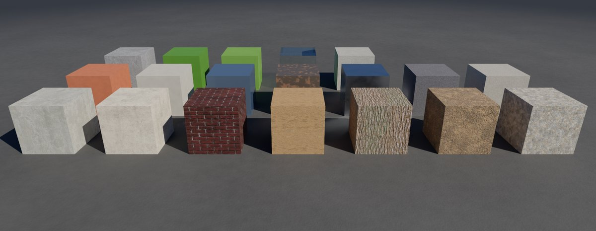
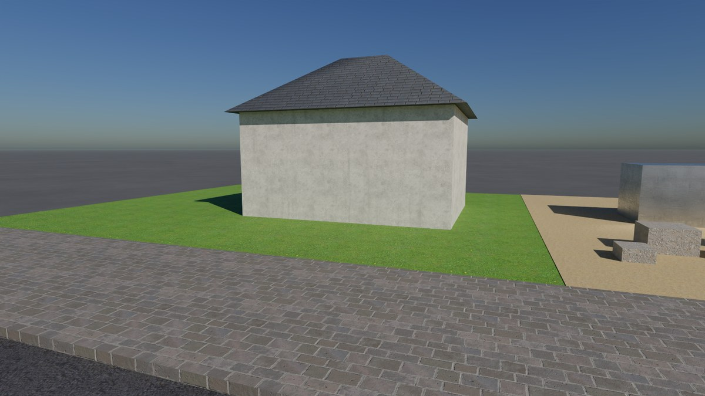
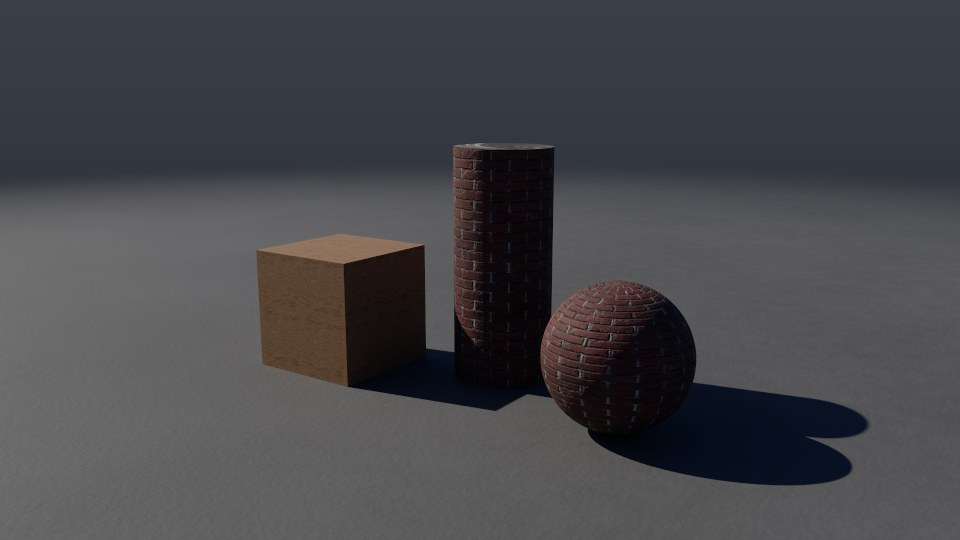
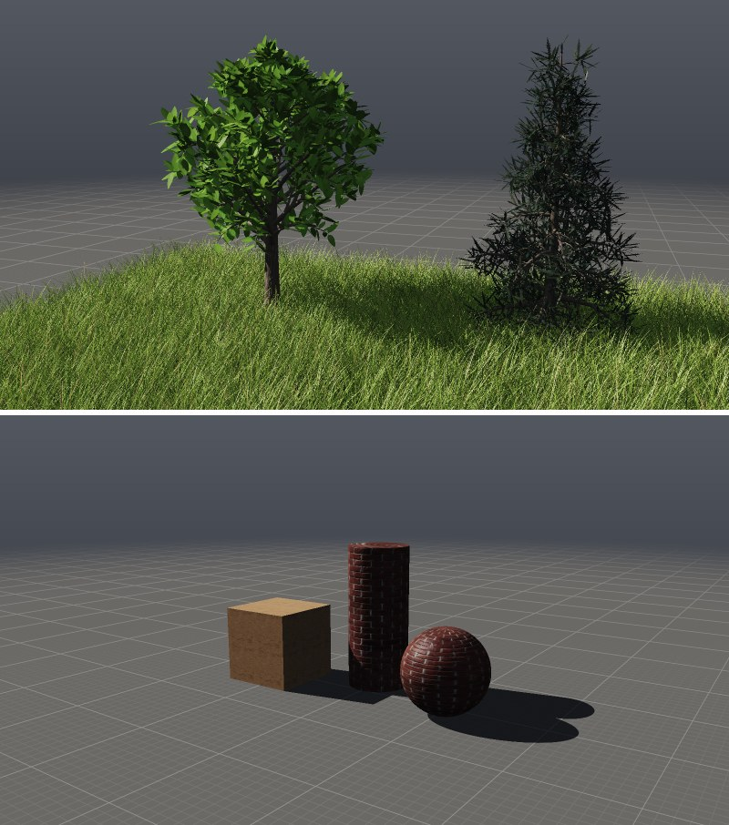
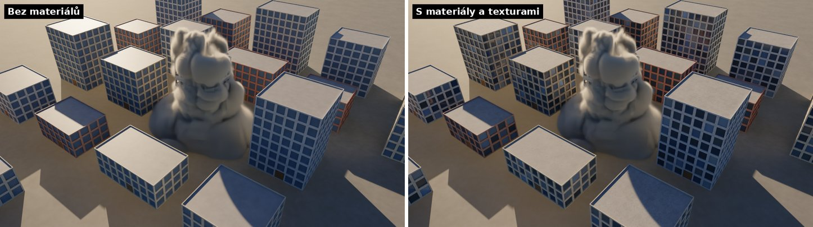
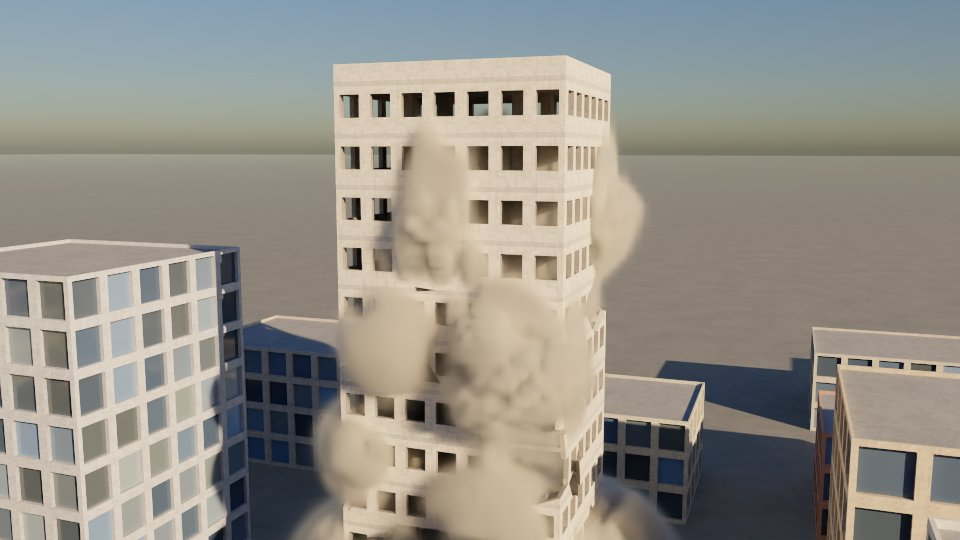

# Materiály a textury

Každá plocha může říct, **z čeho je**: beton, omítka, cihla, okno, ocel,
dřevo, dlažba, taškové střechy, trávník… Řekne to řetězcovým atributem
primitiv `material`.
Renderery podle něj kreslí povrch: Cycles fotografií, pokud ji knihovna
má, jinak procedurálním vzorem, a vždy s drsností a kovovostí toho
materiálu. Path tracer klade stejné fotografie, reliéf jen z normálové
mapy, a bere drsnost a kovovost. Fotka se klade ze tří stran, nebo podle
texturových souřadnic UV, mají-li je plochy ([níže](#podle-uv-a-normálové-mapy)).



*Vzorník (Cycles) bez barev `Cd`: každý materiál ve své vlastní barvě. Přední
řada: beton, lom betonu, omítka, cihlová zeď, malta, kov. Druhá: asfalt,
dlažba, dřevo, kůra, půda, trávník. Třetí: písek, plochá střecha, valbová
střecha z tašek, cihla, okno, ocel. Zadní: kámen, list, tráva, sklo, bez
materiálu.*



*Fotky z knihovny v jedné scéně (Cycles), opět bez `Cd`: asfalt, chodník
z dlažby, trávník, písek s kusy lomu betonu, kovový kontejner a dům z omítky
s valbovou střechou z tašek. Řady tašek leží vodorovně na každé straně
střechy.*

## 1. Rychlý start

```bash
# Ulice: omítka, okna s místnostmi za sklem, dřevěné dveře, střechy, asfalt.
./build/prototype sim street ulice.png --renderer cycles
# Demolice: věž z betonu a omítky, lom betonu na kusech, které padají.
./build/prototype sim demolition odstrel.png --renderer cycles
# Bez fotografií (jen vzory a barvy):
./build/prototype sim street ulice.png --renderer cycles --set output.render_textures=0
# Podle UV: bedna, sloup a koule s fotkami a normálovými mapami.
./build/prototype sim uv_props uv.png --renderer cycles
```

Ve wrangle stačí jeden řádek:

```c
s@material = "plaster";                 // Primitive Wrangle
if (@group_glass) s@material = "window";
if (@group_roof) s@material = "roof_tiles";
```

## 2. Materiály

| Jméno | Co Cycles nakreslí | Drsnost / kov |
|---|---|---|
| `concrete` | **fotka** betonu se skvrnami, nahoře šmouhy stékající vody | 0,85 / 0 |
| `broken_concrete` | **fotka** lomu: kamínky kameniva v cementu, hluboký reliéf | 0,95 / 0 |
| `brick` | líc jedné cihly: skvrny, tmavší zrnka, drsný pálený povrch | 0,85 / 0 |
| `brick_wall` | **fotka** cihlové zdi i s maltou (na zeď, která je jedna plocha) | 0,85 / 0 |
| `mortar` | **fotka** písku, jemnější (zrna malty) | 0,95 / 0 |
| `plaster` | **fotka** omítky, šmouhy pod okny, skvrny po celé fasádě | 0,8 / 0 |
| `window` | sklo s místností za ním: každé okno jinak tmavé nebo světlé (záclony, světlo), teplejší či studenější, odráží oblohu | 0,04 / 0 |
| `glass` | sklo (průhledné, jako Glass Fracture) | 0 |
| `steel` | ocel výztuže, místy rezavá (rez je drsná a nekovová) | 0,45 / 0,8 |
| `metal` | **fotka** plechu: kartáčované rýhy, škrábance, skvrny | 0,3 / 1 |
| `asphalt` | **fotka** asfaltu: drobné kamínky v dehtu | 0,9 / 0 |
| `wood` | **fotka** dřeva s kresbou | 0,65 / 0 |
| `stone` | kámen: zrna několika barev, skvrny, nerovný | 0,75 / 0 |
| `roof` | plochá střecha: **fotka** betonu v šestimetrové dlaždici, skvrny po vodě | 0,8 / 0 |
| `roof_tiles` | šikmá střecha: **fotka** břidlicových tašek v řadách, kladená podél střechy (řady vodorovně, ať se plocha dívá kamkoli) | 0,7 / 0 |
| `paving` | **fotka** dlažby z kostek asi 18 × 14 cm, písek ve spárách | 0,8 / 0 |
| `bark` | **fotka** kůry (svislé rýhy, hluboký reliéf) | 0,9 / 0 |
| `leaf` | list: některé žlutší, některé tmavší, po skupinách v koruně | 0,5 / 0 |
| `grass` | tráva (stébla uzlu Grass): sušší v několikametrových skvrnách | 0,6 / 0 |
| `lawn` | **fotka** trávníku: na zem, která je jedna plocha | 0,65 / 0 |
| `soil` | **fotka** hlíny | 0,95 / 0 |
| `sand` | **fotka** písku | 0,95 / 0 |

Bez fotek (Textures vypnuté) kreslí Cycles každý materiál vzorem: dlažbu
a tašky v řadách, lom betonu s kamínky, trávník se stébly a písek
s čeřinami.

Neznámé jméno nebo `""` znamená bez materiálu: povrch má barvu `Cd`
a „detail“ z [cycles.md](cycles.md) (§3). Atributy `roughness`
a `metallic`, pokud je geometrie má, mají přednost před drsností a kovovostí
materiálu.

**Barva zůstává vaše.** Fotka i vzor kreslí kolem barvy `Cd`: průměrná
barva povrchu je pořád `Cd` a fotka ji jen zesvětluje a ztmavuje. Fasáda
tak má barvu, jakou jí dal asset, a každá cihla Brick Wall svůj odstín. Výjimkou je
cihlová zeď (`brick_wall`). Malta je světlejší než cihly, takže by se jasnou
`Cd` přepálila do bílé, a proto se kreslí ve vlastních barvách fotky.

**Bez `Cd` barva materiálu.** Když geometrie `Cd` nemá vůbec (ani na bodech,
ani na plochách), dostane každá plocha barvu svého materiálu: trávník
zelenou, asfalt tmavě šedou, písek béžovou, tašky břidlicově šedou. U fotek
je to zhruba jejich vlastní barva. Stačí tedy nastavit `material` a povrch
vypadá, jak má, v rendererech i ve viewportu. Plochy bez materiálu zůstávají
šedé.

### Kdo materiál nastaví sám

| Uzel | Materiál |
|---|---|
| **Brick Wall** | `brick`, `mortar`, `plaster` |
| **Concrete Fracture** | `concrete`, na plochách lomu `broken_concrete` |
| **Wood Fracture** | `wood` na plochách, které nemají jiný materiál |
| **RBD Solver** (lámání za běhu) | na lomech úlomků `broken_concrete`, kde byl kus `concrete`; jinak materiál kusu |
| **Glass Fracture** | `glass` |
| **Rebar** | `steel` (i trubky prutů, které kreslí RBD Solver) |
| **Tree** | `bark`, `leaf` |
| **Grass** | `grass` |
| **Building** (asset) | `plaster`, `window`, dveře `wood`, střecha `roof` |

**Uzel Material** nastaví materiál skupině ploch (Group: jméno skupiny,
čísla a rozsahy `0-9 12`, `*`; prázdné znamená všechny). Volba None materiál
odebere.

### Kusy, které letí

RBD Solver kreslí kusy tam, kde zrovna jsou. Kdyby se fotka nebo vzor
počítaly z té polohy, po kusu by „tekly“. Každý bod si proto nese `rest`,
tedy kde byl, než se pohnul, a textura se kreslí podle `rest`. Kus si tak
svoji kresbu nese s sebou, i když se otáčí.

Plochy lomu (skupina `inside`) dostanou při kreslení `broken_concrete`.
Víčko řezu totiž zdědí materiál vedlejší plochy (omítku, nátěr, okno), ale
uvnitř zdi omítka není. Výjimkou jsou materiály, které jsou stejné skrz
naskrz: cihla, kámen, dřevo, kov a sklo zůstanou samy sebou.

## 3. Fotografie (textury)

Knihovna, která je součástí programu, leží v
[examples/textures](../examples/textures/README.md): `concrete`,
`broken_concrete`, `plaster`, `brick_wall`, `mortar`, `metal`, `asphalt`,
`wood`, `roof`, `roof_tiles`, `paving`, `bark`, `soil`, `lawn` a `sand`.
Každá sada obsahuje `color.jpg`, `height.jpg` a `texture.txt` (velikost
dlaždice v metrech, hloubku reliéfu, průměrnou barvu, `tint` a případně
`projection`). Fotky pocházejí z Bistro od Amazon Lumberyard (přes
pbrt-v4-scenes) a z BabylonJS/Assets a šíří se pod licencí CC-BY 4.0;
autoři jsou uvedeni v README knihovny.

**Jak se fotka klade.** Bez UV ([níže](#podle-uv-a-normálové-mapy)) se
fotka promítá ze tří stran najednou (triplanárně). Z každé osy přispívá tolik, kolik se tím směrem
plocha dívala, umocněno na čtvrtou. Stěna má tedy fotku zepředu, podlaha
shora a šikmá plocha prolnutí obou. Promítá se podle `rest` a normály v
`rest`, takže letící kus nese svou kresbu. Každá ze tří projekcí je posunutá,
aby se dlaždice na hranách nepotkaly ve stejném místě. Na fasádách navíc
leží velké skvrny a šmouhy, takže opakování dlaždic není vidět.

**Podél plochy** se kladou sady, jejichž řady musí zůstat vodorovné: tašky
(`roof_tiles`, v `texture.txt` řádek `projection face`). Ze tří stran by se
na střeše se sklonem 45° prolnuly dvě projekce a řady by se zdvojily. Na
valbě obrácené k ose x by navíc běžely dolů po spádu. Podél plochy se fotka
klade tak, že vodorovně po ploše vede osa u a do kopce osa v. Řady tak
leží vodorovně na každé straně střechy. Plochy skoro vodorovné (méně než
asi 15°) se kladou ze tří stran jako ostatní. Totéž umí i vaše sada:
stačí do jejího `texture.txt` napsat `projection face`.

**Výška** dělá v Cycles reliéf (Bump): spáry mezi cihlami, rýhy v kůře,
póry v betonu. **Drsnost** se bere z mapy, pokud ji sada má, jinak z
materiálu a v prohlubních je o něco vyšší.

### Vlastní textura na objekt

Uzel **Material** má sekci Texture:

| Parametr | Co dělá |
|---|---|
| **Texture** | obrázek barvy (`.jpg`, `.png`, `.exr`) ze sady, např. z Poly Haven nebo ambientCG; ostatní mapy se najdou vedle něj podle jmen: `_diff_`/`_rough_`/`_disp_` (Poly Haven), `_Color`/`_Roughness`/`_Displacement` (ambientCG); funguje i složka s `texture.txt` a dokument MaterialX (`materialy.mtlx`, `materialy.mtlx#bark`, nebo složka s ním, [materialx.md](materialx.md#4-čtení-mtlx)) |
| **Texture Size** | kolik metrů pokryje jedna dlaždice (0: podle `texture.txt`, jinak 2 m) |
| **Tint by Color** | zapnuto: barva `Cd` místo barvy fotky (fotka kolem ní světlá a tmavne); vypnuto: fotka, jak je |

| **Projection** | jak se fotka klade: **Auto** vlastní texturu podle UV, mají-li ho plochy, jinak ze tří stran; **UV** podle UV i fotky knihovny; **Three Sides** ze tří stran |
| **Normal Strength** | jak silně ohýbá světlo normálová mapa sady (s UV): 0 vůbec, 1 jak ji mapa má |

Zapíše `s@texture`, `f@texture_size`, `i@texture_tint`,
`i@texture_projection` (0 auto, 1 UV, 2 ze tří stran) a
`f@texture_normal`, takže totéž jde udělat i ve wrangle. Relativní cesta
se čte od složky sítě.

`s@texture` může být i materiál ze scény USD: `scena.usda#/World/Looks/Wood`.
Jeho síť MaterialX nebo UsdPreviewSurface dá obrázky sady. Uzel **USD
Import** tak materiály ze souboru zapisuje sám
([usd-import.md](usd-import.md#materiály)).

### Podle UV a normálové mapy



**UV** jsou texturové souřadnice: vektorový atribut `uv` na rozích ploch
(u, v, 0), jak ho má Houdini, nebo na bodech. Přinesou ho importy
(USD `primvars:st`, Alembic `uv`, OBJ `vt`) a vyrobí ho uzel
**UV Project** ([geometry.md](geometry.md)):

| Projection | uv |
|---|---|
| **Planar** | podél osy Axis, jak ji vidí z její kladné strany: shora x doprava a −z nahoru; Scale metrů jedna fotka |
| **Box** | každá plocha podél osy, ke které se nejvíc dívá, jak ji vidí zvenku: šest stran krabice, každá svou fotkou, žádná zrcadlově |
| **Cylindrical** | u jednou dokola osy (zepředu zleva doprava), v podél ní, Scale metrů jedna fotka |
| **Spherical** | u jednou dokola, v od dolního pólu (0) k hornímu (1) |

U válce a koule zůstává každá plocha celá: plocha přes šev má u na jedné
straně přes 1 a roh na pólu má u zbytku své plochy. Center je, odkud se
promítá, Group, které plochy.

**Kladení podle UV.** Kde materiál klade podle UV (Projection UV, nebo
Auto s vlastní texturou), pokryje jedna fotka jednu jednotku uv. Texture
Size se nepoužije, velikost dává UV (Scale uzlu UV Project). Fotky
knihovny jsou dělané na kladení ze tří stran v metrech, proto je Auto
klade ze tří stran i tam, kde UV je. Výjimkou jsou kůra, listy a tráva
(`bark`, `leaf`, `grass`): jejich obrázky jsou dělané pro UV, které jim
dávají uzly Tree a Grass ([trees.md](trees.md)), takže je Auto klade podle
UV, kde ho plochy mají. Plochy bez UV se kladou ze tří stran,
ať Projection říká cokoli. Fotka jde s plochou, kam ji UV posune.

**Normálová mapa** říká, kam se povrch v každém pixelu dívá: x, y, z
v červené, zelené a modré od 0 do 1. Najde se vedle fotky podle jména:
`_nor_gl_` a `_nor_dx_` (Poly Haven), `_NormalGL` a `_NormalDX`
(ambientCG), `normal.jpg` ve složce s `texture.txt`. U DirectX míří zelená
dolů po obrázku a renderery ji otočí (`_dx_`, `_NormalDX`, v `texture.txt`
řádek `normal dx`). Kde jsou obě, vezme se OpenGL. Normálová mapa platí
s kladením podle UV a ohýbá normálu v prostoru tečen: tečna je směr, kterým
roste u, druhá osa směr, kterým roste v. Bez normálové mapy dělá reliéf
v Cycles výška jako dřív. Ze tří stran se normálová mapa nepoužije, reliéf
dá výška (Cycles).

- **Cycles:** síť dostane atribut `ATTR_STD_UV`, fotky se čtou přes
  souřadnice UV a normálová mapa přes uzel Normal Map v prostoru tečen,
  které Cycles spočítá metodou MikkTSpace.
- **Path tracer:** tečny spočítá stejně jako MikkTSpace. Rohy na stejném
  místě, se stejnou normálou a uv sečte, každý vážený úhlem, který tam
  trojúhelník má. Zrcadlené uv drží zvlášť a ohne normálu stejně jako
  Normal Map v Cycles, sílu taky. Kde ohnutá normála míří od oka, natočí ji
  k ploše jen tak daleko, aby se odraz oka dostal nad povrch. Difúzní
  světlo pod šikmým úhlem k neohnuté normále tlumí jako Cycles (stínění
  mikroplošek GGX podle Conty Estevez a kol. 2019). Bez toho by na kouli
  s normálovou mapou byly ostré švy.

Knihovna má normálové mapy u cihlové zdi (`brick_wall`), dřeva (`wood`)
a kůry (`bark`). Spočítal je ze sklonů výšky `tools/textures/prepare.py
--normals`.

**Alfa výřez.** Sada s alfou vyřízne povrch tam, kde alfa je 0, pokud se
klade podle UV. Je to okraj listu, mezery mezi jehlicemi. Alfa se najde
takto: v `texture.txt` řádek `alpha 1` (alfa kanál `color.png`), obrázek
`opacity` ve složce, u cizích sad `_opacity`, `_alpha` nebo `_mask` vedle
fotky (bere se šedá), jinak alfa kanál samotné fotky barvy, pokud nějaké
pixely vynechává. Průměrná barva sady (`mean`) se počítá jen z toho, co
tam je.

- **Cycles:** shader se smíchá s Transparent BSDF podle alfy. Paprsky
  i stíny projdou (průhledné stíny Cycles), až 64 vrstev za sebou.
- **Path tracer:** paprsek, který potká vyříznutou plochu, ji projde
  s pravděpodobností 1 − alfa a pokračuje dál (až 64 vrstev). Stínový
  paprsek se ztlumí o alfu, takže stín listu má měkký okraj jako
  v Cycles. Sítě s výřezem jdou v Embree mezi „průhledné“, které stínový
  paprsek prochází plocha po ploše jako sklo.

Knihovna má obrázky listů a trávy kreslené skriptem
`tools/textures/foliage.py` (bez fotografií, žádná cizí licence): `leaf`
je čtvrtinami dva široké listy, úzký list a větvička jehličí, s alfou
a normálovou mapou žilek; `grass` je stéblo se střední žilkou a proužky.
Uzly Tree a Grass jim dávají UV ([trees.md](trees.md)).

Ověření alfy (`tests/test_foliage.cpp`): červená deska metr nad zemí
s levou polovinou alfa 0. Shora je levou polovinou vidět zem, osvětlenou
sluncem stejně jako bez desky (path tracer 1,044 proti 1,057, Cycles
1,073 proti 1,082), pravá polovina je červená. V obou enginech (náš BVH
i Embree) projde levou půlkou stínový paprsek celý a pravou nic.

Ověření (`tests/test_uv.cpp`): fotka ze čtyř barev položená podle UV dá
v obou rendererech každou čtvrtinu na svém místě. Rovina se sluncem 30°
nad obzorem a normálovou mapou natočenou o 30° ke slunci je 2,90× jasnější
v path traceru a 2,95× v Cycles (Lambert 1,73× a k tomu odlesk, normála
leží v půli mezi sluncem a okem). Natočená od slunce je tmavá. Mapa
DirectX se stejnými pixely ohne opačně. Koule s mapou natočenou na u i v
pod sluncem ze strany se v každé čtvrtině a uprostřed liší od Cycles
nejvýš o 5 %.

### Ve viewportu

Viewport klade fotky stejně jako renderery: podle UV, nebo ze tří stran
(podle `rest`, jinak podle místa bodu; i sady kladené podél šikmé plochy
klade ze tří stran). Barvu tónuje `Cd` kolem průměru sady, nebo ji nechá,
jak je. Normálová mapa ohýbá normálu v prostoru tečen, které viewport
spočítá z derivací místa a UV v obrazu (Schüler). Alfa listů vyřízne
plochu i její stín. Aby tenké jehlice v menších kopiích obrázku (mipmapách)
nezmizely, alfa se v nich zesiluje podle úrovně kopie (Golus).

Obrázky jsou ve dvou polích textur, 512 × 512 pixelů na vrstvu, nejvýš 16
sad najednou. Další sady už viewport kreslí jen barvou. Výška a reliéf
(bump) ve viewportu nejsou.



### Na uzlu Output

| Parametr | Co dělá |
|---|---|
| **Textures** | fotografie zapnuté nebo vypnuté (vypnuté: jen vzory a barvy) |
| **Texture Folder** | jiná knihovna: složka se složkami pojmenovanými jako materiály (prázdné: ta, která je součástí programu; také proměnná `PG_TEXTURES`) |
| **Surface Detail** | jak silné jsou vzory a skvrny přes fotky; 0 je vypne. Plocha s `f@surface_detail` jich dostane jen tolik krát (0 žádné, jako materiály z USD Import, které nejsou presety) |

Z příkazové řádky: `--set output.render_textures=0`,
`--set output.render_texture_folder=/cesta/k/texturam`.

### Do jiných programů

Export do USD zapíše materiály zobrazené geometrie jako MaterialX (a
UsdPreviewSurface), plochy k nim přiřadí a fotky zkopíruje vedle scény.
`.mtlx` zapíše jen materiály. Popisuje to [materialx.md](materialx.md).

## 4. Před a po



*Stejný snímek demolice v Cycles. Vlevo bez materiálů, vpravo s nimi:
okna s místnostmi za sklem, skvrnité střechy a omítka.*



*Věž, když se začíná hroutit: omítka a betonové stropy z fotografií, okna
okolních domů odrážejí oblohu.*

## 5. Jak to funguje

- `src/pg/core/Material.h`: jména materiálů (`MaterialPreset`,
  `kMaterialNames`). Nový řetězcový atribut má na začátku tabulky `""`,
  takže primitivy, kterým nikdo nic nezapsal, nemají materiál. To platí pro
  wrangle, `setPrimitiveString` i spojení geometrií (Merge).
- `src/pg/nodes/Surface.cpp`: uzly Material a UV Project.
- `src/pg/io/Obj.cpp`: `vt` do `uv` rohů a zpátky.
- `src/pg/sim/Rigid.cpp`: `posedPieces` zapíše `rest` a `drawnPieces` dá
  plochám lomu `broken_concrete` a trubkám prutů `steel`.
- `src/pg/render/Scene.cpp`: `meshOf` čte `material`, `texture*`, `rest`
  a `uv`, z UV spočítá tečny (`cornerTangents`) a oknům dá číslo podle
  polohy jejich první plochy v `rest`. Číslo je
  stejné snímek za snímkem, i když kusy mizí. Geometrii bez `Cd` dá barvy
  materiálů (`presetSurface`).
- `src/pg/render/MaterialGraph.cpp`: materiály jako grafy MaterialX
  ([materialx.md](materialx.md)).
- `src/pg/render/Textures.cpp`: hledání sad (knihovna, `texture.txt`,
  jména souborů z Poly Haven a ambientCG, normálové mapy, dokumenty
  MaterialX), průměrná barva,
  triplanární vyhledání pro path tracer a ohnutá normála (`bentNormal`).
- `src/pg/render/PathTracer.cpp`: `facingNormal` a `bumpShadowing`, jak je
  má Cycles.
- `src/pg/render/Cycles.cpp`: `patternOf` (procedurální vzory ve třech
  měřítkách), `laidOn` a `sampled` (fotky ze tří stran nebo podél plochy,
  `alongFace`), `sampledByUv` a `normalMapped` (podle UV, uzel Normal Map),
  `weathered` (skvrny a šmouhy přes fotky). Sítě nesou atributy `pg_rest`,
  `pg_rest_normal`, `pg_random` a UV.
- `tools/textures/prepare.py`: výroba knihovny z fotek pbrt-v4-scenes
  a BabylonJS/Assets. Výšku integruje z normálové mapy a podle toho, který
  směr zelené osy dá skutečný povrch (u druhého by sklony žádnému povrchu
  nepatřily), pozná, kam zelená osa míří. Kovu skládá barvu z rýh jeho
  reliéfu, protože jeho fotka má jen deset odstínů šedi.
