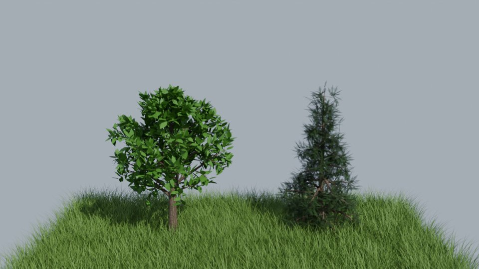
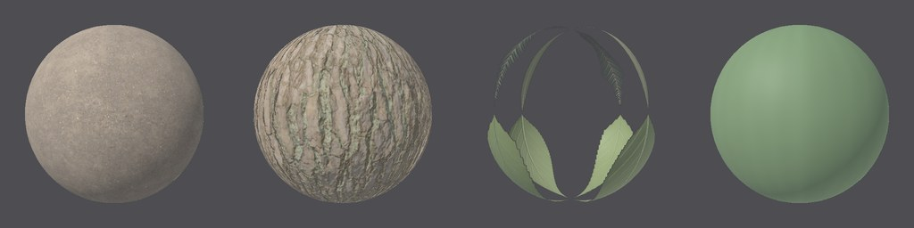

# MaterialX

MaterialX (Academy Software Foundation) je společný jazyk materiálů:
materiál jako graf uzlů (obrázek, násobení, `standard_surface`…), který
stejně pochopí Houdini, Maya, Blender i renderery nad USD (Karma, Arnold,
RenderMan, Storm v usdview). Prototype v něm materiály **zapisuje i čte**:

- **export do USD**: každý materiál je `Material` ze shaderů MaterialX
  (`outputs:mtlx:surface`) a k tomu `UsdPreviewSurface` pro programy,
  které MaterialX nečtou. Plochy jsou k materiálům přiřazené přes
  `GeomSubset`, jeden na materiál, a fotky se zkopírují vedle scény;
- **`.mtlx` samotný**: materiály geometrie jako dokument MaterialX;
- **čtení**: dokument `.mtlx` (i z Poly Haven nebo ambientCG) jde použít
  jako sada textur: na uzlu Material, ve wrangle i v knihovně.

Zapisovač i čtečka vznikly podle veřejné specifikace, bez knihovny MaterialX.



*Příklad `foliage` zapsaný `prototype cook foliage foliage.usda` a otevřený
v Blenderu 4.5.3 (File › Import › USD), Cycles. Materiály, fotky, alfa
listů, normálové mapy i UV přišly z exportu; kamera a světlo jsou
Blenderu.*



*Dokument `foliage.mtlx` vyrenderovaný GLSL rendererem knihovny MaterialX
1.39.5 na kouli s UV: půda (ze tří stran), kůra (podle UV, s normálovou
mapou), list (alfa výřez, čtvrtiny obrázku listů) a tráva.*

## 1. Rychlý start

```bash
./build/prototype cook foliage out/foliage.usda        # geometrie s materiály + out/foliage_textures/
./build/prototype cook foliage out/foliage.mtlx        # jen materiály jako MaterialX
./build/prototype sim forest - --frames 24 --export out/forest.usda   # záběr: /World/Materials, out/forest.mtlx
```

- **Editor:** File › Export Geometry… s příponou `.usda` nebo `.mtlx`.
- **Python:** `geo.save("strom.usda")`, `geo.save("strom.mtlx")`.
- **Čtení:** na uzlu Material dejte do Texture `cesta/materialy.mtlx`
  (první materiál dokumentu) nebo `cesta/materialy.mtlx#bark` (materiál
  podle jména). Stačí i složka, ve které `.mtlx` je, jak ji dává Poly Haven.

## 2. Co se zapíše

Materiál je to, co renderery rozliší ([materials.md](materials.md)):
`material`, drsnost, kovovost, průsvitnost, vlastní textura, její velikost
a tónování, kladení (UV nebo ze tří stran) a síla normálové mapy. K tomu
se rozliší, jestli geometrie má barvu `Cd`. Každý takový materiál se
zapíše jednou a dostane jméno podle toho, z čeho je: `bark`, `leaf`,
`concrete`, `glass`, jméno vlastní textury (`bricks_02`), bez materiálu
`plain`. Druhý materiál téhož jména (třeba kůra s jinou drsností) je
`bark_2`.

Každý materiál je graf `standard_surface` nad stejnými fotkami, jaké
kladou renderery:

| U nás | V MaterialX |
|---|---|
| barva | `geompropvalue` `displayColor` (to je `Cd` v USD), bez `Cd` barva materiálu |
| fotka podle UV | `image` (`colorspace="srgb_texture"`), jedna fotka na jednotku uv (`primvars:st`) |
| fotka ze tří stran | `triplanarprojection` podle `position` (object), nebo primvaru `rest`, má-li ho geometrie; souřadnice krát 1/velikost fotky v metrech |
| tónování podle `Cd` | fotka × 1/průměr sady × barva (dva `multiply`); netónovaná sada fotka, jak je |
| normálová mapa (podle UV) | `normalmap` se `scale` = Normal Strength; mapa DirectX má zelenou otočenou (`multiply` (1, −1, 1), `add` (0, 1, 0)) |
| alfa výřez | `opacity` ← `convert` ← `extract` 3 ← `image` color4; šedá maska `image` float |
| výška | `displacementshader` materiálu: `displacement` se `scale` = hloubka sady v metrech ← `subtract` 0,5 ← `image` float (podle UV) nebo `triplanarprojection` float (ze tří stran, stejně jako barva) |
| průsvitnost listů a stébel | `thin_walled` a `subsurface` = translucency, `subsurface_color` = barva |
| drsnost, kov | `specular_roughness`, `metalness`; `base` 1 (barva je albedo) |
| sklo | `transmission` 1, `specular_IOR` 1,5, `transmission_color` 0,65 + 0,35 × barva (jako renderery) |
| voda | `transmission` 1, `specular_IOR` 1,33 |

**Výška** je posunutí plochy podél normály. Střed obrázku (0,5) zůstane
na ploše, světlejší místa jdou ven, tmavší dovnitř, celkem o hloubku sady
(`depth` v `texture.txt`, u cihel 13 mm). Renderer, který geometrii
posouvá (třeba Karma v Houdini), tak spáry mezi cihlami opravdu
prohloubí. Blender z výšky při importu USD udělá uzel Displacement.
Ostatní renderery výšku přeskočí nebo z ní udělají reliéf, jako naše
Cycles.

Uzly se jmenují podle materiálu (`bark_picture`, `bark_surface`…) a graf
končí uzlem `surfacematerial` se jménem materiálu. Dokument má verzi
1.38 a pracovní prostor `lin_rec709`; MaterialX 1.39 ho při čtení sám
převede.

**UsdPreviewSurface** je v USD vedle MaterialX pro programy, které MaterialX
nečtou (třeba import USD v Blenderu): `diffuseColor` z `UsdUVTexture` podle
`st` nebo z `displayColor`, `roughness`, `metallic`, normálová mapa
(`sourceColorSpace` raw, `scale` a `bias`), alfa jako `opacity`
s `opacityThreshold` 0,5, výška jako `displacement` (`UsdUVTexture`
se `scale` = hloubka a `bias` = −polovina hloubky), sklo a voda s `ior`
a průhledností.
UsdPreviewSurface neumí násobit primvarem, takže fotka tónovaná podle `Cd`
v něm je fotka, jak je.

## 3. V USD

```
/World/Materials/bark          Material                         (záběr; jedna geometrie: /<jméno>/Materials)
    outputs:mtlx:surface       →  bark_surface        ND_standard_surface_surfaceshader
    outputs:mtlx:displacement  →  bark_displacement   ND_displacement_float (má-li sada výšku)
    outputs:surface            →  bark_preview        UsdPreviewSurface
    outputs:displacement       →  bark_preview        jeho displacement z UsdUVTexture
    bark_picture, bark_evened, bark_tinted, bark_cd, bark_normal…   shadery MaterialX
    bark_preview_picture, bark_preview_st…                           UsdUVTexture, UsdPrimvarReader
/World/<uzel>/mesh             Mesh s primvars:st
    /bark, /leaf, /plain       GeomSubset: elementType face, familyName materialBind, vazba na materiál
```

- **Shadery** jsou uzly grafu, `info:id` je jméno definice uzlu v knihovně
  MaterialX (`ND_image_color3`, `ND_multiply_vector3FA`…). Vstupy
  s obrázkem jsou `asset` s metadaty `colorSpace`.
- **Normálová mapa je v USD rozepsaná** na základní uzly (dekódování 0..1
  na −1..1, škálování x a y, tečna, binormála N × T a normála ve světě,
  normalizace). MaterialX 1.39 totiž přejmenoval definici `normalmap`
  (`ND_normalmap` → `ND_normalmap_float`) a shader s jedním z těch id by
  druhá verze nenašla. Rozepsané uzly mají obě verze se stejnými id.
  V dokumentu `.mtlx` zůstává `normalmap` (tam se definice hledá podle
  typů, ne podle jména).
- **Přiřazení:** síť dostane `GeomSubset` pro každý materiál (rodina
  `materialBind`, `nonOverlapping`), každá plocha je v právě jednom. Síť
  celá z jednoho materiálu je k němu přiřazená celá, bez subsetů.
  Prototypy instancí (stromy a tráva jako instance) mají své materiály
  také.
- **Měnící se geometrie** (vítr, simulace) má indexy subsetů ve vrstvách
  snímků jako ostatní hodnoty ([usd.md](usd.md#3-soubory-po-snímcích-value-clips)).
  Materiál, který snímek nemá, má v tom snímku prázdný subset.
- **UV** jsou `texCoord2f[] primvars:st`: z `uv` rohů faceVarying, z `uv`
  bodů vertex.
- **Fotky** se zkopírují do `<jméno>_textures/` vedle scény
  (`bark_color.jpg`: jméno sady a souboru) a cesty jsou relativní, takže
  složku stačí přesunout se scénou. Snímky sekvence (`pole.0007.usda`)
  sdílejí jednu složku `pole_textures/`.
- Záběr zapíše vedle scény i `<jméno>.mtlx` se všemi materiály.

Kusy z RBD Solveru (`/World/pieces`) mají dál své materiály `surface`
a `glass` z `/World/Looks` ([usd.md](usd.md)).

**Zpátky:** uzel USD Import přečte materiály ze scény USD, vlastní
i cizí, MaterialX i UsdPreviewSurface, do `s@material` a `s@texture`
(`scena.usda#/World/Materials/bark`), včetně drsnosti, kovovosti, barvy
a skla ([usd-import.md](usd-import.md#materiály)).

## 4. Čtení `.mtlx`

`textureSet()` přečte dokument MaterialX jako sadu textur
([materials.md](materials.md#vlastní-textura-na-objekt)):

- `materialy.mtlx`: první `surfacematerial` dokumentu;
  `materialy.mtlx#bark` materiál podle jména;
  složka bez `texture.txt` a bez fotek, ve které je `.mtlx`: první z nich.
- Od `standard_surface` (nebo `UsdPreviewSurface`, `open_pbr_surface`,
  `gltf_pbr`) jde zpátky po každém vstupu každého uzlu až k obrázku: `image`,
  `tiledimage`, `triplanarprojection`, `UsdUVTexture`. Projde i grafy
  (`nodegraph` a jejich `output`) a vstupy grafu, na které uzly ukazují
  přes `interfacename`. Z `base_color` je barva, z `normal` normálová
  mapa, z `opacity` alfa (alfa kanál, pokud cesta vede přes `extract` 3
  nebo výstup `a`), ze `specular_roughness` drsnost a z `displacement`
  materiálu výška. Hloubka je jeho `scale` (u UsdPreviewSurface `scale`
  obrázku výšky); bez ní 1 % velikosti obrázku. Ze scény USD jsou
  hloubka i velikost v jednotkách scény a převedou se na metry.
- Cesty k souborům se čtou od složky dokumentu.
- Barva násobená `geompropvalue` znamená tónování podle `Cd` a průměr sady
  je to, čím dokument fotku vydělí (jak to zapisuje export). Bez toho je
  fotka, jak je, jako cizí sady.
- Velikost v metrech dá `triplanarprojection` (1 / násobek polohy), jinak
  2 m. Otočená zelená normálové mapy znamená DirectX.

Vlastní export se tak přečte zpátky jako stejná sada: tytéž soubory
(zkopírované), stejný průměr, tónování, alfa, velikost i výška
s hloubkou.

## 5. Ověření

Ověřeno knihovnami, které prototype nepotřebuje. Byly jen v prostředí,
kde se ověřovalo: MaterialX 1.38.10 a 1.39.5 (Python), `usd-core` 26.08,
Blender 4.5.3 LTS.

- **Dokument** `foliage.mtlx` (půda, kůra, list, tráva) je podle
  `validate()` platný v MaterialX 1.38.10 i 1.39.5. Každý uzel má definici
  a GLSL generátor z obou verzí vyrobí shader pro všechny čtyři materiály.
  Renderer knihovny je vykreslí (obrázek nahoře).
- **Id shaderů v USD:** všech 23 id (`ND_…`) z exportů `foliage`,
  `demolition` a `uv_props` je v knihovně 1.38.10 i 1.39.5. Síť
  poskládaná zpátky z USD shaderů, jen podle jejich id a spojení (tak,
  jak to dělá Hydra), je v obou verzích platný dokument a GLSL generátor
  z ní vyrobí shadery povrchu i posunutí.
- **Výška:** dokumenty `.mtlx` těch příkladů (výška podle UV i ze tří
  stran) jsou platné v obou verzích. Ke každému `displacement` vznikne
  GLSL shader. USD najde posunutí materiálu MaterialX
  (`ComputeDisplacementSource("mtlx")` → `ND_displacement_float`)
  i univerzální (`UsdPreviewSurface`). Blender 4.5.3 z něj při importu
  udělá uzel Displacement s Midlevel 0,5 a Scale = hloubka sady.
- **USD** (`usd-core` 26.08):
  - knihovna najde u každého materiálu povrch MaterialX
    (`ComputeSurfaceSource("mtlx")` → `ND_standard_surface_surfaceshader`)
    i univerzální `UsdPreviewSurface`;
  - subsety každé sítě jsou platná rodina (`ValidateFamily`) a každý vede
    na svůj materiál (`ComputeBoundMaterial`);
  - z 28 validátorů jich 27 hlásí 0 nálezů. Validátor shaderů hlásí každé
    `ND_…` jako neznámé, protože `usd-core` je sestavené bez MaterialX
    (Sdr má jen `glslfx` a `USD`). Proto se id ověřila proti knihovnám
    MaterialX přímo, viz výše.
- **Záběr** `forest`, 3 snímky s větrem, 827 295 ploch: v každém snímku
  je každá plocha v právě jednom subsetu (kůra 479 054, list 336 360,
  podloží 11 881), indexy jdou z vrstev snímků. `ValidateSubsets`
  z `usd-core` 26.08 na subsetech s indexy jen v časových vzorcích spadne
  (segfault, i na scéně, kterou vytvoří samo USD), proto se pokrytí
  ověřilo přímo.
- **Blender 4.5.3** importuje `foliage.usda`:
  - `bark`: Principled BSDF s fotkou a uzlem Normal Map;
  - `leaf`: s alfou (Math, Blend);
  - `grass`;
  - `soil`: barva z atributu `displayColor`.
  - Síť má UV `st` a sloty materiálů podle subsetů, prototypy trávy svůj
    materiál.

Testy jsou v `tests/test_materialx.cpp` (8):
- dokument přečtený zpátky tak, jak se zapsal (i znaky `&` a `"`); co
  MaterialX není, se odmítne;
- graf jako z Poly Haven (`nodegraph`, výstupy, `interfacename`,
  `tiledimage`, posun) dovede k fotkám, i jako sada textur ze souboru,
  z `#jména` a ze složky;
- id definic uzlů a rozepsaná normálová mapa bez `normalmap`;
- naše materiály jako grafy: kůra s tónováním, normálovou mapou, výškou
  a náhradním UsdPreviewSurface, list s alfou a průsvitností, beton ze tří
  stran (podle polohy i `rest`, výška stejně), sklo, bez materiálu,
  normálová mapa DirectX;
- zapsaný materiál se přečte jako stejná sada textur, i s výškou
  a hloubkou;
- scéna USD s plochami přiřazenými subsety, fotkami vedle, `primvars:st`,
  posunutím MaterialX i UsdPreviewSurface, zpětným importem (skupiny
  a `uv`) a celou sítí z jednoho materiálu;
- záběr, jehož geometrie mění materiály snímek po snímku;
- `.mtlx` samotný, složka fotek sekvence a geometrie bez ploch.

## 6. V kódu

| Soubor | Co dělá |
|---|---|
| `src/pg/io/MaterialX.h` | Dokument MaterialX bez knihovny: uzly a vstupy, zápis (`document`), čtení XML s grafy a jejich vstupy (`parse`), cesta od povrchu k fotkám (`surfaceOf`), id definic uzlů (`nodeDef`), rozepsaná normálová mapa (`portable`), typy USD (`usdType`) |
| `src/pg/render/MaterialGraph.h` | Náš materiál jako graf `standard_surface` a UsdPreviewSurface (`materialGraph`), jména (`lookName`) a `MaterialLooks`: materiály geometrie tak, jak je scéna přiřadí, jejich Materials, dokument a fotky |
| `src/pg/render/Scene.cpp` | `primitiveMaterials`: materiál každého primitiva, jak ho vidí renderery (sdílí `meshOf` i export) |
| `src/pg/io/Usda.h` | `primvars:st`, `FaceMaterials` a `MaterialBinder`, GeomSubsety (`facesOf`, `bindMesh`, `bindSubset`), Material ze shaderů (`materialPrim`) |
| `src/pg/sim/UsdExport.h` | `/World/Materials` záběru, subsety ve vrstvách snímků, `<jméno>.mtlx` a fotky vedle; `exportGeometry`: `.usda` s materiály a `.mtlx` |
| `src/pg/render/Textures.cpp` | `.mtlx` jako sada textur (`readMaterialX`) |

## 7. Omezení

- **Výšku naše renderery neposouvají**, dělají z ní jen reliéf (bump
  v Cycles, a to jen tam, kde není normálová mapa). V exportu je
  posunutím, takže jinde může plocha vypadat hlubší než u nás.
- **Procedurální vzory a skvrny Cycles** (beton bez fotky, šmouhy na
  fasádách) v MaterialX nejsou. Graf má fotky a barvy.
- **Kladení ze tří stran** se liší v detailu: naše renderery míchají
  projekce podle čtvrté mocniny a každou trochu posouvají,
  `triplanarprojection` míchá po svém. Tašky kladené podél střechy jdou
  ze tří stran.
- **Čtení** bere z dokumentu fotky povrchu. Procedurální uzly (šum,
  gradienty) a hodnoty drsnosti a kovovosti sada textur nenese. Ze scény
  USD je přenese USD Import jako atributy `roughness` a `metallic`.
- **Kusy z RBD Solveru** mají v USD dál materiály `/World/Looks`.
