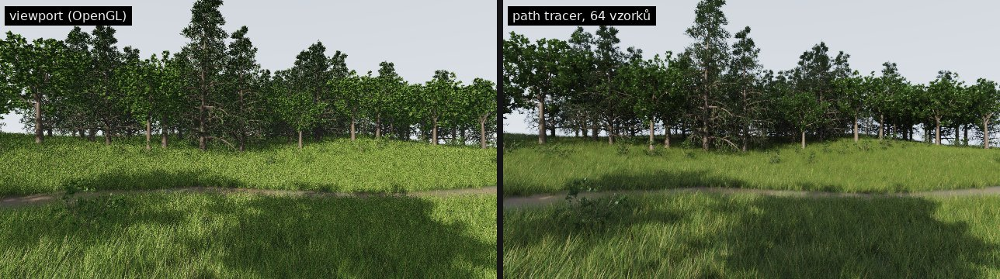
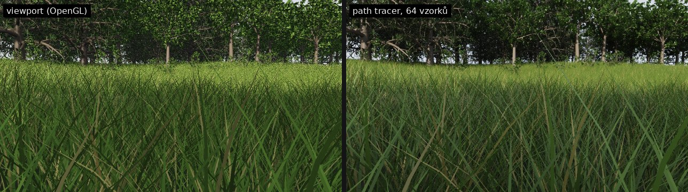
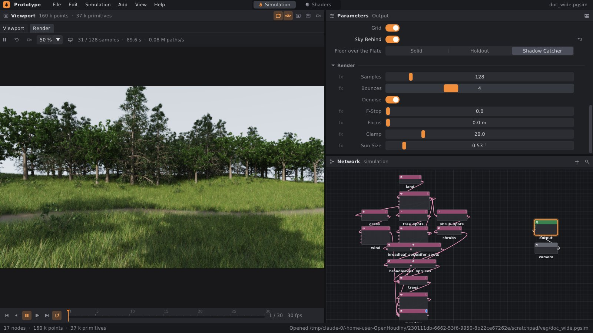
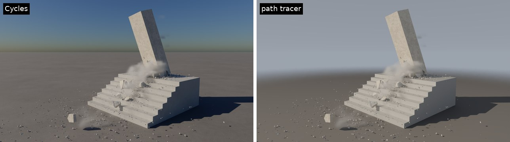
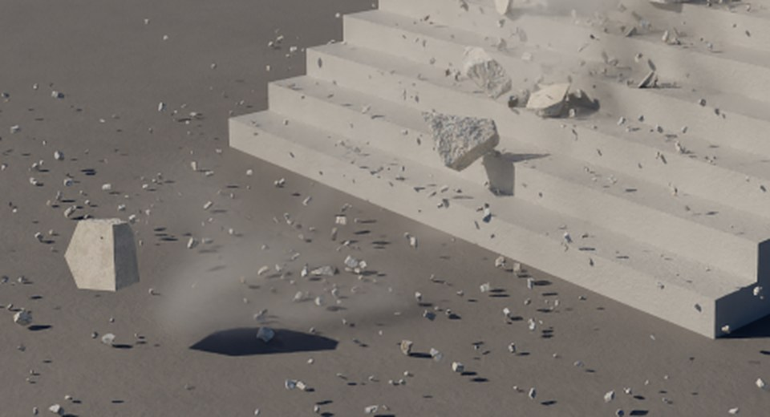
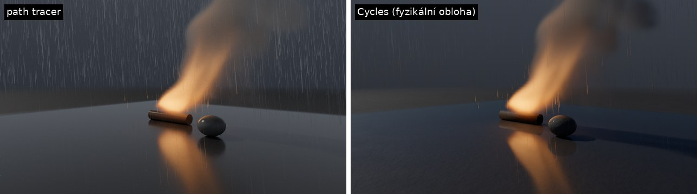
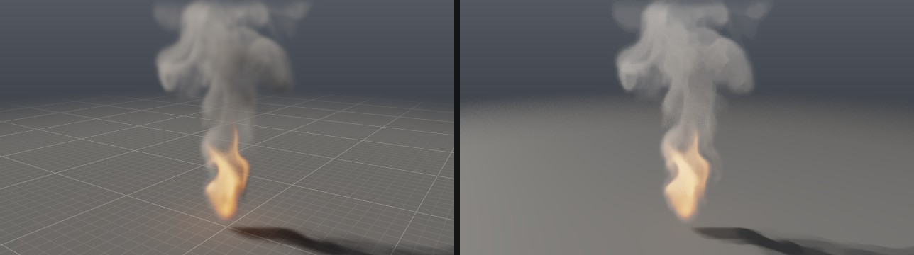
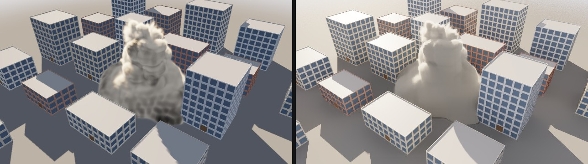
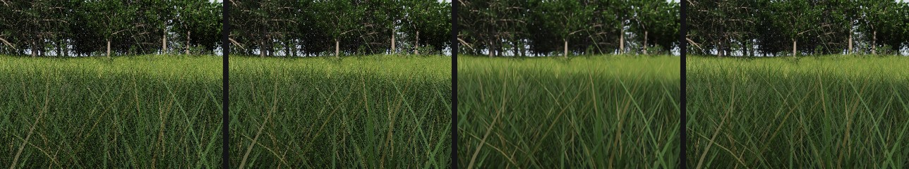

# Path tracer: pořádný render

Viewport kreslí scénu rychle přes OpenGL. Stín je tam jedna mapa, okolní
světlo je odhad a tráva nepropouští světlo. **Path tracer** počítá světlo
tak, jak se opravdu šíří. Z kamery sleduje paprsky, které se odrážejí od
povrchů, lámou se ve skle a ve vodě, prochází stébly a listy, rozptylují
se v kouři a prachu a končí na slunci, na obloze nebo v plameni. Počítá se na procesoru, takže nepotřebuje grafickou
kartu. Stejný render dá **záložka Render** v editoru vedle Viewportu
i příkazová řádka (`prototype sim … --renderer path`), třeba na farmě.

Výchozí renderer záložky Render je dnes **Cycles** z Blenderu
([cycles.md](cycles.md)). Path tracer se v záložce vybere v liště volbou
**Path tracer** a renderuje i v buildu bez Cycles. Fyzikální oblohu
a detail povrchů má jen Cycles. Převod barev (View: AgX Punchy, AgX,
ACES Fit, ACES 1.0, ACES 2.0, Standard) mají oba ([color.md](color.md)).





## 1. Rychlý start

V editoru:

1. Nad viewportem klikni na záložku **Render**.
2. Render začne hned a s každým průchodem je méně zrnitý. Změna parametru,
   snímku nebo pohledu ho spustí znovu.
3. Pohled se otáčí myší stejně jako ve viewportu: levé tlačítko otáčí,
   prostřední (nebo Shift + levé) posouvá, pravé a kolečko přibližují.
   Přes kameru (klávesa **0** ve viewportu) se renderuje záběr kamery
   v jejím poměru stran.
4. Nastavení je v uzlu **Output** v sekci **Render**. Ikona Output
   v nástrojové liště záložky uzel vybere. Scéna jen s geometrií (třeba
   příklad `meadow`) Output mít nemusí a renderuje se s výchozím
   nastavením. Output přidaný přes Tab v síti pak určuje slunce, oblohu,
   kameru i render.
5. Ikona fotoaparátu uloží render jako **PNG**, nebo jako **EXR**
   s lineárním světlem, hloubkou, albedem a normálami.

Z příkazové řádky:

```bash
./build/prototype sim meadow louka.png --renderer path                 # poslední snímek, nastavení z Output
./build/prototype sim meadow louka.png --renderer path --samples 256   # víc vzorků, méně šumu
./build/prototype sim meadow louka.exr --renderer path                 # EXR: R G B A, Z, albedo.*, N.*
./build/prototype sim meadow louka.mp4 --renderer path --samples 32    # každý snímek do videa
./build/prototype sim meadow louka.png --renderer path --size 1920x1080 --yaw 40 --pitch 12
```

Z Pythonu:

```python
net.render("louka.png", renderer="path", samples=128)
```

Path tracer nepotřebuje OpenGL, takže běží i v buildu bez EGL a bez
editoru.

## 2. Záložka Render



| prvek | co dělá |
|---|---|
| Cycles / Path tracer | čím se renderuje ([cycles.md](cycles.md)) |
| ▶ / ⏸ | pozastaví nebo spustí render (po návratu z Viewportu pokračuje sám) |
| ↻ | začne znovu od nuly |
| 📷 | uloží render do PNG nebo EXR |
| 25 / 50 / 100 % | velikost renderu: z panelu, nebo přes kameru z rozlišení kamery |
| ikona Output | vybere uzel Output s nastavením |
| `26 / 128 samples · 8.8 s · 0.46 M paths/s` | kolik vzorků je hotovo, jak dlouho to trvá a jak rychle to jde |

Render běží ve vlastním vlákně na všech jádrech a okno zůstává plynulé.
Při odchodu na záložku Viewport se zastaví, takže viewport dostane
procesor. Při změně scény se rozpracovaný průchod přeruší a začne nový.
Nová scéna ale nejdřív dokončí svůj první průchod, takže při přehrávání
simulace záložka ukazuje snímek po snímku, jak rychle se stihnou
spočítat. Snímek, na kterém se přehrávání zastaví, se renderuje dál.
Obraz se odšumí po prvním průchodu, na konci a mezi tím vždy, když
průchody od posledního odšumění trvaly aspoň tak dlouho jako odšumění
samo. Odšumění tak nezabere víc než polovinu času. Mezi tím
zůstane vidět poslední odšuměný obraz.

Na čtyřjádrovém stroji bez grafické karty je první obraz louky
(122 577 trsů trávy, 84 stromů) v 50 % panelu hotový asi za sekundu.
Použitelný je po 16–32 vzorcích, čistý po 128.

## 3. Nastavení (uzel Output › Render)

| parametr | výchozí | co dělá |
|---|---|---|
| Samples | 128 | vzorků na pixel, pak se render zastaví; víc je čistší, ale pomalejší |
| Bounces | 4 | kolikrát se světlo nejvýš odrazí; 0 je jen přímé slunce a obloha |
| Denoise | zapnuto | odšumění: Intel Open Image Denoise, bez ní vlastní filtr podle barvy, normály a hloubky |
| F-Stop | 0 | clona objektivu; 0 znamená vše ostré, 2,8 malou hloubku ostrosti |
| Focus | 0 m | vzdálenost ostrosti; 0 zaostří na to, co je uprostřed obrazu |
| Clamp | 20 | nejvíc, kolik jeden odraz přidá pixelu; bere světlé tečky (fireflies) |
| Sun Size | 0,53° | úhlový průměr slunce: větší slunce dává měkčí stíny |
| Motion Blur | 0,5 snímku | jak dlouho je otevřená závěrka: co se hýbe, se rozmaže po své dráze, v path traceru stejně jako v Cycles ([níže](#rozmazání-pohybem)); 0 je ostrý okamžik |

Světlo, obloha, podlaha, expozice a barva vody jsou ze stejného **Looku**
jako ve viewportu, takže jas obou sedí. Test ověřuje, že podlaha na slunci
má v path traceru stejnou hodnotu jako ve viewportu (0,8035 proti 0,8005).

### Rozmazání pohybem

Path tracer rozmazává totéž co Cycles
([cycles.md](cycles.md#rozmazání-pohybem)): sítě podle rychlosti `v`
bodů (kusy, látka, voda, zobrazená geometrie), drť a instance, objekty
scény animované klíči (posun i otáčení), plyn a kameru záběru. Každý
vzorek pixelu si vylosuje okamžik, kdy je závěrka otevřená, a celá jeho
cesta, i odrazy a stíny, vidí scénu v tom okamžiku.

- **Sítě**: Embree dostane rohy na začátku a na konci závěrky a mezi
  nimi je posouvá po přímce. Vlastní hierarchie má kvádry zvětšené
  o dráhu rohů a rohy posune sama.
- **Drť a instance**: umístění na začátku a na konci závěrky.
- **Objekty scény**: paprsek se přenese tam, kde objekt v tom okamžiku
  je: posune se proti jeho rychlosti a otočí zpátky kolem osy otáčení.
  Objekt se pak počítá přesně, jako by stál.
- **Plyn**: kouř, teplota a plamen se čtou tam, odkud sem plyn v ten
  okamžik doletí. Bod se posune proti rychlosti o rychlost × čas
  a s rychlostí v novém místě ještě jednou, jako v Cycles. Rychlost sahá
  i do dlaždic kolem plynu (podle toho, jak daleko plyn doletí, jedna až
  čtyři vrstvy), protože i tam se rozmazaný plyn dostane. Kroky delta
  trackingu v dlaždici omezuje nejvíc plynu, kolik v ní bod může
  přečíst: z dlaždice a tolika vrstev buněk kolem, kolik plyn v jejím
  okolí za čas vzorku uletí. Ty se berou z maxim vrstev sousedních
  dlaždic, nad 6 buněk z celých dlaždic. Tracking tak zůstane nestranný
  a pomalý kouř kroky skoro nezahustí. Táborák (400 × 600, 64 vzorků)
  trvá se závěrkou 0,5 14,1 s proti 8,1 s, kouř (200 × 300) 1,6 s proti
  1,2 s.
- **Kamera**: 33 kamer mezi začátkem a koncem závěrky, vzorek si vezme
  tu mezi dvěma nejbližšími.

Scéna bez pohybu se renderuje jako dřív: vzorek čas nelosuje a obraz je
bit po bitu stejný. S nulovou závěrkou je obraz scény, která se hýbe,
stejný jako bez pohybu až na zaokrouhlení: Embree počítá rohy v okamžiku
snímku z obou kroků.

## 4. Materiály

Materiál se čte z atributů geometrie, jako v Houdini: z primitivu, jinak
z prvního bodu, jinak z detailu.

| atribut | výchozí | co dělá |
|---|---|---|
| `Cd` | šedá | barva |
| `roughness` | 0,5 | 0 zrcadlo, 1 matný povrch (odlesk GGX) |
| `metallic` | 0 | 1 kov: barva tónuje odraz |
| `translucency` | 0 | kolik rozptýleného světla projde na druhou stranu: list, stéblo, papír |
| `glass` | – | 1 tabule skla (lom a Fresnel, index 1,5), 2 prasklina (matná bílá) |

Povrch vody je voda s indexem lomu 1,33. S hloubkou nabírá barvu Water
Looku (`waterColor`, `waterClarity`).

**Vegetace** má průsvitnost nastavenou sama: stébla z uzlu Grass 0,35,
listy z uzlu Tree 0,4, kůra 0. Proti slunci proto tráva a listí svítí.
`roughness` se nezapisuje. Po Merge s jinou geometrií by chybějící
hodnota 0 udělala z terénu zrcadlo.

### Drť, déšť a mokrý povrch



**Drť** kusů z RBD Solveru (volné body s `pscale`) kreslí oba renderery
jako hranaté úlomky:

- **Tvary.** Tucet tvarů kamene a šest střepů skla. Kámen je kvádr,
  zploštělý a protažený, kterému roviny odrazily rohy a hrany. Střep je
  plochý mnohoúhelník o třech až pěti stranách, tenký jako tabule.
- **Tvar podle `id`.** Každý bod dostane tvar podle svého `id`, takže si
  ho za letu drží.
- **Velikost a natočení.** Úlomek je velký jako jeho `pscale`
  (nejvzdálenější roh je tak daleko od středu) a natočený podle `orient`.
- **Barva.** Každý úlomek má vlastní odstín své barvy: některé jsou
  světlejší, tmavší nebo šedší.
- **Materiál.** Kámen je lom betonu (`broken_concrete`, s fotkou jako na
  úlomku asi 5 cm), sklo je sklo.
- **Instance.** Úlomky jsou instance, takže 40 000 kousků stojí 18 sítí
  a jejich umístění.



**Déšť** kreslí oba renderery stejně jako viewport:

- **Délka.** Každá kapka je čárka, kterou proletí za podíl snímku daný
  parametrem Streak uzlu Rain. Vede od místa, kde kapka je, zpátky po
  směru její rychlosti.
- **Tvar.** Tenké vřeteno, u hlavy silné jako kapka (2,5 mm, kapička ze
  šplíchnutí polovina), k ocasu se ztenčuje do ztracena.
- **Neprůhlednost.** Vřeteno je z vody (index lomu 1,33) a je tam jen po
  část času, kterou říká Opacity. Paprsek, který čárku trefí zepředu, ji
  s touto pravděpodobností potká (odrazí se od ní, nebo se do ní zalomí),
  jinak projde. Tak vypadá kapka rozmazaná pohybem.
- **Stín.** Déšť stín nevrhá.
- **Blízko kamery.** Kapky blíž než půl metru od kamery se vynechají,
  protože by byly mimo ostrost.

**Mokrý povrch.** Kde prší, je povrch obrácený nahoru tak mokrý, jak
říká Wet Floor uzlu Rain (jako podlaha ve viewportu). Je tmavší
o polovinu a hladší, takže vrstva vody zrcadlí okolí. Mokro sahá tak
daleko, kam dopadají kapky, a 35 cm za okrajem uschne.



Pod fyzikální oblohou je déšť v Cycles slabší, protože kapky lámou
skutečnou oblohu, ne oblohu Looku. Se Sky `look` mají čárky v obou
rendererech stejný kontrast (v příkladu storm +29 úrovní nad pozadím).

## 5. Kouř, oheň a prach



Plyn ze simulace (Pyro Solver) vykreslí path tracer stejně jako povrchy,
podle stejného **Volume Looku** jako viewport. Světlo ale počítá tak, jak
se šíří:

- Slunce svítí do kouře, kouř stíní sám sebe a vrhá stín na zem i na
  stavby.
- Světlo se v kouři rozptýlí i víckrát, takže hustý kouř prosvětlí sám
  sebe. Obloha ho přisvětlí ze všech stran.
- Plamen svítí do kouře kolem sebe a slabě i na okolí.

Viewport tohle odhaduje (Fire Light, Occlusion). Path tracer to počítá,
proto tyhle dva parametry nepoužívá.

| parametr Volume Looku | v path traceru |
|---|---|
| Smoke Color | barva, kterou hustý kouř vypadá (viz níže) |
| Smoke Density | kolik světla kouř zastaví na metr; v plameni méně, jako ve viewportu |
| Steam Color, Steam Density | pára ([quench.md](quench.md#pára)): kolik světla zastaví na metr a jakou barvou ho rozptýlí; v buňce s kouřem i párou je útlum součet a barva průměr vážený útlumem obou |
| Flame Intensity, Start, Range | kolik světla plamen vydá a jakou barvou podle teploty: černé těleso od 1000 K do 3000 K, stejně jako viewport |
| Fire Light, Occlusion | nepoužívá: světlo plamenů a stínění oblohy se počítá |

**Barva kouře.** Smoke Color 0,75 neznamená, že kouř při každém rozptylu
pohltí čtvrtinu světla. Po desítkách rozptylů v hustém kouři by ho
zbyla jen malá část a kouř by vyšel tmavý. Path tracer bere Smoke Color
jako barvu, kterou hustý kouř vypadá. Podíl, který si nechá každý
rozptyl, z ní dopočítá: 0,75 dá 0,984, 0,2 dá 0,61. Je to převod Chianga,
Kutze a Burleyho (2016), který Cycles používá pro kůži. Jas proto sedí
s viewportem: obecný kouř (`smoke`) má v průměru sRGB 129 proti 130 ve
viewportu, táborák je v obou světle šedý a výbuch v path traceru vyjde
113 proti 95.



Každý rozptyl v kouři se počítá jako odraz (Bounces v uzlu Output).
Plyn renderuje path tracer přes knihovnu **NanoVDB**. Bez ní
(`-DPG_NANOVDB=OFF`) se plyn v path traceru nevykreslí a příkazová řádka
to oznámí.

### Nad plate

Kamerou záběru s plate kreslí path tracer CG nad něj. Holdouty a shadow
catchery jsou skutečné věci ze záběru: tam zůstane plate. Na catcheru
path tracer spočítá, kolik světla mu CG vzalo (stíny, kouř) a přidalo
(oheň, odražené světlo), a plate tím vynásobí. Sklem a vodou je plate
vidět po lomeném paprsku. Podrobnosti jsou v
[plate.md](plate.md#ve-finálním-renderu-cycles-a-path-tracer).

## 6. Jak to funguje

- **Scéna** (`src/pg/render/Scene.h`): trojúhelníky zobrazené geometrie
  mají stejné normály a barvy jako ve viewportu (`sim::shadedTriangles`).
  Ke scéně patří i kusy a látka ze solverů, povrch vody a objekty
  (koule, kvádry… počítané přesně). **Instance** (`core/Instances.h`)
  mají síť prototypu jednou a jen se umístí, takže louka se 122 000 trsů
  stojí 8 sítí trsů plus umístění.
- **Drť a déšť** (`src/pg/render/Particles.h`): `chipMesh` staví tvary
  úlomků jednou (kvádr ořezaný rovinami, hranol střepu), `placeChips` je
  umístí na volné body s `pscale`, `rainMesh` udělá z kapek vřetena.
  Materiál deště (`Material::Kind::Rain`) path tracer s pravděpodobností
  1 − Opacity propustí, stejně jako každou čárku zezadu. Do stínových
  paprsků se déšť nedostane vůbec (`Mesh::shadows`): Embree ho nemá ve
  scéně stínů, vlastní hierarchie ho přeskočí. Mokro (`Scene::wetAt`)
  ztmaví povrch a sníží jeho drsnost směrem k 0,06.
- **Paprsky** (`src/pg/render/Embree.h`): co paprsek trefí, hledá knihovna
  **Intel Embree 4**. Hierarchie obalových kvádrů (BVH) staví a prochází
  s vektorovými instrukcemi procesoru (SSE, AVX2, AVX-512). Každá síť je
  jedna scéna Embree. Postaví se jednou a drží se se sítí, takže trs
  trávy, který se snímek po snímku kymácí, se nestaví znovu. Umístění
  jsou instance té scény. Síť bez transformace (terén, kusy, voda) je ve
  scéně přímo a paprsek se kvůli ní neotáčí. Embree staví hierarchii
  metodou SAH bez spatial splits, takže je stejná na libovolném počtu
  vláken. V robustním režimu žádný paprsek neproklouzne hranou mezi dvěma
  trojúhelníky. Stínový paprsek nejdřív jen zjistí, jestli mu něco
  neprůhledného stojí v cestě. Sklem a vodou pak prochází plochu po
  ploše a bere si jejich barvu. Objekty (koule, kvádry) hledá vlastní
  hierarchie (`src/pg/render/Bvh.h`, SAH se 12 přihrádkami).
- **Bez Embree** (`-DPG_EMBREE=OFF`, `PG_RAYS=own` v prostředí, nebo
  v buildu s thread sanitizerem, který vlákna Embree a TBB sledovat neumí)
  hledá paprsky vlastní hierarchie i v sítích. Výsledek je stejný až na
  zaokrouhlení: test `render_embree_meets_what_our_bvh_meets` porovná
  4 000 paprsků v obou (sítě, instance, sklo, objekty, podlaha, stíny).
- **Plyn** (`src/pg/render/Gas.h`): kouř, teplota, plamen a pára snímku
  jsou v mřížce **NanoVDB** (součást OpenVDB, Apache 2.0). Dlaždice 8 × 8 × 8
  buněk, ve kterých plyn je, jsou listy jejího stromu a hodnoty se mezi
  středy buněk čtou trilineárně jako texturou ve viewportu. Ke každé
  dlaždici patří nejvíc kouře, plamene a teploty, jaké bod v ní přečte,
  tedy včetně vrstvy buněk kolem. Paprsek jde plynem metodou **delta
  tracking**: dělá kroky tak dlouhé, jaké by dělal v nejhustším kouři
  dlaždice, a v každém kroku kouř rozhodne, jestli se tam světlo
  rozptýlí, s pravděpodobností úměrnou tomu, jak je tam hustý. Prázdné
  dlaždice paprsek přeskočí. Plamenem jde krokem aspoň po buňce a každý
  krok přičte světlo, které tam plamen vydá. Stínový paprsek ke slunci
  dělá stejné kroky a násobí podílem světla, který každý propustí
  (**ratio tracking**). Když zbude méně než desetina, rozhodne
  ruská ruleta. Obojí je nestranné: s více vzorky ubývá šum, ne
  přesnost (test porovná 20 000 paprsků s přesně spočtenou propustností,
  další totéž v kouři, který se hýbe, i s rychlostí přes půl sekundy).
  Rozptyl se řídí stejnou Henyeyho–Greensteinovou funkcí jako ve
  viewportu: hlavně dopředu, trochu zpátky. Odšumovač by se v kouři
  neměl čeho chytit, protože každý vzorek se v kouři buď rozptýlí, nebo
  jím projde. Proto se pro každý pixel jednou spočítá bez šumu, kolik
  kouře pixel vidí a jak daleko. Albedo, normála a hloubka pak přejdou
  z povrchu za kouřem do kouře plynule, podle toho, kolik ho kouř zakryje.
- **Světlo** (`src/pg/render/PathTracer.h`): slunce je kotouč, přímo se
  vzorkuje v každém odrazu a váží se s odrazy (multiple importance
  sampling). Obloha je vzorec z Looku včetně Sky Behind. Povrch je
  kombinace difúzního rozptylu, odlesku GGX a průchodu na druhou stranu
  (translucency). Sklo a voda odrážejí a lámou podle Fresnela a Snella.
  Od třetího odrazu rozhoduje ruská ruleta.
- **Kamera**: tenká čočka (F-Stop, Focus). Pixel je vzorkovaný po celé
  ploše, takže hrany jsou vyhlazené.
- **Determinismus**: náhodná čísla vzorku závisí jen na pixelu, čísle
  vzorku a seedu a hierarchie jsou na libovolném počtu vláken stejné.
  Render je proto na libovolném počtu vláken stejný (test
  `render_is_the_same_however_it_is_run`, s Embree i bez ní). Embree si
  ale podle procesoru vybere jiné instrukce a ty zaokrouhlují jinak.
  SSE2, SSE4.2 a AVX dají stejný obraz, AVX2 a AVX-512 každá trochu jiný.
  Na 2 vzorcích se liší většina pixelů, ale průměrně o 0,1 % jasu. Je to
  jiný šum, ne jiný obraz. Vlastní hierarchie dává stejný obraz na všech
  strojích a s GCC i clang.
- **Odšumění** (`src/pg/render/Denoise.h`): **Intel Open Image Denoise**
  (Apache 2.0), neuronová síť natrénovaná na obrazech z path tracerů.
  Používá ji Blender, Houdini (Karma), Arnold, V-Ray i Unreal. Dostane
  světlo, albedo a normály pixelů. Albedo a normály nejdřív samostatně
  odšumí, protože i v nich zůstává šum: z hloubky ostrosti, z plynu
  a z listí a stébel, která pixel zakrývají jen zčásti. Teprve pak
  odšumí světlo. Filtry se pro danou velikost obrazu připraví jednou.
  Stejný obraz odšumí pokaždé stejně. Bez ní (`-DPG_OIDN=OFF`,
  `PG_DENOISER=own` v prostředí, nebo v buildu se sanitizery)
  odšumuje vlastní à-trous vlnkový filtr (Dammertz a kol.) nad světlem,
  které povrch dostal. Barva povrchu se vydělí a potom vrátí, takže
  textura zůstane ostrá. Filtr se zastaví na hranách barvy, normály
  a hloubky a tam, kde se pixely liší víc než o šum (rozptyl vzorků
  z okolí 5 × 5).
- **Výstup**: expozice a pohled z Outputu: AgX, ACES 1.0 a 2.0 jako
  v OpenColorIO, nebo tónová křivka ACES (Narkowicz) a gama 2,2 jako
  viewport ([color.md](color.md)). EXR ukládá lineární světlo bez křivky,
  v Rec. 709, ACEScg nebo ACES2065-1.



Po 16 vzorcích se obraz z Open Image Denoise liší od obrazu s 256 vzorky
o 0,040, z vlastního filtru o 0,051 a bez odšumění o 0,058 (odmocnina
střední kvadratické odchylky zobrazených hodnot 0–1). Nejvíc pomůže
v trávě: 0,027 proti 0,045. Test
`render_open_image_denoise_comes_nearer_than_our_filter` měří totéž
v lineárním světle pod zataženou oblohou po 4 vzorcích proti 512:
0,020, 0,035 a 0,074.

## 7. Výkon

Čtyři jádra (Xeon 2,8 GHz s AVX-512), RelWithDebInfo, oba sloupce měřené
po sobě na stejném stroji:

| scéna | rozlišení | vzorků | Embree | vlastní BVH |
|---|---|---|---|---|
| louka zdálky (tráva, stromy, keře) | 480 × 270 | 1 průchod | 1,2 s | 2,0 s |
| louka zdálky | 640 × 360 | 64 | 60 s | 116 s |
| tráva zblízka (paprsky jdou hluboko do trávy) | 640 × 360 | 64 | 85 s | 180 s |

Jeden průchod v jiných scénách je s Embree 1,6× rychlejší u stromů
(`tree_shapes`, 1,2 milionu trojúhelníků) a 1,5× u ulice. Stínové
paprsky jsou rychlejší 2–5×. Stavba scény louky trvá s Embree 0,4 s,
s vlastní hierarchií 0,8 s.

Louku víc nezrychlí ani Embree. Má 122 000 malých trsů trávy
(112 trojúhelníků v každém) a jejich obalové kvádry se překrývají.
Paprsek u země jich projde průměrně 56, než trefí stéblo, a u každého se
otáčí do prostoru trsu. Rychlejší by byly větší trsy s víc stébly.

Odšumění na čtyřech jádrech (Xeon 2,1 GHz s AVX-512): Open Image Denoise
potřebuje na obraz 640 × 360 0,8 s, na 1280 × 720 3,4 s a na
1920 × 1080 7,9 s a až 1,6 GB paměti. Dvě třetiny času zaberou albedo
a normály. Vlastní filtr je asi dvakrát rychlejší (0,4 s, 1,7 s
a 4,3 s). Záložka Render proto odšumuje jen tak často, aby odšumění
nezabralo víc než polovinu času.

## 8. Co zatím chybí

- Objemy zobrazené geometrie (třeba z Convert Volume): kreslí je jen
  viewport, path tracer kreslí plyn simulace.
- Vlnky po kapkách na vodě má jen síť vody (`waterMesh`), stékající
  stružky a mokré svislé stěny ne.
- Světlo plamenů dopadá na okolí jen odrazy, které plamen náhodou
  trefí. Plameny se nevzorkují přímo jako slunce, takže země u ohně má
  víc šumu.
- Průchody pohybu a masek do EXR.
- Textury a UV, normálové mapy, subsurface scattering.
- Světla kromě slunce a oblohy (bodová, plošná), HDRI obloha.
- Svazky paprsků (ray streams, wavefront): dnes se sleduje jedna cesta po
  druhé. Embree umí najednou 4, 8 nebo 16 souběžných paprsků.
- Adaptivní vzorkování: víc vzorků tam, kde je šum.
