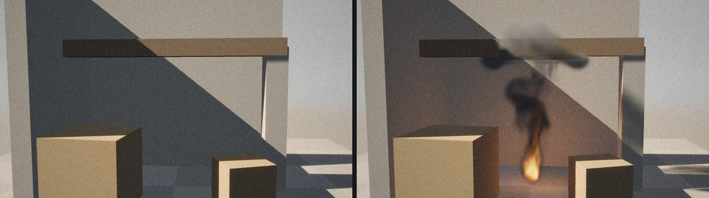
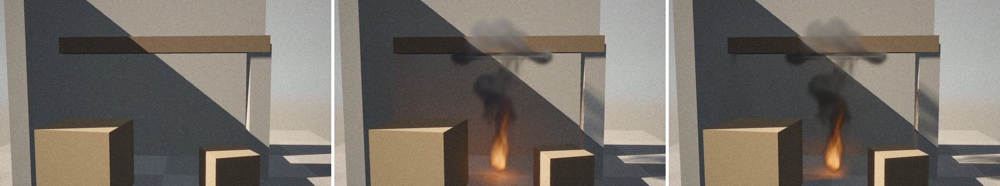

# Shot footage (plate)

In a studio, an effect is rendered into live-action footage. A **plate** is
an image sequence from the camera on set; matchmove computes the camera
motion from it (the USD Camera node, [usd-import.md](usd-import.md)) and the
CG is rendered through the same camera over the plate. Prototype handles the
whole thing:

- it reads **PNG, JPEG and OpenEXR** sequences with its own readers, without libraries;
- it draws the plate **behind the CG** when you look through the shot camera, both in the editor and in the render;
- objects and the floor can be real things from the shot:
  - a **holdout** hides the CG behind it and shows the plate there;
  - a **shadow catcher** does the same and also receives the CG's shadows and the firelight;
- it writes the CG separately with alpha to **EXR**, with the catcher pass next to it, for compositing;
- the final render, **Cycles** and the path tracer, can do the same ([§4](#in-the-final-render-cycles-and-the-path-tracer)).

Where the CG changes nothing, the plate comes out of the render pixel for
pixel as it went in.



## 1. Quick start

```bash
PYTHONPATH=build/python python3 examples/usd/make_plate.py   # "shoots" the example plate (numpy)
./build/prototype sim matchmove mm.mp4                       # fire in the filmed courtyard, whole shot
./build/prototype sim matchmove mm.exr --every 24            # CG with alpha and catcher pass for compositing
./build/prototype examples/sim/matchmove.pgsim               # editor: key 0 = view through the camera, with plate
```

The example shot has no real camera or courtyard, so the program shoots the
plate itself. `examples/usd/make_plate.py` renders the set from `shot.usda`
through the matchmove camera, frame by frame. Then it adds what a camera and
a scan would give it:

- a lens that is slightly soft and darker towards the corners;
- highlights that bleed warmly (halation);
- a color grade;
- grain that is different in every frame.

The result is 72 JPEGs, `examples/usd/plate/courtyard.1001.jpg` to `.1072.jpg`,
1280 × 720, about 16 MB. Git ignores them: they can be regenerated at any time.

In the `matchmove` network:
- USD Camera has `plate` = `../usd/plate/courtyard.####.jpg`;
- the `walls` object (walls, beam, pillar and crates from USD) is a shadow catcher;
- the floor is a shadow catcher by default.

Without the plate the network renders as before: with no image behind it and
everything as CG (the compile warns `no plate at frame 1`).

## 2. Plate on the camera

Both the **Camera** and **USD Camera** nodes have a **Plate** section:

| parameter | what it does |
|---|---|
| **Plate** (`plate`) | a file, or a sequence with the frame number in its name: `plate.####.exr` (as many digits as there are `#`), `plate.$F4.exr` (`$F` without zero padding), `plate.%04d.exr` (`%d` without padding). A relative path is resolved from the network's folder. A name without a number is the same image in all frames |
| **Plate Frame** (`plate_frame`) | the plate frame number at frame 1. On Camera the default is 1 (a plate for 1001… needs 1001). On USD Camera the default is 0: the plate follows the shot's time codes, and the frame with time code 1001 reads `….1001.…`. The camera offset (Frame Offset) shifts the plate too |

- **Formats:** PNG, JPEG and OpenEXR, recognized by file content (not by extension).
- **Size:** a plate the same size as the camera image (Width × Height) is drawn
  pixel for pixel. Otherwise it is stretched over the whole camera frame and filtered.
- **Colors:** PNG and JPEG are pictures as they appear on screen. They are
  therefore brought back into the renderer's light through its view transform
  (inverse ACES and gamma 2.2), and where there is only plate, they come out
  the same again. EXR is linear light and is taken as is.
- **When it is drawn:** only in the camera view. In the editor the view is switched by the **0** key
  (or the eye in the viewport header); a camera render always uses it when the network has one.
- **Reading:** a frame is read when it changes. A missing or broken file
  is reported, with the reason, by the editor in the viewport and by `prototype sim` in the terminal.
  The image is then drawn without the plate.

## 3. What is over the plate: holdout and shadow catcher

The **Object** node has an **Over the Plate** (`matte`) parameter in its Look section.
Output has **Floor over the Plate** (`floor_matte`) for the floor.

| option | object over the plate | default |
|---|---|---|
| **Solid** | CG: drawn as itself and covers the plate | objects |
| **Holdout** | a real thing from the shot: CG behind it disappears and the plate shows there as is | |
| **Shadow Catcher** | a holdout that the CG relights: CG shadows (from objects, displayed geometry, smoke) darken the plate, fire brightens it | floor |

This does not change the simulation. Holdouts and catchers are still
colliders: smoke flows around them and water hits them. Without a plate
everything is drawn as Solid.

How the catcher works. For a point on the catcher, the light is computed:
- **with CG:** sun behind everything (including smoke and CG objects), sky and firelight;
- **without CG:** sun behind real things only (holdouts and catchers) and sky.

The plate is multiplied by their ratio. Where the CG changes nothing, the
ratio is exactly 1 and the plate stays as is. Smoke shadow darkens it,
firelight brightens it, and more so where there was in reality only skylight
(in the shadow of walls). Real shadows the plate already has are not added a
second time.

## 4. EXR for compositing over the plate

Over a plate, `prototype sim … OUT.exr` writes only the CG, so it can go into compositing:

| channel | what it contains |
|---|---|
| `R`, `G`, `B` | CG in linear light: smoke, fire, CG objects; the plate is not in them |
| `A` | how much of the pixel the CG covers: 1 on a CG object, smoke opacity, 0 where there is only plate (including on holdouts and catchers) |
| `catcher.R`, `catcher.G`, `catcher.B` | what to multiply the plate by: 1 where the CG changes nothing; less in CG shadows; more where fire shines |

The shot is then `plate × catcher × (1 − A) + RGB`. In Nuke: multiply the
plate (linear) by the `catcher` channels (Merge multiply, or Shuffle and
Multiply) and put the render over it with the `over` operation. A plate from
PNG or JPEG must go into linear light through the same inverse view transform
(§2). The other passes (`Z`, `forward.u/v`, masks) are the same as without a
plate ([render.md](render.md#4-exr-for-compositing)).

Verified on the `matchmove` example: compositing by the formula, passed
through the tone curve, gives the PNG from the renderer. For 99.7% of pixels
it matches to the level (out of 255); differences remain only on edges where
the 2 × 2 antialiasing is averaged differently.

### In the final render: Cycles and the path tracer



The plate also goes into the final render when rendering through the shot
camera: in `prototype sim … --renderer cycles` or `--renderer path`, and in
the editor's **Render** tab (camera view, key **0**).

```bash
./build/prototype sim matchmove mm.png --renderer cycles             # frame 72 over the plate
./build/prototype sim matchmove mm.exr --renderer cycles --every 24  # CG, A and catcher for compositing
./build/prototype sim matchmove mm.png --renderer path --samples 128 # the same through the path tracer
```

The renderer gives only the CG, how much of the pixel it covers (alpha) and
what to multiply the plate by (catcher). The PNG and the Render tab show
`plate × catcher × (1 − A) + CG` in linear light. The EXR has channels as in
the table above (plus `Z`, `albedo.*` and `N.*`, [cycles.md](cycles.md)). PNG
and JPEG go back into the renderer's light through the inverse of its view
transform (AgX, AgX Punchy or ACES, `unshown`), so where the CG changes
nothing, the plate comes out the same pixel for pixel. The only exception is
pure white: AgX Punchy shows at most 254.5 out of 255, so 255 comes out as
254.

- **Cycles** renders to a transparent film, including through glass
  (Transparent Glass as in Blender). Holdouts and catchers, both objects and
  the floor, are its own holdouts and shadow catchers. Sun and sky are real
  lights that lit the plate (in Blender, "shadow catcher" on a light), and
  therefore also shine in the light without CG. The plate multiplier is the
  Shadow Catcher pass: light on the catcher with CG divided by light without
  CG, both path traced. CG shadows, smoke and fire are fully in it and are
  denoised together with the image.
- **Path tracer:** a camera ray that ends on the plate, a holdout or a
  catcher leaves the pixel to the plate. On a catcher it computes the light
  of a white matte surface with and without the CG from the same rays. With
  CG this is the sun behind everything (including smoke) and one sky
  direction, which sees either the sky or whatever the CG sends: its light,
  the firelight. Without CG it is the sun behind real things only and the sky
  between them. Where the CG changes nothing, both are equal and the ratio is
  exactly 1. The multiplier is denoised by Open Image Denoise together with
  the image. Through glass and water the camera sees the plate along the
  refracted ray. That ray is then already in the CG and the glass alpha is 1,
  whereas in Cycles glass is transparent.
- **Without a plate**, when viewing other than through the shot camera or with
  a camera without a plate, holdouts and catchers are drawn as ordinary objects.

Cycles and the path tracer give a similar image over the plate. Shadows in
both are traced rays, so firelight is stopped even by a wall that it passes
through in the viewport. A 1280 × 720 frame on four cores takes 7.6 min in
Cycles with 64 samples, 2.2 min in the path tracer with 128 samples. The EXR
from Cycles, composited by the formula and passed through the tone curve,
gives the PNG from the renderer: 98% of pixels exactly, the rest off by 1
level out of 255, because EXR stores values as half float.

## 4b. Transparent: an element without a plate

Output > **Transparent** (`transparent`) renders as if over an empty plate:
the smoke, the fire and the rest alone, as a stock element, to lay over a
picture of your own. A PNG gets an alpha channel — the colour not
premultiplied, as PNG has it — and an EXR its `A`; in both the alpha holds
the shadows the floor catches too (Floor over the Plate, Shadow Catcher by
default): where there is no CG, a shadow is black, as covering as it is
dark. The viewport's renderer, the path tracer and Cycles all do it.

A video keeps the alpha in the containers that can hold it, through ffmpeg:

| file | codec | |
|---|---|---|
| `.mov` | ProRes 4444 (QuickTime Animation without `prores_ks`) | what compositing programs take |
| `.webm` | VP9 with alpha | what browsers play over a page |
| `.mkv` | FFV1 | lossless |

`.mp4`, `.avi` and `.gif` keep no alpha: there the render comes out over
black, and `prototype sim` says so.

```bash
./build/prototype sim smoke_plume out/plume.png --every 1 --set output.transparent=1   # PNG frames with alpha
./build/prototype sim smoke_plume out/plume.exr --every 1 --set output.transparent=1   # EXR: R G B A, premultiplied
./build/prototype sim smoke_plume out/plume.mov --set output.transparent=1              # ProRes 4444 with alpha
./build/prototype sim smoke_plume out/plume.webm --set output.transparent=1             # VP9 with alpha
```

## 5. Images without libraries

Plates are read by the program's own readers in `src/pg/io`. The same readers and writers are
available in Python as `pg.read_picture` and `pg.write_picture`
([python.md](python.md#images)).

| format | reads | verified |
|---|---|---|
| PNG | 1, 2, 4, 8 and 16 bits; gray, gray with alpha, RGB, RGBA and palette (including `tRNS` transparency); all five filters; Adam7 interlacing | value for value against Pillow: fixtures and 40 random files |
| JPEG | baseline and progressive, gray and YCbCr, any subsampling (4:2:0, 4:2:2, 4:4:0, 4:4:4), restart markers | bit for bit like libjpeg: 8 fixtures and 60 random files of varying quality. The same integer IDCT (`islow`), "fancy" chroma upsampling and YCbCr conversion |
| OpenEXR | scanlines; uncompressed, RLE, ZIPS, ZIP, PIZ, PXR24, B44 and B44A; half, float and uint channels | value for value against the OpenEXR library: one file per compression and 48 random ones. Including PIZ with the 16-bit wavelet and a data window smaller than the image |

From EXR, `R`, `G`, `B` (`A`) are taken. If they are missing, the first layer
that has them is used (`beauty.R`…), otherwise `Y` as gray, otherwise the first
channel. Deflate (for PNG and ZIP) is the program's own: stored blocks, fixed
and dynamic Huffman codes, 10-bit tables. A 2K frame is read in 50–190 ms.

Written formats are PNG (8 bits, RGB or RGBA, deflate without compression), JPEG
(baseline 4:2:0, [render.md](render.md)) and EXR (half, RLE).

## 6. Rendering geometry only

A network without a simulation, with only displayed geometry, used to be
drawn as a single image from the geometry view. When Output has a camera, it
is now drawn through that camera over all of Output's frames (`--every 1`,
video), with animated camera and geometry. This is how `make_plate.py` shoots
the plate from the set: layout or previz without a simulation.

## 7. Verified

- **Plate unchanged:** in the `ThroughAPlate` test a JPEG goes through the
  renderer with everything possible over it, but no CG. It comes out
  identical pixel for pixel:
  - on its own;
  - with the floor as a catcher and as a holdout;
  - with an object as a holdout;
  - with an object as a catcher.
- **A CG object** over the plate covers what it covers, and its shadow on the
  floor (a catcher) darkens the plate. In the EXR its `A` is 1, elsewhere 0,
  and RGB there is 0. `catcher` is below 1 in the shadow and exactly 1 elsewhere.
- **The `matchmove` example:** the sky is exactly the plate in every frame.
  The walls and ground change only where firelight or smoke shadow falls.
  Light falls on the sides facing the fire, the underside of the beam is lit,
  the front sides of the crates are not.
- **Geometry shadow map:** walls lit by the sun at a grazing angle had stripes
  in the shadows of displayed geometry. The shadow is now looked up slightly
  off the surface along the normal (one and a half texels of the map) and the
  stripes are gone.

- **Final render over the plate** (`tests/test_render.cpp`): a shot with a CG
  box, its shadow on the floor (catcher), a holdout in front of a second box,
  and glass. Path tracer and Cycles:
  - above the horizon they give the plate pixel for pixel (320 of 320 pixels);
  - the box covers its pixel (alpha 1.00), the holdout uncovers it (0.00) and
    behind it is the plate, to the level;
  - the box's shadow multiplies the plate by 0.17 (path tracer) and 0.22 (Cycles);
  - through glass the plate is 7 to 8% darker, by the reflection on the glass;
  - the EXR (from the path tracer) has `A` and `catcher.R/G/B`;
  - without a plate the holdout and catcher are ordinary objects: the holdout
    pixel has its light in the path tracer (0.13), over the plate nothing from CG.
- **Inverse view transform** (`render_unshown_gives_back_the_light_a_picture_shows`):
  all 256 grays return to the level in AgX, AgX Punchy (white at 254) and
  ACES; photo colors in AgX and ACES all of them, in AgX Punchy 3,998 out of
  4,000, the rest off by one level.
- **The `matchmove` example without fire** in Cycles: multiplier 0.997 to
  1.003 (1st and 99th percentile), the image differs from the plate by 0.9
  levels out of 255 on average (plate downscaled to 640 × 360).

## 8. In the code

| file | what it does |
|---|---|
| `src/pg/io/Picture.h` | `Picture`, `readPicture`, `decodePicture`, `decodePng`, `decodeJpeg`, `encodePng`, `writePicture`, `sequenceFile`, `isSequence` |
| `src/pg/io/Inflate.h` | `inflate`, `zlibInflate`: deflate and zlib |
| `src/pg/io/Png.cpp`, `JpegDecode.cpp`, `ExrRead.cpp` | readers (and PNG writing) |
| `src/pg/sim/Camera.h` | `Camera::plate`, `plateFrame`, `plateFile(frame)` |
| `src/pg/sim/Look.h`, `Scene.h` | `Matte` (None, Holdout, Catcher), `Solid::matte`, `Look::floorMatte` |
| `src/pg/gl/Volume.h` | `setPlate`, `clearPlate`: plate as an RGBA16F texture; in the shader `plateAt`, `realSun`, `catcher`; the `catcher.*` pass in `writePassesExr` |
| `src/pg/render/Plate.h` | final render: `Plate`, `loadPlate`, `plateLight` (plate in the renderer's light), `plateSeen` (in image pixels), `overPlate` (compositing) |
| `src/pg/render/PathTracer.h`, `Scene.h` | `unshown` (inverse view transform); `PathTracer::alpha`, `catcher`; `Scene::plate`, `matteOf`, `realBlocks` |
| `src/pg/render/Cycles.cpp` | transparent film, Cycles holdouts and shadow catchers, sun and sky as real lights, the `catcher` pass |
| `tools/prototype/SimViewport.cpp`, `Commands.cpp` | the plate in the editor and in `prototype sim` |
| `examples/usd/make_plate.py` | the example plate: the set through the matchmove camera, plus "film" |
| `tests/test_picture.cpp` | 7 tests: PNG, JPEG and EXR against libraries, sequence names, broken files, write and read back, plate and matte in a network |
| `tests/python/test_picture.py` | 12 tests: against Pillow and OpenEXR (reading and writing), writing and errors, plate through the renderer |

## 9. Limitations

- **Lens distortion:** the plate must be undistorted,
  as delivered by matchmove. The program reads neither STMaps nor overscan.
- **Film offset** (`horizontalApertureOffset`) is not rendered by the camera,
  so the plate must not need it.
- **Real catcher shadows** are computed by the program from the objects'
  bodies. For shapes (sphere, box…) exactly; for objects from geometry, from a
  distance field with 64 cells along the longest side. That is coarser than
  the shadows the plate has. On the edge of a real shadow, where the fire
  shines, a seam a pixel or two wide may therefore remain.
- **Firelight** passes through walls in the viewport: the viewport does not
  shadow it. Cycles and the path tracer do.
- **Grain:** the CG does not have the plate's grain. Matching it is a
  compositing job using the EXR.
- **Reflections and lighting from the plate:** the CG sees the plate only as
  a background. Water in it does not reflect the plate and no HDRI light comes from it.
- **Formats:**
  - JPEG without arithmetic coding, 12-bit and lossless modes;
  - PNG ignoring `gAMA` and `iCCP`, no APNG;
  - EXR without tiles, deep data, multipart, DWAA/DWAB and subsampled channels;
  - values above 65504 are clipped on the GPU (half float).
- **The `catcher` pass** is averaged from the 2 × 2 antialiasing separately
  from alpha, so compositing by the formula differs from the render on CG
  edges (§4).
