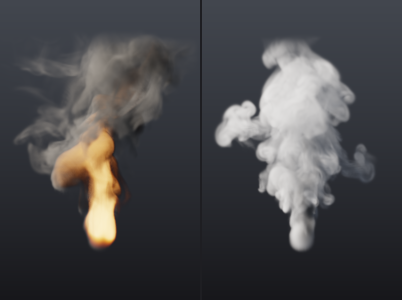
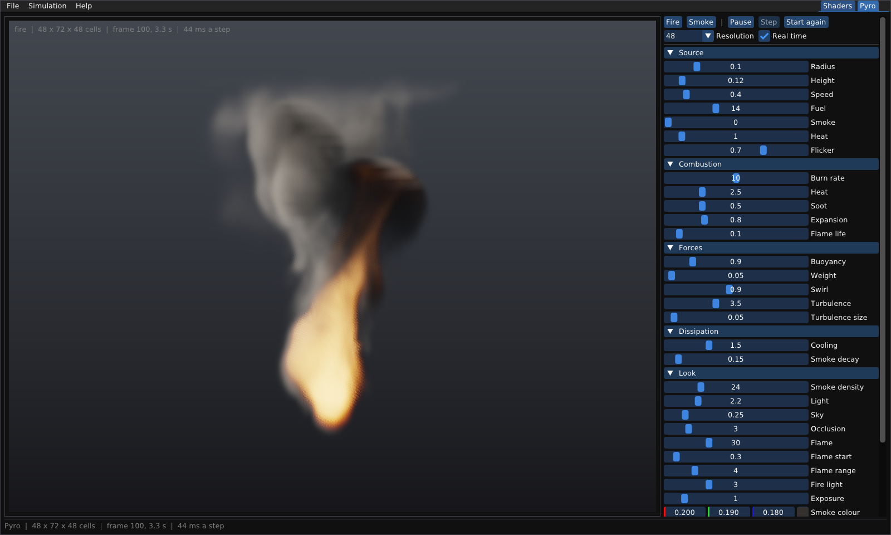

# Kouř a oheň: simulace (Pyro)

Skutečná simulace plynu na 3D mřížce, stejný princip jako Pyro v Houdini.
Kouř a oheň se tu hýbou, protože to vyplývá z rovnic proudění: teplo stoupá,
víry se stáčejí, palivo hoří a plyn se rozpíná. Shaderové efekty
z [shader-graph.md §6](shader-graph.md#6-efekty-oheň-a-kouř) pohyb jen
předstírají šumem na jedné ploše.




Všechno je v programu `pgshader`. V editoru je to záložka **Pyro** vpravo
nahoře, v příkazové řádce příkaz `pgshader pyro`.

Obsah:
[1. Rychlý start](#1-rychlý-start) ·
[2. Ovládání](#2-ovládání) ·
[3. Jak simulace funguje](#3-jak-simulace-funguje) ·
[4. Jak se kreslí](#4-jak-se-kreslí) ·
[5. Nastavení](#5-nastavení) ·
[6. Výkon a determinismus](#6-výkon-a-determinismus) ·
[7. Ověřování](#7-ověřování) ·
[8. Co je potřeba znát](#8-co-je-potřeba-znát) ·
[9. Omezení a co dělá produkce](#9-omezení-a-co-dělá-produkce) ·
[10. Odkazy](#10-odkazy)

---

## 1. Rychlý start

```bash
./build/pgshader --pyro                         # editor, rovnou oheň
./build/pgshader --pyro smoke --resolution 96   # kouř, jemnější mřížka

# bez okna: poslední snímek, nebo každý k-tý jako očíslovanou sekvenci
./build/pgshader pyro fire.png --frames 90
./build/pgshader pyro out/fire.png --frames 120 --every 2 --resolution 96
./build/pgshader pyro smoke.png --preset smoke --set turbulence=6 --set smokeDensity=10
```

Příkaz `pyro` vypíše, kolik času zabral jeden krok simulace a kolik jeden
obrázek. Vykresluje přes EGL bez okna, takže funguje i na serveru; bez GPU
stačí softwarový ovladač, třeba Mesa llvmpipe.

## 2. Ovládání



- **Záložky** vpravo nahoře přepínají mezi editorem shaderů a Pyro.
- **Pohled:** tažením myší kolem domény obíháte, kolečkem přibližujete,
  dvojklik vrátí kameru na začátek.
- **Fire / Smoke** načte preset. Simulace začne znovu, rozlišení zůstane.
- **Pause / Play** (mezerník), **Step** (jeden krok, když stojí),
  **Start again** (Home).
- **Resolution**: počet buněk napříč doménou. Doména je 1 široká, 1,5 vysoká
  a 1 hluboká. Dvojnásobné rozlišení znamená osminásobek práce.
- **Real time**: simulace nepoběží rychleji než skutečný čas. Když je
  vypnuté, běží tak rychle, jak to řešič zvládne.
- Skupiny **Source, Combustion, Forces, Dissipation** nastavují fyziku,
  **Look** vzhled a **Solver** přesnost. Nápověda je v tooltipech.
- **File › Save image** uloží obrázek 800 × 1200.

Simulace běží ve vlastním vlákně. Kamera se proto otáčí plynule s obnovovací
frekvencí obrazovky, i když jeden krok simulace trvá déle. Posuvníky se
generují z tabulek `pyroParams()` a `volumeParams()`, stejně jako editor
shaderů staví uzly z knihovny. Nový parametr v tabulce se tedy v panelu
objeví bez zásahu do editoru.

## 3. Jak simulace funguje

Doména je krabice rozdělená na buňky. V každé buňce jsou pole:

| pole | význam |
|---|---|
| `density` | kouř, saze: to, co pohlcuje a rozptyluje světlo |
| `temperature` | teplo: zvedá plyn vzhůru |
| `fuel` | palivo, které ještě neshořelo |
| `flame` | palivo spálené během poslední `flameLife` sekundy: kde je plamen |
| `velocity` | rychlost proudění, tři složky |

Jeden krok simulace ([`src/pg/sim/Pyro.h`](../src/pg/sim/Pyro.h)) má šest fází:

1. **emit** — zdroj (koule u podlahy) přidává palivo, nebo kouř a teplo,
   a tlačí plyn nahoru. Jeho výkon kolísá podle šumu, který stoupá zdrojem.
   Díky tomu plamen blikotá.
2. **advect** — proudění unáší všechna pole, včetně rychlosti samotné.
3. **combust** — část paliva shoří (`burnRate` za sekundu) a změní se
   v teplo, saze a plamen. Hořící plyn se rozpíná.
4. **forces** — teplo stoupá, saze klesají, vorticity confinement vrací víry
   a turbulence proudění trhá.
5. **project** — tlak zajistí, že plyn je nestlačitelný, kromě míst, kde se
   hořením rozpíná.
6. **dissipate** — kouř řídne, teplo chladne a plameny hasnou.

### Unášení (advekce)

Nejjednodušší metoda je vzít hodnotu z buňky a posunout ji podle rychlosti.
Při velkém kroku je ale nestabilní a simulace vybuchne. Místo toho se
používá **semi-Lagrangeova metoda** (Stam, *Stable Fluids*, 1999): pro každou
buňku se zjistí, *odkud* sem plyn za krok přitekl, a hodnota se tam přečte
trilineární interpolací. Taková metoda je stabilní při libovolném kroku. Cesta
zpátky se počítá metodou Runge-Kutta 2. řádu: nejdřív půl kroku, pak celý krok
s rychlostí z poloviny cesty. Víry se díky tomu nerozplývají do spirál.

Interpolace ale rozmazává. Kouř, teplo, palivo a plamen se proto unášejí
metodou **MacCormack** (Selle a kol., 2008): výsledek se unese ještě jednou,
tentokrát proti proudu, a porovná se s tím, co v buňce bylo na začátku.
Tahle zkouška ukáže chybu tam a zpátky a výsledek se opraví o její
polovinu. Aby oprava nevytvořila nové extrémy, ořízne se na rozsah osmi
hodnot, ze kterých se interpolovalo. Na otevřených hranách se oprava
vypíná. Cesta tam totiž vede ven z domény, odkud se vrací nula, a „oprava“
by kouř u hranice přidávala.

### Mřížka MAC

Kouř, teplo, palivo a plamen jsou uprostřed buněk. Rychlost je
**posunutá** (MAC grid, Harlow a Welch, 1965): složka x leží na stěnách mezi
buňkami ve směru x, složka y na stěnách ve směru y a tak dál. Mřížka o `n`
buňkách má tedy v daném směru `n + 1` stěn. Divergence buňky, tedy kolik
plynu z ní vytéká, se pak spočítá přesně ze šesti stěn:

```
div = (u[i+1] − u[i] + v[j+1] − v[j] + w[k+1] − w[k]) / h
```

Na mřížce se vším uprostřed by se divergence počítala ob buňku. Sudé a liché
buňky by se pak navzájem „neviděly“ a tlak by v nich vytvářel šachovnici,
kterou projekce neodstraní.

### Projekce a tlak

Plyn v simulaci je nestlačitelný: kolik do buňky přiteče, tolik z ní odteče.
Síly a advekce tuhle vlastnost porušují, a tak se na konci kroku opraví.
Najde se tlak `p`, jehož spád (gradient) přesně vyrovná divergenci, a
odečte se od rychlosti. Hledání tlaku je Poissonova rovnice:

```
součet přes 6 sousedů (p[soused] − p) / h² = div − rozpínání
```

Kde hoří palivo, má divergence odpovídat rozpínání plynu (`expansion`).
Tam plyn doopravdy přibývá.

Rovnice se řeší **geometrickým multigridem**
([`Poisson.h`](../src/pg/sim/Poisson.h)). Jednoduché iterace (Jacobi,
Gauss-Seidel) rychle srovnají chybu mezi sousedními buňkami, ale chyba,
která se táhne hladce přes celou doménu, se každým průchodem zmenší jen
nepatrně. Čím jemnější mřížka, tím hůř. Multigrid pošle hladkou část chyby
na mřížku s polovičním rozlišením, kde už tak hladká není, a opakuje to až
na pár buněk. Pak opravy cestou nahoru přičte. Takový V-cyklus ubere asi
90 % chyby **při jakémkoli rozlišení**. V tabulce je u každého cyklu podíl
chyby (rezidua) po cyklu a před ním:

| rozlišení | úrovně | 1. cyklus · 2. cyklus · 3. cyklus |
|---|---|---|
| 16 | 4 | 0,011 · 0,093 · 0,105 |
| 64 | 6 | 0,015 · 0,090 · 0,106 |
| 128 | 7 | 0,015 · 0,091 · 0,110 |

Stačí dva V-cykly na krok (`pressureCycles`), protože se začíná od tlaku
z minulého kroku. Hladí se red-black Gauss-Seidelem: buňky jsou obarvené
jako šachovnice a každá půlka čte jen buňky druhé barvy. Každá půlka tedy
jde paralelně, a výsledek přesto nezávisí na počtu vláken.

Hranice domény jsou **otevřené**: tlak je na nich nulový, jako atmosféra
venku. Plyn může odejít stropem a zboku přitéká čerstvý vzduch.

### Síly

- **Vztlak:** `buoyancy × teplota − weight × kouř`. Působí na svislou složku
  rychlosti, tedy na stěny mezi buňkami nad sebou.
- **Vorticity confinement** (Fedkiw a kol., 2001): numerická difuze
  semi-Lagrangeovy metody rozmazává malé víry, a bez nich kouř vypadá jako
  vata. Síla najde místa, kde se plyn točí (rotace rychlosti `ω`), a točí jím
  dál: `ε · h · (N × ω)`, kde `N` míří k silnějším vírům.
- **Turbulence:** náhodná síla na hrubé mřížce (uzel každých
  `turbulenceScale`), která se několikrát za sekundu plynule mění. Působí jen
  tam, kde je teplo nebo palivo. Sama o sobě by plyn jen stlačovala a
  roztahovala; projekce z ní ponechá jen vířivou část. Díky ní se kouř trhá
  do vírů a plameny olizují.

### Teplo a plamen zvlášť

První verze kreslila oheň podle teploty. Teplo ale musí vydržet dlouho, aby
unášelo kouř vzhůru, a oheň pak vypadal jako svítící sloup vysoký jako celý
kouř. Houdini to řeší stejně jako tahle simulace: **teplo** zvedá plyn a
chladne pomalu, **plamen** je čerstvě hořící palivo a vydrží zlomek sekundy
(`flameLife`). Oheň se kreslí z plamene a barvu dostane podle teploty.

## 4. Jak se kreslí

Renderer ([`src/pg/gl/Volume.h`](../src/pg/gl/Volume.h)) nahraje pole do 3D
textur: kouř, teplota a plamen do jedné (RGB16F), světlo pronikající ke
každé buňce do druhé. Fragment shader pak pro každý pixel projde paprsek
domény zepředu dozadu. Každý krok ubere světlo podle Beerova-Lambertova
zákona a přidá světlo, které krok sám vyzáří nebo rozptýlí. V rámci kroku se
to integruje analyticky: světlo, které krok přidá, ztlumí i on sám.

- **Stíny:** paprsek z každé buňky ke slunci, spočítaný na CPU v polovičním
  rozlišení (`sim::lightTransmittance`); v editoru ve vlákně simulace.
- **Rozptyl:** Henyey-Greensteinova fázová funkce, převážně dopředná. Kouř
  proti slunci proto svítí na okrajích.
- **Světlo oblohy** se ztlumí tam, kde je v okolí hustý kouř. Okolí se čte
  z mipmapy stejné textury, tedy z verze s nižším rozlišením.
- **Oheň** září jako černé těleso: barva podle Planckova zákona (aproximace
  Tannera Hellanda) od 1000 K do 3000 K, jas se čtvrtou mocninou teploty
  (Stefanův-Boltzmannův zákon). Plameny jsou tak na okrajích tmavě
  oranžové a uvnitř žlutobílé. Oheň zároveň osvětluje okolní kouř.
- **Saze v plameni** pohlcují méně světla než vychladlé. Žlutou barvu
  plameni doopravdy dávají právě rozžhavené saze.
- **Tone mapping** ACES (Narkowiczova aproximace), pak sRGB.
- **Proti artefaktům:** začátek paprsku i každý vzorek se posouvá o
  šum (interleaved gradient noise). Bez toho by vznikaly pruhy: paprsek
  běžící podél vrstvy buněk vidí jinou interpolaci než paprsek mezi
  vrstvami. Hustota u otevřených stěn a u stropu plynule mizí, jinak by
  hlava kouřového sloupce u stropu vypadala jako useknutá poklicí.

## 5. Nastavení

Jména platí pro `--set jméno=hodnota` i pro posuvníky editoru:

| skupina | jméno | co dělá |
|---|---|---|
| Source | `sourceRadius`, `sourceHeight` | velikost a výška zdroje |
| | `sourceSpeed` | jak rychle zdroj tlačí plyn nahoru |
| | `fuelRate`, `smokeRate`, `heatRate` | co zdroj přidává za sekundu |
| | `sourceNoise` | blikotání: 0 klidný, 1 silně kolísá |
| Combustion | `burnRate` | podíl paliva, který shoří za sekundu: nízké, nebo vysoké plameny |
| | `heatRelease`, `sootRelease` | teplo a saze z jednotky paliva |
| | `expansion` | jak moc se hořící plyn rozpíná |
| | `flameLife` | kolik sekund plamen vydrží |
| Forces | `buoyancy`, `weight` | vztlak tepla, tíha sazí |
| | `vorticity` | vorticity confinement: víry |
| | `turbulence`, `turbulenceScale` | síla a velikost turbulence |
| Dissipation | `cooling`, `smokeDecay` | chladnutí a řídnutí za sekundu |
| Look | `smokeDensity` | jak moc kouř pohlcuje světlo |
| | `lightIntensity`, `skyIntensity`, `occlusion` | slunce, obloha, ztmavení hustým kouřem |
| | `flameIntensity`, `flameStart`, `flameRange` | jas ohně a teploty, kdy začne a kdy přestane zářit |
| | `fireLight`, `exposure` | jak moc oheň svítí na kouř, celkový jas |
| Solver | `resolution`, `timeStep`, `substeps` | mřížka a krok |
| | `pressureCycles`, `seed` | přesnost tlaku, šum zdroje a turbulence |

## 6. Výkon a determinismus

Měřeno na 4 jádrech (Xeon 2,1 GHz), bez vykreslování:

| rozlišení | buněk | ms na krok |
|---|---|---|
| 32 × 48 × 32 | 49 tisíc | 18 |
| 48 × 72 × 48 | 166 tisíc | 39 |
| 64 × 96 × 64 | 393 tisíc | 75 |
| 96 × 144 × 96 | 1,3 milionu | 221 |
| 128 × 192 × 128 | 3,1 milionu | 476 |

Na jednom vlákně trvá krok při rozlišení 64 asi 255 ms, na čtyřech vláknech
je tedy 3,4× rychlejší. Skutečný čas při 30 krocích za sekundu znamená 33 ms
na krok. Editor proto začíná na rozlišení 48, které se mu na čtyřech jádrech
blíží; `pgshader pyro` začíná na 64. Rozlišení se zaokrouhluje nahoru
na násobek 8, aby ho multigrid mohl několikrát rozpůlit.

Simulace dodržuje invariant I5 jádra: stejné nastavení dá **bitově stejná**
pole na libovolném počtu vláken. Každá smyčka je `pg::parallelFor` přes řádky
buněk, každou buňku zapisuje právě jeden kus práce a mezi buňkami se nic
nesčítá. Rozdělení na kusy tedy určuje jen to, kde se buňka spočítá, ne jak.
Test to ověřuje porovnáním všech polí (kouř, teplo, palivo, plamen, rychlost)
po 12 krocích na 1 a na 4 vláknech.

## 7. Ověřování

Testy v [`tests/test_pyro.cpp`](../tests/test_pyro.cpp):

- interpolace mřížky mezi středy buněk a za jejími hranicemi;
- projekce odstraní divergenci (po 10 cyklech na tisícinu) a výchozí dva
  cykly jí uberou přes 97 %;
- multigrid konverguje stejně rychle při rozlišení 16, 32 i 64;
- horký kouř stoupá a nad zdrojem proudí nahoru;
- palivo hoří: s ním je tepla přes 3× víc než bez něj, a bez něj nejsou saze;
- bitově stejný výsledek na 1 a na 4 vláknech;
- nové rozlišení doménu vyprázdní, a mřížka rychlosti má o stěnu víc než
  buněk;
- vrstva kouře vrhá stín na to, co je za ní.

Všechno je čisté pod AddressSanitizerem, UBSanem i ThreadSanitizerem. Pod
TSanem běžel i editor s vláknem simulace: rychlé přepínání presetů a
rozlišení, pauza, restart a zrušení editoru uprostřed kroku. Hlášení, která
se objevila, pocházela všechna z vnitřku Mesa (llvmpipe), která pro TSan
není instrumentovaná; v našem kódu nezbylo žádné.

## 8. Co je potřeba znát

- **Vektorový počet:** gradient, divergence, rotace (curl). Divergence říká,
  kolik z bodu vytéká, rotace jak moc se točí. Celá simulace se dá číst jako
  „posuň, přidej síly, odstraň divergenci“.
- **Navierovy-Stokesovy rovnice** pro nestlačitelnou tekutinu, bez
  viskozity: Eulerovy rovnice. Numerická difuze tu viskozitu stejně dodá.
- **Stam, *Stable Fluids* (1999)** — základ celé třídy metod: semi-Lagrangeova
  advekce plus projekce.
- **Bridson, *Fluid Simulation for Computer Graphics*** — nejlepší kniha na
  začátek: MAC mřížka, projekce, hranice.
- **Fedkiw, Stam, Jensen, *Visual Simulation of Smoke* (2001)** — vorticity
  confinement.
- **Selle a kol., *An Unconditionally Stable MacCormack Method* (2008).**
- **Briggs, *A Multigrid Tutorial*** — multigrid srozumitelně.
- **Wrenninge, *Production Volume Rendering*** a **PBRT, kapitola o
  objemech** — raymarching, fázové funkce, stíny.
- **Dokumentace Houdini Pyro** — co z toho produkce používá a jak se to
  nastavuje: Pyro Solver, pole `flame`, `temperature`, `density`, `fuel`.

## 9. Omezení a co dělá produkce

Tahle simulace je prototyp, který ukazuje, jak Pyro funguje, a měří, kolik
to stojí. Oproti produkci:

1. **Hustá mřížka.** Počítá se každá buňka, i prázdná. Produkce ukládá jen
   buňky u kouře (OpenVDB, na GPU NanoVDB) a doména roste s kouřem. Rozhraní
   `Grid` je tu malé právě proto, aby se dalo vyměnit.
2. **CPU.** Houdini má řešiče v OpenCL, EmberGen simuluje v reálném čase na
   GPU. Každá fáze tu je smyčka přes buňky bez sdíleného stavu, takže se dá
   přímo převést na compute shader.
3. **Rychlost se unáší semi-Lagrangeovou metodou**, která rozmazává. Kouř
   drží MacCormack, rychlost zatím ne. Lepší je MacCormack nebo BFECC i pro
   rychlost, případně FLIP.
4. **Chybí překážky, kolize a vítr**, zdroj je jen koule, doména se nehýbe.
5. **Jednoduchý rozptyl.** Produkční renderery (Karma, Arnold) počítají
   mnohonásobný rozptyl, díky kterému je hustý kouř uvnitř světlejší.
6. **Nic se neukládá na disk.** Chybí export do `.vdb`, cache snímků a
   návrat v čase.
7. **Simulace není uzel geometrické sítě.** Další krok je uzel
   `pyrosolver`: cook engine jádra už zná časovou závislost a cache
   snímků ([ARCHITECTURE.md §4.3](../ARCHITECTURE.md#43-čas-jako-dimenze-závislosti)).

## 10. Odkazy

- J. Stam: *Stable Fluids*, SIGGRAPH 1999.
- R. Fedkiw, J. Stam, H. W. Jensen: *Visual Simulation of Smoke*, SIGGRAPH 2001.
- A. Selle, R. Fedkiw, B. Kim, Y. Liu, J. Rossignac: *An Unconditionally
  Stable MacCormack Method*, J. Sci. Comput. 2008.
- R. Bridson: *Fluid Simulation for Computer Graphics*, 2. vyd., CRC Press 2015.
- W. L. Briggs, V. E. Henson, S. F. McCormick: *A Multigrid Tutorial*, SIAM 2000.
- M. Wrenninge: *Production Volume Rendering*, CRC Press 2012.
- M. Pharr, W. Jakob, G. Humphreys: *Physically Based Rendering*, 4. vyd.,
  kap. 11 a 14.
- J. Jimenez: *Next Generation Post Processing in Call of Duty: Advanced
  Warfare*, SIGGRAPH 2014 (interleaved gradient noise).
- SideFX: dokumentace Houdini, *Pyro*.
