# Kouř, oheň, voda a déšť: simulace z uzlů

Skutečná simulace plynu na 3D mřížce, stejný princip jako Pyro v Houdini a
EmberGen, a vody z částic, jako FLIP v Houdini. Kouř a oheň se tu hýbou,
protože to vyplývá z rovnic proudění: teplo stoupá, víry se stáčejí,
palivo hoří, plyn se rozpíná a obtéká překážky. Voda padá, tříští se,
vzdouvá se ve vlnách a drží svůj objem ([§5](#5-voda)). Déšť padá z mraku,
vítr ho v nárazech šikmí, odstřikuje od objektů a na vodě dělá kroužky
([§6](#6-déšť-a-vítr)). Kamera záběru určuje, odkud se renderuje
([§2](#kamera-a-záběr)). Simulace se skládá
z **uzlů**: zdroje, síly a překážky vedou do řešičů, ty do vzhledů a vzhledy
na výstup. Shaderové efekty
z [shader-graph.md §6](shader-graph.md#6-efekty-oheň-a-kouř) pohyb jen
předstírají šumem na jedné ploše.

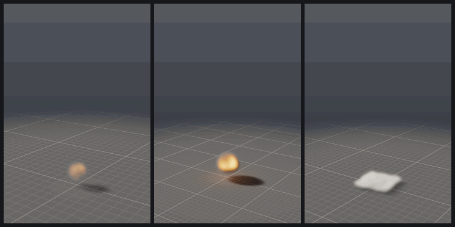

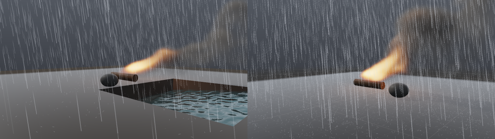

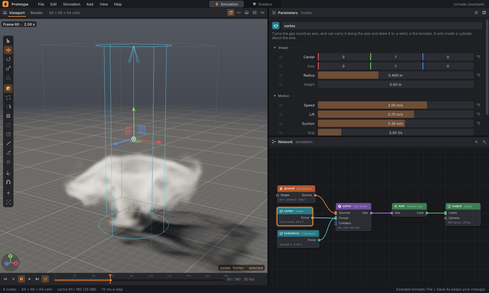

Všechno je v programu `prototype`. Editor se otevře na síti **Simulation**
s prázdnou scénou: **Shift+A** ve viewportu přidá oheň, kouř, vodu, déšť,
objekt nebo kameru (i s řešičem, vzhledem a Outputem, které k tomu patří),
hotové scény jsou ve **File › Examples**. Bez okna simulaci spočítá a
vykreslí příkaz `prototype sim` — i rovnou do videa ([render.md](render.md)).

Obsah:
[1. Rychlý start](#1-rychlý-start) ·
[2. Editor](#2-editor) ·
[3. Síť simulace](#3-síť-simulace) ·
[4. Jak simulace funguje](#4-jak-simulace-funguje) ·
[5. Voda](#5-voda) ·
[6. Déšť a vítr](#6-déšť-a-vítr) ·
[7. Jak se kreslí](#7-jak-se-kreslí) ·
[8. Výkon a determinismus](#8-výkon-a-determinismus) ·
[9. Ověřování](#9-ověřování) ·
[10. Jak přidat uzel](#10-jak-přidat-uzel) ·
[11. Co je potřeba znát](#11-co-je-potřeba-znát) ·
[12. Omezení a co dělá produkce](#12-omezení-a-co-dělá-produkce) ·
[13. Odkazy](#13-odkazy)

---

## 1. Rychlý start

```bash
./build/prototype                          # editor: prázdná scéna (Shift+A přidá oheň, vodu, déšť)
./build/prototype --example campfire       # vestavěný příklad: táborák
./build/prototype --example tornado        # jiný vestavěný příklad
./build/prototype moje.pgsim               # vlastní síť

# bez okna: poslední snímek, nebo každý k-tý jako očíslovanou sekvenci
./build/prototype sim campfire fire.png
./build/prototype sim examples/sim/explosion.pgsim out/boom.png --every 2
./build/prototype sim lakeside shot.png    # záběr kamerou sítě, 1280 × 720
./build/prototype sim lakeside out/shot.png --every 1   # celý záběr, snímek po snímku
./build/prototype sim tornado t.png --set vortex.speed=3 --set solver.resolution=128
./build/prototype sim --list               # vestavěné příklady

# rovnou video: celý záběr, snímek po snímku (.avi bez čehokoli, .mp4 přes ffmpeg)
./build/prototype sim campfire fire.mp4
./build/prototype sim examples/sim/explosion.pgsim boom.avi --every 2
```

`sim` síť načte ze souboru, nebo vezme vestavěný příklad podle jména.
`--set UZEL.PARAMETR=HODNOTA` změní parametr před simulací; když má
parametr toho jména jediný uzel, stačí `--set PARAMETR=HODNOTA`. Počet
snímků dává uzel Output, `--frames N` ho přepíše, `--resolution` přepíše
rozlišení řešiče. Příkaz vypíše, kolik trval krok simulace a kolik jeden
obrázek. Vykresluje přes EGL bez okna, takže funguje i na serveru; bez GPU
stačí softwarový ovladač, třeba Mesa llvmpipe. Se `--every K` uloží snímky
K, 2K, 3K… a pojmenuje je číslem snímku (`boom_0002.png`, `boom_0004.png`,
…). Do videa (`.avi`, s ffmpeg i `.mp4`, `.webm`, `.gif`) jde každý
snímek, se `--every K` každý K-tý ([render.md](render.md)).
`--guides` do obrázku nakreslí vodítka: doménu, zdroje a síly.
`--threads N` počítá na N vláknech (výchozí je jich tolik, kolik jich
stroj má). Snímky jsou na libovolném počtu vláken stejné, takže se tím
dá ověřit determinismus sítě (`--cache` na jednom a na čtyřech vláknech
dá tytéž soubory).

Má-li síť kameru připojenou do Outputu, `sim` renderuje jejím pohledem a
v rozlišení jejího obrazu (`--size` ho přepíše). `--yaw`, `--pitch` a
`--distance` kameru obejdou a ukážou scénu z oběžné dráhy kolem ní.

Starší `prototype pyro OUT.png --preset fire` pořád funguje: spustí příklad
(`fire` je táborák).

## 2. Editor

Editor má pro obě sítě, simulaci i shadery, stejné rozložení. Mezi sítěmi
se přepíná přepínačem uprostřed horní lišty.

| panel | co ukazuje |
|---|---|
| **Viewport** (vlevo nahoře) | scéna: plyn na podlaze se stínem, objekty, vodítka; výběr kliknutím a gizmo. Záložka **Render** vedle něj v hlavičce panelu ukazuje tutéž scénu z path traceru nebo z Cycles |
| **Časová osa** (vlevo dole) | přehrávání, snímky v cache, přehrávací hlava |
| **Parameters** (vpravo nahoře) | parametry vybraného uzlu; bez výběru přehled sítě |
| **Network** (vpravo dole) | síť uzlů |

Rozhraní mezi panely jdou táhnout.

Písmo rozhraní je **Inter** (Regular a SemiBold, licence SIL OFL 1.1),
zakompilované v programu: na každém systému stejné, s češtinou a se značkami,
které editor píše (×, ·, …, šipky). Znaky, které Inter nemá, doplní systémové
DejaVu, je-li nainstalované; kód má neproporcionální DejaVu Sans Mono, jinak
vlastní písmo Dear ImGui. Pomocné texty ve viewportu (číslo snímku,
„simulating…“, nápověda dole, vybraný uzel) leží na tmavých štítcích, takže
se čtou nad bílou oblohou stejně jako nad tmavou podlahou. Lišta nástrojů
vlevo se do nízkého okna vejde: nejdřív zmenší tlačítka, pak pokračuje
druhým sloupcem, a nikdy nepřekryje osy v rohu. **Escape** zavře otevřené
menu nebo nabídku, jen tu nejvyšší (dialogy mají vlastní Cancel), a dál do
panelů pod ní nedojde. Help má zkratky v tabulce, klávesy v jednom sloupci a
co dělají ve druhém. Dialogy mají tlačítka vpravo, to hlavní oranžové.

### Síť

| akce | jak |
|---|---|
| přidat uzel | **Tab** nebo pravé tlačítko do prázdna: nabídka s hledáním u myši; šipky nahoru a dolů posunou zvýrazněný uzel, Enter ho vezme. Seznam pod polem hledání se posouvá, nabídka se vždy vejde do okna |
| spojit | táhnout z pinu na pin; zelená = pasuje, červená = nepasuje a tooltip řekne proč |
| přidat rovnou spojený uzel | táhnout z pinu do prázdna: nabídne jen uzly, které k pinu pasují |
| přesunout nebo zrušit spoj | táhnout za připojený vstup; puštěný do prázdna zanikne. Ctrl+klik na spoj ho zruší |
| posun, zoom | prostřední tlačítko nebo Alt+levé; kolečko zvětšuje kolem myši |
| výběr | klik, rámeček tažením, Shift přidává, Ctrl přepíná, Ctrl+A vše |
| zarámovat / uspořádat | **F** výběr (nebo vše), **L** automatické rozložení do sloupců |
| smazat / duplikovat | Del nebo X / Ctrl+D |
| bypass | **B**: uzel zůstane v síti, ale simulace ho vynechá |

Klávesy patří panelu pod myší, jako v Houdini. Hlavička uzlu má barvu
kategorie, pod názvem je shrnutí toho, co uzel dělá (`fuel 14 · heat 1`).
Uzel, který nevede na výstup, je tlumený. Problém ukáže červený nebo žlutý
odznak; tooltip nad ním řekne, co je špatně. Při velkém oddálení se texty
na uzlech schovají (dokud by byly menší než asi 8 pixelů) a jméno uzlu se
píše vedle něj malým, ale čitelným písmem jako v Houdini: pod uzel, a
když tam není místo, napravo od něj. Jméno se napíše jen tam, kde nepřekryje
jiný uzel ani jiné jméno. Přednost má aktuální a vybraný uzel, pak uzel pod
myší, zobrazený, s problémem a nakonec ten nejvíc propojený. Ostatní jména
ukáže tooltip nad uzlem. Síť s desítkami uzlů, kterou editor po otevření
celou vměstná do panelu, je tak čitelná a texty se nepřekrývají.

### Parametry

Parametry jsou rozdělené do sekcí, které jdou sbalit. Popisek se rozsvítí,
když se hodnota liší od výchozí; ikona ↺ vpravo ji vrátí. Posuvník je
vyplněný od levého kraje po hodnotu. Přehled sítě (plyn, buňky, vstupy,
kamera, snímky, cache, bake, wedge) má popisky v jednom sloupci a hodnoty v
druhém. Tooltip nad
popiskem vysvětlí, co parametr dělá, a uvede jeho jméno pro `--set` a
rozsah posuvníku. Posuvník má rozsah, kde je parametr užitečný. Ctrl+klik
dovolí napsat číslo i mimo něj, meze drží jen fyzikální smysl (třeba žádné
záporné palivo). Vektory mají osy barevně, x červeně, y zeleně, z modře, a
volby po několika tlačítkách vedle sebe.

### Viewport: objekty a gizmo

Viewport se ovládá jako ve 3D programech. Kliknutí vybere, co je pod myší:
objekt, zdroj, vodítko síly nebo hranu domény (ta vybere řešič). Výběr je
jeden pro viewport i síť: uzel vybraný kliknutím ve scéně svítí i v síti a
jeho parametry ukáže panel Parameters. Objekt pod myší se jemně rozsvítí,
vybraný má oranžový okraj a obrys.

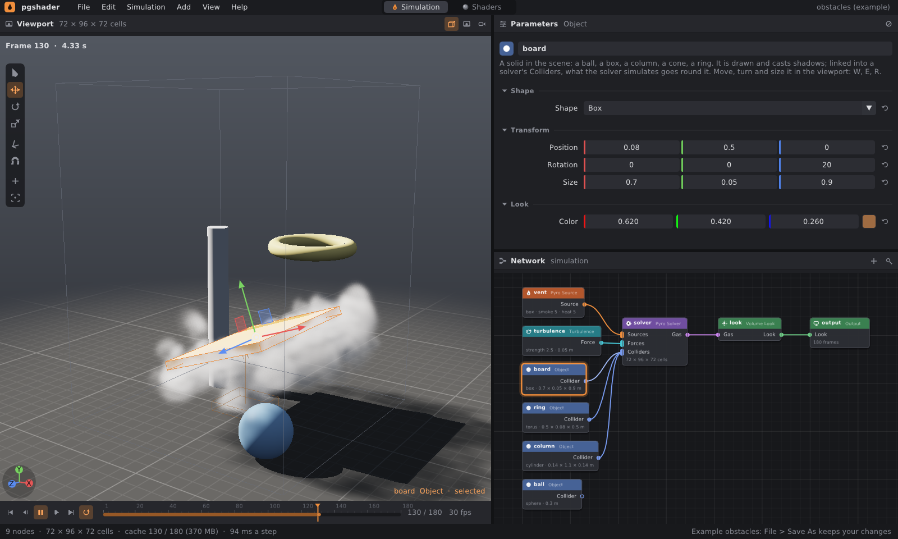

| akce | jak |
|---|---|
| vybrat | klik; **Shift** nebo **Ctrl** přidá / ubere; klik do prázdna výběr zruší |
| nástroj | **Q** výběr, **W** posun, **E** rotace, **R** měřítko (lišta vlevo) |
| posun | táhnout šipku osy, čtverec roviny mezi dvěma osami, nebo tečku uprostřed (v rovině obrazovky) |
| rotace | táhnout kružnici osy, nebo vnější kružnici (kolem směru pohledu) |
| měřítko | táhnout kostičku na konci osy; prostřední kostička mění všechny tři |
| přichytávání | tlačítko s magnetem, nebo držet **Ctrl** při tažení: 5 cm, 15°, ×0,1 |
| lokální / světové osy | tlačítko na liště; měřítko je vždy v osách objektu |
| přidat | **Shift+A**, pravé tlačítko › Add, tlačítko + nebo menu **Add** |
| smazat, duplikovat | **Del** / **X**, **Ctrl+D** (kopie stojí vedle originálu a kolidují jako on) |
| zaostřit | **F** na výběr (nebo na všechno), dvojklik na objekt |
| zrušit tažení | **Esc** vrátí, co gizmo posunulo |
| kamera | levé tažení mimo gizmo obíhá, prostřední nebo Shift+levé posouvá, pravé tažení a kolečko přibližují |

Gizmo je stejně velké v každé vzdálenosti, osy mají barvy x červeně,
y zeleně, z modře a úchyt pod myší zežloutne. Během tažení ukazuje u myši,
o kolik se posunulo, pootočilo nebo zvětšilo. Tažení pracuje s hodnotami,
které uzel měl na začátku, takže se zaokrouhlování nesčítá, a v historii je
to jeden krok (**Ctrl+Z**). Dokud se táhne, simulace čeká: začne znovu až
s tím, kam objekt dopadl. Vybraných uzlů může být víc najednou, posouvají se
spolu a rotace je točí kolem společného středu.

Gizmo zná parametry, které uzel má (`NodeType::handles`): objekt a zdroj
mají polohu, rotaci a velikost, vír polohu, osu, poloměr a výšku, atraktor
polohu a poloměr, vítr jen směr (rotace ho otáčí), mrak deště polohu a
velikost.

**Add** (Shift+A, pravé tlačítko) přidá objekt (koule, kvádr, válec, kužel,
prstenec), zdroj (oheň, kouř), vodu, počasí (déšť, bouřka) nebo sílu (vítr,
vír, turbulence, atraktor, odpor) tam, kam míří myš na podlaze. Objekt stojí
na podlaze, dostane vlastní barvu a rovnou se připojí do Colliders všech
řešičů i deště. Oheň a kouř se připojí do řešiče, a když žádný není, vznikne
i s vzhledem a výstupem. Síly se připojí do Forces řešičů i deště.

**G** zapne vodítka: obrys domény, zdroje (oranžově, se šipkou rychlosti a
drahou pohybu), víry a atraktory, šipky větru, mrak deště se šipkami, kudy
kapky padají, obrys vybraných objektů. Každá síla se kreslí jednou, i když
působí ve více řešičích.
Ikona fotoaparátu uloží snímek jako PNG.

### Kamera a záběr

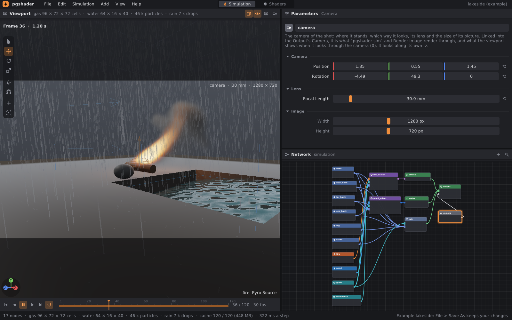

Kamera (uzel **Camera**) je záběr: odkud se na scénu dívá, jakým
objektivem a jak velký je obraz. Připojená do vstupu **Camera** uzlu
Output určuje, co renderuje `prototype sim` i **File › Render Image** a
**Render Frames**. Bez kamery se renderuje pohled viewportu.

| akce | jak |
|---|---|
| přidat kameru | **Shift+A › Shot › Camera**: vidí to, co právě viewport, a připojí se do Outputu |
| dívat se kamerou | **0** (i na numerické klávesnici), tlačítko s okem v hlavičce viewportu |
| kamera z pohledu | **Ctrl+Alt+0**: kamera se přesune a natočí tak, aby viděla, co viewport; objektiv a obraz jí zůstanou |
| posunout, natočit | vybrat jehlan kamery kliknutím, gizmo **W** a **E** |
| odejít z kamery | táhnout nebo kolečko ve viewportu, **F**, dvojklik |

Při pohledu kamerou ukazuje viewport rámeček obrazu v poměru stran kamery
(u 1280 × 720 je to 16 : 9) a kolem něj ztmavené okolí. Nahoře je jméno
kamery, ohnisková vzdálenost a rozlišení. Pohyb myší pohled kamery opustí,
kamera zůstane, kde byla. Tak se záběr ladí stejně jako v Blenderu: najít
pohled, **Ctrl+Alt+0**, zkontrolovat **0**.

Objektiv je jako u full frame fotoaparátu (snímač 24 mm vysoký): vertikální
zorný úhel je `2 · atan(12 / focal)`. 38 mm dá 35° jako viewport,
24 mm je širokoúhlý, 85 mm portrét, 200 mm teleobjektiv, který zplošťuje
hloubku. Kamera se dívá podél své osy −z, rotace je jako u objektů (stupně
kolem x, pak y, pak z).

Render je bez vodítek a bez zvýraznění výběru, ve dvojnásobném rozlišení
zprůměrovaném dolů (vyhlazení hran).

### Časová osa a cache

Simulace běží ve vlastním vlákně a každý snímek si pamatuje. Oranžový pruh
na ose ukazuje, kam už je spočítaná. Přehrávání a posun po ose (klik,
tažení, **Space**, **Home**, **End**, šipky) pak nic nepočítají znovu.

- Změna, která mění simulaci (zdroj, síla, řešič), ji spustí znovu od
  snímku 1. Přehrávací hlava zůstane, kde byla, a viewport ukazuje poslední
  hotový snímek před ní, dokud ji simulace nedožene („simulating… 12 of 45“).
- Změna vzhledu (uzel Volume Look) snímek jen znovu vykreslí.
- Snímky se drží v poloviční přesnosti (half float): 6 B na buňku, při
  64 × 96 × 64 buňkách 2,4 MB na snímek, 150 snímků 350 MB. Paměť pro cache
  je 1,5 GB (menu **Simulation › Cache Size**); když dojde, simulace se
  zastaví a stavový řádek ukáže „full“.
- **Simulation › Simulate Ahead** vypne počítání dopředu,
  **Simulate Again** zahodí cache a začne znovu. Velikost cache,
  odkládání na disk i Simulate Ahead zůstanou, jak byly.
- **Simulation › Save Cache to Disk** uloží spočítané snímky do složky
  (na pozadí, s oknem průběhu a tlačítkem Stop),
  **Load Cache from Disk** je odtamtud vezme místo simulace (na disku mají
  díky vynechaným nulám zlomek velikosti, [cache.md](cache.md)).

### Soubory, undo

**Ctrl+N/O/S**, **Ctrl+Shift+S**, příklady v **File › Examples**; **New**
dá prázdnou scénu. Otevřený příklad se ukládá přes Save As.

Neuložené změny se neztratí bez ptaní. New, Open, Open Asset, příklad,
**Quit** (Ctrl+Q) i zavření okna se nejdřív zeptají:

- **Save** (Enter) uloží a pak pokračuje. Síť bez souboru se uloží přes
  Save As a když dialog zrušíte, nestane se nic.
- **Don't Save** (D) změny zahodí.
- **Cancel** (Escape) nechá všechno, jak je.

Uvnitř assetu Save uloží jeho novou verzi a pak scénu. Quit se zeptá
u obou sítí, simulace i shaderů. Soubor se zapíše celý vedle původního
a teprve pak ho nahradí, takže pád nebo plný disk uprostřed ukládání
nechá původní soubor celý (stejně assety). Uložit pod jménem souboru,
který už existuje, chce potvrzení: Save podruhé (Replace) ho přepíše,
Escape otázku vezme zpět.

**Autosave.** Neuloženou síť (i graf shaderů) editor průběžně ukládá
stranou: hned po první změně a pak nejvýš každých 30 s. Zálohy jdou do
`~/.local/state/prototype/recovery` (`$XDG_STATE_HOME/prototype/recovery`),
jinam s `--recovery SLOŽKA`. Po uložení, zahození změn nebo ukončení
záloha zmizí. Když editor spadne nebo ho něco zabije, příští spuštění
ji nabídne (**Recover Unsaved Work**):

- **Recover** (Enter) ji otevře neuloženou a Ctrl+S ji uloží tam, kde
  byla.
- **Discard** ji smaže.
- **Later** ji nechá na příště; nabídka je i ve **File › Recover Unsaved
  Work**.

Uvnitř assetu se zálohuje scéna, jak byla, když se do assetu vešlo.
**File › Render
Image** uloží snímek, **Render Frames** celý záběr jako očíslované PNG
a **Render Video** celý záběr do videa — obojí po snímcích na pozadí, s oknem
průběhu a tlačítkem Stop, a kamerou, pokud ji síť má ([render.md](render.md)). **Export Geometry** a **Export Geometry Frames** zapíšou
geometrii zobrazeného uzlu do PLY, OBJ nebo OpenVDB — snímek na obrazovce,
nebo všechny ([cache.md](cache.md)). Všechny snímky — Export Geometry Frames,
**Export USD Scene**, **Export Alembic** i Save Cache — se zapisují na pozadí
s oknem průběhu: editor mezitím kreslí a přehrává, síť se ale do konce
nemění. **Stop** skončí po rozepsaném snímku a to, co je venku, zůstane
celé: cache, scéna i archiv končí posledním zapsaným snímkem. Dialog souborů ukazuje složky a soubory
dané přípony a cestu jde napsat; kde se vybírá složka, vezme i tu otevřenou.

**Ctrl+Z / Ctrl+Shift+Z** vrací celé stavy sítě. Tah posuvníkem nebo uzlem
je jeden krok, ne sto. Stejně tak rychlá řada změn, třeba štětec
zmenšovaný po zářezech: krok se zapíše, až je 0,4 s klid. Historie drží
nejvýš 300 stavů a 256 MB, nejstarší jdou první. Síť se do textu přepíše
jen při změně, ne několikrát za snímek, takže ani velký sculpt editor
nezpomalí.

## 3. Síť simulace

```
[Pyro Source] ──Source───┐
[Turbulence] ───Force────┼──▶ [Pyro Solver] ──Gas──▶ [Volume Look] ──Look──┐
[Object] ───────Collider─┘                                                 │
[Water Source] ─Water──────▶ [Liquid Solver] ─Liquid─▶ [Water Look] ──Look──┼──▶ [Output]
[Wind] ─────────Force──────▶ [Rain] ───────────────────────────────Look──┘      ▲
[Camera] ──────────────────────────────────────────────────────────────Camera───┘
```

Piny mají typ a barvu: **Source** oranžová, **Force** tyrkysová,
**Collider** modrá, **Gas** fialová, **Look** zelená, **Water** a
**Liquid** modré (voda, [§5](#5-voda)), **Camera** světle šedá (záběr,
[§2](#kamera-a-záběr)). Déšť ([§6](#6-déšť-a-vítr)) je řešič a vzhled
v jednom: jeho výstup je rovnou vrstva Outputu. Výstup jde jen do
vstupu stejného typu. Vstupy řešiče Sources, Forces a Colliders berou
libovolný počet spojů (kreslí se jako obdélníček místo kolečka). Síly se
použijí v pořadí, v jakém byly připojené. Simuluje se jen to, co vede na
uzel Output.

Objekty jsou výjimka: patří do scény vždycky, kreslí se a vrhají stín, i
když nejsou nikam připojené. Připojené do Colliders řešiče mu navíc stojí
v cestě. Kulisa, která s ničím nekoliduje, je tedy objekt bez spoje.

Síť se překládá do popisu scény pro řešič
([`src/pg/sim/Network.h`](../src/pg/sim/Network.h)) a zároveň hlídá, co by
nedělalo, co uživatel čeká:

- chybí Output, vzhled nebo řešič (chyba, simulovat není co); vzhled bez
  řešiče (chyba, ostatní vrstvy běží dál);
- řešič nemá zdroj; zdroj nic nepřidává; zdroj je mimo doménu nebo uvnitř
  překážky; překážka je mimo doménu (varování);
- neznámý typ uzlu ze souboru z novější verze se zachová a nahlásí.

### Uzly

**Objekty** (Objects) — pevná tělesa scény.

| uzel | parametry |
|---|---|
| Object | `shape` (sphere, box, cylinder, cone, torus, mesh); `file` (soubor OBJ, když je tvar mesh); `center` (poloha středu), `rotation` (stupně kolem x, pak y, pak z), `size` (šířka, výška, hloubka ve vlastních osách: průměr koule, hrany kvádru, šířka a tloušťka prstence, rozměry modelu); `color` |

Tvar ve vlastních osách vyplní `[-size/2, size/2]`: válec a kužel stojí
podél své osy y (kužel má špičku nahoře), prstenec leží v rovině xz a je
tlustý `size.y`, modelu se na `size` natáhne jeho obalový kvádr. Různé
velikosti tvar protáhnou, z koule je elipsoid. Změna barvy simulaci
nespouští znovu.

Objekt, zdroj kouře i zdroj vody mají vstup **Shape**: geometrie v něm
(z uzlů kategorie Geometry — krychle, koule, kopie na body, soubor OBJ…)
je jejich tvarem místo vlastního. Podrobně v [geometry.md](geometry.md).

#### Modely z OBJ

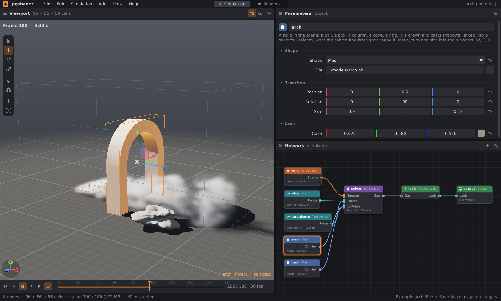

Objekt i zdroj mohou mít tvar **mesh**: model ze souboru OBJ (kámen,
socha, auto, komín). **Add › Mesh…** (Shift+A) otevře dialog, model postaví
na podlahu tam, kam míří myš, a připojí ho do Colliders jako ostatní
objekty. Pokud je model v souboru obrovský nebo drobný (přes 3 m nebo pod
5 cm), zmenší nebo zvětší se na 80 cm. Jinak si nechá své rozměry.
V parametrech je cesta a tlačítko **…**. Relativní cesta se čte ze složky
souboru sítě (u vestavěných příkladů z `examples/sim`), takže síť a modely
jdou kopírovat spolu. V `.pgsim` je cesta v uvozovkách:
`param file "../models/arch.obj"`.

Z OBJ se čtou vrcholy a stěny ve všech zápisech (`f 1 2 3`, `1/1`, `1//1`,
`1/1/1`, záporné indexy). Mnohoúhelníky se rozdělí na trojúhelníky, normály,
textury a materiály se přeskočí. Čísla se čtou nezávisle na locale.

Pro simulaci se z trojúhelníků jednou upeče **pole vzdáleností** (SDF,
[`src/pg/sim/Mesh.h`](../src/pg/sim/Mesh.h)) na mřížce 48 buněk podél
nejdelší strany modelu. Postup je jako Bridsonův makelevelset3:

1. přesná vzdálenost k nejbližšímu trojúhelníku v úzkém pásu kolem stěn;
2. rychlé zametání (fast sweeping) ji rozšíří do celé mřížky;
3. vnitřek a vnějšek se určí sčítáním průsečíků paprsků podél x, y a z
   (lichý počet znamená uvnitř) a hlasováním dvou ze tří. Model s malou
   dírou se tak nepřevrátí naruby.

Z pole se pak rychle zjistí, jestli je bod uvnitř a jak je daleko od
povrchu: řešič podle toho označí pevné buňky a zdroj z modelu (hořící
auto) emituje v pásu pod povrchem. Stejný soubor (cesta, velikost, čas
změny) se čte a peče jen jednou, dokud ho něco používá.

Renderer kreslí skutečné trojúhelníky: rasterizuje je do bufferu (normála,
který objekt, vzdálenost), ze kterého hlavní průchod stínuje jako ostatní
tělesa. Normály se vyhladí mezi stěnami, které se lomí o méně než 60°, takže
kulaté zůstane kulaté a hrany kvádru ostré. Stíny na podlahu, na ostatní
tělesa i na kouř vrhá model paprskem pochodujícím polem vzdáleností
(nejvýš 4 modely se stínem, další se jen nakreslí).

**Zdroje** (Sources) — kde plyn vzniká.

| uzel | parametry |
|---|---|
| Pyro Source | `shape`, `file`, `center`, `rotation`, `size` jako u objektu; `fuel`, `smoke`, `heat` za sekundu; `velocity` (plyn opouští zdroj aspoň takhle rychle, ve vlastních osách zdroje, takže pootočený zdroj míří jinam); `expansion` (1/s: jak rychle se plyn ve zdroji rozpíná — tlačí ho do všech stran jako výbuch nebo vzduch vytlačený zřícením); `flicker`, `flicker_size`, `seed` (blikotání šumem, který se zdrojem stoupá); `start`, `end` (časové okno: záblesk exploze); `motion` (static, circle, sway), `motion_size`, `motion_period` |

Koule je táborák, kvádr hořící poleno nebo průduch, prstenec plynový hořák.

**Síly** (Forces) — každá má `mask`: působí všude, jen kde je teplo (nebo
palivo), nebo jen kde je kouř.

| uzel | co dělá | parametry |
|---|---|---|
| Turbulence | náhodné víry, které se v čase mění | `strength`, `scale` (velikost vírů), `speed` (kolikrát za sekundu se mění), `seed` |
| Wind | vítr, stálý nebo v nárazech | `direction`, `speed`, `strength` (jak rychle plyn převezme rychlost větru), `gusts` |
| Vortex | točí plynem kolem osy, nese ho podél osy a nasává k ní | `center`, `axis`, `radius`, `height` (0 = celou doménou), `speed`, `lift`, `suction`, `strength` |
| Attractor | přitahuje k bodu, záporná síla odpuzuje | `center`, `radius`, `strength` |
| Drag | zpomaluje: hustý, klidný vzduch | `strength` |

**Pyro Solver** (Simulation):

| sekce | parametry |
|---|---|
| Domain | `size` (šířka, výška, hloubka v metrech; stojí na podlaze), `resolution` (buněk podél nejdelší strany, 16–1024), `closed_floor`, `sparse` (počítat jen dlaždice s plynem, výchozí zapnuto), `cutoff` (pod touto hodnotou kouře, tepla, paliva i plamene dlaždici řešič pustí) |
| Time | `substeps`, `pressure_cycles`, `seed` (snímková frekvence je společná, v uzlu Output) |
| Motion | `buoyancy`, `weight` (tíha kouře), `vorticity` (víry, které hrubá mřížka rozmaže) |
| Combustion | `burn_rate`, `heat_release`, `soot_release`, `expansion`, `flame_life` |
| Dissipation | `cooling`, `smoke_decay` |
| Water | `quench` (jak silně voda Liquid Solveru a kapky Rain hasí oheň, do kterého se dostanou: 0 vůbec), `steam` (kolik páry — vlastního bílého pole plynu — udělá každá jednotka tepla, kterou voda vezme), `steam_lift` (jak silně pára stoupá), `steam_fade` (jak rychle řídne, 1/s), `evaporate` (jak rychle oheň odpařuje vodu a kapky, které jsou v něm: 0 vůbec); viz [quench.md](quench.md) |

**Pyro Upres** (Simulation): plyn Pyro Solveru znovu, na mřížce dvakrát až
čtyřikrát jemnější, s víry, které hrubá mřížka neudrží
([§4](#upres-hrubá-simulace-jemný-obraz)). Pyro Solver do jeho vstupu Gas,
jeho výstup Gas do Volume Look (nebo do Gas Volume): snímky pak drží jeho
plyn místo plynu řešiče. Obejitý (bypass) pustí dál plyn řešiče.

| sekce | parametry |
|---|---|
| Upres | `scale` (kolik jemných buněk připadne na buňku řešiče podél každé osy: 2 je osmkrát víc buněk, 3 sedmadvacetkrát, 4 čtyřiašedesátkrát; jemná mřížka má nejvýš 2048 buněk podél nejdelší strany) |
| Whirls | `turbulence` (jak silně jemný plyn víří, kde se točí proudění řešiče: 1 jako v turbulentním proudění, víc pro divočejší oheň, 0 bez nových vírů — jen jemněji nesený plyn řešiče), `swirl_size` (největší přidané víry v buňkách řešiče, menší se přidají s nimi), `swirl_life` (sekundy, po které se vzor vírů nese s plynem, než přejde v nový), `seed` |

Žádný parametr upresu nejde animovat: mřížka i víry jsou dané prvním
snímkem.

**Volume Look** (Render): barva a hustota kouře, `occlusion`; barva
a hustota páry (`steam_color`, `steam_density`, [quench.md](quench.md#pára));
jas ohně, teplota, kde začne žhnout (`flame_start`) a kde žhne do běla
(`flame_range`), `fire_light` (jak oheň svítí na kouř, podlahu a
překážky). Jeho změna simulaci nespouští znovu.

**Output** (Render): konec sítě a společné prostředí celé scény. Vstup
Looks bere libovolný počet vrstev (vzhled plynu, vody, deště); všechny se
simulují jednou snímkovou frekvencí a kreslí do jednoho obrazu. Vstup
Camera bere jednu kameru: pohled, kterým se renderuje.

| sekce | parametry |
|---|---|
| Output | `frames` (délka časové osy), `fps` (snímků za sekundu pro všechny řešiče), `preview` (jak jemné mřížky plynu a vody počítá náhled editoru, Simulation → Preview Resolution: 0,5 poloviční, 0,25 čtvrtinové), `open_preview` (editor síť otevře rovnou v náhledu: scéna, kterou nejde při práci počítat celou) |
| Sun | `light_azimuth`, `light_elevation`, `light_color`, `light_intensity` |
| Sky | `sky_color`, `sky_intensity` |
| Image | `exposure`, `floor` (vypnutá podlaha nic neschovává: i geometrie pod y = 0, třeba údolí terénu, je vidět), `ground_color` (barva země: asfalt, beton, prach), `grid` (mřížka na zemi po 10 cm a po metru; pro záběr vypnout), `sky_behind` (za scénou obloha místo tmavého pozadí studia: opar nejsvětlejší u obzoru a záře kolem slunce — venku, kouř proti světlu) |

**Camera** (Render): záběr ([§2](#kamera-a-záběr)).

| sekce | parametry |
|---|---|
| Camera | `center` (kde stojí), `rotation` (stupně kolem x: sklon, pak y: otočení, pak z; při nule se dívá podél −z, vodorovně) |
| Lens | `focal` (ohnisková vzdálenost v mm, full frame) |
| Image | `width`, `height` (rozlišení renderu, zároveň poměr stran rámečku) |

### Soubor .pgsim

Prostý text, jeden fakt na řádek, stabilní pořadí, takže se sítě dobře
porovnávají v gitu. Parametry se ukládají jen ty, které se liší od výchozích:

```
pgsim 1
# A campfire: a flickering ball of fuel just above the floor.
node 1 pyro_source 2 fire 0 0        # id, typ, verze typu, jméno, x y v editoru
  param fuel 14
  param heat 1
  param velocity 0 0.4 0
  param flicker 0.7
node 2 turbulence 1 turbulence 0 96
  param strength 3.5
node 3 pyro_solver 2 solver 250 28
  param buoyancy 0.9
node 4 volume_look 2 look 490 28
node 5 output 2 output 720 28
  param fps 24
link 1.source -> 3.sources
link 2.force -> 3.forces
link 3.gas -> 4.gas
link 4.look -> 5.look
```

Volby se píšou jménem (`param motion circle`), přepínače `on`/`off`,
vektory třemi čísly. `bypass` na vlastním řádku uzel vynechá. Soubor
s neznámým parametrem nebo spojem, který nepasuje, se načte a výhrada se
vypíše; neznámý typ uzlu se zachová i s parametry, aby ho novější program
přečetl.

Soubory starších verzí se načtou: uzel si nese verzi svého typu a zastaralý
typ se při načtení převede na nástupce. Sphere Source a Box Source se stanou
Pyro Source s tvarem koule nebo kvádru (poloměr se převede na velikost),
Sphere Collider a Box Collider se stanou Object. Pyro Solver verze 1 měl
`fps` a Volume Look verze 1 slunce, oblohu, `exposure` a `floor`; při
načtení se přestěhují do uzlu Output, do kterého vedou (vzhled, který do
žádného Outputu nevede, je zahodí). Uložený soubor už má nové typy. Test
hlídá, že příklady jsou přesně v tom tvaru, v jakém je program uloží.

### Příklady

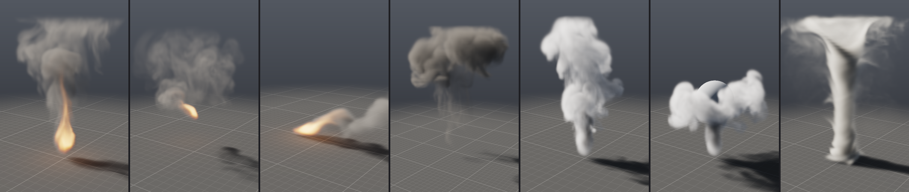

| příklad | co ukazuje |
|---|---|
| `campfire` | blikotající palivo, turbulence jen v teple, tmavé saze |
| `torch` | zdroj, který krouží: plamen se táhne za ním |
| `windy_fire` | vítr v nárazech, plameny se sklánějí, kouř odchází bokem |
| `explosion` | 0,2 s paliva s velkým rozpínáním: ohnivá koule, pak hřib sazí |
| `smoke` | teplý kouř ve slunci |
| `smoke_sphere` | kouř narazí do koule, rozlije se po ní a obteče ji |
| `tornado` | vír s nasáváním a zdvihem sbírá kouř z podlahy |
| `obstacles` | kouř mezi objekty: narazí do šikmé desky, vyteče po ní a stoupá k prstenci; koule na podlaze je kulisa bez kolizí |
| `arch` | modely z OBJ: vítr žene kouř kamenným obloukem a kolem kamene ([`examples/models`](../examples/models)) |
| `dam_break` | voda: blok vody v rohu nádrže se protrhne, oteče sloup, vyšplhá po protější stěně a přelévá se |
| `waterfall` | voda z pramene na římse padá na šikmou desku, stéká po ní a plní bazén |
| `splash` | koule vody dopadne do bazénu: korunka tříště, pak se dutina zavře a vystřelí sloupec (Worthingtonův výtrysk) |
| `rain_pond` | déšť na jezírku: kroužky na hladině, odstřiky od kamene, vánek v nárazech a mokrá podlaha; kamera nízko nad vodou |
| `storm` | táborák v bouřce: nárazy větru kladou plameny a strhávají kouř, déšť se šikmí ve stejném větru a odstřikuje od polen; kamera nízko u ohně |
| `lakeside` | záběr: táborák na břehu jezírka v dešti. Kouř, voda, déšť, vítr a objekty v jedné síti (17 uzlů), jezírko zapuštěné do terénu z kvádrů, kamera nízko nad vodou |
| `scatter_fire` | geometrie jako zdroj: body rozházené po mřížce, wrangle jim dá velikost, na každém plamínek; koule z uzlu Sphere visí v kouři ([geometry.md](geometry.md)) |
| `liquid_points` | simulace zpátky jako geometrie: částice vody z Liquid Points, wrangle je barví podle rychlosti, tabulka atributů je ukáže |
| `rock_garden` | geometrie jako překážka: koule zkopírovaná na rozházené body a zmáčknutá je tvarem kamenů, na které prší |
| `wake` | animace: koule s klíči polohy projíždí bazénem, voda převezme její pohyb — vlna před ní, brázda za ní ([animation.md](animation.md)) |
| `fire_trail` | animace: pochodeň letí smyčkou a nechává stopu ohně a kouře, lopatka animovaná kolem y víří kouř nad ní |
| `campfire_vdb` | export: táborák s uzlem Gas Volume, jehož objemy jdou do OpenVDB snímek po snímku ([cache.md](cache.md)) |
| `vdb_fireball` | čtení OpenVDB: ohnivá koule ze souboru — VDB Gas ji přehraje jako plyn, nic se nesimuluje, oheň svítí na bedny ([vdb.md](vdb.md)) |
| `vdb_rock` | čtení OpenVDB: proud vody narazí na balvan z level setu, ze kterého VDB Import udělal polygony a Object překážku ([vdb.md](vdb.md)) |
| `alembic_shot` | Alembic: kulisa a jedoucí kamera z Blenderu, oheň mezi bednami a jeho kouř podél zadní zdi ([alembic.md](alembic.md)) |
| `campfire_rain` | voda a oheň: táborák hoří vteřinu, pak přijde liják — kapky, které propadnou plameny, je chladí, ty, které padnou na oheň, ho promočí; za pár sekund plameny zmizí a z mokrých polen stoupá bílá pára ([quench.md](quench.md)) |
| `fire_douse` | táborák uhašený kbelíkem vody: koule vody spadne na oheň, plameny zmizí během pár snímků, tmavým kouřem se vyvalí bílý oblak páry a voda odteče po zemi ([quench.md](quench.md)) |
| `fire_hose` | hašení hadicí: proud vody míří dvě sekundy do ohně z polen — malá část se ho v plamenech odpaří, zbytek oheň postupně uhasí; bílá pára stoupá tmavým kouřem a nahoře řídne ([quench.md](quench.md)) |
| `rain_fill` | liják plní kamennou nádrž: každá kapka, která padne do vody, ji rozvlní a přidá do ní — hladina stoupne za pět sekund o 7 cm a zaleje schod ([quench.md](quench.md)) |
| `campfire_upres` | upres: táborák spočítaný v rozlišení 64 a nakreslený ve 192 — Pyro Upres ×3 přidá víry, které hrubá mřížka neudrží: plameny se trhají, saze se na okrajích kudrnatí; za polovinu času a paměti simulace ve 192 ([§4](#upres-hrubá-simulace-jemný-obraz)) |
| `demolition` | destrukce: odstřel věžáku mezi domy — nálože v přízemí, věž se zřítí do svého půdorysu a patra se drtí; prach z nárazů, drcení a přetržených spojů žene vytlačený vzduch do ulic ([destruction.md](destruction.md)) |
| `wall_collapse` | destrukce zblízka: průčelí cihlového domu vyletí do ulice, kusy se kutálejí ke kameře těsně nad asfaltem a prach prosvítí nízké slunce ([destruction.md](destruction.md)) |
| `concrete_wall` | železobeton: demoliční koule prorazí zeď na soklu — Concrete Fracture s hrubými lomy a odprýsklými rohy, síť prutů (Rebar), na které kusy kolem díry visí, `rings 2` drží škodu kolem koule, prach z lomů ([destruction.md](destruction.md#2-concrete-fracture)) |
| `concrete_drop` | železobeton a sekundární lámání: trám s armokošem praskne přes kvádr, přehne se a visí na výztuži — RBD Cluster, lepidlo uvnitř ker třicetkrát pevnější, Rebar ([destruction.md](destruction.md#výztuž-rebar)) |
| `glass_window` | sklo: míč vyletí oknem, zpomaleně (120 snímků za sekundu) — Glass Fracture, pavučina prasklin až v okamžiku úderu, střepy a jiskřící drť, průhledné sklo s odrazy ([destruction.md](destruction.md#sklo-glass-fracture)) |
| `brick_wall` | cihly: demoliční koule prorazí cihlovou zeď domu v anglické vazbě — Brick Wall, malta jako lepidlo, zeď praská ve spárách, díra stupňovitá po vrstvách, některé cihly se rozlomí vedví; okno vedle díry se sklem zůstane celé ([destruction.md](destruction.md#cihly-brick-wall)) |
| `constraint_network` | síť vazeb: RBD Constraints udělá z lepidla betonové zdi geometrii, wrangle zeslabí spoje přes čáru z rohu do rohu — koule vylomí roh a zeď praskne přesně po čáře, zbytek stojí; RBD Pieces vrací síť snímku s prasklými spoji ([destruction.md](destruction.md#síť-vazeb-rbd-constraints)) |
| `debris_stairs` | drť jako částice: nálož podetne betonový sloup na podestě, sloup se skácí ze schodů a rozlomí; drť skáče po schodech a zůstává ležet na stupních, za odhozenými kusy se táhne prach (`trail`) ([destruction.md](destruction.md#drť-jako-částice)) |
| `concrete_column` | železobeton: odstřel sloupu v půlce výšky — Concrete Fracture a armokoš (Rebar), beton kolem nálože se rozletí a zmizí v prachu, zůstane holý koš a na něm visí kusy betonu ([destruction.md](destruction.md#sedmý-příklad-odstřel-železobetonového-sloupu)) |
| `guided_fall` | usměrněná simulace: odstřel betonového komínu do ulice — klíčovaný Transform kolem hrany zářezu je Guide RBD Solveru, komín padne přesně mezi dva domy a na silnici se volně rozlomí (`guide_let_go`, `guide_reach`) ([destruction.md](destruction.md#usměrněná-simulace-guide)) |
| `shatter_blocks` | lámání za běhu: koule projede třemi celými betonovými kvádry a každý se rozlomí tam, kam ho udeřila — úlomky nejmenší kolem rány, hrubé lomy, prach a drť ([destruction.md](destruction.md#lámání-za-běhu)) |
| `shatter_grit` | drť jako zrna: `shatter_blocks` s Grain Solverem, do jehož vstupu Grit jde RBD Solver — každý kousek drti je zrnem, jakmile vyletí z kusu: narazí do ostatních, dopadne na úlomky, sjede z nich a leží kolem trosek, kde ho padlo víc, na sobě ([grains.md](grains.md#drť-z-betonu-jako-zrna)) |
| `wood_beam` | dřevo: ocelová koule prorazí dřevěný trám — Wood Fracture ho rozštípe na dlouhé třísky podél vláken a třísky, do kterých koule narazí, se za běhu rozlomí s roztřepenými konci ([destruction.md](destruction.md#dřevo-wood-fracture)) |

Soubory jsou v [`examples/sim`](../examples/sim) a CMake je zkompiluje do
programu. `prototype sim campfire` proto funguje bez souborů vedle.
Táborák a kouř jsou zároveň scény, na kterých stojí testy řešiče: test
hlídá, že síť dává přesně `Scene::fire()` a `Scene::smoke()`.

## 4. Jak simulace funguje

Doména je krabice na podlaze rozdělená na krychlové buňky. Hrana buňky je
nejdelší strana domény dělená rozlišením a počty buněk se zaokrouhlí nahoru
na násobek 8, aby je multigrid mohl několikrát rozpůlit. V každé buňce jsou
pole:

| pole | význam |
|---|---|
| `density` | kouř, saze: to, co pohlcuje a rozptyluje světlo |
| `temperature` | teplo: zvedá plyn vzhůru |
| `fuel` | palivo, které ještě neshořelo |
| `flame` | palivo spálené během poslední `flame_life`: kde je plamen |
| `velocity` | rychlost proudění, tři složky |

Jeden krok ([`src/pg/sim/Pyro.h`](../src/pg/sim/Pyro.h)) má šest fází:

1. **emit** — zdroje přidávají palivo, kouř a teplo a tlačí plyn svým
   směrem. Váha klesá k okraji zdroje plynule (smoothstep), výkon kolísá
   podle šumu, který se zdrojem stoupá: plamen blikotá. Rychlost zdroje
   je „aspoň tolik“: plyn, který už letí rychleji, zdroj nebrzdí.
   Pohyblivý zdroj plyn strhává s sebou.
2. **advect** — proudění unáší všechna pole, včetně rychlosti samotné.
3. **combust** — část paliva shoří (`burn_rate` za sekundu) a změní se
   v teplo, saze a plamen. Hořící plyn se rozpíná.
4. **forces** — teplo stoupá, saze klesají, vorticity confinement vrací
   víry, pak síly sítě v pořadí spojů.
5. **project** — tlak zajistí, že plyn je nestlačitelný, kromě míst, kde se
   hořením rozpíná. Podlahou ani překážkou nic neproteče.
6. **dissipate** — kouř řídne, teplo chladne, plameny hasnou; co plyn nese,
   se zředí tam, kde se rozpíná.

### Unášení (advekce)

Nejjednodušší metoda je vzít hodnotu z buňky a posunout ji podle rychlosti.
Při velkém kroku je ale nestabilní a simulace vybuchne. Místo toho se
používá **semi-Lagrangeova metoda** (Stam, *Stable Fluids*, 1999): pro každou
buňku se zjistí, *odkud* sem plyn za krok přitekl, a hodnota se tam přečte
trilineární interpolací. Taková metoda je stabilní při libovolném kroku. Cesta
zpátky se počítá metodou Runge-Kutta 2. řádu: nejdřív půl kroku, pak celý krok
s rychlostí z poloviny cesty. Víry se díky tomu nerozplývají do spirál.

Interpolace ale rozmazává. Kouř, teplo, palivo a plamen se proto unášejí
metodou **MacCormack** (Selle a kol., 2008): výsledek se unese ještě jednou,
tentokrát proti proudu, a porovná se s tím, co v buňce bylo na začátku.
Tahle zkouška ukáže chybu tam a zpátky a výsledek se opraví o její
polovinu. Aby oprava nevytvořila nové extrémy, ořízne se na rozsah osmi
hodnot, ze kterých se interpolovalo. Na otevřených hranách se oprava
vypíná: cesta tam vede ven z domény, odkud se vrací nula, a „oprava“
by kouř u hranice přidávala.

### Mřížka MAC

Kouř, teplo, palivo a plamen jsou uprostřed buněk. Rychlost je
**posunutá** (MAC grid, Harlow a Welch, 1965): složka x leží na stěnách mezi
buňkami ve směru x, složka y na stěnách ve směru y a tak dál. Mřížka o `n`
buňkách má tedy v daném směru `n + 1` stěn. Divergence buňky, tedy kolik
plynu z ní vytéká, se pak spočítá přesně ze šesti stěn:

```
div = (u[i+1] − u[i] + v[j+1] − v[j] + w[k+1] − w[k]) / h
```

Na mřížce se vším uprostřed by se divergence počítala ob buňku. Sudé a liché
buňky by se pak navzájem „neviděly“ a tlak by v nich vytvářel šachovnici,
kterou projekce neodstraní. Posunutá mřížka navíc dělá překážky snadnými:
stěna mezi plynem a pevnou buňkou má rychlost nula a hotovo.

### Projekce a tlak

Plyn v simulaci je nestlačitelný: kolik do buňky přiteče, tolik z ní odteče.
Síly a advekce tuhle vlastnost porušují, a tak se na konci kroku opraví.
Najde se tlak `p`, jehož spád (gradient) přesně vyrovná divergenci, a
odečte se od rychlosti. Hledání tlaku je Poissonova rovnice:

```
součet přes otevřené stěny (p[soused] − p) / h² = div − rozpínání
```

Kde hoří palivo, má divergence odpovídat rozpínání plynu (`expansion`).
Tam plyn doopravdy přibývá.

Rovnice se řeší **geometrickým multigridem**
([`Poisson.h`](../src/pg/sim/Poisson.h)). Jednoduché iterace (Jacobi,
Gauss-Seidel) rychle srovnají chybu mezi sousedními buňkami, ale chyba,
která se táhne hladce přes celou doménu, se každým průchodem zmenší jen
nepatrně. Čím jemnější mřížka, tím hůř. Multigrid pošle hladkou část chyby
na mřížku s polovičním rozlišením, kde už tak hladká není, a opakuje to až
na pár buněk. Pak opravy cestou nahoru přičte. Takový V-cyklus ubere asi
90 % chyby **při jakémkoli rozlišení**. Stačí dva V-cykly na krok
(`pressure_cycles`), protože se začíná od tlaku z minulého kroku. Hladí se
red-black Gauss-Seidelem: buňky jsou obarvené jako šachovnice a každá
půlka čte jen buňky druhé barvy. Každá půlka tedy jde paralelně, a výsledek
přesto nezávisí na počtu vláken.

Hranice a překážky jsou v operátoru přímo:

- **Otevřené stěny** (boky, strop, podlaha, když není zavřená) drží na
  stěně tlak nula, jako atmosféra venku: buňka za stěnou má minus tlak
  buňky uvnitř.
- **Zavřená podlaha** je zeď: přes ni se nesčítá (Neumannova podmínka).
- **Překážky:** každá stěna buňky má koeficient 1 (otevřená) nebo 0 (vede
  do pevné buňky). Na hrubší mřížce multigridu je koeficient průměr čtyř
  jemných stěn, které hrubá stěna pokrývá. Pevné buňky mají tlak nula a
  jejich stěny rychlost nula. Tak se multigrid s překážkou sbíhá skoro
  stejně rychle jako bez ní.

### Otevřené hranice: vzduch venku stojí

Plyn, který přiteče otevřenou stěnou, přitéká z okolního klidného vzduchu:
jeho rychlost je nula a tlak mu teprve dá rychlost. První verze místo toho
vzala rychlost, kterou měl plyn u stěny (extrapolace, jak ji dělá řada
řešičů). Vír, který sahal ke stropu, pak nasával vzduch podél osy, ten
přitékal s rychlostí, kterou mu dal vír, vír ho zrychlil a stěna tu
rychlost poslala dovnitř znovu. Rychlost rostla bez konce (20 m/s po dvou
sekundách u víru, který točí rychlostí 1,2 m/s), až se kouř rozpadl na
jednotlivé body. Se stojícím vzduchem venku drží vír rychlost pod svou
(test `pyro_a_vortex_through_the_open_top_stays_bounded`). Stejná chyba
předtím potichu udržovala výstupný proud i po dohoření exploze: kouř pak
odcházel stropem rychleji, než měl.

### Řídká mřížka: počítá se jen tam, kde je plyn

Prach odstřelu zabírá v doméně 90 × 48 × 90 m jen pár procent buněk, zbytek
je stojící vzduch. Houdini (Sparse Pyro) i produkce s OpenVDB proto drží
a počítají jen buňky poblíž plynu; stejně to dělá i tento řešič, pokud je
zapnuté `sparse` (v uzlu je to výchozí stav).

- **Dlaždice.** Každé pole je uložené v dlaždicích 8 × 8 × 8 buněk
  ([`SparseGrid.h`](../src/pg/sim/SparseGrid.h)): tabulka dlaždic celé
  domény a hodnoty jen těch aktivních. Buňka mimo ně čte 0, stojící
  prázdný vzduch. Pole jednoho tvaru sdílejí dlaždice, buňka má ve všech
  stejný index a smyčka přes aktivní buňky čte a zapisuje všechna pole
  naráz.
- **Které dlaždice.** Před každým krokem řešič pustí dlaždice, kde kouř,
  teplo, palivo i plamen klesly pod `cutoff`. Kolem zbylých, kolem zdrojů
  a kolem pohybujících se těles přibere tolik dlaždic, kam nejrychlejší
  vzduch za krok doletí, a buňku navíc (aspoň jednu dlaždici, nejvýš
  čtyři). Plyn tak nikdy nedoteče za okraj.
- **Stěny MAC.** Rychlosti leží na stěnách buněk. Dlaždice drží stěny
  svých buněk; vzdálené stěny jejích posledních buněk jsou první vrstvou
  další dlaždice, kterou si mřížka stěn přidá (`Tiles::faces`).
- **Tlak.** Rovnice platí v aktivních buňkách a mimo ně je p = 0, jako na
  otevřené straně domény. Na hrubších úrovních multigridu je buňka
  aktivní, jen když je aktivní všech jejích osm (jako u McAdamse, Sifakise
  a Terana, 2010): stojící vzduch tak na hrubé mřížce nikdy nesahá dál
  než na jemné. Nejdřív to bylo naopak (aktivní, když aspoň jedna) a při
  rozlišení 288 prach odstřelu kolem 90. snímku vybuchl do NaN: hrubé
  buňky napůl ve vzduchu posílaly nahoru opravy, které netrefily, a s
  tělesy některé oblasti uzavřely jako zdmi. Teď každý V-cyklus zmenší
  zbytek dvacetkrát až stokrát. Stěny těles drží nejjemnější úroveň jako
  bity (šest v bajtu na buňku), ne jako tři mřížky stěn.
- **Stejné bity.** Se všemi dlaždicemi aktivními (`sparse` vypnuté) je
  řešič hustý a dává bitově stejná pole jako předchozí hustá verze. Ověřuje
  to otisk posledního snímku v `pgbench_pyro --dense`: `3adea3c11ea39814`
  před přepisem i po něm.
- **Cena.** Vzduch mimo dlaždice stojí. Tlaková vlna se nešíří celou
  doménou, jen dlaždicemi kolem plynu. U prachu a kouře to v obraze není
  vidět (měření v kapitole 8). U velmi rychlé exploze pomůže víc Substeps:
  okraj pak roste po menších krocích.

Snímky drží jen dlaždice s plynem (`Frame::gasTiles`, cache verze 10).
Renderer, export VDB/USD a Python z nich skládají celou mřížku až ve chvíli,
kdy ji potřebují.

### Rozpínání ředí

Semi-Lagrangeova advekce nese hodnotu tak, jak je: kus plynu, který se
nerozpíná ani nestlačuje, má po přesunu stejnou hustotu kouře. Tam, kde
hořící plyn bobtná, je to ale špatně: stejné množství paliva se rozprostře
do většího objemu. Bez ředění nabobtnalé palivo zůstalo stejně husté,
hořelo dál a znovu bobtnalo. Exploze tak během pár snímků vyplnila celou
doménu (100 % buněk v plameni, v testu
`pyro_burning_gas_thins_out_as_it_swells`). Kouř, palivo a plamen se proto
v buňce, která se za krok rozepne o `expansion × dt` svého objemu, zředí
dělením `1 + expansion × dt`. Teplota zůstává: plyn, který se ohřál,
zůstane horký.

### Síly

- **Vztlak:** `buoyancy × teplota − weight × kouř`. Působí na svislou složku
  rychlosti, tedy na stěny mezi buňkami nad sebou.
- **Vorticity confinement** (Fedkiw a kol., 2001): numerická difuze
  semi-Lagrangeovy metody rozmazává malé víry, a bez nich kouř vypadá jako
  vata. Síla najde místa, kde se plyn točí (rotace rychlosti `ω`), a točí jím
  dál: `ε · h · (N × ω)`, kde `N` míří k silnějším vírům.
- **Turbulence:** náhodná síla na hrubé mřížce (uzel každých `scale`),
  která se `speed`krát za sekundu plynule mění. Sama o sobě by plyn jen
  stlačovala a roztahovala; projekce z ní ponechá jen vířivou část. Díky ní
  se kouř trhá do vírů a plameny olizují.
- **Vítr** a **vír** plyn netlačí, ale **táhnou k rychlosti**: rychlost se
  každou sekundu přiblíží cíli o podíl daný `strength`
  (`v += (1 − e^(−strength·dt)) · (cíl − v)`). Jakkoli dlouho působí, nic
  nezrychlí nad svou rychlost. Vír má cíl složený ze tří částí: kolem osy
  `speed` (nejrychleji v půli poloměru, profil `4x(1 − x)`), podél osy
  `lift` a k ose `suction`. Na okraji válce plynule slábne. Tornádo
  vznikne, když vír s nasáváním a zdvihem sbírá kouř z podlahy.
- **Atraktor** zrychluje k bodu tím víc, čím je blíž (`(1 − d/r)²`), záporný
  odpuzuje. **Drag** rychlost exponenciálně tlumí.
- **Maska** omezí sílu na teplo (nebo palivo), nebo na kouř; podíl se
  odvodí z hodnot v buňkách u stěny, na které rychlost leží.

### Teplo a plamen zvlášť

Teplo musí vydržet dlouho, aby unášelo kouř vzhůru. Kdyby se oheň kreslil
podle teploty, vypadal by jako svítící sloup vysoký jako celý kouř. Houdini
to řeší stejně jako tahle simulace: **teplo** zvedá plyn a chladne pomalu,
**plamen** je čerstvě hořící palivo a vydrží zlomek sekundy (`flame_life`).
Oheň se kreslí z plamene a barvu dostane podle teploty.

### Upres: hrubá simulace, jemný obraz

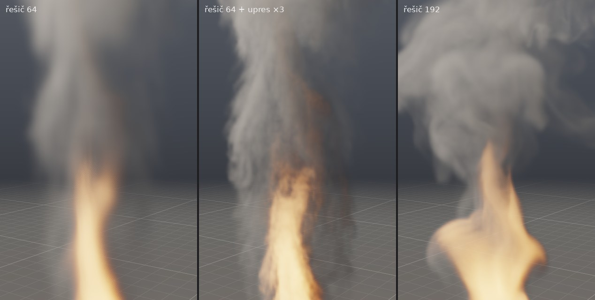

Dvakrát jemnější mřížka má osmkrát víc buněk a každá stojí tlak, síly
i advekci rychlosti. Produkce proto ladí simulaci nahrubo, kde běží
rychle, a jemný detail k ní přidá zvlášť: upres (v Houdini Pyro Upres).
Uzel **Pyro Upres** ([`src/pg/sim/Upres.h`](../src/pg/sim/Upres.h)) vezme
pohyb plynu tak, jak ho spočítal řešič, a nese jím jemnou kopii toho, co
plyn nese — kouř, teplo, palivo a plamen — na mřížce `scale`krát jemnější.
Do řešiče nic nevrací. Tlak, vztlak ani síly se na jemné mřížce nepočítají,
proto je o tolik levnější.

Každý snímek, těsně před krokem řešiče (s prouděním, kterým řešič v tom
kroku ponese svůj plyn, takže se oba drží spolu):

1. **dlaždice**: jemná mřížka je řídká, v dlaždicích 8 × 8 × 8 jemných
   buněk. Počítají se ty s plynem a se zdroji a kolem nich tak daleko, kam
   plyn za krok doletí — podle proudění v té dlaždici, ne podle nejrychlejšího
   místa domény;
2. **zdroje** přidají palivo, kouř a teplo přímo v jemném rozlišení: okraje
   zdroje a jeho blikotání jsou jemné jako mřížka (stejný kód jako v řešiči,
   který řešiči dává bitově stejné snímky jako dřív);
3. **advekce** MacCormack jako v řešiči, všechna čtyři pole najednou:
   proudění řešiče interpolované do jemných buněk a k němu víry;
4. **hoření** a **slábnutí** jako v řešiči.

Víry jsou **curl noise** (Bridson, Hourihan a Nordenstam, 2007): rotace
tří šumů, tedy proudění, které plyn nestlačuje ani neředí. Jsou tak silné,
jako by byly víry té velikosti v turbulentním proudění: vířivost proudění
řešiče krát buňka (rychlost přes buňku, kterou hrubá mřížka nerozliší),
zvětšená třetí odmocninou toho, kolik buněk víry měří (Kolmogorov). Kde se
proudění netočí, víry nejsou: kouř, který stojí, zůstane klidný (test:
s víry i bez nich bitově stejný). U překážek také ne, plyn tam jde, kudy ho
těleso pustí. `swirl_size` je v buňkách řešiče (výchozí 2: to, co hrubá
mřížka právě neudrží); menší oktávy se přidají až k zhruba třem jemným
buňkám, každá o třetinu oktávy slabší.

Šum se nese s prouděním: jeho souřadnice se unášejí na mřížce řešiče,
takže víry jdou s plynem a natahují se s ním, místo aby plyn protékal
stojícím vzorem. Natažený šum by se ale brzy rozpadl na pruhy, proto jsou
souřadnice ve dvou vrstvách, které se po `swirl_life` sekundách střídavě
obnoví a prolnou (Neyret, 2003). Váhy sin a cos, jejichž čtverce dávají 1,
drží sílu vírů stálou. Šum se jednou spočítá do periodické dlaždice 64³
vzorků a čte se trilineárně, jako drží svůj šum wavelet turbulence (Kim
a kol., 2008); je to asi desetkrát rychlejší než ho počítat v každé buňce.

Snímky drží plyn upresu místo plynu řešiče: viewport, path tracer a
Cycles, cache, export do OpenVDB a USD i uzel Gas Volume dostanou jemnou
mřížku, jako by ji spočítal řešič. Obejitý upres pustí dál plyn řešiče:
pohyb se ladí nahrubo a upres se zapne na finální obraz. Je v checkpointu
a z uloženého stavu pokračuje bitově stejně, jako by se nezastavil, a na
libovolném počtu vláken dá stejné bity.

Na obrázku je příklad `campfire_upres` po 72 snímcích. Vlevo řešič
v rozlišení 64, uprostřed tentýž s upresem ×3 (144 × 192 × 144 jemných
buněk), vpravo řešič spočítaný přímo ve 192. Upres nevymyslí velké valící
se víry, které spočítá jemný řešič — hrubá mřížka je nemá —, ale přidá
jemnou kresbu: plameny se trhají, kouř se na okrajích kudrnatí a pohyb
celku zůstane ten, který se ladil nahrubo. Kolik to stojí, je v
[§8](#upres-za-řešičem).

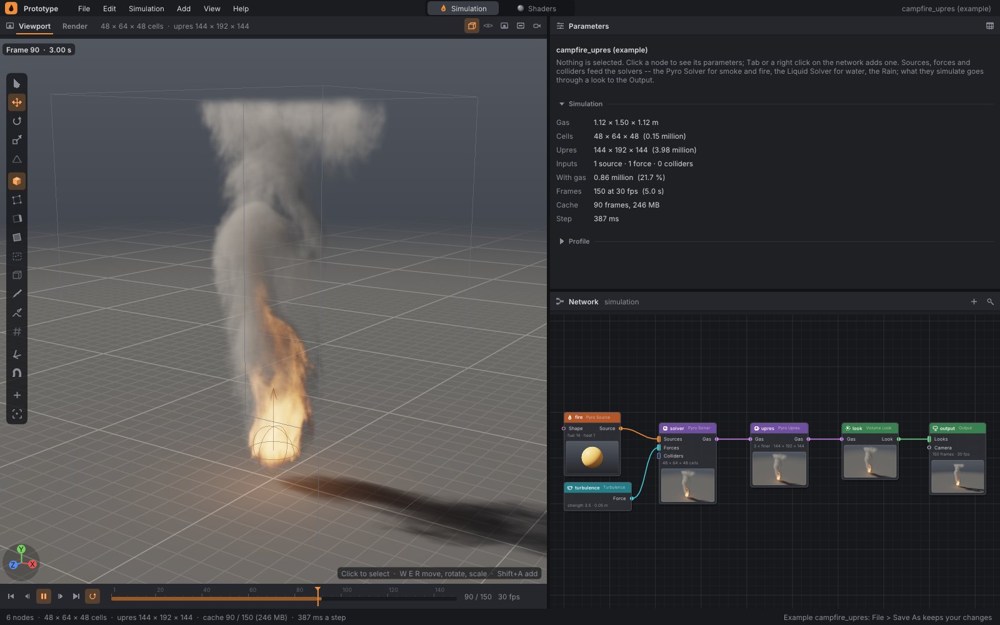

## 5. Voda

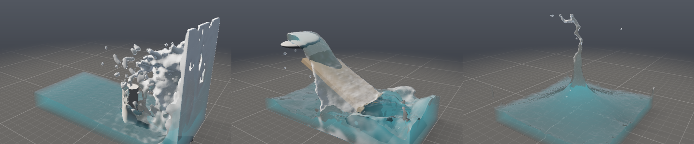

Voda má na rozdíl od kouře **hladinu**: kde končí, začíná vzduch, a na ní se
všechno odehrává: vlny, stříkance, kapky. Proto se simuluje jinak, metodou
**FLIP** (Zhu a Bridson, 2005), na které stojí FLIP solver v Houdini. Vodu
nesou **částice**, osm v každé plné buňce, a každá si pamatuje svou rychlost.
**Mřížka** (stejná mřížka MAC jako u plynu) slouží k tomu, aby voda držela
objem.

### Síť

```
[Water Source] ──Water────┐
[Wind] ──────────Force────┼──▶ [Liquid Solver] ──Liquid──▶ [Water Look] ──Look──▶ [Output]
[Object] ────────Collider─┘
```

Output bere vzhled kouře i vzhled vody zároveň. Obojí se simuluje jednou
snímkovou frekvencí a kreslí do jednoho obrazu. Objekty a síly se dají
připojit do obou řešičů najednou.

| uzel | parametry |
|---|---|
| **Water Source** (Sources) | `shape`, `file`, `center`, `rotation`, `size` jako u objektu; `mode`: `fill` naplní tvar vodou jednou, když zdroj začne (blok vody, bazén), `flow` z něj vodu vylévá (hadice, fontána, pramen); `velocity` rychlost vytékající vody v osách zdroje; `seed`; `start`, `end` |
| **Liquid Solver** (Simulation) | Domain: `size`, `resolution` (buněk podél nejdelší strany, 16 až 1024), `closed_sides` (nádrž se stěnami; vypnuté: voda přetéká okraji a mizí), `sparse` (počítat jen dlaždice kolem vody, výchozí zapnuto; vypnuté: všechny dlaždice, stejná voda bit po bitu, víc paměti a času); Motion: `gravity`, `flip` (Splash: 1 živá, stříkající voda, 0 hladká a hustá; běžně 0,9 až 0,98); Time: `substeps`, `seed` |
| **Water Look** (Render) | `color` (barva hluboké vody), `clarity` (jak daleko je do vody vidět, v metrech), `foam` (jak bílá je pěna a tříšť), `surface` (kreslit hladinu; vypnutá: voda se simuluje, vidět jsou jen její částice přes Liquid Points) |

Ve viewportu se voda přidá přes **Shift+A → Water**: *Block of Water*,
*Fountain*, *Hose*. Když ještě chybí řešič vody, vznikne i s Water Look
připojeným do Outputu a objekty scény se do něj připojí jako překážky. Zdroj
vody se vybírá kliknutím a posouvá gizmem jako objekt.

### Jak to funguje

Jeden podkrok ([`src/pg/sim/Liquid.h`](../src/pg/sim/Liquid.h)):

1. **emit** — zdroj `fill` naplní tvar: do každé osminy buňky uvnitř tvaru,
   kde ještě částice není, přidá jednu, na místo dané hashem buňky a
   podkroku. Zdroj `flow` to dělá v každém podkroku a vodě ve svém tvaru
   nastaví svou rychlost, takže ji vytlačuje ven.
2. **na mřížku** — rychlosti částic se zprůměrují na stěny buněk
   (trilineární váhy). Z částic se spočítá i hladina: vzdálenost ke kouli
   kolem váženého průměru okolních částic (Zhu a Bridson). Buňka, jejíž
   střed je pod hladinou, je voda.
3. **síly** — gravitace, pak síly sítě. Vítr unáší tříšť: vodu, která
   letí a má kolem sebe málo částic (v krychli 3 × 3 × 3 buněk méně než
   12, plná buňka jich má 8), táhne k rychlosti větru plnou silou.
   S vodou samotnou skoro nehne: vzduch je tisíckrát lehčí a tlačí jen na
   hladinu, takže vánek nad rybníkem nechá hladinu rovnou.
4. **tlak** — dělá vodu nestlačitelnou. Ve vzduchu je tlak nula, stěnou
   tělesa nic neproteče.
5. **na částice** — každá částice přičte, o kolik se rychlost mřížky v jejím
   místě změnila (FLIP), smíchané s rychlostí mřížky samotnou (PIC)
   v poměru `flip`. Čistý PIC by vodu rozmazal a zpomalil, čistý FLIP je
   živý, ale šumí.
6. **pohyb** — částice se posunou rychlostí mřížky (Runge-Kutta 2. řádu),
   ven z těles a od stěn nádrže. Co odteče otevřenou stranou nebo vyletí
   nad doménu, zmizí.

Podkroků je tolik, aby se žádná částice nepohnula o víc než dvě buňky,
nejméně `substeps`.

**Řídká voda.** Mřížky vody se drží v dlaždicích 8 × 8 × 8 buněk
([`SparseGrid.h`](../src/pg/sim/SparseGrid.h)) jako u řídkého plynu, ale jen
tam, kde voda je: dlaždice s částicemi, dlaždice zdrojů, které se chystají
vylít, a všechny dlaždice kolem nich. Všechno, co podkrok dělá, sahá od
částic jen pár buněk (jádro částice 1,2 buňky, rychlost přenesená za vodu
4 vrstvy, sousedé tlaku), tedy hluboko do dlaždice kolem. Vzduch nad jezerem
ani prázdná polovina domény povodně nestojí paměť ani čas. Co se děje mimo
dlaždice, se k částicím nikdy nedostane, takže řídká voda je hustá voda bit
po bitu: `sparse` vypnuté drží všechny dlaždice a test to ověřuje na nádrži
s hadicí, pohyblivým tělesem, větrem a víry. Částice se třídí do buněk
v pořadí celé mřížky (x nejrychleji, pak y, pak z), ne po dlaždicích, aby
stěny a buňky sbíraly jejich příspěvky ve stejném pořadí. Tělesa mají
dlaždice vlastní, kolem každého collideru: vzdálenost v rozích buněk,
otevřenost stěn a buňky se středem v tělese.

Tlak ([`FreeSurface.h`](../src/pg/sim/FreeSurface.h)) se řeší na dlaždicích
vody a každá hrubší mřížka multigridu na dlaždicích nad dlaždicemi té
jemnější. Hrubá buňka ale sahá dál než dlaždice pod ní (na druhé mřížce
o čtyři jemné buňky, na čtvrté o šestnáct), proto se stěny a tělesa drží na
každé mřížce zvlášť, nezávisle na vodě (`SolidLevels`): buňka mimo dlaždice
vody je pevná a stěna otevřená přesně tak, jako by byla na husté mřížce.
Součty metody sdružených gradientů jdou v pořadí řádků celé mřížky, ať
dlaždice leží jakkoli. Tlak je tak stejný bit po bitu jako na husté mřížce;
ověřují to otisky všech vodních příkladů a test s bazénem v rohu nádrže
a pevným blokem daleko od něj.

Povodeň s bednami (`pgbench_liquid`, 60 snímků, 4 vlákna): na rozlišení 192
(192 × 48 × 96 buněk) hustá voda 1495 ms na snímek a 259 MB, řídká 1444 ms
a 231 MB. Na 256 × 64 × 128, dokud voda nezaplní většinu domény, je řídká
2× až 2,4× rychlejší (snímky 10 a 20: 1,7 a 4,3 s místo 4,2 a 8,9 s)
a potřebuje 425 MB místo 601 MB. Malou doménu, kterou voda vyplní (dam
break na 64), počítají obě stejně rychle.

**Tlak s volnou hladinou** ([`FreeSurface.h`](../src/pg/sim/FreeSurface.h)).
Rovnice je stejná jako u plynu, jen se řeší na buňkách vody a tlak na
hladině je nula. Dvě věci ji dělají přesnější než schody po buňkách:

- **Ghost fluid** (Gibou a kol., 2002): hladina protíná spojnici středů
  vodní a vzdušné buňky v podílu θ, který se pozná z pole vzdálenosti.
  Nulový tlak leží tam, ne ve středu vzdušné buňky; stěna má v rovnici
  váhu 1/θ. Klidná hladina proto nestojí na schodech.
- **Otevřenost stěn** (Batty, Bertails a Bridson, 2007): těleso, které
  buňky protíná šikmo, zakryje část stěny. Váha stěny je podíl, který
  zůstal otevřený; spočítá se z pole vzdálenosti těles v rozích buněk.
  Voda proto stéká po šikmé desce plynule, ne po schodech.

Oblast vody je nepravidelná a mění se každý krok, takže samotný multigrid
by konvergoval pomalu. Rovnice se proto řeší **metodou sdružených
gradientů** předpodmíněnou jedním V-cyklem multigridu (McAdams, Sifakis a
Teran, 2010). Na hrubších mřížkách je buňka vodou, má-li vodu aspoň jedno
z jejích osmi dětí, a stěna je otevřená jako průměr čtyř, které zakrývá.
V-cyklus není přesně symetrický, proto se používá flexibilní varianta
metody (β podle Polaka a Ribièra). Relativní reziduum 10⁻⁴ padne za 10 až
20 iterací a počítá se jen v řádcích mřížky, kde voda je.

**Uzavřené kapsy.** Voda, ke které se nedostane vzduch ani otevřená strana
nádrže, je kapsa: třeba dvě buňky vody mezi bednou, dnem a stěnou. Tlak
v ní je určený jen až na konstantu, a jen když do ní přitéká tolik, kolik
odtéká. Těleso, které se do kapsy posune, tuhle rovnováhu poruší. Pak
rovnice nemá řešení a sdružené gradienty utečou do nekonečna. Tak
vybuchla povodeň s bednami: dvoubuněčná kapsa a tlak 10¹⁵. Řešič proto
v každém kroku kapsy najde. Prohledá vodu do šířky od buněk u vzduchu přes
otevřené stěny; co tak nenajde, jsou kapsy. Z pravé strany každé kapsy pak
odečte její průměr, takže co do kapsy přitéká, vodu v ní stlačí ve všech
buňkách stejně. Průměrný tlak kapsy zůstane takový, s jakým do kroku
přišel. Hledání stojí asi 1–2 % času tlaku a výsledek je stejný na
jakémkoli počtu vláken.

**Determinismus.** Částice se každý krok seřadí do buněk stabilním
counting sortem. Přenos na mřížku jde po vrstvách dvou buněk tlustých,
nejdřív sudé, pak liché. Částice zapisuje nejdál do sousední vrstvy, takže
dvě vrstvy stejné barvy nikdy nepíší na totéž místo a každé místo dostává
příspěvky ve stejném pořadí. Výsledek je bitově stejný na libovolném počtu
vláken.

**Pěna** je vlastnost částice. Bílá je tříšť (částice ve vzduchu, kolem
které je málo dalších) a rychlá voda u hladiny. Za 0,8 s vybledne na
třetinu.

### Jak se voda kreslí

Snímek nese hladinu jako pole vzdálenosti na mřížce **dvakrát jemnější**
než řešič. Koule částic se zprůměrují (osamělé částice jsou o trochu větší,
aby tříšť držela pohromadě), pole se vyhladí a **přepočítá na skutečnou
vzdálenost** (fast sweeping, Zhao 2005). Na tom záleží: paprsek pak může po
poli bezpečně skákat a tenký plát vody nepřeskočí. Vzdálenost a pěna
zaberou po bajtu na buňku.

Z řídkého řešiče nese snímek jen **dlaždice** 8 × 8 × 8 buněk blízko vody
(`WaterFrame::tiles`); buňka mimo ně je vzduch dál, než sahá pásmo
vzdálenosti, bez pěny. Dlaždice **hluboko ve vodě** (každá buňka dál pod
hladinou, než sahá pásmo, a bez pěny) nese jen svým číslem
(`deepTiles`), pokud neleží na kraji domény a všech 26 dlaždic kolem ní
vodu má: kolem takové dlaždice hladina projít nemůže. Rychlost vody, ze které má povrch `v` pro rozmazání
pohybem, nese jen v dlaždicích řešiče, kde nějaká je (`flowTiles`). Cache
je tak 2,3× až 3,3× menší (12 snímků `dam_break`: 5,2 MB místo 17,1 MB,
`splash`: 14,7 MB místo 47,8 MB) a na velké doméně, kde voda zabírá
zlomek, o to víc. Povrch (`waterMesh`: uzel Liquid Surface, export USD,
Cycles) staví surface nets jen kolem dlaždic: krychle, jejíž rohy leží
všechny mimo ně, je celá ve vzduchu, takže síť vyjde stejná, body
i čtyřúhelníky ve stejném pořadí, jako přes všechny buňky. Viewport nahraje
do 3D textury všechny buňky; mřížku větší než 2²⁸ buněk nebo 2048 na stranu
zmenší na průměry bloků 2, 4 nebo 8 buněk. Na všech devíti vodních
příkladech je export USD (síť, `v`, `foam`) z řídkého řešiče, z hustého
i z řídké cache stejný bit po bitu.

Shader hledá hladinu **sphere tracingem** a v místě dopadu:

- **odráží** oblohu, slunce (ostrý odlesk) a objekty, tím víc, čím
  šikměji se na hladinu dívá (Fresnelův jev, Schlickova aproximace);
- **láme** světlo (index lomu 1,33) a sleduje lomený paprsek k podlaze nebo
  k objektu pod vodou. Co je vidět, slábne podle délky cesty vodou a bere
  barvu vody (`color`, `clarity`): mělká voda je průzračná, hluboká má svou
  barvu;
- **pěnu** kreslí bílou a matnou;
- **stín**: sluneční světlo, které prochází vodou k podlaze, trochu zeslábne.

Kouř se kreslí před vodou; co je za hladinou, voda zakryje.

### Výkon

| příklad | buněk | částic | ms na snímek |
|---|---|---|---|
| `dam_break` | 64 × 40 × 32 | 104 tisíc | 110 |
| `waterfall` | 64 × 40 × 32 | 80 až 130 tisíc | 100 až 125 |
| `splash` | 64 × 56 × 64 | 280 tisíc | 240 |

(4 jádra, Xeon 2,1 GHz; snímek má 1 až 4 podkroky.) Čtvrtinu podkroku
zabere přenos na mřížku, polovinu tlak. Vlákna poolu po dávce práce ještě
chvíli hlídají další, než usnou: probudit spící vlákno trvá déle než
mnohá dávka. To zrychlilo i plyn.

### Velký běh

Příklad `flood_crates_hd` je povodeň s bednami v rozlišení finálního
záběru: 512 × 128 × 256 buněk po 1,6 cm (16,7 milionu) a 17,6 milionu
částic. `pgbench_liquid 512 --cache DIR` ji na čtyřech jádrech počítal
1 h 14 min, 44 snímků, a zapsal je do cache, ze které se renderuje:

| snímek | s na snímek | dlaždic s částicemi | dlaždic v řešiči | podkroků | paměť |
|---|---|---|---|---|---|
| 10 | 31 | 14,6 % | 17,7 % | 6 | 2,2 GB |
| 20 | 65 | 16,6 % | 24,1 % | 12 | 2,7 GB |
| 30 | 123 | 24,7 % | 42,4 % | 16 | 4,1 GB |
| 40 | 146 | 37,6 % | 67,5 % | 12 | 5,7 GB |

Řídký řešič ušetří nejvíc na začátku, kdy voda stojí v nádrži: drží necelou
pětinu dlaždic. Doména je nízká (2 m) a vlna, která se rozlije po celém
dvoře, jich zabere dvě třetiny; snímek pak trvá přes dvě minuty, i proto,
že rychlá voda chce víc podkroků. Celých 120 snímků by trvalo odhadem 5 až
6 hodin. Snímek v cache má 28 MB na snímku 10 a 121 MB na snímku 44 (všech
44 dohromady 2,5 GB); vzít ho z řešiče a zapsat trvalo 5,7 s na snímku 10
a 19 s na snímku 40, od té doby o pětinu méně. Render v Cycles (1280 × 720,
64 vzorků, Open Image Denoise) trvá 2 až 4 minuty na snímek a drží až
8,8 GB: hladina je pole na mřížce dvakrát jemnější než řešič (1024 × 256
× 512) a síť z něj má na snímku 44 3,7 milionu čtyřúhelníků.

## 6. Déšť a vítr

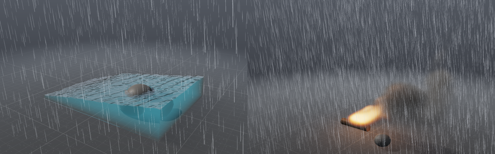

Kapka deště není voda pro FLIP. Je malá, padá skoro stálou rychlostí a na
jejím tvaru nezáleží. Důležité je, kudy letí, kam dopadne a co tam udělá.
Uzel **Rain** proto simuluje kapky jako samostatné částice
([`src/pg/sim/Rain.h`](../src/pg/sim/Rain.h)): padají z mraku, vítr je nese,
na podlaze a objektech odstřikují a na hladině vody dělají kroužky. Je to
levné: bouřka s 9 500 kapkami ve vzduchu a 11 000 kapičkami odstřiků
zabere na 4 jádrech 0,6 ms na krok.

### Síť

```
[Wind] ─────Force────┐
[Object] ───Collider─┴──▶ [Rain] ──Look──▶ [Output] ◀──Look── [Water Look] ◀── [Liquid Solver]
```

Rain je řešič i vzhled najednou a sám je vrstvou Outputu. Do jeho Forces
patří vítr, případně turbulence, vír, atraktor nebo odpor, do Colliders
objekty, na které prší. Když Output kreslí i vodu, kapky dopadají na její
hladinu. Stejný vítr se připojí do Pyro Solveru, Liquid Solveru i do deště:
kouř, tříšť vody i kapky pak jdou po stejném větru.

| uzel | parametry |
|---|---|
| **Rain** (Simulation) | Cloud: `center`, `size` (mrak: kapky vznikají v tomto kvádru a prší pod ním); Rain: `rate` (kapek za sekundu na m²: 100 mrholení, 800 déšť, 3 000 liják), `speed` (rychlost pádu v m/s: kolem 7 pro déšť, méně pro mrholení), `splash` (kolik kapiček odletí od pevného povrchu), `ripples` (jak silně kapka rozvlní vodu), `fill` (o kolik milimetrů za sekundu stoupá voda, do které kapky padají — jako by do ní padal všechen déšť pod mrakem; 0 nic, skutečná kapka je na to příliš málo vody; 5 až 20 naplní bazén během záběru, [quench.md](quench.md)), `seed`; Time: `start`, `end`; Look: `color`, `opacity`, `streak` (délka čáry jako podíl snímku: pohybová neostrost), `wet` (jak mokrá je podlaha) |
| **RBD Solver** (Simulation) | Pieces: `attribute`; Physics: `density`, `friction`, `bounce`, `gravity`, `floor`; Glue: `glue` (pevnost lepidla v kPa, 0 bez lepidla); Time: `substeps`, `rest` (tělesa v klidu zmrznou, dokud do nich něco nenarazí); Dust: `dust`, `impact_dust`, `dust_size`, `debris`, `air`; Look: `color`, `inside_color`, `inside_group`. Vstupy Pieces (geometrie s `piece`) a Colliders; výstupy Look (do Outputu: kusy se kreslí, kam dopadly), Rigid (do RBD Pieces), Collider (kusy jako pohyblivé překážky vody, plynu a deště) a Dust (zdroj kouře pro Pyro Solver); [destruction.md](destruction.md) |

Ve viewportu je déšť v **Shift+A → Weather**:

- *Rain* dá mrak nad celou scénu, připojí ho do Outputu a připojí do něj
  všechny objekty jako překážky a vítr, který už ve scéně je;
- *Rainstorm* je hustší a rychlejší déšť s většími odstřiky. Když ve scéně
  vítr není, přidá nárazový vítr a připojí ho do deště i do řešičů.

Mrak se vybere kliknutím na jeho kvádr, gizmo ho posouvá (**W**) a mění
jeho velikost (**R**).

### Jak to funguje

1. **Vznik.** Za krok vznikne `rate × plocha mraku × dt` kapek, zlomek kapky
   počká na další krok. Kde kapka vznikne, určuje hash jejího pořadového
   čísla. Když prší od začátku (`start` 0), je vzduch pod mrakem hned
   v prvním kroku plný kapek, které padaly už dřív: tolik, kolik jich spadne
   za dobu pádu na zem, rozložených od mraku k zemi a posunutých větrem. Ty,
   které by už dopadly do objektu nebo do vody, se vynechají. Déšť
   s pozdějším `start` začne padat až z mraku.
2. **Pohyb.** Rychlost kapky se blíží rychlosti vzduchu plus vlastnímu pádu,
   každý krok o podíl `1 − e^(−1,4·dt)`. Kapka se tak ustálí asi za 0,7 s,
   což je pro 7 m/s právě `v/g`. Rychlost vzduchu dává vítr, i s nárazy (viz
   dál). Turbulence s kapkou třese, odpor ji brzdí, vír ji stáčí a atraktor
   přitahuje.
3. **Dopad.** Na podlahu nebo do objektu: kapka zmizí a vyletí z ní `splash`
   kapiček, od povrchu nahoru (0,6 až 1,5 m/s) a do stran. Žijí 0,12 až
   0,3 s, padají s gravitací a zmizí, když znovu dopadnou. Do vody: kapka
   zmizí, vyrazí na hladině kroužek a občas vyskočí kapička (Worthingtonův
   výtrysk v malém). Kde je hladina, říká Liquid Solver
   (`distanceToSurface`).
4. **Vlnky.** Nad vodou leží mřížka výšek, nejvýš 256 buněk na delší stranu
   a nejmíň polovina buňky řešiče. Kapka do ní vtiskne kráter s valem kolem,
   profil `(1 − q)·e^(−q)` s `q = (r/w)²`, takže kolik vody jde dolů, tolik
   jde nahoru. Vlnová rovnice `h'' = c²∇²h − k·h'` ho rozvede do kroužku,
   který se šíří rychlostí 0,35 m/s a slábne s útlumem 3/s. Laplacián bere
   i diagonální sousedy (izotropní 9bodový): se čtyřmi by kroužky vyšly
   hranaté. Okraje vlny odrážejí. Co ze součtu výšek po zaokrouhlení zbude,
   se každý krok odečte, jinak by hladina pomalu klesala.

**Determinismus.** Každá kapka se hýbe sama (paralelně), dopady se
zpracují jeden po druhém v pořadí kapek a kapičky vznikají ve stejném
pořadí. Výsledek je bitově stejný na libovolném počtu vláken.

### Nárazový vítr

Vítr s `gusts` > 0 nefouká pořád stejně. Síla nárazu je šum v čase, ale
není v jednu chvíli všude stejná: **fronta nárazu putuje s větrem**. Co
teď fouká tady, fouká o `Δt` později o `speed · Δt` dál po větru:

```
rychlost(p, t) = d · speed · (1 + gusts · (2 · šum(0,8 · (t − p·d / speed)) − 1))
```

kde `d` je směr větru. Tak je to i ve skutečnosti, náraz je vzduch, který
přiletí. Kouř se ve frontě ohne nejdřív na návětrné straně a déšť se šikmí
postupně, jak fronta prochází mrakem. Stejná funkce
([`Shared.h`](../src/pg/sim/Shared.h), `windAt`) pohání plyn, tříšť vody
i déšť.

### Jak se déšť kreslí

- **Kapka je čára** od místa, kde je, zpět podél rychlosti, tak dlouhá,
  kolik kapka uletí za `streak` snímku (pohybová neostrost závěrky). Kreslí
  se jako úzký obdélník natočený na obrazovce a její ocas se vytrácí.
- **Kapka je malá**, 2,5 mm. Čára je široká asi 1,3 px. Vzdálená kapka
  pokryje jen část té šířky a je o to slabší, blízká je širší. V dálce se
  déšť proto slévá v opar a zblízka má jednotlivé čáry. Bez toho vypadá
  hustý déšť jako bílá opona.
- **Barva** je barva deště osvětlená oblohou a trochu sluncem, se stejnou
  expozicí a tone mappingem jako zbytek obrazu. V zamračeném světle jsou
  kapky tmavší.
- **Vlnky** naklánějí normálu hladiny podle sklonu výšek a odrazy i lom je
  ukážou. Nejlépe jsou vidět při pohledu po hladině, jako ve skutečnosti.
- **Mokrá podlaha** je tmavší (o `wet`/2) a odráží oblohu podle Fresnela.

Snímek nese šest čísel na kapku a vlnky jako čísla v poloviční přesnosti,
celkem desítky kilobajtů.

## 7. Jak se kreslí

Renderer ([`src/pg/gl/Volume.h`](../src/pg/gl/Volume.h)) kreslí scénu ve
světových souřadnicích: doménu, jak stojí na podlaze, podlahu s mřížkou,
překážky a vodítka. Snímek dostane v poloviční přesnosti
([`sim::Frame`](../src/pg/sim/Frame.h)) a nahraje ho do 3D textury RGB16F
tak, jak je, bez převodu. Fragment shader pak pro každý pixel:

1. najde první pevné těleso na paprsku: překážku (koule a kvádry analyticky)
   nebo podlahu;
2. osvětlí ho sluncem (ve stínu kouře i ostatních těles), oblohou a září
   ohně;
3. projde plyn zepředu dozadu až k tělesu. Každý krok ubere světlo podle
   Beerova-Lambertova zákona a přidá světlo, které krok sám vyzáří nebo
   rozptýlí. V rámci kroku se to integruje analyticky: světlo, které krok
   přidá, ztlumí i on sám;
4. zapíše hloubku tělesa, aby vodítka kreslená potom zmizela za překážkou
   a pod podlahou.

Co je v obraze:

- **Stíny kouře** na sebe samý: paprsek z každé buňky ke slunci, na GPU
  v polovičním rozlišení. Každá vrstva 3D textury je jeden průchod
  fragment shaderu do této vrstvy (`glFramebufferTextureLayer`). Počítá se
  znovu jen při novém snímku, novém světle, hustotě nebo překážce.
  Překážky do stínu počítají taky.
- **Stín na podlaze:** paprsek z bodu podlahy ke slunci přes kouř a
  překážky.
- **Záře ohně** na podlaze a překážkách: doména se rozdělí na bloky (šest
  podél nejdelší strany) a každý blok je lampa se sečteným světlem svých
  plamenů. Sčítá se na GPU, znovu jen při novém snímku nebo novém vzhledu
  ohně.
- **Rozptyl:** Henyey-Greensteinova fázová funkce, převážně dopředná. Kouř
  proti slunci proto svítí na okrajích. Světlo oblohy se ztlumí tam, kde je
  v okolí hustý kouř (z mipmapy stejné textury).
- **Oheň** září jako černé těleso: barva podle Planckova zákona (aproximace
  Tannera Hellanda) od 1000 K do 3000 K, jas se čtvrtou mocninou teploty
  (Stefanův-Boltzmannův zákon). Saze v plameni pohlcují méně světla než
  vychladlé; žlutou barvu plameni doopravdy dávají právě rozžhavené saze.
- **Tone mapping** ACES (Narkowiczova aproximace), pak sRGB.
- **Proti artefaktům:** začátek paprsku i každý vzorek se posouvá o šum
  (interleaved gradient noise), jinak by vznikaly pruhy. Hustota u
  otevřených stěn a u stropu plynule mizí, jinak by hlava kouřového sloupce
  u stropu vypadala jako useknutá poklicí.

Pohled je oběžná dráha kolem bodu (otočení, sklon, vzdálenost) se zorným
úhlem a náklonem kolem směru pohledu. Kamera sítě se na ni převede
(`gl::orbitThrough`) a zpět (`gl::cameraFrom`), takže viewport, render
v editoru i `prototype sim` počítají pohled stejně.

Voda se kreslí v témže průchodu ([§5](#jak-se-voda-kreslí)). Déšť přijde
až po něm: čáry kapek se kreslí přes obraz s hloubkovým testem, takže je
schová objekt, který je blíž.

Viewport editoru kreslí znovu, jen když se něco změní: snímek, vzhled,
kamera, velikost, vodítka.

## 8. Výkon a determinismus

Snímek táboráku na 4 jádrech (`pgbench_pyro --example campfire`, průměr
60 snímků, bez vykreslování), v ms: hustý řešič před řídkou mřížkou, dnešní
řídký (výchozí) a dnešní hustý (`sparse` vypnuté):

| rozlišení | buněk domény | hustý dřív | řídký | hustý |
|---|---|---|---|---|
| 48 (32 × 48 × 32) | 49 tisíc | 18 | 29 | 31 |
| 72 (48 × 72 × 48) | 166 tisíc | 44 | 56 | 74 |
| 96 (64 × 96 × 64) | 393 tisíc | 89 | 98 | 148 |
| 144 (96 × 144 × 96) | 1,3 milionu | 238 | 238 | 508 |
| 192 (128 × 192 × 128) | 3,1 milionu | 556 | **458** | 1204 |

Táborák zabírá velkou část své malé domény, řídká mřížka tu tedy moc
neušetří a v malém rozlišení ji zdrží správa dlaždic. Hustý režim je
zhruba dvakrát pomalejší než dřív: každé čtení souseda jde přes tabulku
dlaždic. Vyplatí se ale u velké domény s plynem v její části (níže).
Scéna bez překážek se počítá jednodušším operátorem bez vah stěn, součty
sousedů překladač vloží přímo do smyčky hladiče, hladič prochází jen buňky
jedné barvy a prodlužování z hrubé mřížky na jemnou se dělá odděleně po
osách.

### Prach odstřelu: hustě a řídce

`pgbench_pyro` krokuje příklad `demolition` (věž, její kusy a prach) v
zadaných rozlišeních a vypíše čas snímku, rozdělení času mezi fáze
kroku, paměť a jakou část domény prach a proudící vzduch zabírají
(`--dense` počítá hustě). Na 4 jádrech:

| rozlišení | voxelů domény | hustě | řídce | počítá se nejvýš |
|---|---|---|---|---|
| 96 (96 × 56 × 96), 90 snímků | 0,5 milionu | 249 ms/snímek, 119 MB | **55 ms**, 75 MB | — |
| 576 (576 × 312 × 576), 180 snímků | 103,5 milionu | nevejde se (přes 10 GB) | **6,2 s**, 3,4 GB | 23 % domény |

Při rozlišení 576 je buňka 16 cm a celý záběr (180 snímků, i s tuhými
tělesy) trvá 19 minut; s renderem každého třicátého snímku 21 minut
a nejvýš 5 GB paměti. Prach sám je nejvýš ve 12 % dlaždic, řešič počítá
nejvýš 23 % (i dlaždice kolem a kolem padajících kusů), zbytek domény je
stojící vzduch. Čas kroku: advekce 44 %, hledání buněk zabraných kusy 20 %
(stovky pohyblivých kusů každý snímek), tlak 19 %, síly 8 %. Divergence,
která po tlaku zůstane, je nejvýš 0,4 1/s.

Hustý režim je teď pomalejší, než byl hustý řešič před řídkou mřížkou
(249 proti 164 ms/snímek při rozlišení 96). Každé čtení souseda jde přes
tabulku dlaždic. Řídký režim, výchozí v uzlu, je i tak 3× rychlejší
než starý hustý řešič.


### Upres za řešičem

`pgbench_pyro --upres K` dá za řešič Pyro Upres a vypíše, kolik trvá
jeho snímek, kam jde čas a kolik jemné mřížky počítá. Táborák, 60 snímků,
4 jádra, v ms za snímek (řešič + upres) a nejvíc paměti za běh:

| simulace | mřížka obrazu | ms/snímek | paměť |
|---|---|---|---|
| řešič 64 | 48 × 64 × 48 | 38 | 24 MB |
| řešič 64 + upres ×2 | 96 × 128 × 96 | 38 + 53 | 84 MB |
| řešič 128 | 88 × 128 × 88 | 147 | 116 MB |
| řešič 64 + upres ×3 | 144 × 192 × 144 | 39 + 138 | 167 MB |
| řešič 96 + upres ×2 | 128 × 192 × 128 | 79 + 125 | 205 MB |
| řešič 192 | 128 × 192 × 128 | 358 | 334 MB |
| řešič 64 + upres ×4 | 192 × 256 × 192 | 38 + 244 | 290 MB |
| řešič 256 | 176 × 256 × 176 | 739 | 672 MB |

Upres je 1,6× až 2,6× rychlejší než řešič se stejně jemnou mřížkou a bere
asi polovinu paměti. Z jeho času jde 80 až 88 % na advekci, zbytek na
dlaždice a víry; počítá se třetina až polovina jemné mřížky a necelá
polovina těch dlaždic má plyn (zbytek je okraj, kam plyn může doletět).

Simulace dodržuje invariant I5 jádra: stejná scéna dá **bitově stejná**
pole na libovolném počtu vláken. Každá smyčka je `pg::parallelFor` přes řádky
buněk nebo dlaždice, každou buňku zapisuje právě jeden kus práce a mezi
buňkami se nic nesčítá; dlaždice se berou a pouští podle hodnot v nich,
v pořadí jejich čísel. Test to ověřuje se všemi prvky naráz: dva zdroje (jeden pohyblivý),
všechny síly a překážka, porovnání všech polí na 1 a na 4 vláknech.

## 9. Ověřování

[`tests/test_pyro.cpp`](../tests/test_pyro.cpp) (27 testů):

- interpolace mřížky; doména z násobků 8 buněk;
- projekce odstraní divergenci; výchozí dva cykly jí uberou přes 97 %;
  multigrid konverguje stejně rychle při každém rozlišení, i se zavřenou
  podlahou a s koulí uprostřed;
- horký kouř stoupá; palivo hoří na teplo a saze;
- zdroj přidává jen ve svém časovém okně, pohyblivý zdroj jde po své dráze,
  kvádrový zdroj plní kvádr;
- překážka drží plyn venku a proud ji obtéká; zavřenou podlahou nic
  neproteče; vítr odnáší kouř po větru;
- vír točí kolem osy, zdvih a nasávání působí, výška ho omezí; vír sahající
  ke stropu zůstane omezený; rozpínání ředí;
- bitově stejný výsledek na 1 a na 4 vláknech, řídce i hustě (řídce
  i stejné dlaždice);
- řídká mřížka: se všemi dlaždicemi vzorkuje bitově stejně jako hustá (i meze
  pro MacCormack), drží jen své dlaždice, při přeskládání zachová hodnoty
  dlaždic, které zůstaly; stěny MAC mají první vrstvu další dlaždice; tlak
  na dlaždicích uprostřed větší mřížky konverguje a mimo ně je 0, s tělesy
  na křivolakých dlaždicích v hluboké hierarchii každý V-cyklus zmenší
  zbytek aspoň na polovinu; sloup
  kouře v široké doméně zabere nejvýš třetinu buněk a kouře je stejně jako
  v husté (±1 %, naměřeno 0,01 %) a ve stejné výšce (±1 cm); bez plynu
  nezůstane žádná dlaždice;
- nesmyslné vstupy (NaN, nulový krok, záporné rychlosti) řešič opraví;
- stíny; half float: přesné, zaokrouhlení k sudé, nekonečno, NaN.

[`tests/test_upres.cpp`](../tests/test_upres.cpp) (7 testů): mřížka
upresu je mřížka řešiče `scale`krát jemnější (2 až 4, nejvýš 2048 buněk);
bez vírů nese stejně kouře jako řešič (±15 %, naměřeno 9 %) se stejným
těžištěm (do 0,75 buňky řešiče, naměřeno 0,23) a počítá méně než polovinu
jemné mřížky; víry zjemní kouř i plamen (rozdíly mezi sousedními buňkami
přes 1,3× větší, naměřeno 2,1× a 1,9×), plynu nechají stejně (±20 %) a
nejsou rychlejší než nejrychlejší proudění řešiče; kouř, který stojí, je
s víry i bez nich bitově stejný; do koule nad zdrojem se nedostane žádný
kouř; bitově stejný výsledek na 1 a na 4 vláknech (i s pohyblivým zdrojem
a překážkou); vyhledání rohů pro více mřížek naráz čte bitově jako
`sample()`. V `test_state.cpp` upres pokračuje z checkpointu bitově stejně
(i přes obnovu vrstvy šumu a s překážkou) a stav bez upresu se do světa
s upresem nenačte; v `test_sim_network.cpp` se uzel přeloží do světa,
obejitý pustí plyn řešiče, klíčované měřítko se nahlásí a bez řešiče na
vstupu je chyba.

[`tests/test_sim_network.cpp`](../tests/test_sim_network.cpp) (22 testů):
tabulka typů uzlů je konzistentní (a každá výchozí hodnota se zapíše a
přečte zpět stejně), jména a spoje, meze parametrů včetně čísel, která
se čtou stejně s každou standardní knihovnou, soubory tam a zpět, co se ze
souboru zachová, kompilace do scény a vzhledu, problémy sítě, příklady
dávají `Scene::fire()` a `Scene::smoke()`, všechny příklady běží a jsou
přesně v uloženém tvaru, soubory starších verzí se převedou, objekty jsou
ve scéně připojené i nepřipojené a nová barva nic nesimuluje znovu;
`fps` a světlo ze souborů verze 1 se přestěhují do Outputu; svět
(`WorldSolver`) krokuje všechny řešiče jednou frekvencí a druhý vzhled
plynu se nahlásí; uzly vody se přeloží do světa i vzhledu, kouř a voda
v jednom Outputu běží spolu a co chybí, se nahlásí; déšť je vrstva
Outputu s větrem a překážkami, mrak pod podlahou, nulová hustota a druhý
déšť se nahlásí; kamera se dívá, kam je natočená (i s jiným „nahoru“ a
kolmo dolů), objektiv 38 mm má 35° a 12 mm pravý úhel, kamera je jedna na
Output a patří do souboru.

[`tests/test_liquid.cpp`](../tests/test_liquid.cpp) (14 testů): tlak
s volnou hladinou konverguje do 30 iterací a reziduum sedí i přepočítané
z operátoru; ve vodě zavřené v kapsách (48 buněk pod bednou, 2 mezi bednou
a dnem), do kterých víc přitéká, než odtéká, se tlak spočítá do 30 iterací,
zůstane konečný a každá kapsa si ponechá hladinu tlaku, se kterou přišla,
bitově stejně na 1 i 4 vláknech (bez vyrovnání kapes řešení nekonverguje);
stojatá voda zůstane stát a tlak na dně je `g × hloubka`;
protržená přehrada doteče ke stěně a neztratí jedinou částici; koule vody
padá volným pádem (rychlost `g t` na procento); zdroj `fill` naplní tvar
osmi částicemi na buňku jednou, `flow` teče jen ve svém čase a tam, kam
míří; voda se nedostane do tělesa a steče z něj; otevřenými stranami
odteče; částice drží svá čísla; snímek nese hladinu (uvnitř záporná
vzdálenost, venku kladná, o buňku na buňku) i rychlost vody na mřížce
řešiče (u vody, nad ní nula); vítr unáší padající kapky a rybník nechá
rovný (starý vítr na hladině odfoukal vodu k jedné stěně); bitově stejný
výsledek na 1 a na 4 vláknech i s tělesem a turbulencí; nesmyslné vstupy
se opraví.

[`tests/test_rain.cpp`](../tests/test_rain.cpp) (9 testů): vzduch pod
mrakem je od prvního kroku plný kapek až k zemi a dopadá jich přesně tolik,
kolik říká `rate` (na 2 %); kapky padají svou rychlostí a ve větru se šikmí
(3 m po větru na 7 m pádu); fronty nárazů putují s větrem a mění jen jeho
sílu, ne směr; kapky nezůstanou v objektu a kapičky od něj odletí nahoru;
kapky i kapičky drží svá čísla; do vody dopadne, co má, pod hladinu nic neproletí a vlnky zůstanou
vlnkami; déšť začne a skončí včas a pozdní začne u mraku; bitově stejný
výsledek na 1 a na 4 vláknech (s vodou, větrem, turbulencí a objektem);
nesmyslné vstupy se opraví.

[`tests/test_shapes.cpp`](../tests/test_shapes.cpp) (5 testů): rotace na
úhly a zpět (i přes 180° a v gimbal locku), uvnitř a vně, vzdálenosti, kde
paprsek potká každý tvar (i pootočený a protažený) a s jakou normálou,
útlum zdroje ke kraji tvaru.

[`tests/test_mesh.cpp`](../tests/test_mesh.cpp) (6 testů): OBJ ve všech
zápisech stěn (i záporné indexy, mnohoúhelníky, CRLF, čísla nezávislá na
locale) a chybné soubory; pole vzdáleností proti přesné vzdálenosti
krychle; model s dírou je pořád správně uvnitř i vně; paprsky; model
umístěný ve světě (posunutý, pootočený, protažený); soubor se čte jednou a
po změně znovu. V testech sítě: cesta s mezerou a uvozovkami tam a zpět,
relativní cesta ze složky sítě, chybějící soubor nahlásí a zastoupí ho
kvádr.

Vše čisté pod AddressSanitizerem, UBSanem i ThreadSanitizerem. Pod TSanem a
ASanem běžel i editor s vláknem simulace a skriptovaným vstupem (`prototype
--script`: myš, klávesy a snímky obrazovky ze souboru): přidání uzlu přes
Tab, spojení tažením, rychlé změny parametrů, které simulaci opakovaně
restartují, undo a redo, posun po časové ose, přepnutí sítí a konec
uprostřed kroku; výběr kliknutím, tažení gizma pro posun, rotaci i
měřítko, výběr více objektů, duplikace, mazání, přidání přes Shift+A a
kontextovou nabídku. Žádný data race ani chyba paměti v našem kódu;
hlášení zbyla jen uvnitř X11, GLX a Mesy, které pro sanitizery nejsou
instrumentované.

Rozhraní editoru má vlastní testy, které nepotřebují okno ani OpenGL:
[`tests/test_editor_ui.cpp`](../tests/test_editor_ui.cpp), program
`pgeditortests` (v `ctest` jako `editor_ui`), 19 testů. Dear ImGui v nich
běží jen v paměti: snímky se staví, vstup se do nich vkládá, nic se
nekreslí. Ověřují:

- písmo je zakompilovaný Inter (Regular i SemiBold) a má české znaky i
  značky, které editor píše;
- Escape zavře jen nejvyšší menu: podmenu, pak menu. Dialog nechá dialogu.
  Stisk, který menu zavřel, už nedojde k panelu pod ním;
- nabídka uzlů vezme šipkami zvýrazněný uzel Enterem, šipka nahoru z prvního
  přejde na poslední; nabídka se 150 uzly otevřená u spodního okraje se
  celá vejde do okna;
- řádky přehledu mají hodnoty v jednom sloupci, za nejširším popiskem;
- záložka v hlavičce panelu se přepne kliknutím;
- jména uzlů v oddálené síti nepřekryjí žádný uzel ani jiné jméno: síť
  120 uzlů hustší, než jsou jména široká, a dva uzly nad sebou, kde jméno
  horního musí jít napravo; náhledy uzlů si udělají místo, aniž by se síť
  posunula;
- neuložené změny: bez změn se akce provede hned. Se změnami přijde otázka:
  Escape nic neudělá, D změny zahodí a Enter uloží a pak pokračuje. U sítě
  bez souboru akce počká, až se soubor vybere a zapíše;
- uložení přes existující soubor se nejdřív zeptá, Enter podruhé ho
  přepíše a Escape vezme zpět otázku, ne dialog;
- autosave se zapíše hned po změně a pak nejvýš po 30 s. Záloha editoru,
  který ještě běží, se nenabízí, záloha spadlého ano (včetně toho, čeho je
  a jaký má text). Po uložení nebo zahození záloha zmizí;
- historie (undo) zapíše změnu jednou, až se ustálí, a teprve pak uloží
  stav. Drží nejvýš svůj rozpočet bajtů. Klíč stavu se změní úpravou
  i posunutím uzlu;
- práce po snímcích na pozadí (`FrameJob`) udělá snímky popořadě a řekne,
  jak dopadla. Zastavená skončí po snímku, který dělá, a hotové nechá.
  Snímek, který selže, ji ukončí a hlášení řekne proč a kam došla. Když
  zmizí za běhu, zastaví se a počká.

Celý editor pak zkouší `ctest` skripty pod xvfb
([`tests/editor/run_editor.py`](../tests/editor/run_editor.py), testy
`editor_*` v buildu s editorem). Skript se přehraje do okna a co editor
udělal, se čte ze souborů, které nechal: co uložil, co odložil k obnově,
a snímek obrazovky, který vznikne, jen když editor ještě běží.

- **Quit se změnami:** Save uloží a skončí, Don't Save soubor nechá a záloha
  zmizí, Cancel editor nechá běžet.
- **Příklad bez souboru:** při ukončení se uloží přes Save As. Podruhé se
  zeptá a Enter soubor přepíše.
- **Pád:** editor se zabije (`kill -9`), spustí se znovu z jiné složky,
  Enter síť obnoví a Ctrl+S ji uloží do původního souboru. Složka záloh
  pak zůstane prázdná.
- **Simulate Again:** čtyřikrát za sebou, zatímco táborák simuluje.
- **Cache a export na pozadí:** Save Cache to Disk a Export USD Scene
  (zastavený Escapem) běží na vlastním vlákně a okno hraje dál. Co zapíšou,
  drží pohromadě: `cache.txt` uvádí tolik snímků, kolik jich ve složce je,
  a scéna končí snímkem, ke kterému je poslední VDB.
- **Výběr, zatímco se staví strom pro výběr:** mřížka o milionu ploch.
  Klik a obdélník hned po přepnutí na body (2) na strom počkají a vyberou.
  Ctrl+G z výběru udělá skupinu a Ctrl+S ji uloží.

## 10. Jak přidat uzel

Editor, soubory i příkazová řádka berou uzly z jedné tabulky
([`src/pg/sim/Network.cpp`](../src/pg/sim/Network.cpp), `buildTypes()`).
Nový uzel se tam zapíše a všude se objeví sám: v nabídce Tab, v panelu
parametrů, v souborech i v `--set`.

1. **Fyzika**, pokud je nová: data do [`Scene.h`](../src/pg/sim/Scene.h)
   (třeba nový `ForceKind`), výpočet do [`Pyro.cpp`](../src/pg/sim/Pyro.cpp)
   (`addForce`), meze do `Scene::sanitized()`.
2. **Typ uzlu:** jméno, popisek, kategorie, nápověda, piny (typ určuje, co
   se smí spojit) a parametry. Každý parametr má sekci, druh (číslo, celé
   číslo, přepínač, vektor, barva, volba), výchozí hodnotu, rozsah
   posuvníku, fyzikální meze, jednotku a nápovědu.
3. **Kompilace:** v `Network::compile()` převést parametry na scénu.
4. **Vodítko** ve viewportu, pokud má uzel tvar:
   `gl::sceneGuides()` v [`Volume.cpp`](../src/pg/gl/Volume.cpp).
5. **Test:** test tabulky ho zkontroluje sám; přidat test fyziky.

## 11. Co je potřeba znát

- **Vektorový počet:** gradient, divergence, rotace (curl). Divergence říká,
  kolik z bodu vytéká, rotace jak moc se točí. Celá simulace se dá číst jako
  „posuň, přidej síly, odstraň divergenci“.
- **Navierovy-Stokesovy rovnice** pro nestlačitelnou tekutinu, bez
  viskozity: Eulerovy rovnice. Numerická difuze tu viskozitu stejně dodá.
- **Okrajové podmínky:** Dirichletova (daná hodnota, tady tlak nula na
  otevřené stěně) a Neumannova (daný tok, tady nulový tok zdí). Z §4 je
  vidět, že i „samozřejmá“ volba, co přitéká otevřenou stěnou, rozhoduje
  o stabilitě.
- **Stam, *Stable Fluids* (1999)** — základ celé třídy metod: semi-Lagrangeova
  advekce plus projekce.
- **Bridson, *Fluid Simulation for Computer Graphics*** — nejlepší kniha na
  začátek: MAC mřížka, projekce, hranice, pevná tělesa.
- **Fedkiw, Stam, Jensen, *Visual Simulation of Smoke* (2001)** — vorticity
  confinement.
- **Selle a kol., *An Unconditionally Stable MacCormack Method* (2008).**
- **Briggs, *A Multigrid Tutorial*** — multigrid srozumitelně.
- **Wrenninge, *Production Volume Rendering*** a **PBRT, kapitola o
  objemech** — raymarching, fázové funkce, stíny.
- **Dokumentace Houdini Pyro** — co z toho produkce používá a jak se to
  nastavuje: Pyro Solver, pole `flame`, `temperature`, `density`, `fuel`,
  POP Axis Force (předloha uzlu Vortex).

## 12. Omezení a co dělá produkce

Tahle simulace je prototyp, který ukazuje, jak Pyro funguje, a měří, kolik
to stojí. Oproti produkci:

1. **Hustá mřížka.** Počítá se každá buňka, i prázdná. Produkce ukládá jen
   buňky u kouře (OpenVDB, na GPU NanoVDB) a doména roste s kouřem. Rozhraní
   `Grid` je tu malé právě proto, aby se dalo vyměnit.
2. **CPU.** Houdini má řešiče v OpenCL, EmberGen simuluje v reálném čase na
   GPU. Každá fáze tu je smyčka přes buňky bez sdíleného stavu, takže se dá
   přímo převést na compute shader.
3. **Rychlost se unáší semi-Lagrangeovou metodou**, která rozmazává.
   MacCormack nebo BFECC i pro rychlost, případně FLIP, drží víry déle.
4. **Překážky jsou hrubé.** Tvary (koule, kvádr, válec, kužel, prstenec)
   i modely z OBJ se převádějí na pole vzdáleností, které má jen 48 buněk
   podél modelu, takže jemné detaily v kolizích zmizí. Pohyblivé překážky
   předají plynu i vodě svou rychlost ([animation.md](animation.md)), ale
   rychlá překážka tenkou vrstvou proskočí. V produkci se pole peče jemněji
   (a řídce, OpenVDB) a krok se zkracuje podle rychlosti překážek.
5. **Jednoduchý rozptyl.** Produkční renderery (Karma, Arnold) počítají
   mnohonásobný rozptyl, díky kterému je hustý kouř uvnitř světlejší.
6. **Cache drží obraz, ne stav řešiče.** Snímky jdou na disk a do OpenVDB
   ([cache.md](cache.md)), ale v poloviční přesnosti a bez rychlostí, takže
   ze snímku v cache nejde simulovat dál. Produkce ukládá i stav řešiče
   a na uložený snímek navazuje.
7. **Voda je hrubá.** Rozlišení 64 dává kapky a pláty centimetry tlusté
   a řídká tříšť se z částic skládá do hrbolatých tvarů. Produkce počítá
   mřížky řídce (OpenVDB), s desítkami milionů částic, povrch staví
   z anizotropních jader (Yu a Turk, 2013) a tříšť, pěnu a bubliny
   simuluje zvlášť (whitewater). Chybí viskozita a povrchové napětí.
8. **Kouř a voda o sobě nevědí.** Každý řešič má svou doménu; oheň vodou
   neuhasne a voda se kouřem nepohne. Stejně déšť: vodu v bazénu nepřidá,
   oheň neuhasí, kouř ho neunáší (vítr ano) a mokrá je jen podlaha, ne
   objekty. Vlnky jsou mřížka výšek nad hladinou, kterou řešič vody nevidí.
   Produkce dělá déšť z částic stejně, ale kapky jsou tam i součástí FLIP,
   jakmile dopadnou, a mokrost se maluje do textur objektů.
9. **Render je náhled.** Raymarching v OpenGL s jedním rozptylem, bez
   hloubky ostrosti a bez pohybové neostrosti plynu a vody (neostré jsou
   jen kapky deště). Produkce renderuje tytéž objemy path tracingem
   (Karma, Arnold, RenderMan) a skládá vrstvy v kompozici (Nuke).
10. **Simulace není uzel geometrické sítě.** Další krok je uzel
   `pyrosolver`: cook engine jádra už zná časovou závislost a cache
   snímků ([ARCHITECTURE.md §4.3](../ARCHITECTURE.md#43-čas-jako-dimenze-závislosti)).

## 13. Odkazy

- J. Stam: *Stable Fluids*, SIGGRAPH 1999.
- R. Fedkiw, J. Stam, H. W. Jensen: *Visual Simulation of Smoke*, SIGGRAPH 2001.
- A. Selle, R. Fedkiw, B. Kim, Y. Liu, J. Rossignac: *An Unconditionally
  Stable MacCormack Method*, J. Sci. Comput. 2008.
- R. Bridson: *Fluid Simulation for Computer Graphics*, 2. vyd., CRC Press 2015.
- W. L. Briggs, V. E. Henson, S. F. McCormick: *A Multigrid Tutorial*, SIAM 2000.
- M. Wrenninge: *Production Volume Rendering*, CRC Press 2012.
- T. Kim, N. Thürey, D. James, M. Gross: *Wavelet Turbulence for Fluid
  Simulation*, SIGGRAPH 2008 — upres: šum přidaný do hrubé simulace podle
  energie, kterou mřížka nerozliší.
- R. Bridson, J. Hourihan, M. Nordenstam: *Curl-Noise for Procedural Fluid
  Flow*, SIGGRAPH 2007.
- F. Neyret: *Advected Textures*, SCA 2003 — dvě vrstvy unášených
  souřadnic, které se střídavě obnovují a prolínají.
- M. Pharr, W. Jakob, G. Humphreys: *Physically Based Rendering*, 4. vyd.,
  kap. 11 a 14.
- J. Jimenez: *Next Generation Post Processing in Call of Duty: Advanced
  Warfare*, SIGGRAPH 2014 (interleaved gradient noise).
- Y. Zhu, R. Bridson: *Animating Sand as a Fluid*, SIGGRAPH 2005 (FLIP a
  hladina z částic).
- C. Batty, F. Bertails, R. Bridson: *A Fast Variational Framework for
  Accurate Solid-Fluid Coupling*, SIGGRAPH 2007.
- F. Gibou, R. Fedkiw, L.-T. Cheng, M. Kang: *A Second-Order-Accurate
  Symmetric Discretization of the Poisson Equation on Irregular Domains*,
  J. Comput. Phys. 2002 (ghost fluid).
- A. McAdams, E. Sifakis, J. Teran: *A Parallel Multigrid Poisson Solver
  for Fluids Simulation on Large Grids*, SCA 2010.
- H. Zhao: *A Fast Sweeping Method for Eikonal Equations*, Math. Comp. 2005.
- R. Gunn, G. D. Kinzer: *The Terminal Velocity of Fall for Water Droplets
  in Stagnant Air*, J. Meteorology 1949 (kapky padají 2 až 9 m/s).
- K. Garg, S. K. Nayar: *Photorealistic Rendering of Rain Streaks*,
  SIGGRAPH 2006 (jak vypadá čára kapky při pohybové neostrosti).
- SideFX: dokumentace Houdini, *Pyro*, *FLIP Solver* a *POP Axis Force*.
