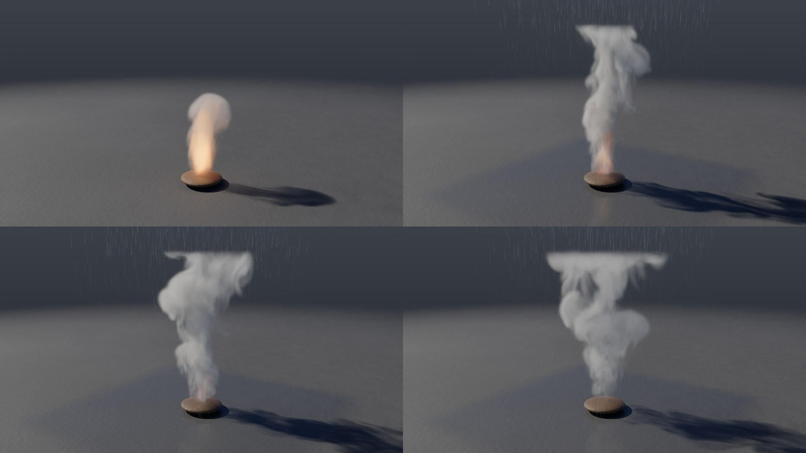
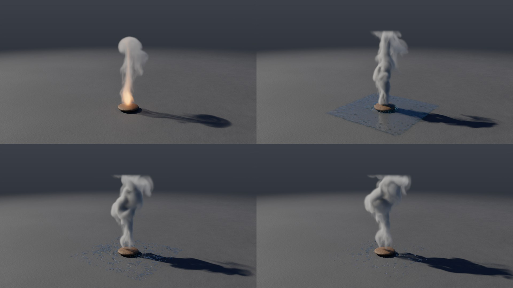
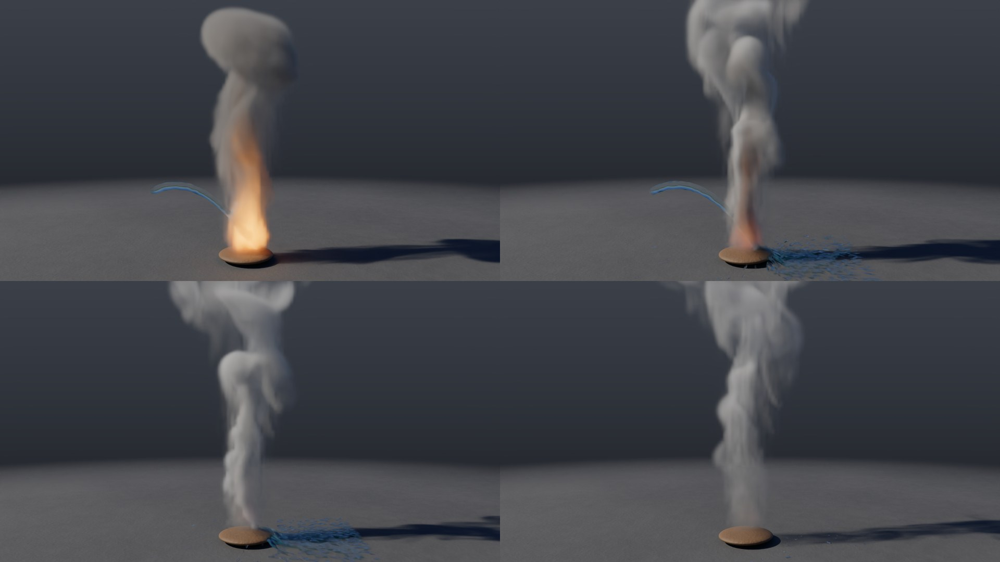
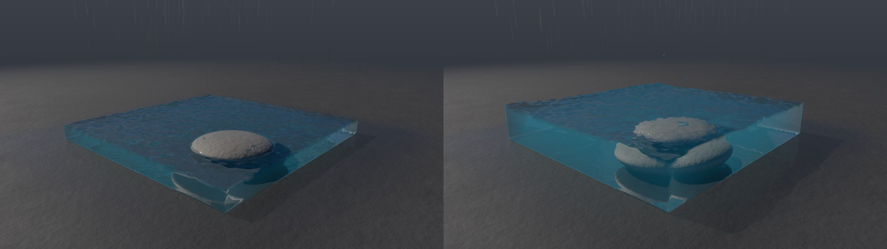
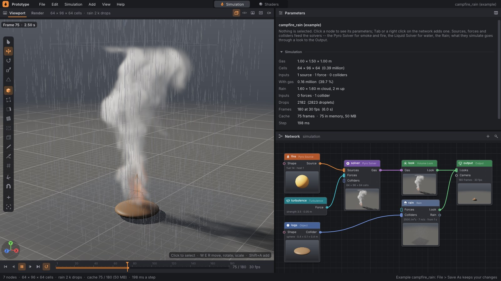

# Water and fire: quenching, steam, evaporation and rain that fills water

Solvers in one network know about each other. Water from a Liquid Solver and
drops from a Rain node that get into the gas of a Pyro Solver put the fire
out: they cool it, soak the fuel and extinguish the flame. The heat they take
becomes steam — a gas field of its own next to smoke: white, lighter than air,
it rises and thins out into clear air on the way. A fire source that water
falls on gets soaked and gives less and less — a campfire in a downpour goes
out and does not flare up again. Flames, in turn, evaporate the water passing
through them: a handful of water thrown into a fire loses a third of itself on
the way down. And rain falling into water tops it up: the surface of a pool
rises in a downpour.

Nothing needs to be wired up for this: it is enough to have a Pyro Solver and
a Liquid Solver or Rain in the same network. How strongly water quenches, how
much steam it makes and how fast it evaporates is set on the Pyro Solver
(Water section); what steam looks like is set on Volume Look (Steam section);
and how fast rain fills water is set on Rain (`fill`).



## Examples

| example | what it shows |
|---|---|
| `campfire_rain` | a campfire burns for a second, then a downpour arrives (2,500 drops per second per m²): drops that fall through the flames cool them, those that land on the fire soak it. After four seconds 1.5% of the flames is left and steam rises from the logs |
| `fire_douse` | at 1.5 s a ball of water 32 cm in diameter falls onto a campfire: the flames vanish within ten frames, a white cloud of steam billows through the dark smoke and the water runs off across the ground |
| `fire_hose` | from 1.5 s to 3.5 s a stream of water from a hose is aimed at a log fire: where it enters the flames, a small part of it evaporates before it lands, the rest gradually puts the fire out; white steam rises through the dark smoke and thins out higher up |
| `rain_fill` | a downpour fills a stone tank: drops that land in the water ripple it and add 15 mm per second to it — in five seconds the surface rises by 7 cm and floods a step |

```
./build/prototype sim campfire_rain out.png --frames 150 --every 30
./build/prototype sim fire_douse out.png --frames 90 --renderer cycles
./build/prototype sim fire_hose out.png --frames 90 --renderer cycles
```







In the editor the campfire is out after 75 frames; the Rain node's summary
shows when the rain starts (and, with `fill`, how fast it fills water):



What is left of the flame (sum of the `flame` field) in `campfire_rain` and `fire_douse`:

| frame | 30 | 50 | 60 | 70 | 90 | 110 | 150 |
|---|---|---|---|---|---|---|---|
| downpour from 1 s | 984 | 575 | 309 | 231 | 122 | 51 | 15 |
| bucket at 1.5 s | 984 | 739 | 39 | 15 | 5.6 | — | — |

In `fire_hose` the water stream from frame 45 (1.5 s) brings the flames down
to half within a second and to a fifth within a second and a half; half a
second after the stream ends (frame 120) 5% of them remain: 728 at frame 45,
362 at 75, 154 at 90, 36 at 120. Steam peaks at frame 90 (field sum 8,990);
a second after the stream ends (frame 135) a third of it remains.

## Parameters

**Pyro Solver**, Water section:

| parameter | default | what it does |
|---|---|---|
| `quench` | 1 | how strongly water and drops quench the fire they get into: they cool the gas and soak the fuel and the sources they fall on. 0: water does not quench the fire and the gas is bit for bit the same as without it |
| `steam` | 1 | how much steam each unit of heat taken by water makes. Steam is a gas field of its own (`steam`), drawn white. 0: none |
| `steam_lift` | 1.5 | how strongly steam rises — it is lighter than air and warm — in units of the buoyancy with which one unit of heat lifts the gas |
| `steam_fade` | 0.7 1/s | how fast steam thins out into clear air: after a second e^(−0.7) of it remains, i.e. half |
| `evaporate` | 1 | how fast fire evaporates the water inside it — Liquid Solver particles, rain drops. In flames a drop vanishes within a fraction of a second; in warm smoke it lasts. 0: water stays, however hot it is |

**Volume Look**, Steam section:

| parameter | default | what it does |
|---|---|---|
| `steam_color` | 0.92 0.93 0.95 | the color of steam in light: white |
| `steam_density` | 8 | how much light steam stops: from a wisp to a white cloud |

**Rain**, Rain section:

| parameter | default | what it does |
|---|---|---|
| `fill` | 0 | by how many millimeters per second the water the drops fall into rises, as if all the rain under the cloud fell into it. 0: nothing — a real drop is far too little water for that (even a heavy downpour gives 0.02 mm/s); 5 to 20 fills a pool within a shot |

Steam is drawn on its own, with its own color and density, and smoke stays
smoke: the water examples therefore use dark smoke (`smoke_color 0.2 0.19
0.18`, soot from wet wood) so the white steam stands out well against it. All
three renderers — the editor (OpenGL), the path tracer and Cycles — take both
fields: light is stopped by `smoke_density` × smoke + `steam_density` × steam
and scattered in a color depending on which of the two dominates at that
point.

## How it works

### Water in the gas

At the start of every step World tells the gas where the water is
(`PyroSolver::setWater`): Liquid Solver particles inside the gas box and the
paths of rain drops for this step, as they were at the end of the previous
one. From these the gas computes a quench rate *r* (1/s) for every cell:

- a **water particle** fills one eighth of a cell with water (h³/8). A gas
  cell full of water has *r* = 90/s: after one frame a twentieth of its heat
  remains;
- a **drop** cools the column of air it falls through, with a cross-section
  of 1 cm² (the spray it shatters into, the air it drags along), each cell
  along its path at a rate of 12/s × cross-section × path length in the cell /
  cell volume / step. On average each cell thus gets as much as the rain
  delivers, independently of cell size: a downpour of 2,500 drops per second
  per m² cools the gas roughly three times per second. A single drop is
  violent in the cell it passes through: it tears the flame apart.

After advection and before combustion (`PyroSolver::quench`) every wet cell
loses a fraction *q* = 1 − e^(−quench · *r* · dt) of its heat, fuel and
flame. A tenth of the heat taken stays in the gas (steam is warm) and the
steam in the cell grows by `steam` × heat taken. Fuel gets soaked before it
burns: a source that keeps adding fuel to wet cells does not burn.

### Steam

Steam is a gas field of its own (`PyroSolver::steam`) next to smoke, heat,
fuel and flame, on the same grid and in the same tiles. The flow advects it just like smoke (MacCormack)
and it is zero inside solid bodies. In buoyancy it lifts the gas like heat:
per step the vertical velocity gets

dt × (buoyancy × heat − weight × smoke + `steam_lift` × steam),

so steam rises even after it cools down. During dissipation it decays by
e^(−`steam_fade` · dt), and where burning gas expands it is diluted along with
it, like smoke. The sparse solver does not release a tile that contains any
steam.

Until water has reached the gas (or with `steam 0`) the solver does not
advect or dissipate the steam field at all, so gas without water costs
nothing extra. Pyro Upres does not compute steam itself: it samples it into
the fine frame from the coarse solver (`addCoarseSteam`) in the tiles where
there is some.

The renderers take steam alongside smoke. The editor keeps it in the alpha
channel of the gas 3D texture (RGBA16F), the path tracer and Cycles in the
fourth component of the grid: light is stopped by `smoke_density` × smoke +
`steam_density` × steam, and the scattered color is the average of
`smoke_color` and `steam_color` weighted by how much light each field stops.
Cycles receives this color as a voxel attribute (`pg_albedo`) into
Principled Volume. The Gas Volume node returns steam as a fourth volume
(`steam`); Python returns it as `frame.gas("steam")`.

### Evaporation

After the gas step and before the water step World goes over the water
particles and rain drops. Where the gas is hotter than the boiling point
(`kBoil` = 0.5, temperature interpolated between cell centers,
`PyroSolver::heatAt`), each one evaporates with probability

1 − e^(−`evaporate` × (*T* − 0.5) × dt).

In the flames of the examples (temperature 4 to 5, at most 8) a drop with
`evaporate 1` thus lasts a quarter of a second on average, longer in the warm
smoke above them, and forever in air cooler than 0.5. The draw is a hash of
the particle (drop) number, the frame number and the seed
(`detail::boiledAway`), not of the order across threads: the same particles
evaporate on any number of threads and after restoring from a checkpoint.

Evaporated water does not add steam: steam is made by the heat the water took
while quenching — and only water that is in the gas quenches. Evaporation
therefore removes water that would otherwise keep quenching the fire: a
handful of water thrown into flames loses a third of itself on the way down
(test). Rain drops cross the flames in a twentieth of a second, so with
`evaporate 1` only a few of them evaporate; with `evaporate 8`, 30% fewer of
them land beneath the flames. A dense stream defends itself: it immediately
cools the gas around it below boiling point, so in `fire_hose` after 75
frames there is only 4% less water than with `evaporate 0` and 5% more
flame.

### Soaked source

A fire source (fuel or heat above 0) that water falls on gets soaked: its
soaking *s* grows by dt × quench × 0.4 × the average *r* over the source
cells, and the source emits e^(−*s*) of what it would — fuel, smoke, heat and
expansion. Under water the fire is gone within a few frames, in a downpour
within a few seconds. The source does not dry: when the water drains away or
the rain stops, the fire does not flare up again. Pyro Upres takes the
sources soaked the same way as the solver.

### Rain fills water

A drop carries `fill` / `rate` m³ of water (`RainSolver::dropVolume`). World
hands the drops that land in water during a step to the water
(`LiquidSolver::pour`): it accumulates the volume, and as soon as there is
enough for one particle (an eighth of a cell) it places it into a free eighth
of a cell near the impact point — the first one upwards from the top layer of
water, i.e. onto the water, not into it. Whatever is not enough for a whole
particle waits for more drops and also goes into the checkpoint.

A fast drop travels over 20 cm per frame, more than the depth of shallow
water. The impact test therefore also checks the spot where the drop would
pass through the floor — previously such drops "landed on the floor" under
the water and did not count towards the water.

### Volume correction in FLIP

FLIP keeps water incompressible on the grid, not the particles in it:
particles that crowd into a cell do not spread apart again. Water poured on
top would thus sink into the water below and compress it instead of raising
the surface (in a test, 25.9 l on 1 m² raised the surface by 8 mm instead of
26). A cell with more than 10 particles (a full one has 8) is therefore
allowed to expand during projection: in each substep 0.3 of the excess flows
out of it (`kPacked`, `kSwell` in `Liquid.cpp`). The same 25.9 l now raises
the surface by 25 mm. This also preserves volume elsewhere where FLIP
compresses water — on impact and in a stream pouring into a tank.

### Determinism and checkpoint

Wet cells are sorted by cell number and summed in the order in which the
water arrived; each gas cell is modified only by its own thread. Without
water or with `quench 0` the gas is bit for bit the same as before. The
simulation state (version 6) carries the soaking of the gas sources, the
steam field and the water poured in by rain that has not yet become a
particle; a run restored from a checkpoint produces the same bytes. A cache
frame (version 17) carries steam at half precision; older frames are still
read, without it.

## Code

| file | what is there |
|---|---|
| [`src/pg/sim/Pyro.h`](../src/pg/sim/Pyro.h), `.cpp` | `PyroSolver::Water`, `setWater`, `quench` (cooling, steam, soaking of sources), `soaked`; the `steam` field (advection, buoyancy, dissipation), `steamy`, `heatAt`, `kBoil`; `detail::emitScalars` with soaking |
| [`src/pg/sim/Scene.h`](../src/pg/sim/Scene.h) | `SolverSettings::quench`, `steam`, `steamLift`, `steamFade`, `evaporate` |
| [`src/pg/sim/Shared.h`](../src/pg/sim/Shared.h) | `detail::boiledAway`: the evaporation draw by particle number and frame |
| [`src/pg/sim/Rain.h`](../src/pg/sim/Rain.h), `.cpp` | `RainSettings::fill`, `intoWater`, `dropVolume`; impact into shallow water; `RainSolver::evaporate` |
| [`src/pg/sim/Liquid.h`](../src/pg/sim/Liquid.h), `.cpp` | `LiquidSolver::pour`, volume correction in `project`; `LiquidSolver::evaporate` |
| [`src/pg/sim/World.cpp`](../src/pg/sim/World.cpp) | water and drops into the gas in `prepare`, evaporation after the gas step, drops into the water after the rain step; state version 6 |
| [`src/pg/sim/Frame.h`](../src/pg/sim/Frame.h), `.cpp` | `Frame::steam` (half precision, in the gas tiles), `denseSteam`, `addCoarseSteam` (steam for Pyro Upres) |
| [`src/pg/sim/Look.h`](../src/pg/sim/Look.h) | `Look::steamColor`, `steamDensity` |
| [`src/pg/gl/Volume.cpp`](../src/pg/gl/Volume.cpp), [`src/pg/render/Gas.cpp`](../src/pg/render/Gas.cpp), [`src/pg/render/Cycles.cpp`](../src/pg/render/Cycles.cpp) | steam in the editor (alpha channel of the gas texture), in the path tracer and in Cycles (`pg_albedo`) |
| [`src/pg/sim/Network.cpp`](../src/pg/sim/Network.cpp) | parameters `quench`, `steam`, `steam_lift`, `steam_fade`, `evaporate` (Pyro Solver), `steam_color`, `steam_density` (Volume Look) and `fill` (Rain) |

## Tests

[`tests/test_quench.cpp`](../tests/test_quench.cpp):

- `water_in_the_gas_cools_it_soaks_the_fuel_and_makes_steam` — water above a
  fire: heat below 60%, flame and fuel below 10%, steam at least 0.3 of the
  heat taken and no more smoke than without water, steam in the frame (a dry
  fire has none), the source soaked;
- `steam_rises_and_thins_out` — steam from an extinguished fire rises more
  than half a meter within a second and 5 to 70% of it remains; with
  `steam 0` there is none;
- `the_fire_boils_away_the_water_in_it` — a handful of water thrown into
  flames loses more than 30% of its particles, with `evaporate 0` none, the
  same particles on 1 and 4 threads; of the rain drops that cross the flames,
  at least a fifth fewer get through with `evaporate 8` than with
  `evaporate 0`;
- `a_soaked_fire_stays_out_when_the_water_has_gone` — after the water drains
  away the fire does not flare up again (below 5% of the flame of a fire that
  got no water);
- `no_water_or_quench_0_change_nothing_to_the_bit` — without water, with
  empty water, with `quench 0` and with rain outside the gas, the gas is bit
  for bit the same;
- `a_downpour_puts_out_a_campfire_and_a_bucket_douses_it` — `campfire_rain`
  below 20% of the flame of a dry fire, `fire_douse` below 10% of the flame
  before the bucket;
- `rain_fills_the_water_as_fast_as_fill_says` — added volume 80 to 110% of
  what `fill` says, the surface rises; without `fill` no water is added;
- `fast_drops_land_in_shallow_water_not_through_it` — twenty times more drops
  land in 6 cm of water than on the floor;
- `network_quench_steam_and_fill_reach_the_solvers` — parameters from the
  network (including steam and its look) reach the solvers and round-trip
  through a file, default values;

also `gas_steam_stops_light_and_scatters_it_white` in
[`tests/test_gas.cpp`](../tests/test_gas.cpp) (steam in the path tracer
stops light according to `steam_density` and scatters it in the steam
color), `frames_keep_their_steam` and `frames_of_version_16_still_read_without_steam`
in [`tests/test_export.cpp`](../tests/test_export.cpp), the fourth volume
`steam` of the Gas Volume node in [`tests/test_sim_geometry.cpp`](../tests/test_sim_geometry.cpp)
and, in [`tests/test_state.cpp`](../tests/test_state.cpp),
`state_resumes_the_quenched_fire_and_the_filling_water_to_the_bit`.

## Limitations

- Steam does not condense: it only thins out (`steam_fade`); it does not
  condense on cold surfaces or form fog and droplets.
- Evaporation is a draw over whole particles and drops, not a gradual loss of
  volume. Evaporated water adds no steam and no longer cools the gas: steam
  is made only by the heat the water takes while quenching.
- Pyro Upres does not simulate steam: the fine frame takes it sampled from
  the coarse solver, so it is softer than the upres smoke.
- Pyro Upres takes the soaked sources but does not quench its own fine
  field: small flames carried by the upres burn out on their own.
- The source does not dry; wet wood that catches fire again after a while
  would need a drying time.
- Drops quench only while they are drops: splashes from the ground and
  droplets from the water surface do not cool the gas and do not evaporate.
