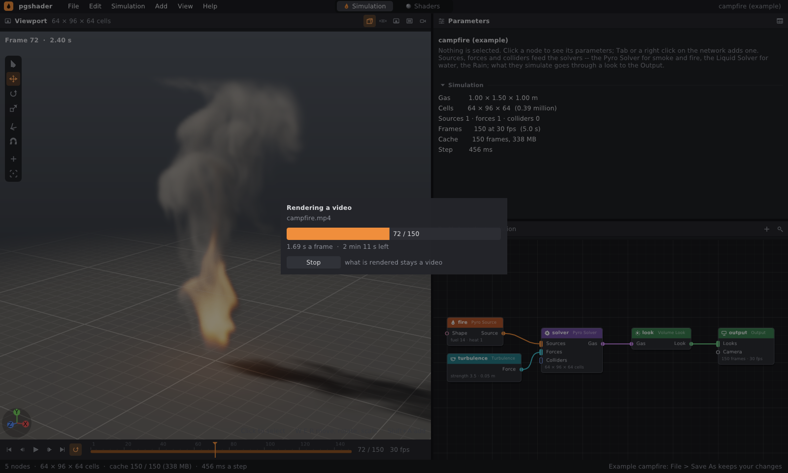
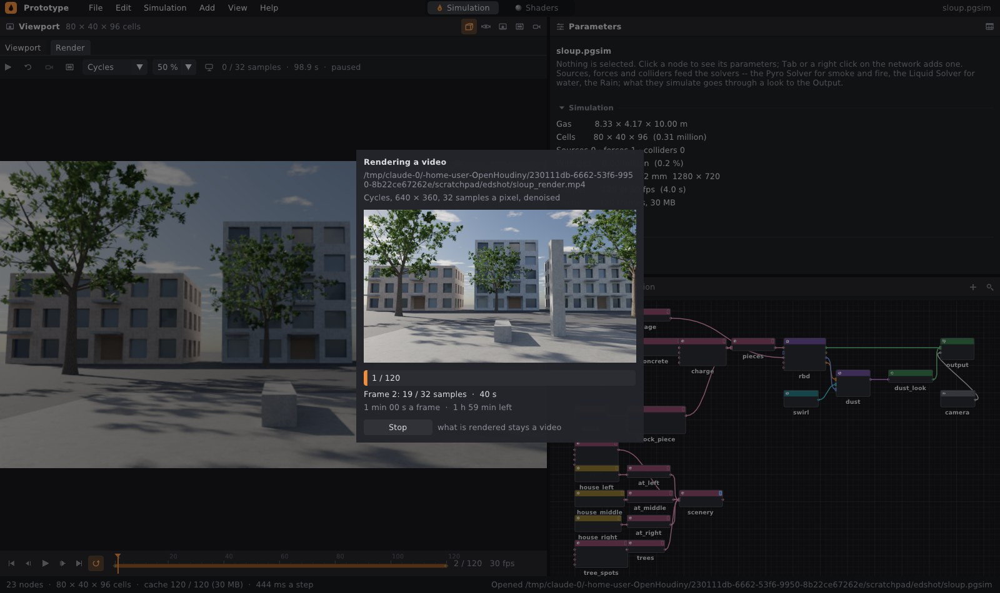

# Images and video

A shot goes out as a PNG image, as a numbered PNG sequence, or straight
to **video**: the program writes `.avi` (Motion JPEG) on its own, with
nothing else required; it writes `.mp4`, `.mov`, `.mkv` (H.264), `.webm` (VP9) and `.gif` through
**ffmpeg** when it is installed. The editor and the command line can both do this,
for simulations as well as for shader previews. For compositing, a frame goes to **EXR**:
in linear light and with passes — depth, motion vectors and masks
([§4](#4-exr-for-compositing)). Proper ray-traced rendering
lives in the **Render** tab: Cycles from Blender (`--renderer cycles`, see
[cycles.md](cycles.md)) or the built-in path tracer (`--renderer path`, see
[pathtracer.md](pathtracer.md)).



## 1. Quick start

```bash
./build/prototype sim campfire fire.mp4             # whole shot to video (H.264 via ffmpeg)
./build/prototype sim campfire fire.avi             # the same without ffmpeg: Motion JPEG
./build/prototype sim lakeside shot.mp4 --every 2   # every second frame, 15 fps
./build/prototype sim campfire fire.png             # last frame as PNG
./build/prototype sim wall_collapse zed.exr --every 1   # every frame as EXR with passes
./build/prototype render examples/shaders/fire.pgsg fire.mp4 --frames 90   # animated shader
```

In the editor:

| action | where |
|---|---|
| on-screen frame as PNG | **File › Render Image…**, or the camera icon in the viewport header |
| on-screen frame as EXR with passes | **File › Render Image…**, extension `.exr` |
| all frames as PNG | **File › Render Frames…** (folder) |
| whole shot as video | **File › Render Video…**, or the film icon in the viewport header |
| whole shot from Cycles (path tracer) as video | **File › Render Video with Cycles…**, or the film icon in the **Render** tab › **Video…** |
| all frames from Cycles as PNG | **File › Render Frames with Cycles…**, or the film icon in the **Render** tab › **Frames (PNG)…** |
| animated shader preview | in the Shaders network, **File › Save Preview Video…** (5 s, 720 × 720) |

The render goes through the camera if the network has one connected to the Output, at the resolution of its
image; otherwise through the viewport view at the viewport's size. The image is always
anti-aliased: it is drawn at twice the resolution and scaled down.

Render Frames and Render Video draw the frames as the viewport shows them
(OpenGL, fast). The **with Cycles** items instead render them
with ray tracing using the Render tab's renderer, Cycles or the path tracer
([below](#rendering-video-through-cycles)).

## 2. Rendering sequences and video in the editor

Render Frames and Render Video draw frame by frame **in the background of the window**:
the editor does not freeze, the window shows how much is done, how long a frame takes and how much
remains, and **Stop** (or Esc) ends the render. Whatever finished stays: the video is
finalised and can be played, the PNG frames remain in the folder.

- The whole shot is rendered, from frame 1 to the last one according to the Output.
  The render waits for frames the simulation has not computed yet ("Waiting for the
  simulation to reach frame 41…") — a video can be started right after opening the
  scene.
- Each frame is drawn as the viewport would show it at that frame:
  objects and looks animated by keys, the displayed geometry (for example points
  from Liquid Points) of that frame, the camera view of that frame. Without guides,
  gizmos and selection highlighting.
- When the simulation stops earlier (full cache, frames loaded from disk
  run out), the render ends there and says why.
- When finished, the viewport shows a **notification**: what was written and where, with
  **Open** (opens the file in the program the system has for it) and **Show**
  (opens the folder) buttons. For a long render, the notification stays until it is closed.
  The same appears in the status bar and in the terminal (`prototype: Rendered 150
  frames into fire.mp4 …`).
- The dialog offers the folder the last render went to; otherwise the network's folder, otherwise
  the current folder — and when that is not writable (a program launched
  from the desktop environment's menu usually runs in `/`), the home folder.

### Rendering video through Cycles

**File › Render Video with Cycles…** (and **Render Frames with Cycles…**)
renders each frame of the shot the way the Render tab renders it,
only all the way to the end:

- The **renderer** is the one selected in the Render tab: Cycles or the path
  tracer (the menu items are named "with the Path Tracer" accordingly).
- **Samples, denoising and look** come from the Output node, Render section, the same
  as `prototype sim … --renderer cycles`. Each frame has its own
  Cycles session through to the end, so the image is the same as from the command
  line.
- The **size** is the camera image (without a camera, the viewport's) times the scale of the
  Render tab (25 / 50 / 100 %). A quick test video is therefore
  50 % and a few samples, the final one 100 %.
- **Camera:** the shot goes through the Output camera if the network has one, including
  camera motion blur.
- The render runs on **its own thread**. The progress window shows the last
  finished frame, what is happening right now ("Frame 41: 12 / 32 samples · 18 s",
  "Cycles gets the scene ready…"), how long a frame takes and how much remains.
  **Stop** (or Esc) also stops the frame currently being rendered. Whatever
  finished stays: the video is finalised, the PNG frames remain in the folder.
- Meanwhile the **Render tab** shows the finished frames of the render and pauses its own
  render (the processor belongs to the render). It resumes when the render is done.
- The render waits for frames the simulation has not computed yet, just as
  with video from the viewport. For the displayed geometry of a frame (trees, houses,
  points from Liquid Points…) it waits until it has cooked.

The same from the command line:

```bash
./build/prototype sim muj.pgsim zaber.mp4 --renderer cycles                # samples from the Output
./build/prototype sim muj.pgsim snimky/f.png --every 1 --renderer cycles   # numbered PNGs
```

On four cores a 1280 × 720 frame with 16 samples, gas and trees takes
about a minute: two seconds of video are roughly an hour.



## 3. Video formats

| extension | codec | what is needed |
|---|---|---|
| `.avi` | Motion JPEG, quality 90, every frame a keyframe | nothing — the JPEG encoder and the AVI container are built into the program |
| `.mp4` `.mov` `.mkv` | H.264 (libx264, CRF 18, yuv420p); without libx264, OpenH264 or MPEG-4 part 2 | ffmpeg |
| `.webm` | VP9 (CRF 28), without it VP8 | ffmpeg with libvpx |
| `.gif` | palette computed from the shot, sierra2_4a dithering, loops | ffmpeg |

- ffmpeg is looked up on `PATH`; the **`PG_FFMPEG`** variable can point elsewhere
  (`PG_FFMPEG=/opt/ffmpeg/bin/ffmpeg`). Without ffmpeg the dialog offers only `.avi`,
  and the command line says for `.mp4` that it needs it.
- H.264 and VP9 require even dimensions: an odd row or column is padded by
  repeating the last one. AVI keeps the size as is.
- The frame rate is the one from the Output (30 fps); `--every K` divides it by K so that
  the video plays in real time. Non-integer rates are written as a fraction
  (29.97 → 2997/100).
- AVI has a 2 GB limit (32-bit RIFF); for longer videos use `.mp4`.

Verified: ffmpeg 6.1 decodes AVI as well as MP4/WebM, the frames come back in their places
and close to the original (test `videos_decode_to_what_went_in_where_ffmpeg_is`);
the JPEG has a PSNR of 44.6 dB on a real render and the same figure as the JPEG encoder
in ffmpeg on a synthetic image with sharp edges (26.0 dB).

## 4. EXR for compositing

`prototype sim SHOT OUT.exr` writes frames to OpenEXR (with `--every K` every
K-th one as `OUT_0001.exr`…, with `--start` and `--end` only part of the shot). The writer
is our own, with no library; the OpenEXR 3.5 library reads the files channel by channel
identically, 32-bit ones bit for bit.

| channel | what it contains |
|---|---|
| `R`, `G`, `B`, `A` | the image in **linear light** (half float): exposure yes, tone curve and gamma no, so a bright sky and dust against the sun go above 1. `A` is 1 — the image is complete, with the background |
| `Z` | depth of the nearest surface along the view axis, in meters (float); where there is no surface (sky), infinity |
| `forward.u`, `forward.v` | **motion vectors**: how many pixels a point moves by the next frame, right and up (as in Nuke). Pieces and displayed geometry according to the velocity `v` of their points, everything according to camera motion |
| `mask.floor`, `mask.geometry`, `mask.pieces`, `mask.objects`, `mask.water` | how much of the pixel is floor, displayed geometry, RBD pieces, objects, water: coverage from 2 × 2 anti-aliasing |
| `mask.smoke` | how much of what lies behind the smoke the smoke covers: its opacity |

When the camera has a **plate** (the shot's footage), `R`, `G`, `B` hold only the CG, and `A`
says how much of the pixel it covers. The `catcher.R/G/B` channels then say what to
multiply the plate by where the CG casts a shadow on it or fire lights it. The shot is
`plate × catcher × (1 − A) + RGB` ([plate.md](plate.md#4-exr-for-compositing-over-the-plate)).
EXR from Cycles and from the path tracer provides the same channels
([plate.md](plate.md#in-the-final-render-cycles-and-the-path-tracer)).

How it is computed: in pass mode the renderer draws into 16-bit floats
and, beside the image, into two more targets (MRT). Surfaces are first rasterized
into a G-buffer, and each triangle corner gets its position now and in the next
frame (the point moved by `v` × frame duration, projected by the next
frame's camera). The per-pixel difference is the motion vector. The main pass then writes,
alongside the image, the depth, the smoke opacity and what surface is in the pixel.
The floor, objects, water and sky are moved only by the camera. Debris and rain are
in the image, but not in the depth, masks and motion.

Verified: a camera moving right shifts a static scene to the left
(`forward.u` −0.64 px), a camera moving up shifts it down (`forward.v` −0.59 px, nearby
floor −3 px); the image without passes is pixel for pixel the same as before.

## 5. Command line

```
prototype sim    NETWORK|EXAMPLE OUT.png|OUT.mp4|- [--frames N] [--every K] ...
prototype render GRAPH.pgsg OUT.png|OUT.mp4 [--frames N] [--time S] [--size N] ...
```

- `sim` to video gives every frame of the shot (with `--every K` every K-th), to PNG
  only the last one (with `--every K` a numbered sequence). The video is opened before
  the simulation starts: a missing ffmpeg is reported immediately, not after minutes.
- `render` to video: `--frames` preview frames (default 90) at 1/30 s from
  `--time`, for example a fire or smoke loop.
- A network without a simulation, with only displayed geometry, is drawn through the
  Output camera over all of its frames when the Output has one: layout, previz, or a
  plate shot from a set ([plate.md](plate.md#6-rendering-geometry-only)).
  Without a camera it is a single image from a view of the geometry.
- The output says how many frames were written and with which codec, and what was used to draw:

```
$ prototype sim campfire fire.mp4 --frames 60
wrote fire.mp4 (60 frames at 30 fps, H.264 (ffmpeg)): campfire, gas 64 x 96 x 64 cells, 60 frames (2.0 s); simulation 67.1 ms/frame, rendering 395 ms/image through EGL
```

### What draws without a window

The commands do not need a window. They look for an OpenGL context in this order:

1. **EGL without a display** — Mesa surfaceless (even without a GPU, llvmpipe), then
   each GPU device separately (the NVIDIA driver path without X), then the default
   display;
2. **hidden GLFW window** — in a build with the editor, when EGL gives nothing and a display
   is available.

When nothing works, the error lists what each method said, for example:

```
sim: no OpenGL context to draw with -- EGL: no EGL context without a window
(surfaceless: does not start (EGL error 0x3001); device 0: ...); a hidden window: X11: Failed to open display
```

`-` instead of an image name skips drawing entirely (only cache and export,
see [cache.md](cache.md)).

## 6. When the image "does not save"

- Look at the notification in the viewport or at the terminal: success prints
  the full path (`prototype: rendered /home/…/campfire.png (875 x 828)`),
  failure prints the reason — it cannot be written, and why (e.g. `Permission denied`). When
  the driver reports an OpenGL error while drawing, the image is saved anyway and the
  message appends the error (`OpenGL reported error 0x…`).
- **Show** in the notification opens the folder the file went to.
- Missing folders in the path are created; you can also type `~/…` in the dialog.
- Render Frames into an existing folder: open it (double-click) and **Choose**
  without a name, or click it once and Choose.

## 7. In the code

| file | what it does |
|---|---|
| `src/pg/io/Jpeg.h` | `encodeJpeg`, `writeJpeg`: baseline JPEG, 4:2:0, standard tables |
| `src/pg/io/Video.h` | `openVideo` → `VideoWriter` (`add`, `finish`): AVI on its own, everything else piped to ffmpeg; `videoExtensions`, `ffmpegAvailable`, `frameRate` |
| `tools/prototype/Offscreen.h` | windowless context for `render` and `sim`: EGL, or a hidden GLFW window |
| `tools/prototype/RenderJob.h` | frame-by-frame render in the editor's background, window with progress, last frame and Stop |
| `tools/prototype/FrameRender.h` | a shot frame rendered to the end through Cycles or the path tracer on its own thread (Render Video with Cycles) |
| `tests/test_video.cpp` | 5 tests: JPEG segments, AVI structure and index, frame-rate fractions, errors, decoding through ffmpeg |
| `src/pg/io/Exr.h` | `formatExr`, `writeExr`: OpenEXR 2, scanlines, half and float, RLE as in OpenEXR, string and matrix attributes |
| `src/pg/gl/Volume.h` | `VolumeRenderer::passes`, `readPasses`, `writePassesExr`: passes and writing them |
| `tests/test_exr.cpp` | 3 tests: header and scanlines per the OpenEXR layout and values back via our own RLE reader, runs shrink and noise stays, errors |

## 8. Limitations

- EXR is compressed only with RLE: masks and sky shrink a lot, image,
  depth and motion little — 1280 × 720 is about 15 MB. No ZIP (deflate) yet.
- EXR sequences only from the command line; the editor writes a single frame to EXR
  (Render Image).
- Smoke has no motion vectors or depth: the passes cover only surfaces.
- No Cryptomatte: masks are per surface kind, not per object.

- Motion JPEG is large (every frame complete): roughly ten times more than H.264.
- No audio.
- Transparency (alpha) is not written to video.
