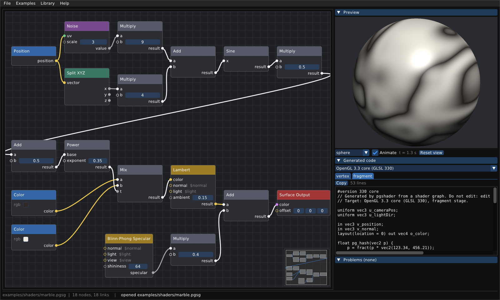
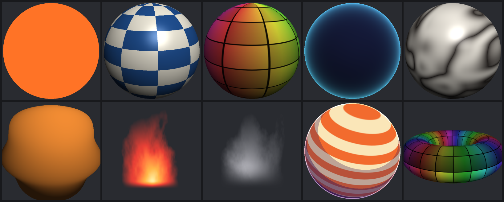
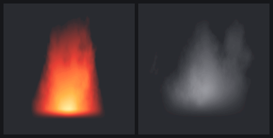
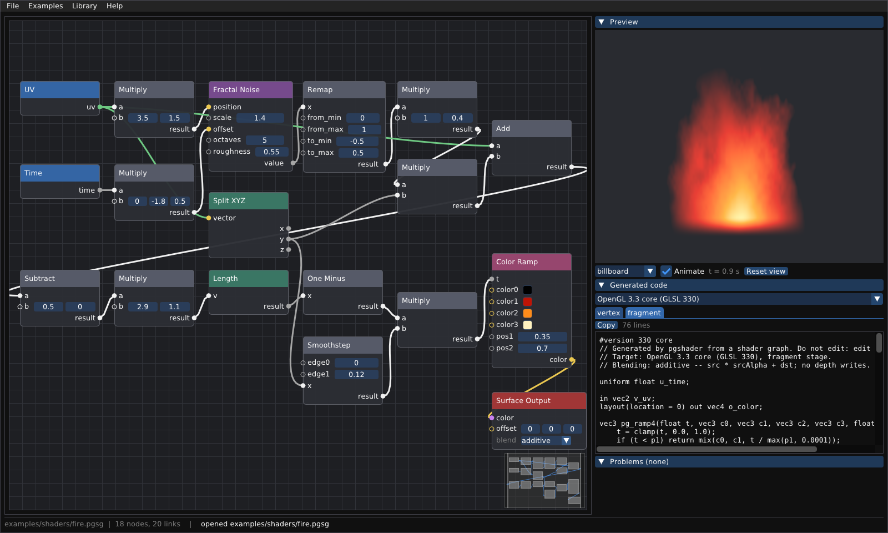
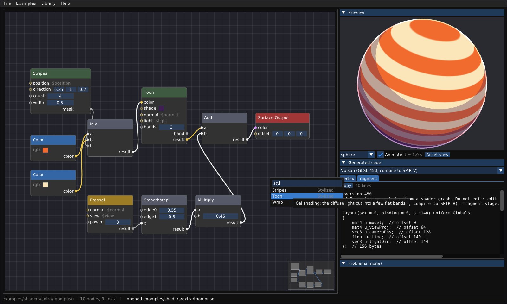

# Node editor shaderů

Graf uzlů, ze kterého vzniká zdrojový kód shaderu pro **OpenGL 3.3**, **OpenGL ES
3.0 / WebGL 2**, **Vulkan** (GLSL 450 → SPIR-V) a **Direct3D 11/12** (HLSL).
Je to síť vlastního typu vedle geometrie, podobně jako VOPy v Houdini, Shader
Editor v Blenderu nebo Shader Graph v Unity.



Hlavní požadavek byl, aby šel systém **rozšiřovat bez zásahu do C++**:

- **uzly jsou text**, ne kód: vestavěné i vlastní se píší ve stejném formátu `.pgnodes`;
- **jazyky jsou třídy**: nový cíl je jedna třída zaregistrovaná v `TargetRegistry`;
- **knihovny se načítají za běhu**: `--library`, menu Library, Ctrl+R;
- **editor se staví z definic**: menu, piny i widgety vznikají z knihovny, žádný uzel není v editoru napsaný natvrdo.

Z běžných uzlů se dají poskládat i animované efekty, třeba oheň a kouř (§6).

Obsah:
[1. Rychlý start](#1-rychlý-start) ·
[2. Ovládání](#2-ovládání-editoru) ·
[3. Jak to funguje](#3-jak-to-funguje) ·
[4. Typy](#4-typy) ·
[5. Cíle](#5-cíle-a-čím-se-liší) ·
[6. Oheň a kouř](#6-efekty-oheň-a-kouř) ·
[7. Rozšiřitelnost](#7-rozšiřitelnost) ·
[8. Ověřování](#8-ověřování) ·
[9. Co je potřeba znát](#9-co-je-potřeba-znát) ·
[10. Cvičení](#10-cvičení) ·
[11. Omezení](#11-omezení) ·
[12. Odkazy](#12-odkazy)

---

## 1. Rychlý start

Jádro shader grafu a CLI nástroj `pgshader` nemají žádné závislosti, stejně jako
zbytek projektu:

```bash
cmake -S . -B build && cmake --build build
./build/pgshader list                                      # uzly a cíle
./build/pgshader gen examples/shaders/marble.pgsg --target all -o out/
./build/pgshader render examples/shaders/marble.pgsg marble.png   # bez okna, přes EGL
```

Editor `pgshadered` je volitelný. Stáhne si Dear ImGui a imnodes, a pokud
v systému není GLFW 3.3+, tak i GLFW:

```bash
sudo apt install libglfw3-dev            # volitelné, jinak se GLFW postaví ze zdrojů
cmake -S . -B build -DPG_BUILD_SHADER_EDITOR=ON && cmake --build build
./build/pgshadered examples/shaders/marble.pgsg
```

- Editor potřebuje OpenGL 3.3.
- Bez sítě nasměrujte `FETCHCONTENT_SOURCE_DIR_IMGUI`, `…_IMNODES` a
  `…_GLFW` na lokální kopie.
- GLFW ze zdrojů chce na Linuxu vývojové balíčky X11 (`libxrandr-dev
  libxinerama-dev libxcursor-dev libxi-dev`). Wayland se přidá, jen když je
  k dispozici `wayland-scanner`.

Příklady jsou v [`examples/shaders/`](../examples/shaders/). Podsložka
[`extra/`](../examples/shaders/extra/) obsahuje ukázkovou uživatelskou knihovnu
a graf, který ji používá.



## 2. Ovládání editoru

| Co | Jak |
|---|---|
| Přidat uzel | pravé tlačítko na plátně → psát (hledá v názvu i kategorii, Enter vezme první) nebo vybrat z kategorií |
| Přidat uzel rovnou zapojený | táhnout z pinu do prázdna; nový uzel se napojí prvním vhodným portem |
| Spojit | táhnout z výstupu na vstup; vstup má nejvýš jeden spoj, nový nahradí starý |
| Odpojit | Ctrl + kliknout na konec spoje a odtáhnout |
| Smazat | vybrat (klik, obdélník), Delete |
| Posun plátna | prostřední tlačítko, nebo Alt + levé |
| Zarámovat graf | F nebo Home (děje se i při otevření) |
| Náhled | tažení otáčí, kolečko přibližuje; volba tělesa (billboard pro efekty), Animate, Reset view |
| Uniformy | panel Uniforms mění hodnotu v běžícím shaderu, bez rekompilace |
| Kód | výběr cíle, záložky vertex/fragment, Copy |
| Chyby | panel Problems; klik vybere uzel a posune na něj plátno |
| Soubor | Ctrl+S, Ctrl+O, File → Export shaders… (všechny cíle naráz) |
| Knihovny | Library → Add library file…, Ctrl+R je znovu načte |

- Nezapojený vstup má widget přímo v uzlu: číslo, vektor nebo barvu.
- Vstup, který bez spoje čte globální hodnotu, ukazuje místo widgetu
  `$normal`, `$uv` atd.
- Spoj, který nesedí typem nebo by uzavřel smyčku, se odmítne a stavový řádek
  řekne proč.
- Uzel s chybou má červený rámeček.
- Titulek okna ukazuje jméno souboru, hvězdička značí neuložené změny.

## 3. Jak to funguje

Systém má tři části a každá ví jen to svoje:

```
 builtin.pgnodes ─┐
 moje.pgnodes ────┴─► NodeLibrary ──┐   co uzly znamenají
                                    ├─► generate() ──► Target ──► soubory
 graf.pgsg ─────────► ShaderGraph ──┘   co uživatel postavil      jak se to píše
```

- **NodeLibrary** ([NodeLibrary.h](../src/pg/shader/NodeLibrary.h)) drží
  definice uzlů, načtené z textu. C++ zná typy, šablony a fáze, ale co znamená
  `mix` nebo `lambert`, stojí v souboru `.pgnodes`.
- **ShaderGraph** ([ShaderGraph.h](../src/pg/shader/ShaderGraph.h)) drží
  instance uzlů, hodnoty a spoje. Neví, co uzly znamenají, takže se načte i bez
  knihovny; neznámý typ uzlu nahlásí až generátor.
- **Generator** ([Generator.h](../src/pg/shader/Generator.h)) zjistí, *co*
  shader počítá, v pěti krocích:
  1. Najde výstupní uzel. Jeho vstupy jsou kořeny fází: `color` se počítá pro
     každý pixel (fragment), `offset` pro každý vrchol (vertex).
  2. Projde graf proti směru spojů (DFS). Kompiluje se jen to, co do výstupu
     vede; ostatní uzly nestojí nic.
  3. Vyřeší typy v pořadí závislostí: port `any` dostane nejširší připojený
     typ a každý spoj se převede na typ vstupu.
  4. Rozvine šablony uzlů na příkazy, jednu proměnnou na výstup
     (`vec3 n4_color = …`). Jména vznikají z id uzlů, takže stejný graf dá
     vždy stejný text.
  5. Předá výsledek (`Assembly`) cíli.
- **Target** ([Target.h](../src/pg/shader/Target.h)) rozhodne, *jak* se to
  napíše: jména typů a funkcí, deklarace uniforem, vstupy a výstupy fází,
  vstupní body.

Takhle vypadá příklad `rim_light`: tmavý podklad s Lambertovým osvětlením
a fresnelovský okraj v barvě, kterou může aplikace měnit. Soubor grafu
(`.pgsg`) je prostý text s jedním faktem na řádek a stabilním pořadím, takže
se dobře diffuje v gitu:

```
pgshadergraph 1
node 1 color 1 40 40
  param rgb 0.08 0.1 0.22
node 2 lambert 1 300 40
node 3 fresnel 1 40 240
  in power 2.5
node 4 color_parameter 1 40 420
  param name rim
  param default 0.35 0.85 1.0
node 5 multiply 1 320 320
node 6 add 1 560 140
node 7 surface_output 1 780 140
link 1.color -> 2.color
link 3.result -> 5.a
link 4.color -> 5.b
link 2.result -> 6.a
link 5.result -> 6.b
link 6.result -> 7.color
```

Tělo fragment shaderu (GLSL 330), které z něj vznikne. Každý řádek odpovídá
jednomu výstupu jednoho uzlu:

```glsl
void main()
{
    vec3 g_normal = normalize(v_normal);
    vec3 g_view = normalize(u_cameraPos - v_position);
    vec3 g_light = normalize(u_lightDir);
    vec3 n1_color = vec3(0.08, 0.1, 0.22);
    vec3 n2_result = n1_color * (0.15 + (1.0 - 0.15) * max(dot(normalize(g_normal), normalize(g_light)), 0.0));
    float n3_result = pow(1.0 - clamp(dot(normalize(g_normal), normalize(g_view)), 0.0, 1.0), 2.5);
    vec3 n4_color = u_rim;
    vec3 n5_result = vec3(n3_result) * n4_color;
    vec3 n6_result = n2_result + n5_result;
    o_color = vec4(n6_result, 1.0);
}
```

Všimněte si tří věcí:

- `n5_result`: `multiply` s `any` vstupy dostal float a vec3, takže se typ
  vyřešil na vec3 a float se rozkopíroval (`vec3(n3_result)`).
- `g_normal` a `g_view` jsou globály, které uzly čtou jako `$normal` a `$view`.
  Generátor je spočítá jen tehdy, když je někdo čte, a pošle z vertex fáze jen
  ty varyingy, které fragment potřebuje.
- `u_rim` je uniforma z uzlu Color Parameter, kterou může aplikace měnit bez
  rekompilace; v editoru ji mění panel Uniforms.

## 4. Typy

| Typ | Složek | Pin | Poznámka |
|---|---|---|---|
| `float` | 1 | šedý | |
| `vec2` | 2 | zelený | UV |
| `vec3` | 3 | žlutý | pozice, normály, barvy |
| `vec4` | 4 | fialový | barva s alfou, výstup |
| `sampler2D` | – | modrý | textura; deklaruje ji uzel přes `uniform` |
| `any` | podle zapojení | bílý | nejširší připojený typ |

Převody na spoji:

- skalár → vektor se rozkopíruje (`vec3(x)`);
- delší vektor → kratší se ořízne swizzlem (`.xy`);
- kratší vektor → delší se doplní nulami, jen složka `w` dostane 1, takže barva
  vec3 zapojená do vec4 je neprůhledná.

Převody se řeší jednou pro všechny cíle ve třídě `Target` (`convert`,
`splat`, `construct`); uzly se o ně nestarají.

## 5. Cíle a čím se liší

```
$ pgshader list
targets
  glsl330    OpenGL 3.3 core (GLSL 330)
  gles300    OpenGL ES 3.0 / WebGL 2 (GLSL ES 300)
  vulkan     Vulkan (GLSL 450, compile to SPIR-V)
  hlsl       Direct3D 11/12 (HLSL, shader model 5)
```

| | `glsl330` | `gles300` | `vulkan` | `hlsl` |
|---|---|---|---|---|
| Hlavička | `#version 330 core` | `#version 300 es` + `precision highp float;` | `#version 450` | – |
| Uniformy | volné `uniform` | volné `uniform` | jeden blok `std140` `Globals` (set 0, binding 0) s offsety | `cbuffer Globals : register(b0)` |
| Textury | `uniform sampler2D` | `uniform sampler2D` | `layout(set = 0, binding = 1+i) uniform sampler2D` | `Texture2D` + `SamplerState` na `register(t<i>)`, `register(s<i>)` |
| Mezi fázemi | `in`/`out` podle jména | `in`/`out` podle jména | `layout(location = N)` na obou stranách | struktury se sémantikami `TEXCOORDn` |
| Vstupní body | `main`, `main` | `main`, `main` | `main`, `main` | `vs_main`, `ps_main` |
| Soubory | `.vert` `.frag` | `.vert` `.frag` | `.vert` `.frag` → SPIR-V | jeden `.hlsl` |

Proč se liší:

- **GLSL ES** nemá ve fragment shaderu výchozí přesnost pro `float`, takže ji
  musí deklarovat. Jinak je to GLSL 330.
- **Vulkan** nezná volné číselné uniformy. Všechno, co není textura, musí být
  v bloku s pevným rozložením paměti, a aplikace ten blok plní jako buffer.
  Pravidla std140 zarovnávají `vec3` na 16 bajtů, proto generátor píše offsety
  do komentářů:

  ```glsl
  layout(set = 0, binding = 0, std140) uniform Globals
  {
      mat4 u_model;  // offset 0
      mat4 u_viewProj;  // offset 64
      vec3 u_cameraPos;  // offset 128
      float u_time;  // offset 140
      vec3 u_lightDir;  // offset 144
      vec3 u_rim;  // offset 160
  };  // 172 bytes
  ```

  Rozhraní mezi fázemi se ve Vulkanu páruje podle `location`, ne podle jména.
  Každý varying má pevné číslo (pozice 0, normála 1, UV 2), takže obě fáze
  souhlasí, i když některý varying chybí.
- **HLSL** je jiný jazyk:
  - typy a funkce mají jiná jména (`float3`, `lerp`, `frac`, `fmod`, `rsqrt`,
    `ddx`/`ddy`);
  - matice se násobí přes `mul()`;
  - textura a sampler jsou dva objekty, takže `texture(u_albedo, uv)` se píše
    jako `u_albedo.Sample(u_albedo_sampler, uv)`;
  - vstupy a výstupy fází jsou struktury se sémantikami (`POSITION`,
    `SV_Position`, `TEXCOORD0`…).

  Přejmenování dělá `translate()` po celých identifikátorech. Čísla,
  komentáře ani členy za tečkou (`v.mix`) nemění.

Kde nestačí přejmenovat, dostane uzel pro konkrétní cíl vlastní šablonu (§7.1).
Vestavěný uzel `texture` to dělá právě kvůli HLSL.

## 6. Efekty: oheň a kouř



Oheň i kouř jsou obyčejné grafy z vestavěných uzlů, žádný zvláštní kód. Jsou to
procedurální efekty: tvar i pohyb počítá shader na jedné ploše ze šumu a času.
Nejde o simulaci proudění, jakou dělá Pyro v Houdini; ta by patřila do
geometrického jádra, ne do shaderů.



Recept má tři části
([`examples/shaders/fire.pgsg`](../examples/shaders/fire.pgsg)):

1. **Pohyb.** Do vstupu `offset` uzlu Fractal Noise vede čas vynásobený
   vektorem (0, −1.8, 0.5): šum stoupá vzhůru a zároveň se přelévá. UV jsou
   předtím natažené svisle (× 3.5, 1.5), takže vznikají protáhlé jazyky.
2. **Tvar.** Kopule nad spodní hranou, `1 − délka((UV − (0.5, 0)) × (2.9, 1.1))`.
   Než se délka spočítá, šum posune UV do stran; posun se násobí výškou `v`,
   takže základna je klidná a nahoře jazyky kmitají. Smoothstep dole změkčí
   hranu.
3. **Barva.** Color Ramp převede výsledek na barvu: černá → červená →
   oranžová → světle žlutá. Černá se při aditivním prolínání neprojeví.

Kouř ([`examples/shaders/smoke.pgsg`](../examples/shaders/smoke.pgsg)) je
stejný recept: pomalejší, s širším vlněním, šedou barvou a hustotou v alfě.
Zkuste v editoru změnit barvy v Color Ramp ohně na modré: vznikne plamen
plynového hořáku.

### Prolínání

Výstupní uzel má výběrový parametr `blend`:

| Režim | Co dělá | Na co |
|---|---|---|
| `opaque` | nahradí pixel a zapíše hloubku | pevné materiály (výchozí) |
| `alpha` | barva × alfa + pozadí × (1 − alfa), bez zápisu hloubky | kouř, sklo, mlha |
| `additive` | barva × alfa + pozadí; černá nepřidá nic | oheň, záře, jiskry |

Prolínání není kód shaderu, ale stav renderu. Generátor ho vrací
v `GeneratedShader::blend` a píše ho do hlavičky každého souboru
(`// Blending: additive -- …`), aby ho aplikace mohla nastavit. Náhled ho
nastaví sám.

### Billboard

Efekty se kreslí na **billboard**: svislý čtverec, který se natáčí ke kameře
jen kolem svislé osy, aby plamen mířil vzhůru. UV jdou zleva doprava a zdola
nahoru. Editor ho vybere sám, když otevřete graf, který prolíná; totéž dělá
`pgshader render`.

### Uzly pro efekty

| Uzel | K čemu |
|---|---|
| Fractal Noise | 3D šum v několika oktávách, 0 až 1; animuje se přes `offset` |
| Color Ramp | hodnota 0–1 na čtyři barvy; polohy prostředních dvou jsou vstupy |
| Remap | přemapuje interval, třeba šum 0..1 na −0.5..0.5 |
| Color + Alpha | spojí barvu a průhlednost do vec4 pro výstup |

Výběrový parametr jako `blend` může mít i uzel ve vlastní knihovně. Editor
z něj udělá rozbalovací seznam:

```
param blend enum opaque alpha additive = opaque
```

## 7. Rozšiřitelnost

### 7.1 Nový uzel = pár řádků textu

Celá definice uzlu Toon z ukázkové knihovny
[`examples/shaders/extra/stylized.pgnodes`](../examples/shaders/extra/stylized.pgnodes):

```
node toon
    label Toon
    category Stylized
    description Cel shading: the diffuse light cut into a few flat bands.
    in color vec3 = 0.95 0.55 0.3 color
    in shade vec3 = 0.22 0.12 0.25 color
    in normal vec3 = $normal
    in light vec3 = $light
    in bands float = 3.0
    out band float = ceil(max(dot(normalize({normal}), normalize({light})), 0.0) * {bands}) / {bands}
    out result vec3 = mix({shade}, {color}, {band})
```

Po načtení knihovny se objeví v menu editoru pod kategorií *Stylized*
a funguje ve všech čtyřech jazycích:



Řádky definice:

| Řádek | Význam |
|---|---|
| `node <jméno>` | začátek definice; jméno se píše do souborů grafu |
| `label`, `category`, `description` | co ukáže editor: titulek, menu, tooltip |
| `version <n>` | verze typu uzlu; ukládá se do grafu kvůli budoucím migracím |
| `in <jméno> <typ> [= čísla \| = $global] [color] [stage vertex\|fragment]` | vstup, tedy pin; výchozí hodnota; `color` = barevný widget; `stage` jen u výstupního uzlu |
| `param <jméno> <typ\|string> [= hodnota] [color]` | parametr, který nejde zapojit, jen nastavit (třeba jméno uniformy) |
| `param <jméno> enum <volba> <volba>… [= volba]` | výběr z několika jmen; v editoru rozbalovací seznam |
| `uniform <šablona jména> <typ> [= šablona hodnoty]` | uniforma, kterou uzel deklaruje, např. `uniform u_{name} vec3 = {default}` |
| `uses <funkce>…` | pomocné funkce, které šablony volají |
| `out <jméno> <typ> = <šablona>` | výstup; šablona smí číst i dřívější výstupy téhož uzlu |
| `impl <cíl> <výstup> = <šablona>` | jiná šablona pro jeden cíl |
| `kind output` | výstupní uzel grafu; jeho vstupy jsou výstupy fází |

V šablonách se píše kód v neutrálním dialektu, tedy v syntaxi GLSL:

- `{vstup}`, `{param}` a `{dřívější-výstup}` se nahradí výrazem;
- `$position`, `$normal`, `$uv`, `$view`, `$light` a `$time` jsou globály,
  které dodá generátor.

**Pomocné funkce** se píšou jako blok a do shaderu se vloží jednou, jen když je
některý použitý uzel potřebuje. Funkce volané jinou funkcí přijdou dřív než ta,
která je volá:

```
function pg_stripe
float pg_stripe(float x, float width) {
    float d = abs(fract(x) - 0.5) * 2.0;  // 0 in the middle of a stripe, 1 halfway to the next
    return 1.0 - smoothstep(width - 0.04, width + 0.04, d);
}
end
```

Řádek `uses <jiná funkce>` hned za hlavičkou funkce říká, že volá jinou funkci.
`function <jméno> <cíl>` je varianta funkce pro jeden cíl.

**Šablona pro konkrétní cíl** je potřeba tam, kde se jazyky liší víc než jménem.
GLSL `mod` a HLSL `fmod` se liší u záporných čísel, a automatické přejmenování
by tak změnilo výsledek:

```
node wrap
    label Wrap
    category Stylized
    description x modulo y, always between 0 and y -- negative x too.
    in x any = 0.0
    in y any = 1.0
    out result any = mod({x}, {y})
    impl hlsl result = ({x} - {y} * floor({x} / {y}))
```

**Kontrola nové knihovny:** každý výstup každého uzlu se přeloží ve fragment
i vertex fázi a pro každý cíl; u uzlů s `any` navíc i s vektorovými hodnotami:

```bash
./build/pgshader check --library moje.pgnodes --nodes-from moje.pgnodes
```

### 7.2 Knihovny za běhu

- `--library FILE` (lze opakovat) funguje u `pgshader` i `pgshadered`.
- V editoru: Library → Add library file…; po úpravě souboru stačí Ctrl+R.
- Pozdější definice se stejným jménem nahradí dřívější. Vlastní knihovna tak
  může **přepsat i vestavěný uzel**, třeba lepším `noise`.
- Načtení je atomické: chyba kdekoli v souboru znamená, že se nepřidá nic,
  a hláška má tvar `soubor:řádek: co je špatně`.
- Složka s příklady může nést vlastní knihovny. Otevřete-li z menu Examples
  graf ze složky `extra/`, editor načte i `.pgnodes` ze stejné složky.

### 7.3 Nový jazyk = jedna třída

Cíl je potomek `Target`. Přepíše to, čím se jeho jazyk liší, a zaregistruje
se. Kostra pro Metal:

```cpp
#include "pg/shader/Target.h"
using namespace pg::shader;

class MetalTarget : public Target {
public:
    std::string name() const override { return "metal"; }
    std::string description() const override { return "Metal Shading Language 2"; }

    std::string typeName(Type t) const override;               // float3, texture2d<float> ...
    std::string translate(const std::string& code) const override {
        return renameIdentifiers(code, {{"vec2", "float2"}, {"vec3", "float3"},
                                        {"vec4", "float4"}, {"mod", "fmod"}});
    }
    std::vector<ShaderFile> assemble(const Assembly& a) const override {
        // a.uniforms              uniformy grafu (jméno, typ, výchozí hodnota, binding)
        // a.vertex, a.fragment    použité globály, pomocné funkce, příkazy, výsledek
        // a.varyings              co fragment fáze potřebuje z vertex fáze
        std::string text = /* deklarace + vstupní body kolem a.fragment.statements */;
        return {ShaderFile{".metal", text, {{Stage::Vertex, "vs_main"}, {Stage::Fragment, "fs_main"}}}};
    }
};

// jednou při startu:
TargetRegistry::instance().add(std::make_unique<MetalTarget>());
```

Od té chvíle cíl funguje všude:

- `pgshader gen --target metal`;
- výběr cíle v editoru a File → Export shaders;
- každý uzel každé knihovny, pokud `translate()` pokryje jména; kde ne,
  pomůže `impl metal …` v definici uzlu.

Funkční minimální příklad je test `a_new_target_plugs_in_as_one_class`
v [tests/test_shader_graph.cpp](../tests/test_shader_graph.cpp). Jeho třída
`ListingTarget` má čtrnáct řádků.

### 7.4 Editor se staví z definic

Editor ([tools/shader_editor/Editor.cpp](../tools/shader_editor/Editor.cpp))
nezná žádný konkrétní uzel. Všechno bere z `NodeDef`:

- menu tvoří kategorie a popisky;
- barva pinu odpovídá typu;
- widget závisí na typu a nápovědě `color`;
- parametr typu `string` je textové pole a ověřuje se jako identifikátor;
- výchozí globál se ukáže jako `$normal`;
- tooltip je `description`;
- neznámá kategorie dostane neutrální barvu.

Je to možné díky Dear ImGui: immediate-mode GUI kreslí každý snímek celé UI
znovu z dat, takže editor nemá žádný vlastní stav uzlů, který by musel držet
v souladu s knihovnou. Po Ctrl+R je nový uzel v menu hned v příštím snímku.

## 8. Ověřování

`ctest --test-dir build` spouští:

- **pgtests**: 74 testů, z toho 24 pro shader graf;
- **shaders_compile**: každý příklad a každý výstup každého vestavěného uzlu
  v obou fázích (uzly s `any` i s vec3), pro 4 cíle. To je 116 grafů
  a 928 běhů `glslangValidator`. SPIR-V navíc projde `spirv-val` a HLSL se
  překládá HLSL frontendem glslangu (`-D`);
- **shaders_compile_user_library**: totéž pro ukázkovou uživatelskou knihovnu
  (`--nodes-from`).

Kromě testů:

- `pgshader render` vykreslí náhled bez okna přes EGL; obrázky příkladů výše
  jsou z něj.
- Editor umí `--screenshot OUT.png --frames N`. Pod `xvfb-run` se tak dá
  vyzkoušet i na stroji bez displeje.

## 9. Co je potřeba znát

Pro práci na tomhle kódu, ale i pro psaní vlastních uzlů:

- **Grafické API**:
  - co dělá vertex a co fragment shader;
  - rozdíl mezi atributem (per vrchol), varyingem (interpolovaný mezi fázemi)
    a uniformou (konstanta za draw call);
  - souřadné prostory: objekt → svět → clip.
- **Osvětlení** stojí hlavně na skalárních součinech jednotkových vektorů:
  - Lambert: `N·L`;
  - Blinn-Phong: `(N·H)^s`, kde `H` je půlvektor mezi `L` a `V`;
  - Fresnel (Schlickova aproximace): `(1 − N·V)^p`.
- **Kompilátor v malém**:
  - graf je jeden velký výraz a generátor ho převádí na řádky;
  - DFS v post-orderu dává topologické pořadí;
  - co z výstupu není dosažitelné, je mrtvý kód;
  - `any` je nejjednodušší typová inference;
  - jedna proměnná na výstup se chová jako SSA.
- **Rozdíly API**: rozložení std140, deskriptorové sady (set/binding) ve
  Vulkanu, sémantiky a `register()` v HLSL, přesnost v GLSL ES. Nic z toho
  není těžké, jen se to musí vědět.
- **Immediate-mode GUI**: UI není strom objektů, ale funkce, která každý
  snímek kreslí stav. Proto je editor krátký.

Jak o tom přemýšlet: **uzel je šablona výrazu, spoj je dosazení a graf je
výraz**. Generátor dělá totéž, co byste dělali ručně při přepisu grafu do
kódu: odspodu nahoru, každý mezivýsledek do proměnné, a pak ho obalí tím, co
chce konkrétní API.

## 10. Cvičení

Od nejlehčího:

1. Do vlastní knihovny přidejte uzel `posterize` (hodnota zaokrouhlená na
   několik úrovní, `floor(x * n) / n`) a ověřte ho přes
   `pgshader check --nodes-from`.
2. Jiskry k ohni: malé světlé body, které stoupají a hasnou. Náhodné číslo
   pro každou buňku mřížky (jako `pg_hash`), `fract` z času posunutého o
   to číslo a výsledek přičtený k ohni v režimu `additive`.
3. Uzel `triplanar`: textura promítnutá podél tří os a smíchaná podle
   `abs($normal)`. Jsou to tři volání `texture()` a váhy.
4. Uzel s `atan(y, x)`: HLSL tu funkci jmenuje `atan2`, takže je potřeba
   `impl hlsl`.
5. Cíl WGSL pro WebGPU (`vec3<f32>`, `@vertex` a `@fragment`,
   `@group(0) @binding(0)`), jako třída podle §7.3.
6. Undo/redo v editoru. Graf se umí uložit do textu, takže historie může být
   seznam textů.
7. Náhled mezivýsledku: položka „preview this output“, která dočasně zapojí
   vybraný výstup do výstupního uzlu.

## 11. Omezení

Všechna jsou vědomá:

- Jeden výstupní uzel (barva + posun vrcholů), jedno směrové světlo, bez stínů.
- Graf je DAG: bez větvení, cyklů a podgrafů.
- imnodes neumí zoom, jen posun; F graf zarámuje.
- Náhled běží jen přes GLSL 330. Ostatní cíle ověřuje překladač, ne vykreslení.
- Textury v náhledu jsou testovací UV mřížka, načítání obrázků chybí.
- Editor nemá undo/redo a při zavření se neptá na neuložené změny.
- Metal ani WGSL zatím nejsou (viz cvičení).
- Průhledné plochy se neřadí podle vzdálenosti. Na kouli s alfou se přední a
  zadní strana mohou překrýt v nesprávném pořadí; billboard je jedna plocha,
  tam to nevadí.
- Oheň a kouř jsou procedurální efekty, ne simulace proudění.

## 12. Odkazy

**Příbuzné systémy**

- [MaterialX ShaderGen](https://github.com/AcademySoftwareFoundation/MaterialX):
  stejná myšlenka (uzly jako data, generátor pro každý jazyk) v produkční podobě.
- Houdini VOPs, Blender Shader Editor, Unity Shader Graph, Unreal Material
  Editor: vzory pro UI.
- [SPIRV-Cross](https://github.com/KhronosGroup/SPIRV-Cross): opačný přístup,
  jeden zdroj → SPIR-V → převod do ostatních jazyků. Přímé generování, jak ho
  dělá tenhle projekt, dává čitelnější výstup a dovolí uzlu přepsat šablonu
  pro konkrétní jazyk.

**Použité nástroje a knihovny**

- [glslang](https://github.com/KhronosGroup/glslang) (`glslangValidator`) a
  [SPIRV-Tools](https://github.com/KhronosGroup/SPIRV-Tools) (`spirv-val`):
  ověřování.
- [Dear ImGui](https://github.com/ocornut/imgui),
  [imnodes](https://github.com/Nelarius/imnodes), [GLFW](https://www.glfw.org):
  editor.
- Rozložení std140: specifikace OpenGL 4.6, oddíl 7.6.2.2 *Standard Uniform
  Block Layout*.

**Soubory**

```
src/pg/shader/   Types, NodeLibrary + builtin.pgnodes, ShaderGraph, Target, Generator
src/pg/gl/       Gl (vlastní loader), Preview (náhled), Png, HeadlessContext (EGL)
cli/shader_main.cpp          pgshader
tools/shader_editor/         pgshadered
examples/shaders/            příklady, i fire a smoke; extra/ = uživatelská knihovna a graf
tests/test_shader_graph.cpp  testy
docs/shader-nodes.md         referenční přehled vestavěných uzlů (generovaný)
```
