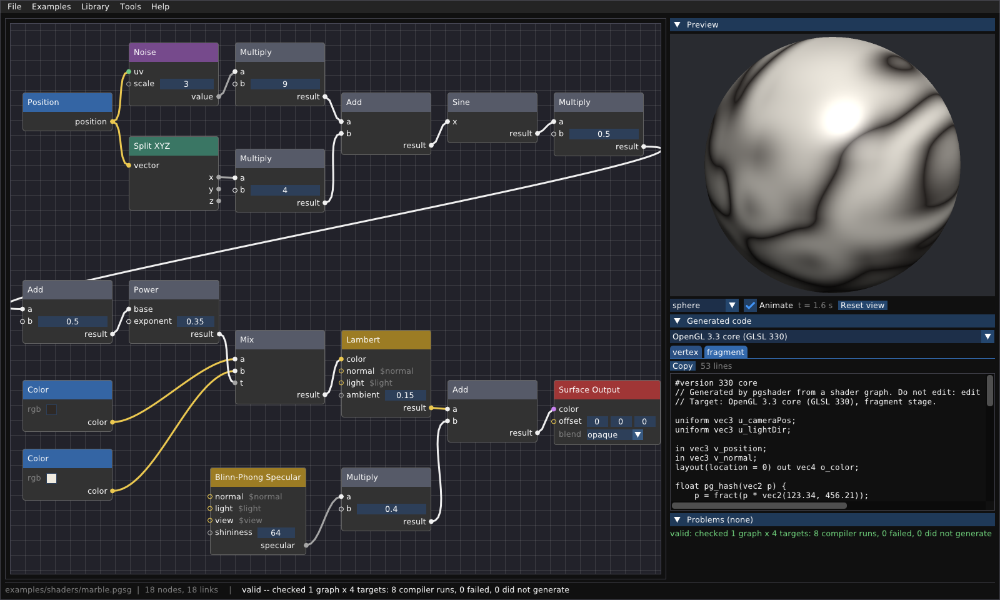
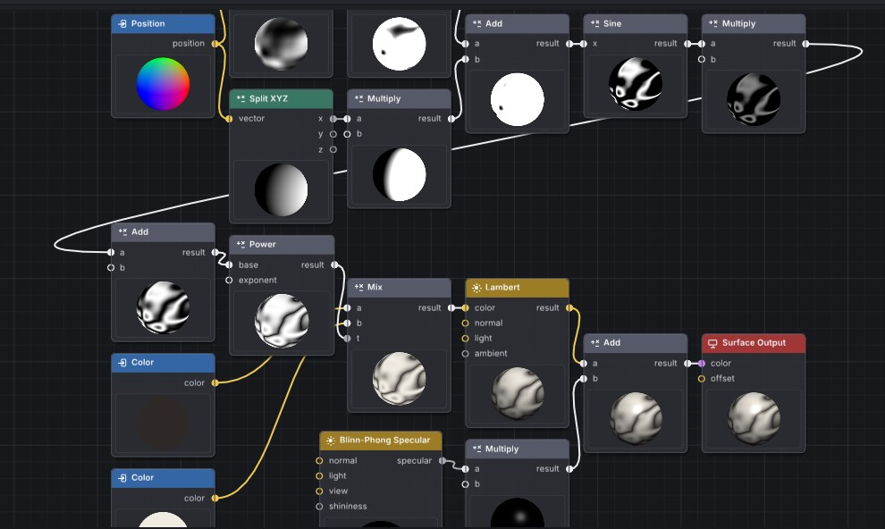
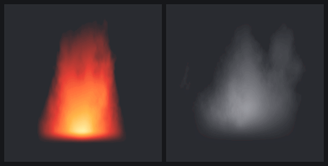
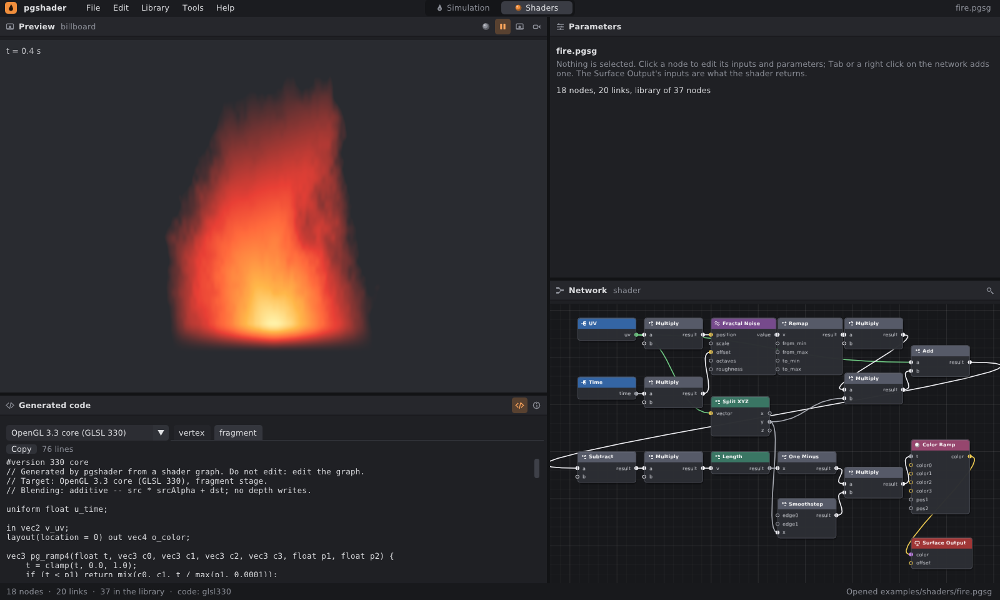
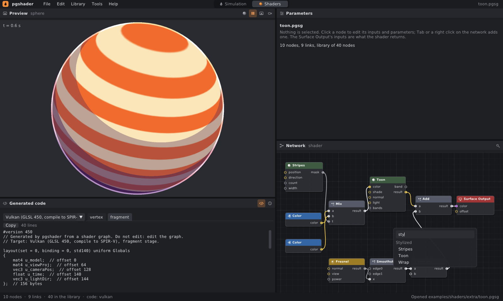

# Shader node editor

A node graph that generates shader source code for **OpenGL 3.3**, **OpenGL ES
3.0 / WebGL 2**, **Vulkan** (GLSL 450 → SPIR-V) and **Direct3D 11/12** (HLSL).
It is a network of its own type alongside the geometry network, similar to VOPs in Houdini, the Shader
Editor in Blender or Shader Graph in Unity.



Everything is a single program, `prototype`. Without a command it opens the editor; with a command
(`list`, `gen`, `check`, `render`) it works on the command line, without a window.
The editor has two networks in the same layout, switched in the middle of the
top bar: **Simulation**, smoke and fire built from nodes ([pyro.md](pyro.md)), and
**Shaders**, which is what this document is about.

The main requirement was that the system can be **extended without touching C++**:

- **nodes are text**, not code: built-in and custom nodes are written in the same `.pgnodes` format;
- **languages are classes**: a new target is one class registered in `TargetRegistry`;
- **libraries load at run time**: `--library`, the Library menu, Ctrl+R;
- **the editor is built from definitions**: menus, pins and widgets all come from the library; no node is hard-coded in the editor.

Ordinary nodes can also be combined into animated effects, such as fire and smoke (§6).

Contents:
[1. Quick start](#1-quick-start) ·
[2. Controls](#2-editor-controls) ·
[3. How it works](#3-how-it-works) ·
[4. Types](#4-types) ·
[5. Targets](#5-targets-and-how-they-differ) ·
[6. Fire and smoke](#6-effects-fire-and-smoke) ·
[7. Extensibility](#7-extensibility) ·
[8. Verification](#8-verification) ·
[9. What you need to know](#9-what-you-need-to-know) ·
[10. Exercises](#10-exercises) ·
[11. Limitations](#11-limitations) ·
[12. References](#12-references)

---

## 1. Quick start

```bash
sudo apt install libglfw3-dev          # optional, otherwise GLFW is built from source
cmake -S . -B build && cmake --build build
./build/prototype --shaders                                 # editor on the Shaders network
./build/prototype examples/shaders/marble.pgsg              # editor with a graph
./build/prototype list                                      # nodes and targets
./build/prototype gen examples/shaders/marble.pgsg --target all -o out/
./build/prototype check examples/shaders/*.pgsg --nodes     # compile with glslangValidator
./build/prototype render examples/shaders/marble.pgsg marble.png   # no window, via EGL
./build/prototype help                                      # all options
```

The default build includes the editor. During configuration it downloads Dear ImGui, and GLFW
if the system does not have GLFW 3.3+. A build without the editor has no
dependencies, like the rest of the project; `prototype` then supports only the commands:

```bash
cmake -S . -B build -DPG_BUILD_GUI=OFF     # servers, CI
```

- The editor needs OpenGL 3.3. Without a display it says the window cannot be opened and
  offers the commands instead.
- Without network access, point `FETCHCONTENT_SOURCE_DIR_IMGUI` and `…_GLFW` at local
  copies.
- Building GLFW from source on Linux requires the X11 development packages (`libxrandr-dev
  libxinerama-dev libxcursor-dev libxi-dev`). Wayland support is added only when
  `wayland-scanner` is available.

The examples are in [`examples/shaders/`](../examples/shaders/). The
[`extra/`](../examples/shaders/extra/) subfolder contains a sample user library
and a graph that uses it.


## 2. Editor controls

The layout is the same as for the simulation: top left is the **preview** (Preview),
below it the **code** and **problems**, top right the **parameters** of the selected node,
bottom right the **network**. The borders between panels can be dragged.

| What | How |
|---|---|
| Add a node | **Tab** or right-click on empty space → type (searches names and categories, Enter takes the first match) or pick from the categories |
| Add a node already connected | drag from a pin into empty space; the new node connects through its first suitable port |
| Connect | drag from an output to an input; an input has at most one connection, and a new one replaces the old one. Over a pin that does not fit, a tooltip says why |
| Move or remove a connection | drag the connected input; dropped into empty space, the connection is removed; Ctrl+click on a connection removes it |
| Selection | click, box, Shift adds, Ctrl toggles, Ctrl+A selects all |
| Delete / duplicate | Delete or X / Ctrl+D |
| Pan, zoom | middle button or Alt + left; the wheel zooms around the mouse |
| Frame / arrange | F (the selection, otherwise everything) / L: automatic layout into columns following the flow |
| Undo / redo | Ctrl+Z / Ctrl+Shift+Z |
| Preview | left drag rotates, right drag and the wheel zoom; in the header: body (billboard for effects), animation, default camera, PNG |
| Swatches in nodes | each node shows its first output on the preview body; View → Node Thumbnails, Thumbnail in the node menu |
| Code | target selection, vertex/fragment tabs, Copy |
| Errors | the Problems button in the code header; clicking an error selects the node and pans the canvas to it |
| File | Ctrl+S, Ctrl+Shift+S, Ctrl+O (a dialog with folders and `.pgsg` files), File → Export Shaders… (all targets at once). New, Open, an example and Quit ask about unsaved changes: Save, Don't Save, Cancel ([pyro.md](pyro.md#files-undo)) |
| Validate | Tools → Validate (F5): the same as `prototype check`, in the background; the result goes to Problems |
| Libraries | Library → Add Library File…, Ctrl+R reloads them |

- A node on the canvas shows only its pins; values are edited in the parameters panel.
  An unconnected input has a widget according to its type: a number, a vector (axes in color) or
  a color. The ↺ icon restores the default value.
- A connected input shows where it comes from (`← Checker.color`); clicking it jumps to
  that node.
- An input that reads a global value when unconnected shows `$normal`, `$uv` etc.
  and a button for giving it a value of its own.
- With nothing selected, the parameters panel shows an overview of the graph and the **uniforms**: they change
  the value in the running shader, without recompiling.
- A node with an error has a red badge; the tooltip over it shows the error.
- **Swatch in a node**: below the pins, the node's first output (one that can be converted to a
  color) is shown as a color on the preview body, opaque, like the node previews
  in Blender. It is a copy of the graph in which that node feeds the output: the generator
  compiles from it only what leads into the node. Surface Output shows the whole shader.
  Only nodes on screen are drawn, again after every graph change (at most three per
  window frame); uniform sliders update them at most four times per second. The billboard
  is seen from the front, the plane from above.


- The window title shows the file name; an asterisk marks unsaved changes.

## 3. How it works

The system has three parts, and each knows only its own job:

```
 builtin.pgnodes ─┐
 my.pgnodes ──────┴─► NodeLibrary ──┐   what the nodes mean
                                    ├─► generate() ──► Target ──► files
 graph.pgsg ────────► ShaderGraph ──┘   what the user built     how it is written
```

- **NodeLibrary** ([NodeLibrary.h](../src/pg/shader/NodeLibrary.h)) holds the
  node definitions, loaded from text. C++ knows the types, templates and stages, but what
  `mix` or `lambert` means is stated in a `.pgnodes` file.
- **ShaderGraph** ([ShaderGraph.h](../src/pg/shader/ShaderGraph.h)) holds the
  node instances, values and connections. It does not know what the nodes mean, so it loads even without
  a library; an unknown node type is reported only by the generator.
- **Generator** ([Generator.h](../src/pg/shader/Generator.h)) works out *what* the
  shader computes, in five steps:
  1. It finds the output node. Its inputs are the roots of the stages: `color` is computed for
     each pixel (fragment), `offset` for each vertex (vertex).
  2. It walks the graph against the direction of the connections (DFS). Only what leads into the output
     is compiled; other nodes cost nothing.
  3. It resolves types in dependency order: an `any` port gets the widest connected
     type, and each connection is converted to the type of its input.
  4. It expands the node templates into statements, one variable per output
     (`vec3 n4_color = …`). Names are derived from node ids, so the same graph always produces
     the same text.
  5. It passes the result (`Assembly`) to the target.
- **Target** ([Target.h](../src/pg/shader/Target.h)) decides *how* it is
  written: type and function names, uniform declarations, stage inputs and outputs,
  entry points.

This is the `rim_light` example: a dark base with Lambert lighting
and a Fresnel rim in a color the application can change. The graph file
(`.pgsg`) is plain text with one fact per line and a stable order, so
it diffs well in git:

```
pgshadergraph 1
node 1 color 1 40 40
  param rgb 0.08 0.1 0.22
node 2 lambert 1 300 40
node 3 fresnel 1 40 240
  in power 2.5
node 4 color_parameter 1 40 420
  param name rim
  param default 0.35 0.85 1.0
node 5 multiply 1 320 320
node 6 add 1 560 140
node 7 surface_output 1 780 140
link 1.color -> 2.color
link 3.result -> 5.a
link 4.color -> 5.b
link 2.result -> 6.a
link 5.result -> 6.b
link 6.result -> 7.color
```

The fragment shader body (GLSL 330) generated from it. Each line corresponds to
one output of one node:

```glsl
void main()
{
    vec3 g_normal = normalize(v_normal);
    vec3 g_view = normalize(u_cameraPos - v_position);
    vec3 g_light = normalize(u_lightDir);
    vec3 n1_color = vec3(0.08, 0.1, 0.22);
    vec3 n2_result = n1_color * (0.15 + (1.0 - 0.15) * max(dot(normalize(g_normal), normalize(g_light)), 0.0));
    float n3_result = pow(1.0 - clamp(dot(normalize(g_normal), normalize(g_view)), 0.0, 1.0), 2.5);
    vec3 n4_color = u_rim;
    vec3 n5_result = vec3(n3_result) * n4_color;
    vec3 n6_result = n2_result + n5_result;
    o_color = vec4(n6_result, 1.0);
}
```

Note three things:

- `n5_result`: `multiply` with `any` inputs received a float and a vec3, so the type
  resolved to vec3 and the float was splatted (`vec3(n3_result)`).
- `g_normal` and `g_view` are globals that nodes read as `$normal` and `$view`.
  The generator computes them only when something reads them, and passes from the vertex stage only
  the varyings the fragment stage needs.
- `u_rim` is a uniform from the Color Parameter node, which the application can change without
  recompiling; in the editor it is changed from the Uniforms panel.

## 4. Types

| Type | Components | Pin | Note |
|---|---|---|---|
| `float` | 1 | gray | |
| `vec2` | 2 | green | UV |
| `vec3` | 3 | yellow | positions, normals, colors |
| `vec4` | 4 | purple | color with alpha, output |
| `sampler2D` | – | blue | texture; the node declares it via `uniform` |
| `any` | depends on connections | white | the widest connected type |

Conversions on a connection:

- scalar → vector is splatted (`vec3(x)`);
- a longer vector → a shorter one is truncated with a swizzle (`.xy`);
- a shorter vector → a longer one is padded with zeros, except that the `w` component gets 1, so a vec3
  color connected to a vec4 is opaque.

Conversions are handled once for all targets in the `Target` class (`convert`,
`splat`, `construct`); nodes do not deal with them.

## 5. Targets and how they differ

```
$ prototype list
targets
  glsl330    OpenGL 3.3 core (GLSL 330)
  gles300    OpenGL ES 3.0 / WebGL 2 (GLSL ES 300)
  vulkan     Vulkan (GLSL 450, compile to SPIR-V)
  hlsl       Direct3D 11/12 (HLSL, shader model 5)
```

| | `glsl330` | `gles300` | `vulkan` | `hlsl` |
|---|---|---|---|---|
| Header | `#version 330 core` | `#version 300 es` + `precision highp float;` | `#version 450` | – |
| Uniforms | loose `uniform`s | loose `uniform`s | one `std140` block `Globals` (set 0, binding 0) with offsets | `cbuffer Globals : register(b0)` |
| Textures | `uniform sampler2D` | `uniform sampler2D` | `layout(set = 0, binding = 1+i) uniform sampler2D` | `Texture2D` + `SamplerState` on `register(t<i>)`, `register(s<i>)` |
| Between stages | `in`/`out` matched by name | `in`/`out` matched by name | `layout(location = N)` on both sides | structs with `TEXCOORDn` semantics |
| Entry points | `main`, `main` | `main`, `main` | `main`, `main` | `vs_main`, `ps_main` |
| Files | `.vert` `.frag` | `.vert` `.frag` | `.vert` `.frag` → SPIR-V | a single `.hlsl` |

Why they differ:

- **GLSL ES** has no default precision for `float` in the fragment shader, so it
  must be declared. Otherwise it is GLSL 330.
- **Vulkan** has no loose numeric uniforms. Everything that is not a texture must be
  in a block with a fixed memory layout, and the application fills that block as a buffer.
  The std140 rules align `vec3` to 16 bytes, which is why the generator writes the offsets
  into comments:

  ```glsl
  layout(set = 0, binding = 0, std140) uniform Globals
  {
      mat4 u_model;  // offset 0
      mat4 u_viewProj;  // offset 64
      vec3 u_cameraPos;  // offset 128
      float u_time;  // offset 140
      vec3 u_lightDir;  // offset 144
      vec3 u_rim;  // offset 160
  };  // 172 bytes
  ```

  In Vulkan the interface between stages is matched by `location`, not by name.
  Each varying has a fixed number (position 0, normal 1, UV 2), so both stages
  agree even when some varying is missing.
- **HLSL** is a different language:
  - types and functions have different names (`float3`, `lerp`, `frac`, `fmod`, `rsqrt`,
    `ddx`/`ddy`);
  - matrices are multiplied with `mul()`;
  - a texture and a sampler are two objects, so `texture(u_albedo, uv)` is written
    as `u_albedo.Sample(u_albedo_sampler, uv)`;
  - stage inputs and outputs are structs with semantics (`POSITION`,
    `SV_Position`, `TEXCOORD0`…).

  The renaming is done by `translate()` on whole identifiers. It does not change numbers,
  comments or members after a dot (`v.mix`).

Where renaming is not enough, a node gets its own template for a specific target (§7.1).
The built-in `texture` node does exactly that, because of HLSL.

## 6. Effects: fire and smoke



Fire and smoke are ordinary graphs of built-in nodes, with no special code. They are
procedural effects: the shader computes both shape and motion on a single primitive from noise and time.
This is not a fluid simulation like Pyro in Houdini. The core has that separately:
see [pyro.md](pyro.md) and the Simulation network in the editor.



The recipe has three parts
([`examples/shaders/fire.pgsg`](../examples/shaders/fire.pgsg)):

1. **Motion.** The `offset` input of the Fractal Noise node is fed time multiplied by the
   vector (0, −1.8, 0.5): the noise rises upwards and churns at the same time. The UVs are
   stretched vertically beforehand (× 3.5, 1.5), which produces elongated tongues.
2. **Shape.** A dome above the bottom edge, `1 − length((UV − (0.5, 0)) × (2.9, 1.1))`.
   Before the length is computed, the noise shifts the UVs sideways; the shift is multiplied by the height `v`,
   so the base is calm and the tongues flicker at the top. A smoothstep at the bottom softens the
   edge.
3. **Color.** A Color Ramp turns the result into a color: black → red →
   orange → light yellow. Black has no effect under additive blending.

Smoke ([`examples/shaders/smoke.pgsg`](../examples/shaders/smoke.pgsg)) is
the same recipe: slower, with wider undulation, a gray color and density in the alpha.
Try changing the colors in the fire's Color Ramp to blue in the editor: you get the flame of a
gas burner.

### Blending

The output node has a choice parameter, `blend`:

| Mode | What it does | Used for |
|---|---|---|
| `opaque` | replaces the pixel and writes depth | solid materials (default) |
| `alpha` | color × alpha + background × (1 − alpha), no depth write | smoke, glass, fog |
| `additive` | color × alpha + background; black adds nothing | fire, glow, sparks |

Blending is not shader code but render state. The generator returns it
in `GeneratedShader::blend` and writes it into the header of every file
(`// Blending: additive -- …`) so the application can set it. The preview
sets it by itself.

### Billboard

Effects are drawn on a **billboard**: a vertical square that turns towards the camera
only around the vertical axis, so the flame points upwards. The UVs run from left to right and from bottom
to top. The editor picks it by itself when you open a graph that blends; `prototype render`
does the same.

### Nodes for effects

| Node | Purpose |
|---|---|
| Fractal Noise | 3D noise over several octaves, 0 to 1; animated through `offset` |
| Color Ramp | a value 0–1 mapped onto four colors; the positions of the middle two are inputs |
| Remap | remaps an interval, e.g. noise 0..1 to −0.5..0.5 |
| Color + Alpha | combines color and opacity into a vec4 for the output |

A node in a custom library can also have a choice parameter like `blend`. The editor
turns it into a drop-down list:

```
param blend enum opaque alpha additive = opaque
```

## 7. Extensibility

### 7.1 A new node = a few lines of text

The complete definition of the Toon node from the sample library
[`examples/shaders/extra/stylized.pgnodes`](../examples/shaders/extra/stylized.pgnodes):

```
node toon
    label Toon
    category Stylized
    description Cel shading: the diffuse light cut into a few flat bands.
    in color vec3 = 0.95 0.55 0.3 color
    in shade vec3 = 0.22 0.12 0.25 color
    in normal vec3 = $normal
    in light vec3 = $light
    in bands float = 3.0
    out band float = ceil(max(dot(normalize({normal}), normalize({light})), 0.0) * {bands}) / {bands}
    out result vec3 = mix({shade}, {color}, {band})
```

Once the library is loaded, it appears in the editor menu under the *Stylized* category
and works in all four languages:



Definition lines:

| Line | Meaning |
|---|---|
| `node <name>` | start of the definition; the name is what gets written into graph files |
| `label`, `category`, `description` | what the editor shows: title, menu, tooltip |
| `version <n>` | node type version; saved into the graph for future migrations |
| `in <name> <type> [= numbers \| = $global] [color] [stage vertex\|fragment]` | an input, i.e. a pin; default value; `color` = color widget; `stage` only on the output node |
| `param <name> <type\|string> [= value] [color]` | a parameter that cannot be connected, only set (e.g. a uniform name) |
| `param <name> enum <choice> <choice>… [= choice]` | a choice among several names; a drop-down list in the editor |
| `uniform <name template> <type> [= value template]` | a uniform the node declares, e.g. `uniform u_{name} vec3 = {default}` |
| `uses <function>…` | helper functions the templates call |
| `out <name> <type> = <template>` | an output; the template may also read earlier outputs of the same node |
| `impl <target> <output> = <template>` | a different template for one target |
| `kind output` | the graph's output node; its inputs are the stage outputs |

Templates contain code in a neutral dialect, i.e. GLSL syntax:

- `{input}`, `{param}` and `{earlier-output}` are replaced with an expression;
- `$position`, `$normal`, `$uv`, `$view`, `$light` and `$time` are globals
  supplied by the generator.

**Helper functions** are written as a block and inserted into the shader once, only when
some node in use needs them. Functions called by another function come before the one
that calls them:

```
function pg_stripe
float pg_stripe(float x, float width) {
    float d = abs(fract(x) - 0.5) * 2.0;  // 0 in the middle of a stripe, 1 halfway to the next
    return 1.0 - smoothstep(width - 0.04, width + 0.04, d);
}
end
```

A `uses <other function>` line right after the function header says that it calls another function.
`function <name> <target>` is a variant of a function for one target.

**A target-specific template** is needed where the languages differ by more than a name.
GLSL `mod` and HLSL `fmod` differ for negative numbers, so automatic renaming
would change the result:

```
node wrap
    label Wrap
    category Stylized
    description x modulo y, always between 0 and y -- negative x too.
    in x any = 0.0
    in y any = 1.0
    out result any = mod({x}, {y})
    impl hlsl result = ({x} - {y} * floor({x} / {y}))
```

**Checking a new library:** every output of every node is compiled in the fragment
and vertex stages and for every target; nodes with `any` are also compiled with vector values:

```bash
./build/prototype check --library my.pgnodes --nodes-from my.pgnodes
```

### 7.2 Libraries at run time

- `--library FILE` (can be repeated) works in the editor and with all commands.
- In the editor: Library → Add library file…; after editing the file, Ctrl+R is enough.
- A later definition with the same name replaces an earlier one. A custom library can therefore
  **override even a built-in node**, for example with a better `noise`.
- Loading is atomic: an error anywhere in the file means nothing is added,
  and the message has the form `file:line: what is wrong`.
- An examples folder can carry its own libraries. If you open a graph from the `extra/` folder
  via the Examples menu, the editor also loads the `.pgnodes` files from the same folder.

### 7.3 A new language = one class

A target is a subclass of `Target`. It overrides whatever differs in its language and registers
itself. A skeleton for Metal:

```cpp
#include "pg/shader/Target.h"
using namespace pg::shader;

class MetalTarget : public Target {
public:
    std::string name() const override { return "metal"; }
    std::string description() const override { return "Metal Shading Language 2"; }

    std::string typeName(Type t) const override;               // float3, texture2d<float> ...
    std::string translate(const std::string& code) const override {
        return renameIdentifiers(code, {{"vec2", "float2"}, {"vec3", "float3"},
                                        {"vec4", "float4"}, {"mod", "fmod"}});
    }
    std::vector<ShaderFile> assemble(const Assembly& a) const override {
        // a.uniforms              graph uniforms (name, type, default value, binding)
        // a.vertex, a.fragment    globals used, helper functions, statements, result
        // a.varyings              what the fragment stage needs from the vertex stage
        std::string text = /* declarations + entry points around a.fragment.statements */;
        return {ShaderFile{".metal", text, {{Stage::Vertex, "vs_main"}, {Stage::Fragment, "fs_main"}}}};
    }
};

// once at startup:
TargetRegistry::instance().add(std::make_unique<MetalTarget>());
```

From then on the target works everywhere:

- `prototype gen --target metal`;
- target selection in the editor and File → Export shaders;
- every node of every library, as long as `translate()` covers the names; where it does not,
  an `impl metal …` in the node definition helps.

A working minimal example is the test `a_new_target_plugs_in_as_one_class`
in [tests/test_shader_graph.cpp](../tests/test_shader_graph.cpp). Its
`ListingTarget` class is fourteen lines long.

### 7.4 The editor is built from definitions

The Shaders network in the editor ([tools/prototype/ShaderWorkspace.cpp](../tools/prototype/ShaderWorkspace.cpp))
knows no specific node. It takes everything from `NodeDef`:

- the menu is made of categories and labels; the icon and header color follow the category;
- the pin color corresponds to the type;
- the widget in the parameters panel depends on the type and the `color` hint;
- a `string` parameter is a text field and is validated as an identifier;
  a choice parameter is a set of buttons or a drop-down list;
- a default global is shown as `$normal`;
- the tooltip is the `description`;
- an unknown category gets a neutral color.

The node canvas ([NodeCanvas.h](../tools/prototype/NodeCanvas.h)) is shared
by both networks: it knows neither shaders nor simulation. Every frame it receives the nodes and
connections as data (title, colors, pins), and it returns what the user did through
the `CanvasModel` interface (connect, move, delete, node menu). Both networks
therefore have the same controls, zoom, selection and layout (L).

This is possible thanks to Dear ImGui: an immediate-mode GUI redraws the entire UI every frame
from data, so the editor has no node state of its own that it would have to keep
in sync with the library. After Ctrl+R a new node is in the menu in the very next frame.
Undo and redo keep entire graph states as text (`ShaderGraph::save`).

## 8. Verification

`ctest --test-dir build` runs:

- **pgtests**: 133 tests, 25 of them for the shader graph;
- **prototype_list**: the commands work in every build, with and without the editor;
- **shaders_compile**: every example and every output of every built-in node
  in both stages (nodes with `any` also with vec3), for 4 targets. That is 116 graphs
  and 928 runs of `glslangValidator`. In addition, SPIR-V goes through `spirv-val`, and HLSL is
  compiled with glslang's HLSL front end (`-D`);
- **shaders_compile_user_library**: the same for the sample user library
  (`--nodes-from`).

Besides the tests:

- `prototype render` renders the preview without a window via EGL; the example images above
  come from it.
- The editor supports `--screenshot OUT.png --frames N` and `--script FILE`, which replays
  mouse input, keys and screenshots from a file into the window (commands `click`,
  `drag`, `key ctrl+z`, `type`, `wheel`, `shot`, `wait`). Under `xvfb-run`
  the full set of controls can thus be tested even on a machine without a display; the editor images
  in the documentation were made this way.

## 9. What you need to know

For working on this code, and also for writing your own nodes:

- **Graphics API**:
  - what a vertex shader does and what a fragment shader does;
  - the difference between an attribute (per vertex), a varying (interpolated between stages)
    and a uniform (constant per draw call);
  - coordinate spaces: object → world → clip.
- **Lighting** relies mainly on dot products of unit vectors:
  - Lambert: `N·L`;
  - Blinn-Phong: `(N·H)^s`, where `H` is the half vector between `L` and `V`;
  - Fresnel (Schlick's approximation): `(1 − N·V)^p`.
- **A compiler in miniature**:
  - the graph is one big expression, and the generator turns it into lines;
  - a post-order DFS gives a topological order;
  - whatever is not reachable from the output is dead code;
  - `any` is the simplest form of type inference;
  - one variable per output behaves like SSA.
- **API differences**: the std140 layout, descriptor sets (set/binding) in
  Vulkan, semantics and `register()` in HLSL, precision in GLSL ES. None of it
  is hard; you just have to know it.
- **Immediate-mode GUI**: the UI is not a tree of objects but a function that draws the state
  every frame. That is why the editor is short.

How to think about it: **a node is an expression template, a connection is a substitution, and the graph is
an expression**. The generator does the same thing you would do by hand when rewriting a graph as
code: bottom up, every intermediate result into a variable, and then it wraps it in whatever
the particular API requires.

## 10. Exercises

From easiest:

1. Add a `posterize` node to your own library (a value rounded to
   a few levels, `floor(x * n) / n`) and verify it with
   `prototype check --nodes-from`.
2. Sparks for the fire: small bright points that rise and fade out. A random number
   for each grid cell (like `pg_hash`), `fract` of the time offset by
   that number, and the result added to the fire in `additive` mode.
3. A `triplanar` node: a texture projected along three axes and blended by
   `abs($normal)`. It is three `texture()` calls plus weights.
4. A node with `atan(y, x)`: HLSL calls that function `atan2`, so it needs
   `impl hlsl`.
5. A WGSL target for WebGPU (`vec3<f32>`, `@vertex` and `@fragment`,
   `@group(0) @binding(0)`), as a class following §7.3.
6. Copy and paste nodes (Ctrl+C, Ctrl+V), including between two windows. The graph
   can be saved to text, so the clipboard can be the text of the selected nodes and the connections
   between them.
7. Preview of an intermediate result: a "preview this output" item that temporarily connects
   the selected output to the output node.

## 11. Limitations

All of them are deliberate:

- One output node (color + vertex offset), one directional light, no shadows.
- The graph is a DAG: no branching, cycles or subgraphs.
- The preview runs only through GLSL 330. The other targets are verified by the compiler, not by rendering.
- Textures in the preview are a test UV grid; image loading is missing.
- There is no Metal or WGSL yet (see the exercises).
- Transparent primitives are not sorted by distance. On a sphere with alpha, the front and
  back sides may overlap in the wrong order; the billboard is a single primitive,
  so it does not matter there.
- Fire and smoke are procedural effects, not fluid simulations.

## 12. References

**Related systems**

- [MaterialX ShaderGen](https://github.com/AcademySoftwareFoundation/MaterialX):
  the same idea (nodes as data, a generator for each language) in production form.
- Houdini VOPs, Blender Shader Editor, Unity Shader Graph, Unreal Material
  Editor: models for the UI.
- [SPIRV-Cross](https://github.com/KhronosGroup/SPIRV-Cross): the opposite approach,
  one source → SPIR-V → conversion into the other languages. Direct generation, as
  this project does it, gives more readable output and lets a node override its template
  for a specific language.

**Tools and libraries used**

- [glslang](https://github.com/KhronosGroup/glslang) (`glslangValidator`) and
  [SPIRV-Tools](https://github.com/KhronosGroup/SPIRV-Tools) (`spirv-val`):
  validation.
- [Dear ImGui](https://github.com/ocornut/imgui) and [GLFW](https://www.glfw.org):
  the editor. The node canvas is custom (`NodeCanvas`), drawn with Dear ImGui
  draw lists; when zooming, the font is rasterized at the required size (Dear ImGui 1.92
  dynamic fonts), so it stays sharp.
- The std140 layout: the OpenGL 4.6 specification, section 7.6.2.2 *Standard Uniform
  Block Layout*.

**Files**

```
src/pg/shader/   Types, NodeLibrary + builtin.pgnodes, ShaderGraph, Target, Generator
src/pg/gl/       Gl (custom loader), Preview (preview), Png, HeadlessContext (EGL)
tools/prototype/              prototype: main (editor without a command, otherwise the command),
                             Commands (list, gen, check, render, sim), App + Editor
                             (window and layout), ShaderWorkspace and SimWorkspace (networks),
                             NodeCanvas (node canvas), Theme + Widgets (appearance)
examples/shaders/            examples, including fire and smoke; extra/ = user library and graph
tests/test_shader_graph.cpp  tests
docs/shader-nodes.md         reference overview of the built-in nodes (generated)
```
