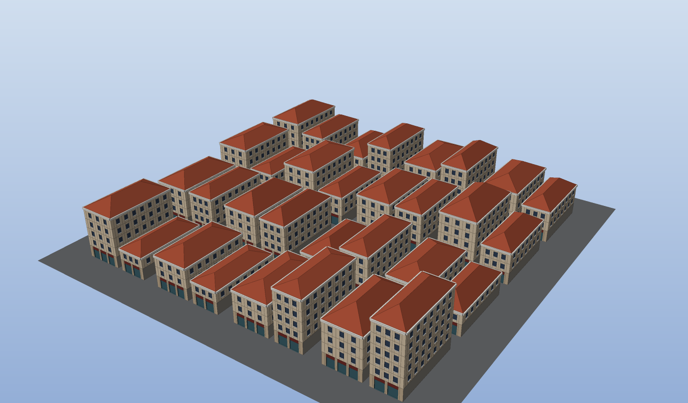
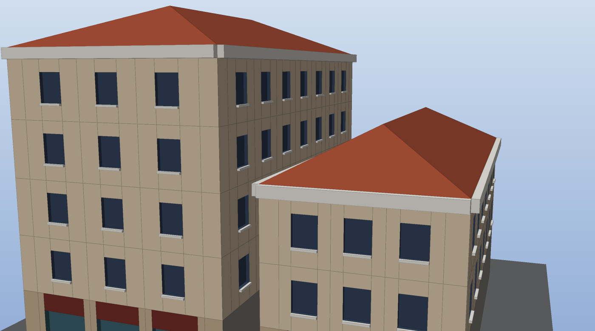

# Shape gramatiky: jak z pravidel vyrostou budovy

> Průvodce k modulu `src/pg/grammar/` a k článku
> [Generating 3d buildings using node graphs](https://nelari.us/post/shape_grammar_intro/)
> (Johann Muszynski, 2020). Je psaný tak, aby se dal číst souběžně s kódem.
>
> Související: [ARCHITECTURE.md](../ARCHITECTURE.md) — invarianty, na kterých modul stojí.

```bash
cmake -S . -B build && cmake --build build
./build/pgbuilding city.obj     # 32 budov; Blender: File → Import → Wavefront (.obj)
./build/pgtests                 # 76 testů, z toho 26 pro gramatiku
```



*Výstup `pgbuilding`: 16 pozemků, na každém dvě budovy s vlastní výškou a sklonem
střechy. Všechno je odvozené z 18 pravidel a jednoho wrangle.*

---

## 1. O čem je článek

Autor chtěl 3D editor, který funguje jako Photoshop: každá úprava se dá kdykoliv
změnit a výsledek se přepočítá, žádné mačkání `Ctrl+Z`. Procedurální modelování
na to sedí přesně — model **není uložený, je odvozený z pravidel**, takže změna
pravidla znamená jen nové odvození.

Pravidla jsou **shape gramatika**: hierarchie pojmenovaných 3D tvarů (*symbolů*) a
operací, které je vyrábějí (*produkčních pravidel*). Pravidlo vezme tvar
(*předchůdce*, predecessor) a nahradí ho libovolným počtem nových tvarů
(*následníků*, successors). Začíná se hrubým tvarem (kvádr, pozemek) a postupně se
zjemňuje: budova → fasády → patra → okna.

Co si z článku odnést:

| Myšlenka | Co znamená |
|---|---|
| Gramatika jako u vět | `věta → podmět sloveso předmět` se přepisuje, dokud nezbydou jen slova. Tady se přepisují tvary, dokud nezbydou jen stěny, okna a střechy. |
| Textový systém Müllera a kol. | CGA shape z článku *Procedural Modeling of Buildings* (2006), dnes v Esri CityEngine. Článek staví uzlový editor **nad** takovou textovou gramatikou. |
| Konfigurace | Nahrazený tvar se nemaže, jen se označí jako neaktivní. Zůstává tak celá historie stavby. |
| Tvary tečou po hranách | V grafu jde vynechat jména symbolů: hrana mezi uzly sama říká, kam tvar pokračuje. |
| Čtyři druhy pravidel | **axiom** (odkud tvary vzniknou), **refinement** (extrude, roof, repeat split), **diverging** (split s levým a pravým následníkem), **filter** (face selection podle normály). |
| Náhled | Celé odvození trvá milisekundy, takže jde přepočítat každý snímek. Z konfigurace jde skrýt následníky jednoho uzlu nebo ukázat jen je. |
| Omezení | Jen konvexní čtyřúhelníky. Konkávní půdorysy, díry a obecné střechy potřebují triangulaci a *straight skeleton* (disertace Toma Kellyho). |

---

## 2. Mentální model: přepisování

Shape gramatika je **přepisovací systém** — stejný princip jako formální gramatiky
nebo L-systémy u rostlin. Máš sadu tvarů, na každý tvar, pro jehož symbol existuje
pravidlo, pravidlo aplikuješ a tvar nahradíš jeho následníky. Opakuješ, dokud
nezbudou jen *terminály* — symboly bez pravidla.

```
Lot                                   (pozemek, plochý obdélník)
└─ Mass                               extrude(výška)
   ├─ Front                           comp(f): přední stěna
   │  ├─ Shopfront                    split(y): přízemí
   │  ├─ Floor, Floor, Floor          split(y): opakovaná patra
   │  │  ├─ Wall                      split(x): pilíř
   │  │  ├─ Tile, Tile, ...           split(x): opakované dlaždice
   │  │  │  ├─ Wall
   │  │  │  ├─ WindowBay → Window → Glass
   │  │  │  └─ Wall
   │  │  └─ Wall
   │  └─ Cornice → Ledge              římsa vystrčená ven
   ├─ Side, Side, Side                ostatní tři stěny
   └─ RoofBase → Roof                 valbová střecha
```

Tohle je **derivační strom**. Model jsou jeho listy. `pgbuilding` tenhle strom
vypisuje pro skutečně odvozené město — spusť ho a podívej se.

Dvě věci, na kterých všechno stojí:

1. **Pravidlo neví, kde ve světě je.** `Floor → split(x) {...}` rozdělí patro zleva
   doprava, ať je fasáda natočená na sever nebo na jih. Pracuje v lokálních
   souřadnicích tvaru — v jeho *scope*.
2. **Pořadí výsledku je pořadí listů stromu zleva doprava.** Následníci nahrazují
   předchůdce *na jeho místě*. Proto nezáleží na tom, jestli se pravidla aplikují
   po generacích (text), nebo jedno po druhém (uzly) — a proto textová gramatika
   i graf uzlů dají bitově stejný výsledek.

---

## 3. Scope — nejdůležitější pojem

Každý tvar je **scope**: orientovaný kvádr daný počátkem, třemi osami a velikostí.

```
            y
            ▲
            │
     size.y │     scope je kvádr [0, size.x] × [0, size.y] × [0, size.z]
            │     v lokálních souřadnicích (u, v, w) tvaru
            │
     origin ●───────────────────▶ x
           ╱        size.x
          ╱ size.z
         ▼
         z
                  bod (u, v, w)  ─▶  origin + x·u + y·v + z·w

    osy jsou jednotkové, navzájem kolmé a pravotočivé: cross(x, y) == z
```

To je celá matematika scope: **lineární kombinace tří os plus posun**. Kdo rozumí
tomuhle řádku, rozumí všem operacím.

Konvence v tomhle kódu (stejné jako v CGA, kde to jde):

| Tvar | Nulový rozměr | Normála | Osa y |
|---|---|---|---|
| Pozemek (`lot`) | `size.y == 0` | y, nahoru | nahoru |
| Hmota budovy | žádný (objem) | — | nahoru |
| Stěna z `comp` | `size.z == 0` | z, ven z budovy | nahoru (u bočních stěn) |

- Přední stěna (`front`) je na konci osy z hmoty. U kvádru zarovnaného se světem
  tedy míří na +Z, k výchozí kameře Blenderu i OpenGL.
- Osa x každé stěny vede **zleva doprava, jak ji vidí člověk stojící venku**.
  Proto `split(x)` dělí zleva doprava a `split(y)` zdola nahoru — na každé boční
  stěně, ať míří kamkoliv.

**Proč na pravotočivosti záleží:** z pořadí rohů polygonu se počítá jeho normála.
Když je rámec levotočivý, stěna se „otočí naruby“ — v rendereru zmizí nebo je
špatně osvětlená. Testy to hlídají (`comp_faces_are_right_handed_and_face_outwards`,
`a_box_meshes_closed_and_facing_outwards` počítá znaménkový objem).

---

## 4. Operace

Všechny operace jsou čisté funkce tvaru (`src/pg/grammar/Shape.h`). Text i uzly
jen rozhodují, na které tvary se pustí a jak se jmenují následníci.

### extrude(d) — z plochy objem

Plochý tvar naroste podél své normály o `d`: pozemek nahoru (`size.y = d`),
stěna ven (`size.z = d`). Záporné `d` vyhloubí **výklenek**: objem za stěnou, který
se vysíťuje jako krabice bez víka s normálami dovnitř — tak vznikají zapuštěná
okna. Na objemu `extrude` nastaví výšku.

### comp(f) — z objemu stěny

Rozloží kvádr na šest plochých tvarů: `front, right, back, left, top, bottom`.
Každá stěna dostane vlastní scope podle konvence výše — to je ta chvíle, kdy se
„svět“ budovy převede do lokálního světa fasády. Výběr v pravidle:
`comp(f) { front: Entrance | side: Facade | top: RoofBase }`. Konkrétní stěna má
přednost před `side` (čtyři svislé stěny); co není uvedené, zahodí se.

### split(osa) { ... } — dělení podél osy

Nejdůležitější operace. Vzor popisuje kusy za sebou:

| Zápis | Velikost | Příklad |
|---|---|---|
| `4: A` | absolutní, přesně 4 m | přízemí vysoké 4 m |
| `'0.25: A` | relativní, čtvrtina scope | levá čtvrtina |
| `~3: A` | plovoucí, *zhruba* 3 m | patro, které se roztáhne, aby vše vyplnilo |
| `{ ~3: A }*` | opakování | tolik pater, kolik se vejde |
| `2: NIL` | zabere místo, nevznikne nic | ulice mezi pozemky |



*Detail: `split` rozdělil fasádu na patra a dlaždice, `extrude(-0.2)` vyhloubil
okna do zdi, `extrude(0.15)` vystrčil parapety a `extrude(0.35)` římsu.*

Algoritmus rozložení (`layoutSplit`), který je dobré umět z hlavy:

```
L       = velikost scope podél osy
pevné   = součet absolutních + relativních (×L) velikostí mimo opakování
plovoucí = součet jmenovitých plovoucích velikostí mimo opakování
jednotka = jmenovitá délka jedné repetice skupiny { ... }*

počet opakování n:
    skupina má plovoucí kusy → n = max(1, round(místo / jednotka))   # nejmenší natažení
    jen pevné kusy           → n = floor(místo / jednotka)           # jen celé kusy
    kde místo = L − pevné − plovoucí

roztažení k = (L − všechny pevné) / (všechny jmenovité plovoucí)
kus délky: pevný = svoje, plovoucí = jmenovitá × k
co přeteče za L, se ořízne
```

Příklad: `{ 1: Wall | { ~3: Tile }* | 1: Wall }` na 11 m → místo 9 m → 3 dlaždice
po 3 m. Na 12 m → round(10/3) = 3 dlaždice po 3,33 m. Proto má širší fasáda víc
oken — a to je celé kouzlo, proč jedno pravidlo sedí na libovolně velký dům.

### roofHip(úhel), roofGable(úhel) — střechy

Nad plochým tvarem vznikne objem s výškou `tan(úhel) · kratší strana / 2`,
hřeben vede podél delší strany. Valbová střecha má čtyři svahy (na čtverci
jehlan), sedlová dva svahy a dva štíty.

### Článek → OpenHoudiny

| Uzel v článku | Kategorie | Tady | Poznámka |
|---|---|---|---|
| Axiom (origin, extents) | axiom | `axiom` (origin, size) a `lot` | `lot` udělá tvar z každého polygonu, třeba z buněk `grid` |
| Extrude (amount) | refinement | `extrude` | záporná hodnota = výklenek |
| Roof (angle) | refinement | `roof` (hip / gable) | článek má valbovou |
| Repeat split (dir, count) | refinement | `split` se vzorem `{ ~1: X }*` | počet se řídí velikostí; pevný počet: `{ ~1: X \| ~1: X \| ~1: X }` |
| Split (position, dir) | diverging | `split` se vzorem `{ '0.5: Left \| ~1: Right }` | jeden split zvládne libovolně kusů, ne jen dva |
| Face selection (normal, tolerance) | filter | `comp` s pojmenovanými stěnami | stěny podle polohy vůči tvaru, ne podle normály ve světě — viz cvičení 3 |

Přímý přepis modelu ze screenshotu v článku (krychle, 2×2 okna, valbová střecha)
je test `the_articles_example_as_text_and_as_nodes`.

---

## 5. Pravidla jako text

`shapegrammar` uzel spouští gramatiku ve stylu CGA (`src/pg/grammar/Grammar.h`):

```
Lot      --> extrude(height) Mass              // height = atribut z pointwrangle
Mass     --> comp(f) { front: Front | side: Side | top: RoofBase }
RoofBase --> roofHip(28) Roof
Side     --> split(y) { 4: Base | { ~3.2: Floor }* | 0.6: Cornice }
Floor    --> split(x) { 1: Wall | { ~3: Tile }* | 1: Wall }
Tile     --> split(x) { ~1: Wall | 1.3: Bay | ~1: Wall }
Bay      --> split(y) { 0.8: Wall | 1.6: Window | ~1: Wall }
Window   --> extrude(-0.2) Glass
```

Čte se to: *„tvar Lot vytáhni do výšky podle jeho atributu height a pojmenuj
Mass“*. Pravidlo = operace nad tvarem, pak následník — symbol, `NIL`, `split` nebo
`comp`. Symbol bez pravidla (`Wall`, `Glass`) je terminál.

Odvozování (`Grammar::derive`) běží po **průchodech**. V každém průchodu se
přepíšou všechny aktivní tvary — to je ta „konfigurace“ z článku. Nový tvar je
aktivní, jen když pro jeho symbol existuje pravidlo. Rekurzivní pravidlo
(`A --> split(x) { ~1: A | ~1: B }`) by běželo věčně. Proto existuje `maxdepth`
a uzel pak ohlásí, že odvozování nedoběhlo.

Chyby hlásí řádek a sloupec: `line 2, col 23: expected ':' after the size, found 'Floor'`.
Hlášku přečteš funkcí `grammarError(node)`.

---

## 6. Pravidla jako graf uzlů

Každý uzel je jedno pravidlo:

```
grid → lot → split(Lot → Strip) → split(Strip → Parcel) → extrude(Parcel → Mass)
     → comp(Mass → Front, Side, RoofBase) → roof(RoofBase → Roof) → split(Front ...) → …
     → shapemesh
```

- Parametr `shape` je předchůdce: uzel přepíše jen tvary s tímhle symbolem.
- Ostatní tvary **propustí beze změny**. Když nesedí žádný tvar, vrátí přímo vstup
  (stejný ukazatel, žádná kopie).
- `name`, `pattern` a jména stěn u `comp` jsou následníci.

**Rozdíl oproti článku.** V článku mají uzly víc výstupů (`left successor`,
`right successor`, `selected / unselected`) a tvar „teče“ po hraně — hrana sama je
symbol. Naše uzly mají jeden výstup, jak to chce cook engine, takže tvary tečou
jedním proudem a symbol nese atribut `shape`. **Obě podoby jsou ekvivalentní:**
editor s piny jde přeložit na naše uzly tak, že každý výstupní pin dostane
unikátní jméno symbolu (třeba `split3.left`). Tím je jasné, co postavit ve fázi
GUI (ROADMAP M9): editor s piny, který na pozadí skládá tenhle graf.

**Konfigurace z článku** a co jí tady odpovídá:

| V článku | Tady |
|---|---|
| neaktivní tvary = historie stavby | výstup každého uzlu zůstává v cache; výstup uzlu = stav odvození po tomhle pravidle |
| skrýt následníky uzlu | zobrazit výstup uzlu před ním |
| náhled následníků jednoho uzlu | cooknout ten uzel — z cache je to okamžité |
| hierarchie tvaru | atribut `path`, např. `Lot/Strip/Parcel/Plot/Mass/Front/Floor/Tile/WindowBay/Window/Glass`; zdědí ho i polygony po `shapemesh` |

A jedno zlepšení: článek po každé změně přepočítá celou gramatiku od nuly. Tady
líný cook engine přepočítá **jen pravidla za změnou** — v `pgbuilding` úprava
šířky oken přepočítá 5 z 25 uzlů (test `editing_one_rule_recooks_only_the_rules_after_it`).

---

## 7. Jak to sedí na jádro (a proč je to napsané takhle)

| Invariant | Jak se projeví v gramatice |
|---|---|
| **I3** jeden kontejner | Tvar je *bod* obyčejné `Geometry`, scope jsou atributy `P, xaxis, yaxis, zaxis, size`, symbol je string `shape`. Proto na tvary funguje `pointwrangle`, `merge`, `blast` — a `pgbuilding` vkládá wrangle přímo mezi dvě fáze gramatiky. |
| **I2** SoA | Průchod (`rewrite`) pro každého následníka zapíše jen index rodiče; `materialize` pak jedním `gather` na atribut zkopíruje **všechny** atributy rodičů. To je dědičnost atributů zadarmo — výška z pozemku doteče až do každého okna. |
| **I1** COW | Pravidlo, které nic nematchne, vrátí vstup beze změny. |
| **I5** determinismus | Přepisování běží po chuncích odvozených z počtu tvarů a výsledky se spojí v pořadí chunků → stejný hash na 1 i 4 vláknech (test). |
| **I4** líné vyhodnocení | Uzly gramatiky jsou obyčejné uzly; verzování a cache fungují beze změny. |

Mapa kódu v pořadí, v jakém ho číst:

1. `src/pg/grammar/Shape.h` — slovník: `Scope`, `Shape`, operace, `Successor`.
2. `Shape.cpp`: `faceScope`, `extrude`, `layoutSplit` — geometrie.
3. `Shape.cpp`: `rewrite`, `materialize` — jak se přepíše celá sada tvarů.
4. `Shape.cpp`: `mesh` — z tvarů polygony (krabice, výklenek, střechy).
5. `Grammar.h / .cpp` — lexer, parser, `derive`.
6. `src/pg/nodes/ShapeNodes.cpp` — uzly `axiom lot extrude roof split comp shapemesh shapegrammar`.
7. `tests/test_shape_grammar.cpp` — co přesně platí, včetně ekvivalence textu a uzlů.
8. `cli/building_main.cpp` — celé město dohromady.

---

## 8. Co musíš umět

Seřazeno podle toho, jak moc to potřebuješ. Hvězdičky: ★★★ bez toho to nepůjde,
★★ budeš potřebovat brzy, ★ až pro další kroky.

| | Oblast | Proč | Kolik stačí |
|---|---|---|---|
| ★★★ | **Vektorová algebra** | scope, stěny, normály, orientace — všechno | skalární a vektorový součin, normalizace, ortonormální báze, převod lokálních souřadnic na světové (sekce 3) |
| ★★★ | **Rekurze a stromy** | derivace je strom; pravidla se volají na výsledky pravidel | procházení stromu, pořadí listů, proč nekonečná rekurze potřebuje limit |
| ★★★ | **Přepisovací systémy** | celý princip | formální gramatika, L-systémy (1. kapitola *The Algorithmic Beauty of Plants* stačí) |
| ★★ | **Polygonové sítě** | výstup je mesh | bod, polygon, pořadí rohů (winding), normála, formát OBJ |
| ★★ | **Souřadnicové systémy a transformace** | napojení na zbytek scény | pravotočivost, matice 4×4, proč se normály transformují jinak |
| ★★ | **C++ a datově orientovaný návrh** | kód je C++20 nad SoA jádrem | `std::vector`, lambdy, `shared_ptr`, proč struct-of-arrays |
| ★ | **Parsování** | jen textová gramatika | lexer + rekurzivní sestup; celý `Grammar.cpp` má necelých 500 řádků |
| ★ | **GUI s uzly** | editor jako v článku | Dear ImGui + [imnodes](https://github.com/Nelarius/imnodes) (knihovna od autora článku), nebo Qt |
| ★ | **Výpočetní geometrie** | obecné půdorysy a střechy | triangulace (ear clipping), offset polygonu, *straight skeleton* |

---

## 9. Jak se to učit

1. **Nakresli si to.** Kvádr na papír, šest stěn, u každé šipky x, y, z. Pak porovnej
   s `faceScope` v `Shape.cpp` a s testem `comp_faces_are_right_handed_and_face_outwards`.
2. **Hraj si s výsledkem.** Spusť `pgbuilding`, otevři OBJ v Blenderu, změň čísla
   v `kBuildingRules` (výšky pater, šířky oken, úhel střechy) a sleduj, co se stane.
   Pak změň strukturu: přidej balkony (`extrude` kladně) nebo jiné přízemí.
3. **Přečti `layoutSplit`** a spočítej na papíře tři vzory; ověř je testy splitu.
4. **Přečti Müller a kol. 2006.** Hlavně části o scope, split a repeat — po krocích
   1–3 už budou známé.
5. **Udělej cvičení 1–3** níže. Každé projde všemi vrstvami: operace → parser →
   uzel → test.
6. **Postav si editor.** `Graph`, `Node::setInput` a `setString` jsou všechno, co GUI
   potřebuje; imnodes nakreslí uzly a hrany.

---

## 10. Cvičení

Seřazená od nejsnazšího. U každého je napsáno, kde začít.

1. **`t(x, y, z)` — posun v lokálních souřadnicích.** `origin += x·tx + y·ty + z·tz`.
   Přidej funkci do `Shape.h`, hodnotu do `OpKind`, případ do `kOps` a `apply`
   v `Grammar.cpp`, uzel do `ShapeNodes.cpp` a test. Parser dnes čte jeden argument;
   `t` potřebuje tři oddělené čárkou (token `Comma` lexer už zná). Nejlepší první
   úkol: malý, ale projde celým systémem.
2. **`s(x, y, z)` — nová velikost**, s relativními hodnotami (`'1` = beze změny).
   Použij stejné `SizeMode` jako split.
3. **Filtr podle normály** jako *Face selection* v článku: tvar je vybraný, když
   `dot(normála, n) ≥ cos(tolerance)`. Vybrané dostanou jeden symbol, ostatní druhý.
   Normála plochého tvaru je jeho osa z (u pozemku y — viz `flatAxis`).
4. **Náhodná pravidla** `Facade --> 30%: A | else: B`. Pozor na determinismus (I5):
   žádné `rand()`, ale hash ze semínka a identity tvaru — třeba z indexu rodiče a
   pořadí mezi sourozenci. Stejná scéna musí dát stejné město na každém stroji.
5. **Podmínky** `case scope.sy > 10: A else: B` — třeba jiné přízemí u vysokých domů.
6. **Převod textu na graf.** Z `Grammar::rules()` postav řetězec uzlů. Přesně tohle
   udělal autor článku. Pozor na pořadí: pravidlo musí být až za pravidly, která
   vyrábějí jeho symbol (topologické řazení; rekurzivní gramatika nejde).
7. **Obecné půdorysy.** Konkávní pozemky, střecha na L-půdorysu → *straight
   skeleton*. Těžké; začni disertací Toma Kellyho.
8. **Editor s imnodes** nad `Graph` API, s náhledem výstupu vybraného uzlu.

---

## 11. Vědomá zjednodušení

- Tvar je jen scope (kvádr). Obecný polygon se při vstupu (`lot`) nahradí
  obdélníkem, který ho obepíná. Článek má stejné omezení (jen quady).
- Z CGA chybí: `t`, `s`, `r`, podmínky, náhodná pravidla, parametry pravidel,
  `comp(e)` / `comp(v)`, occlusion dotazy, vkládání vlastních modelů (`i()`).
- `transform` na tvarech posune jen počátky, osy neotočí. Transformuj polygony
  před `lot`, nebo mesh po `shapemesh`.
- Stringy (symbol, `path`) se internují lineárním hledáním v tabulce. Pro sdílené
  hodnoty je to levné, pro unikátní cesty s indexy (`Floor_3/Tile_7`) by to bylo
  O(n²) — tabulka by potřebovala hashmapu.
- Mesh neslučuje body mezi tvary (každý tvar má vlastní rohy).

---

## 12. Literatura

Z článku:

- P. Müller, P. Wonka, S. Haegler, A. Ulmer, L. Van Gool: *Procedural Modeling of
  Buildings*. SIGGRAPH 2006. — **Základ; CGA shape.**
- M. Schwarz, P. Müller: *Advanced Procedural Modeling of Architecture*. SIGGRAPH 2015.
- Y. Parish, P. Müller: *Procedural Modeling of Cities*. SIGGRAPH 2001.
- T. Kelly, P. Wonka: *Interactive Architectural Modeling with Procedural Extrusions*.
  ACM TOG 2011.
- T. Kelly: *Unwritten Procedural Modeling with the Straight Skeleton*. Disertace, 2013.

Navíc doporučuju:

- G. Stiny, J. Gips: *Shape Grammars and the Generative Specification of Painting
  and Sculpture*. 1972. — Odkud pojem pochází.
- P. Wonka, M. Wimmer, F. Sillion, W. Ribarsky: *Instant Architecture*. SIGGRAPH 2003.
  — Split gramatiky, přímý předchůdce CGA.
- P. Prusinkiewicz, A. Lindenmayer: *The Algorithmic Beauty of Plants*. 1990. —
  L-systémy; nejlepší úvod do přepisovacích systémů.
- M. Lipp, P. Wonka, M. Wimmer: *Interactive Visual Editing of Grammars for
  Procedural Architecture*. SIGGRAPH 2008.
- G. Patow: *User-Friendly Graph Editing for Procedural Modeling of Buildings*.
  IEEE CG&A 2012. — Gramatika jako graf uzlů, stejná myšlenka jako v článku.
- P. B. Silva, P. Müller, R. Bidarra, A. Coelho: *Node-Based Shape Grammar
  Representation and Editing*. PCG 2013.
- Dokumentace CGA v Esri CityEngine — referenční popis všech operací.
