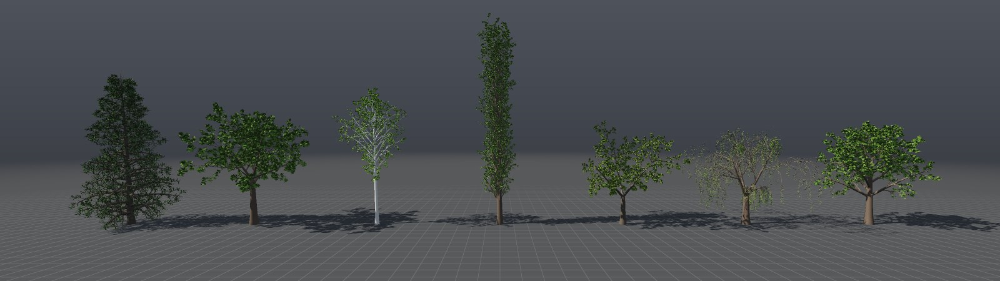
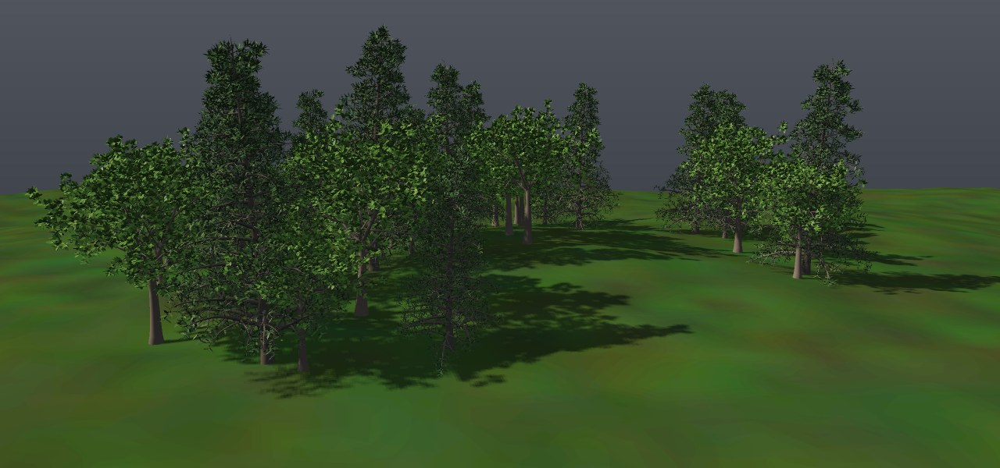
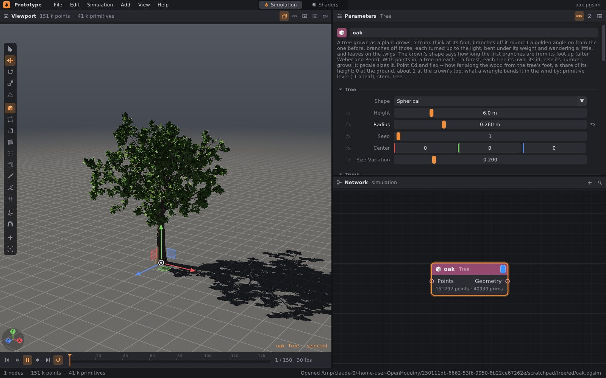

# Stromy: uzel Tree

Uzel **Tree** pěstuje strom tak, jak roste rostlina. Kmen je silný u paty
a ke špičce se zužuje. Z kmene rostou větve, z nich další větve a na
konečcích listy. Každá větev se otáčí ke světlu, prohýbá se pod svou vahou
a trochu bloudí. Předlohou je model Webera a Penna (*Creation and Rendering
of Realistic Trees*, 1995), ze kterého vychází třeba generátor Sapling
v Blenderu. Obrys koruny určuje, jak dlouhé jsou první větve podél
kmene. Ostatní rostou úroveň po úrovni, každá o zlatý úhel (137,5°) dál
kolem svého rodiče než ta předchozí, stejně jako se kolem stonku kladou
listy a pupeny.

Se vstupem bodů vyroste na každém bodě jeden strom. Tak vznikne les, ve
kterém je každý strom jiný.



```bash
./build/prototype --example tree_shapes            # sedm druhů stromů vedle sebe
./build/prototype --example forest                 # les na kopci ve větru: Play
./build/prototype sim tree_shapes stromy.png       # bez okna do obrázku
./build/prototype cook tree_shapes stromy.obj      # stromy do OBJ (Blender, Houdini)
./build/prototype cook forest - --start 1 --end 3  # kolik bodů a jak dlouho
```



## 1. Jak strom roste

### Kmen

Kmen je dlouhý **Height** a nad patou má poloměr **Radius**. Ke špičce se
zužuje na **Tip** (podíl Radius). U země se rozšiřuje o **Flare**, jak do
něj vbíhají kořeny. **Lean** ho nakloní na jednu stranu a ohne zpátky.
Roste po kouscích dlouhých **Segment** a trochu bloudí (čtvrtina Wobble).

**Vidlice.** S **Forks** větším než 1 se kmen ve výšce **Fork Height**
(podíl jeho délky) rozdělí na Forks vůdčích větví. Tak roste koruna dubu,
javoru nebo akácie. Vůdčí větve se rozbíhají o **Fork Angle** a podle
**Up** se stáčejí zpátky vzhůru: s malým Up se rozevřou do deštníku,
s velkým rostou vedle sebe nahoru. Jejich průřezy dají dohromady průřez
kmene v místě vidlice (poloměr r/√n, o 10 % víc, aby spoj nebyl vidět).
Patří k úrovni kmene, takže z nich rostou první větve stejně jako z něj.

### Větve

**Levels** říká, kolik úrovní větví strom má (0 až 3; 0 je holý kmen).

- **První úroveň** roste z kmene a z vůdčích větví od **Crown** (podíl
  výšky, kde začíná koruna; pod ní je kmen holý) nahoru. Počet
  **Branches** se rozdělí mezi kmen a vůdčí větve podle toho, jak velká
  část každého z nich je v koruně. Délka je Height × **Length** × tvar
  koruny v tom místě (viz níže).
- **Další úrovně** rostou z každé větve úrovně před nimi, od 12 % do 97 %
  její délky. Jsou dlouhé jako rodič × Length. Ke špičce rodiče se
  zkracují, až o 60 %; u převislého tvaru (Weeping) jen o 20 %, takže
  větvičky visí dlouhé po celé délce.

Každá větev roste o zlatý úhel dál kolem rodiče než ta před ní a od rodiče
se odklání o **Angle** (±15 %). U báze je tlustá **Thickness** × poloměr
rodiče v místě, kde z něj roste, a ke špičce se zužuje na 15 %. Báze je
uvnitř rodiče, takže spoj není vidět. Délky se náhodně liší o ±15 %.
Větev kratší než polovina listu nebo než 2 cm nevyroste.

Při růstu se větev otáčí. **Gravity** ji prohýbá vlastní vahou, víc ke
špičce a víc u tenčích úrovní; u tvaru Weeping je to u druhé a třetí úrovně
čtyřikrát víc, takže větvičky visí. **Up** ji otáčí ke světlu. **Wobble**
jí dává náhodné bloudění, stejně velké při jakémkoli dělení na kousky
(náhodná procházka se škáluje s odmocninou délky kousku).

### Tvar koruny

Tvar koruny (Shape) určuje, jak dlouhé jsou první větve od paty koruny
k vrcholu, jako podíl nejdelší z nich. Vzorce jsou od Webera a Penna,
nejkratší větev má aspoň 10 %.

| Shape | Nejdelší větve | Strom |
|---|---|---|
| **Conical** | u paty koruny, k vrcholu kratší | smrk, jedle |
| **Spherical** | uprostřed | dub, lípa, javor |
| **Hemispherical** | u paty, nahoře zaoblená | lípa, kaštan |
| **Cylindrical** | všechny stejně | topol vlašský |
| **Flame** | ve dvou třetinách odshora | bříza, hrušeň |
| **Umbrella** | nahoře | akácie, pinie |
| **Weeping** | uprostřed a větvičky visí | vrba, bříza smuteční |

### Listy

Na každé **větvičce** (větvi, ze které už nic neroste) vyroste **Leaves**
listů, od čtvrtiny její délky ke špičce. Každá větev, která nese další,
má na konci chomáč třetiny Leaves listů, protože i tam je mladé dřevo.
Kmen pod korunou a místo vidlice listy nemají. Listy leží kolem větvičky
o zlatý úhel jeden od druhého. Každý míří ven od větvičky, trochu dopředu
a nahoru a čepelí se obrací k nebi (natočený o ±35°). Podél středního
žebra je lehce přeložený. Je dlouhý **Leaf Size** ±20 %. Barva vychází
z **Leaf Color**, podle **Variation** je světlejší, tmavší a do žluta.

| Leaf Shape | Tvar |
|---|---|
| **Broad** | oválná čepel (dub, lípa), 8 bodů |
| **Narrow** | dlouhý úzký list (vrba), 6 bodů |
| **Needles** | zubatá větvička jehličí (smrk, jedle), 10 bodů; hodí se jich na větvičku víc |

Všechny tvary jsou z pohledu paty listu hvězdicové, takže je vějíř
trojúhelníků z paty pokryje přesně, i ten zubatý.

## 2. Parametry

| Sekce | Parametr | Výchozí | Co dělá |
|---|---|---|---|
| Tree | Shape | Spherical | tvar koruny (tabulka výše) |
| | Height | 6 m | délka kmene; koruna sahá o kus výš |
| | Radius | 0,16 m | poloměr kmene nad patou |
| | Seed | 1 | jiné číslo, jiný strom téhož druhu |
| | Center | 0 0 0 | kde strom stojí (bez vstupu bodů) |
| | Size Variation | 0,2 | o kolik se liší velikost stromů na bodech |
| Trunk | Tip | 0,08 | poloměr na vrcholu jako podíl Radius |
| | Flare | 0,35 | rozšíření u země |
| | Lean | 0,1 | naklonění a oblouk zpátky |
| | Crown | 0,35 | kde začínají větve (podíl výšky) |
| | Forks | 1 | na kolik vůdčích větví se kmen rozdělí (1 = nerozdělí) |
| | Fork Height | 0,5 | kde se rozdělí (podíl délky) |
| | Fork Angle | 25° | o kolik se vůdčí větve rozbíhají |
| Branches | Levels | 3 | úrovně větví, 0 až 3 |
| | Thickness | 0,55 | tloušťka báze větve jako podíl rodiče |
| | Gravity | 0,25 | jak moc větve visí |
| | Up | 0,25 | jak moc se stáčejí ke světlu |
| | Wobble | 0,3 | jak moc bloudí |
| Level 1 / 2 / 3 | Branches | 28 / 7 / 5 | kolik větví na rodiče |
| | Angle | 55° / 45° / 40° | odklon od rodiče |
| | Length | 0,5 / 0,45 / 0,4 | délka jako podíl rodiče (první úroveň: kmene) |
| Leaves | Leaves | 10 | listů na větvičku |
| | Leaf Size | 0,12 m | délka listu |
| | Leaf Shape | Broad | Broad, Narrow, Needles |
| Look | Bark Color | hnědá | barva kůry (`Cd`); mladší dřevo o kus světlejší |
| | Leaf Color | zelená | barva listů (`Cd`) |
| | Variation | 0,3 | jak moc se liší odstín listů a kůra stromů |
| Detail | Sides | 10 | stěn kolem kmene; každá úroveň větví o 2 méně, nejméně 3, nikdy 6 (pak 7; viz Vítr) |
| | Segment | 0,25 m | délka kousku kmene; větve o čtvrtinu jemněji na úroveň |
| | Output | Mesh | Mesh (síť), Skeleton (kostra), nebo Instances: Variants stromů a bod pro každý strom ([vegetation.md](vegetation.md)) |
| | Variants | 8 | u Instances: kolik různých stromů se vypěstuje — ty, které by vyrostly na prvních bodech |

Ve viewportu má vybraný uzel v režimu objektů (**1**) úchyt jako Tube:
**W** posouvá Center, **R** mění Height (nahoru) a Radius kmene (do stran)
([editing.md](editing.md#6b-úchyty-geometrických-uzlů)).



## 3. Výstup

**Mesh.** Kmen a každá větev jsou trubky: kolem každého bodu osy je
prstenec stěn a na špičce kužel. Kmen je uzavřený i u paty, takže je to
uzavřené těleso. Báze větve je uvnitř rodiče. Stěny jsou otočené ven,
listy jsou polygony otočené lícem tam, kam hledí.

| Atribut | Třída | Co je v něm |
|---|---|---|
| `Cd` | bod | barva kůry a listů |
| `flex` | bod | vzdálenost po dřevě od paty stromu jako podíl výšky: 0 u země, 1 na vrcholu kmene, na konečcích větví víc — o kolik vítr strom ohne (níže) |
| `level` | primitivum | −1 list, 0 kmen (a vůdčí větve), 1–3 úrovně větví |
| `stem` | primitivum | číslo větve ve stromu (list: větvička, na které roste) |
| `tree` | primitivum | číslo stromu = číslo bodu vstupu |
| `bark`, `leaves` | skupiny primitiv | kůra a listy, třeba pro Blast nebo Color |

**Skeleton.** Každá větev je otevřená lomená čára bodů své osy, s poloměrem
v `pscale` a směrem v `N`; primitiva nesou `level`, `stem`, `parent` (číslo
rodičovské větve, u kmene −1) a `tree`. Listy jsou volné body ve skupině
bodů `leaves`: `N` je směr, kam čepel hledí, `pscale` délka listu, `Cd`,
`flex` a `orient` (níže). Kostra se hodí pro vlastní listy nebo květy
(Copy to Points) a pro export do nástroje, který si trubky postaví sám.

**Instances.** Stromy jako instance ([vegetation.md](vegetation.md)):
uzel vypěstuje Variants stromů a každý bod vstupu jeden z nich zastupuje —
otočený kolem +y, velký podle `pscale` a Size Variation, s vlastním
odstínem (`tint`). Les tisíců stromů tak stojí tolik, kolik stojí osm
stromů a tisíc bodů; viewport je kreslí přes GPU instancing, USD dostane
PointInstancer. Ve větru se strom jako instance kývá celý od paty
(`orient`), neohýbá se podle `flex`.

## 4. Les: strom na každém bodě

Když je do vstupu **Points** spojená geometrie s body, vyroste na každém
bodě strom. Jeho pata je v bodě a je velký `pscale` × (1 ± Size
Variation). Tvar stromu určuje Seed spolu s atributem `id` bodu (celé
číslo), a pokud ho bod nemá, jeho pořadí. Bod se stejným `id` tak nese
stejný strom, ať je v seznamu kdekoli. Stromy rostou paralelně, každý
sám, a spojí se v pořadí bodů. Výsledek je proto stejný na jakémkoli
počtu vláken.

Příklad **forest** ([examples/sim/forest.pgsim](../examples/sim/forest.pgsim)):

- **Grid** 160 × 160 m, který Point Wrangle `terrain` zvedne šumem do
  kopce a obarví jako trávu.
- Primitive Wrangle `wood_edge` a **Blast** `wood` nechají jen plochy do
  27 m od středu, **Scatter** na ně rozhází 34 bodů.
- Point Wrangle `kinds` dá bodům výš na kopci s větší
  pravděpodobností skupinu `conifer`.
- Dva **Blasty** rozdělí body. Na jehličnaté roste **Tree** `spruces`
  (Conical, jeden kmen až k vrcholu, dvě úrovně větví, jehličí). Na
  ostatní roste **Tree** `broadleaves` (Spherical, kmen se ve 45 % výšky
  rozdělí na tři vůdčí větve).
- **Merge** `forest` spojí kopec se stromy a Point Wrangle `wind` (vítr,
  níže), který se zobrazuje, je ohýbá. Kopec nemá `flex`, Merge mu ho
  doplní nulou, takže se nehne.

## 5. Vítr

Atribut `flex` říká, jak daleko po dřevě od paty stromu bod je (jako podíl
výšky stromu). U země je 0, na vrcholu kmene 1, na konečcích větví víc.
Každý prstenec trubky i každý bod listu má `flex` svého místa na ose.
Posun podle `flex` proto nerozbije kůru ani spoje větví. Wrangle `wind`
z příkladu forest:

```c
// Ohnuté od paty: čím dál po dřevě, tím víc.
float f = @flex * @flex;
float gust = 0.6 + 0.4 * sin(@Time * 0.8 - @P.x * 0.12);
float sway = 0.5 + sin(@Time * 2.1 - @P.x * 0.2 + @P.z * 0.07);
@P.x += ch("strength") * f * gust * sway;
@P.z += 0.3 * ch("strength") * f * sin(@Time * 1.4 + @P.z * 0.25);
// Větvičky a listy se chvějí.
@P.y += 0.02 * max(@flex - 0.6, 0) * sin(@Time * 12.0 + (@P.x + @P.z) * 2.0);
```

Pata stromu (`flex` 0) stojí, kmen se ohýbá málo (`flex²`) a koruna víc.
Fáze závisí na poloze, takže nárazy větru běží přes kopec a nepohybují
všemi stromy naráz. Nad `flex` 0,6 se větvičky a listy ještě chvějí.
**Strength** je posuvník z `ch()`. Posun jde do strany, strom se neotáčí,
takže u velkých výchylek by se větve trochu natáhly. Pro vítr v záběru to
nevadí.

Wrangle mění jen polohy bodů, topologii a barvy nechává sdílené se
vstupem. Viewport proto při přehrávání nahrává do GPU jen nové polohy
a normály ([geometry.md](geometry.md)). Proto je vítr až za Merge s kopcem:
Merge za ním by každý snímek vyrobil novou geometrii a viewport by ji
stavěl celou znovu. Proto také trubky nemají nikdy šest stěn: jejich hrany
by svíraly přesně 60°, tedy práh, kde viewport hranu láme, a ve větru by
jednou byly hladké a podruhé ostré.

## 6. Vlastní listy

Výstup **Skeleton** dává listům `orient`, kvaternion x, y, z, w, který
otočí list modelovaný naplocho na místo každého listu. Model listu leží
v rovině xz, lícem nahoru (+y), stopkou v počátku a špičkou ve směru +z,
dlouhý 1 m (velikost dá `pscale`). **Copy to Points** ho pak rozmístí:

```
[File list.obj] ------------------> [Copy to Points] -> ...
[Tree (Output: Skeleton)] -> [Blast: leaves, Keep] --^ (Points)
```

Kůru postaví druhý Tree se stejným nastavením, Output Mesh a Leaves 0.
Listy rostou až po větvích a z vlastních náhodných čísel, takže větve
jsou v obou stromech stejné.

## 7. Druhy

Příklad **tree_shapes** ([examples/sim/tree_shapes.pgsim](../examples/sim/tree_shapes.pgsim))
má sedm stromů jednoho uzlu, každý nastavený jako jiný druh. Hlavní rozdíly:

| Druh | Shape | Kmen | Větve | Listy |
|---|---|---|---|---|
| **Smrk** | Conical | 11 m, Crown 0,06, jeden kmen | Levels 2; 64 větví pod úhlem 80°, Length 0,3; Gravity 0,35, Up 0,05 | Needles 0,22 m, 16 na větvičku, tmavé |
| **Dub** | Spherical | 7 m, Forks 3 ve 45 %, 28° | výchozí, Length 0,6 | Broad 0,18 m, 16 |
| **Bříza** | Flame | 10 m, poloměr 0,13 m, bílá kůra | 34 větví pod úhlem 40°, Gravity 0,5 | Broad 0,08 m |
| **Topol** | Cylindrical | 13 m, Crown 0,1 | 64 větví pod úhlem 22°, Length 0,2, Up 0,6 | Broad 0,09 m |
| **Akácie** | Umbrella | 6 m, Crown 0,45, Forks 3 ve 35 %, 40° | 36 větví pod úhlem 70°, Up 0,03 | Broad 0,09 m, 24 |
| **Vrba** | Weeping | 6 m, Forks 3 ve 35 % | 16 větví; druhá úroveň 10 pod úhlem 25°, Length 1; Gravity 0,5 | Narrow 0,14 m, 20 |
| **Lípa** | Hemispherical | 7 m, Forks 2 v polovině | Length 0,55 | Broad 0,15 m, 16 |

## 8. Výkon a determinismus

Na čtyřech jádrech:

| Co | Body | Primitiva | Čas |
|---|---|---|---|
| jeden strom s výchozím nastavením | 103 tisíc | 32 tisíc | 12 ms |
| sedm druhů (tree_shapes) | 1,34 milionu | 366 tisíc | 117 ms |
| les 34 stromů na kopci (forest), první snímek | 3,5 milionu | 827 tisíc | 0,9 s |
| les, každý další snímek (vítr) | | | 0,4–0,6 s |

Jeden strom roste v jednom vlákně, stromy lesa paralelně. Ve větru se
přepočítává jen wrangle nad 3,5 milionu bodů (interpretovaný); stromy
znovu nerostou a Merge s kopcem se nevaří znovu.

Každá část stromu (kmen, vidlice, rozmístění větví na rodiči, růst každé
větve, listy každé větvičky) má svá náhodná čísla, odvozená jen ze Seed
a z čísla té části. Strom je proto stejný bez ohledu na pořadí, ve kterém
se části staví.

Jeden strom má nanejvýš 200 000 větví a milion listů, ať nastavení říká
cokoli (200 větví na každé z 200 na každé z 200 by bylo osm milionů);
dál už neroste. Testy (`tests/test_trees.cpp`) ověřují stejný hash
geometrie na jednom a čtyřech vláknech, stejné stromy na bodech se
stejným `id` v jiném pořadí, bázi každé větve na ose rodiče, uzavřené
trubky s plochami otočenými ven a tvar koruny podle Shape.

## 9. Co zatím chybí

- **Textury.** Kůra i listy mají jen barvu `Cd`, nemají UV ani průsvitnost
  listů.
- **Prořezávání obálkou** (Prune u Webera a Penna) a vyhýbání se větví
  navzájem nebo překážkám.
- **Kořeny** nad zemí a **LOD**: zjednodušené stromy a billboardy pro
  vzdálený les.
- **Vítr jako simulace** ohybu větví. Teď je to kinematický posun
  wranglem.
