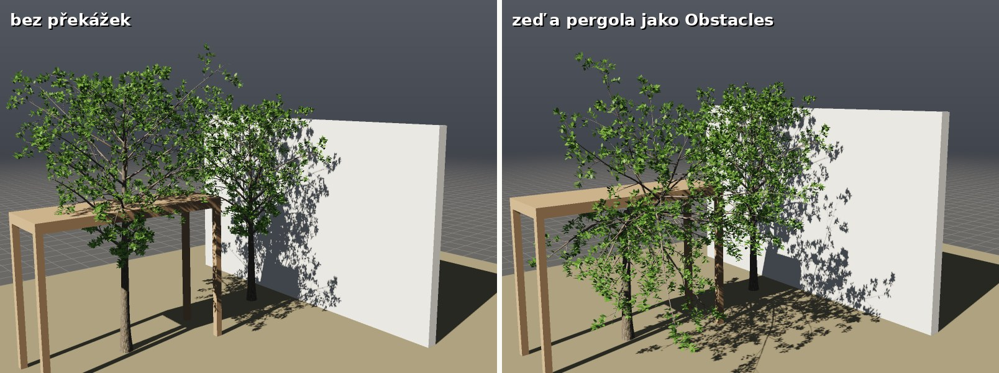
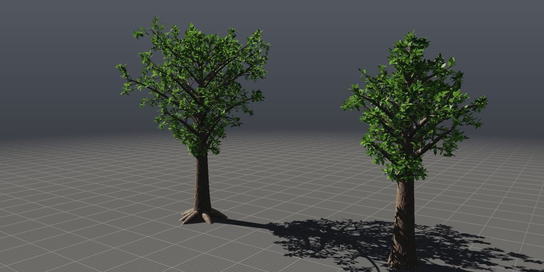
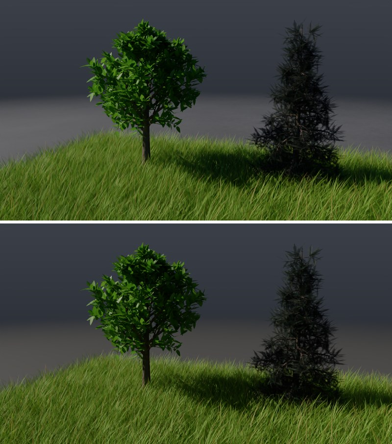
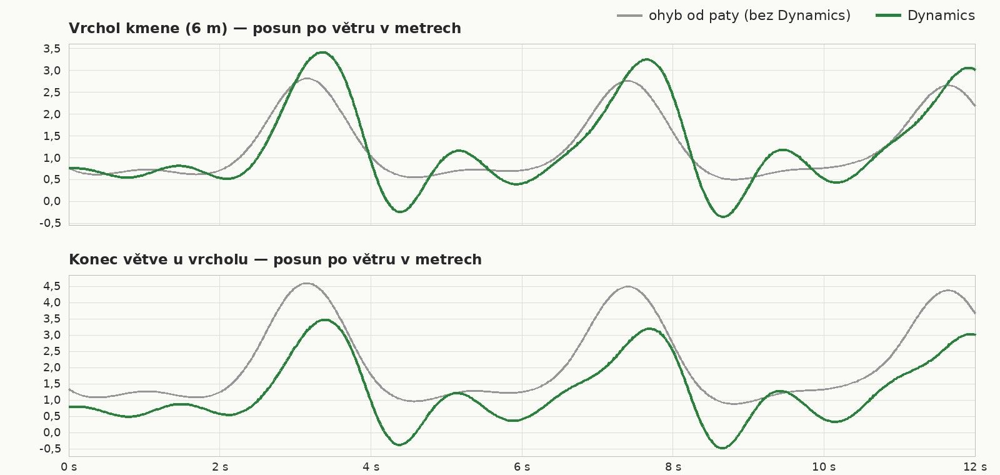

# Trees: the Tree node

The **Tree** node grows a tree the way a plant grows. The trunk is thick at
the base and tapers towards the tip. Branches grow from the trunk, further
branches grow from those, and leaves grow at the tips. Every branch turns
towards the light, bends under its own weight and wanders a little. The
model is that of Weber and Penn (*Creation and Rendering of Realistic
Trees*, 1995), which is also the basis of, for example, the Sapling
generator in Blender. The crown outline determines how long the first
branches along the trunk are. The others grow level by level, each one a
golden angle (137.5°) further around its parent than the previous one, just
as leaves and buds are arranged around a stem.

With an input of points, one tree grows on each point. This produces a
forest in which every tree is different.


```bash
./build/prototype --example tree_shapes            # seven tree species side by side
./build/prototype --example forest                 # a forest on a hill in the wind: Play
./build/prototype sim tree_shapes stromy.png       # without a window, to an image
./build/prototype cook tree_shapes stromy.obj      # trees to OBJ (Blender, Houdini)
./build/prototype cook forest - --start 1 --end 3  # how many points and how long
```


## 1. How a tree grows

### Trunk

The trunk is **Height** long and has radius **Radius** just above the base.
Towards the tip it tapers to **Tip** (a fraction of Radius). Near the ground
it widens by **Flare**, where the roots run into it. **Lean** tilts it to
one side and bends it back. It grows in pieces **Segment** long and wanders
a little (a quarter of Wobble).

**Forks.** With **Forks** greater than 1, the trunk splits at **Fork Height**
(a fraction of its length) into Forks leaders. This is how the crown of an
oak, maple or acacia grows. The leaders diverge by **Fork Angle** and,
depending on **Up**, curve back upwards: with a small Up they open out into
an umbrella, with a large one they grow upwards side by side. Their
cross-sections add up to the cross-section of the trunk at the fork (radius
r/√n, 10% more so that the joint is not visible). They belong to the trunk
level, so the first branches grow from them just as from the trunk.

### Branches

**Levels** sets how many levels of branches the tree has (0 to 3; 0 is a
bare trunk).

- **The first level** grows from the trunk and from the leaders, from
  **Crown** (the fraction of the height where the crown begins; below it
  the trunk is bare) upwards. The **Branches** count is divided between the
  trunk and the leaders according to how large a part of each of them lies
  in the crown. The length is Height × **Length** × the crown shape at that
  point (see below).
- **Further levels** grow from every branch of the level before them, from
  12% to 97% of its length. They are as long as the parent × Length. Towards
  the parent's tip they get shorter, by up to 60%; with the weeping shape
  (Weeping) only by 20%, so the twigs hang long along the whole length.

Each branch grows a golden angle further around the parent than the one
before it, and diverges from the parent by **Angle** (±15%). At its base it
is **Thickness** × the parent's radius at the point where it grows from it,
and it tapers to 15% towards the tip. The base is inside the parent, so the
joint is not visible. Lengths vary randomly by ±15%. A branch shorter than
half a leaf or than 2 cm does not grow.

While growing, a branch turns. **Gravity** bends it under its own weight,
more towards the tip and more on thinner levels; with the Weeping shape this
is four times stronger on the second and third levels, so the twigs hang.
**Up** turns it towards the light. **Wobble** gives it a random wander that
is equally large however finely it is divided into pieces (the random walk
scales with the square root of the piece length).

### Crown shape

The crown shape (Shape) determines how long the first branches are from the
base of the crown to the top, as a fraction of the longest of them. The
formulas are from Weber and Penn; the shortest branch is at least 10%.

| Shape | Longest branches | Tree |
|---|---|---|
| **Conical** | at the base of the crown, shorter towards the top | spruce, fir |
| **Spherical** | in the middle | oak, linden, maple |
| **Hemispherical** | at the base, rounded at the top | linden, chestnut |
| **Cylindrical** | all equal | Lombardy poplar |
| **Flame** | two thirds of the way down from the top | birch, pear |
| **Umbrella** | at the top | acacia, stone pine |
| **Weeping** | in the middle, and the twigs hang | willow, weeping birch |

### Leaves

On every **twig** (a branch from which nothing else grows) **Leaves**
leaves grow, from a quarter of its length to the tip. Every branch that
carries others has a tuft of a third of Leaves leaves at its end, because
there is young wood there too. The trunk below the crown and the fork have
no leaves. The leaves are placed around the twig a golden angle apart. Each
one points outwards from the twig, slightly forwards and upwards, and turns
its blade towards the sky (rotated by ±35°). It is slightly folded along the
midrib. It is **Leaf Size** ±20% long. The color is based on **Leaf Color**
and, depending on **Variation**, is lighter, darker and more yellow.

| Leaf Shape | Shape |
|---|---|
| **Broad** | oval blade (oak, linden), 8 points |
| **Narrow** | long narrow leaf (willow), 6 points |
| **Needles** | serrated sprig of needles (spruce, fir), 10 points; use more of them per twig |

All shapes are star-shaped as seen from the base of the leaf, so a fan of
triangles from the base covers them exactly, including the serrated one.

### Obstacles

The second input, **Obstacles**, holds obstacles: any closed polygons (a
wall, a roof, a rock, a neighboring house). Every stem keeps its surface
**Clearance** away from them. Where it would come closer or pass through
them, it turns along the obstacle and slightly away from it. If it heads
straight into it, it continues along it in the direction it is itself
leaning, otherwise upwards towards the light, otherwise sideways. The trunk
then straightens upwards again, so a trunk under a roof slips out from
under the edge and keeps growing above it. **Avoid** sets how far a stem
may turn, as a fraction of a right angle. If it would have to turn further,
or if there is no way through even so, it stops. It is then regrown,
as long as it got, so that it still tapers towards the tip. Avoid 0 only
stops stems, like pruning against the obstacle. A leaf that would touch an
obstacle does not grow. Random numbers are drawn the same way, so a tree
with no obstacle within its reach is exactly the same as without obstacles.

Obstacles are looked up with a triangle tree (`TriangleTree` in
`src/pg/core/Spatial.h`): closest surface point and segment intersection,
from any number of threads. With the Instances output, a tree that has an
obstacle within its reach (up to 1.6 heights from the trunk center) gets
its own prototype grown at its own location. The other points are
represented by Variants as before.

The **tree_obstacles** example: a tree a meter and a half from a wall and a
tree under a pergola (a roof on four posts at 4.35 m).



Tests (`tests/test_plants.cpp`): the closest points match a brute-force
search to 0.0014 m. A tree (two branch levels) next to a wall grows through
the wall with 61 segments without it, and has 348 points behind it. With it,
not a single segment or leaf passes through the wall, no point is closer
than Clearance, and 32 m of branches lie along the wall, with the same
total wood length of 203 m. With Avoid 0 nothing passes through either, but
only 155 m of wood remains and only 11 m along the wall. A tree out of the
obstacle's reach is identical, point by point, to one without it. Of six
Instances points, the two by the wall get their own tree, and none of the
58,573 edges of their bark passes through the wall.

## 2. Parameters

| Section | Parameter | Default | What it does |
|---|---|---|---|
| Tree | Shape | Spherical | crown shape (table above) |
| | Height | 6 m | trunk length; the crown reaches a bit higher |
| | Radius | 0.16 m | trunk radius just above the base |
| | Seed | 1 | a different number gives a different tree of the same species |
| | Center | 0 0 0 | where the tree stands (without an input of points) |
| | Size Variation | 0.2 | how much the size of trees on points varies |
| Trunk | Tip | 0.08 | radius at the top as a fraction of Radius |
| | Flare | 0.35 | widening near the ground |
| | Lean | 0.1 | tilt and the arc back |
| | Crown | 0.35 | where branches begin (fraction of the height) |
| | Forks | 1 | how many leaders the trunk splits into (1 = no split) |
| | Fork Height | 0.5 | where it splits (fraction of the length) |
| | Fork Angle | 25° | how far the leaders diverge |
| Branches | Levels | 3 | branch levels, 0 to 3 |
| | Thickness | 0.55 | branch base thickness as a fraction of the parent |
| | Gravity | 0.25 | how much the branches hang |
| | Up | 0.25 | how much they turn towards the light |
| | Wobble | 0.3 | how much they wander |
| Level 1 / 2 / 3 | Branches | 28 / 7 / 5 | how many branches per parent |
| | Angle | 55° / 45° / 40° | divergence from the parent |
| | Length | 0.5 / 0.45 / 0.4 | length as a fraction of the parent (first level: of the trunk) |
| Prune | Prune | 0 | how much branches that would grow out of the envelope are shortened to it (Weber and Penn): 0 not at all, 1 exactly to it |
| | Prune Width | 0.5 | envelope width at its widest point, around the trunk, as a fraction of the height |
| | Prune Peak | 0.5 | where the envelope is widest, upwards from the base of the crown |
| | Power Low / High | 0.5 / 0.5 | how the envelope narrows below and above its widest point: 1 cone, below 1 fuller, above 1 slimmer |
| Roots | Roots | 0 | roots from the base of the trunk: above ground, then down into it (the buttresses of an old tree); they do not move in the wind |
| | Root Length | 0.15 | root length as a fraction of the trunk length |
| Obstacles | Clearance | 0.15 m | distance of the stem surface from obstacles (second input) |
| | Avoid | 1 | how far a stem may turn along an obstacle, as a fraction of a right angle; 0 just stops |
| Leaves | Leaves | 10 | leaves per twig |
| | Leaf Size | 0.12 m | leaf length |
| | Leaf Shape | Broad | Broad, Narrow, Needles |
| Look | Bark Color | brown | bark color (`Cd`); younger wood somewhat lighter |
| | Leaf Color | green | leaf color (`Cd`) |
| | Variation | 0.3 | how much the leaf hue and the bark of trees vary |
| Detail | Sides | 10 | sides around the trunk; each branch level 2 fewer, at least 3, never 6 (then 7; see Wind) |
| | Segment | 0.25 m | trunk piece length; branches a quarter finer per level |
| | Output | Mesh | Mesh, Skeleton, or Instances: Variants trees and a point for each tree ([vegetation.md](vegetation.md)) |
| | Variants | 8 | for Instances: how many different trees are grown — those that would grow on the first points |

**Pruning and roots.** A branch that would grow out of the envelope is
regrown shorter, with the same wandering shape: Prune 1 shortens it to the
point where it leaves the envelope, 0.5 halfway. Nothing then sticks out of
the envelope (test: 100% of branch points inside, 63% without pruning).
Useful for a hedge, a topiary tree, or a crown that keeps to its outline.
Roots grow from the base of the trunk, a little above the ground, sideways
and down into it. They have no leaves or branches, and their `flex` is 0,
so the wind does not bend them.



In the viewport, a selected node in object mode (**1**) has a handle like
Tube: **W** moves Center, **R** changes Height (upwards) and the trunk
Radius (sideways)
([editing.md](editing.md#6b-geometry-node-handles)).


## 3. Output

**Mesh.** The trunk and every branch are tubes: around each point of the
axis there is a ring of faces, and a cone at the tip. The trunk is closed at
the base too, so it is a closed body (the base cap has its own points at the
positions of the ring points so that it can face downwards). The branch base
is inside the parent. Faces point outwards; leaves are polygons with their
front side facing the way they look.

| Attribute | Class | What it holds |
|---|---|---|
| `Cd` | point | bark and leaf color |
| `N` | point | the direction the point faces: smoothly around branches; for a leaf, the way its blade faces; the trunk base cap has its own points facing down. Wind (Plant Wind) rotates them with the points |
| `flex` | point | distance along the wood from the base of the tree as a fraction of the height: 0 at the ground, 1 at the top of the trunk, more at the branch tips — how much the wind bends the tree (below) |
| `uv` | vertex | texture coordinates: on bark, u around and v up the branch; a leaf in its quarter of the leaf image (below) |
| `level` | primitive | −1 leaf, 0 trunk (and leaders), 1–3 branch levels |
| `stem` | primitive | branch number within the tree (leaf: the twig it grows on) |
| `parent` | primitive | which branch the branch grows from (trunk −1; leaf: the twig it grows on) — this is how Plant Wind with Dynamics knows what carries which branch |
| `tree` | primitive | tree number = input point number |
| `bark`, `leaves` | primitive groups | bark and leaves, e.g. for Blast or Color |

**UV.** Around a branch, the bark has as many whole bark images (one meter
per image, as in `examples/textures/bark`) as its circumference at the base
measures in meters, at least one. Up the branch it is measured at the same
scale, so at the base the image is square and it narrows as the branch
thins, as SpeedTree does. The seam is on one side of the branch and no
primitive crosses it. Each leaf has its own quarter of the leaf image: a
broad leaf top left or top right (at random), a narrow one bottom left,
needles bottom right. The base of the leaf is at the middle of the bottom
edge of the quarter, the tip at the middle of the top edge. Nothing is
mirrored. The `bark` and `leaf` materials are applied by UV automatically
(Projection Auto, [materials.md](materials.md)), the bark with a normal map
too. The leaf image lies inside the leaf polygon and its outline (serrations,
rounding, gaps between needles) is cut out by alpha, in Cycles, in the path
tracer and in the viewport. The `Cd` color tints the leaf, so the leaf hues
are preserved.



The `foliage` example (`./build/prototype sim foliage f.png --renderer cycles`):
a linden and a young spruce in grass, Cycles at the top, path tracer at the
bottom.

**Skeleton.** Each branch is an open polyline of its axis points, with the
radius in `pscale` and the direction in `N`; primitives carry `level`,
`stem`, `parent` (the number of the parent branch, −1 for the trunk) and
`tree`. Leaves are loose points in the `leaves` point group: `N` is the
direction the blade faces, `pscale` the leaf length, plus `Cd`, `flex` and
`orient` (below). The skeleton is useful for custom leaves or flowers (Copy
to Points) and for export to a tool that builds the tubes itself.

**Instances.** Trees as instances ([vegetation.md](vegetation.md)): the
node grows Variants trees and each input point represents one of them —
rotated around +y, sized by `pscale` and Size Variation, with its own hue
(`tint`). A forest of thousands of trees thus costs as much as eight trees
and a thousand points; the viewport draws them with GPU instancing, and USD
gets a PointInstancer. In the wind, a tree as an instance sways as a whole
from the base (`orient`); it does not bend according to `flex`.

## 4. Forest: a tree on every point

When geometry with points is connected to the **Points** input, a tree
grows on each point. Its base is at the point and its size is `pscale` ×
(1 ± Size Variation). The tree's shape is determined by Seed together with
the point's `id` attribute (an integer), or by its index if the point has
none. A point with the same `id` thus carries the same tree, wherever it is
in the list. The trees grow in parallel, each on its own, and are merged in
point order. The result is therefore the same on any number of threads.

The **forest** example ([examples/sim/forest.pgsim](../examples/sim/forest.pgsim)):

- A 160 × 160 m **Grid**, which the Point Wrangle `terrain` raises into a
  hill with noise and colors like grass.
- The Primitive Wrangle `wood_edge` and the **Blast** `wood` keep only the
  primitives within 27 m of the center; **Scatter** distributes 34 points
  over them.
- The Point Wrangle `kinds` gives points higher up the hill a greater
  probability of being in the `conifer` group.
- Two **Blasts** split the points. On the conifer points grows the **Tree**
  `spruces` (Conical, a single trunk up to the top, two branch levels,
  needles). On the others grows the **Tree** `broadleaves` (Spherical, the
  trunk splits into three leaders at 45% of the height).
- **Merge** `forest` combines the hill with the trees, and the Point
  Wrangle `wind` (wind, below), which is displayed, bends them. The hill
  has no `flex`; Merge fills it in with zero, so it does not move.

## 5. Wind

The `flex` attribute says how far along the wood from the base of the tree
a point is (as a fraction of the tree height). It is 0 at the ground, 1 at
the top of the trunk, and more at the branch tips. Every tube ring and every
leaf point has the `flex` of its location on the axis.

The **Plant Wind** node (`src/pg/core/Wind.h`) bends plants in the wind,
frame by frame:

- **Bend from the base.** Each point rotates around the base of its plant
  by the bend angle times `flex²`. The trunk stays still at the ground, the
  crown bends, the branch tips most. A point is rotated, not translated, so
  nothing stretches (test: at most 1e-6 m on a 7 m tree). A plant is one
  blade (`blade`), otherwise one tree (`tree`), otherwise the whole
  geometry. A plant is made of consecutive primitives with the same number,
  as Tree, Grass and Merge produce them. Two Tree nodes joined by a Merge
  both number their trees from 0, and yet each tree bends around its own
  base. The base is the point with the smallest `flex`. Primitives without
  `flex` (a hill for which Merge filled in zero) stay put.
- **Gusts.** Waves along the wind, **Gust Size** meters apart, travel across
  the landscape at **Gust Speed**. A plant that many meters further on gets
  the same bend one second later. **Gusts** is the fraction of the wind that
  arrives in gusts: 0 steady wind, 1 only gusts and lulls.
- **Turbulence.** Each plant sways in its own way, along the wind and
  across it, at a different speed and phase.
- **Flutter.** Leaves (`level` −1) oscillate around the petiole, across the
  leaf. Blade tips (`flex` above 0.4) bob, each blade at its own time.
  **Flutter Speed** is the number of oscillations per second.
- **Velocity `v`.** How far a point moves in 1/240 s. Cycles and the path
  tracer use it for motion blur; the viewport sends it to the motion pass.

| Parameter | What it does |
|---|---|
| **Direction** | where the wind blows from and to, degrees from +x towards −z |
| **Strength** | how many degrees the plant tops bend in an average gust (default 14°) |
| **Gusts**, **Gust Speed**, **Gust Size** | gusts: fraction, speed, spacing |
| **Turbulence** | each plant swaying in its own way |
| **Flutter**, **Flutter Speed** | fluttering of leaves and blade tips |
| **Seed** | different swaying and fluttering |
| **Directions**, **Steps** | for instances: in how many directions and in how many steps the plants are pre-bent |

**On instances**, a plant is not bent point by point, because it is held by
a prototype shared by thousands of points. Plant Wind therefore computes the
bend for each point in the plant's own orientation. It pre-bends the
prototype into the nearest of Directions × Steps shapes (by default 8
directions × 4 steps up to the maximum bend) and redirects the point to that
shape. It makes up the rest of the bend by tilting `orient` from the base
(by half of the remaining angle, roughly as much as the bend moves the top).
The node remembers the pre-bent shapes between frames. They are the same
prototypes, so the viewport keeps them on the GPU once and in later frames
sends only the new placements. A meadow of 5000 clumps: 71 shapes, the same
in every frame. The viewport, Cycles, the path tracer and the USD export all
see it the same way. Each shape is, however, one more plant in memory. For
large trees fewer shapes are therefore enough (the meadow example: trees 4
directions × 2 steps, grass 8 × 4).

### Dynamics: branches as springs

With **Dynamics** enabled, every stem is a damped spring: the trunk, every
branch, every blade (other geometry with `flex` as a whole plant). It bends
from its base to where the wind would bend it without Dynamics, but with
inertia. It lags behind a gust, overshoots it, swings back against the wind
and settles at its own frequency. A branch is carried by the stem it grows
from: it rotates with it, and when that stem starts swinging or brakes, it
whips the branch along. The branch base moves and rotates under it, and the
branch lags behind.

| Parameter | What it does |
|---|---|
| **Dynamics** | enables the springs |
| **Frequency** | how many times per second a 10 m long stem sways (default 0.5 Hz); shorter ones faster, as (10 m / length)^0.6, at most 12 Hz: a 6 m trunk 0.68 Hz, a 2 m branch 1.3 Hz, a 30 cm twig 4 Hz |
| **Damping** | how fast the swaying dies down, as a fraction of critical damping (default 0.12; trees typically have 0.05–0.2) |
| **Branches** | how far a branch bends on its own in steady wind: 1 as much as the bend from the base rotates it between its base and its end, 0 not at all (the trunk only carries it and whips it along) |
| **Start** | when the swaying starts; before that the plants stand bent as the wind blows at Start |

A stem bends like a cantilever beam: a point at a fraction s of its length
by s² of the bend. The structure is taken from attributes: branches by the
`stem` and `parent` primitive attributes (Tree provides them for both the
mesh and the skeleton), a leaf to the stem it grows on, the loose leaf
points of the skeleton to the nearest stem. A blade (`blade`) is one stem,
any other plant with `flex` also one, standing vertically.

A step takes 1/120 s, and every stem is solved exactly within it: a damped
oscillator pulled towards where the wind holds it, whose base moves with
the stem below it. Even fast twigs therefore do not blow up. The node
remembers the states. To a later frame it steps from the last one, to an
earlier one from the nearest stored state (every second of simulation, less
often for long ones). A frame is therefore the same whether frames are
cooked in order, out of order or backwards, on one thread or several. A
change of a parameter or an input starts again from Start. Wind parameters
with an expression (the wind picking up) are read at every step. Dynamics
parameters are read at the frame being cooked.

In steady wind the tree stands still from the start, and the top of the
trunk is where the bend from the base puts it. Branch tips bend less,
because each branch bends around its own base, not around the base of the
tree.



**On instances**, the whole plant sways as one stem, as long as the
prototype height times `pscale`. The bend then goes into the pre-bent
shapes just as without Dynamics. A clump of grass 0.4 m tall oscillates at
3.4 Hz. Gusts every 12 m at 6 m/s arrive once every two seconds (0.5 Hz),
seven times slower, so the clump follows them almost as without Dynamics.
The springs are noticeable mainly on trees.

Tests (`tests/test_plants.cpp`):

- A 2 m blade (1.313 Hz) in gusts at 0.3, 1 and 3 times its frequency
  swings 1.138, 4.166 and 0.124 times as much as the bend from the base. A
  damped oscillator gives 1.138, 4.167 and 0.125.
- A tree (225 stems, 0.68–6.4 Hz) in steady wind does not move by more
  than 5e-7 m over 3.5 s, and the top of the trunk is 1.486 m downwind (bend
  from the base 1.487 m).
- With Branches 0, the trunk swings the branches by up to 0.49 rad in
  gusts, and not at all in steady wind.
- The forest sways identically point by point whether frames 1–36 are
  cooked in order, 36 directly, or 36, 20 and 36, on one or on four
  threads.
- Clumps as instances in steady wind have the same shapes and tilts as
  without Dynamics.

The forest example has Plant Wind with Dynamics enabled after the Merge of
the hill and the trees. The meadow example has one Plant Wind on the grass
(Strength 22°, gusts every 12 m) and a second one on the trees and shrubs
(4°), both without Dynamics.

## 6. Custom leaves

The **Skeleton** output gives the leaves `orient`, a quaternion x, y, z, w
that rotates a leaf modeled flat into the place of each leaf. The leaf
model lies in the xz plane, front side up (+y), with the petiole at the
origin and the tip in the +z direction, 1 m long (the size comes from
`pscale`). **Copy to Points** then distributes it:

```
[File list.obj] ------------------> [Copy to Points] -> ...
[Tree (Output: Skeleton)] -> [Blast: leaves, Keep] --^ (Points)
```

The bark is built by a second Tree with the same settings, Output Mesh and
Leaves 0. Leaves grow only after the branches and from their own random
numbers, so the branches are the same in both trees.

## 7. Species

The **tree_shapes** example ([examples/sim/tree_shapes.pgsim](../examples/sim/tree_shapes.pgsim))
has seven trees from one node, each set up as a different species. The main
differences:

| Species | Shape | Trunk | Branches | Leaves |
|---|---|---|---|---|
| **Spruce** | Conical | 11 m, Crown 0.06, single trunk | Levels 2; 64 branches at 80°, Length 0.3; Gravity 0.35, Up 0.05 | Needles 0.22 m, 16 per twig, dark |
| **Oak** | Spherical | 7 m, Forks 3 at 45%, 28° | default, Length 0.6 | Broad 0.18 m, 16 |
| **Birch** | Flame | 10 m, radius 0.13 m, white bark | 34 branches at 40°, Gravity 0.5 | Broad 0.08 m |
| **Poplar** | Cylindrical | 13 m, Crown 0.1 | 64 branches at 22°, Length 0.2, Up 0.6 | Broad 0.09 m |
| **Acacia** | Umbrella | 6 m, Crown 0.45, Forks 3 at 35%, 40° | 36 branches at 70°, Up 0.03 | Broad 0.09 m, 24 |
| **Willow** | Weeping | 6 m, Forks 3 at 35% | 16 branches; second level 10 at 25°, Length 1; Gravity 0.5 | Narrow 0.14 m, 20 |
| **Linden** | Hemispherical | 7 m, Forks 2 at half height | Length 0.55 | Broad 0.15 m, 16 |

## 8. Performance and determinism

On four cores:

| What | Points | Primitives | Time |
|---|---|---|---|
| one tree with default settings | 103 thousand | 32 thousand | 12 ms |
| seven species (tree_shapes) | 1.34 million | 366 thousand | 117 ms |
| forest of 34 trees on a hill (forest), first frame | 3.5 million | 827 thousand | 1.1 s |
| forest, each subsequent frame (Plant Wind with Dynamics, 29,432 stems) | | | 0.29 s |
| the same without Dynamics (bend from the base) | | | 0.47 s |
| forest, jump from frame 24 straight to 240 (Dynamics) | | | 1.4 s |

One tree grows in one thread, the trees of a forest in parallel. In the
wind, only Plant Wind over 3.5 million points is recomputed, in parallel;
the trees do not grow again and the Merge with the hill is not cooked
again. With Dynamics, it additionally steps from the last frame in steps of
1/120 s (five steps per frame, about 1 ms per step for all stems in the
forest).

Every part of the tree (trunk, fork, placement of branches on the parent,
growth of each branch, leaves of each twig) has its own random numbers,
derived only from Seed and the number of that part. The tree is therefore
the same regardless of the order in which the parts are built.

A single tree has at most 200,000 branches and a million leaves, whatever
the settings say (200 branches on each of 200 on each of 200 would be eight
million); beyond that it stops growing. Tests (`tests/test_trees.cpp`)
verify the same geometry hash on one and four threads, the same trees on
points with the same `id` in a different order, the base of every branch on
the parent's axis, closed tubes with outward-facing primitives, and the
crown shape according to Shape.

## 9. What is still missing

- **Branches avoiding each other** and neighboring trees (branches avoid
  obstacles, section 1; pruning by envelope, section 2).
- **Roots** going deep into the ground and roots that adapt to the terrain
  (they currently come out of the base the same way on flat ground and on
  a slope).
- **Wind with Dynamics** knows only the first natural mode of each stem,
  with a frequency based on its length. A branch does not return force to
  the stem it grows from, leaves do not turn with the wind and stems do not
  twist. If the input changes over time, the simulation starts again from
  Start in every frame.
