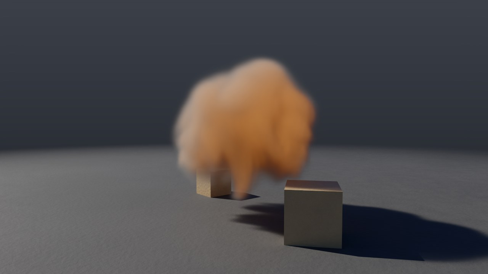
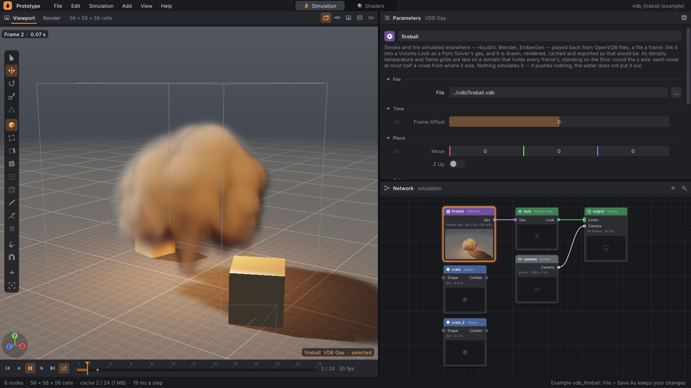
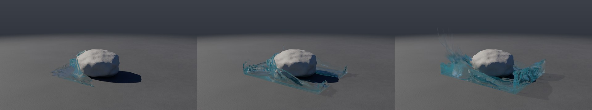

# Čtení OpenVDB

Kouř, oheň a vzdálenostní pole (level sety) si programy předávají
v OpenVDB (`.vdb`): Houdini, Blender, EmberGen, renderery. Prototype ho
zapisoval odjakživa ([cache.md](cache.md)), teď ho i **čte**, bez knihovny
OpenVDB. Dva uzly:
- **VDB Import** (geometrie) dá mřížky jako objemy, nebo rovnou polygony
  jejich povrchu: překážku pro simulaci, tvar zdroje kouře nebo vody;
- **VDB Gas** (simulace) přehraje soubory jako plyn záběru, snímek po
  snímku. Volume Look ho kreslí jako plyn Pyro Solveru, renderuje ho
  viewport, path tracer i Cycles, jde do cache a do exportu do USD
  a Alembicu.



## 1. Rychlý start

```bash
./build/prototype sim vdb_fireball out/fireball.png     # ohnivá koule ze souboru, světlo ohně na bednách
./build/prototype sim vdb_rock out/rock.png --every 15  # proud vody narazí na balvan z VDB
# vlastní export a zpátky: táborák do VDB, pak VDB Gas s File 'out/fire.$F4.vdb'
./build/prototype sim campfire_vdb - --export-node volumes --export 'out/fire.$F4.vdb'
```

V editoru:
- **Shift+A › Geometry › VDB Import:** mřížky ze souboru jako objemy, se
  **Surface** jako polygony;
- **Shift+A › Simulation › VDB Gas:** zapojí se do vstupu Gas uzlu Volume
  Look místo Pyro Solveru.



## 2. VDB Import

Každá mřížka je objem svého jména; vektorová mřížka jsou tři
(`vel.x`, `vel.y`, `vel.z`). Objem má každý voxel krabice, ve které jsou
aktivní voxely mřížky. Neaktivní voxely v ní nesou svou hodnotu, takže level
set má uvnitř zápornou hodnotu, jak ji drží OpenVDB.

| Mřížka | Objem |
|---|---|
| `float`, `double`, `half`, `int32`, `int64` | jeden objem (`density`, `temperature`, `surface`…) |
| `vec3s`, `vec3d`, `vec3i` | tři objemy po složkách |
| třída `level set` | se **Surface** povrch, kde vzdálenost prochází nulou (uvnitř pod ní) |
| ostatní (`fog volume`…) | se **Surface** povrch, kde hodnota prochází **Iso** (uvnitř nad ní) |

Parametry:
- **File:** soubor, nebo číslovaná sekvence (`smoke.$F4.vdb`,
  `smoke.####.vdb`) čtená soubor na snímek. Relativní cesta se čte ze
  složky sítě. Snímek bez souboru je prázdný, s varováním.
- **Grids:** které mřížky číst, jména oddělená mezerou. Prázdné pole
  znamená všechny.
- **Frame Offset:** snímek f čte soubor f + posun (sekvence od 1001 se
  od snímku 1 čte s posunem 1000).
- **Z Up:** svět souboru má osu Z nahoře (Blender). Otočí se kolem X tak,
  aby nahoře bylo Y, a vektory s ním.
- **Max Voxels:** nejvíc voxelů objemu, v milionech. Větší mřížka se
  zprůměruje 2 × 2 × 2 voxely do jednoho (nebo víc), a uzel to nahlásí.
- **Surface**, **Iso:** polygony místo objemů, pro Object (kolize), Pyro
  Source nebo Water Source.

## 3. VDB Gas

Přehrává soubory jako plyn záběru:
- **Mřížky:** hustota (`density`), teplota (`temperature`, v Blenderu
  `heat`) a plamen (`flame`, `flames`, `fire`) se hledají podle jmen;
  platí první, které soubor má. Pára se čte jen z mřížky, kterou uzel
  pojmenuje. Měřítka (**Density Scale**…) převedou škálu jiného programu.
- **Rychlost:** vektorová mřížka `vel` (nebo `v`, `velocity`; jména dává
  **Velocity**), v jednotkách za sekundu, krát **Velocity Scale**. Snímek
  ji drží na blocích 2 × 2 × 2 buněk a renderery podle ní plyn rozmažou
  pohybem ([cycles.md](cycles.md#rozmazání-pohybem)). Soubor bez ní dá
  plyn bez rozmazání.
- **Doména:** při kompilaci sítě se přečtou hlavičky souborů všech snímků
  záběru (jen hlavičky, rychle u souborů libovolné velikosti; mřížka, které
  OpenVDB nezapsalo krabici do metadat, se přečte celá) a doména se udělá
  tak, aby držela všechno. Jako každá doména stojí na podlaze kolem
  osy Y, takže voxely souborů se položí na její buňky: každý se posune
  nejvýš o půl voxelu. Co je pod podlahou, se nekreslí; **Move** plyn
  posune (nahoru, doprostřed scény).
- **Resolution:** nejvíc buněk domény po delší straně (výchozí 512). Když
  by doména byla jemnější, soubory se zprůměrují.
- **Snímky:** snímek f čte soubor f + **Frame Offset**. Snímek bez souboru
  je bez plynu. Soubor, který se změní, se přečte znovu (stejně jako když
  se změní síť).
- Nic se nesimuluje: plyn netlačí kusy, voda ho nehasí, Pyro Upres ho
  nezjemní.

Vlastní export a zpátky je přesný: táborák zapsaný do VDB (Gas Volume,
`--export`) a přehraný přes VDB Gas má v každé buňce stejný half jako
simulace a v každém bloku stejnou rychlost (test), a render přes stejnou kameru (OpenGL) se od simulace liší
nejvýš o 15 z 255 v jasu pixelu, v průměru o 0,3. Rozdíl dělá jen menší
doména (jiné stínování podlahy za ní).



## 4. Co se čte

Čtečka čte soubory tak, jak je čte OpenVDB:
- **Verze souboru 222 až 225:** cokoli zapsalo OpenVDB 1.0 (2013) až 13.
  Starší soubory neumí ani OpenVDB 13. Verze 225 (OpenVDB 13) přidala half
  mřížky, ty se čtou také.
- **Komprese:** zip (zlib) i Blosc (LZ4, LZ4HC, zlib, BloscLZ; s byte
  shufflem i bez, bloky rozdělené po bajtech), aktivní maska (jen aktivní
  hodnoty) i plné uzly, half floaty.
- **Neaktivní hodnoty** všemi sedmi způsoby, jak je OpenVDB zapisuje
  (pozadí, minus pozadí, jedna hodnota, maska mezi dvěma…).
- **Strom:** kořen, vnitřní uzly 32³ a 16³, listy 8³ a dlaždice na všech
  úrovních (jedna hodnota za celý uzel, i 4096³ voxelů v kořeni).
- **Instance:** mřížka, která sdílí strom jiné mřížky, s vlastní
  transformací.
- **Proud bez offsetů** (`io::Stream`): mřížky se čtou jedna za druhou.
- **Transformace:** posun a měřítko voxel po voxelu, i otočení o čtvrt
  otáčky a zrcadlení. Otočenou mřížku nebo voxely, které nejsou krychle,
  čtečka převzorkuje na krychle o hraně nejkratší strany voxelu.

Mřížky, které se nečtou (`bool`, `mask`, `string`, body), a mřížky
v perspektivním kvádru kamery (frustum) uzel jen vypíše. Poškozený soubor
čtečka odmítne s důvodem.

## 5. Ověření

Soubory pro testy zapsala knihovna OpenVDB sama, a čtečka je čte voxel po
voxelu proti pravidlům, podle kterých vznikly:
- **OpenVDB 10.0.1 (pyopenvdb, Blosc LZ4):** kouř a teplota
  (`tests/data/vdb/make_vdb.py`), totéž v half floatech, level set koule,
  dlaždice z `fill`, vektorová mřížka s nekrychlovými voxely, mřížka
  otočená o 30°, instance a dvě mřížky stejného jména, `bool` a frustum.
- **OpenVDB 13.0 (sestavené ze zdrojů, verze souboru 225):** zip s aktivní
  maskou i bez, bez komprese, neaktivní hodnoty všemi způsoby, `double`,
  `int32`, `int64`, `vec3d`, `vec3i`, half mřížka, float uložený jako half,
  otočení o čtvrt otáčky, zrcadlení, dlaždice kořene, proud bez offsetů
  (`tests/data/vdb/make_vdb13.cpp`).
- **Blosc:** dekompresor dekódoval všech 5376 rámců, které vyrobila
  c-blosc 1.21 (python-blosc) přes kodeky, shuffle, velikosti typů, úrovně
  a bloky, bajt po bajtu; 126 tisíc poškozených variant odmítl nebo
  dekódoval bez pádu (pod ASan). Šest takových rámců je v
  `tests/data/blosc` (`make_blosc.py`).

Testy — `tests/test_vdb_read.cpp` (22):
- rámce Blosc z c-blosc a rozdělené bloky;
- všechny soubory výše, hodnota po hodnotě;
- `vdbGrids` jen z hlaviček, průměrování velkých mřížek, výběr podle jmen,
  osa Z nahoru;
- zpětné čtení vlastního zápisu; poškozené soubory odmítnuté bez pádu;
- uzly VDB Import (objemy, povrch level setu, sekvence) a VDB Gas
  (doména, snímky, přehrání ve WorldSolveru, změna souboru), export
  a přehrání táboráku bit po bitu, i s rychlostí.

## 6. V kódu

| Soubor | Co dělá |
|---|---|
| `src/pg/io/VdbRead.cpp` | Čtečka: hlavička, deskriptory, metadata, transformace, strom, hodnoty; hustý objem ve světě (`readVdb`, `parseVdb`), hlavičky (`vdbGrids`) |
| `src/pg/io/Blosc.h` | Dekomprese rámců Blosc 1 (BloscLZ, LZ4, zlib, shuffle) |
| `src/pg/io/Lz4.h` | Bloky LZ4 (sdílené s USD) |
| `src/pg/nodes/Vdb.cpp` | Uzel VDB Import (`vdbimport`) |
| `src/pg/sim/VdbGas.h` | Doména ze souborů záběru a plyn snímku z jeho souboru |
| `src/pg/sim/World.cpp` | Přehrávání místo simulace plynu |
| `src/pg/sim/Network.cpp` | Uzly `vdb_import` a `vdb_gas` |
| `examples/vdb/make_vdb.py` | Jak vznikly soubory příkladů (prototype + pyopenvdb) |
| `tests/data/vdb/make_vdb.py`, `make_vdb13.cpp` | Testovací soubory z OpenVDB 10 a 13 |

## 7. Omezení

- **Zápis** zůstává bez komprese: float mřížky a vektorová `vel`
  ([cache.md](cache.md)).
- **Rychlost** se čte jen z vektorové mřížky (`vec3s`, `vec3d`). Tři
  float mřížky se složkami zvlášť VDB Gas jako rychlost nevezme.
- **Doména** stojí na podlaze kolem osy Y; plyn daleko od ní dělá velkou
  doménu (řídkou, ale s hustými převody při exportu). **Move** ho přiblíží.
- **Hustý objem:** VDB Import drží každý voxel krabice aktivních voxelů,
  proto **Max Voxels**. Snímky VDB Gas drží jen dlaždice 8³, ve kterých plyn
  je, při čtení se ale každá mřížka na chvíli rozbalí do celé krabice.
- **Snímek VDB Gas** se čte celý, i když se z něj kreslí jen část.
