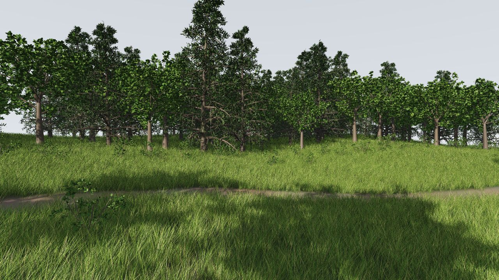
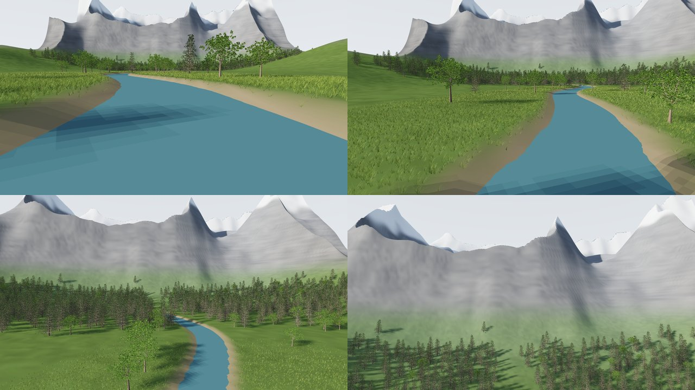
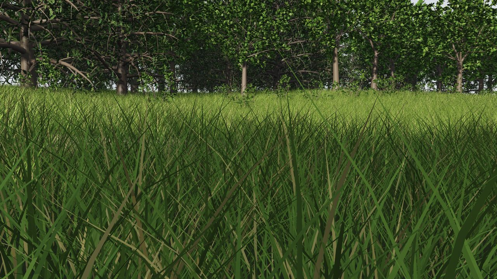
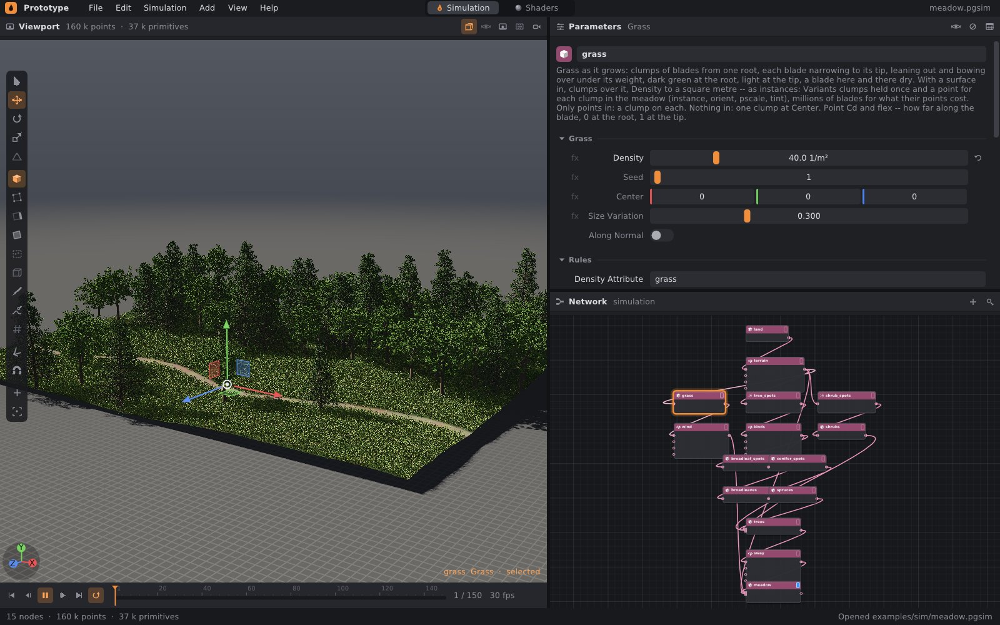
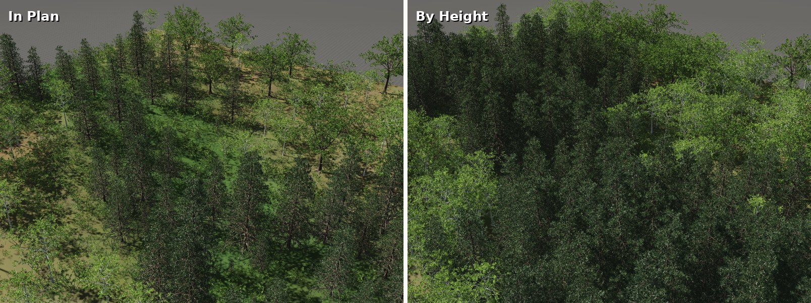
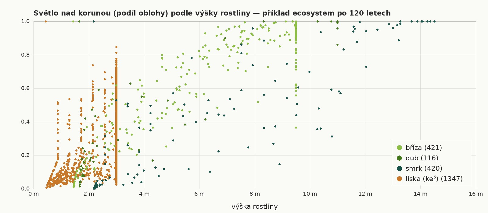
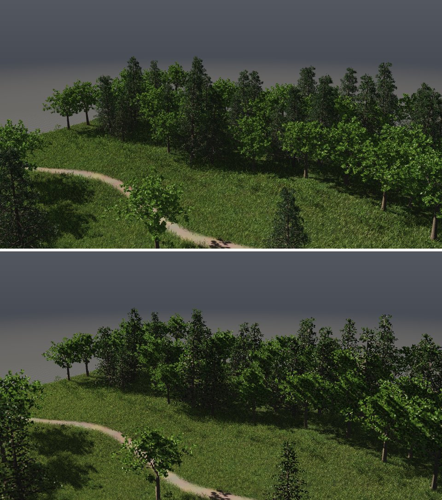

# Vegetation: grass, shrubs and trees as instances

A meadow has millions of blades and a forest thousands of trees. If every blade
were its own geometry, it would not fit in memory and the viewport would not
budge. That is why each plant is grown only once and is represented in the
landscape by a point. Such a point is called an **instance**. The point says
which plant stands on it, how it is rotated, how large it is and how it is
tinted. The plant it represents is called the **prototype**. The viewport
draws instances with GPU instancing: the prototype is on the graphics card
once and is drawn as many times as there are points representing it.
The whole goes to USD as a PointInstancer, and to OBJ and PLY as copies.

The **meadow** example is a meadow at the edge of a forest in the wind:
122,577 grass clumps (over 1.9 million blades), 84 trees and 65 shrubs. All of
it is held by 21 prototypes and 160 thousand points.



```bash
./build/prototype --example meadow                  # meadow by the forest in the wind: Play
./build/prototype cook meadow - --start 1 --end 3   # how many points and how long
./build/prototype cook meadow louka.usda            # to USD as a PointInstancer
./build/prototype sim meadow - --frames 48 --export shot.usda   # shot in the wind to USD
```

The **river_flight** example flies over a meadow along a river up to the
mountains: a valley 900 m by 1.5 km from one Grid and one wrangle — the river
in its own bed, rolling meadow, hills at the sides, ridged mountains with rock
and snow, the far end hazier — 126,941 grass clumps along the river, 118
broadleaves on its banks and 941 spruces in a wood at the mountains' foot. The
river is a strip at one level along the same line as its bed, ending where the
bed rises out of it. A keyed camera follows the river's bends low over the
water and climbs as the mountains come up, 240 frames; the viewport plays it,
drawing only the copies the camera sees (section 9).



```bash
./build/prototype --example river_flight            # the flight: Play
./build/prototype sim river_flight out/flight.mp4 --renderer gl   # as a video
```

## 1. Instances

A point with the integer attribute `instance` = k (0 or more) represents
prototype number k of its geometry. Prototypes are geometries that the geometry
holds once. Copies of the geometry share them and do not copy them. Where a
prototype stands is determined by the point's attributes, just as with
**Copy to Points**:

| Attribute | What it does |
|---|---|
| `P` | where the prototype's origin goes |
| `orient` | how the prototype is rotated: quaternion x, y, z, w. Without it, the prototype's +y is rotated to `N`; without `N`, it is not rotated |
| `pscale` | how large it is; 1 without it |
| `tint` | what the prototype's colors are multiplied by: one grass clump slightly yellower than another |

The point color `Cd` does not color the instance. Points scattered over a
colored terrain carry the terrain's color, and the grass on them should stay
green. A point with `instance` −1, or without this attribute, is an ordinary
point.

Instances pass through the network like any other geometry:

- **Merge** concatenates prototypes. The prototypes of the second geometry go
  after those of the first, and the `instance` numbers of its points are offset
  by their count. Geometry that does not have the `instance` attribute gets −1.
  Instances that lack `pscale` or `tint` get 1, not zero, so they neither
  disappear nor turn black.
- **Transform** moves, rotates and scales instances like their copies:
  it rotates `orient` and multiplies `pscale` by the scale. With non-uniform
  scale it uses the closest rotation and the average scale, because instances
  do not deform. A point oriented only by `N` gets an `orient` that rotated it
  that way. If the prototype were simply re-oriented to the rotated `N`, it
  would turn about it.
- **Unpack** turns instances into copies, i.e. geometry that all nodes can
  modify. It first keeps whatever is not an instance, then adds copies of the
  prototypes one after another, each on its points in their order. Tint
  multiplies the colors of the copies.
- A Wrangle sees instances as points. It changes `p@orient`, `@pscale` or
  `v@tint`, and the prototypes stay shared (wind, below).

The viewport does not draw instances as dots. It uploads each prototype once
and draws it in a single call as many times as there are points representing
it, including in the shadow map. Each instance takes 48 bytes (position, scale,
rotation, tint). When only the points move, as in the wind, only this is sent
to the GPU. The bounding box for shadows and framing is computed from the
corners of the prototype's bounding box placed on each point.

## 2. Grass: the Grass node

The **Grass** node grows grass clumps. A clump is a group of blades from one
root. Each blade is a strip that tapers to a tip. It leans away from the center
of the clump and bends under its own weight, the more so the higher up. It
twists slightly around itself. It is dark green at the root, lighter towards
the tip, and here and there one is dry.



**With a surface input**, the node scatters clumps over its polygons,
**Density** per square meter, following the rules of the Scatter node
(Density Attribute, Max Slope, section 3). Each clump is an instance of one of
**Variants** variants, which the node grows once. Which variant a point gets
is determined by its `id`, otherwise by its index, and by Seed. The point also
gets:

- `orient`, i.e. a random rotation about +y, because grass grows vertically
  even on a slope. With **Along Normal** it grows out of the surface along `N`,
  for example moss on a wall.
- `pscale`: Size Variation more or less, times the surface's own `pscale`.
- `tint`: Variation, i.e. a clump slightly lighter, darker or yellower.

**With only points on the input** (no polygons), a clump grows on every point.
**Without an input**, the output is a single clump at **Center**, as geometry.
With **Instances** turned off, the output is copies. Any node can modify them,
but they are as heavy as all their blades.

| Parameter | What it does |
|---|---|
| **Density** | clumps per m² of surface (default 50) |
| **Seed** | a different number, different locations and different clumps |
| **Size Variation** | how much the clumps differ in size |
| **Along Normal** | grow along the surface normal instead of vertically |
| **Density Attribute** | a surface point attribute from 0 to 1: what fraction of the clumps at a location grows. 0 means a path, 1 a full meadow |
| **Max Slope** | grass does not grow on faces steeper than this angle from horizontal (default 45°) |
| **Blades** | blades per clump (16) |
| **Height**, **Height Variation** | blade length (0.4 m; lawn 0.08, tall grass 1) and how much it varies |
| **Width** | blade width at the root (6 mm) |
| **Bend** | how much the blades bend: 0 straight, 1 tip horizontal |
| **Lean** | the greatest lean away from the clump center (30°) |
| **Spread** | how far from the clump center the roots are (8 cm) |
| **Segments** | segments along the blade: more is a smoother curve, fewer is a lighter field in the distance |
| **Root Color**, **Tip Color** | color at the root and at the tip |
| **Dry**, **Dry Color** | fraction of dry blades (spring 0, late summer 0.5) and their color |
| **Variation** | how much the blades and clumps differ in shade |
| **Variants** | how many different clumps are grown |
| **Instances** | points with prototypes (on), or copies |

The clump prototype has point `Cd` and `flex`, i.e. how far along the blade the
point is (0 at the root, 1 at the tip), vertex `uv` (u once across the width of
the blade, v from 0 at the root to 1 at the tip) and primitive `blade`. By `uv`,
a grass image from the library (`examples/textures/grass`: a central vein
and stripes along it) goes onto the blade, in Cycles and in the path tracer.
The roots sit slightly below the ground (0.6 Spread, at most a fifth of the
height). A clump on a slope stands vertically, and its uphill roots must not
hang in the air.

## 3. Scatter: rules

**Scatter** scatters points in proportion to area, deterministically by Seed
and identically on any number of threads. New rules:

| Parameter | What it does |
|---|---|
| **Mode** | Count: Count points over the whole surface. Density: Density points per m², so more area gives more points |
| **Density Attribute** | an input point attribute from 0 to 1, painted (Attribute Paint) or from a wrangle: what fraction of the points at a location remains |
| **Max Slope** | no points on faces inclined more than this angle from horizontal (180 = anywhere) |
| **Min Distance** | no point closer than this distance to a point that remained before it: trees that keep their distance |

Min Distance is computed point by point in order, with a grid of cells as large
as the distance. That is why it is deterministic. The Grass node uses Scatter
with the same rules.

## 4. Copy to Points: instances and variants

**Copy to Points** has two new parameters:

- **Instance**: the output is not copies but points, each of which represents
  what would have been copied onto it. Unpack turns them into exactly those
  copies.
- **Piece Attribute**: a primitive attribute of the geometry (integer or
  string) splits it into pieces, one piece per value. A point gets a piece
  according to its attribute of the same name. A point without it gets a piece
  according to its index. That is how eight different stones or clumps go onto
  points.

A point's `tint` multiplies the copy's colors. A point's `Cd` replaces the
copy's colors as before (only in copies; it does not color instances).

## 5. Trees and shrubs as instances

Tree has an **Instances** output. It grows **Variants** trees (default 8),
namely the trees that would have grown on the first points. Each point then
represents one of them: chosen by `id`, otherwise by index, rotated about +y,
sized by `pscale` and Size Variation, and with its own shade (`tint` by
Variation). A forest of thousands of trees thus costs as much as eight trees
and a thousand points. Without points, the output is a single instance at
Center, the same tree as the Mesh output.

A shrub is a Tree that branches right at the ground: Forks 5, Fork Height 0.03,
Fork Angle 38°, Crown 0.02, two levels of branches and small leaves (the
meadow example, node `shrubs`).

## 6. Wind on instances

Wind is produced by the **Plant Wind** node ([trees.md](trees.md#5-wind)). On
instances, it pre-bends each plant into several shapes (8 directions × 4 steps)
and redirects each point to the nearest shape in the plant's own orientation.
It makes up the rest of the bend by tilting `orient`. The blades thus bend
along their length, not just as a whole clump, and the same way in the
viewport, in both renderers and in USD. Only the points' `instance` and
`orient` change. Positions and the other attributes stay shared with the
input, and the pre-bent shapes are the same objects frame after frame, so the
viewport has them on the GPU once. With **Dynamics**, each plant on a point is
a spring that lags behind a gust and oscillates out
([trees.md](trees.md#dynamics-branches-as-springs)).

### Trampling: Plant Trample

The **Plant Trample** node bends grass and shrubs where something steps: feet,
wheels, a body that has fallen. The second input is the step points: `pscale`
times **Radius** is the width of the footprint, `time` is when (a character's
footprints over time). Plants within the radius bend from the base away from
the center of the footprint, by **Flatten** (70°) in the middle and not at all
at the edge. After being stepped on they straighten up again over **Recovery**
seconds (to a third of the bend in that time; 0 = they stay flattened).
Footprints with a time in the future have no effect yet. On instances it works
as with wind: pre-bent shapes (Directions × Steps) and making up the rest by
tilting, so only the points change. Test: clumps near a footprint bend away by
6.7 cm on average, distant ones not at all, nothing before the step, and after
40 s they are straight again.

## 7. The meadow example

[examples/sim/meadow.pgsim](../examples/sim/meadow.pgsim):

- The **Grid** `land` of 80 × 60 m (220 × 170 points) is raised by the Point
  Wrangle `terrain` with noise into gentle waves that rise towards the forest
  at the back. The wrangle also colors the terrain and paints three attributes
  from 0 to 1 onto it: `grass` (0 on a path winding across the meadow; the grass
  thins out towards its edges and in the forest), `trees` (forest 7 to 13 m
  beyond the meadow and the occasional tree in the meadow) and `shrubs` (a band
  along the forest edge).
- **Grass** `grass` scatters 40 clumps per m² over the terrain according to
  `grass`, not on slopes over 40°. This produces 122,577 clumps in eight
  variants, over 1.9 million blades. The wrangle `wind` bends them in the wind.
- **Scatter** `tree_spots` (Density 0.08 per m² according to `trees`, Min
  Distance 3.5 m) gives the locations for trees. The Point Wrangle `kinds` and
  two **Blasts** split them into broadleaf trees and spruces: **Tree**
  `broadleaves` (5 variants) and `spruces` (4 variants), both with Output
  Instances. This produces 45 broadleaf trees and 39 spruces.
- **Scatter** `shrub_spots` according to `shrubs` and **Tree** `shrubs`
  (shrubs, 4 variants): 65 shrubs.
- **Merge** `trees` combines the trees with the shrubs, and the Point Wrangle
  `sway` sways them. **Merge** `meadow` combines the terrain, grass and trees.
  The result has 21 prototypes and is displayed.

The example is a model without a camera or Output node. The images above are
from a copy of it with an added camera and an output with sun and sky (Sky
Behind).



## 7b. Ecosystem

The **Ecosystem** node lets a plant community grow over years, following the
model of Deussen et al. (1998). Up to four species, each with its own
parameters:

| Parameter | What it does |
|---|---|
| **Share** | how many there are at the start relative to the others |
| **Crown** | crown radius of a mature plant (how much it shades) |
| **Growth**, **Life** | how many years to maturity, how many years it lives (±20 %) |
| **Shade Tolerance** | how it tolerates the shade of others: 0 withers under a crown, 1 keeps growing |
| **Moisture**, **Moisture Range** | how moist a soil it prefers and how far from that it still thrives |
| **Seed Distance**, **Seedlings** | how far seeds fall and how many seedlings emerge per year |
| **Height**, **Crown Depth**, **Leaf Density** | By Height only: how tall the mature plant is, how deep the crown reaches (fraction of the height) and how many m² of leaves it has above each m² of ground under the crown |

Year after year, plants age and grow, decline where the soil does not suit
them, die of old age, and mature plants seed around themselves. A seedling
emerges at the nearest free location, not where it would not thrive. How
plants shade each other is set by **Light**:

- **In Plan** (default, as in Deussen). Where crowns meet in plan view, the
  smaller one suffers according to how much they overlap and how poorly it
  tolerates shade (shade-tolerant ones a quarter less, but they still suffer).
  A plant grows according to its age. Under another plant's crown, a seedling
  emerges only according to its shade tolerance.
- **By Height** (like the forest gap models JABOWA and SORTIE). The crown of
  each plant is an ellipsoid of foliage, as tall and wide as the plant has
  grown. It reaches from (1 − Crown Depth) of its height to the top and has
  Leaf Density times the ground area beneath it in leaves. The light of an
  overcast sky (luminance 1 + 2 cos of the angle from the zenith) comes from
  the zenith and from two rings of eight directions, 40° and 70° from the
  zenith, with weights 0.22, 0.53 and 0.25 according to how much the given part
  of the sky illuminates flat ground. Foliage attenuates it as e^(−0.5 L),
  where L is the leaf area a ray meets per m² of its cross-section. Foliage
  lies in the cells of a grid (half the narrowest crown, 0.5 to 2 m) and rays
  march through them. A plant grows as fast as the light above its crown
  allows, at full speed from the light it needs: 0.65 of the sky without shade
  tolerance, 0.05 with full tolerance. With less light it declines, a
  shade-tolerant one more slowly. A seedling emerges with a probability given
  by the light 0.5 m above the ground. A tall crown therefore shades the low
  ones beneath it, whether it is larger or smaller. Shade-tolerant seedlings
  wait under the crowns and grow up where a tree falls. Shrubs live under the
  trees as understory.

The locations are the input points (Scatter over the terrain as densely as
plants could stand), and moisture is taken from their **Moisture Attribute**.
The output is a point on every living plant with `species` (0 to 3), a species
group (`species1` to `species4`), `age`, `pscale` (0.15 seedling, 1 mature),
`orient` and `id` (location number). By Height also gives `light`, the fraction
of the sky above the crown in the last year. Trees are then grown on the groups
with the Tree node. Its Height should match the species' Height, because both
are scaled down by `pscale` in the same way. The same settings and seed give
the same community on any number of threads.

Default species: **pioneer** (birch: grows fast, lives briefly, does not
tolerate shade, dry soil, light crown), **giant** (oak: slow, long-lived,
dry soil), **shade-tolerant** (spruce, beech: tolerates shade, moist soil,
dense crown down to the ground) and the disabled **shrub** (hazel: 3 m,
tolerates shade, lives 40 years).

The **ecosystem** example: hilly ground with a stream, 2588 locations, four
species, By Height. After 120 years 2304 plants are growing: 421 birches (soil
moisture 0.30 on average, 17 years, light 0.81), 116 oaks (0.18; 76 years;
0.79), 420 spruces (0.82; 55 years; 0.82) and 1347 hazels (0.26; 14 years;
0.31). Spruces line the stream, oaks stand on the dry ridges, birches fill in
the gaps left by fallen trees and hazels grow beneath them in the shade. In
Plan gives 2376 plants in the same location, but only 157 birches, 34 oaks and
181 spruces among 2004 hazels. The smaller crown in plan view always loses,
even a shrub that tolerates shade, so the trees do not leave room for shrubs
between them. It cooks in 2.0 s, In Plan in 0.7 s.





Tests (`tests/test_plants.cpp`): a solitary oak (11 m) lets 0.27 of the sky
through under its crown to a seedling, 0.83 to the edge of the crown, and 1 in
the open. On ground with a stream (2601 locations, 100 years), 86 % of the
hazels stand under a taller crown with light 0.24, while the trees have 0.74
to 0.80. In deep shade (below 0.1), 18 % of the spruces wait, 4.7 years old on
average, but only 7 % of the birches, 1.9 years old. The result is the same on
one and on four threads.

## 8. Export

- **OBJ and PLY** (`prototype cook`, `geo.save`, Export Geometry
  in the editor) receive instances as copies, the same as from Unpack. Watch
  the size: the grass from the meadow example unpacked is 17.7 million points
  and 7.8 million polygons, whereas as instances it is only 122,577 points.
- **USD** (`.usda`) receives a **PointInstancer** `instances` next to the mesh
  of the rest of the geometry. Under it is a scope `Prototypes`, containing each
  prototype (`proto_0`, `proto_1`…) as geometry, including nested instances.
  The instancer gets the `prototypes` relationship and the arrays
  `protoIndices`, `positions`, `orientations` (quath), `scales`,
  `primvars:tint` and `ids` (from `id`), and an `extent` over the placed
  prototypes. In a shot (`prototype sim
  --export shot.usda`) the prototypes are in the stage once. What changes,
  i.e. the orientation in the wind, goes into a layer per frame (value clips,
  like other geometry). The USD library (pxr) places instances where the
  copies from Unpack are, with a deviation of up to 0.23 mm, because
  `orientations` are in half precision (test `tests/python/test_instances.py`).
- Zero normals, `orient`, `pscale` and `tint` that Merge added to the terrain
  from the instance points are not written. The renderer would turn the
  terrain black because of them.
- **Python**: `geo.prototypes` (a list of `pg.Geometry`), `geo.instance_count`,
  `geo.add_prototype(g)` (returns the number for `instance`),
  `geo.clear_prototypes()` and `geo.unpack()` ([python.md](python.md)).

## 9. Performance

On this machine (release, all threads):

| What | Time |
|---|---|
| the whole meadow, first frame (terrain, 122,577 clumps, 13 tree and shrub variants, pre-bending 312 shapes for wind) | 453 ms |
| next frame in the wind (only Plant Wind `wind`, `sway` and Merge) | 57 ms |
| Grass: scatter 192,000 candidates, thin out, 8 clumps | 35 ms |
| Unpack the grass to 17.7 million points | 2.6 s |

Rendering a 1600 × 900 frame through software OpenGL (llvmpipe, without a
graphics card) takes 11 s including cooking the network. The viewport must
first upload 333 plants (21 grown ones and their wind-bent shapes), each in
four levels of detail, with leaf and grass images (alpha cutout and mipmaps on
the CPU). Subsequent frames send only the new placements. On a graphics card
it is a fraction of that.

**Levels of detail (LOD).** The viewport draws each copy of a plant according
to how large it appears: the radius of the prototype's box times `pscale`
divided by the distance from the eye.

| Appears | Drawn as |
|---|---|
| above 0.04 | complete |
| 0.012–0.04 | a third of the leaves and blades (0.35) |
| 0.005–0.012 | an eighth (0.12), without twigs |
| 0.0015–0.005 | billboard |
| below 0.0015 | not at all |

Around each boundary (±20 %) a copy is in both levels at once. Each draws only
part of the pixels according to screen-space dithering, together all of them.
A plant thus transitions smoothly from one level to the next, without popping.
It fades out in the distance the same way.

A sparser plant is made by `plantDetail` (`src/pg/core/Lod.h`), the way
SpeedTree does it. It evenly selects leaves and blades (faces with
`translucency` above 0; a blade is all the faces of one `blade`). Each kept
leaf is enlarged by 1/√fraction about its base and each blade widened by
1/fraction, so the foliage covers the same area as before (tree: 2133 leaves
11.98 m², 746 leaves 12.02 m²). Below one half, the twigs (`level` 2 and up)
disappear.

**Billboards.** The last level is a card turned towards the eye about the
vertical axis. It shows an image of the plant from the side the eye sees it
from: eight views all around, 128 × 128 texels each. The viewport captures them
itself when it first receives the prototype. The image is not a color but the
viewport's G-buffer: normal, color, translucency. The billboard is therefore lit
like geometry, the normals rotate with the copy and the color is tinted by its
`tint`. The shadow is cast by the eighth-detail plant, not the card.

The copies are redistributed among the levels when the eye moves by 10 cm. The
meadow viewed from 50 m from its edge: 22.1 million triangles at full detail,
11.1 million drawn (50 %); 86 complete copies, 63,790 third-detail, 111,933
eighth-detail and 6,762 billboards (blending copies counted twice).



**What the camera does not see is not drawn.** Each time the view changes,
the copies of every level are sorted, those whose ball (the prototype's
radius round its middle, scaled with the copy) reaches into the camera's
frustum first; the camera draws those, the sun's shadow map all of them, so
a tree outside the view still casts its shadow into it. The picture is the
same to the pixel. Standing on the meadow's path, 36 % of its 122,726 copies
are in view; in the viewport (llvmpipe, 2560 × 1440) a frame close up took
0.59 s instead of 1.2 s. Sorting the copies again takes about 5 ms on four
threads — shared out among the prototypes, a plant bent by the wind being
several — and sending them about as long.

Cycles and the path tracer draw everything at full detail; instances cost them
no memory.

## 10. What is still missing

- Interaction with simulation bodies directly (currently footprints as points
  with a time).
- Ecosystem: herbs as another layer, sun from a specific direction (By Height
  computes with an overcast sky), succession after fire or windthrow.
