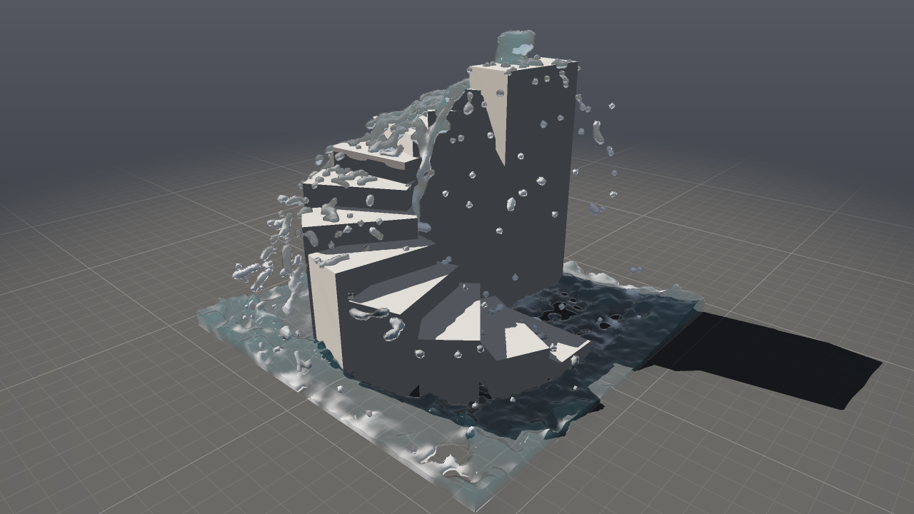

# Wrangle: a language for computing over geometry

A wrangle is a node you write code into. The code runs for each point, primitive
or vertex of the geometry, or once for the whole geometry. The language resembles VEX
from Houdini: C-like syntax, types, variables, loops, user functions and about a hundred
built-in functions. It reads and writes attributes, looks at neighbors, reaches into
other inputs, and can build as well as delete geometry.



```c
// Point by point: raise by noise, color by height.
float h = 0, amp = 1;
vector p = @P * ch("frequency");
for (int i = 0; i < 5; i++) {      // fractal noise: five octaves
    h += amp * (noise(p) - 0.5);
    p *= 2;
    amp *= 0.5;
}
@P.y = h * ch("height");
@Cd = lerp({0.2, 0.35, 0.1}, {0.9, 0.9, 0.95}, fit(@P.y, 0, 0.3, 0, 1));
```

## 1. Quick start

- **In the editor:** Tab (in the network) or Shift+A (in the viewport) → *Point
  Wrangle*, *Primitive Wrangle* or *Detail Wrangle*. Code is written into the
  *Snippet* field and applied when you click elsewhere. An error shows on the node
  in red, with line and column, a warning in yellow, and `printf()` output below the
  parameters.
- **Parameters from code:** `ch("height")` in the code turns *height* into a slider below
  the snippet (`chi` integer, `chv` vector, `chs` string). The values are saved
  in the network file and can be animated with keys like any other parameter.
- **Example:** `./build/prototype --example spiral_stairs` — a Detail Wrangle
  builds a spiral staircase (a user function `stair()` for one step, a loop
  rotates them around the center, `ch()` provides the *steps*, *rise*, *turn* sliders)
  and water runs down it.

## 2. Nodes

| Node | Runs | Typical use |
|---|---|---|
| **Point Wrangle** | for each point | displacement, color, attributes, neighbors, deleting points |
| **Primitive Wrangle** | for each primitive; `@P` is its center | face color, deleting faces, computations over vertices |
| **Detail Wrangle** | once for the whole geometry | building geometry (`addpoint`, `addprim`), sums, detail attributes |

All three are the same node with a different default **Run Over** (Points,
Primitives, Vertices, Detail), which can be switched. **Group** restricts the run to
the elements of one group — or to elements matching a pattern: numbers and ranges `0-9 12`, edges
`p3-4`, `*`, `^` subtracts ([editing.md](editing.md#7-element-patterns)); Tab in the
viewport fills it with the selected elements. The node has **four inputs**: the first is the geometry it
runs over and modifies, the other three are read-only (`point(1, "P", i)`,
`@opinput1_P`, `npoints(2)` …).

## 3. Language

### Types

| Type | Example |
|---|---|
| `int` | `int n = 3;` — 32 bits, overflow wraps around |
| `float` | `float t = 0.5;` |
| `vector2`, `vector`, `vector4` | `vector c = {1, 0.5, 0};`, `set(x, y, z)`, `vector4 q = quaternion(M_PI, {0, 1, 0});` |
| `matrix3`, `matrix` | `matrix3 m = ident(); rotate(m, M_PI / 4, {0, 1, 0});` |
| `string` | `string s = sprintf("piece%d", @ptnum);` |
| array | `int list[] = {3, 1, 2};`, `vector pts[];`, `string names[] = split("a b c");` |

A number with a decimal point is a `float`, without one an `int`. In arithmetic an `int` automatically becomes
a `float`, and a `float` becomes a vector (the same number in all components):
`@P * 2`, `@Cd = 0.5`.

### Variables, conditions, loops, functions

```c
int n = 0;
for (int i = 0; i < 10; i++) {
    if (i == 3) continue;
    if (i == 7) break;
    n += i;
}
foreach (int pt; neighbours(0, @ptnum)) n++;
foreach (int i; vector p; pts) { ... }      // i is the index
while (n > 0) n--;
do { n++; } while (n < 5);

float twice(float x) { return x * 2; }   // functions anywhere in the code
void bump(int k) { k += 5; }             // modifies the variable it receives -- as in VEX
```

`return;` in the main code ends the run for the current element. Functions must not call
themselves (recursion). Parameters are written as in C (`float a, float b`), or
as in VEX (`float a, b; vector c`).

### Operators

`+ - * / %`, comparisons `== != < <= > >=` (vectors and strings `==`, `!=`),
`&& || !`, bitwise `& | ^ ~ << >>` on `int`, `?:`, `= += -= *= /= %=`,
`++ --`. Vectors are computed component-wise; `vector * matrix3` rotates,
`vector * matrix` transforms a point; `+` concatenates strings.

**Division is always floating-point:** `7 / 2` is `3.5` (as in Python 3, not as
in C and VEX). It is truncated to `3` only when stored in an `int`: `int k = 7 / 2;`.
Division by zero gives zero, not infinity.

### Attributes

| Syntax | Meaning |
|---|---|
| `@P`, `@Cd`, `@pscale` | an attribute of the element the code runs for |
| `i@id`, `f@mass`, `v@dir`, `u@st`, `p@orient`, `s@name` | the type, when the attribute is being created: int, float, vector, vector2, vector4, string |
| `@group_top` | membership in the group `top` (0 or 1); writing it creates the group |
| `@opinput1_P` | P of the same element from input 1 |
| `@ptnum`, `@primnum`, `@vtxnum`, `@elemnum` | element number |
| `@numpt`, `@numprim`, `@numvtx`, `@numelem` | counts |
| `@Time`, `@Frame`, `@TimeInc` | time in seconds, frame, frame duration |

- An attribute that does not exist yet **is created by writing it**. Its type comes from the prefix,
  otherwise from Houdini conventions (`P N v Cd up` vectors, `orient` vector4,
  `id` int, `name` string), otherwise from what is first written to it
  (`@dir = {1, 0, 0}` is a vector). An integer without a prefix is stored as a
  `float` (`@count = 1`); an integer attribute needs `i@`.
- Reading an attribute that does not exist gives zero. A Point Wrangle can also read a detail
  attribute; when running over vertices (Run Over: Vertices) it also reads attributes of the point
  and primitive the vertex belongs to.
- In a Primitive Wrangle, `@P` is the primitive's center (read-only).

### Parameters and time

`ch("name")` (also `chf`), `chi`, `chv`, `chs` read a parameter of the node that the code
itself created (see above). The same language also computes **parameter expressions**
of any node — `$F * 0.1`, `ch("../box1/sizex") * 2` — see
[animation.md §7](animation.md#7-expressions). `$F` is the frame number, `$T` the time in seconds, `$FPS`
the frame rate. A node that reads `$F`, `@Time` or an animated parameter
is cooked again on every frame; others only when something changes.

## 4. Built-in functions

| Group | Functions |
|---|---|
| Math | `sin cos tan asin acos atan atan2 sinh cosh tanh exp log log10 sqrt pow abs sign floor ceil round rint frac trunc min max clamp lerp fit fit01 fit10 fit11 efit smooth smoothstep step fmod radians degrees`, constants `M_PI M_TWO_PI M_PI_2 M_E M_SQRT2` |
| Vectors | `length length2 normalize dot cross distance distance2 reflect avg sum`, `set()`, `vec3()` |
| Noise and randomness | `noise` (0 to 1; into a vector it gives three different values), `curlnoise`, `rand`/`random` (the same number for the same seed, always and everywhere) |
| Strings | `sprintf itoa atoi atof strlen len concat toupper tolower startswith endswith find replace strip split join match` |
| Arrays | `len append push pop insert removeindex removevalue resize find sort argsort reverse slice isvalidindex min max sum avg array()`; a negative index counts from the end |
| Matrices, quaternions | `ident transpose invert determinant rotate scale translate dihedral lookat quaternion qmultiply qrotate qinvert qconvert slerp eulertoquaternion` |
| Reading geometry | `point prim vertex detail npoints nprimitives nvertices primpoints primpoint primvertexcount primvertex vertexpoint vertexprim vertexprimindex pointprims pointvertices neighbours neighbourcount nearpoints nearpoint pcfind inpointgroup inprimgroup expandpointgroup expandprimgroup npointsgroup nprimitivesgroup haspointattrib hasprimattrib hasvertexattrib hasdetailattrib getbbox_min getbbox_max getbbox_center getbbox_size relbbox prim_normal primarea primcentroid` |
| Modifying geometry | `addpoint addprim addvertex removepoint removeprim setpointattrib setprimattrib setvertexattrib setdetailattrib setpointgroup setprimgroup geoself` |
| Output | `printf warning error` |

- `point(1, "P", i)` returns the type the attribute has; the name and the input are looked up
  once per run, not for each element.
- `nearpoints(0, @P, 0.5)` returns points within a distance of 0.5, nearest first
  (equal distance: by point number), `nearpoints(0, @P, 0.5, 8)` at most
  eight. It is built on a k-d tree that is constructed once per run.
- `addprim(0, "poly", a, b, c)` a closed polygon, `"polyline"` an open
  line; points also as an array: `addprim(0, "poly", pts)`.
- `setpointattrib(0, "mass", pt, 1.0, "add")` — modes `set add min max mult`.

## 5. How it runs

- **In parallel, or in order.** Code that touches only its own element runs
  in blocks on all cores. Code that calls `addpoint`, `removepoint`,
  `setpointattrib`… or writes a string attribute runs in order on a single
  thread. A Detail Wrangle always runs once.
- **Geometry changes wait until the end of the run.** New points and primitives,
  `set…attrib` and deletions are applied only after the last element, in the order in which
  the code requested them. Each element therefore sees the geometry as it came in:
  `@numpt` does not change during the run, and `point(0, …)` reads the input, not what the code has already
  written. The number returned by `addpoint` is valid for `addprim` and
  `setpointattrib` in the same run.
- **The result does not depend on the number of threads.** `rand` and `noise` hash the value,
  not the order of computation, blocks are split only by element count, and changes are ordered
  by element. A test on 1 and 4 threads verifies this.
- **Speed:** a typed-tree interpreter. On 4 cores it handles pure
  arithmetic over a million points in 37 ms (27 Mpoints/s), noise in 26 ms. The first,
  simple language without variables and loops was 10 % (arithmetic) to
  25 % (noise) faster on the same machine. The interpreter is to be replaced by a JIT
  ([ROADMAP.md §5](../ROADMAP.md#5-later)).

## 6. Errors

- Syntax: `line 3, col 12: expected ';'` — right while typing; the node passes the geometry
  through unchanged.
- Types: `cannot turn a string into a float`, `unknown variable 'hieght'`,
  `@ptnum is read only` — at cook time, with the line.
- `error("…")` stops the run with a message; `warning("…")` adds a warning;
  `printf("…")` writes below the node's parameters (the first twelve lines).
- `ch("x")` of a parameter that does not exist gives zero and a warning.

## 7. Differences from VEX

- Integer division is floating-point (see above).
- No recursion, no `#include`, `export` or `struct`.
- Array and matrix attributes are not supported yet (arrays and matrices only as variables).
- `removepoint` also deletes the primitives that used the point; `addvertex` only into
  a primitive the code created itself; `pcfind` searches only by `P`.
- `xyzdist`, `primuv`, `intersect` and other surface queries are missing (they will come
  with the Ray and Attribute Transfer nodes).
- Numbers from `rand` and `noise` differ from Houdini's (a different hash, value
  noise instead of Perlin).

## 8. In the code

| File | What it does |
|---|---|
| `src/pg/lang/Lang.h` | public API: `Program` (snippet), `Expression` (parameter expression), `Host` (`ch()`, `$F`) |
| `src/pg/lang/Parse.cpp` | lexer, parser, checking of function names and argument counts |
| `src/pg/lang/Check.cpp` | type checking and binding to attributes for a specific geometry |
| `src/pg/lang/Eval.cpp`, `Run.cpp` | interpreter, parallel and ordered runs, deferred geometry changes |
| `src/pg/lang/Builtins.cpp`, `BuiltinsGeo.cpp` | built-in functions |
| `src/pg/core/Spatial.h` | point k-d tree and adjacency (edges, a point's primitives) |
| `src/pg/nodes/Wrangle.cpp` | the node: Run Over, Group, four inputs, `ch()` from node parameters |
| `tests/test_lang.cpp` | 27 tests: language, node, parameters from `ch()` in a network, parameter expressions |
